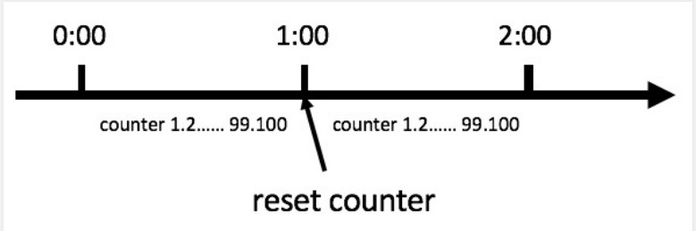
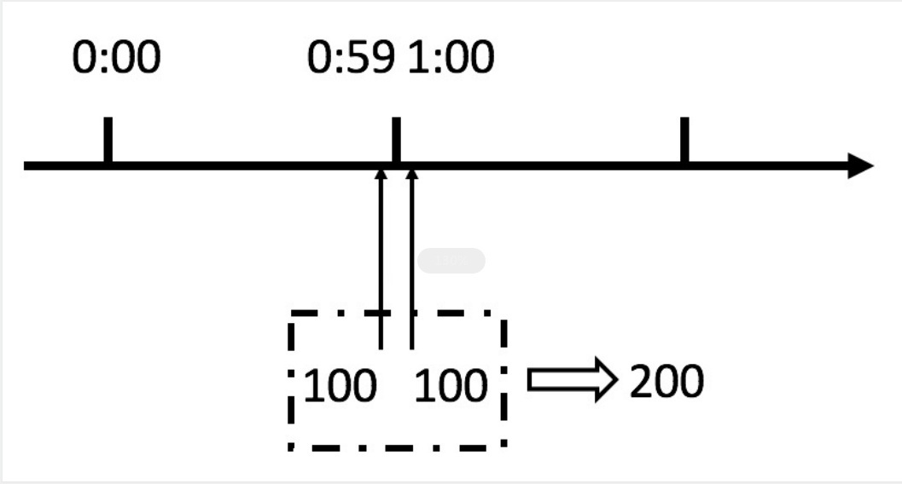
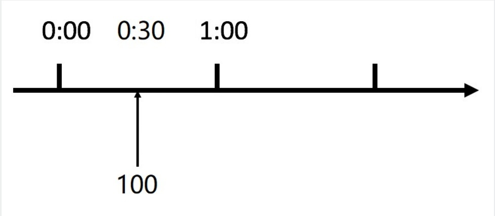
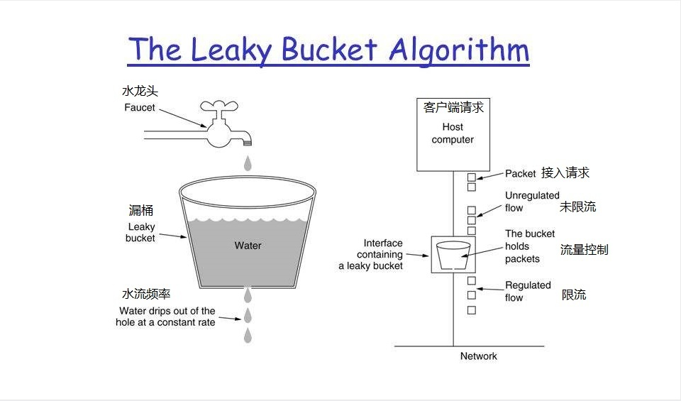
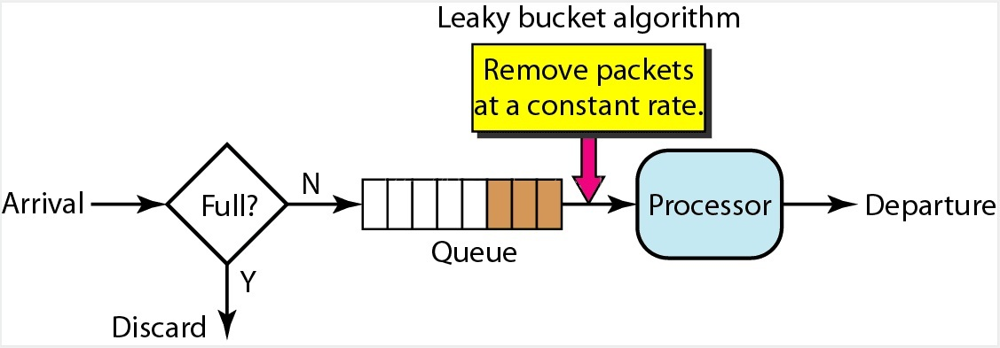
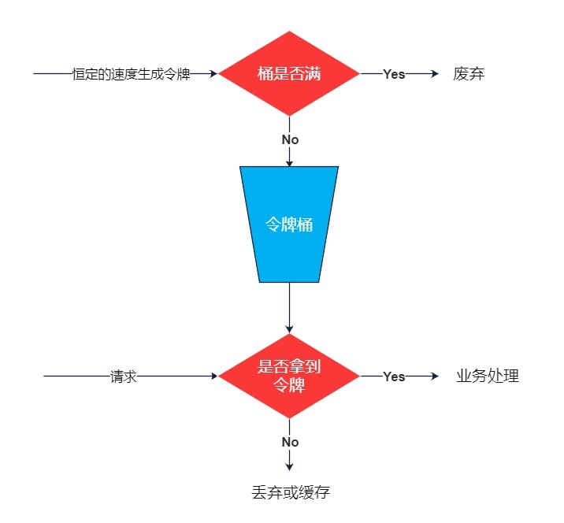
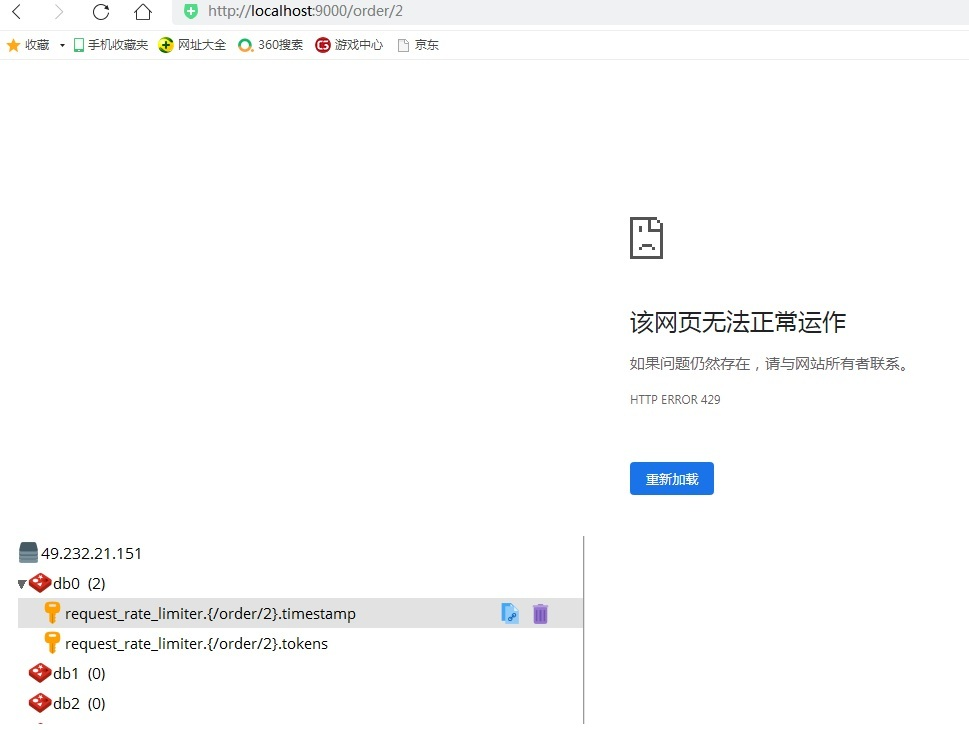
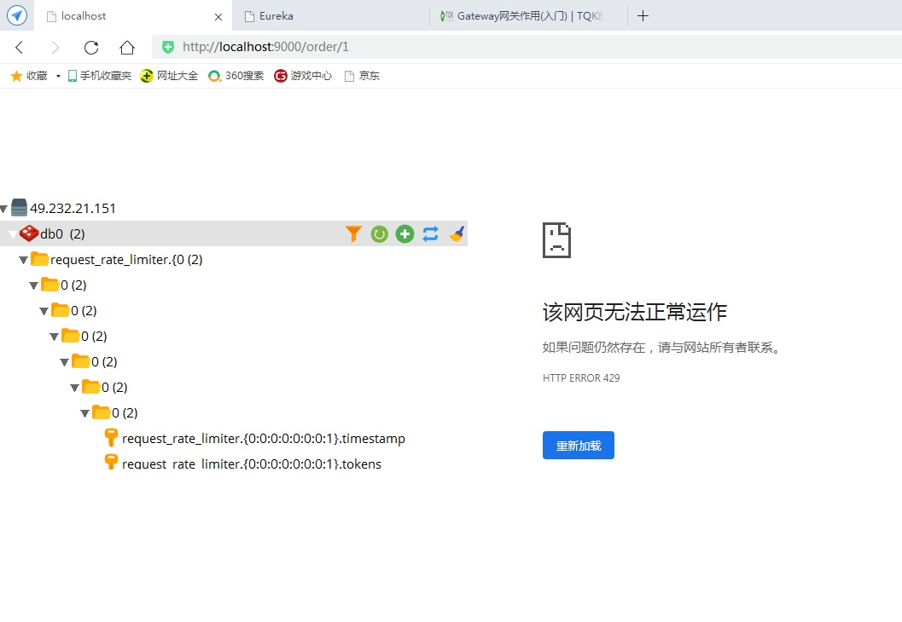
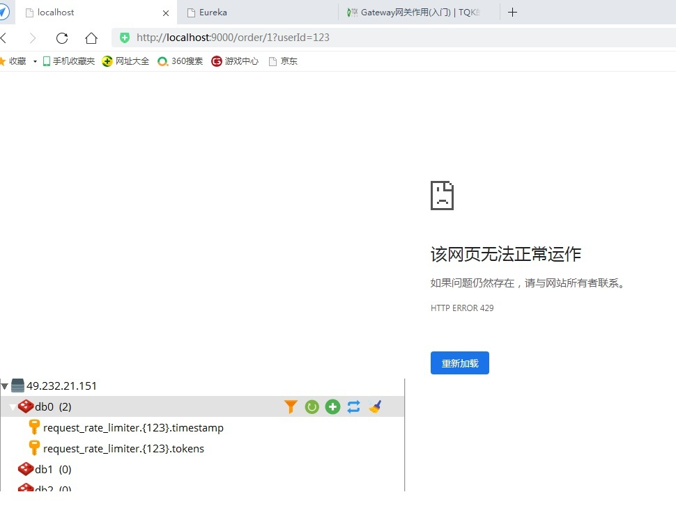

# 4. Gateway限流

## 4.1 网关限流简介及算法
顾名思义，限流就是限制流量，就像你宽带包有 1 个 G 的流量，用完了就没了。通过限流，我们可以很好地控制系统的<font color='red'>**QPS**</font>，从而达到保护系统的目的 
 
:::tip 为什么需要限流?
比如 Web 服务、对外 API，这种类型的服务有以下几种可能导致机器被拖垮：  
1. 用户增长过快（好事）  
2. 因为某个热点事件（微博热搜）  
3. 竞争对象爬虫  
4. 恶意的请求  
这些情况都是无法预知的，不知道什么时候会有 10 倍甚至 20 倍的流量打进来，如果真碰上这种情况，扩容是根本来不及的。
:::

:::tip 限流算法
<font color='red'>**计数器算法**</font>   
<font color='red'>**漏桶（Leaky Bucket）算法**</font>  
<font color='red'>**令牌桶（Token Bucket）算法**</font>   
:::

### 计数器算法
 
计数器算法是限流算法里最简单也是最容易实现的一种算法。比如我们规定，对于 A 接口来说，我们 1 分钟的
访问次数不能超过 100 个。那么我们可以这么做：在一开始的时候，我们可以设置一个计数器 counter，每当一个请
求过来的时候，counter 就加 1，如果 counter 的值大于 100 并且该请求与第一个请求的间隔时间还在 1 分钟之
内，触发限流；如果该请求与第一个请求的间隔时间大于 1 分钟，重置 counter 重新计数，具体算法的示意图如
下：
<a data-fancybox title="计数器算法" href="./image/jishuqisuanfa1.jpg"></a>
这个算法虽然简单，但是有一个十分致命的问题，那就是临界问题，我们看下图：

<a data-fancybox title="计数器算法" href="./image/jishuqisuanfa2.jpg"></a>
从上图中我们可以看到，假设有一个恶意用户，他在 0:59 时，瞬间发送了 100 个请求，并且 1:00 又瞬间发送
了 100 个请求，那么其实这个用户在 1 秒里面，瞬间发送了 200 个请求。我们刚才规定的是 1 分钟最多 100 个请
求，也就是每秒钟最多 1.7 个请求，用户通过在时间窗口的重置节点处突发请求， 可以瞬间超过我们的速率限制。
用户有可能通过算法的这个漏洞，瞬间压垮我们的应用。


还有资料浪费的问题存在，我们的预期想法是希望 100 个请求可以均匀分散在这一分钟内，假设 30s 以内我们
就请求上限了，那么剩余的半分钟服务器就会处于闲置状态，比如下图：
<a data-fancybox title="计数器算法" href="./image/jishuqisuanfa3.jpg"></a>


### 漏桶算法
 
 漏桶算法其实也很简单，可以粗略的认为就是注水漏水的过程，往桶中以任意速率流入水，以一定速率流出水，当水超过桶流量则丢弃，因为桶容量是不变的，保证了整体的速率。

 <a data-fancybox title="漏桶算法" href="./image/loutong.jpg"></a>

#### 漏桶算法是使用队列机制实现的
<a data-fancybox title="漏桶算法" href="./image/loutong2.jpg"></a>

**漏桶算法主要用途在于保护它人（服务），假设入水量很大，而出水量较慢，则会造成网关的资源堆积可能导致网关瘫痪。而目标服务可能是可以处理大量请求的，但是漏桶算法出水量缓慢反而造成服务那边的资源浪费**

### 令牌桶算法
 
令牌桶算法是对漏桶算法的一种改进，漏桶算法能够限制请求调用的速率，而令牌桶算法能够在限制调用的平均
速率的同时还允许一定程度的突发调用。在令牌桶算法中，存在一个桶，用来存放固定数量的令牌。算法中存在一种
机制，以一定的速率往桶中放令牌。每次请求调用需要先获取令牌，只有拿到令牌，才有机会继续执行，否则选择选
择等待可用的令牌、或者直接拒绝。放令牌这个动作是持续不断的进行，如果桶中令牌数达到上限，就丢弃令牌。


场景大概是这样的：桶中一直有大量的可用令牌，这时进来的请求可以直接拿到令牌执行，比如设置 QPS 为
100/s，那么限流器初始化完成一秒后，桶中就已经有 100 个令牌了，等服务启动完成对外提供服务时，该限
流器可以抵挡瞬时的 100 个请求。当桶中没有令牌时，请求会进行等待，最后相当于以一定的速率执行。
 
:::tip Spring Cloud Gateway 内部使用的就是该算法：
1. 所有的请求在处理之前都需要拿到一个可用的令牌才会被处理；
2. 根据限流大小，设置按照一定的速率往桶里添加令牌；
3. 桶设置最大的放置令牌限制，当桶满时、新添加的令牌就被丢弃或者拒绝；
4. 请求到达后首先要获取令牌桶中的令牌，拿着令牌才可以进行其他的业务逻辑，处理完业务逻辑之后，将令牌直接删除；
5. 令牌桶有最低限额，当桶中的令牌达到最低限额的时候，请求处理完之后将不会删除令牌，以此保证足够的限流。
:::
<a data-fancybox title="令牌桶算法" href="./image/lingpaitong.jpg"></a>
**漏桶算法主要用途在于保护它人，而令牌桶算法主要目的在于保护自己，将请求压力交由目标服务处理。假设突然进来很多请求，只要拿到令牌这些请求会瞬时被处理调用目标服务。**

## 4.2 Gateway 常用限流方式
 
 Spring Cloud Gateway 官方提供了 RequestRateLimiterGatewayFilterFactory 过滤器工厂，使用 Redis和 Lua 脚本实现了令牌桶的方式。


 官网文档：https://cloud.spring.io/spring-cloud-static/spring-cloud-gateway/2.2.1.RELEASE/reference/html/#the-redis-ratelimiter 具体实现逻辑在 RequestRateLimiterGatewayFilterFactory 类中， Lua 脚本在如下图所示的源码文件夹中：


### 添加依赖

```xml
<!-- spring data redis reactive 依赖 -->
<dependency>
    <groupId>org.springframework.boot</groupId>
    <artifactId>spring-boot-starter-data-redis-reactive</artifactId>
</dependency>
<!-- commons-pool2 对象池依赖 -->
<dependency>
    <groupId>org.apache.commons</groupId>
    <artifactId>commons-pool2</artifactId>
</dependency>
```
### URI 限流
 
**配置限流过滤器和限流过滤器引用的 bean 对象**
```yml
spring:
  application:
    name: gateway-server # 应用名称
  cloud:
    gateway:
      discovery:
        locator:
        # 是否与服务发现组件进行结合，通过 serviceId 转发到具体服务实例。
          enabled: true                           # 是否开启基于服务发现的路由规则
          lower-case-service-id: true      # 是否将服务名称转小写
      # 路由规则
      routes:
        - id: order-service                # 路由 ID，唯一
          uri: lb://order-service        # lb:// 根据服务名称从注册中心获取服务请求地址
          predicates:                   # 断言（判断条件）
            # 匹配对应 URL 的请求，将匹配到的请求追加在目标 URI 之后
            - Path=/order/**
          filters:                       # 网关过滤器
            - name: RequestRateLimiter
              args:
                redis-rate-limiter.replenishRate: 1 # 令牌桶每秒填充速率
                redis-rate-limiter.burstCapacity: 2 # 令牌桶总容量
                key-resolver: "#{@pathKeyResolver}" # 使用 SpEL 表达式按名称引用 bean
  # redis 缓存
  redis:
    timeout: 10000            # 连接超时时间
    host: 49.232.21.151   # Redis服务器地址
    port: 6379                  # Redis服务器端口
#    password: root            # Redis服务器密码
    database: 0                # 选择哪个库，默认0库
    lettuce:
      pool:
        max-active: 1024   # 最大连接数，默认 8
        max-wait: 10000    # 最大连接阻塞等待时间，单位毫秒，默认 -1
        max-idle: 200       # 最大空闲连接，默认 8
        min-idle: 5          # 最小空闲连接，默认 0
server:
  port: 9000

# 配置 Eureka Server 注册中心
eureka:
  instance:
    prefer-ip-address: true       # 是否使用 ip 地址注册
    instance-id: ${spring.cloud.client.ip-address}:${server.port} # ip:port
  client:
    service-url:                  # 设置服务注册中心地址
      defaultZone: http://localhost:8761/eureka/,http://localhost:8762/eureka/
```

**编写限流规则配置类**

```java
import org.springframework.cloud.gateway.filter.ratelimit.KeyResolver;
import org.springframework.context.annotation.Bean;
import org.springframework.context.annotation.Configuration;
import reactor.core.publisher.Mono;

/**
 * 限流规则配置类
 * @author Administrator
 */
@Configuration
public class KeyResolverConfiguration {
   /**
    * 限流规则
    *
    * @return
    */
         @Bean
    public KeyResolver pathKeyResolver() {
        /*
        return new KeyResolver() {
            @Override
            public Mono<String> resolve(ServerWebExchange exchange) {
                return Mono.just(exchange.getRequest().getPath().toString());
            }
        };
         */
        // JDK 1.8
        return exchange -> Mono.just(exchange.getRequest().getURI().getPath());
   }
}
```

<a>http://localhost:9000/order/2</a>


<a data-fancybox title="url限流" href="./image/urlfilters.jpg"></a>

### IP 限流
 
**配置限流过滤器和限流过滤器引用的 bean 对象**
```yml
spring:
  application:
    name: gateway-server # 应用名称
  cloud:
    gateway:
      discovery:
        locator:
        # 是否与服务发现组件进行结合，通过 serviceId 转发到具体服务实例。
          enabled: true                           # 是否开启基于服务发现的路由规则
          lower-case-service-id: true      # 是否将服务名称转小写
      # 路由规则
      routes:
        - id: product-service                # 路由 ID，唯一
          uri: lb://product-service         # lb:// 根据服务名称从注册中心获取服务请求地址
          predicates:                            # 断言（判断条件）
              # 匹配对应 URI 的请求，将匹配到的请求追加在目标 URI 之后
             - Path=/product/**, /api-gateway/**
          filters:                                 # 网关过滤器
             # 将 /api-gateway/product/1 重写为 /product/1
             - RewritePath=/api-gateway(?<segment>/?.*), $\{segment}
        - id: order-service                # 路由 ID，唯一
          uri: lb://order-service        # lb:// 根据服务名称从注册中心获取服务请求地址
          predicates:                   # 断言（判断条件）
            # 匹配对应 URL 的请求，将匹配到的请求追加在目标 URI 之后
            - Path=/order/**
          filters:                       # 网关过滤器
            - name: RequestRateLimiter
              args:
                redis-rate-limiter.replenishRate: 1 # 令牌桶每秒填充速率
                redis-rate-limiter.burstCapacity: 2 # 令牌桶总容量
                key-resolver: "#{@ipKeyResolver}" # 使用 SpEL 表达式按名称引用 bean
  # redis 缓存
  redis:
    timeout: 10000            # 连接超时时间
    host: 49.232.21.151   # Redis服务器地址
    port: 6379                  # Redis服务器端口
#    password: root            # Redis服务器密码
    database: 0                # 选择哪个库，默认0库
    lettuce:
      pool:
        max-active: 1024   # 最大连接数，默认 8
        max-wait: 10000    # 最大连接阻塞等待时间，单位毫秒，默认 -1
        max-idle: 200       # 最大空闲连接，默认 8
        min-idle: 5          # 最小空闲连接，默认 0
server:
  port: 9000

# 配置 Eureka Server 注册中心
eureka:
  instance:
    prefer-ip-address: true       # 是否使用 ip 地址注册
    instance-id: ${spring.cloud.client.ip-address}:${server.port} # ip:port
  client:
    service-url:                  # 设置服务注册中心地址
      defaultZone: http://localhost:8761/eureka/,http://localhost:8762/eureka/
```

**编写限流规则配置类**

```java

    /**
     * 根据 IP 限流
     *
     * @return
     */
    @Bean
    public KeyResolver ipKeyResolver() {
        return exchange -> Mono.just(exchange.getRequest().getRemoteAddress().getHostName());
    }
```
<a>http://localhost:9000/order/1</a>

<a data-fancybox title="IP限流" href="./image/IPfilter.jpg"></a>


### 参数 限流
 
**配置限流过滤器和限流过滤器引用的 bean 对象**
```yml
spring:
  application:
    name: gateway-server # 应用名称
  cloud:
    gateway:
      discovery:
        locator:
        # 是否与服务发现组件进行结合，通过 serviceId 转发到具体服务实例。
          enabled: true                           # 是否开启基于服务发现的路由规则
          lower-case-service-id: true      # 是否将服务名称转小写
      # 路由规则
      routes:
        - id: product-service                # 路由 ID，唯一
          uri: lb://product-service         # lb:// 根据服务名称从注册中心获取服务请求地址
          predicates:                            # 断言（判断条件）
              # 匹配对应 URI 的请求，将匹配到的请求追加在目标 URI 之后
             - Path=/product/**, /api-gateway/**
          filters:                                 # 网关过滤器
             # 将 /api-gateway/product/1 重写为 /product/1
             - RewritePath=/api-gateway(?<segment>/?.*), $\{segment}
        - id: order-service                # 路由 ID，唯一
          uri: lb://order-service        # lb:// 根据服务名称从注册中心获取服务请求地址
          predicates:                   # 断言（判断条件）
            # 匹配对应 URL 的请求，将匹配到的请求追加在目标 URI 之后
            - Path=/order/**
          filters:                       # 网关过滤器
            - name: RequestRateLimiter
              args:
                redis-rate-limiter.replenishRate: 1 # 令牌桶每秒填充速率
                redis-rate-limiter.burstCapacity: 2 # 令牌桶总容量
                key-resolver: "#{@parameterKeyResolver}" # 使用 SpEL 表达式按名称引用 bean

  # redis 缓存
  redis:
    timeout: 10000            # 连接超时时间
    host: 49.232.21.151   # Redis服务器地址
    port: 6379                  # Redis服务器端口
#    password: root            # Redis服务器密码
    database: 0                # 选择哪个库，默认0库
    lettuce:
      pool:
        max-active: 1024   # 最大连接数，默认 8
        max-wait: 10000    # 最大连接阻塞等待时间，单位毫秒，默认 -1
        max-idle: 200       # 最大空闲连接，默认 8
        min-idle: 5          # 最小空闲连接，默认 0
server:
  port: 9000

# 配置 Eureka Server 注册中心
eureka:
  instance:
    prefer-ip-address: true       # 是否使用 ip 地址注册
    instance-id: ${spring.cloud.client.ip-address}:${server.port} # ip:port
  client:
    service-url:                  # 设置服务注册中心地址
      defaultZone: http://localhost:8761/eureka/,http://localhost:8762/eureka/
```

**编写限流规则配置类**

```java
    /**
     * 根据参数限流
     *
     * @return
     */
    @Bean
    public KeyResolver parameterKeyResolver() {
        return exchange -> Mono.just(exchange.getRequest().getQueryParams().getFirst("userId"));
    }
```

<a>http://localhost:9000/order/1?userId=123 </a>
<a data-fancybox title="IP限流" href="./image/parameter.jpg"></a>
