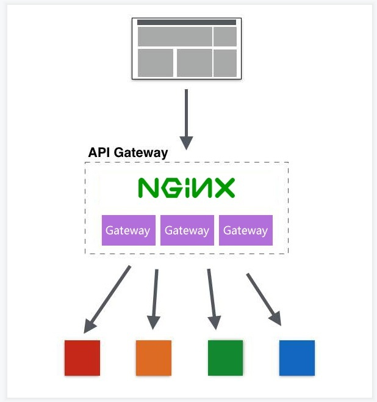

# 6. Gateway高可用网关环境

业内通常用多少个9标识网站的高可用性，例如QQ的可用性是4个9，就是说QQ能够保证在一年里，服务在99.99%的时间是可用的，只有0.01%的时间不可用，大约最多53分钟。
对于大多数网站，2个9是基本可用;3个9是高可用；4个9是拥有自动恢复能力的高可用。

:::tip
实现高可用的主要手段是**数据的冗余备份和服务的失效转移**，这两种手段具体可以怎么做呢，在网关里如何体现？
主要有以下几个方向：  
1. 集群部署
2. 负载均衡
3. 健康检查
4. 节点自动重启
5. 熔断
6. 服务降级
7. 接口重试
:::

## 6.1 Nginx+Gateway网关集群实现高可用网关

<a data-fancybox title="Nginx+Gateway网关集群实现高可用网关" href="./image/nginx+gateway.jpg"></a>
进入Nginx的conf目录打开nginx.conf配置文件，修改如下：

```cpp
http {
 ...
   # 网关集群
 upstream gateway {
 server 127.0.0.1:9000;
 server 127.0.0.1:9001;
 }
 
   server {
       listen       80;
       server_name localhost;
       ...
       # 代理网关集群，负载均衡调用
 location / {
           proxy_pass http://gateway;
       }
       ...
   }
    
   ...
    
}
```