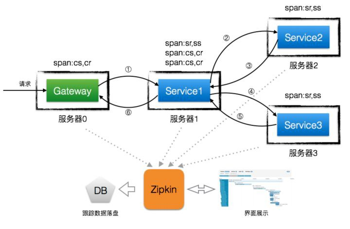
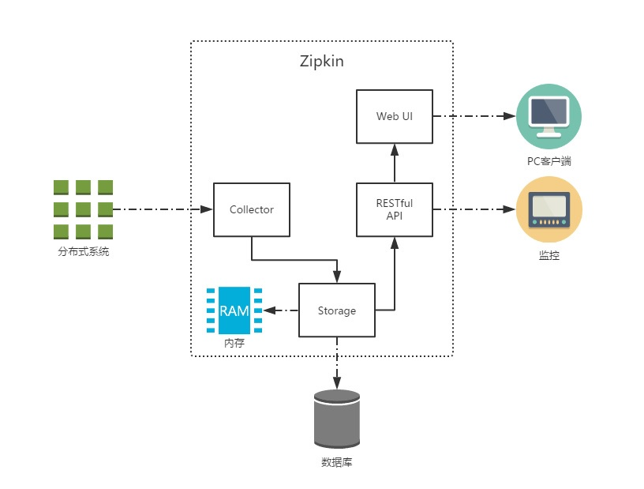
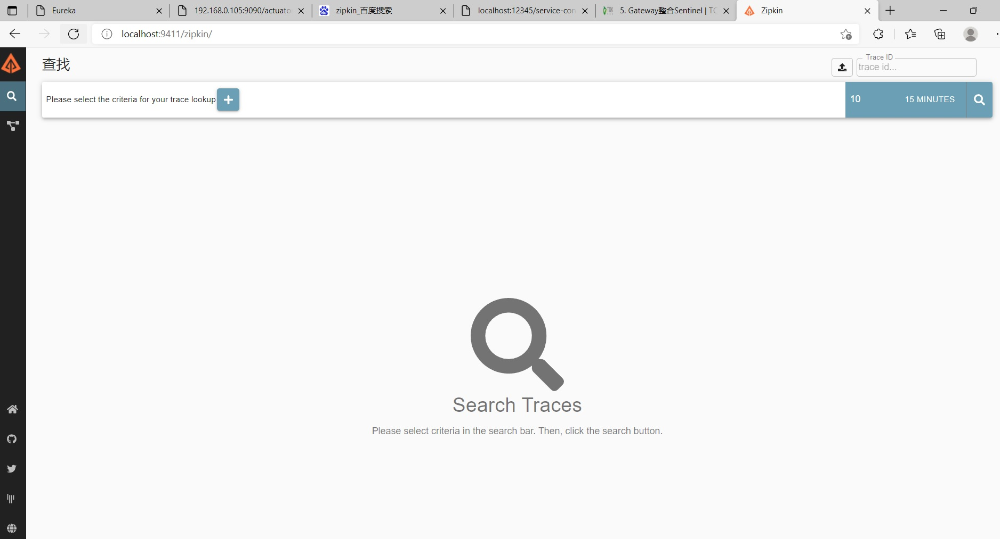
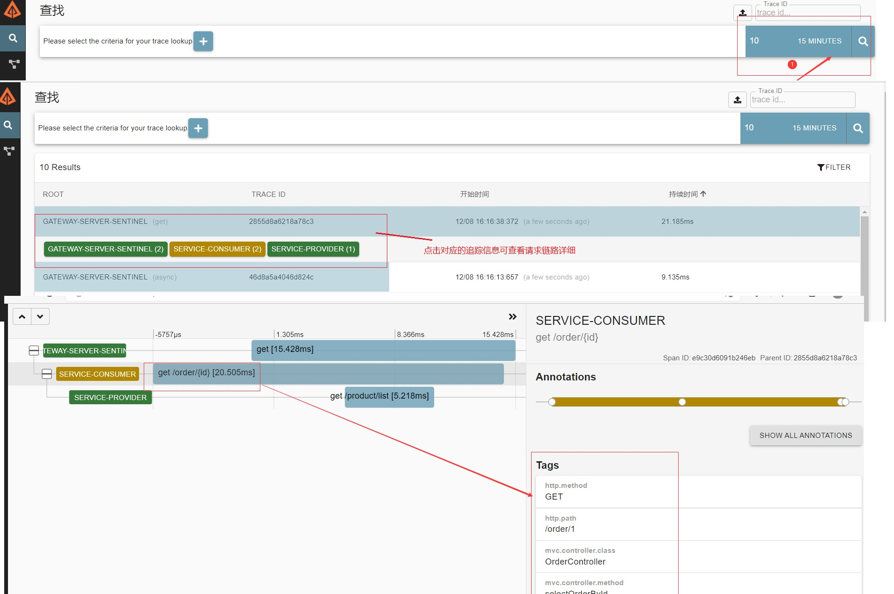
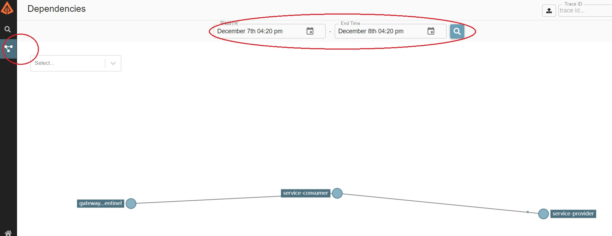

# 1. Zipkin 进行链路跟踪

## 1.1 什么是 Zipkin

Zipkin 是 Twitter 公司开发贡献的一款开源的分布式实时数据追踪系统（Distributed Tracking System），基于Google Dapper 的论文设计而来，其主要功能是聚集各个异构系统的实时监控数据。


它可以收集各个服务器上请求链路的跟踪数据，并通过 Rest API 接口来辅助我们查询跟踪数据，实现对分布式
系统的实时监控，及时发现系统中出现的延迟升高问题并找出系统性能瓶颈的根源。除了面向开发的 API 接口之外，
它还提供了方便的 UI 组件，每个服务向 Zipkin 报告计时数据，Zipkin 会根据调用关系生成依赖关系图，帮助我们直
观的搜索跟踪信息和分析请求链路明细。Zipkin 提供了可插拔数据存储方式：In-Memory、MySql、Cassandra 以
及 Elasticsearch。

分布式跟踪系统还有其他比较成熟的实现，例如：Naver 的 PinPoint、Apache 的 HTrace、阿里的鹰眼Tracing、京东的 Hydra、新浪的 Watchman，美团点评的 CAT，Apache 的 SkyWalking 等。

<a data-fancybox title="Zipkin" href="./image/zipkin.jpg"></a>

## 1.2 Zipkin工作原理


:::tip Zipkin四个组件

1. **Collector** ：收集器组件，处理从外部系统发送过来的跟踪信息，将这些信息转换为 Zipkin 内部处理的 Span格式，以支持后续的存储、分析、展示等功能。

2. **Storage** ：存储组件，处理收集器接收到的跟踪信息，默认将信息存储在内存中，可以修改存储策略使用其他存储组件，支持 MySQL，Elasticsearch 等。

3. **Web UI** ：UI 组件，基于 API 组件实现的上层应用，提供 Web 页面，用来展示 Zipkin 中的调用链和系统依赖关系等。

4. **RESTful API** ：API 组件，为 Web 界面提供查询存储中数据的接口
:::

<a data-fancybox title="Zipkin" href="./image/zipkin01.jpg"></a>


Zipkin 分为两端，一个是 Zipkin 服务端，一个是 Zipkin 客户端，客户端也就是微服务的应用，客户端会配置服务端的 URL 地址，一旦发生服务间的调用的时候，会被配置在微服务里面的 Sleuth 的监听器监听，并生成相应的Trace 和 Span 信息发送给服务端。发送的方式有两种，一种是消息总线的方式如 RabbitMQ 发送，还有一种是HTTP 报文的方式发送。


## 1.3 Zipkin服务端部署

### Zipkin下载启动
服务端是一个独立的可执行的 jar 包，
官方下载地址：<a herf='https://search.maven.org/remote_content?g=io.zipkin&a=zipkin-server&v=LATEST&c=exec'>https://search.maven.org/remote_content?g=io.zipkin&a=zipkin-server&v=LATEST&c=exec</a>，

使用 **java -jar zipkin.jar 命令启动，端口默认为 9411** 。我们下载的jar 包为：**zipkin-server-2.20.1-exec.jar**，启动命令如下：

```shell
java -jar zipkin-server-2.20.1-exec.jar
```
### 访问
访问：<a herf='http://localhost:9411/'>http://localhost:9411/</a> 结果如下：

目前最新版界面。
<a data-fancybox title="Zipkin" href="./image/zipkin02.jpg"></a>
-----------


## 1.4 Zipkin客户端部署

### 1.4.1 添加依赖

在需要进行链路追踪的项目中（服务网关、商品服务、订单服务）添加 spring-cloud-starter-zipkin 依赖

```xml
    <!-- spring cloud zipkin 依赖 -->
    <dependency>
            <groupId>org.springframework.cloud</groupId>
            <artifactId>spring-cloud-starter-zipkin</artifactId>
    </dependency>
```

### 1.4.2 配置文件

在需要进行链路追踪的项目中（服务网关、商品服务、订单服务）配置 Zipkin 服务端地址及数据传输方式。默认即如下配置。

```yml
spring:
  application:
    name:  service-provider # 应用名称(集群下相同)
  zipkin:
    base-url: http://localhost:9411/ # 服务端地址
    sender:
      type: web   # 数据传输方式，web 表示以 HTTP 报文的形式向服务端发送数据
  sleuth:
    sampler:
      probability: 1.0  # 收集数据百分比，默认 0.1（10%）
```

### 1.4.3 访问

访问：[http://localhost:12345/service-consumer/order/1] 结果如下：

<a data-fancybox title="Zipkin" href="./image/zipkin03.jpg"></a>

------------------------


<a data-fancybox title="Zipkin" href="./image/zipkin04.jpg"></a>
