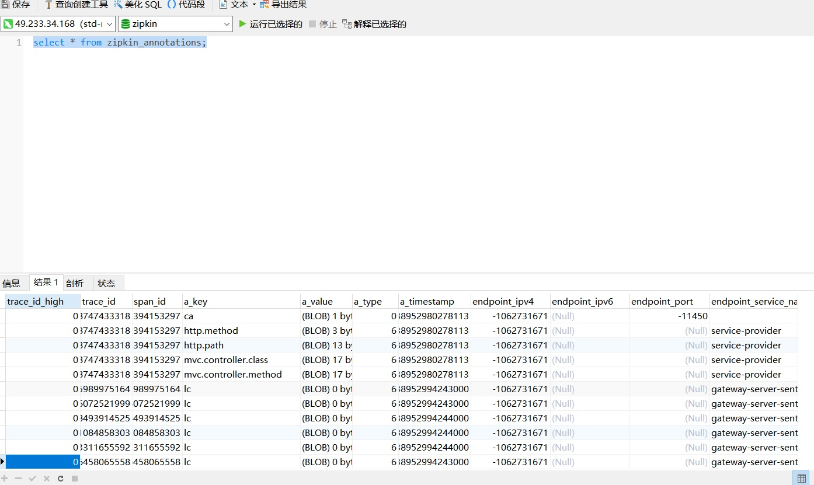
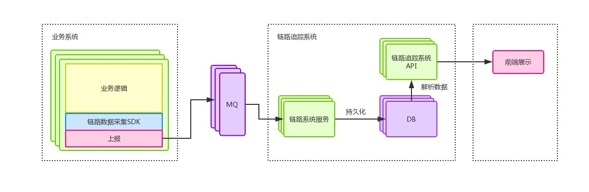
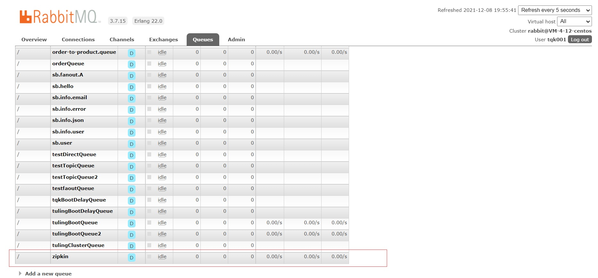

# 1. Zipkin 进行链路跟踪

## 1.1 什么是 Zipkin

Zipkin 是 Twitter 公司开发贡献的一款开源的分布式实时数据追踪系统（Distributed Tracking System），基于Google Dapper 的论文设计而来，其主要功能是聚集各个异构系统的实时监控数据。


它可以收集各个服务器上请求链路的跟踪数据，并通过 Rest API 接口来辅助我们查询跟踪数据，实现对分布式
系统的实时监控，及时发现系统中出现的延迟升高问题并找出系统性能瓶颈的根源。除了面向开发的 API 接口之外，
它还提供了方便的 UI 组件，每个服务向 Zipkin 报告计时数据，Zipkin 会根据调用关系生成依赖关系图，帮助我们直
观的搜索跟踪信息和分析请求链路明细。Zipkin 提供了可插拔数据存储方式：In-Memory、MySql、Cassandra 以
及 Elasticsearch。

分布式跟踪系统还有其他比较成熟的实现，例如：Naver 的 PinPoint、Apache 的 HTrace、阿里的鹰眼Tracing、京东的 Hydra、新浪的 Watchman，美团点评的 CAT，Apache 的 SkyWalking 等。

<a data-fancybox title="Zipkin" href="./image/zipkin.jpg"></a>

## 1.2 Zipkin工作原理


:::tip Zipkin四个组件

1. **Collector** ：收集器组件，处理从外部系统发送过来的跟踪信息，将这些信息转换为 Zipkin 内部处理的 Span格式，以支持后续的存储、分析、展示等功能。

2. **Storage** ：存储组件，处理收集器接收到的跟踪信息，默认将信息存储在内存中，可以修改存储策略使用其他存储组件，支持 MySQL，Elasticsearch 等。

3. **Web UI** ：UI 组件，基于 API 组件实现的上层应用，提供 Web 页面，用来展示 Zipkin 中的调用链和系统依赖关系等。

4. **RESTful API** ：API 组件，为 Web 界面提供查询存储中数据的接口
:::

<a data-fancybox title="Zipkin" href="./image/zipkin01.jpg"></a>


Zipkin 分为两端，一个是 Zipkin 服务端，一个是 Zipkin 客户端，客户端也就是微服务的应用，客户端会配置服务端的 URL 地址，一旦发生服务间的调用的时候，会被配置在微服务里面的 Sleuth 的监听器监听，并生成相应的Trace 和 Span 信息发送给服务端。发送的方式有两种，一种是消息总线的方式如 RabbitMQ 发送，还有一种是HTTP 报文的方式发送。


## 1.3 Zipkin服务端部署

### Zipkin下载启动
服务端是一个独立的可执行的 jar 包，
官方下载地址：<a herf='https://search.maven.org/remote_content?g=io.zipkin&a=zipkin-server&v=LATEST&c=exec'>https://search.maven.org/remote_content?g=io.zipkin&a=zipkin-server&v=LATEST&c=exec</a>，

使用 **java -jar zipkin.jar 命令启动，端口默认为 9411** 。我们下载的jar 包为：**zipkin-server-2.20.1-exec.jar**，启动命令如下：

```shell
java -jar zipkin-server-2.20.1-exec.jar
```
### 访问
访问：<a herf='http://localhost:9411/'>http://localhost:9411/</a> 结果如下：

目前最新版界面。
<a data-fancybox title="Zipkin" href="./image/zipkin02.jpg"></a>
-----------


## 1.4 Zipkin客户端部署

### 1.4.1 添加依赖

在需要进行链路追踪的项目中（服务网关、商品服务、订单服务）添加 spring-cloud-starter-zipkin 依赖

```xml
    <!-- spring cloud zipkin 依赖 -->
    <dependency>
            <groupId>org.springframework.cloud</groupId>
            <artifactId>spring-cloud-starter-zipkin</artifactId>
    </dependency>
```

### 1.4.2 配置文件

在需要进行链路追踪的项目中（服务网关、商品服务、订单服务）配置 Zipkin 服务端地址及数据传输方式。默认即如下配置。

```yml
spring:
  application:
    name:  service-provider # 应用名称(集群下相同)
  zipkin:
    base-url: http://localhost:9411/ # 服务端地址
    sender:
      type: web   # 数据传输方式，web 表示以 HTTP 报文的形式向服务端发送数据
  sleuth:
    sampler:
      probability: 1.0  # 收集数据百分比，默认 0.1（10%）
```

### 1.4.3 访问

访问：[http://localhost:12345/service-consumer/order/1] 结果如下：

<a data-fancybox title="Zipkin" href="./image/zipkin03.jpg"></a>

------------------------


<a data-fancybox title="Zipkin" href="./image/zipkin04.jpg"></a>


## 1.5 追踪数据持久化->MySQL

Zipkin Server 默认存储追踪数据至内存中，这种方式并不适合生产环境，一旦 Server 关闭重启或者服务崩溃，就会导致历史数据消失。Zipkin 支持修改存储策略使用其他存储组件，支持 MySQL，Elasticsearch 等

### 1.5.1 MySQL部署

打开 MySQL 数据库，创建 zipkin 库，执行以下 SQL 脚本。
```sql
--
-- Copyright 2015-2019 The OpenZipkin Authors
--
-- Licensed under the Apache License, Version 2.0 (the "License"); you may not use this file except
-- in compliance with the License. You may obtain a copy of the License at
--
-- http://www.apache.org/licenses/LICENSE-2.0
--
-- Unless required by applicable law or agreed to in writing, software distributed under the License
-- is distributed on an "AS IS" BASIS, WITHOUT WARRANTIES OR CONDITIONS OF ANY KIND, either express
-- or implied. See the License for the specific language governing permissions and limitations under
-- the License.
--

CREATE TABLE IF NOT EXISTS zipkin_spans (
  `trace_id_high` BIGINT NOT NULL DEFAULT 0 COMMENT 'If non zero, this means the trace uses 128 bit traceIds instead of 64 bit',
  `trace_id` BIGINT NOT NULL,
  `id` BIGINT NOT NULL,
  `name` VARCHAR(255) NOT NULL,
  `remote_service_name` VARCHAR(255),
  `parent_id` BIGINT,
  `debug` BIT(1),
  `start_ts` BIGINT COMMENT 'Span.timestamp(): epoch micros used for endTs query and to implement TTL',
  `duration` BIGINT COMMENT 'Span.duration(): micros used for minDuration and maxDuration query',
  PRIMARY KEY (`trace_id_high`, `trace_id`, `id`)
) ENGINE=InnoDB ROW_FORMAT=COMPRESSED CHARACTER SET=utf8 COLLATE utf8_general_ci;

ALTER TABLE zipkin_spans ADD INDEX(`trace_id_high`, `trace_id`) COMMENT 'for getTracesByIds';
ALTER TABLE zipkin_spans ADD INDEX(`name`) COMMENT 'for getTraces and getSpanNames';
ALTER TABLE zipkin_spans ADD INDEX(`remote_service_name`) COMMENT 'for getTraces and getRemoteServiceNames';
ALTER TABLE zipkin_spans ADD INDEX(`start_ts`) COMMENT 'for getTraces ordering and range';

CREATE TABLE IF NOT EXISTS zipkin_annotations (
  `trace_id_high` BIGINT NOT NULL DEFAULT 0 COMMENT 'If non zero, this means the trace uses 128 bit traceIds instead of 64 bit',
  `trace_id` BIGINT NOT NULL COMMENT 'coincides with zipkin_spans.trace_id',
  `span_id` BIGINT NOT NULL COMMENT 'coincides with zipkin_spans.id',
  `a_key` VARCHAR(255) NOT NULL COMMENT 'BinaryAnnotation.key or Annotation.value if type == -1',
  `a_value` BLOB COMMENT 'BinaryAnnotation.value(), which must be smaller than 64KB',
  `a_type` INT NOT NULL COMMENT 'BinaryAnnotation.type() or -1 if Annotation',
  `a_timestamp` BIGINT COMMENT 'Used to implement TTL; Annotation.timestamp or zipkin_spans.timestamp',
  `endpoint_ipv4` INT COMMENT 'Null when Binary/Annotation.endpoint is null',
  `endpoint_ipv6` BINARY(16) COMMENT 'Null when Binary/Annotation.endpoint is null, or no IPv6 address',
  `endpoint_port` SMALLINT COMMENT 'Null when Binary/Annotation.endpoint is null',
  `endpoint_service_name` VARCHAR(255) COMMENT 'Null when Binary/Annotation.endpoint is null'
) ENGINE=InnoDB ROW_FORMAT=COMPRESSED CHARACTER SET=utf8 COLLATE utf8_general_ci;

ALTER TABLE zipkin_annotations ADD UNIQUE KEY(`trace_id_high`, `trace_id`, `span_id`, `a_key`, `a_timestamp`) COMMENT 'Ignore insert on duplicate';
ALTER TABLE zipkin_annotations ADD INDEX(`trace_id_high`, `trace_id`, `span_id`) COMMENT 'for joining with zipkin_spans';
ALTER TABLE zipkin_annotations ADD INDEX(`trace_id_high`, `trace_id`) COMMENT 'for getTraces/ByIds';
ALTER TABLE zipkin_annotations ADD INDEX(`endpoint_service_name`) COMMENT 'for getTraces and getServiceNames';
ALTER TABLE zipkin_annotations ADD INDEX(`a_type`) COMMENT 'for getTraces and autocomplete values';
ALTER TABLE zipkin_annotations ADD INDEX(`a_key`) COMMENT 'for getTraces and autocomplete values';
ALTER TABLE zipkin_annotations ADD INDEX(`trace_id`, `span_id`, `a_key`) COMMENT 'for dependencies job';

CREATE TABLE IF NOT EXISTS zipkin_dependencies (
  `day` DATE NOT NULL,
  `parent` VARCHAR(255) NOT NULL,
  `child` VARCHAR(255) NOT NULL,
  `call_count` BIGINT,
  `error_count` BIGINT,
  PRIMARY KEY (`day`, `parent`, `child`)
) ENGINE=InnoDB ROW_FORMAT=COMPRESSED CHARACTER SET=utf8 COLLATE utf8_general_ci;
```
官网地址：<a herf='https://github.com/openzipkin/zipkin/blob/master/zipkin-storage/mysql-v1/src/main/resources/mysql.sql'>https://github.com/openzipkin/zipkin/blob/master/zipkin-storage/mysql-v1/src/main/resources/mysql.sql</a>

### 1.5.2 部署 Zipkin 服务端

添加启动参数，重新部署服务端：

```sh
java -jar zipkin-server-2.20.1-exec.jar --STORAGE_TYPE=mysql --MYSQL_HOST=49.233.34.168 --MYSQL_TCP_PORT=6699 --MYSQL_USER=root --MYSQL_PASS=12345@tqk --MYSQL_DB=zipkin
```

官网地址：<a herf='https://github.com/openzipkin/zipkin/blob/master/zipkin-server/src/main/resources/zipkin-server-shared.yml'>https://github.com/openzipkin/zipkin/blob/master/zipkin-server/src/main/resources/zipkin-server-shared.yml</a>


### 1.5.3 测试

访问：[http://localhost:12345/service-consumer/order/1] 结果如下：

<a data-fancybox title="Zipkin" href="./image/zipkin05.jpg"></a>

-----------------------------

**在 MySQL 模式下，每次启动服务端时，服务端会从数据库加载链路信息展示至 Web 界面**


## 1.6 Zipkin基于MQ存储链路信息至MySQL

**这里我们演示使用的是RabbitMQ，最好使用kafka**

```cpp
[http://110.42.146.236:15672/#/]

user: tqk001
Password 12345@tqk
```
____________________________________________________________________________


### 1.6.1 部署 Zipkin 服务端

添加启动参数，重新部署服务端：

```shell
java -jar zipkin-server-2.20.1-exec.jar --STORAGE_TYPE=mysql --MYSQL_HOST=49.233.34.168 --MYSQL_TCP_PORT=6699 --MYSQL_USER=root --MYSQL_PASS=12345@tqk --MYSQL_DB=zipkin --RABBIT_ADDRESSES=110.42.146.236:5672 --RABBIT_USER=tqk001 --RABBIT_PASSWORD=12345@tqk --RABBIT_VIRTUAL_HOST=/ --RABBIT_QUEUE=zipkin
```
<a data-fancybox title="Zipkin" href="./image/zipkin09.jpg"></a>

启动完毕之后查看 RabbitMq查看zipkin已否已建好

官网地址：[https://github.com/openzipkin/zipkin/blob/master/zipkin-server/src/main/resources/zipkin-server-shared.yml]
<a data-fancybox title="Zipkin" href="./image/zipkin06.jpg"></a>


启动参数中包含 MySQL 和 RabbitMQ 的配置，实现基于 MQ 并存储链路信息至 MySQL，如下图:
### 1.6.2 客户端添加依赖
```xml
    <!-- 消息队列通用依赖 -->
    <dependency>
        <groupId>org.springframework.amqp</groupId>
        <artifactId>spring-rabbit</artifactId>
    </dependency>
```

### 1.6.3 客户端配置文件
```yml
spring:
  application:
    name: service-provider # 应用名称(集群下相同)
  zipkin:
    base-url: http://localhost:9411/ # 服务端地址
    sender:
      type: rabbit
    rabbitmq:
      queue: zipkin         # 队列名称
  rabbitmq:
    host: 110.42.146.236       # 服务器 IP
    port: 5672            # 服务器端口
    username: tqk001         # 用户名
    password: 12345@tqk         # 密码
    virtual-host: /         # 虚拟主机地址
    listener:
      direct:
        retry:
          enabled: true       # 是否开启发布重试
          max-attempts: 5      # 最大重试次数
          initial-interval: 5000   # 重试间隔时间（单位毫秒）
      simple:
        retry:
          enabled: true       # 是否开启消费者重试
          max-attempts: 5      # 最大重试次数
          initial-interval: 5000   # 重试间隔时间（单位毫秒）
  sleuth:
    sampler:
      probability: 1.0        # 收集数据百分比，默认 0.1（10%）
```

### 1.6.4 测试
先关闭 Zipkin 服务端，
[http://localhost:12345/service-consumer/order/1]

**客户端已将链路追踪数据写入队列当中**
<a data-fancybox title="Zipkin" href="./image/zipkin04.jpg"></a>

**启动 Zipkin 服务端后，队列中消息被消费**
<a data-fancybox title="Zipkin" href="./image/zipkin04.jpg"></a>

**链路追踪数据被存储至 MySQL**

## 1.7 Zipkin基于MQ存储链路信息至ELK

