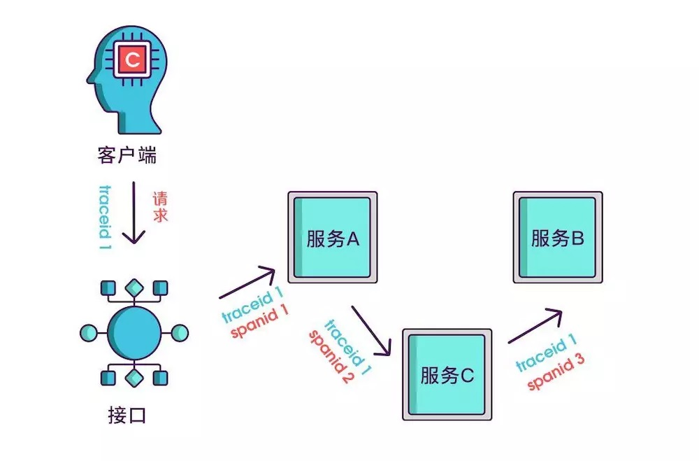
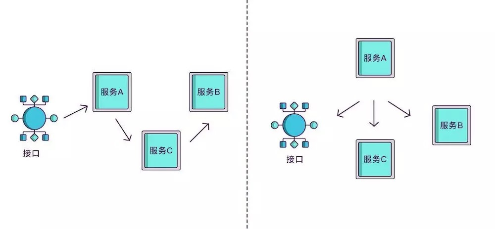
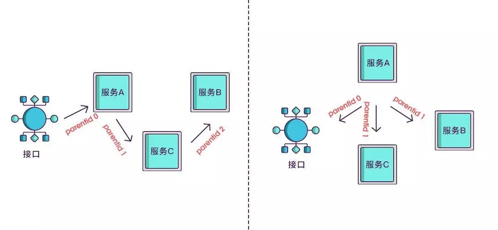
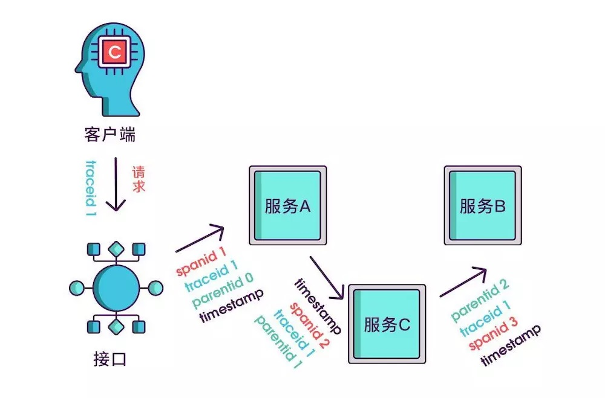
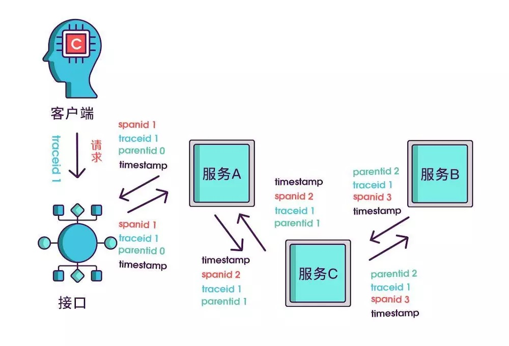
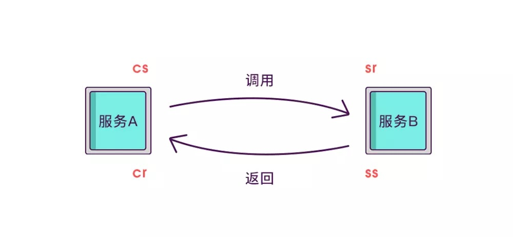
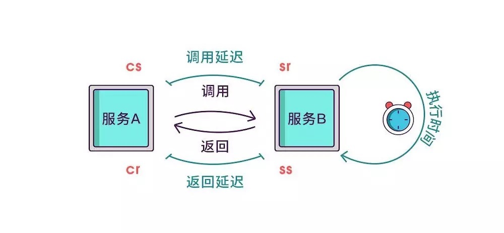

# 1. 链路追踪简介

## 1.1 什么是链路追踪

单纯的理解**链路追踪，就是指一次任务的开始到结束，期间调用的所有系统及耗时（时间跨度）都可以完整记录下来**

“链路追踪”一词是在 2010 年提出的，当时谷歌发布了一篇 Dapper 论文：Dapper，大规模分布式系统的跟踪系统，介绍了谷歌自研的分布式链路追踪的实现原理，还介绍了他们是怎么低成本实现对应用透明的。

除了谷歌的 Dapper，还有一些其他比较有名的产品，比如阿里的鹰眼、大众点评的 CAT、Twitter 的 Zipkin、Naver（著名社交软件LINE的母公司）的 PinPoint 以及国产开源的 SkyWalking（已贡献给 Apache） 等。

## 1.2 什么是 Sleuth

Spring Cloud Sleuth 为 Spring Cloud 实现了分布式跟踪解决方案。兼容 Zipkin，HTrace 和其他基于日志的追踪系统，例如 ELK（Elasticsearch 、Logstash、 Kibana）。

:::tip Spring Cloud Sleuth 提供了以下功能：
1. **链路追踪** ：通过 Sleuth 可以很清楚的看出一个请求都经过了那些服务，可以很方便的理清服务间的调用关系等。
2. **性能分析** ：通过 Sleuth 可以很方便的看出每个采样请求的耗时，分析哪些服务调用比较耗时，当服务调用的耗时随着请求量的增大而增大时， 可以对服务的扩容提供一定的提醒。
3. **数据分析，优化链路** ：对于频繁调用一个服务，或并行调用等，可以针对业务做一些优化措施。
4. **可视化错误** ：对于程序未捕获的异常，可以配合 Zipkin 查看。
:::

### 1.2.1 专业术语介绍

```json
{
      "traceId": "bd7a977555f6b982",
      "name": "get-traces",
      "id": "ebf33e1a81dc6f71",
      "parentId": "bd7a977555f6b982",
      "timestamp": 1458702548478000,
      "duration": 354374,
      "annotations": [
        {
          "endpoint": {
            "serviceName": "zipkin-query",
            "ipv4": "192.168.1.2",
            "port": 9411
          },
          "timestamp": 1458702548786000,
          "value": "cs"
        }
      ],
      "binaryAnnotations": [
        {
          "key": "lc",
          "value": "JDBCSpanStore",
          "endpoint": {
            "serviceName": "zipkin-query",
            "ipv4": "192.168.1.2",
            "port": 9411
          }
        }
      ]
}
```

------------------

1. traceId：标记一次请求的跟踪，相关的Spans都有相同的traceId；
2. id：span id；
3. name：span的名称，一般是接口方法的名称；
4. parentId：可选的id，当前Span的父Span id，通过parentId来保证Span之间的依赖关系，如果没有parentId，表示当前Span为根Span；
5. timestamp：Span创建时的时间戳，使用的单位是微秒（而不是毫秒），所有时间戳都有错误，包括主机之间的时钟偏差以及时间服务重新设置时钟的可能性，出于这个原因，Span应尽可能记录其duration；
6. duration：持续时间使用的单位是微秒（而不是毫秒）；
7. annotations：注释用于及时记录事件；有一组核心注释用于定义RPC请求的开始和结束；
    :::tip 记录事件
    cs:Client Send，客户端发起请求；
    sr:Server Receive，服务器接受请求，开始处理；
    ss:Server Send，服务器完成处理，给客户端应答；
    cr:Client Receive，客户端接受应答从服务器；
    :::

8. binaryAnnotations：二进制注释，旨在提供有关RPC的额外信息。

3. Transport
收集的Spans必须从被追踪的服务运输到Zipkin collector，有三个主要的传输方式：HTTP, Kafka和Scribe


### 1.2.2 Sleuth实现原理

如果想知道一个接口在哪个环节出现了问题，就必须清楚该接口调用了哪些服务，以及调用的顺序，如果把这些服务串起来，看起来就像链条一样，我们称其为调用链。

<a data-fancybox title="Sleuth实现原理" href="./image/sleuth01.jpg"></a>

想要实现调用链，就要为每次调用做个标识，然后将服务按标识大小排列，可以更清晰地看出调用顺序，我们暂且将该标识命名为<font color='red'><strong>spanid</strong></font>

<a data-fancybox title="Sleuth实现原理" href="./image/sleuth02.jpg"></a>

________________________________________

实际场景中，我们需要知道某次请求调用的情况，所以只有 spanid 还不够，得为每次请求做个唯一标识，这样才能根据标识查出本次请求调用的所有服务，而这个标识我们命名为 <font color='red'><strong>traceid</strong></font>

<a data-fancybox title="Sleuth实现原理" href="./image/sleuth03.jpg"></a>

____________________

现在根据 spanid 可以轻易地知道被调用服务的先后顺序，但无法体现调用的层级关系，正如下图所示，多个服务可能是逐级调用的链条，也可能是同时被同一个服务调用。

<a data-fancybox title="Sleuth实现原理" href="./image/sleuth04.jpg"></a>
所以应该每次都记录下是谁调用的，我们用 <font color='red'><strong>parentid</strong></font> 作为这个标识的名字。

<a data-fancybox title="Sleuth实现原理" href="./image/sleuth05.jpg"></a>


到现在，已经知道调用顺序和层级关系了，但是接口出现问题后，还是不能找到出问题的环节，如果某个服务有问题，那个被调用执行的服务一定耗时很长，要想计算出耗时，上述的三个标识还不够，还需要加上**时间戳，时间戳可以更精细一点，精确到微秒级**。

<a data-fancybox title="Sleuth实现原理" href="./image/sleuth06.jpg"></a>


**只记录发起调用时的时间戳还算不出耗时，要记录下服务返回时的时间戳，有始有终才能算出时间差**，既然返回的也记了，就把上述的三个标识都记一下吧，不然区分不出是谁的时间戳。

<a data-fancybox title="Sleuth实现原理" href="./image/sleuth07.jpg"></a>

虽然能计算出从服务调用到服务返回的总耗时，但是这个时间包含了服务的执行时间和网络延迟，有时候我们需
要区分出这两类时间以方便做针对性优化。那如何计算网络延迟呢？我们可以把调用和返回的过程分为以下四个事件。

1. Client Sent 简称 cs，客户端发起调用请求到服务端。
2. Server Received 简称 sr，指服务端接收到了客户端的调用请求。
3. Server Sent 简称 ss，指服务端完成了处理，准备将信息返给客户端。
4. Client Received 简称 cr，指客户端接收到了服务端的返回信息。

<a data-fancybox title="Sleuth实现原理" href="./image/sleuth08.jpg"></a>

假如在这四个事件发生时记录下时间戳，就可以轻松计算出耗时，比如 sr 减去 cs 就是调用时的网络延迟，ss 减 去 sr 就是服务执行时间，cr 减去 ss 就是服务响应的延迟，cr 减 cs 就是整个服务调用执行的时间。

<a data-fancybox title="Sleuth实现原理" href="./image/sleuth09.jpg"></a>

其实 span 内除了记录这几个参数之外，还可以记录一些其他信息，比如发起调用服务名称、被调服务名称、返回结果、IP、调用服务的名称等，最后，我们再把相同 parentid 的 span 信息合成一个大的 span 块，就完成了一个完整的调用链。感谢张以诺制作的实现原理图。


## 1.3 Sleuth入门案例


### 1.3.1 添加依赖

```xml
    <!-- spring cloud sleuth 链路追踪依赖 -->
    <dependency>
        <groupId>org.springframework.cloud</groupId>
        <artifactId>spring-cloud-starter-sleuth</artifactId>
    </dependency>
```

### 1.3.2 记录日志

在需要链路追踪的项目中添加 logback.xml 日志文件，内容如下（logback **日志的输出级别需要是 DEBUG 级别**）：
 
**注意修改项目名称** 
 ```xml
 <property name="log.path" value="${catalina.base}/gateway-server/logs"/>
 ``` 

 ---------------

** 日志核心配置**：

```log 
 %d{yyyy-MM-dd HH:mm:ss.SSS} [${applicationName},%X{X-B3-TraceId:-},%X{X-B3-SpanId:-}] [%thread] %-5level %logger{50} - %msg%n
```


_______________________

```xml
<?xml version="1.0" encoding="UTF-8"?>
<!-- 日志级别从低到高分为TRACE < DEBUG < INFO < WARN < ERROR < FATAL，如果设置为WARN，则低于WARN的信息都不会输出 -->
<!-- scan: 当此属性设置为true时，配置文件如果发生改变，将会被重新加载，默认值为true -->
<!-- scanPeriod: 设置监测配置文件是否有修改的时间间隔，如果没有给出时间单位，默认单位是毫秒。当scan为true时，此属性生效。默认的时间间隔为1分钟。 -->
<!-- debug: 当此属性设置为true时，将打印出logback内部日志信息，实时查看logback运行状态。默认值为false。 -->
<configuration scan="true" scanPeriod="10 seconds">
     <!-- 日志上下文名称 -->
     <contextName>my_logback</contextName>
     <!-- name的值是变量的名称，value的值是变量定义的值。通过定义的值会被插入到logger上下文中。定义变量后，可以使“${}”来使用变量。 -->
     <property name="log.path" value="${catalina.base}/Service-Consumer/logs"/>
     <!-- 加载 Spring 配置文件信息 -->
     <springProperty scope="context" name="applicationName" source="spring.application.name" defaultValue="localhost"/>
     <!-- 日志输出格式 -->
    <property name="LOG_PATTERN" value="%d{yyyy-MM-dd HH:mm:ss.SSS} [${applicationName},%X{X-B3-TraceId:-},%X{X-B3-SpanId:-}] [%thread] %-5level %logger{50} - %msg%n"/>
     <!--输出到控制台-->
    <appender name="CONSOLE" class="ch.qos.logback.core.ConsoleAppender">
       <!--此日志appender是为开发使用，只配置最底级别，控制台输出的日志级别是大于或等于此级别的日志信息-->
        <filter class="ch.qos.logback.classic.filter.ThresholdFilter">
          <level>DEBUG</level>
        </filter>
        <encoder>
          <pattern>${LOG_PATTERN}</pattern>
          <!-- 设置字符集 -->
            <charset>UTF-8</charset>
        </encoder>
    </appender>
         <!-- 输出到文件 -->
         <!-- 时间滚动输出 level为 DEBUG 日志 -->
<appender name="DEBUG_FILE" class="ch.qos.logback.core.rolling.RollingFileAppender">
   <!-- 正在记录的日志文件的路径及文件名 -->
   <file>${log.path}/log_debug.log</file>
   <!--日志文件输出格式-->
   <encoder>
     <pattern>${LOG_PATTERN}</pattern>
     <charset>UTF-8</charset> <!-- 设置字符集 -->
   </encoder>
   <!-- 日志记录器的滚动策略，按日期，按大小记录 -->
   <rollingPolicy class="ch.qos.logback.core.rolling.TimeBasedRollingPolicy">
         <!-- 日志归档 -->
         <fileNamePattern>${log.path}/debug/log-debug-%d{yyyy-MM-dd}.%i.log</fileNamePattern>
         <timeBasedFileNamingAndTriggeringPolicy class="ch.qos.logback.core.rolling.SizeAndTimeBasedFNATP">
           <maxFileSize>100MB</maxFileSize>
         </timeBasedFileNamingAndTriggeringPolicy>
         <!--日志文件保留天数-->
         <maxHistory>15</maxHistory>
   </rollingPolicy>
   <!-- 此日志文件只记录debug级别的 -->
   <filter class="ch.qos.logback.classic.filter.LevelFilter">
     <level>DEBUG</level>
     <onMatch>ACCEPT</onMatch>
     <onMismatch>DENY</onMismatch>
   </filter>
 </appender>
    <!-- 时间滚动输出 level为 INFO 日志 -->
    <appender name="INFO_FILE" class="ch.qos.logback.core.rolling.RollingFileAppender">
   <!-- 正在记录的日志文件的路径及文件名 -->
   <file>${log.path}/log_info.log</file>
   <!--日志文件输出格式-->
    <encoder>
         <pattern>${LOG_PATTERN}</pattern>
         <charset>UTF-8</charset>
    </encoder>
   <!-- 日志记录器的滚动策略，按日期，按大小记录 -->
    <rollingPolicy class="ch.qos.logback.core.rolling.TimeBasedRollingPolicy">
         <!-- 每天日志归档路径以及格式 -->
         <fileNamePattern>${log.path}/info/log-info-%d{yyyy-MM-dd}.%i.log</fileNamePattern>
         <timeBasedFileNamingAndTriggeringPolicy class="ch.qos.logback.core.rolling.SizeAndTimeBasedFNATP">
           <maxFileSize>100MB</maxFileSize>
         </timeBasedFileNamingAndTriggeringPolicy>
         <!--日志文件保留天数-->
         <maxHistory>15</maxHistory>
    </rollingPolicy>
    <!-- 此日志文件只记录info级别的 -->
    <filter class="ch.qos.logback.classic.filter.LevelFilter">
     <level>INFO</level>
     <onMatch>ACCEPT</onMatch>
     <onMismatch>DENY</onMismatch>
    </filter>
 </appender>
    <!-- 时间滚动输出 level为 WARN 日志 -->
<appender name="WARN_FILE" class="ch.qos.logback.core.rolling.RollingFileAppender">
   <!-- 正在记录的日志文件的路径及文件名 -->
   <file>${log.path}/log_warn.log</file>
   <!--日志文件输出格式-->
   <encoder>
         <pattern>${LOG_PATTERN}</pattern>
         <charset>UTF-8</charset> <!-- 此处设置字符集 -->
       </encoder>
   <!-- 日志记录器的滚动策略，按日期，按大小记录 -->
   <rollingPolicy class="ch.qos.logback.core.rolling.TimeBasedRollingPolicy">
         <fileNamePattern>${log.path}/warn/log-warn-%d{yyyy-MM-dd}.%i.log</fileNamePattern>
         <!-- 每个日志文件最大100MB -->
         <timeBasedFileNamingAndTriggeringPolicy
        class="ch.qos.logback.core.rolling.SizeAndTimeBasedFNATP">
           <maxFileSize>100MB</maxFileSize>
         </timeBasedFileNamingAndTriggeringPolicy>
         <!--日志文件保留天数-->
         <maxHistory>15</maxHistory>
       </rollingPolicy>
   <!-- 此日志文件只记录warn级别的 -->
   <filter class="ch.qos.logback.classic.filter.LevelFilter">
         <level>WARN</level>
         <onMatch>ACCEPT</onMatch>
         <onMismatch>DENY</onMismatch>
       </filter>
 </appender>
    <!-- 时间滚动输出 level为 ERROR 日志 -->
<appender name="ERROR_FILE" class="ch.qos.logback.core.rolling.RollingFileAppender">
   <!-- 正在记录的日志文件的路径及文件名 -->
   <file>${log.path}/log_error.log</file>
   <!--日志文件输出格式-->
   <encoder>
         <pattern>${LOG_PATTERN}</pattern>
         <charset>UTF-8</charset> <!-- 此处设置字符集 -->
       </encoder>
   <!-- 日志记录器的滚动策略，按日期，按大小记录 -->
   <rollingPolicy class="ch.qos.logback.core.rolling.TimeBasedRollingPolicy">
         <fileNamePattern>${log.path}/error/log-error-%d{yyyy-MM-dd}.%i.log</fileNamePattern>
         <timeBasedFileNamingAndTriggeringPolicy class="ch.qos.logback.core.rolling.SizeAndTimeBasedFNATP">
           <maxFileSize>100MB</maxFileSize>
         </timeBasedFileNamingAndTriggeringPolicy>
         <!--日志文件保留天数-->
         <maxHistory>15</maxHistory>
         <!-- 日志量最大 10 GB -->
         <totalSizeCap>10GB</totalSizeCap>
   </rollingPolicy>
   <!-- 此日志文件只记录ERROR级别的 -->
   <filter class="ch.qos.logback.classic.filter.LevelFilter">
         <level>ERROR</level>
         <onMatch>ACCEPT</onMatch>
         <onMismatch>DENY</onMismatch>
   </filter>
 </appender>
         <!-- 对于类路径以 com.example.logback 开头的Logger,输出级别设置为warn,并且只输出到控制台 -->
         <!-- 这个logger没有指定appender，它会继承root节点中定义的那些appender -->
         <!-- <logger name="com.example.logback" level="warn"/> -->
         <!--通过 LoggerFactory.getLogger("myLog") 可以获取到这个logger-->
         <!--由于这个logger自动继承了root的appender，root中已经有stdout的appender了，自己这边又引入了
stdout的appender-->
         <!--如果没有设置 additivity="false" ,就会导致一条日志在控制台输出两次的情况-->
         <!--additivity表示要不要使用rootLogger配置的appender进行输出-->
     <logger name="myLog" level="INFO" additivity="false">
        <appender-ref ref="CONSOLE"/>
     </logger>
     <!-- 日志输出级别及方式 -->
    <root level="DEBUG">
       <appender-ref ref="CONSOLE"/>
       <appender-ref ref="DEBUG_FILE"/>
       <appender-ref ref="INFO_FILE"/>
       <appender-ref ref="WARN_FILE"/>
       <appender-ref ref="ERROR_FILE"/>
     </root>
</configuration>
```

### 1.3.3 访问测试

访问测试： [http://localhost:12345/service-consumer/order/1] 

```log
2021-12-08 15:27:35.125 [gateway-server-sentinel,871288b178fb2818,871288b178fb2818] [reactor-http-nio-2] DEBUG o.s.c.gateway.handler.RoutePredicateHandlerMapping - Route matched:

2021-12-08 15:27:35.797  [service-consumer,871288b178fb2818,bba68f916c566fe1] [http-nio-9090-exec-1] DEBUG org.springframework.web.client.RestTemplate -  HTTP GET http://192.168.0.105:7070/product/list

2021-12-08 15:27:35.938 [service-provider,871288b178fb2818,f6e18e7e7055ebfc] [http-nio-7070-exec-1] DEBUG o.s.w.s.m.m.a.RequestResponseBodyMethodProcessor - Using 'application/json', given [application/json,
```

