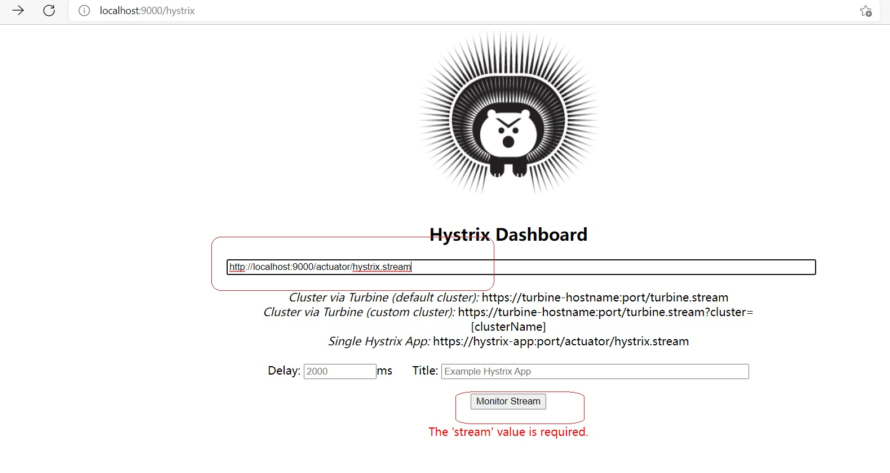
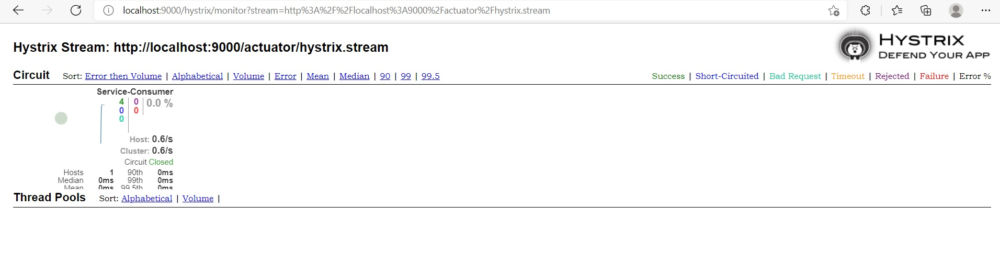
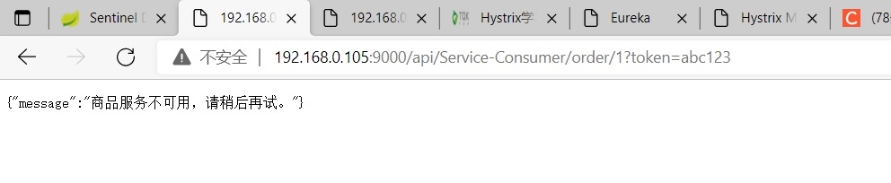

# 5. Zuul整合Hystrix

在 Spring Cloud 中，Zuul 启动器中包含了 Hystrix 相关依赖，在 Zuul 网关工程中，默认是提供了 Hystrix
Dashboard 服务监控数据的(hystrix.stream)，但是不会提供监控面板的界面展示。在 Spring Cloud 中，Zuul 和
Hystrix 是无缝结合的，我们可以非常方便的实现网关容错处理。

## 5.1 网关监控

Zuul 的依赖中包含了 Hystrix 的相关 jar 包，所以我们不需要在项目中额外添加 Hystrix 的依赖。但是需要开启数据监控的项目中要添加 dashboard 依赖

### 5.1.1 配置文件

```yml
# 度量指标监控与健康检查
management:
  endpoints:
   web:
    exposure:
     include: hystrix.stream
```
### 5.1.2 启动类

在需要开启数据监控的项目启动类中添加 @EnableHystrixDashboard 注解

```java
package com.tqk;

import org.springframework.boot.SpringApplication;
import org.springframework.boot.autoconfigure.SpringBootApplication;
import org.springframework.cloud.netflix.eureka.EnableEurekaClient;
import org.springframework.cloud.netflix.hystrix.dashboard.EnableHystrixDashboard;
import org.springframework.cloud.netflix.zuul.EnableZuulProxy;

@SpringBootApplication
// 开启 Zuul 注解
@EnableZuulProxy
// 开启 EurekaClient 注解，目前版本如果配置了 Eureka 注册中心，默认会开启该注解
@EnableEurekaClient
// 开启数据监控注解
@EnableHystrixDashboard
public class ZuulServerApplication {

    public static void main(String[] args) {
        SpringApplication.run(ZuulServerApplication.class, args);
    }

}

```

### 5.1.3 访问并查看数据

监控中心界面[http://localhost:9000/hystrix]

[http://localhost:9000/actuator/hystrix.stream]
<a data-fancybox title=" 访问并查看数据" href="./image/zuul05.jpg"></a>

[http://192.168.0.105:9000/api/Service-Consumer/order/1?token=abc123]


<a data-fancybox title=" 访问并查看数据" href="./image/zuul06.jpg"></a>

## 5.2 网关熔断

在 Edgware 版本之前，Zuul 提供了接口 ZuulFallbackProvider 用于实现 fallback 处理。从 Edgware 版本开始，**Zuul 提供了接口 FallbackProvider 来提供 fallback 处理**。
 

Zuul 的 fallback 容错处理逻辑，只针对 <font color='red'>**timeout 异常处理**</font>，当请求被 Zuul 路由后**只要服务有返回（包括异常），都不会触发 Zuul 的 fallback 容错逻辑**。

因为对于Zuul网关来说，做请求路由分发的时候，结果由远程服务运算。远程服务反馈了异常信息，Zuul 网关不会处理异常，因为无法确定这个错误是否是应用程序真实想要反馈给客户端的


### ProductProviderFallback

**检测的服务名要正确**
```java
    @Override
    public String getRoute() {
        //todo 检测的服务
        return "Service-Consumer";
    }
```

```java
package com.tqk.fallback;

import org.springframework.cloud.netflix.zuul.filters.route.FallbackProvider;
import org.springframework.http.HttpHeaders;
import org.springframework.http.HttpStatus;
import org.springframework.http.MediaType;
import org.springframework.http.client.ClientHttpResponse;
import org.springframework.stereotype.Component;

import java.io.ByteArrayInputStream;
import java.io.IOException;
import java.io.InputStream;
import java.nio.charset.Charset;

/**
 * 对商品服务做服务容错处理
 */
@Component
public class ProductProviderFallback implements FallbackProvider {

    /**
     * return - 返回 fallback 处理哪一个服务。返回的是服务的名称。
     * 推荐 - 为指定的服务定义特性化的 fallback 逻辑。
     * 推荐 - 提供一个处理所有服务的 fallback 逻辑。
     * 好处 - 某个服务发生超时，那么指定的 fallback 逻辑执行。如果有新服务上线，未提供 fallback 逻辑，有一个通用的。
     */
    @Override
    public String getRoute() {
        //todo 检测的服务
        return "Service-Consumer";
    }

    /**
     * 对商品服务做服务容错处理
     *
     * @param route 容错服务名称
     * @param cause 服务异常信息
     * @return
     */
    @Override
    public ClientHttpResponse fallbackResponse(String route, Throwable cause) {
        return new ClientHttpResponse() {
            /**
             * 设置响应的头信息
             * @return
             */
            @Override
            public HttpHeaders getHeaders() {
                HttpHeaders header = new HttpHeaders();
                header.setContentType(new MediaType("application", "json", Charset.forName("utf-8")));
                return header;
            }

            /**
             * 设置响应体
             * Zuul 会将本方法返回的输入流数据读取，并通过 HttpServletResponse 的输出流输出到客户端。
             * @return
             */
            @Override
            public InputStream getBody() throws IOException {
                return new ByteArrayInputStream("{\"message\":\"商品服务不可用，请稍后再试。\"}".getBytes());
            }

            /**
             * ClientHttpResponse 的 fallback 的状态码 返回 HttpStatus
             * @return
             */
            @Override
            public HttpStatus getStatusCode() throws IOException {
                return HttpStatus.INTERNAL_SERVER_ERROR;
            }

            /**
             * ClientHttpResponse 的 fallback 的状态码 返回 int
             * @return
             */
            @Override
            public int getRawStatusCode() throws IOException {
                return this.getStatusCode().value();
            }

            /**
             * ClientHttpResponse 的 fallback 的状态码 返回 String
             * @return
             */
            @Override
            public String getStatusText() throws IOException {
                return this.getStatusCode().getReasonPhrase();
            }

            /**
             * 回收资源方法
             * 用于回收当前 fallback 逻辑开启的资源对象。
             */
            @Override
            public void close() {
            }
        };
    }

}
```
### 访问

关闭商品服务，访问：[http://192.168.0.105:9000/api/Service-Consumer/order/1?token=abc123] 结果如下

<a data-fancybox title=" 访问并查看数据" href="./image/zuul07.jpg"></a>
