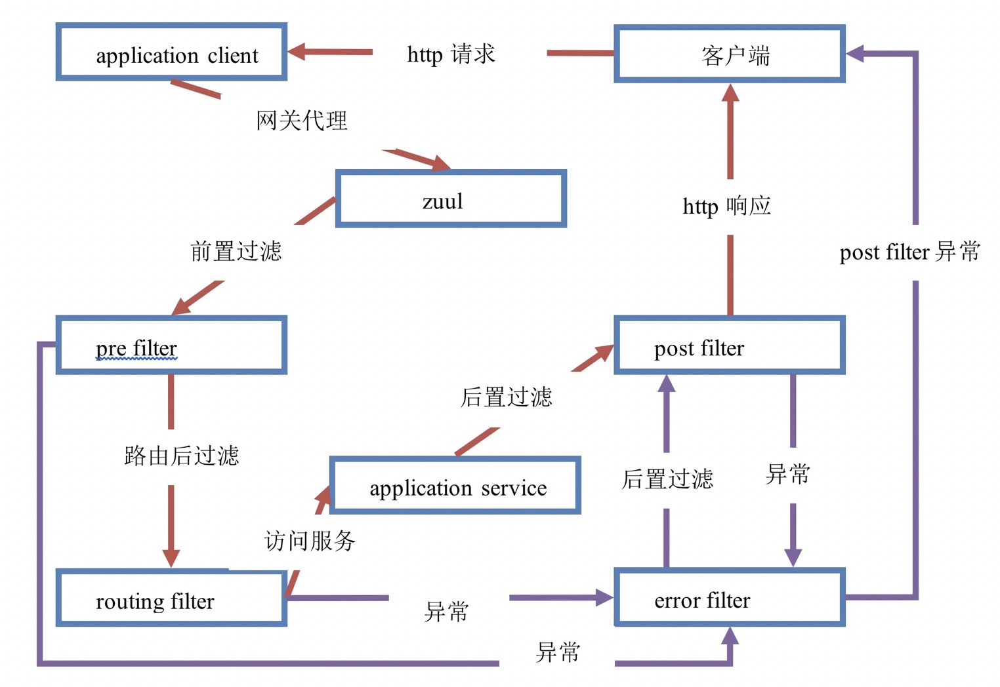
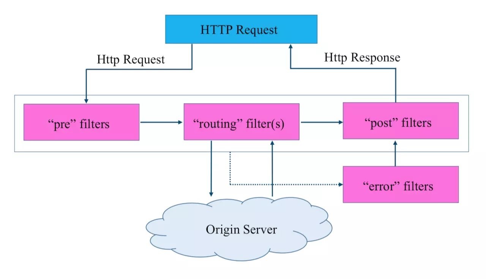

# 3. Zuul网关过滤

## 3.1 Zuul 请求的生命周期

<a data-fancybox title=" Zuul网关过滤" href="./image/zuul04.jpg"></a>

----------------------

1. HTTP 发送请求到 Zuul 网关
2. Zuul 网关首先经过 pre filter
3. 验证通过后进入 routing filter，接着将请求转发给远程服务，远程服务执行完返回结果，如果出错，则执行error filter
4. 继续往下执行 post filter
5. 最后返回响应给 HTTP 客户端

-----------------------

## 3.2 过滤器类型

**Zuul 包含了对请求的路由和过滤两个核心功能**，其中路由功能负责将外部请求转发到具体的微服务实例上，是
实现外部访问统一入口的基础；而过滤器功能则负责对请求的处理过程进行干预，是实现请求校验，服务聚合等功能
的基础。然而实际上，路由功能在真正运行时，它的路由映射和请求转发都是由几个不同的过滤器完成的。


 路由映射主要通过 pre 类型的过滤器完成，它将请求路径与配置的路由规则进行匹配，以找到需要转发的目标
地址；而请求转发的部分则是由 routing 类型的过滤器来完成，对 pre 类型过滤器获得的路由地址进行转发。所
以说，过滤器可以说是 Zuul 实现 API 网关功能最核心的部件，每一个进入 Zuul 的 http 请求都会经过一系列的过滤
器处理链得到请求响应并返回给客户端。

<a data-fancybox title=" Zuul网关过滤" href="./image/zuul03.jpg"></a>

:::tip 过滤器类型
1. pre：请求被路由到源服务器之前执行的过滤器  
    身份认证  
    选路由  
    请求日志  

2. routing：处理将请求发送到源服务器的过滤器  
3. post：响应从源服务器返回时执行的过滤器  
    对响应增加 HTTP 头  
    收集统计和度量指标  
    将响应以流的方式发送回客户端  
4. error：上述阶段中出现错误时执行的过滤器  
:::


## 3.3 网关过滤器入门
### 创建过滤器
```java
package com.tqk.filter;

import com.netflix.zuul.ZuulFilter;
import com.netflix.zuul.context.RequestContext;
import com.netflix.zuul.exception.ZuulException;
import org.springframework.stereotype.Component;

import javax.servlet.http.HttpServletRequest;

/**
 * 网关过滤器
 */
@Component
public class CustomFilter extends ZuulFilter {
      /**
       * 过滤器类型
       *   pre
       *   routing
       *   post
       *   error
       *
       * @return
       */
    @Override
    public String filterType() {
        return "pre";
    }
  /**
       * 执行顺序
       *   数值越小，优先级越高
       *
       * @return
       */
    @Override
    public int filterOrder() {
        return 0;
    }
  /**
       * 执行条件
       *   true 开启
       *   false 关闭
       *
       * @return
       */
    @Override
    public boolean shouldFilter() {
        return true;
    }
  /**
    * 动作（具体操作）
    *   具体逻辑
    *
    * @return
    * @throws ZuulException
    */
    @Override
    public Object run() throws ZuulException {
    // 获取请求上下文
    RequestContext rc = RequestContext.getCurrentContext();
    HttpServletRequest request = rc.getRequest();
    System.out.println("CustomFilter...method={"+request.getMethod()+"}, url={"+request.getRequestURL().toString()+"}");
    return null;
    }
}

```
### 访问

访问：[http://192.168.0.105:9000/api/Service-Consumer/order/1]

控制台输出如下：
CustomFilter...method={GET}, url={http://192.168.0.105:9000/api/Service-Consumer/order/1}
## 3.4 统一鉴权

### 创建过滤器
```java
package com.tqk.filter;

import com.netflix.zuul.ZuulFilter;
import com.netflix.zuul.context.RequestContext;
import com.netflix.zuul.exception.ZuulException;
import org.slf4j.Logger;
import org.slf4j.LoggerFactory;
import org.springframework.http.HttpStatus;
import org.springframework.stereotype.Component;

import javax.servlet.http.HttpServletRequest;
import java.io.IOException;
import java.io.PrintWriter;

/**
 * 权限验证过滤器
 */
@Component
public class AccessFilter extends ZuulFilter {

    private static final Logger logger = LoggerFactory.getLogger(AccessFilter.class);

    @Override
    public String filterType() {
        return "pre";
    }

    @Override
    public int filterOrder() {
        return 1;
    }

    @Override
    public boolean shouldFilter() {
        return true;
    }

    @Override
    public Object run() throws ZuulException {
        // 模拟异常
        // Integer.parseInt("zuul");
        // 获取请求上下文
        RequestContext rc = RequestContext.getCurrentContext();
        HttpServletRequest request = rc.getRequest();
        // 获取表单中的 token
        String token = request.getParameter("token");
        // 业务逻辑处理
        if (null == token) {
            logger.warn("token is null...");
            // 请求结束，不在继续向下请求。
            rc.setSendZuulResponse(false);
            // 添加响应状态码，HTTP 401 错误代表用户没有访问权限
            rc.setResponseStatusCode(HttpStatus.UNAUTHORIZED.value());
            // 响应类型
            rc.getResponse().setContentType("application/json; charset=utf-8");
            PrintWriter writer = null;
            try {
                writer = rc.getResponse().getWriter();
                // 响应内容
                writer.print("{\"message\":\"" + HttpStatus.UNAUTHORIZED.getReasonPhrase() + "\"}");
            } catch (IOException e) {
                e.printStackTrace();
            } finally {
                if (null != writer)
                    writer.close();
            }
        } else {
            // 使用 token 进行身份验证
            logger.info("token is OK!");
        }
        return null;
    }

}

```

### 访问

访问：[http://192.168.0.105:9000/api/Service-Consumer/order/1] 结果如下：

```json
{"message":"Unauthorized"}
```
访问：[http://192.168.0.105:9000/api/Service-Consumer/order/1?token=abc123] 结果如下

```json
{"id":1,"orderNo":"order-001","orderAddress":"中国","totalPrice":31994.0,"productList":[{"id":1,"productName":"华为手机","productNum":2,"productPrice":5888.0},{"id":2,"productName":"联想笔记本","productNum":1,"productPrice":6888.0},{"id":3,"productName":"小米平板","productNum":5,"productPrice":2666.0}]}
```

## 3.5 网关过滤器异常统一处理

### 创建过滤器

```java
package com.tqk.filter;

import com.netflix.zuul.ZuulFilter;
import com.netflix.zuul.context.RequestContext;
import com.netflix.zuul.exception.ZuulException;
import org.slf4j.Logger;
import org.slf4j.LoggerFactory;
import org.springframework.cloud.netflix.zuul.util.ZuulRuntimeException;
import org.springframework.http.HttpStatus;
import org.springframework.stereotype.Component;

import javax.servlet.http.HttpServletResponse;
import java.io.IOException;
import java.io.PrintWriter;

/**
 * 异常过滤器
 */
@Component
public class ErrorFilter extends ZuulFilter {

    private static final Logger logger = LoggerFactory.getLogger(ErrorFilter.class);

    @Override
    public String filterType() {
        return "error";
    }

    @Override
    public int filterOrder() {
        return 0;
    }

    @Override
    public boolean shouldFilter() {
        return true;
    }

    @Override
    public Object run() throws ZuulException {
        RequestContext rc = RequestContext.getCurrentContext();
        ZuulException exception = this.findZuulException(rc.getThrowable());
        logger.error("ErrorFilter..." + exception.errorCause, exception);

        HttpStatus httpStatus = null;
        if (429 == exception.nStatusCode) {
            httpStatus = HttpStatus.TOO_MANY_REQUESTS;
        }

        if (500 == exception.nStatusCode) {
            httpStatus = HttpStatus.INTERNAL_SERVER_ERROR;
        }

        // 响应状态码
        rc.setResponseStatusCode(httpStatus.value());
        // 响应类型
        rc.getResponse().setContentType("application/json; charset=utf-8");
        PrintWriter writer = null;
        try {
            writer = rc.getResponse().getWriter();
            // 响应内容
            writer.print("{\"message\":\"" + httpStatus.getReasonPhrase() + "\"}");
        } catch (IOException e) {
            e.printStackTrace();
        } finally {
            if (null != writer) {
                writer.close();
            }
        }
        return null;
    }

    private ZuulException findZuulException(Throwable throwable) {
        if (throwable.getCause() instanceof ZuulRuntimeException) {
            return (ZuulException) throwable.getCause().getCause();
        }

        if (throwable.getCause() instanceof ZuulException) {
            return (ZuulException) throwable.getCause();
        }

        if (throwable instanceof ZuulException) {
            return (ZuulException) throwable;
        }
        return new ZuulException(throwable, HttpServletResponse.SC_INTERNAL_SERVER_ERROR, null);
    }

}
```

#### 模拟异常
AccessFilter.java

```java
     //todo  模拟异常
         Integer.parseInt("zuul");
```

### 配置文件

禁用 Zuul 默认的异常处理 filter： SendErrorFilter

```yml
  # 禁用 Zuul 默认的异常处理 filter
  SendErrorFilter:
    error:
      disable: true
```

### 访问测试

[http://192.168.0.105:9000/api/Service-Consumer/order/1?token=abc123]

```json
{"message":"Internal Server Error"}
```