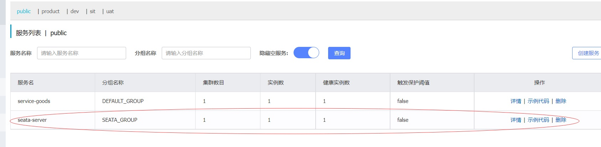
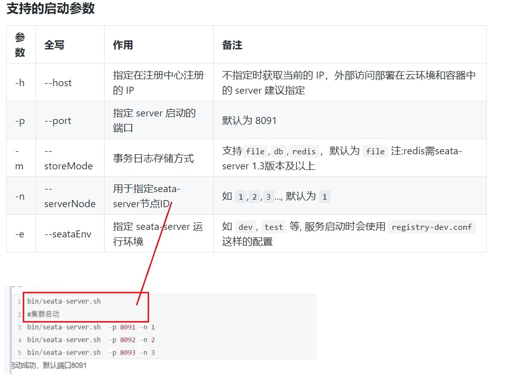
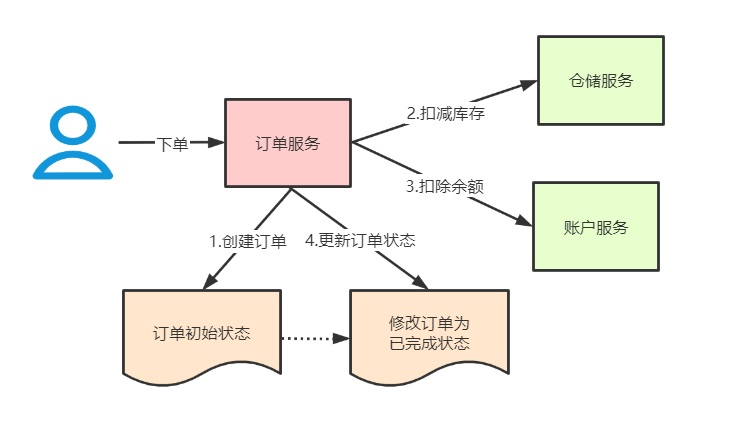
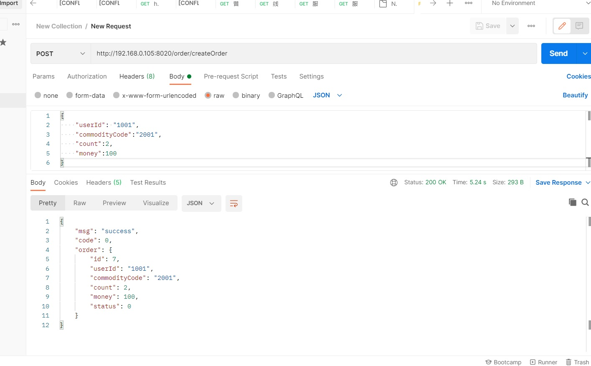

# 3. Seata快速入门

## 3.1  Seata-Server（TC）环境搭建

:::tip Server端存储模式（store.mode）支持三种：
1. **file：单机模式**，全局事务会话信息内存中读写并持久化本地文件root.data，性能较高 
2. **db：高可用模式**，全局事务会话信息通过db共享，相应性能差些 
3. **redis：**  Seata-Server1.3及以上版本支持,性能较高,**存在事务信息丢失风险**,请提前配置适合当前场景的redis持久化配置
:::

**db存储模式+Nacos(注册&配置中心)部署**

### 3.1.1 下载安装包

[https://github.com/seata/seata/releases]


### 3.1.2 建表(仅db模式)
全局事务会话信息由3块内容构成，全局事务-->分支事务-->全局锁，对应表global_table、branch_table、lock_table 创建数据库seata，执行sql脚本，文件在script/server/db/mysql.sql（seata源码）中

```sql
--我的本地路径
--F:\安装包\seata安装包\seata-1.4.2\seata-1.4.2\script\server\db\mysql.sql
-- -------------------------------- The script used when storeMode is 'db' --------------------------------
-- the table to store GlobalSession data
CREATE TABLE IF NOT EXISTS `global_table`
(
    `xid`                       VARCHAR(128) NOT NULL,
    `transaction_id`            BIGINT,
    `status`                    TINYINT      NOT NULL,
    `application_id`            VARCHAR(32),
    `transaction_service_group` VARCHAR(32),
    `transaction_name`          VARCHAR(128),
    `timeout`                   INT,
    `begin_time`                BIGINT,
    `application_data`          VARCHAR(2000),
    `gmt_create`                DATETIME,
    `gmt_modified`              DATETIME,
    PRIMARY KEY (`xid`),
    KEY `idx_gmt_modified_status` (`gmt_modified`, `status`),
    KEY `idx_transaction_id` (`transaction_id`)
) ENGINE = InnoDB
  DEFAULT CHARSET = utf8;

-- the table to store BranchSession data
CREATE TABLE IF NOT EXISTS `branch_table`
(
    `branch_id`         BIGINT       NOT NULL,
    `xid`               VARCHAR(128) NOT NULL,
    `transaction_id`    BIGINT,
    `resource_group_id` VARCHAR(32),
    `resource_id`       VARCHAR(256),
    `branch_type`       VARCHAR(8),
    `status`            TINYINT,
    `client_id`         VARCHAR(64),
    `application_data`  VARCHAR(2000),
    `gmt_create`        DATETIME(6),
    `gmt_modified`      DATETIME(6),
    PRIMARY KEY (`branch_id`),
    KEY `idx_xid` (`xid`)
) ENGINE = InnoDB
  DEFAULT CHARSET = utf8;

-- the table to store lock data
CREATE TABLE IF NOT EXISTS `lock_table`
(
    `row_key`        VARCHAR(128) NOT NULL,
    `xid`            VARCHAR(128),
    `transaction_id` BIGINT,
    `branch_id`      BIGINT       NOT NULL,
    `resource_id`    VARCHAR(256),
    `table_name`     VARCHAR(32),
    `pk`             VARCHAR(36),
    `gmt_create`     DATETIME,
    `gmt_modified`   DATETIME,
    PRIMARY KEY (`row_key`),
    KEY `idx_branch_id` (`branch_id`)
) ENGINE = InnoDB
  DEFAULT CHARSET = utf8;

```

### 3.1.3 修改store.mode

1. **启动包:** seata-->conf-->file.conf，修改store.mode="db" 
2. **源码:** 根目录-->seata-server-->resources-->file.conf，修改store.mode="db"

```conf
store {
  ## store mode: file、db、redis
  mode = "db"
  ## rsa decryption public key

```

### 3.1.4 修改数据库连接

1. **启动包**: seata-->conf-->file.conf，修改store.db相关属性。 
2. **源码**: 根目录-->seata-server-->resources-->file.conf，修改store.db相关属性。

```conf
  ## database store property
  db {
    ## the implement of javax.sql.DataSource, such as DruidDataSource(druid)/BasicDataSource(dbcp)/HikariDataSource(hikari) etc.
    datasource = "druid"
    ## mysql/oracle/postgresql/h2/oceanbase etc.
    dbType = "mysql"
    driverClassName = "com.mysql.jdbc.Driver"
    ## if using mysql to store the data, recommend add rewriteBatchedStatements=true in jdbc connection param
    url = "jdbc:mysql://49.233.34.168:6699/seata?useUnicode=true&rewriteBatchedStatements=true"
    user = "root"
    password = "12345@tqk"
    minConn = 5
    maxConn = 100
    globalTable = "global_table"
    branchTable = "branch_table"
    lockTable = "lock_table"
    queryLimit = 100
    maxWait = 5000
  }
```

此时可以跳到步骤七：直接启动Seata Server，注册中心和配置中心都是file

### 3.1.5 配置Nacos注册中心

将Seata Server注册到Nacos，修改conf目录下的registry.conf配置

```conf
registry {
  # file 、nacos 、eureka、redis、zk、consul、etcd3、sofa
  type = "nacos"

  nacos {
    application = "seata-server"
    serverAddr = "101.43.21.33:8848"
    ## 注意分组 默认group是"DEFAULT_GROUP"
    group = "SEATA_GROUP"
    namespace = ""
    cluster = "default"
    username = ""
    password = ""
  }

```

### 3.1.6 配置Nacos配置中心

修改conf目录下的registry.conf配置

```conf
config {
  # file、nacos 、apollo、zk、consul、etcd3
  type = "nacos"

  nacos {
    serverAddr = "101.43.21.33:8848"
    namespace = ""
    group = "SEATA_GROUP"
    username = ""
    password = ""
    dataId = "seataServer.properties"
  }
```
注意：如果配置了seata server使用nacos作为配置中心，则配置信息会从nacos读取，file.conf可以不用配置。 客户端配置registry.conf 使用nacos时也要注意group要和seata server中的group一致，默认group是"DEFAULT_GROUP"

### 3.1.7 同步seata server的配置到nacos

**源码**：获取/seata/script/config-center/config.txt，修改配置信息

```conf
store.mode=db
store.publicKey=
store.file.dir=file_store/data
store.file.maxBranchSessionSize=16384
store.file.maxGlobalSessionSize=512
store.file.fileWriteBufferCacheSize=16384
store.file.flushDiskMode=async
store.file.sessionReloadReadSize=100
store.db.datasource=druid
store.db.dbType=mysql
store.db.driverClassName=com.mysql.jdbc.Driver
store.db.url=jdbc:mysql://49.233.34.168:6699/seata?useUnicode=true&rewriteBatchedStatements=true
store.db.user=root
store.db.password=12345@tqk
```

#### 配置参数同步到Nacos

```sh
 sh ${SEATAPATH}/script/config‐center/nacos/nacos‐config.sh ‐h localhost ‐p 8848 ‐g SEATA_GROUP ‐t 5a3c7d6c‐f497‐4d68‐a71a‐2e5e3340b3ca
[root@VM-16-5-centos nacos]# pwd
/root/seata/yuanma/seata-1.4.2/script/config-center/nacos
[root@VM-16-5-centos nacos]# sh nacos-config.sh -h 101.43.21.33 -p 8848 ‐g SEATA_GROUP
Set metrics.enabled=false successfully 
Set metrics.registryType=compact successfully 
Set metrics.exporterList=prometheus successfully 
Set metrics.exporterPrometheusPort=9898 successfully 
=========================================================================
 Complete initialization parameters,  total-count:89 ,  failure-count:4 
=========================================================================
 init nacos config fail. 

```
-------------

:::tip 参数说明： 
1. -h: host，默认值 localhost 
2. -p: port，默认值 8848 
3. -g: 配置分组，默认值为 'SEATA_GROUP' 
4. -t: 租户信息，对应 Nacos 的命名空间ID字段, 默认值为空
:::

### 3.1.8  启动Seata Server

启动Seata Server命令

```sh
# 修改脚本内存大小
exec "$JAVACMD" $JAVA_OPTS -server -Xmx2048m -Xms2048m -Xmn1024m -Xss512k -XX:SurvivorRatio=10 -XX:MetaspaceSize=128m -XX:MaxMetaspaceSize=256m -XX:MaxDirectMemorySize=1024m 

exec "$JAVACMD" $JAVA_OPTS -server -Xmx512m -Xms512m -Xmn256m -Xss512k -XX:SurvivorRatio=10 -XX:MetaspaceSize=128m -XX:MaxMetaspaceSize=256m -XX:MaxDirectMemorySize=256m 
# bin/seata‐server.sh
[root@VM-16-5-centos bin]# pwd
/root/seata/seata/seata-server-1.4.2/bin

## 后台启动， 指定注册的IP地址不然使用的是内网ip，速度快
[root@VM-16-5-centos bin]# nohup sh seata-server.sh -h 49.233.34.168 &

```

```log
15:46:08.606  INFO --- [                     main] io.seata.config.FileConfiguration        : The file name of the operation is registry
15:46:08.613  INFO --- [                     main] io.seata.config.FileConfiguration        : The configuration file used is /root/seata/seata/seata-server-1.4.2/conf/registry.conf
15:46:10.842  INFO --- [                     main] com.alibaba.druid.pool.DruidDataSource   : {dataSource-1} inited
15:46:11.353  INFO --- [                     main] i.s.core.rpc.netty.NettyServerBootstrap  : Server started, listen port: 8091

```

<a data-fancybox title=" 分布式事务" href="./image/seata13.jpg"></a>

<a data-fancybox title=" 分布式事务" href="./image/seata14.jpg"></a>

## 3.2 实战案例

用户下单，整个业务逻辑由三个微服务构成： 

1. 仓储服务：对给定的商品扣除库存数量。 
2. 订单服务：根据采购需求创建订单。 
3. 帐户服务：从用户帐户中扣除余额。
<a data-fancybox title=" 分布式事务" href="./image/seata15.jpg"></a>

***maven使用3.5.4版本，不然下载依赖会有冲突***

### 3.2.1 创建数据库

```sql
--数据库 seata_account
--账户余额表
CREATE TABLE `account_tbl` (
  `id` int(11) NOT NULL AUTO_INCREMENT,
  `user_id` varchar(255) DEFAULT NULL,
  `money` int(11) DEFAULT '0',
  PRIMARY KEY (`id`),
  UNIQUE KEY `user_id` (`user_id`)
) ENGINE=InnoDB AUTO_INCREMENT=1 DEFAULT CHARSET=utf8;

--seata_storage
--库存表
CREATE TABLE `storage_tbl` (
  `id` int(11) NOT NULL AUTO_INCREMENT,
  `commodity_code` varchar(255) DEFAULT NULL,
  `count` int(11) DEFAULT '0',
  PRIMARY KEY (`id`),
  UNIQUE KEY `commodity_code` (`commodity_code`)
) ENGINE=InnoDB AUTO_INCREMENT=1 DEFAULT CHARSET=utf8;

-- seata_order
--订单表
CREATE TABLE `order_tbl` (
  `id` int(11) NOT NULL AUTO_INCREMENT,
  `user_id` varchar(255) DEFAULT NULL,
  `commodity_code` varchar(255) DEFAULT NULL,
  `count` int(11) DEFAULT '0',
  `money` int(11) DEFAULT '0',
  `status` int(11) DEFAULT NULL,
  PRIMARY KEY (`id`)
) ENGINE=InnoDB AUTO_INCREMENT=1 DEFAULT CHARSET=utf8;

--seata使用，每个库都要有一份
CREATE TABLE `undo_log` (
  `id` bigint(20) NOT NULL AUTO_INCREMENT,
  `branch_id` bigint(20) NOT NULL,
  `xid` varchar(100) NOT NULL,
  `context` varchar(128) NOT NULL,
  `rollback_info` longblob NOT NULL,
  `log_status` int(11) NOT NULL,
  `log_created` datetime NOT NULL,
  `log_modified` datetime NOT NULL,
  PRIMARY KEY (`id`),
  UNIQUE KEY `ux_undo_log` (`xid`,`branch_id`)
) ENGINE=InnoDB AUTO_INCREMENT=1 DEFAULT CHARSET=utf8;
```
### 3.2.2 添加pom依赖

```xml
    <!-- seata-->
    <dependency>
        <groupId>com.alibaba.cloud</groupId>
        <artifactId>spring-cloud-starter-alibaba-seata</artifactId>
        <exclusions>
            <exclusion>
                <groupId>io.seata</groupId>
                <artifactId>seata-all</artifactId>
            </exclusion>
        </exclusions>
    </dependency>
    <dependency>
        <groupId>io.seata</groupId>
        <artifactId>seata-all</artifactId>
        <version>${seata.version}</version>
    </dependency>
```
### 3.2.3 添加代理数据源配置，配置DataSourceProxy
```java
package com.tuling.datasource.config;

import com.alibaba.druid.pool.DruidDataSource;
import io.seata.rm.datasource.DataSourceProxy;
import org.apache.ibatis.session.SqlSessionFactory;
import org.mybatis.spring.SqlSessionFactoryBean;
import org.mybatis.spring.annotation.MapperScan;
import org.springframework.boot.context.properties.ConfigurationProperties;
import org.springframework.context.annotation.Bean;
import org.springframework.context.annotation.Configuration;
import org.springframework.context.annotation.Primary;
import org.springframework.core.io.support.PathMatchingResourcePatternResolver;
import org.springframework.core.io.support.ResourcePatternResolver;

import javax.sql.DataSource;

/**
 * @author Fox
 *
 * 需要用到分布式事务的微服务都需要使用seata DataSourceProxy代理自己的数据源
 */
@Configuration
@MapperScan("com.tuling.datasource.mapper")
public class MybatisConfig {
    
    /**
     * 从配置文件获取属性构造datasource，注意前缀，这里用的是druid，根据自己情况配置,
     * 原生datasource前缀取"spring.datasource"
     *
     * @return
     */
    @Bean
    @ConfigurationProperties(prefix = "spring.datasource.druid")
    public DataSource druidDataSource() {
        DruidDataSource druidDataSource = new DruidDataSource();
        return druidDataSource;
    }
    
    /**
     * 构造datasource代理对象，替换原来的datasource
     * @param druidDataSource
     * @return
     */
    @Primary
    @Bean("dataSource")
    public DataSourceProxy dataSourceProxy(DataSource druidDataSource) {
        return new DataSourceProxy(druidDataSource);
    }
    
    
    @Bean(name = "sqlSessionFactory")
    public SqlSessionFactory sqlSessionFactoryBean(DataSourceProxy dataSourceProxy) throws Exception {
        SqlSessionFactoryBean factoryBean = new SqlSessionFactoryBean();
        //设置代理数据源
        factoryBean.setDataSource(dataSourceProxy);
        ResourcePatternResolver resolver = new PathMatchingResourcePatternResolver();
        factoryBean.setMapperLocations(resolver.getResources("classpath*:mybatis/**/*-mapper.xml"));
        
        org.apache.ibatis.session.Configuration configuration=new org.apache.ibatis.session.Configuration();
        //使用jdbc的getGeneratedKeys获取数据库自增主键值
        configuration.setUseGeneratedKeys(true);
        //使用列别名替换列名
        configuration.setUseColumnLabel(true);
        //自动使用驼峰命名属性映射字段，如userId ---> user_id
        configuration.setMapUnderscoreToCamelCase(true);
        factoryBean.setConfiguration(configuration);
        
        return factoryBean.getObject();
    }
    
}

```

### 3.2.4 启动类上剔除DataSourceAutoConfiguration，用于解决数据源的循环依赖问题
```java
package com.tuling.account;

import org.springframework.boot.SpringApplication;
import org.springframework.boot.autoconfigure.SpringBootApplication;
import org.springframework.boot.autoconfigure.jdbc.DataSourceAutoConfiguration;

@SpringBootApplication(scanBasePackages = "com.tuling",exclude = DataSourceAutoConfiguration.class)
public class AccountServiceApplication {

    public static void main(String[] args) {
        SpringApplication.run(AccountServiceApplication.class, args);
    }

}

```
### 3.2.5 修改register.conf,配置nacos作为registry.type&config.type，对应seata server也使用nacos

**注意：需要指定group = "SEATA_GROUP"，因为Seata Server端指定了group = "SEATA_GROUP" ，必须保证一致**
```java
registry {
  # file 、nacos 、eureka、redis、zk、consul、etcd3、sofa
  type = "nacos"

  nacos {
    serverAddr = "101.43.21.33:8848"
    namespace = ""
    cluster = "default"
    group = "SEATA_GROUP"
  }
}

config {
  # file、nacos 、apollo、zk、consul、etcd3、springCloudConfig
  type = "nacos"

  nacos {
    serverAddr = "101.43.21.33:8848"
;     namespace = "54433b62-df64-40f1-9527-c907219fc17f"
    group = "SEATA_GROUP"
  }
}

```

### 3.2.6 修改application.yml配置
**配置seata 服务事务分组，要与服务端nacos配置中心中service.vgroup_mapping的后缀对应**

```yml
server:
  port: 8050

spring:
  application:
    name: account-service
  cloud:
    nacos:
      discovery:
        server-addr: 101.43.21.33:8848
    alibaba:
      seata:
        tx-service-group:
          my_test_tx_group # seata 服务事务分组

  datasource:
    type: com.alibaba.druid.pool.DruidDataSource
    druid:
      driver-class-name: com.mysql.cj.jdbc.Driver
      url: jdbc:mysql://49.233.34.168:6699/seata_account?useUnicode=true&characterEncoding=UTF-8&serverTimezone=Asia/Shanghai
      username: root
      password: 12345@tqk
      initial-size: 10
      max-active: 100
      min-idle: 10
      max-wait: 60000
      pool-prepared-statements: true
      max-pool-prepared-statement-per-connection-size: 20
      time-between-eviction-runs-millis: 60000
      min-evictable-idle-time-millis: 300000
      test-while-idle: true
      test-on-borrow: false
      test-on-return: false
      stat-view-servlet:
        enabled: true
        url-pattern: /druid/*
      filter:
        stat:
          log-slow-sql: true
          slow-sql-millis: 1000
          merge-sql: false
        wall:
          config:
            multi-statement-allow: true

#spring cloud alibaba 2.1.4 之后支持yml中配置seata属性，可以用来替换registry.conf文件
#seata:
#  #application-id: ${spring.application.name}
#  # seata 服务分组，要与服务端nacos-config.txt中service.vgroup_mapping的后缀对应
#  tx-service-group: my_test_tx_group
#  registry:
#    # 指定nacos作为注册中心
#    type: nacos
#    nacos:
#      server-addr: 127.0.0.1:8848
#      namespace: ""
#      group: SEATA_GROUP
#
#  config:
#    # 指定nacos作为配置中心
#    type: nacos
#    nacos:
#      server-addr: 127.0.0.1:8848
#      namespace: "54433b62-df64-40f1-9527-c907219fc17f"
#      group: SEATA_GROUP

```

### 3.2.7 微服务发起者（TM 方）需要添加@GlobalTransactional注解

```java
package com.tuling.order.service.impl;

import com.tuling.datasource.entity.Order;
import com.tuling.datasource.entity.OrderStatus;
import com.tuling.datasource.mapper.OrderMapper;
import com.tuling.order.feign.AccountFeignService;
import com.tuling.order.feign.StorageFeignService;
import com.tuling.order.service.OrderService;
import com.tuling.order.vo.OrderVo;
import io.seata.core.context.RootContext;
import io.seata.core.exception.TransactionException;
import io.seata.spring.annotation.GlobalTransactional;
import lombok.extern.slf4j.Slf4j;
import org.springframework.beans.factory.annotation.Autowired;
import org.springframework.stereotype.Service;
import org.springframework.transaction.annotation.Transactional;


/**
 * @author Fox
 */
@Service
@Slf4j
public class OrderServiceImpl implements OrderService {
    
    @Autowired
    private OrderMapper orderMapper;
    
    @Autowired
    private AccountFeignService accountFeignService;
    
    @Autowired
    private StorageFeignService storageFeignService;
    
    @Override
    //@Transactional
    @GlobalTransactional(name="createOrder")
    public Order saveOrder(OrderVo orderVo) {
        log.info("=============用户下单=================");
        log.info("当前 XID: {}", RootContext.getXID());
        
        // 保存订单
        Order order = new Order();
        order.setUserId(orderVo.getUserId());
        order.setCommodityCode(orderVo.getCommodityCode());
        order.setCount(orderVo.getCount());
        order.setMoney(orderVo.getMoney());
        order.setStatus(OrderStatus.INIT.getValue());
    
        Integer saveOrderRecord = orderMapper.insert(order);
        log.info("保存订单{}", saveOrderRecord > 0 ? "成功" : "失败");
        
        //扣减库存  fegin    怎么通知
        storageFeignService.deduct(orderVo.getCommodityCode(), orderVo.getCount());
        
        //扣减余额   服务降级  throw
        Boolean debit= accountFeignService.debit(orderVo.getUserId(), orderVo.getMoney());

//        if(!debit){
//            // 解决 feign整合sentinel降级导致SeaTa失效的处理
//            throw new RuntimeException("账户服务异常降级了");
//        }
        
        //更新订单
        Integer updateOrderRecord = orderMapper.updateOrderStatus(order.getId(),OrderStatus.SUCCESS.getValue());
        log.info("更新订单id:{} {}", order.getId(), updateOrderRecord > 0 ? "成功" : "失败");
        
        return order;
        
    }
}

```

### 3.2.8 测试

<a data-fancybox title=" 分布式事务" href="./image/seata16.jpg"></a>

## 3.3 分布式事务失效

:::tip 分布式事务失效
1. 是否加包扫描
2. 是否为public方法
3. 是否同一个类中调用
4. 是否写好配置
5. 异常是否被捕获
6. 异常类型是否设置为Exception
7. MySQL数据库引擎是否支持事务（MyIsam引擎不支持事务）
8. 是否能够从正向sql中拿到主键。
:::