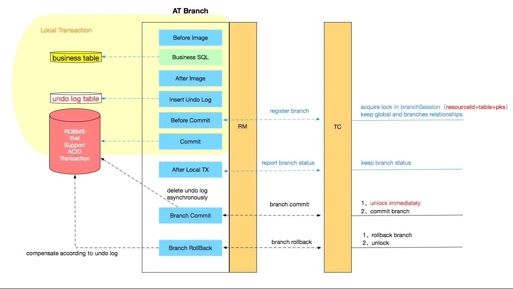

# 2. Seata简介

## 2.1 Seata 是什么

Seata 是一款开源的分布式事务解决方案，致力于提供高性能和简单易用的分布式事务服务。Seata 将为用户提供了 **AT、TCC、SAGA 和 XA 事务模式**，为用户打造一站式的分布式解决方案。AT模式是阿里首推的模式,阿里云上有商用版本的GTS（Global Transaction Service 全局事务服务） 

官网：https://seata.io/zh-cn/index.html 

源码: https://github.com/seata/seata 

官方Demo: https://github.com/seata/seata-sample

## 2.3 Seata的三大角色 

在 Seata 的架构中，一共有三个角色： 

:::tip Seata的三大角色

1. **TC (Transaction Coordinator)** - 事务协调者 

维护全局和分支事务的状态，驱动全局事务提交或回滚。 

2. **TM (Transaction Manager)** - 事务管理器 

定义全局事务的范围：开始全局事务、提交或回滚全局事务。 

3. **RM (Resource Manager)** - 资源管理器 

管理分支事务处理的资源，与TC交谈以注册分支事务和报告分支事务的状态，并驱动分支事务提交或回滚。 
:::

<strong>其中 TC 为单独部署的 Server 服务端，TM 和 RM 为嵌入到应用中的 Client 客户端</strong>

在 Seata 中，一个分布式事务的生命周期如下:

1. TM 请求 TC 开启一个全局事务。TC 会生成一个 XID 作为该全局事务的编号。XID，会在微服务的调用链路中传播，保证将多个微服务 的子事务关联在一起。 

2. RM 请求 TC 将本地事务注册为全局事务的分支事务，通过全局事务的 XID 进行关联。 

3. TM 请求 TC 告诉 XID 对应的全局事务是进行提交还是回滚。 

4. TC 驱动 RM 们将 XID 对应的自己的本地事务进行提交还是回滚。

## 2.4 Seata的AT模式设计思路

AT模式的核心是对业务无侵入，是一种改进后的两阶段提交，其设计思路如图

### 2.4.1 第一阶段

业务数据和回滚日志记录在同一个本地事务中提交，释放本地锁和连接资源。核心在于对业务sql进行解析，转换成undolog，并同时入库，这是怎么做的呢？

先抛出一个概念DataSourceProxy代理数据源，通过名字大家大概也能基本猜到是什么个操作，后面做具体分析 

参考官方文档： 

<a  href='https://seata.io/zh-cn/docs/dev/mode/at-mode.html'>[https://seata.io/zh-cn/docs/dev/mode/at-mode.html]</a>

### 2.4.2 第二阶段

分布式事务操作成功，则TC通知RM异步删除undolog

分布式事务操作失败，TM向TC发送回滚请求，RM 收到协调器TC发来的回滚请求，通过 XID 和 Branch ID 找到相应的回滚日志记 录，通过回滚记录生成反向的更新 SQL 并执行，以完成分支的回滚

### 2.4.3 整体执行流程

:::tip Seata架构的亮点主要有几个:   
1. 应用层基于SQL解析实现了自动补偿，从而最大程度的降低业务侵入性； 
2. 将分布式事务中TC（事务协调者）独立部署，负责事务的注册、回滚； 
3. 通过全局锁实现了写隔离与读隔离
:::

