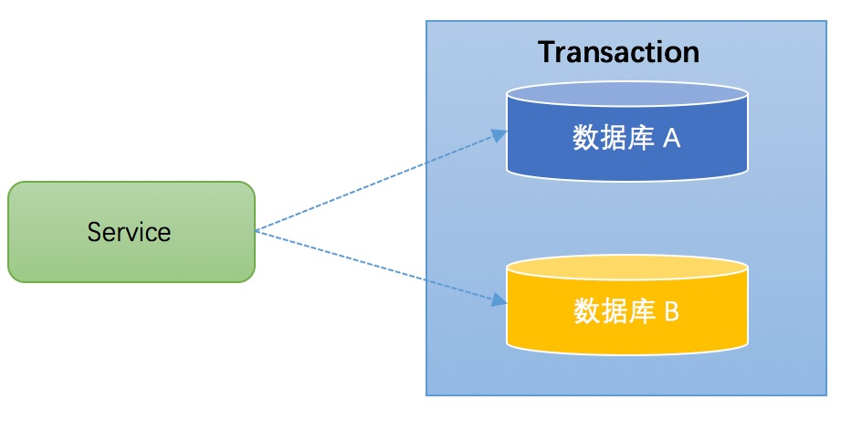
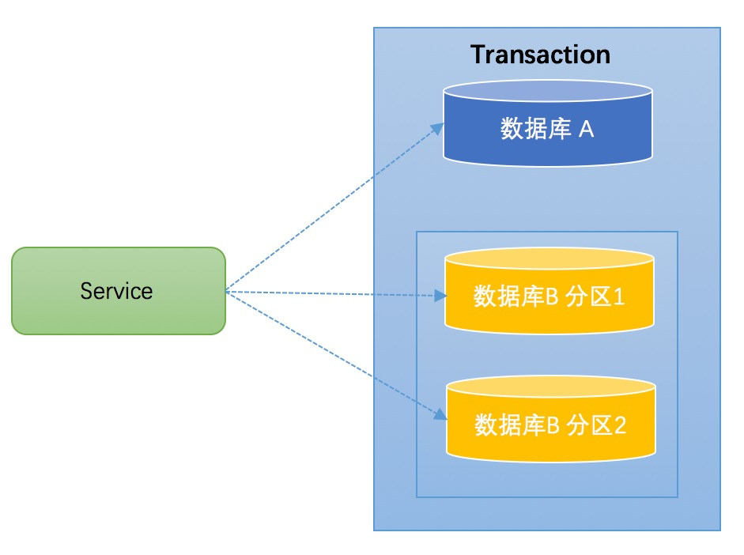
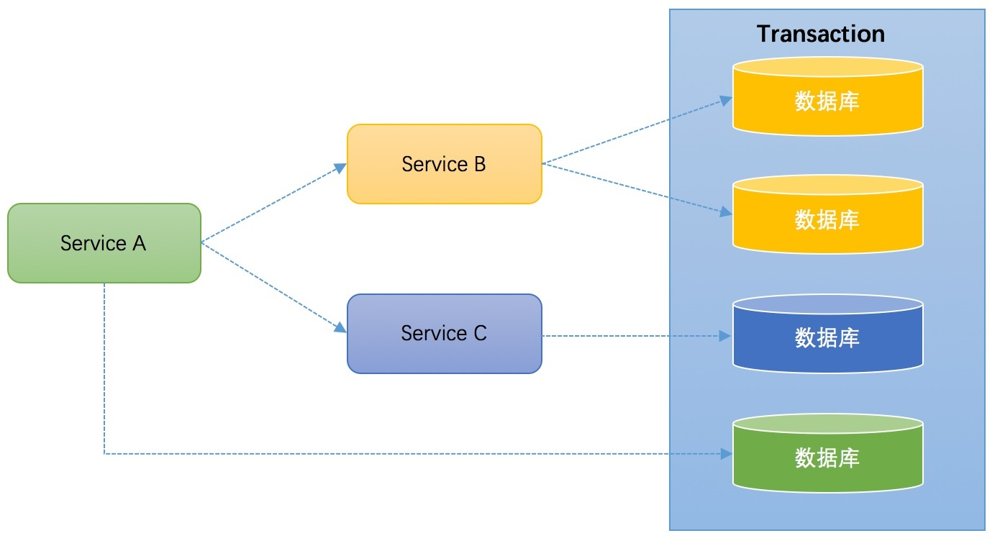
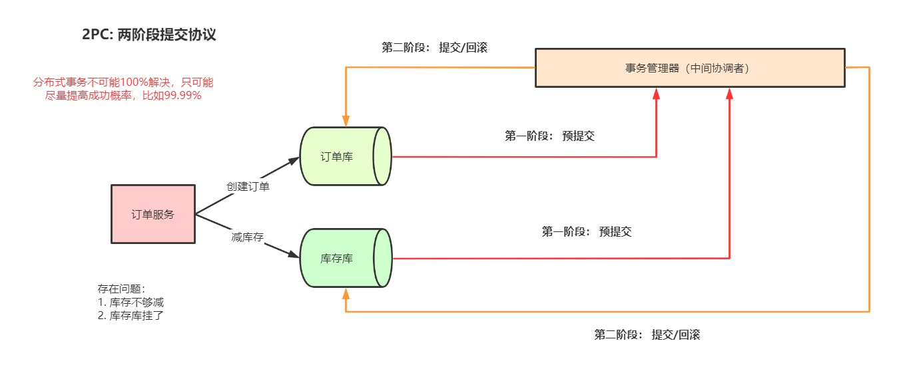
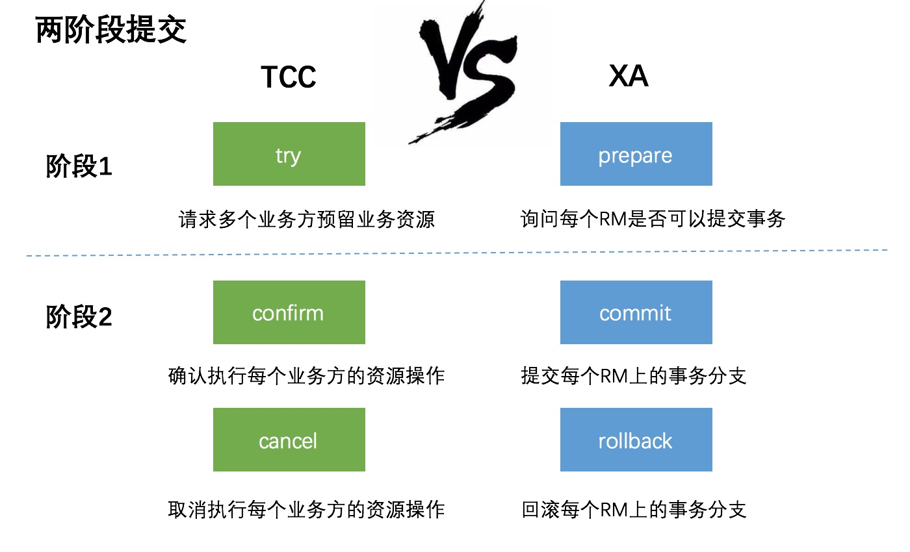
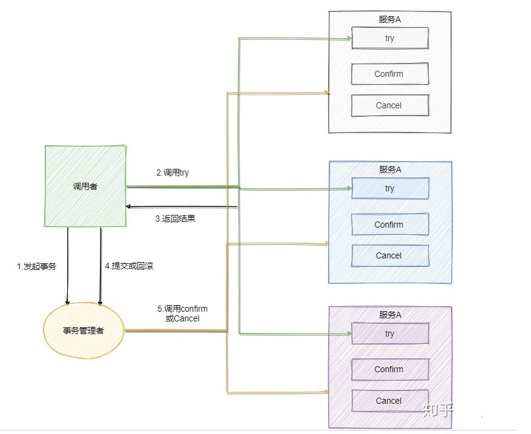
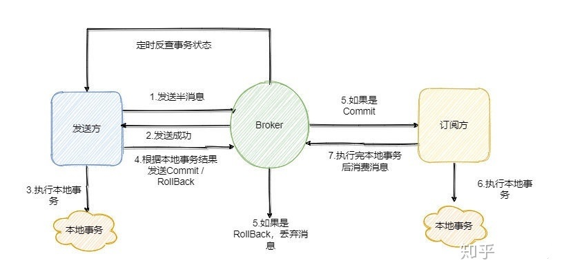

# 1. 分布式事务

<a href='https://zhuanlan.zhihu.com/p/183753774'>分布式事务参考文档</a>

## 1.1 事务简介

事务(Transaction)是访问并可能更新数据库中各种数据项的一个程序执行单元(unit)。在关系数据库中，一个事务由 一组SQL语句组成。

事务应该具有4个属性：原子性、一致性、隔离性、持久性。这四个属性通常称为**ACID特性**

1. **原子性（atomicity）**：个事务是一个不可分割的工作单位，事务中包括的诸操作要么都做，要么都不做。 

2. **一致性（consistency）**：事务必须是使数据库从一个一致性状态变到另一个一致性状态，事务的中间状态不能被观 察到的。 

3. **隔离性（isolation）**：一个事务的执行不能被其他事务干扰。即一个事务内部的操作及使用的数据对并发的其他事务 是隔离的，并发执行的各个事务之间不能互相干扰。

隔离性又分为四个级别：**读未提交(read uncommitted)、读已提交 (read committed，解决脏读)、可重复读(repeatable read，解决虚读)、串行化(serializable，解决幻读)。** 

4. **持久性（durability）**：持久性也称永久性（permanence），指一个事务一旦提交，它对数据库中数据的改变就应该 是永久性的。接下来的其他操作或故障不应该对其有任何影响。 

**任何事务机制在实现时，都应该考虑事务的ACID特性，包括：本地事务、分布式事务，及时不能都很好的满足，也要考虑支持到什么程度**

## 1.2 本地事务

大多数场景下，我们的应用都只需要操作单一的数据库，这种情况下的事务称之为本地事务(Local Transaction)。本地事务的ACID特性是数据库直接提供支持。本地事务应用架构如下所示：

在JDBC编程中，我们通过java.sql.Connection对象来开启、关闭或者提交事务。代码如下所示：

```java
Connection conn = ... //获取数据库连接 
conn.setAutoCommit(false); //开启事务 
try{ 
    //...执行增删改查sql 
    conn.commit(); //提交事务 
}catch (Exception e) { 
    conn.rollback();//事务回滚 
}finally{ 
    conn.close();//关闭链接 
}
```

## 1.3 分布式事务典型场景

当下互联网发展如火如荼，绝大部分公司都进行了数据库拆分和服务化(SOA)。在这种情况下，完成某一个业务功能可 能需要横跨多个服务，操作多个数据库。这就涉及到到了分布式事务，用需要操作的资源位于多个资源服务器上，而应 用需要保证对于多个资源服务器的数据的操作，要么全部成功，要么全部失败。本质上来说，**分布式事务就是为了保证 不同资源服务器的数据一致性**

### 1.3.1 跨库事务

跨库事务指的是，一个应用某个功能需要操作多个库，不同的库中存储不同的业务数据。笔者见过一个相对比较复杂 的业务，一个业务中同时操作了9个库。下图演示了一个服务同时操作2个库的情况
<a data-fancybox title=" 分布式事务" href="./image/seata01.jpg"></a>

### 1.3.2 分库分表 

通常一个库数据量比较大或者预期未来的数据量比较大，都会进行水平拆分，也就是分库分表。如下图，将数据库B拆 分成了2个库
<a data-fancybox title=" 分布式事务" href="./image/seata02.jpg"></a>

对于分库分表的情况，一般开发人员都会使用一些数据库中间件来降低sql操作的复杂性。如，对于sql：insert into user(id,name) values (1,"张三"),(2,"李四")。这条sql是操作单库的语法，单库情况下，可以保证事务的一致性。 

但是由于现在进行了分库分表，开发人员希望将1号记录插入分库1，2号记录插入分库2。所以数据库中间件要将其改 写为2条sql，分别插入两个不同的分库，此时要保证两个库要不都成功，要不都失败，因此基本上所有的数据库中间件都 面临着分布式事务的问题。

### 1.3.3  服务化

微服务架构是目前一个比较一个比较火的概念。例如上面笔者提到的一个案例，某个应用同时操作了9个库，这样的应 用业务逻辑必然非常复杂，对于开发人员是极大的挑战，应该拆分成不同的独立服务，以简化业务逻辑。拆分后，独立 服务之间通过RPC框架来进行远程调用，实现彼此的通信。下图演示了一个3个服务之间彼此调用的架构：

<a data-fancybox title=" 分布式事务" href="./image/seata03.jpg"></a>

**Service A完成某个功能需要直接操作数据库，同时需要调用Service B和Service C，而Service B又同时操作了2个数 据库，Service C也操作了一个库。需要保证这些跨服务的对多个数据库的操作要不都成功，要不都失败，实际上这可能 是最典型的分布式事务场景**

**小结**：上述讨论的分布式事务场景中，无一例外的都直接或者间接的操作了多个数据库。如何保证事务的ACID特性， 对于分布式事务实现方案而言，是非常大的挑战。同时，分布式事务实现方案还必须要考虑性能的问题，如果为了严格 保证ACID特性，导致性能严重下降，那么对于一些要求快速响应的业务，是无法接受的。

### DTP模型
:::tip DTP模型： 
1. **应用程序(Application Program ，简称AP)**：用于定义事务边界(即定义事务的开始和结束)，并且在事务边界内对资源进行操作。 

2. **资源管理器(Resource Manager，简称RM)**：如数据库、文件系统等，并提供访问资源的方式。 

3. **事务管理器(Transaction Manager ，简称TM)**：负责分配事务唯一标识，监控事务的执行进度，并负责事务的提 交、回滚等。 

4. **通信资源管理器(Communication Resource Manager，简称CRM)**：控制一个TM域(TM domain)内或者跨TM域 的分布式应用之间的通信。 通信协议(Communication Protocol，简称CP)：提供CRM提供的分布式应用节点之间的底层通信服务。
:::

## 1.4 两阶段提交协议(2PC)
两阶段提交协议（Two Phase Commit）不是在XA规范中提出，但是XA规范对其进行了优化。而从字面意思来理解， Two Phase Commit，就是将提交(commit)过程划分为2个阶段(Phase)：

### 1.4.1 阶段1： 
**TM通知各个RM准备提交它们的事务分支**。如果RM判断自己进行的工作可以被提交，那就对工作内容进行持久化， 再给TM肯定答复；要是发生了其他情况，那给TM的都是否定答复。在发送了否定答复并回滚了已经的工作后，RM就可 以丢弃这个事务分支信息。 


以mysql数据库为例，在第一阶段，事务管理器向所有涉及到的数据库服务器发出prepare"准备提交"请求，数据库收到请求后执行数据修改和日志记录等处理，处理完成后只是把事务的状态改成"可以提交",然后把结果返回给事务管理器。

### 1.4.2 阶段2 

**TM根据阶段1各个RM prepare的结果，决定是提交还是回滚事务**。

如果所有的RM都prepare成功，那么TM通知所有 的RM进行提交；如果有RM prepare失败的话，则TM通知所有RM回滚自己的事务分支。

以mysql数据库为例，如果第一阶段中所有数据库都prepare成功，那么事务管理器向数据库服务器发出"确认提 交"请求，数据库服务器把事务的"可以提交"状态改为"提交完成"状态，然后返回应答。如果在第一阶段内有任何一个数 据库的操作发生了错误，或者事务管理器收不到某个数据库的回应，则认为事务失败，回撤所有数据库的事务。数据库 服务器收不到第二阶段的确认提交请求，也会把"可以提交"的事务回撤

<a data-fancybox title=" 分布式事务" href="./image/seata04.jpg"></a>

<a data-fancybox title=" 分布式事务" href="./image/seata05.jpg"></a>


**XA是资源层面的分布式事务，强一致性，在两阶段提交的整个过程中，一直会持有资源的锁** 

**TCC是业务层面的分布式事务，最终一致性，不会一直持有资源的锁**

### 1.4.3 两阶段提交协议(2PC)存在的问题

二阶段提交看起来确实能够提供原子性的操作，但是不幸的是，二阶段提交还是有几个缺点的：

1. **同步阻塞问题**

两阶段提交方案下全局事务的ACID特性，是依赖于RM的。一个全局事务内部包含了多个独立的事务分支，这一组事 务分支要不都成功，要不都失败。各个事务分支的ACID特性共同构成了全局事务的ACID特性。也就是将单个事务分支的 支持的ACID特性提升一个层次到分布式事务的范畴。

 **即使在本地事务中，如果对操作读很敏感，我们也需要将事务隔离 级别设置为SERIALIZABLE。而对于分布式事务来说，更是如此，可重复读隔离级别不足以保证分布式事务一致性**。如果 我们使用mysql来支持XA分布式事务的话，那么最好将事务隔离级别设置为SERIALIZABLE，然而SERIALIZABLE(串行 化)是四个事务隔离级别中最高的一个级别，也是执行效率最低的一个级别。 

2. **单点故障**

由于协调者的重要性，一旦协调者TM发生故障，参与者RM会一直阻塞下去。尤其在第二阶段，协调者发生故障，那 么所有的参与者还都处于锁定事务资源的状态中，而无法继续完成事务操作。（如果是协调者挂掉，可以重新选举一个 协调者，但是无法解决因为协调者宕机导致的参与者处于阻塞状态的问题） 

3. **数据不一致**

**在二阶段提交的阶段二中，当协调者向参与者发送commit请求之后，发生了局部网络异常或者在发送commit请求过程中协调者发生了故障，这会导致只有一部分参与者接受到了commit请求，而在这部分参与者接到commit请求之后 就会执行commit操作，但是其他部分未接到commit请求的机器则无法执行事务提交。于是整个分布式系统便出现了数 据不一致性的现象**

由于二阶段提交存在着诸如同步阻塞、单点问题等缺陷，所以，研究者们在二阶段提交的基础上做了改进，提出了三阶 段提交。

## 1.5 三阶段提交协议(Three-phase commit)


与两阶段提交不同的是，三阶段提交有两个改动点： 
1. 引入超时机制。同时在协调者和参与者中都引入超时机制。 
2. 在第一阶段和第二阶段中插入一个准备阶段。保证了在最后提交阶段之前各参与节点的状态是一致的。

也就是说， 除了引入超时机制之外，3PC把2PC的准备阶段再次一分为二，这样**三阶段提交就有CanCommit、PreCommit、 DoCommit三个阶段**


### 1.5.1 CanCommit阶段 

3PC的CanCommit阶段其实和2PC的准备阶段很像。协调者向参与者发送commit请求，参与者如果可以提交就返回 Yes响应，否则返回No响应。 
1.事务询问 协调者向参与者发送CanCommit请求。询问是否可以执行事务提交操作。然后开始等待参与者的响应。 
2.响应反馈 参与者接到CanCommit请求之后，正常情况下，如果其自身认为可以顺利执行事务，则返回Yes响应，并 进入预备状态。否则反馈No 


### 1.5.2 PreCommit阶段 

协调者根据参与者的反应情况来决定是否可以记性事务的PreCommit操作,根据响应情况，有以下两种可能。 

假如协调者从所有的参与者获得的反馈都是Yes响应，那么就会执行事务的预执行。 1.发送预提交请求 协调者向参与者发送PreCommit请求，并进入Prepared阶段。 2.事务预提交 参与者接收到PreCommit请求后，会执行事务操作，并将undo和redo信息记录到事务日志中。 3.响应反馈 如果参与者成功的执行了事务操作，则返回ACK响应，同时开始等待最终指令。 假如有任何一个参与者向协调者发送了No响应，或者等待超时之后，协调者都没有接到参与者的响应，那么就执行事 务的中断。 1.发送中断请求 协调者向所有参与者发送abort请求。 2.中断事务 参与者收到来自协调者的abort请求之后（或超时之后，仍未收到协调者的请求），执行事务的中断。 

### 1.5.3 doCommit阶段 

该阶段进行真正的事务提交，也可以分为以下两种情况。 

#### Case 1：执行提交
1. 发送提交请求 协调接收到参与者发送的ACK响应，那么他将从预提交状态进入到提交状态。并向所有参与者发送 doCommit请求。 
2. 事务提交 参与者接收到doCommit请求之后，执行正式的事务提交。并在完成事务提交之后释放所有事务资源。 
3. 响应反馈 事务提交完之后，向协调者发送**Ack响应**
4. 完成事务 协调者接收到所有参与者的ack响应之后，完成事务。

#### Case 2：中断事务 
协调者没有接收到参与者发送的ACK响应（可能是接受者发送的不是ACK响应，也可能响应超 时），那么就会执行中断事务。 

1. 发送中断请求 协调者向所有参与者发送abort请求 
2. 事务回滚 参与者接收到abort请求之后，利用其在阶段二记录的undo信息来执行事务的回滚操作，并在完成回滚之 后释放所有的事务资源。 
3. 反馈结果 参与者完成事务回滚之后，向协调者发送ACK消息 
4. 中断事务 协调者接收到参与者反馈的ACK消息之后，执行事务的中断。 

在doCommit阶段，如果参与者无法及时接收到来自协调者的doCommit或者rebort请求时，会在等待超时之后，会 继续进行事务的提交。（其实这个应该是基于概率来决定的，当进入第三阶段时，说明参与者在第二阶段已经收到了 PreCommit请求，那么协调者产生PreCommit请求的前提条件是他在第二阶段开始之前，收到所有参与者的 CanCommit响应都是Yes。（一旦参与者收到了PreCommit，意味他知道大家其实都同意修改了）所以，一句话概括就 是，当进入第三阶段时，由于网络超时等原因，虽然参与者没有收到commit或者abort响应，但是他有理由相信：成功 提交的几率很大。 ） 

#### 2PC与3PC的区别 

相对于2PC，3PC主要解决的单点故障问题，并减少阻塞，因为一旦参与者无法及时收到来自协调者的信息之后，他会 默认执行commit。而不会一直持有事务资源并处于阻塞状态。但是这种机制也会导致数据一致性问题，因为，由于网络 原因，协调者发送的abort响应没有及时被参与者接收到，那么参与者在等待超时之后执行了commit操作。这样就和其 他接到abort命令并执行回滚的参与者之间存在数据不一致的情况。 

了解了2PC和3PC之后，我们可以发现，**无论是二阶段提交还是三阶段提交都无法彻底解决分布式的一致性问题**

## 1.6 TCC

2PC 和 3PC 都是数据库层面的，而 TCC 是业务层面的分布式事务，就像我前面说的分布式事务不仅仅包括数据库的操作，还包括发送短信等，这时候 TCC 就派上用场了

TCC 指的是Try - Confirm - Cancel

<a data-fancybox title=" 分布式事务" href="./image/seata06.jpg"></a>

1. Try 指的是预留，即资源的预留和锁定，注意是预留。
2. Confirm 指的是确认操作，这一步其实就是真正的执行了。
3. Cancel 指的是撤销操作，可以理解为把预留阶段的动作撤销了


可以看到流程还是很简单的，难点在于业务上的定义，对于每一个操作你都需要定义三个动作分别对应Try - Confirm - Cancel。

因此 **TCC 对业务的侵入较大和业务紧耦合**，需要根据特定的场景和业务逻辑来设计相应的操作。

还有一点要注意，撤销和确认操作的执行可能需要重试，因此还需要保证操作的幂等。

相对于 2PC、3PC ，TCC 适用的范围更大，但是开发量也更大，毕竟都在业务上实现，而且有时候你会发现这三个方法还真不好写。不过也因为是在业务上实现的，所以TCC可以跨数据库、跨不同的业务系统来实现事务。


## 1.7 本地消息表（常用）

本地消息表其实就是利用了 **各系统本地的事务来实现分布式事务**

本地消息表顾名思义就是会有一张存放本地消息的表，一般都是放在数据库中，然后在执行业务的时候 **将业务的执行和将消息放入消息表中的操作放在同一个事务中**，这样就能保证消息放入本地表中业务肯定是执行成功的。

然后再去调用下一个操作，如果下一个操作调用成功了好说，消息表的消息状态可以直接改成已成功。

如果调用失败也没事，会有 **后台任务定时去读取本地消息表**，筛选出还未成功的消息再调用对应的服务，服务更新成功了再变更消息的状态。

这时候有可能消息对应的操作不成功，因此也需要重试，重试就得保证对应服务的方法是幂等的，而且一般重试会有最大次数，超过最大次数可以记录下报警让人工处理。

可以看到本地消息表其实实现的是**最终一致性**，容忍了数据暂时不一致的情况

## 1.8 消息事务（新）

RocketMQ 就很好的支持了消息事务，让我们来看一下如何通过消息实现事务。


<a data-fancybox title=" 分布式事务" href="./image/seata07.jpg"></a>


第一步先给 Broker 发送事务消息即半消息，半消息不是说一半消息，而是这个消息对消费者来说不可见，然后发送成功后发送方再执行本地事务。

再根据本地事务的结果向 Broker 发送 Commit 或者 RollBack 命令。

并且 RocketMQ 的发送方会提供一个反查事务状态接口，如果一段时间内半消息没有收到任何操作请求，那么 Broker 会通过反查接口得知发送方事务是否执行成功，然后执行 Commit 或者 RollBack 命令。

如果是 Commit 那么订阅方就能收到这条消息，然后再做对应的操作，做完了之后再消费这条消息即可。

如果是 RollBack 那么订阅方收不到这条消息，等于事务就没执行过。

可以看到通过 RocketMQ 还是比较容易实现的，RocketMQ 提供了事务消息的功能，我们只需要定义好事务反查接口即可。


##  最大努力通知

**其实我觉得本地消息表也可以算最大努力，事务消息也可以算最大努力**

就本地消息表来说会有后台任务定时去查看未完成的消息，然后去调用对应的服务，当一个消息多次调用都失败的时候可以记录下然后引入人工，或者直接舍弃。这其实算是最大努力了。

事务消息也是一样，当半消息被commit了之后确实就是普通消息了，如果订阅者一直不消费或者消费不了则会一直重试，到最后进入死信队列。其实这也算最大努力。

**所以最大努力通知其实只是表明了一种柔性事务的思想：我已经尽力我最大的努力想达成事务的最终一致了**