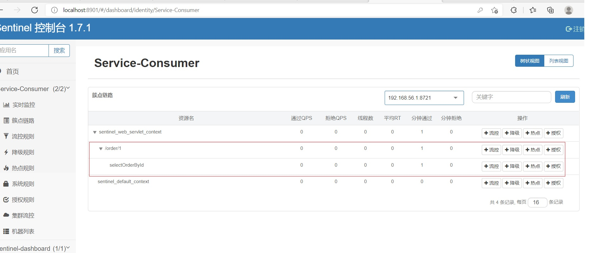

# 3. Sentinel使用

## 3.1 定义资源

**资源** 是 Sentinel 中的核心概念之一。我们说的资源，可以是任何东西，服务，服务里的方法，甚至是一段代
码。最常用的资源是我们代码中的 Java 方法。

**Sentinel 提供了@SentinelResource 注解用于定义资源**，并提供了AspectJ 的扩展用于自动定义资源、处理 BlockException 等。


**@SentinelResource 用于定义资源，并提供可选的异常处理和 fallback 配置项。**

### @SentinelResource 注解包含以下属性

1.**value** ：资源名称，必需项（不能为空）

2. entryType ：entry 类型，可选项（默认为 EntryType.OUT ）

3. **blockHandler / blockHandlerClass** : blockHandler 对应处理 BlockException 的函数名称，可选项。
blockHandler 函数访问范围需要是 public ，返回类型需要与原方法相匹配，参数类型需要和原方法相匹配并
且最后加一个额外的参数，类型为 BlockException 。blockHandler 函数默认需要和原方法在同一个类中。若
希望使用其他类的函数，则可以指定 blockHandlerClass 为对应的类的 Class 对象，注意对应的函数必需
为 static 函数，否则无法解析。

4. **fallback** ：fallback 函数名称，可选项，用于在抛出异常的时候提供 fallback 处理逻辑。fallback 函数可以针
对所有类型的异常（除了 exceptionsToIgnore 里面排除掉的异常类型）进行处理。
:::tip fallback 函数签名和位置要求：
1. 返回值类型必须与原函数返回值类型一致；
3. 方法参数列表需要和原函数一致，或者可以额外多一个 Throwable 类型的参数用于接收对应的异常。
3. fallback 函数默认需要和原方法在同一个类中。若希望使用其他类的函数，则可以指定 fallbackClass
  为对应的类的 Class 对象，注意对应的函数必需为 static 函数，否则无法解析。
:::

4. defaultFallback （since 1.6.0）：默认的 fallback 函数名称，可选项，通常用于通用的 fallback 逻辑（即可
以用于很多服务或方法）。默认 fallback 函数可以针对所有类型的异常（除了 exceptionsToIgnore 里面排除
掉的异常类型）进行处理。若同时配置了 fallback 和 defaultFallback，则只有 fallback 会生效。
:::tip defaultFallback 函数签名要求：
1. 返回值类型必须与原函数返回值类型一致；

2. 方法参数列表需要为空，或者可以额外多一个 Throwable 类型的参数用于接收对应的异常。

3. defaultFallback 函数默认需要和原方法在同一个类中。若希望使用其他类的函数，则可以指定
fallbackClass 为对应的类的 Class 对象，注意对应的函数必需为 static 函数，否则无法解析
:::

4. exceptionsToIgnore （since 1.6.0）：用于指定哪些异常被排除掉，不会计入异常统计中，也不会进入
fallback 逻辑中，而是会原样抛出。

_______________________

```java
package com.tqk.service.impl;


import com.alibaba.csp.sentinel.annotation.SentinelResource;
import com.alibaba.csp.sentinel.slots.block.BlockException;
import com.tqk.pojo.Order;
import com.tqk.pojo.Product;
import com.tqk.service.OrderService;
import com.tqk.service.ProductService;
import org.springframework.beans.factory.annotation.Autowired;
import org.springframework.stereotype.Service;

import java.util.ArrayList;
import java.util.Arrays;

@Service
public class OrderServiceImpl implements OrderService {

    @Autowired
    private ProductService productService;

    /**
     * 根据主键查询订单
     *
     * @param id
     * @return
     */
    // todo 注意：注解方式埋点不支持 private 方法
    @SentinelResource(value = "selectOrderById",
            blockHandler = "selectProductByIdBlockHandler",
            fallback = "selectProductByIdFallback")
    @Override
    public Order selectOrderById(Integer id) {
        return new Order(id, "order-001", "中国", 22788D,
                Arrays.asList(productService.selectProductById(5)));
    }
  // 服务流量控制处理，参数最后多一个 BlockException，其余与原函数一致。
  public Order selectProductByIdBlockHandler(Integer id, BlockException ex) {
    ex.printStackTrace();
    ArrayList<Product> productArrayList = new ArrayList<>();
    productArrayList.add(new Product(id, "服务流量控制处理-托底数据", 1, 2666D));
    return new Order(id, "order-001", "中国", 22788D, productArrayList);
  }
  // 服务熔断降级处理，函数签名与原函数一致或加一个 Throwable 类型的参数
  public Order selectProductByIdFallback(Integer id, Throwable throwable) {
    System.out.println("product-service 服务的 selectProductById 方法出现异常，异常信息如下：" + throwable);
    ArrayList<Product> productArrayList = new ArrayList<>();
    productArrayList.add(new Product(id, "服务熔断降级处理-托底数据", 1, 2666D));
    return new Order(id, "order-001", "中国", 22788D, productArrayList);
  }
}
```

<a data-fancybox title=" Sentinel" href="./image/Sentinel06.jpg"></a>

**官网文档**：  
[https://github.com/alibaba/Sentinel/wiki/%E5%A6%82%E4%BD%95%E4%BD%BF%E7%94%A8#%E5%AE%9A%E4%B9%89%E8%B5%84%E6%BA%90]

**注解支持**  
 官网文档：[https://github.com/alibaba/Sentinel/wiki/%E6%B3%A8%E8%A7%A3%E6%94%AF%E6%8C%81]

<font color='red'><strong>注意：注解方式埋点不支持 private 方法</strong></font>

 ## 3.2 定义规则

Sentinel 的所有规则都可以在**内存态中动态地查询及修改**，**修改之后立即生效**。同时 Sentinel 也提供相关 API，供您来定制自己的规则策略

Sentinel 支持以下几种规则：**流量控制规则、熔断降级规则、系统保护规则、来源访问控制规则 和 热点参数规则**

官网文档：[https://github.com/alibaba/Sentinel/wiki/%E5%A6%82%E4%BD%95%E4%BD%BF%E7%94%A8#%E8%A7%84%E5%88%99%E7%9A%84%E7%A7%8D%E7%B1%BB]

## 3.3 流量控制规则

选择 **簇点链路** 找到定义好的资源 **selectOrderById** 并点击对应的规则按钮进行设置

比如我们设置一个流量控制规则，定义资源访问的 QPS 为 1（每秒能处理查询数目）。

<a data-fancybox title=" Sentinel" href="./image/Sentinel07.jpg"></a>

----------------

<a data-fancybox title=" Sentinel" href="./image/Sentinel08.jpg"></a>


## 3.4 动态规则扩展

SentinelProperties 内部提供了 TreeMap 类型的 datasource 属性用于配置数据源信息。

官网文档：
[https://github.com/alibaba/spring-cloud-alibaba/wiki/Sentinel#%E5%8A%A8%E6%80%81%E6%95%B0%E6%8D%AE%E6%BA%90%E6%94%AF%E6%8C%81]

[https://github.com/alibaba/Sentinel/wiki/%E5%8A%A8%E6%80%81%E8%A7%84%E5%88%99%E6%89%A9%E5%B1%95#%E7%A4%BA%E4%BE%8B]
:::tip 支持：
1. 文件配置规则
2. Nacos 配置规则
3. ZooKeeper 配置规则
4. Apollo 配置规则
5. Redis 配置规则
:::

### 3.4.1 文件配置规则

Sentinel 支持通过本地文件加载规则配置，使用方式如下（限流规则作为演示）：

```yml
spring:
  application:
    name: Service-Consumer
  cloud:
    #客户端启动 Transport 模块来与 Sentinel 控制台进行通信
    sentinel:
      transport:
        port: 8719
        dashboard: localhost:8901
      #Sentinel 支持通过本地文件加载规则配置
      datasource:
        ds1:
          file:
            file: classpath:flowRule.json
            data-type: json
            rule-type: flow
```

#### flowRule.json
```json
[
  {
    "resource": "selectOrderById",
    "count": 2,
    "grade": 2,
    "limitApp": "default",
    "strategy": 0,
    "controlBehavior": 0
  }
]
```

### 3.4.2 属性说明

<a data-fancybox title=" Sentinel" href="./image/Sentinel09.jpg"></a>


### 3.4.3  测试

<a data-fancybox title=" Sentinel" href="./image/Sentinel10.jpg"></a>


## 3.5 熔断降级

模拟服务出错

```java
package com.tqk.service.impl;


import com.alibaba.csp.sentinel.annotation.SentinelResource;
import com.alibaba.csp.sentinel.slots.block.BlockException;
import com.tqk.pojo.Order;
import com.tqk.pojo.Product;
import com.tqk.service.OrderService;
import com.tqk.service.ProductService;
import org.springframework.beans.factory.annotation.Autowired;
import org.springframework.stereotype.Service;

import java.util.ArrayList;
import java.util.Arrays;

@Service
public class OrderServiceImpl implements OrderService {

    @Autowired
    private ProductService productService;

    /**
     * 根据主键查询订单
     *
     * @param id
     * @return
     */
    // todo 注意：注解方式埋点不支持 private 方法
    @SentinelResource(value = "selectOrderById",
            blockHandler = "selectProductByIdBlockHandler",
            fallback = "selectProductByIdFallback")
    @Override
    public Order selectOrderById(Integer id) {
        // todo 模拟查询主键为 1 的商品信息会导致异常
         if (1 == id) {
             throw new RuntimeException("查询主键为 1 的商品信息导致异常");
         }

        return new Order(id, "order-001", "中国", 22788D,
                Arrays.asList(productService.selectProductById(5)));
    }
  // 服务流量控制处理，参数最后多一个 BlockException，其余与原函数一致。
  public Order selectProductByIdBlockHandler(Integer id, BlockException ex) {
    ex.printStackTrace();
    ArrayList<Product> productArrayList = new ArrayList<>();
    productArrayList.add(new Product(id, "服务流量控制处理-托底数据", 1, 2666D));
    return new Order(id, "order-001", "中国", 22788D, productArrayList);
  }
  // 服务熔断降级处理，函数签名与原函数一致或加一个 Throwable 类型的参数
  public Order selectProductByIdFallback(Integer id, Throwable throwable) {
    System.out.println("product-service 服务的 selectProductById 方法出现异常，异常信息如下：" + throwable);
    ArrayList<Product> productArrayList = new ArrayList<>();
    productArrayList.add(new Product(id, "服务熔断降级处理-托底数据", 1, 2666D));
    return new Order(id, "order-001", "中国", 22788D, productArrayList);
  }
}
```

## 3.6 RestTemplate 支持

Spring Cloud Alibaba Sentinel 支持对 RestTemplate 调用的服务进行服务保护。需要在构造 RestTemplateBean 时添加 @SentinelRestTemplate 注解。

### 3.6.1 配置类

```java
/**
 * @author tianqikai
 */
@ComponentScan
@Configuration
public class AppConfig {

    @Bean
    @LoadBalanced
    @SentinelRestTemplate(blockHandler = "handleException", blockHandlerClass = ExceptionUtil.class,
            fallback = "fallback", fallbackClass = ExceptionUtil.class)
    public RestTemplate restTemplate() {
        return new RestTemplate();
    }


     @Bean
     public RandomRule randomRule() {
         return new RandomRule();
     }
}
```
### 3.6.2 服务熔断处理类

```java
package com.tqk.execption;

import com.alibaba.cloud.sentinel.rest.SentinelClientHttpResponse;
import com.alibaba.csp.sentinel.slots.block.BlockException;
import com.alibaba.fastjson.JSON;
import com.tqk.pojo.Product;
import org.springframework.http.HttpRequest;
import org.springframework.http.client.ClientHttpRequestExecution;
import org.springframework.http.client.ClientHttpResponse;

import java.util.ArrayList;

/**
 * @author tianqikai
 */
public class ExceptionUtil {

    // 服务流量控制处理
    public static ClientHttpResponse handleException(HttpRequest request,
                                                     byte[] body,
                                                     ClientHttpRequestExecution execution,
                                                     BlockException exception) {
        exception.printStackTrace();
        ArrayList<Product> productArrayList = new ArrayList<>();
        productArrayList.add(new Product(1, "服务流量控制处理-托底数据", 1, 2666D));
        System.out.println("服务流量控制处理"+ JSON.toJSONString(productArrayList));
        return new SentinelClientHttpResponse(
                JSON.toJSONString(productArrayList));
    }

    // 服务熔断降级处理
    public static ClientHttpResponse fallback(HttpRequest request,
                                                    byte[] body,
                                                    ClientHttpRequestExecution execution,
                                                    BlockException exception) {
        exception.printStackTrace();
        ArrayList<Product> productArrayList = new ArrayList<>();
        productArrayList.add(new Product(1, "服务熔断降级处理-托底数据", 1, 2666D));
        System.out.println("服务熔断降级处理"+ JSON.toJSONString(productArrayList));
        return new SentinelClientHttpResponse(
                JSON.toJSONString(productArrayList));
    }

}
```
### 3.6.3 访问

http://192.168.0.105:9090/order/1

## 3.7 OpenFeign 支持

其实不管是 Hystrix 还是 Sentinel 对于 Feign 的支持，核心代码基本上是一致的，只需要修改依赖和配置文件即可。


**配置类依赖参考前面的章节**

### 3.7.1 熔断降级处理类


### 3.7.2 消费服务类