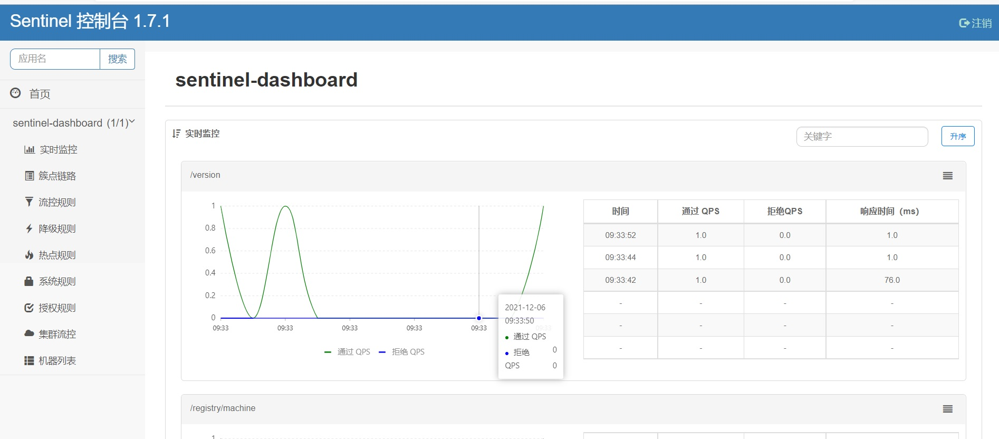
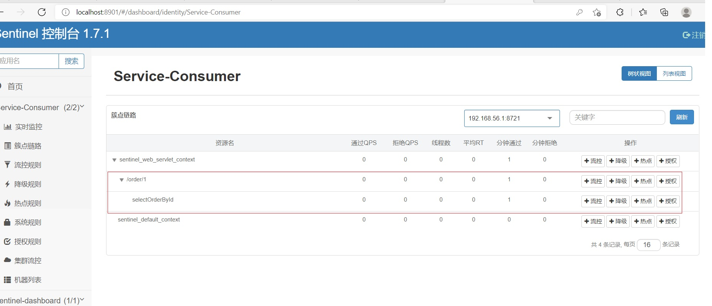

# 2. Sentinel控制台

Sentinel 提供一个轻量级的开源控制台，它提供机器发现以及健康情况管理、监控（单机和集群），规则管理和推送的功能。

<a herf='https://github.com/alibaba/Sentinel/wiki/%E6%8E%A7%E5%88%B6%E5%8F%B0'>官网文档：https://github.com/alibaba/Sentinel/wiki/%E6%8E%A7%E5%88%B6%E5%8F%B0</a>


## 2.1 获取控制台

您可以从<a herf='https://github.com/alibaba/Sentinel/releases'>release 页面</a> 下载最新版本的控制台 jar 包。

也可以从最新版本的源码自行构建 Sentinel 控制台：

1. 下载 <a herf='https://github.com/alibaba/Sentinel/tree/master/sentinel-dashboard'>控制台</a> 工程
2. 使用以下命令将代码打包成一个 fat jar: mvn clean package


## 2.2 启动控制台

**Linux版本**
```shell
nohup java -Dserver.port=8901 -Dcsp.sentinel.dashboard.server=49.233.34.168:8901 -Dproject.name=sentinel-dashboard -jar sentinel-dashboard-1.7.1.jar &
```
**Window版本**
```bat
java -Dserver.port=8901 -Dcsp.sentinel.dashboard.server=localhost:8901 -Dproject.name=sentinel-dashboard -jar sentinel-dashboard-1.7.1.jar pause
```

## 2.3 登录控制台


<a herf='49.233.34.168:8901'>49.233.34.168:8901</a>

从 Sentinel 1.6.0 起，Sentinel 控制台引入基本的登录功能，**默认用户名和密码都是 sentinel** 。可以参考鉴权模块文档配置用户名和密码。

<a data-fancybox title=" Sentinel" href="./image/Sentinel04.jpg"></a>


## 2.4 环境准备

### 2.4.1 搭建项目

eureka-server ：注册中心
eureka-server02 ：注册中心
product-service ：商品服务，提供了 /product/{id} 接口
order-service-rest ：订单服务，基于 Ribbon 通过 RestTemplate 调用商品服务
order-server-feign ：订单服务，基于 Feign 通过声明式服务调用商品服务

<a data-fancybox title=" Sentinel" href="./image/Sentinel05.jpg"></a>

### 2.4.2 客户端接入控制台

#### 父工程需要添加如下依赖

```xml
    <dependencyManagement>
        <dependencies>
           <dependency>
             <groupId>com.alibaba.cloud</groupId>
             <artifactId>spring-cloud-alibaba-dependencies</artifactId>
             <version>2.1.0.RELEASE</version>
             <type>pom</type>
             <scope>import</scope>
           </dependency>
        </dependencies>
    </dependencyManagement>
```
#### 子工程需要添加如下依赖
```xml
    <!-- spring boot sentinel 依赖 -->
    <dependency>
        <groupId>com.alibaba.cloud</groupId>
        <artifactId>spring-cloud-starter-alibaba-sentinel</artifactId>
    </dependency>
```
#### 配置文件
```yml
spring:
    #客户端启动 Transport 模块来与 Sentinel 控制台进行通信
  cloud:
    sentinel:
      transport:
        port: 8719
        dashboard: localhost:8901
```
#### 初始化客户端

**确保客户端有访问量，Sentinel 会在客户端首次调用的时候进行初始化，开始向控制台发送心跳包。**
简单的理解就是：访问一次客户端，Sentinel 即可完成客户端初始化操作，并持续向控制台发送心跳包。


首先确保 Sentinel 是启动状态，然后依次启动 eureka-server，eureka-server02，product-service，order-service-rest。

多次访问：http://localhost:9090/order/1 然后查看控制台 实时监控 结果如下

<a data-fancybox title=" Sentinel" href="./image/Sentinel06.jpg"></a>
