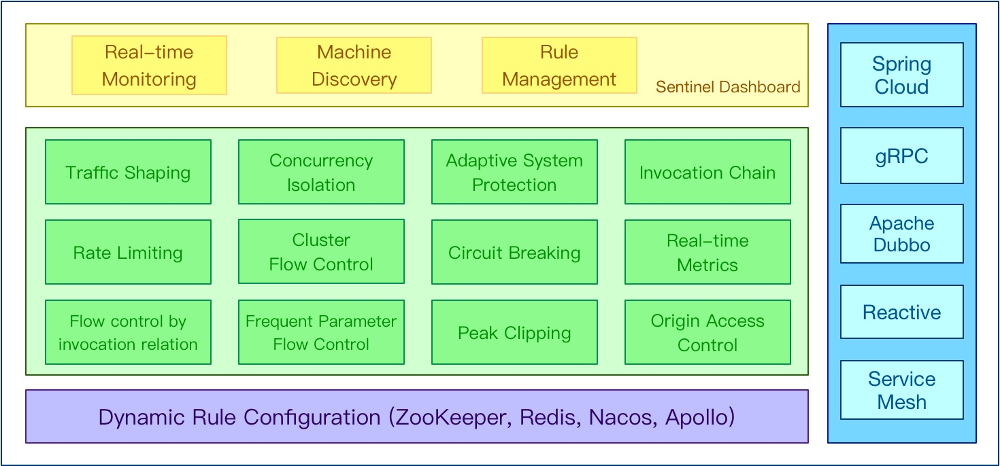
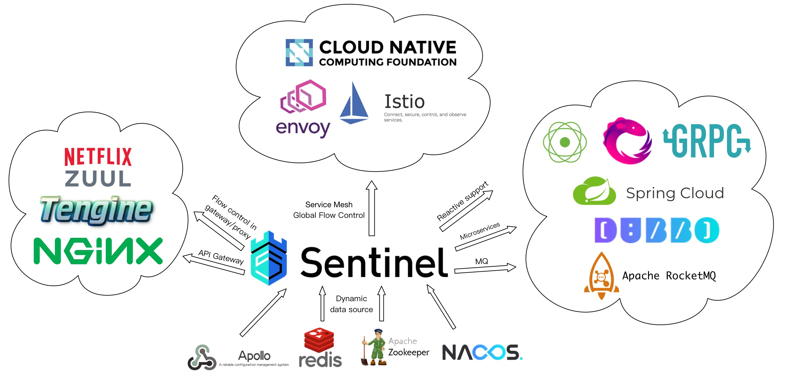
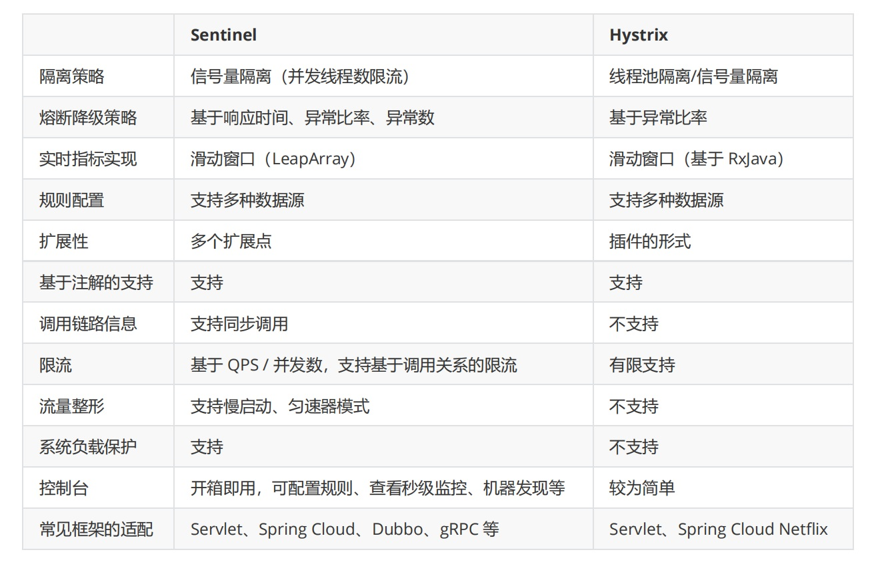

# 1. Sentinel简介

## 1.1 Sentinel特征

随着微服务的流行，服务和服务之间的稳定性变得越来越重要。**Sentinel 以流量为切入点，从流量控制、熔断降级、系统负载保护**等多个维度保护服务的稳定性

:::tip Sentinel 具有以下特征：
1. 丰富的应用场景：Sentinel 承接了阿里巴巴近 10 年的双十一大促流量的核心场景，例如秒杀（即突发流量控制
在系统容量可以承受的范围）、消息削峰填谷、集群流量控制、实时熔断下游不可用应用等。

2. 完备的实时监控：Sentinel 同时提供实时的监控功能。您可以在控制台中看到接入应用的单台机器秒级数据，
甚至 500 台以下规模的集群的汇总运行情况。

3. 广泛的开源生态：Sentinel 提供开箱即用的与其它开源框架/库的整合模块，例如与 Spring Cloud、Dubbo、
gRPC 的整合。您只需要引入相应的依赖并进行简单的配置即可快速地接入 Sentinel。

4. 完善的 SPI 扩展点：Sentinel 提供简单易用、完善的 SPI 扩展接口。您可以通过实现扩展接口来快速地定制逻
辑。例如定制规则管理、适配动态数据源等
:::

_____________________

Sentinel 目前已经针对 Servlet、Dubbo、Spring Boot/Spring Cloud、gRPC 等进行了适配，用户只需引入相应
依赖并进行简单配置即可非常方便地享受 Sentinel 的高可用流量防护能力。Sentinel 还为 Service Mesh 提供了集群
流量防护的能力。未来 Sentinel 还会对更多常用框架进行适配。

## 1.2 Sentinel vs Hystrix

### 1.2.1 Hystrix 迁移 Sentinel 方案

Hystrix 的关注点在于**隔离和熔断为主的容错机制**，超时或被熔断的调用将会快速失败，并可以提供 fallback 机制。

:::tip Sentinel的关注点在于：
1. 多样化的流量控制
2. 熔断降级
3. 系统负载保护
4. 实时监控和控制台
:::

-------------

Sentinel 提供了从 Hystrix 迁移到 Sentinel 的方案，官网：
https://github.com/alibaba/Sentinel/wiki/Guideline:-%E4%BB%8E-Hystrix-
%E8%BF%81%E7%A7%BB%E5%88%B0-Sentinel

## 1.3 Sentinel 核心部分

:::tip Sentinel的使用可以分为两个部分：
1. 核心库（Java 客户端）：不依赖任何框架/库，能够运行于 Java 7 及以上的版本的运行时环境，同时对 Dubbo /Spring Cloud 等框架也有较好的支持（见 主流框架适配）

2. 控制台（Dashboard）：控制台主要负责管理推送规则、监控、集群限流分配管理、机器发现等。
:::
