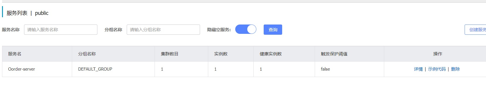
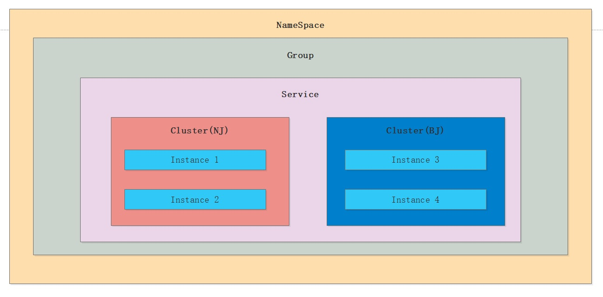
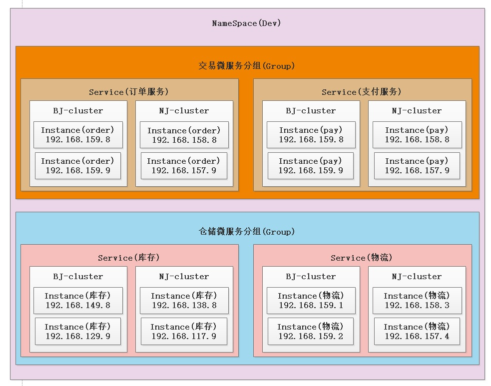
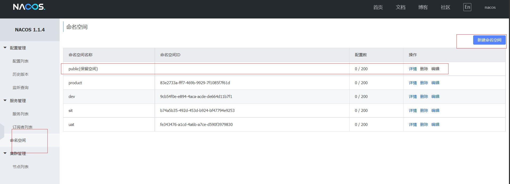
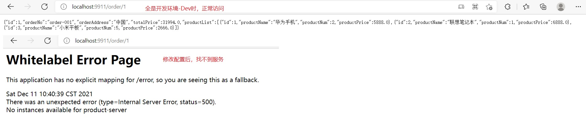
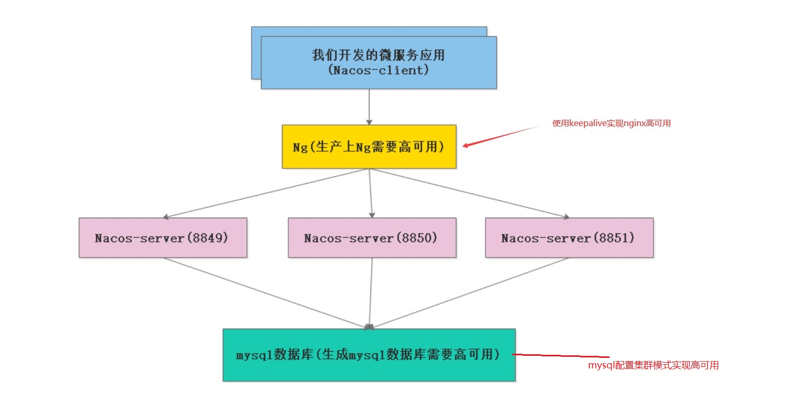
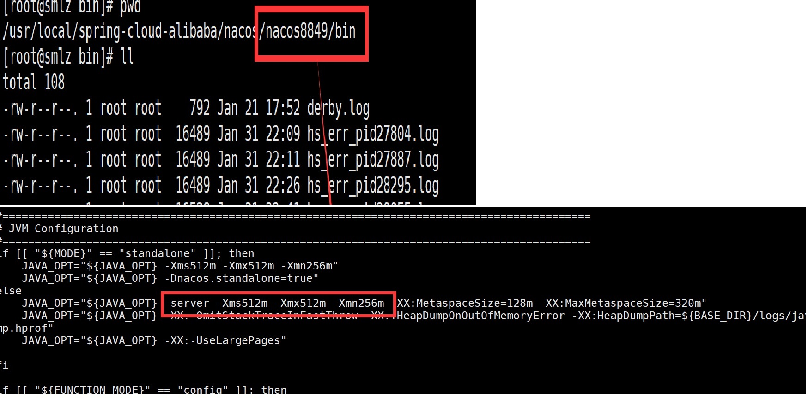
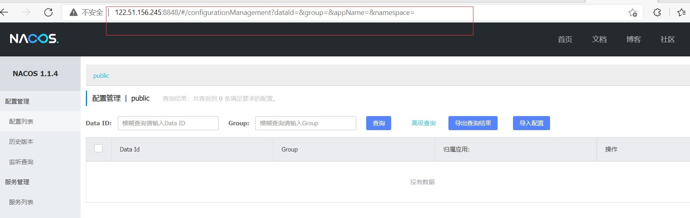
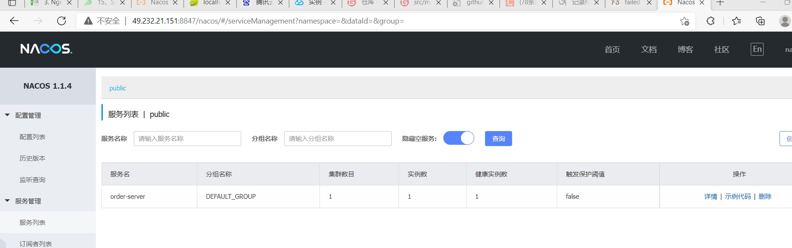

# 1. Nacos环境搭建

## 1.1 Nacos服务端搭建

下载地址:[https://github.com/alibaba/Nacos/releases]

### 1.1.1 linux环境启停

```sh
#Nacos包解压
tar -zxvf nacos-server-1.1.4.tar.gz 
cd nacos
cd bin
#启动单机
sh startup.sh -m standalone
#检查nacos启动的端口
lsof -i:8848

# 停止nocas 在nocas/bin目录下 执行 
sh shutdown.sh
```
**访问nocas的服务端** : [http://101.43.21.33:8848/nacos/index.html]


## 1.2 Nacos Client端的搭建

### 1.2.1 引入依赖
```xml
    <!--nacos注册中心-->
    <dependency>
        <groupId>com.alibaba.cloud</groupId>
        <artifactId>spring-cloud-starter-alibaba-nacos-discovery</artifactId>
    </dependency>
```
### 1.2.2 配置文件

```yml
server:
  port: 9911
spring:
  cloud:
    nacos:
      discovery:
        server-addr: 101.43.21.33:8848
  application:
    name: Oorder-server

```

### 1.2.3 启动类
```java
@SpringBootApplication
@EnableDiscoveryClient
public class OrderApplication {
    public static void main(String[] args) {
        SpringApplication.run(OrderApplication.class,args);
    }
}
```
<a data-fancybox title=" nacos" href="./image/nacos01.jpg"></a>


## 1.3 Nacos 领域模型划分以及概念详解

<a data-fancybox title=" nacos" href="./image/nacos02.jpg"></a>

<a data-fancybox title=" nacos" href="./image/nacos03.jpg"></a>

### 1.3.1 默认NameSpace

NameSpace(默认的NameSpace是”public“ NameSpace可以进行**资源隔离**

比如我们dev环境下的NameSpace下的服务是调用不到prod的NameSpace下 的微服务)

**环境隔离**
<a data-fancybox title=" nacos" href="./image/nacos04.jpg"></a>


### 1.3.2 验证服务隔离

#### order-server
```yml
server:
  port: 9911
spring:
  cloud:
    nacos:
      discovery:
        server-addr: 101.43.21.33:8848
        #dev--开发环境
        namespace: 9cb54f0e-e894-4aca-acde-de664d11b7f1
  application:
    name: order-server
```


#### product-server
```yml
server:
  port: 9922
spring:
  cloud:
    nacos:
      discovery:
        server-addr: 101.43.21.33:8848
        #dev--开发环境
#        namespace: 9cb54f0e-e894-4aca-acde-de664d11b7f1
        #product--生产环境
        namespace: 83e2733a-fff7-469b-9929-7f1085f7f61d
  application:
    name: product-server
```

#### 访问测试

[http://localhost:9911/order/1]

<a data-fancybox title=" nacos" href="./image/nacos05.jpg"></a>

## 1.4 Nacos高可用集群模式

<a data-fancybox title=" nacos" href="./image/nacos06.jpg"></a>


### 1.4.1 安装nginx

```sh
#下载nginx
wget http://nginx.org/download/nginx-1.14.2.tar.gz

#解压nginx
tar -xzvf nginx-1.14.2.tar.gz 

cd nginx­1.14.2
# 执行命令指定安装目录
./configure ­­ --prefix=/usr/local/nginx­1.14.2
# 编译
make

make install

# 进入该目录下的配置目录conf
cd /usr/local/nginx­1.14.2/conf

#修改ng的conf文件
----------------------
# 重启
cd /usr/local/nginx­1.14.2/sbin

./nginx -s reload
```
--------------------------

```conf
#user  nobody;
worker_processes  1;

events {
    worker_connections  1024;
}


http {
    include       mime.types;
    default_type  application/octet-stream;

    sendfile        on;
    keepalive_timeout  65;

    #gzip  on;

   upstream  nacos-cluster {
        server  172.21.0.16:8849;
        server  172.21.0.16:8850;
        server  172.21.0.16:8851;
    }
    server {
        listen       8848;
        server_name  122.51.156.245;
        location /nacos/ {
                proxy_pass   http://nacos-cluster/nacos/;
        }
    }
}

```

### 1.4.2 安装mysql

**mysql5.7版本** 不然会有问题

### 1.4.3 安装三台Nacos

```sh

## 创建三个实例 nacos8849 nacos8850 nacos8851
[root@TXYUN-NO1 nacos]# ls -lrt
total 50916
-rw-r--r-- 1 root root 52115827 Nov 23 22:08 nacos-server-1.1.4.tar.gz
drwxr-xr-x 5 root root     4096 Dec 11 14:57 nacos
drwxr-xr-x 8 root root     4096 Dec 11 15:44 nacos8851
drwxr-xr-x 8 root root     4096 Dec 11 15:51 nacos8849
drwxr-xr-x 8 root root     4096 Dec 11 16:02 nacos8850
```

#### 修改配置文件

**application.properties**

修改nacos8849/conf文件 application.properties

```properties
#注意端口
server.port=8849


spring.datasource.platform=mysql

# 数据库实例数量
db.num=1
# 自己数据库的连接信息

## 172.21.0.16 内网地址-不要用公网地址，不然会超时
db.url.0=jdbc:mysql://172.21.0.16:3310/nacostest?useUnicode=true&characterEncoding=utf8&allowMultiQueries=true&serverTimezone=GMT%2B8
db.user=root
db.password=12345@tqk


```
修改nacos8849/conf文件 把原来的cluster.conf.example改为 cluster.conf文件

```conf
#it is ip
## 172.21.0.16 内网地址-不要用公网地址，不然会超时
172.21.0.16:8849
172.21.0.16:8850
172.21.0.16:8851
```

#### 创建mysql用户

创建一个数据库（需要自己创建一个数据库） 脚本的位子在**nacos/conf/nacos-mysql.sql**

#### 启动脚本JVM修改

<a data-fancybox title="nacos" href="./image/nacos09.jpg"></a>


#### 启动

执行./startup.sh 启动成功的依据 

查看日志 /usr/local/spring-cloud-alibaba/nacos/nacos8850/logs/start.out

```log
2021-12-11 15:51:40,679 INFO The server IP list of Nacos is [49.232.21.151:8849, 49.232.21.151:8850, 49.232.21.151:8851]

2021-12-11 15:51:41,699 INFO Nacos is starting...

2021-12-11 15:51:48,251 INFO Nacos Log files: /root/nacos/nacos8849/logs/

2021-12-11 15:51:48,252 INFO Nacos Conf files: /root/nacos/nacos8849/conf/

2021-12-11 15:51:48,252 INFO Nacos Data files: /root/nacos/nacos8849/data/

2021-12-11 15:51:48,252 INFO Nacos started successfully in cluster mode.

```

<a data-fancybox title="nacos" href="./image/nacos10.jpg"></a>

<a data-fancybox title="nacos" href="./image/nacos11.jpg"></a>


## 1.4.4 搭建换进遇见的问题

1. mysql版本问题

一定要选用5.7版本 ；**mysql8版本 nacos连接不上**

2. 数据库连接串地址 还有配置地址都用内网地址，传输速度快；不然注册会超时失败