# 2. Nacos配置中心

<a data-fancybox title=" nacos" href="./image/nacos07.jpg">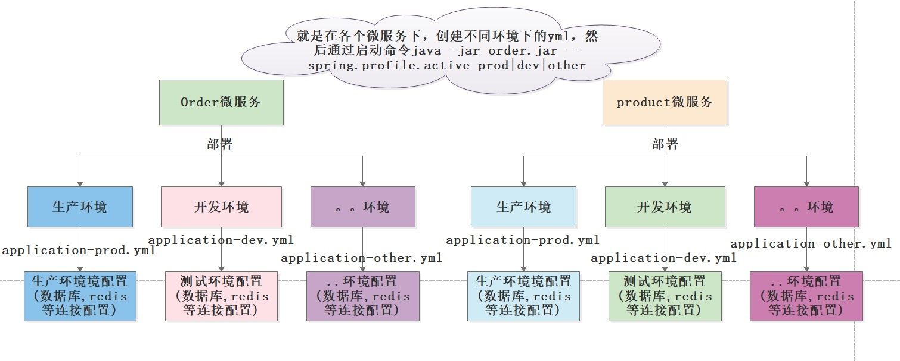</a>

**上图缺点**: 所有的环境的配置都是明文的 被太多开发人员都知道了。 


**业务场景**：张三开发了一个新功能,业务需要，保留原来老逻辑的代码，所有他抽取了一个开关变量 isNewBusi来控制，突然新功能上了生产后，发现有bug,怎么做到修改isNewBusi的值不需要重启

--------------------

引入配置中心

1. 不同环境不管配置 
2. 配置属性动态刷新

<a data-fancybox title=" nacos" href="./image/nacos08.jpg">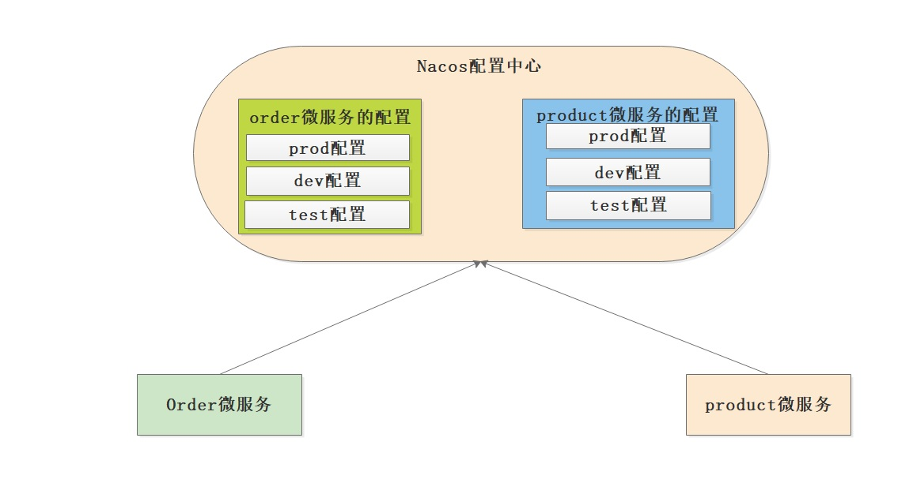</a>


## 2.1 简单入门

### 2.1.1 添加依赖

#### 父项目

```xml
<?xml version="1.0" encoding="UTF-8"?>
<project xmlns="http://maven.apache.org/POM/4.0.0" xmlns:xsi="http://www.w3.org/2001/XMLSchema-instance"
         xsi:schemaLocation="http://maven.apache.org/POM/4.0.0 https://maven.apache.org/xsd/maven-4.0.0.xsd">
    <modelVersion>4.0.0</modelVersion>
    <parent>
        <groupId>org.springframework.boot</groupId>
        <artifactId>spring-boot-starter-parent</artifactId>
<!--        <version>2.1.3.RELEASE</version>-->
        <version>2.3.2.RELEASE</version>
    </parent>
    <groupId>com.tqk</groupId>
    <artifactId>NacosConfigDemo</artifactId>
    <version>0.0.1-SNAPSHOT</version>
    <name>NacosConfigDemo</name>

    <packaging>pom</packaging>

    <modules>
        <module>service-goods</module>
        <module>service-order</module>
    </modules>

    <properties>
        <java.version>1.8</java.version>
        <spring-cloud.version>Greenwich.RELEASE</spring-cloud.version>
        <spring-cloud-alibaba.version>2.1.0.RELEASE</spring-cloud-alibaba.version>
    </properties>
    <dependencies>
        <!--nacos discovery-->
        <dependency>
            <groupId>com.alibaba.cloud</groupId>
            <artifactId>spring-cloud-starter-alibaba-nacos-discovery</artifactId>
        </dependency>
        <!--nacos config-->
        <dependency>
            <groupId>com.alibaba.cloud</groupId>
            <artifactId>spring-cloud-starter-alibaba-nacos-config</artifactId>
        </dependency>
    </dependencies>

    <dependencyManagement>
        <dependencies>
            <!--spring cloud 依赖-->
            <dependency>
                <groupId>org.springframework.cloud</groupId>
                <artifactId>spring-cloud-dependencies</artifactId>
                <version>${spring-cloud.version}</version>
                <type>pom</type>
                <scope>import</scope>
            </dependency>
            <!--spring cloud alibaba依赖-->
            <dependency>
                <groupId>com.alibaba.cloud</groupId>
                <artifactId>spring-cloud-alibaba-dependencies</artifactId>
                <version>${spring-cloud-alibaba.version}</version>
                <type>pom</type>
                <scope>import</scope>
            </dependency>
        </dependencies>
    </dependencyManagement>

    <build>
        <plugins>
            <plugin>
                <groupId>org.springframework.boot</groupId>
                <artifactId>spring-boot-maven-plugin</artifactId>
            </plugin>
        </plugins>
    </build>

    <repositories>
        <repository>
            <id>spring-milestones</id>
            <name>Spring Milestones</name>
            <url>https://repo.spring.io/milestone</url>
        </repository>
    </repositories>

</project>


```

#### 子项目

```xml
<?xml version="1.0" encoding="UTF-8"?>
<project xmlns="http://maven.apache.org/POM/4.0.0" xmlns:xsi="http://www.w3.org/2001/XMLSchema-instance"
         xsi:schemaLocation="http://maven.apache.org/POM/4.0.0 https://maven.apache.org/xsd/maven-4.0.0.xsd">
    <modelVersion>4.0.0</modelVersion>
    <parent>
        <groupId>com.tqk</groupId>
        <artifactId>NacosConfigDemo</artifactId>
        <version>0.0.1-SNAPSHOT</version>
    </parent>

    <groupId>com.tqk</groupId>
    <artifactId>service-order</artifactId>
    <version>0.0.1-SNAPSHOT</version>
    <name>service-order</name>

    <properties>
        <java.version>1.8</java.version>
    </properties>

    <dependencies>
        <dependency>
            <groupId>org.springframework.boot</groupId>
            <artifactId>spring-boot-starter</artifactId>
        </dependency>

        <dependency>
            <groupId>org.springframework.boot</groupId>
            <artifactId>spring-boot-starter-test</artifactId>
            <scope>test</scope>
        </dependency>

        <dependency>
            <groupId>org.springframework.boot</groupId>
            <artifactId>spring-boot-starter-web</artifactId>
        </dependency>
    </dependencies>

    <build>
        <plugins>
            <plugin>
                <groupId>org.springframework.boot</groupId>
                <artifactId>spring-boot-maven-plugin</artifactId>
            </plugin>
        </plugins>
    </build>

</project>
```
### 2.1.2 配置文件
**bootstrap.yml**
```yml
server:
  port: 8081
spring:
  #prefix：spring.application.name 应用名
  application:
    name: service-goods
  cloud:
    nacos:
      #注册中心
      discovery:
        server-addr: 101.43.21.33:8848
      #配置中心
      config:
        server-addr: 101.43.21.33:8848
        #file-extension：为配置内容的数据格式，目前只支持 properties 和 yaml 类型
        file-extension: yaml
  profiles:
    active: dev

```
### 2.1.3 启动类
```java
package com.tqk.servicegoods;

import org.springframework.boot.SpringApplication;
import org.springframework.boot.autoconfigure.SpringBootApplication;
import org.springframework.cloud.client.discovery.EnableDiscoveryClient;
import org.springframework.context.ConfigurableApplicationContext;

@SpringBootApplication
@EnableDiscoveryClient
public class ServiceGoodsApplication {

    public static void main(String[] args) {
        ConfigurableApplicationContext applicationContext =SpringApplication.run(ServiceGoodsApplication.class, args);

        System.out.println(applicationContext.getEnvironment().getProperty("service.version"));
        System.out.println(applicationContext.getEnvironment().getProperty("name"));
    }

}

```
### 2.1.4 config

```java
package com.tqk.servicegoods.config;

import org.springframework.boot.context.properties.ConfigurationProperties;
import org.springframework.stereotype.Component;

/**
 * @author tianqikai
 */
@Component
@ConfigurationProperties(prefix = "mysql")
public class MysqlProperties {

    private String host;
    private Integer port;
    private String username;
    private String password;

    public String getHost() {
        return host;
    }

    public void setHost(String host) {
        this.host = host;
    }

    public Integer getPort() {
        return port;
    }

    public void setPort(Integer port) {
        this.port = port;
    }

    public String getUsername() {
        return username;
    }

    public void setUsername(String username) {
        this.username = username;
    }

    public String getPassword() {
        return password;
    }

    public void setPassword(String password) {
        this.password = password;
    }

}
```

### 2.1.5 控制层

```java
package com.tqk.servicegoods.controller;

import com.tqk.servicegoods.config.MysqlProperties;
import org.springframework.beans.factory.annotation.Autowired;
import org.springframework.beans.factory.annotation.Value;
import org.springframework.cloud.context.config.annotation.RefreshScope;
import org.springframework.web.bind.annotation.GetMapping;
import org.springframework.web.bind.annotation.RestController;

/**
 * @author tianqikai
 */
@RefreshScope
@RestController
public class MysqlController {

    @Autowired
    private MysqlProperties mySQLProperties;

    @Value("${name}")
    private String name;

    @GetMapping("/name")
    public String getName() {
        return name;
    }

    @GetMapping("/mysql")
    public MysqlProperties getMySQLProperties() {
        return mySQLProperties;
    }

}
```

### 2.1.6 nacos配置文件

<a data-fancybox title=" nacos" href="./image/nacos12.jpg">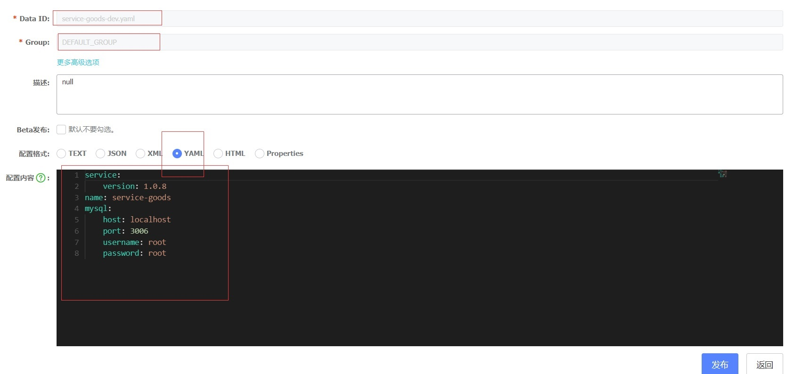</a>

## 2.2  Config相关配置

Nacos 数据模型 Key 由三元组唯一确定, Namespace默认是空串，公共命名空间（public），分组默认是 **DEFAULT_GROUP**

**通过这三个元素可以进行环境隔离**

<a data-fancybox title=" nacos" href="./image/nacos13.jpg">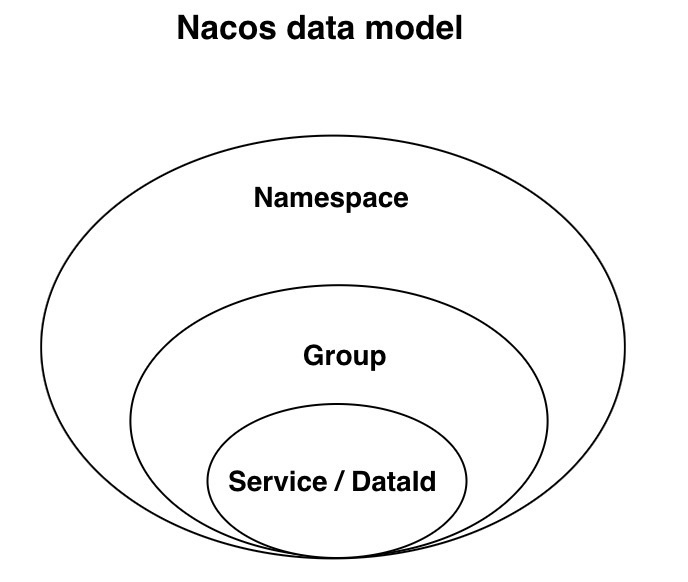</a>

### 2.2.1  支持配置的动态更新

**Nacos配置中心配置信息修改后，微服务能够不停机动态刷新**

```yml
# version: 1.0.9 -> version: 1.10.0
service:
    version: 1.10.0
```

```log
1.0.9
service-goods
2021-12-12 19:36:18.125  INFO 39556 --- [1.43.21.33_8848] trationDelegate$BeanPostProcessorChecker : Bean 'org.springframework.cloud.autoconfigure.ConfigurationPropertiesRebinderAutoConfiguration' of type [org.springframework.cloud.autoconfigure.ConfigurationPropertiesRebinderAutoConfiguration$$EnhancerBySpringCGLIB$$af6a8e77] is not eligible for getting processed by all BeanPostProcessors (for example: not eligible for auto-proxying)
2021-12-12 19:36:18.748  INFO 39556 --- [1.43.21.33_8848] c.a.c.n.c.NacosPropertySourceBuilder     : Loading nacos data, dataId: 'service-goods-dev.yaml', group: 'DEFAULT_GROUP'
2021-12-12 19:36:18.749  INFO 39556 --- [1.43.21.33_8848] b.c.PropertySourceBootstrapConfiguration : Located property source: CompositePropertySource {name='NACOS', propertySources=[NacosPropertySource {name='service-goods-dev.yaml'}, NacosPropertySource {name='service-goods.yaml'}]}
2021-12-12 19:36:18.751  INFO 39556 --- [1.43.21.33_8848] o.s.boot.SpringApplication               : The following profiles are active: dev
2021-12-12 19:36:18.760  INFO 39556 --- [1.43.21.33_8848] o.s.boot.SpringApplication               : Started application in 1.138 seconds (JVM running for 19.228)
2021-12-12 19:36:18.792  INFO 39556 --- [1.43.21.33_8848] o.s.c.e.event.RefreshEventListener       : Refresh keys changed: [service.version]
1.10.0
service-goods
```

### 2.2.2  支持profile粒度的配置

spring­cloud­starter­alibaba­nacos­config 在加载配置的时候，不仅仅加载了以 dataid 为 ${spring.application.name}.${file-extension:properties} 为前缀的基础配置，还加载了dataid为 ${spring.application.name}-${profile}.${file-extension:properties} 的基础配置。在日常开发中如果遇到多套环境下的不 同配置，可以通过Spring 提供的 ${spring.profiles.active} 这个配置项来配置。

```yml
spring:
  profiles:
    #开发环境
    active: dev
```

### 2.2.3  支持自定义 namespace 的配置

用于进行租户粒度的配置隔离。不同的命名空间下，可以存在相同的 Group 或 Data ID 的配置。Namespace 的常用场景 之一是不同环境的配置的区分隔离，例如开发测试环境和生产环境的资源（如配置、服务）隔离等。 在没有明确指定 ${spring.cloud.nacos.config.namespace} 配置的情况下， 默认使用的是 Nacos 上 Public 这个 namespace。如果需要使用自定义的命名空间，可以通过以下配置来实现：

```yml
spring:
  #prefix：spring.application.name 应用名
  application:
    name: service-goods
  cloud:
    nacos:
      #注册中心
      discovery:
        server-addr: 101.43.21.33:8848
      #配置中心
      config:
        server-addr: 101.43.21.33:8848
        #file-extension：为配置内容的数据格式，目前只支持 properties 和 yaml 类型
        file-extension: yaml
        namespace: 9cb54f0e-e894-4aca-acde-de664d11b7f1
  profiles:
    #开发环境
    active: dev
```


### 2.2.4  支持自定义 Group 的配置

Group是组织配置的维度之一。通过一个有意义的字符串（如 Buy 或 Trade ）对配置集进行分组，从而区分 Data ID 相 同的配置集。当您在 Nacos 上创建一个配置时，如果未填写配置分组的名称，则配置分组的名称默认采用 DEFAULT_GROUP 。

配置分组的常见场景：不同的应用或组件使用了相同的配置类型，如 database_url 配置和 MQ_topic 配置。 在没有明确指定 ${spring.cloud.nacos.config.group} 配置的情况下，默认是DEFAULT_GROUP 。如果需要自定义自己的 Group，可以通过以下配置来实现：
```yml
spring:
  #prefix：spring.application.name 应用名
  application:
    name: service-goods
  cloud:
    nacos:
      #注册中心
      discovery:
        server-addr: 101.43.21.33:8848
      #配置中心
      config:
        server-addr: 101.43.21.33:8848
        #file-extension：为配置内容的数据格式，目前只支持 properties 和 yaml 类型
        file-extension: yaml
        namespace: 9cb54f0e-e894-4aca-acde-de664d11b7f1
        #默认 DEFAULT_GROUP
        group: DEFAULT_GROUP
  profiles:
    #开发环境
    active: dev
```

### 2.2.5  支持自定义扩展的 Data Id 配置

Data ID 是组织划分配置的维度之一。Data ID 通常用于组织划分系统的配置集。一个系统或者应用可以包含多个配置 集，每个配置集都可以被一个有意义的名称标识。Data ID 通常采用类 Java 包（如 com.taobao.tc.refund.log.level）的命 名规则保证全局唯一性。此命名规则非强制。 

:::tip shared-configs
```yml
    # 支持多个共享 Data Id 的配置，优先级小于extension-configs,自定义 Data Id 配置 属性是个集合，内部由 Config POJO 组成。Config 有 3 个属性，分别是 dataId, group 以及 refresh
    # ※※※※※某些版本不支持  -》shared-dataids
    shared-configs[0]:
        data-id: common.yaml # 配置文件名-Data Id
        group: DEFAULT_GROUP   # 默认为DEFAULT_GROUP
        refresh: false   # 是否动态刷新，默认为false
    shared-configs[1]:
        data-id: common2.yaml
        group: DEFAULT_GROUP
        refresh: true
```
:::

:::tip extension-configs
1. 通过 spring.cloud.nacos.config.ext-config[n].data-id 的配置方式来支持多个 Data Id 的配置。
2. 通过 spring.cloud.nacos.config.ext-config[n].group 的配置方式自定义 Data Id 所在的组，不明确配置的话，默认是 DEFAULT_GROUP。
3. 通过 spring.cloud.nacos.config.ext-config[n].refresh 的配置方式来控制该 Data Id 在配置变更时，是否支持应用中可动态刷新， 感知到最新的配置值。默认是不支持的。

```yml
    # ※※※※※某些版本是 extension-configs
    ext-config[0]:
        data-id: common.yaml # 配置文件名-Data Id
        group: DEFAULT_GROUP   # 默认为DEFAULT_GROUP
        refresh: false   # 是否动态刷新，默认为false
    ext-config[1]:
        data-id: common2.yaml
        group: DEFAULT_GROUP
        refresh: true
```
:::

:::tip shared-dataids
1. 通过spring.cloud.nacos.config.shared-dataids 来支持多个共享 Data Id 的配置，多个之间用逗号隔开。

2. 通过 spring.cloud.nacos.config.refreshable-dataids 来支持哪些共享配置的 Data Id 在配置变化时，应用中是否可动态刷新， 感知到最新的配置值，多个 Data Id 之间用逗号隔开。如果没有明确配置，默认情况下所有共享配置的 Data Id 都不支持动态刷新

**项目中常用这种方式**

```yml
shared-dataids: common.yaml,common2.yaml
refreshable-dataids: common.yaml,common2.yaml
```
:::

**通过自定义扩展的 Data Id 配置，既可以解决多个应用间配置共享的问题，又可以支持一个应用有多个配置文件**

### 2.2.6  RefreshScope动态感知

@Value注解可以获取到配置中心的值，但是无法动态感知修改后的值，需要利用@RefreshScope注解

```java
@RefreshScope
@RestController
public class MysqlController {

    @Autowired
    private MysqlProperties mySQLProperties;
    
    @Value("${user.name}")
    private String name;

    @GetMapping("/name")
    public String getName() {
        return name;
    }

    @GetMapping("/mysql")
    public MysqlProperties getMySQLProperties() {
        return mySQLProperties;
    }

}
```

### 2.2.7 配置的优先级

:::tip 配置信息优先级
1. A: 通过 spring.cloud.nacos.config.shared-dataids支持多个共享 Data Id 的配置

2. B: 通过 spring.cloud.nacos.config.ext-config[n].data-id 的方式支持多个扩展 Data Id 的配置，多个Data Id 同时配置时，他的优先级关系是spring.cloud.nacos.config.ext-config[n].data-id 其中 n 的值越大，优先级越高。

3. C: 通过内部相关规则(应用名、扩展名 )自动生成相关的 Data Id 配置

**当三种方式共同使用时，他们的一个优先级关系是:C > B >A**
:::


## 2.3   nacos config client源码分析

### 2.3.1 配置中心的架构

<a data-fancybox title=" nacos" href="./image/nacos14.jpg">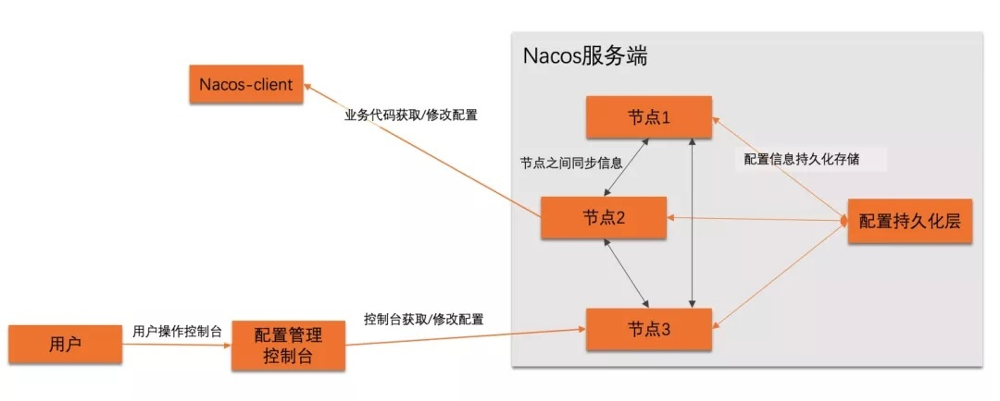</a>

<a data-fancybox title=" nacos" href="./image/nacos15.jpg">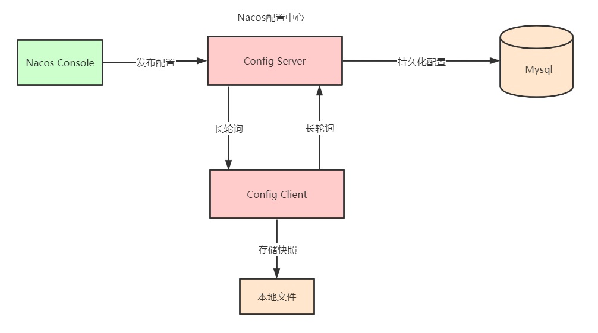</a>

### 2.3.2 获取配置

**配置中心核心接口ConfigService**
<a data-fancybox title=" nacos" href="./image/nacos16.jpg">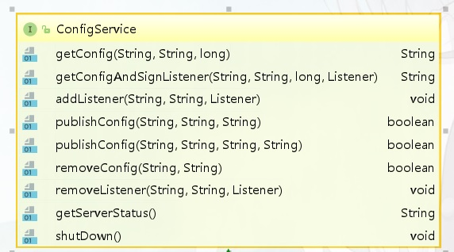</a>

获取配置的主要方法是 NacosConfigService 类的 getConfig 方法，通常情况下该方法直接从本地文件中取得配置 的值，如果本地文件不存在或者内容为空，则再通过 HTTP GET 方法从远端拉取配置，并保存到本地快照中。当通过 HTTP 获取远端配置时，Nacos 提供了两种熔断策略，一是超时时间，二是最大重试次数，默认重试三次。

<a data-fancybox title=" nacos" href="./image/nacos17.jpg">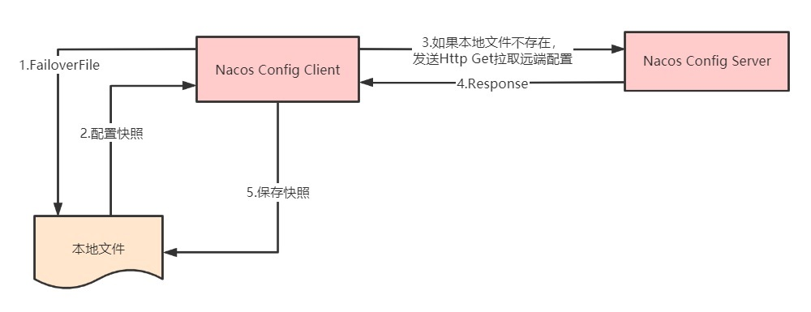</a>

**本地缓存在文件一般在用户目录下nacos**
```
#我自己的本机
C:\Users\tianqikai\nacos\config\fixed-101.43.21.33_8848_nacos\snapshot\DEFAULT_GROUP
```
### 2.3.3 注册监听器

配置中心客户端会通过对配置项注册监听器达到在配置项变更的时候执行回调的功能。

```
NacosConfigService#getConfigAndSignListener 
ConfigService#addListener
```
Nacos 可以通过以上方式注册监听器，它们内部的实现均是调用 ClientWorker 类的 addCacheDataIfAbsent。其 中 CacheData 是一个维护配置项和其下注册的所有监听器的实例，所有的 CacheData 都保存在 ClientWorker 类中的 原子 cacheMap 中，其内部的核心成员有：

<a data-fancybox title=" nacos" href="./image/nacos18.jpg">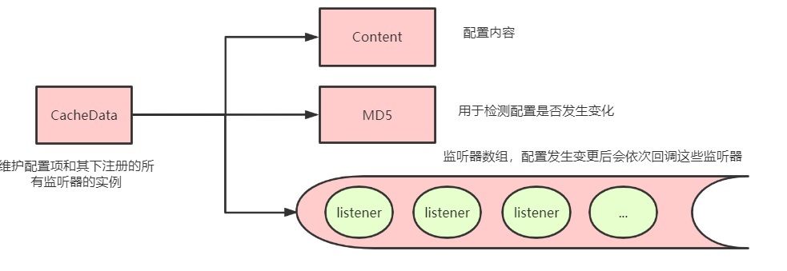</a>

<a data-fancybox title=" nacos" href="./image/nacos19.jpg">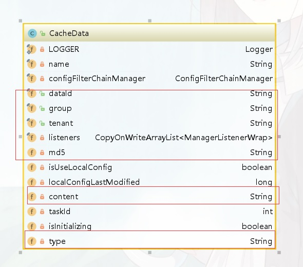</a>

### 2.3.4 配置长轮询

ClientWorker 通过其下的两个线程池完成配置长轮询的工作，一个是单线程的 executor，每隔 10ms 按照每 3000 个 配置项为一批次捞取待轮询的 cacheData 实例，将其包装成为一个 LongPollingTask 提交进入第二个线程池 executorService 处理。

<a data-fancybox title=" nacos" href="./image/nacos20.jpg">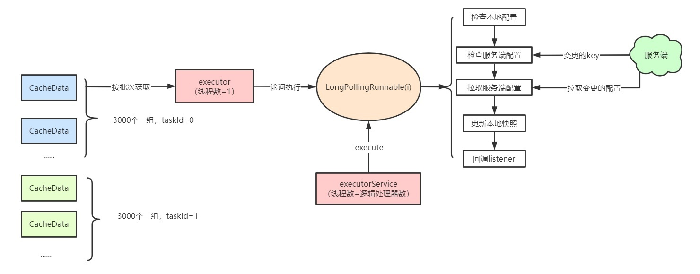</a>
