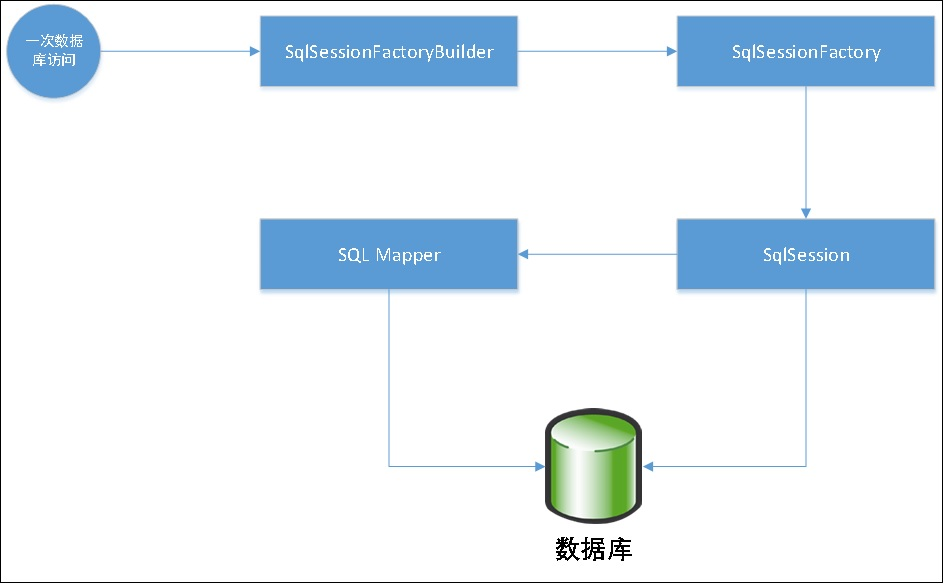
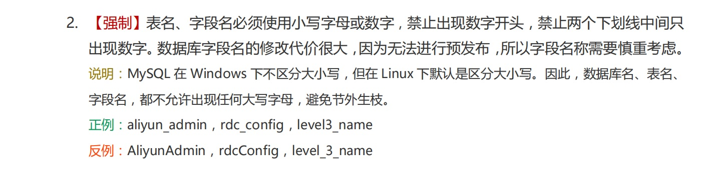
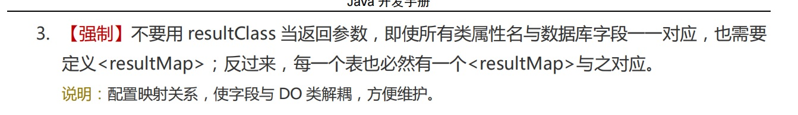
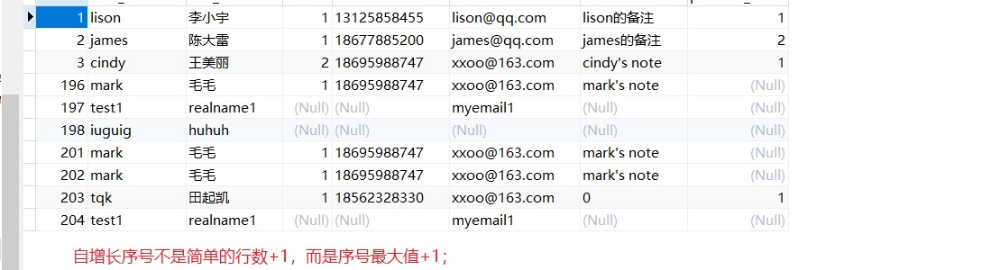
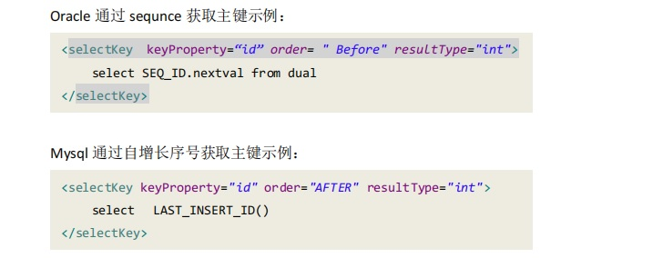

# 1. Mybatis开发应用

## 1.1 为什么需要ORM框架？

:::tip 传统的JDBC编程存在的弊端：
1. 工作量大，操作数据库至少要5步；
2. 业务代码和技术代码耦合；
3. 连接资源手动关闭，带来了隐患；
:::

### 1.1.1 JDBC代码演示

```java
public class JdbcDemo {
	static final String JDBC_DRIVER = "com.mysql.jdbc.Driver";
	static final String DB_URL = "jdbc:mysql://49.233.34.168:6699/STD?useUnicode=true&characterEncoding=utf8&allowMultiQueries=true";

	// Database credentials
	static final String USER = "root";
	static final String PASS = "12345@tqk";

	@Test
	public void QueryPreparedStatementDemo() {
		Connection conn = null;
		PreparedStatement stmt = null;
		List<TUser> users = new ArrayList<>();
		try {
			// STEP 2: 注册mysql的驱动
			Class.forName("com.mysql.jdbc.Driver");

			// STEP 3: 获得一个连接
			System.out.println("Connecting to database...");
			conn = DriverManager.getConnection(DB_URL, USER, PASS);

			// STEP 4: 创建一个查询
			System.out.println("Creating statement...");
			String sql;
			sql = "SELECT * FROM t_user where user_name= ? ";
			stmt = conn.prepareStatement(sql);
			stmt.setString(1, "tqk");
			System.out.println(stmt.toString());//打印sql
			ResultSet rs = stmt.executeQuery();
			

			// STEP 5: 从resultSet中获取数据并转化成bean
			while (rs.next()) {
				System.out.println("------------------------------");
				// Retrieve by column name
				TUser user = new TUser();
				user.setId(rs.getInt("id"));
				user.setUserName(rs.getString("user_name"));
				user.setRealName(rs.getString("real_name"));
				user.setSex(rs.getByte("sex"));
				user.setMobile(rs.getString("mobile"));
				user.setEmail(rs.getString("email"));
				user.setNote(rs.getString("note"));
				System.out.println(user.toString());				
				users.add(user);
			}
			// STEP 6: 关闭连接
			rs.close();
			stmt.close();
			conn.close();
		} catch (SQLException se) {
			// Handle errors for JDBC
			se.printStackTrace();
		} catch (Exception e) {
			// Handle errors for Class.forName
			e.printStackTrace();
		} finally {
			// finally block used to close resources
			try {
				if (stmt != null)
					stmt.close();
			} catch (SQLException se2) {
			}// nothing we can do
			try {
				if (conn != null)
					conn.close();
			} catch (SQLException se) {
				se.printStackTrace();
			}
		}
		System.out.println("-------------------------");
		System.out.println("there are "+users.size()+" users in the list!");
	}
}
```
#### 执行结果
```cpp
Connecting to database...
Creating statement...
com.mysql.jdbc.JDBC4PreparedStatement@63e31ee: SELECT * FROM t_user where user_name= 'tqk' 
------------------------------
TUser{id=203, userName='tqk', realName='田起凯', sex=1, mobile='18562328330', email='xxoo@163.com', note='0', positionId=null}
-------------------------
there are 1 users in the list!
```
## 1.2 MyBatis核心类简介

MyBatis 前身是 iBatis,其源于“Internet”和“ibatis”的组合，本质是一种半自动的 ORM 框架，除了 POJO 和映射关系之外，还需要编写 SQL 语句；Mybatis 映射文件三要素：SQL、映射规则和 POJO；
<a data-fancybox title="MyBatis核心类简介" href="./image/mybatis01.jpg"></a>

:::tip 核心类分析：
1. **SqlSessionFactoryBuilder**：读取配置信息创建 SqlSessionFactory，**建造者模式**，方法级别生命周期；
2. **SqlSessionFactory**：创建 Sqlsession，**工厂单例模式**，存在于程序的整个生命周期；
3. **SqlSession**：代表一次数据库连接，一般通过调用 Mapper 访问数据库，也可以直接发送SQL 执行；线程不安全，要保证线程独享（方法级）；
4. **SQL Mapper**：由一个 Java 接口和 XML 文件组成，包含了要执行的 SQL 语句和结果集映射规则。方法级别生命周期；
:::


```java
public class MybatisDemo {
	

	private SqlSessionFactory sqlSessionFactory;
	
	@Before
	public void init() throws IOException {
		//--------------------第一阶段---------------------------
	    // 1.读取mybatis配置文件创SqlSessionFactory
		String resource = "mybatis-config.xml";
		InputStream inputStream = Resources.getResourceAsStream(resource);
		// 1.读取mybatis配置文件创SqlSessionFactory
		sqlSessionFactory = new SqlSessionFactoryBuilder().build(inputStream);
		inputStream.close();
	}
	
	@Test
	// 快速入门
	public void quickStart() throws IOException {
		//--------------------第二阶段---------------------------
		// 2.获取sqlSession	
		SqlSession sqlSession = sqlSessionFactory.openSession();
		// 3.获取对应mapper
		TUserMapper mapper = sqlSession.getMapper(TUserMapper.class);
		
		//--------------------第三阶段---------------------------
		// 4.执行查询语句并返回单条数据
		TUser user = mapper.selectByPrimaryKey(1);
		System.out.println(user);
		
		System.out.println("----------------------------------");
		
		// 5.执行查询语句并返回多条数据
		List<TUser> users = mapper.selectAll();
		for (TUser tUser : users) {
			System.out.println(tUser);
		}
	}
}
```

```cpp
2021-11-16 18:38:13.896 [main] DEBUG c.e.mybatis.mapper.TUserMapper.selectByPrimaryKey - ==>  Preparing: select id, user_name, real_name, sex, mobile, email, note, position_id from t_user where id = ? 
2021-11-16 18:38:13.930 [main] DEBUG c.e.mybatis.mapper.TUserMapper.selectByPrimaryKey - ==> Parameters: 203(Integer)
2021-11-16 18:38:13.980 [main] DEBUG c.e.mybatis.mapper.TUserMapper.selectByPrimaryKey - <==      Total: 1
TUser{id=203, userName='tqk', realName='田起凯', sex=1, mobile='18562328330', email='xxoo@163.com', note='0', positionId=1, position=null, jobs=null, healthReports=null, roles=null}
----------------------------------
2021-11-16 18:38:13.982 [main] DEBUG c.e.mybatis.mapper.TUserMapper.selectAll - ==>  Preparing: select id, user_name, real_name, sex, mobile, email, note from t_user 
2021-11-16 18:38:13.984 [main] DEBUG c.e.mybatis.mapper.TUserMapper.selectAll - ==> Parameters: 
2021-11-16 18:38:14.026 [main] DEBUG c.e.mybatis.mapper.TUserMapper.selectAll - <==      Total: 9
TUser{id=1, userName='lison', realName='李小宇', sex=1, mobile='13125858455', email='lison@qq.com', note='lison的备注', positionId=null, position=null, jobs=null, healthReports=null, roles=null}
TUser{id=2, userName='james', realName='陈大雷', sex=1, mobile='18677885200', email='james@qq.com', note='james的备注', positionId=null, position=null, jobs=null, healthReports=null, roles=null}
TUser{id=3, userName='cindy', realName='王美丽', sex=2, mobile='18695988747', email='xxoo@163.com', note='cindy's note', positionId=null, position=null, jobs=null, healthReports=null, roles=null}
TUser{id=196, userName='mark', realName='毛毛', sex=1, mobile='18695988747', email='xxoo@163.com', note='mark's note', positionId=null, position=null, jobs=null, healthReports=null, roles=null}
TUser{id=197, userName='test1', realName='realname1', sex=null, mobile='null', email='myemail1', note='null', positionId=null, position=null, jobs=null, healthReports=null, roles=null}
TUser{id=198, userName='iuguig', realName='huhuh', sex=null, mobile='null', email='null', note='null', positionId=null, position=null, jobs=null, healthReports=null, roles=null}
TUser{id=201, userName='mark', realName='毛毛', sex=1, mobile='18695988747', email='xxoo@163.com', note='mark's note', positionId=null, position=null, jobs=null, healthReports=null, roles=null}
TUser{id=202, userName='mark', realName='毛毛', sex=1, mobile='18695988747', email='xxoo@163.com', note='mark's note', positionId=null, position=null, jobs=null, healthReports=null, roles=null}
TUser{id=203, userName='tqk', realName='田起凯', sex=1, mobile='18562328330', email='xxoo@163.com', note='0', positionId=null, position=null, jobs=null, healthReports=null, roles=null}
```

## 1.3 resultType与resultMap之间的选择

### 1.3.1 resultType

**resultType**：当使用 resultType 做 SQL 语句返回结果类型处理时，对于 SQL 语句查询出的字段在相应的 pojo 中必须有和它相同的字段对应，而 resultType 中的内容就是 pojo 在本项目中的位置。

:::tip 自动映射注意事项 :
1. 前提：SQL 列名和 JavaBean 的属性是一致的；
2. 使用 resultType，如用简写需要配置 **typeAliases （别名）**；
3. 如果列名和 JavaBean 不一致，但列名符合单词下划线分割，Java 是驼峰命名法，则mapUnderscoreToCamelCase 可设置为 true；
:::
<a data-fancybox title="SQL 列名" href="./image/alibabashouce512.jpg"></a>


#### resultType测试案例

```java
	@Test
	//知识点：resultType
	public void testResultType() throws IOException {
		// 2.获取sqlSession
		SqlSession sqlSession = sqlSessionFactory.openSession();
		// 3.获取对应mapper
		TUserMapper mapper = sqlSession.getMapper(TUserMapper.class);
		// 4.执行查询语句并返回多条数据
		TUser user = mapper.selectOne(203);
		System.out.println(user);
	}
```
```xml
	<select id="selectOne" resultType="TUser">
		select
			id, user_name, real_name, sex, mobile, email, note
		from t_user where id = #{id,jdbcType=INTEGER}
	</select>
```

### 1.3.2 resultMap

**resultMap** 元素是 MyBatis 中最重要最强大的元素。它可以让你从 90% 的 JDBC ResultSets 
数据提取代码中解放出来,在对复杂语句进行联合映射的时候，它很可能可以代替数千行的
同等功能的代码。 ResultMap 的设计思想是，简单的语句不需要明确的结果映射，而复杂
一点的语句只需要描述它们的关系就行了

:::tip
1. **id** 当前命名空间中的一个唯一标识，用于标识一个 result map.
2. **type** 类的完全限定名, 或者一个类型别名.
3. **autoMapping** 如果设置这个属性，MyBatis 将会为这个 ResultMap 开启或者关闭自动映射。这
个属性会覆盖全局的属性 autoMappingBehavior。默认值为：unset。
```xml
    <!-- 设置自动驼峰转换		 -->
    <setting name="mapUnderscoreToCamelCase" value="true" />
```
:::
#### 代码演示

```xml
    <resultMap id="UserResultMap" type="TUser" autoMapping="true">
		<id column="id" property="id" />
		<result column="user_name" property="userName"/>
		<result column="real_name" property="realName" />
		<result column="sex" property="sex" />
		<result column="mobile" property="mobile" />
		<result column="email" property="email" />
		<result column="note" property="note" />
		<association property="position" javaType="TPosition" columnPrefix="post_">
			<id column="id" property="id"/>
			<result column="name" property="postName"/>
			<result column="note" property="note"/>
		</association>
	</resultMap>
	<select id="selectTestResultMap" resultMap="UserResultMap" >
		select
			a.id,
			user_name,
			real_name,
			sex,
			mobile,
			email,
			a.note,
			b.id  post_id,
			b.post_name,
			b.note post_note
		from t_user a,
			 t_position b
		where a.position_id = b.id
	</select>
```
```java
	@Test
	//知识点：resultMap
	public void testResultMap() throws IOException {
		//--------------------第二阶段---------------------------
		// 2.获取sqlSession	
		SqlSession sqlSession = sqlSessionFactory.openSession();
		// 3.获取对应mapper
		TUserMapper mapper = sqlSession.getMapper(TUserMapper.class);
		
		//--------------------第三阶段---------------------------
		// 4.执行查询语句并返回单条数据
		List<TUser> users = mapper.selectTestResultMap();
		for (TUser tUser : users) {
			System.out.println(tUser.getUserName()+": "+tUser.getPosition().getPostName());
		}
	}
```

```
lison: 总经理
james: 零时工
cindy: 总经理
tqk: 总经理
```


**autoMappingBehavior**
mybatis核心配置文件中settings中配置,指定 MyBatis 应如何自动映射列到字段或属性。 NONE 表示取消自动映射；PARTIAL 只会自动映射没有定义嵌套结果集映射的结果集。 FULL 会自动映射任意复杂的结果集（无论是否嵌套）。默认是partial，这是一种全局设置

**autoMapping**
在resultMap或者association,collections中使用，是一个局部开关，开启后会自动设置嵌套查询中的属性，局部开关优先级大于全部开关，当全部开关开启FULL映射时，局部开关关闭，这时候仍然不会进行映射。


### 1.3.3 到底应该用 resultType 还是 resultMap?

强制使用 resultMap, 不要用 resultClass 当返回参数，即使所有类属性名与数据库字段一一
对应，也需要定义；--**目的代码和表结构解耦**


<a data-fancybox title="SQL 列名" href="./image/alibabashouce543.jpg"></a>

见《Java 开发手册 1.5》之 5.4.3；


## 1.4 多参传递

:::tip 传递参数有三种方式：
1. **使用 map 传递参数 可读性差**，导致可维护性和可扩展性差，杜绝使用
2. **使用注解传递参数直观明了**，当参数较少一般小于 5 个的时候，建议使用
3. **使用 Java Bean 的方式传递参数** 当参数大于 5 个的时候，建议使用
:::

```java
    List<TUser> selectByEmailAndSex1(Map<String, Object> param);
    
    List<TUser> selectByEmailAndSex2(@Param("email")String email,@Param("sex")Byte sex);
    
    List<TUser> selectByEmailAndSex3(EmailSexBean esb);
```

```xml
    <select id="selectByEmailAndSex1" resultMap="BaseResultMap"	parameterType="map">
		select
		<include refid="Base_Column_List" />
		from t_user a
		where a.email like CONCAT('%', #{email}, '%') and
		a.sex =#{sex}
	</select>

	<select id="selectByEmailAndSex2" resultMap="BaseResultMap">
		select
		<include refid="Base_Column_List" />
		from t_user a
		where a.email like CONCAT('%', #{email}, '%') and
		a.sex =	#{sex}
	</select>


	<select id="selectByEmailAndSex3" resultMap="BaseResultMap"
			parameterType="com.enjoylearning.mybatis.entity.EmailSexBean">
		select
		<include refid="Base_Column_List" />
		from t_user a
		where a.email like CONCAT('%', #{email}, '%') and
		a.sex =	#{sex}
	</select>
```

```java
// 多参数查询
	@Test
	public void testManyParamQuery() {
		// 2.获取sqlSession
		SqlSession sqlSession = sqlSessionFactory.openSession();
		// 3.获取对应mapper
		TUserMapper mapper = sqlSession.getMapper(TUserMapper.class);

		String email = "qq.com";
		Byte sex = 1;

		// 第一种方式使用map
		Map<String, Object> params = new HashMap<String, Object>();
		params.put("email", email);
		params.put("sex", sex);
		List<TUser> list1 = mapper.selectByEmailAndSex1(params);
		System.out.println(list1.size());

		// 第二种方式直接使用参数
		List<TUser> list2 = mapper.selectByEmailAndSex2(email, sex);
		System.out.println(list2.size());

		// 第三种方式用对象
		EmailSexBean esb = new EmailSexBean();
		esb.setEmail(email);
		esb.setSex(sex);
		List<TUser> list3 = mapper.selectByEmailAndSex3(esb);
		System.out.println(list3.size());
	}
```

## 1.5 获取自增主键

### 1.5.1 通过 insert/update 标签相关属性

#### useGeneratedKeys
**（仅对 insert 和 update 有用）**这会令 MyBatis 使用 JDBC 的 getGeneratedKeys 
方法来取出由数据库内部生成的主键（比如：像 MySQL 和 SQL Server 这样的关系
数据库管理系统的自动递增字段），默认值：false。

```xml
	<insert id="insert1" parameterType="TUser" useGeneratedKeys="true"	keyProperty="id">
		insert into t_user (id, user_name, real_name,
		sex, mobile,
		email,
		note, position_id)
		values (#{id,jdbcType=INTEGER},
		#{userName,jdbcType=VARCHAR},
		#{realName,jdbcType=VARCHAR},
		#{sex,jdbcType=TINYINT}, #{mobile,jdbcType=VARCHAR},
		#{email,jdbcType=VARCHAR},
		#{note,jdbcType=VARCHAR},
		#{position.id,jdbcType=INTEGER})
	</insert>
```
```java
	@Test
	// 测试插入数据自动生成id
	public void testInsertGenerateId1() throws IOException {
		// 2.获取sqlSession
		SqlSession sqlSession = sqlSessionFactory.openSession();
		// 3.获取对应mapper
		TUserMapper mapper = sqlSession.getMapper(TUserMapper.class);
		// 4.执行查询语句并返回结果
		TUser user1 = new TUser();
		user1.setUserName("test1");
		user1.setRealName("realname1");
		user1.setEmail("myemail1");
		mapper.insert1(user1);
		sqlSession.commit();
		System.out.println(user1.getId());
	}
```

<a data-fancybox title="获取自增主键" href="./image/mybatis02.jpg"></a>

#### keyProperty 

**（ 仅 对 insert 和 update 有 用 ）** 唯一标记一个属性 ， MyBatis 会通过
getGeneratedKeys 的返回值或者通过 insert 语句的 selectKey 子元素设置它的键
值，默认：unset。如果希望得到多个生成的列，也可以是逗号分隔的属性名称列表。

### 1.5.2 通过 selectKey 元素

1. **keyProperty** selectKey 语句结果应该被设置的目标属性。如果希望得到多个生成的列，也可以是逗号
分隔的属性名称列表。

2. **resultType** 结果的类型。MyBatis 通常可以推算出来，但是为了更加确定写上也不会有什么问题。
MyBatis 允许任何简单类型用作主键的类型，包括字符串。如果希望作用于多个生成的
列，则可以使用一个包含期望属性的 Object 或一个 Map。

3. **order** 这可以被设置为 BEFORE 或 AFTER。如果设置为 BEFORE，那么它会首先选择主键，设
置 keyProperty 然后执行插入语句。如果设置为 AFTER，那么先执行插入语句，然后获
取主键字段；<font color='red'>mysql 数据库自增长的方式 order 设置为 After，oracle 数据库通过 sequnce
获取主键 order 设置为 Before</font>

<a data-fancybox title="获取自增主键" href="./image/selectkey.jpg"></a>

```xml
	<insert id="insert2" parameterType="TUser">

		<selectKey keyProperty="id" order="AFTER" resultType="int">
			select
			LAST_INSERT_ID()
		</selectKey>
		insert into t_user (id, user_name, real_name,
		sex, mobile,
		email,
		note,
		position_id)
		values (#{id,jdbcType=INTEGER},
		#{userName,jdbcType=VARCHAR},
		#{realName,jdbcType=VARCHAR},
		#{sex,jdbcType=TINYINT}, #{mobile,jdbcType=VARCHAR},
		#{email,jdbcType=VARCHAR},
		#{note,jdbcType=VARCHAR},
		#{position.id,jdbcType=INTEGER})
	</insert>
```

```java
	@Test
	// 测试插入数据自动生成id
	public void testInsertGenerateId2() throws IOException {
		// 2.获取sqlSession
		SqlSession sqlSession = sqlSessionFactory.openSession();
		// 3.获取对应mapper
		TUserMapper mapper = sqlSession.getMapper(TUserMapper.class);
		// 4.执行查询语句并返回结果
		TUser user2 = new TUser();
		user2.setUserName("test2");
		user2.setRealName("realname2");
		user2.setEmail("myemai2l");
		mapper.insert2(user2);
		sqlSession.commit();
		System.out.println(user2.getId());
	}
```

## 1.6 SQL 元素和 SQL 的参数

**SQL 元素**：用来定义可重用的 SQL 代码段，可以包含在其他语句中；  
**SQL 参数**：向 sql 语句中传递的可变参数,分为预编译<font color='red'><strong>#{}</strong></font>和传值<font color='red'>${}</strong></font>两种  

1. **预编译 #{}**：将传入的数据都当成一个字符串，会对自动传入的数据加一个单引号，能够很大程度防止 sql 注入；

2. **传值${}**：传入的数据直接显示生成在 sql 中，无法防止 sql 注入；适用场景：动态报表，表名、选取的列是动态的，**order by 和 in 操作， 可以考虑使用$**

```xml
	<select id="selectBySymbol" resultMap="BaseResultMap">
		select
			${inCol}
		from ${tableName} a
		where a.user_name = #{userName}
        <!-- where a.user_name = ${userName} -->
		order by ${orderStr}
	</select>
```

```java
	@Test
	// 参数#和参数$区别测试(动态sql 入门)
	public void testSymbol() {
		// 2.获取sqlSession
		SqlSession sqlSession = sqlSessionFactory.openSession();
		// 3.获取对应mapper
		TUserMapper mapper = sqlSession.getMapper(TUserMapper.class);
		
		String inCol = "id, user_name, real_name, sex, mobile, email, note";
		String tableName = "t_user";
//		String userName = "lison";
		String userName = "'xxx' or 1=1";
		String orderStr = "sex,user_name";
		
		List<TUser> list = mapper.selectBySymbol(tableName, inCol, orderStr, userName);
		System.out.println(list.size());
		
	}
```
```cpp
//--where a.user_name = #{userName} 查询结果为0条
2021-11-16 21:26:33.837 [main] DEBUG c.e.mybatis.mapper.TUserMapper.selectBySymbol - ==>  Preparing: select id, user_name, real_name, sex, mobile, email, note from t_user a where a.user_name = ? order by sex,user_name 
2021-11-16 21:26:33.871 [main] DEBUG c.e.mybatis.mapper.TUserMapper.selectBySymbol - ==> Parameters: 'xxx' or 1=1(String)
2021-11-16 21:26:33.918 [main] DEBUG c.e.mybatis.mapper.TUserMapper.selectBySymbol - <==      Total: 0
//--where a.user_name = ${userName} 查询结果为11条
2021-11-16 21:30:29.831 [main] DEBUG c.e.mybatis.mapper.TUserMapper.selectBySymbol - ==>  Preparing: select id, user_name, real_name, sex, mobile, email, note from t_user a where a.user_name = 'xxx' or 1=1 order by sex,user_name 
2021-11-16 21:30:29.867 [main] DEBUG c.e.mybatis.mapper.TUserMapper.selectBySymbol - ==> Parameters: 
2021-11-16 21:30:29.920 [main] DEBUG c.e.mybatis.mapper.TUserMapper.selectBySymbol - <==      Total: 11
```

### 建议：

sql.xml 配置参数使用：<font color='red'><strong>#{}，#param#</strong></font> 不要使用<font color='red'><strong>${}</strong></font> 此种方式容易出现 SQL 注入。

见《Java 开发手册 1.5》之 5.4.4；

## 1.7 动态 SQL

1. **if** 判断语句 单条件分支判断
2. **choose、when、otherwise** 相当于 java 的 case when 多条件分支判断
3. **Trim、where、set** 辅助元素 用于处理 sql 拼装问题
4. **foreach** 循环语句 在 in 语句等列举条件常用，常用于实现批量操作

### 1.7.1 where标签去除and或or

#### 在 select 中使用 if 元素，where 元素可以在查询条件之前加 where 关键字，同时去掉语句的第一个 and 或 or

```xml
	<select id="selectIfandWhereOper" resultMap="BaseResultMap">
		select
		<include refid="Base_Column_List" />
		from t_user a
		<where>
			<if test="email != null and email != ''">
				and a.email like CONCAT('%', #{email}, '%')
			</if>
			<if test="sex != null ">
				and a.sex = #{sex}
			</if>
		</where>
	</select>
```

```java
	@Test
	// if用于select，并与where配合
	public void testSelectIfOper() {
		// 2.获取sqlSession
		SqlSession sqlSession = sqlSessionFactory.openSession();
		// 3.获取对应mapper
		TUserMapper mapper = sqlSession.getMapper(TUserMapper.class);
		
		String email = "qq.com";
		Byte sex = 1;
//		List<TUser> list = mapper.selectIfOper(null, null);
		List<TUser> list = mapper.selectIfandWhereOper(email, null);
//		List<TUser> list = mapper.selectChooseOper(email , sex);		
		System.out.println(list.size());		
	}
```
### 1.7.2 set标签去除最后逗号
#### 在 update 中使用 if 元素，set 元素可以在值设置之前加 set 关键字，同时去掉语句最有一个逗号

```xml
	<update id="updateIfAndSetOper" parameterType="TUser">

		update t_user
		<set>
			<if test="userName != null">
				userName = #{userName,jdbcType=VARCHAR},
			</if>
			<if test="realName != null">
				realName = #{realName,jdbcType=VARCHAR},
			</if>
			<if test="sex != null">
				sex = #{sex,jdbcType=TINYINT},
			</if>
			<if test="mobile != null">
				mobile = #{mobile,jdbcType=VARCHAR},
			</if>
			<if test="email != null">
				email = #{email,jdbcType=VARCHAR},
			</if>
			<if test="note != null">
				note = #{note,jdbcType=VARCHAR},
			</if>
		</set>
		where id = #{id,jdbcType=INTEGER}
	</update>
```

```java
	@Test
	// if用于update，并与set配合
	public void testUpdateIfOper() {
		// 2.获取sqlSession
		SqlSession sqlSession = sqlSessionFactory.openSession(false);
		// 3.获取对应mapper
		TUserMapper mapper = sqlSession.getMapper(TUserMapper.class);
		
		TUser user = new TUser();
		user.setId(3);
		user.setUserName("cindy");
		user.setRealName("王美丽");
		user.setEmail("xxoo@163.com");
		user.setMobile("18695988747");
//		user.setNote("cindy's note");
		user.setSex((byte) 2);
//		System.out.println(mapper.updateIfOper(user));
		System.out.println(mapper.updateIfAndSetOper(user));
		sqlSession.commit();		
	}
```

### 1.7.3 trim 元素拼接columns和values

#### 在 insert 中使用 if 元素，trim 元素可以帮助拼装 columns 和 values

<font color='red'><strong>必须要手工提交，才生效 sqlSession.commit();</strong></font>
```xml
<insert id="insertSelective" parameterType="TUser" useGeneratedKeys="true"		keyProperty="id">
		insert into t_user
		<trim prefix="(" suffix=")" suffixOverrides="," >
			<if test="id != null">
				id,
			</if>
			<if test="userName != null">
				userName,
			</if>
			<if test="realName != null">
				realName,
			</if>
			<if test="sex != null">
				sex,
			</if>
			<if test="mobile != null">
				mobile,
			</if>
			<if test="email != null">
				email,
			</if>
			<if test="note != null">
				note,
			</if>
		</trim>
		<trim prefix="values (" suffix=")" suffixOverrides=",">
			<if test="id != null">
				#{id,jdbcType=INTEGER},
			</if>
			<if test="userName != null">
				#{userName,jdbcType=VARCHAR},
			</if>
			<if test="realName != null">
				#{realName,jdbcType=VARCHAR},
			</if>
			<if test="sex != null">
				#{sex,jdbcType=TINYINT},
			</if>
			<if test="mobile != null">
				#{mobile,jdbcType=VARCHAR},
			</if>
			<if test="email != null">
				#{email,jdbcType=VARCHAR},
			</if>
			<if test="note != null">
				#{note,jdbcType=VARCHAR},
			</if>
		</trim>
	</insert>

<insert id="insertIfOper" parameterType="TUser">
		insert into t_user (
		<if test="id != null">
			id,
		</if>
		<if test="userName != null">
			userName,
		</if>
		<if test="realName != null">
			realName,
		</if>
		<if test="sex != null">
			sex,
		</if>
		<if test="mobile != null">
			mobile,
		</if>
		<if test="email != null">
			email,
		</if>
		<if test="note != null">
			note
		</if>
		)
		values(
		<if test="id != null">
			#{id,jdbcType=INTEGER},
		</if>
		<if test="userName != null">
			#{userName,jdbcType=VARCHAR},
		</if>
		<if test="realName != null">
			#{realName,jdbcType=VARCHAR},
		</if>
		<if test="sex != null">
			#{sex,jdbcType=TINYINT},
		</if>
		<if test="mobile != null">
			#{mobile,jdbcType=VARCHAR},
		</if>
		<if test="email != null">
			#{email,jdbcType=VARCHAR},
		</if>
		<if test="note != null">
			#{note,jdbcType=VARCHAR}
		</if>
		)
	</insert>
```

```java
	@Test
	// if用于insert，并与trim配合
	public void testInsertIfOper() {
		// 2.获取sqlSession
		SqlSession sqlSession = sqlSessionFactory.openSession();
		// 3.获取对应mapper
		TUserMapper mapper = sqlSession.getMapper(TUserMapper.class);
		
		TUser user = new TUser();
		user.setUserName("mark");
		user.setRealName("毛毛");
		user.setEmail("xxoo@163.com");
		user.setMobile("18695988747");
		user.setNote("mark's note");
		user.setSex((byte) 1);
		System.out.println(mapper.insertIfOper(user));
		System.out.println(mapper.insertSelective(user));
        sqlSession.commit();
	}
```

### 使用 foreach 拼装 in 条件

```xml
	<select id="selectForeach4In" resultMap="BaseResultMap">
		select
		<include refid="Base_Column_List" />
		from t_user a
		where a.user_name in
		<foreach collection="array" open="(" close=")" item="userName" separator=",">
			#{userName}
		</foreach> 
	</select>
```

```java
	@Test
	// Foreach用于in查询
	public void testForeach4In() {
		// 2.获取sqlSession
		SqlSession sqlSession = sqlSessionFactory.openSession();
		// 3.获取对应mapper
		TUserMapper mapper = sqlSession.getMapper(TUserMapper.class);
		
		String[] names = new String[]{"lison","james"};
		List<TUser> users = mapper.selectForeach4In(names);
		
		for (TUser tUser : users) {
			System.out.println(tUser.getUserName());
		}
		
		System.out.println(users.size());
	}
```


### 通过 Mybatis批量的操作

#### 通 过 foreach 动 态 拼 装 SQL 语 句 ， 参 考 代 码 见 ：

<font color='red'><strong>必须要手工提交，才生效 sqlSession.commit();</strong></font>

```xml
<insert id="insertForeach4Batch" useGeneratedKeys="true" keyProperty="id">
		insert into t_user (user_name, real_name,
		sex, mobile,email,note,
		position_id)
		values
		<foreach collection="list" separator="," item="user">
			(
			#{user.userName,jdbcType=VARCHAR},
			#{user.realName,jdbcType=VARCHAR},
			#{user.sex,jdbcType=TINYINT},
			#{user.mobile,jdbcType=VARCHAR},
			#{user.email,jdbcType=VARCHAR},
			#{user.note,jdbcType=VARCHAR},
			#{user.position.id,jdbcType=INTEGER}
			)
		</foreach>
	</insert>
```

```java
    int insertForeach4Batch(List<TUser> users);
    @Test
	// Foreach用于批量插入
	public void testForeach4Insert() {
		// 2.获取sqlSession
		SqlSession sqlSession = sqlSessionFactory.openSession();
		// 3.获取对应mapper
		TUserMapper mapper = sqlSession.getMapper(TUserMapper.class);
		
		TUser user1 = new TUser();
		user1.setUserName("king");
		user1.setRealName("李小京");
		user1.setEmail("li@qq.com");
		user1.setMobile("18754548787");
		user1.setNote("king's note");
		user1.setSex((byte)1);
		TUser user2 = new TUser();
		user2.setUserName("deer");
		user2.setRealName("陈大林");
		user2.setEmail("chen@qq.com");
		user2.setMobile("18723138787");
		user2.setNote("deer's note");
		user2.setSex((byte)1);
				
		int i = mapper.insertForeach4Batch(Arrays.asList(user1,user2));
		System.out.println("------批量更新获取主键的方式与单条insert完全相同--------");
		System.out.println(user1.getId());
		System.out.println(user2.getId());	
        //必须要手工提交，才生效
        sqlSession.commit();
	}
```

#### 使用 BATCH 类型的 excutor,参考代码块见：
1. com.enjoylearning.mybatis.JdbcDemo.updateDemo，jdbc 批处理的原理；
2. com.enjoylearning.mybatis.MybatisDemo.testForeach4Insert，基于 Mybatis 怎么使用 Batch 类型的 excutor；
**（略）**

## 1.8 逆向工程

MyBatis Generator：MyBatis 的开发团队提供了一个很强大的代码生成器，代码包含了数据
库表对应的实体类 、Mapper 接口类、 Mapper XML 文件等，这些代码文件中几乎包含了
全部的单表操作方法，使用 MBG 可以极大程度上方便我们使用 MyBatis，还可以减少很多
重 复 操 作 ； MyBatis Generator 的 核 心 就 是 配 置 文 件 ， 完 整 的 配 置 文 件 见 ：

### db.properties
```xml
jdbc_driver=com.mysql.jdbc.Driver
jdbc_url=jdbc:mysql://49.233.34.168:6699/STD?useUnicode=true&characterEncoding=utf8&allowMultiQueries=true
jdbc_username=root
jdbc_password=12345@tqk
project_src =E:/vue/Mybatis/Mybatis-Generator/src/main/java
project_mapper_xml =E:/vue/Mybatis/Mybatis-Generator/src/main/resources/sqlmapper
class_path=E:/vue/Mybatis/Mybatis-Generator/src/main/resources/mysql-connector-java-5.1.18.jar
```
### generatorConfig.xml

```xml
<?xml version="1.0" encoding="UTF-8" ?>
<!DOCTYPE generatorConfiguration PUBLIC
"-//mybatis.org//DTD MyBatis Generator Configuration 1.0//EN"
 "http://mybatis.org/dtd/mybatis-generator-config_1_0.dtd" >
<generatorConfiguration>
	<!-- 引入配置文件 -->
	<properties resource="db.properties" />


	<classPathEntry location="${class_path}" />
	<context id="context1" targetRuntime="MyBatis3">
		<commentGenerator>
			<!-- 是否去除自动生成的注释 true：是 ： false:否 -->
			<property name="suppressAllComments" value="true" />
		</commentGenerator>
			<!--数据库连接的信息：驱动类、连接地址、用户名、密码 -->
		<jdbcConnection driverClass="${jdbc_driver}" connectionURL="${jdbc_url}" userId="${jdbc_username}" password="${jdbc_password}" />

		<!-- java模型创建器，是必须要的元素   负责：1，key类（见context的defaultModelType）；2，java类；3，查询类
			targetPackage：生成的类要放的包，真实的包受enableSubPackages属性控制；
			targetProject：目标项目，指定一个存在的目录下，生成的内容会放到指定目录中，如果目录不存在，MBG不会自动建目录
		-->
		<javaModelGenerator targetPackage="com.tqk.mybatis.entity" targetProject="${project_src}" >
			<!-- 设置一个根对象，
					  如果设置了这个根对象，那么生成的keyClass或者recordClass会继承这个类；在Table的rootClass属性中可以覆盖该选项
					  注意：如果在key class或者record class中有root class相同的属性，MBG就不会重新生成这些属性了，包括：
				1，属性名相同，类型相同，有相同的getter/setter方法；
		 	-->
			<property name="rootClass" value="com.tqk.mybatis.entity.BaseEntity" />
		</javaModelGenerator>
		<!-- 生成SQL map的XML文件生成器，
    		targetPackage：生成的类要放的包，真实的包受enableSubPackages属性控制；
    		targetProject：目标项目，指定一个存在的目录下，生成的内容会放到指定目录中，如果目录不存在，MBG不会自动建目录
 		-->
		<sqlMapGenerator targetPackage="." targetProject="${project_mapper_xml}" />
		<!-- 对于mybatis来说，即生成Mapper接口，注意，如果没有配置该元素，那么默认不会生成Mapper接口
		   type：选择怎么生成mapper接口（在MyBatis3/MyBatis3Simple下）：
			   1，ANNOTATEDMAPPER：会生成使用Mapper接口+Annotation的方式创建（SQL生成在annotation中），不会生成对应的XML；
			   2，MIXEDMAPPER：使用混合配置，会生成Mapper接口，并适当添加合适的Annotation，但是XML会生成在XML中；
			   3，XMLMAPPER：会生成Mapper接口，接口完全依赖XML；
		   注意，如果context是MyBatis3Simple：只支持ANNOTATEDMAPPER和XMLMAPPER
   		-->
		<javaClientGenerator targetPackage="com.tqk.mybatis.mapper" targetProject="${project_src}" type="XMLMAPPER" />
		<!-- shema 数据库 tableName表明 -->
		<!--		% -是指声称所有的表 -->
		<table schema="${jdbc_username}" tableName="%"
			 enableCountByExample="false"
			enableUpdateByExample="false" enableDeleteByExample="false"
			enableSelectByExample="false" selectByExampleQueryId="false">
			<!--下划线转驼峰-->
			<property name="useActualColumnNames" value="false" />
		</table>
		<!--区分大小写，测试结果不好使-->
<!--		<table schema="${jdbc_username}" tableName="t_user" delimitIdentifiers="true" delimitAllColumns="true" >-->
<!--			<columnOverride column="userName" delimitedColumnName="true" />-->
<!--			<columnOverride column="realName" delimitedColumnName="true" />-->
<!--		</table>-->
<!--		<table schema="${jdbc_username}" tableName="t_user"-->
<!--			 enableCountByExample="false"-->
<!--			enableUpdateByExample="false" enableDeleteByExample="false"-->
<!--			enableSelectByExample="false" selectByExampleQueryId="false">-->
<!--		</table>-->

<!--		<table schema="${jdbc_username}" tableName="t_user_role"-->
<!--			 enableCountByExample="false"-->
<!--			enableUpdateByExample="false" enableDeleteByExample="false"-->
<!--			enableSelectByExample="false" selectByExampleQueryId="false">-->
<!--		</table>-->

	</context>
</generatorConfiguration>
```
### MyatisGenerator
```java
package com.tqk.mybatis.generator;

import org.mybatis.generator.api.MyBatisGenerator;
import org.mybatis.generator.config.Configuration;
import org.mybatis.generator.config.xml.ConfigurationParser;
import org.mybatis.generator.internal.DefaultShellCallback;

import java.io.File;
import java.util.ArrayList;
import java.util.List;

public class MyatisGenerator {
    public static void main(String[] args) throws Exception {
        List<String> warnings = new ArrayList<String>();
        boolean overwrite = true;
        //指向逆向工程配置文件(读取的是主项目的路径。可以把文件放在主项目下)
        File configFile = new File("E:/vue/Mybatis/Mybatis-Generator/src/main/resources/generatorConfig.xml");
        ConfigurationParser cp = new ConfigurationParser(warnings);
        //读取配置
        Configuration config = cp.parseConfiguration(configFile);

        DefaultShellCallback callback = new DefaultShellCallback(overwrite);
        //实例化生成器
        MyBatisGenerator myBatisGenerator = new MyBatisGenerator(config, callback, warnings);
        //生成实体bean mapper xml
        myBatisGenerator.generate(null);
    }
}

```

## 1.9 关联查询


### 1.9.0 关联查询几个需要注意的细节


1. 超过三个表禁止 join。需要 join 的字段，数据类型必须绝对一致；多表关联查询时，保证被关联的字段需要有索引；见《Java 开发手册 1.5》之 5.2.2；

2. 不得使用外键与级联，一切外键概念必须在应用层解决；见《Java 开发手册 1.5》之 5.3.6；

3. 字段允许适当冗余，以提高查询性能，但必须考虑数据一致；见《Java 开发手册 1.5》 之 5.1.13；

### 1.9.1 一对一关联嵌套结果方式

```xml

	<resultMap id="userAndPosition1" extends="BaseResultMap" type="TUser">
		<association property="position" javaType="TPosition" columnPrefix="post_">
			<id column="id" property="id"/>
			<result column="name" property="postName"/>
			<result column="note" property="note"/>
		</association>
	</resultMap>
	<select id="selectUserPosition1" resultMap="userAndPosition1" >
		select
		    a.id, 
		    userName,
			realName,
			sex,
			mobile,
			email,
			a.note,
			b.id post_id,
			b.post_name,
			b.note post_note
		from t_user a,
			t_position b
		where a.position_id = b.id

	</select>
```

```java
@Test
	// 1对1两种关联方式
	public void testOneToOne() throws JsonProcessingException {
		// 2.获取sqlSession
		SqlSession sqlSession = sqlSessionFactory.openSession();
		// 3.获取对应mapper
 		TUserMapper mapper = sqlSession.getMapper(TUserMapper.class);
		// 4.执行查询语句并返回结果
		// ----------------------
		List<TUser> list1 = mapper.selectUserPosition1();
		for (TUser tUser : list1) {
			System.out.println(tUser);
		}
		
		List<TUser> list2 = mapper.selectUserPosition2();
		System.out.println("------------主查询结束-------------");
		ObjectMapper om = new ObjectMapper().disable(SerializationFeature.FAIL_ON_EMPTY_BEANS);;
		for (TUser tUser : list2) {
			System.out.println(tUser.getPosition());
			System.out.println(om.writeValueAsString(tUser));
		}
	}
```
### 1.9.2 一对一关联嵌套查询方式

**association 标签**嵌套查询方式 

:::tip 常用属性：
1. **select** ：另 一个映射查询的 id, MyBatis 会额外执行这个查询获取嵌套对象的结果 。 
2. **column** ：列名（或别名），将主查询中列的结果作为嵌套查询的参数。
3. **fetchType** ：数据加载方式，可选值为 lazy 和 eager，分别为延迟加载和积极加载，这个配置会覆盖全局的 lazyLoadingEnabled 配置；
:::

嵌套查询会导致“N+1 查询问题”，导致该问题产生的原因:
1. 你执行了一个单独的 SQL 语句来获取结果列表(就是“+1”)。
2. 对返回的每条记录,你执行了一个查询语句来为每个加载细节(就是“N”)。
这个问题会导致成百上千的 SQL 语句被执行。这通常不是期望的。

解决“N+1 查询问题”的办法就是开启懒加载、按需加载数据，开启懒加载配置：
在<select>节点上配置“fetchType=lazy” 在 MyBatis 核心配置文件中加入如下配置：

```xml
<!-- 开启懒加载 ，当启用时，有延迟加载属性的对象在被调用时将会完全加载任意属性。否则，每种属性将会按需
要加载。默认：true -->
<setting name="aggressiveLazyLoading" value="false" /
```


```xml
<resultMap id="userAndPosition2" extends="BaseResultMap" type="TUser">
	<association property="position" fetchType="lazy"  column="position_id" select="com.enjoylearning.mybatis.mapper.TPositionMapper.selectByPrimaryKey" />
</resultMap>

----------------------------
  <select id="selectByPrimaryKey" parameterType="java.lang.Integer" resultMap="BaseResultMap">
    <!--
      WARNING - @mbg.generated
      This element is automatically generated by MyBatis Generator, do not modify.
    -->
    select 
    <include refid="Base_Column_List" />
    from t_position
    where id = #{id,jdbcType=INTEGER}
  </select>
```

```java
@Test
	// 1对1两种关联方式
	public void testOneToOne() throws JsonProcessingException {
		// 2.获取sqlSession
		SqlSession sqlSession = sqlSessionFactory.openSession();
		// 3.获取对应mapper
 		TUserMapper mapper = sqlSession.getMapper(TUserMapper.class);
		// 4.执行查询语句并返回结果
		// ----------------------
		List<TUser> list2 = mapper.selectUserPosition2();
		System.out.println("------------主查询结束-------------");
		ObjectMapper om = new ObjectMapper().disable(SerializationFeature.FAIL_ON_EMPTY_BEANS);;
		for (TUser tUser : list2) {
			System.out.println(tUser.getPosition());
			System.out.println(om.writeValueAsString(tUser));
		}
	}
```


### 1.9.3 一对多关联查询方式

collection 支持的属性以及属性的作用和 association 完全相同。mybatis 会根据 id 标签，进行字段的合并，合理配置好 ID 标签可以提高处理的效率；

#### 方式一
```xml
<resultMap id="userAndJobs1" extends="BaseResultMap" type="TUser">
	<collection property="jobs" ofType="com.enjoylearning.mybatis.entity.TJobHistory" >
		<result column="comp_name" property="compName" jdbcType="VARCHAR" />
		<result column="years" property="years" jdbcType="INTEGER" />
		<result column="title" property="title" jdbcType="VARCHAR" />
	</collection>
</resultMap>
<select id="selectUserJobs1" resultMap="userAndJobs1">
		select
		a.id,
		a.userName,
		a.realName,
		a.sex,
		a.mobile,
		b.comp_name,
		b.years,
		b.title
		from t_user a,
		t_job_history b
		where a.id = b.user_id
</select>
```

```java
	@Test
	// 1对多两种关联方式
	public void testOneToMany() {
		// 2.获取sqlSession
		SqlSession sqlSession = sqlSessionFactory.openSession();
		// 3.获取对应mapper
		TUserMapper mapper = sqlSession.getMapper(TUserMapper.class);
		// 4.执行查询语句并返回结果
		// ----------------------
		List<TUser> selectUserJobs1 = mapper.selectUserJobs1();
		List<TUser> selectUserJobs2 = mapper.selectUserJobs2();
		for (TUser tUser : selectUserJobs1) {
			System.out.println(tUser);
		}
		for (TUser tUser : selectUserJobs2) {
			System.out.println(tUser.getJobs().size());
		}
	}
	
```
-----------------------------
#### 方式二

```xml
	<resultMap id="userAndJobs2" extends="BaseResultMap" type="TUser">
		<collection property="jobs" fetchType="lazy" column="id"
			select="com.enjoylearning.mybatis.mapper.TJobHistoryMapper.selectByUserId" />
	</resultMap>

	<select id="selectUserJobs2" resultMap="userAndJobs2">
		select
		a.id,
		a.userName,
		a.realName,
		a.sex,
		a.mobile
		from t_user a
	</select>
<!-- selectByUserId -->
	<select id="selectByUserId" resultMap="BaseResultMap"  parameterType="java.lang.Integer">
		select
		<include refid="Base_Column_List" />
		from t_job_history
		where user_id = #{userId,jdbcType=INTEGER}
	</select>
```


### 1.9.4 多对多关联查询方式
```xml
	<resultMap id="userAndHealthReportMale" extends="userAndHealthReport" type="TUser">
		<collection property="healthReports" column="id"
			select= "com.enjoylearning.mybatis.mapper.THealthReportMaleMapper.selectByUserId"></collection>
	</resultMap>
	
	<resultMap id="userAndHealthReportFemale" extends="userAndHealthReport" type="TUser">
		<collection property="healthReports" column="id"
			select= "com.enjoylearning.mybatis.mapper.THealthReportFemaleMapper.selectByUserId"></collection>
	</resultMap>
	
	<resultMap id="userAndHealthReport" extends="BaseResultMap" type="TUser">
				 
		<discriminator column="sex"  javaType="int">
			<case value="1" resultMap="userAndHealthReportMale"/>
			<case value="2" resultMap="userAndHealthReportFemale"/>
		</discriminator>
	</resultMap>

	<select id="selectUserHealthReport" resultMap="userAndHealthReport">
		select
		<include refid="Base_Column_List" />
		from t_user a
	</select>


	------------------------------
	<select id="selectByUserId" parameterType="java.lang.Integer" resultMap="BaseResultMap">
    <!--
      WARNING - @mbg.generated
      This element is automatically generated by MyBatis Generator, do not modify.
    -->
    select 
    <include refid="Base_Column_List" />
    from t_health_report_female
    where user_id = #{userId,jdbcType=INTEGER}
  </select>
  
```

```java
	@Test
	public void testDiscriminator(){
		// 2.获取sqlSession
		SqlSession sqlSession = sqlSessionFactory.openSession();
		// 3.获取对应mapper
		TUserMapper mapper = sqlSession.getMapper(TUserMapper.class);
//		// 4.执行查询语句并返回结果
//		// ----------------------
		List<TUser> list = mapper.selectUserHealthReport();
		for (TUser tUser : list) {
			System.out.println(tUser);
		}
	}
```

## 1.10 缓存

