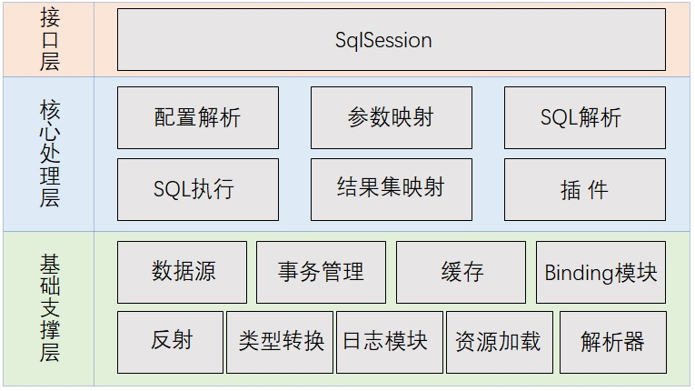
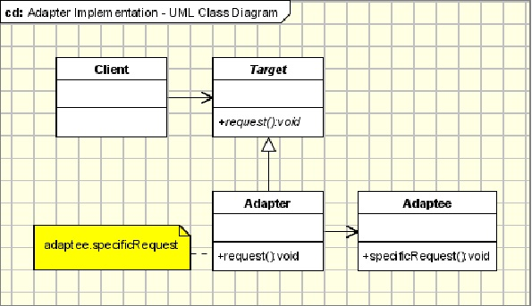
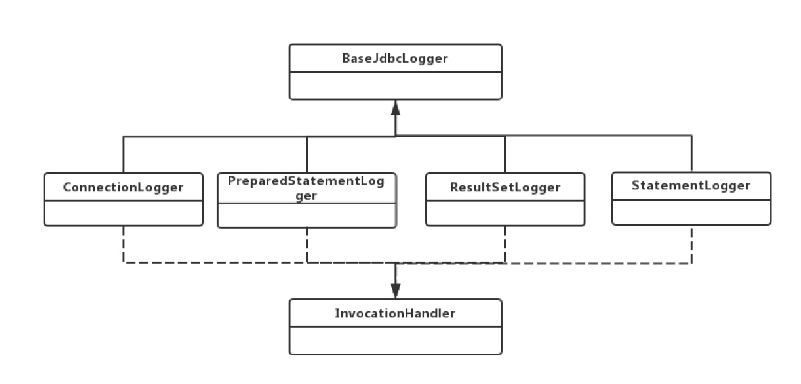

# 2. Mybatis核心模块

## 2.1 源码架构分析

<a data-fancybox title="源码架构分析" href="./image/mybatis04.jpg"></a>

1. <font color='#c63c26'><strong>基础支撑层</strong></font>：技术组件专注于底层技术实现，通用性较强无业务含义；
2. <font color='#c63c26'><strong>核心处理层</strong></font>：业务组件专注 MyBatis 的业务流程实现，依赖于基础支撑层；
3. <font color='#c63c26'><strong>接口层</strong></font>：MyBatis 对外提供的访问接口，面向 SqlSession 编程；


**思考题：系统为什么要分层？**  
1. 代码和系统的可维护性更高。系统分层之后，每个层次都有自己的定位，每个层次内部
MyBatis源码结构.xmind
的组件都有自己的分工，系统就会变得很清晰，维护起来非常明确；
2. 方便开发团队分工和开发效率的提升；举个例子，mybatis 这么大的一个源码框架不可
能是一个人开发的，他需要一个团队，团队之间肯定有分工，既然有了层次的划分，分
工也会变得容易，开发人员可以专注于某一层的某一个模块的实现，专注力提升了，开
发效率自然也会提升；
3. 提高系统的伸缩性和性能。系统分层之后，我们只要把层次之间的调用接口明确了，那
我们就可以从逻辑上的分层变成物理上的分层。当系统并发量吞吐量上来了，怎么办？
为了提高系统伸缩性和性能，我们可以把不同的层部署在不同服务器集群上，不同的组
件放在不同的机器上，用多台机器去抗压力，这就提高了系统的性能。压力大的时候扩
展节点加机器，压力小的时候，压缩节点减机器，系统的伸缩性就是这么来的；

### 2.1.1 Mybatis整体设计思想

从源码的架构分析，特别是接口层的设计，可以看出来MyBatis的整体架构符合**门面模式（外观模式）的**。
门面模式定义：提供了一个统一的接口，用来访问子系统中的一群接口。外观模式定义了一
个高层接口，让子系统更容易使用。类图如下：


<font color='#c63c26'><strong>Facade 角色</strong></font>：提供一个外
观接口，对外，它提供一
个易于客户端访问的接
口，对内，它可以访问子
系统中的所有功能。、


<font color='#c63c26'><strong>SubSystem（子系统）角色</strong></font>：子系统在整个系统中
可以是一个或多个模块，
每个模块都有若干类组
成，这些类可能相互之间
有着比较复杂的关系。

**门面模式优点**：使复杂子系统的接口变的简单可用，减少了客户端对子系统的依赖，达到了
**解耦的效果**；遵循了 OO 原则中的**迪米特法则**，对内封装具体细节，对外只暴露必要的接口。

:::tip 门面模式使用场景：
1. 一个复杂的模块或子系统提供一个供外界访问的接口
2. 子系统相对独立 ― 外界对子系统的访问只要黑箱操作即可
:::

## 2.2 日志模块分析

### 2.2.1 日志模块需求分析

1. MyBatis 没有提供日志的实现类，需要接入第三方的日志组件，但第三方日志组件都有各自的 Log 级别，且各不相同，而 MyBatis 统一提供了**trace、debug、warn、error** 四个级别；
2. 自动扫描日志实现，并且第三方日志插件加载优先级如下：**slf4J → commonsLoging →Log4J2 → Log4J → JdkLog**;
3. 日志的使用要优雅的嵌入到主体功能中；

### 2.2.2 MyBatis日志模块使用的设计模式

日志模块的第一个需求是一个典型的使用适配器模式的场景，**适配器模式（Adapter Pattern）**
是作为两个不兼容的接口之间的桥梁，将一个类的接口转换成客户希望的另外一个接口。适
配器模式使得原本由于接口不兼容而不能一起工作的那些类可以一起工作；类图如下：
<a data-fancybox title="适配器模式（Adapter" href="./image/mybatis04.jpg"></a>
1. Target：目标角色,期待得到的接口. 
2. Adaptee：适配者角色,被适配的接口. 
3. Adapter：适配器角色,将源接口转换成目标接口.

**实际开发中代收代付场景**

**适用场景：**当调用双方都不太容易修改的时候，为了复用现有组件可以使用适配器模式；在
系统中接入第三方组件的时候经常被使用到；注意：如果系统中存在过多的适配器，会增加
系统的复杂性，设计人员应考虑对系统进行重构；

**MyBatis 日志模块是怎么使用适配器模式？**

:::tip 实现如下：
1.  Target：目标角色,期待得到的接口。org.apache.ibatis.logging.Log 接口，对内提供了统一
的日志接口； 
2.  Adaptee：适配者角色,被适配的接口。其他日志组件组件如 slf4J 、commonsLoging 、
Log4J2 等被包含在适配器中。
3.  Adapter：适配器角色,将源接口转换成目标接口。针对每个日志组件都提供了适配器，
每 个 适 配 器 都 对 特 定 的 日 志 组 件 进 行 封 装 和 转 换 ； 如 Slf4jLoggerImpl 、
JakartaCommonsLoggingImpl 等；
:::

**日志模块适配器结构类图：**
<a data-fancybox title="适配器模式（Adapter" href="./image/mybatis05.jpg"></a>


### 2.2.4 怎么实现优先加载日志组件？ 

见 org.apache.ibatis.logging.LogFactory 中的静态代码块，通过静态代码块确保第三方日志插件加载优先级如下：slf4J → commonsLoging → Log4J2 → Log4J → JdkLog;

```java
/**
 *    Copyright ${license.git.copyrightYears} the original author or authors.
 *
 *    Licensed under the Apache License, Version 2.0 (the "License");
 *    you may not use this file except in compliance with the License.
 *    You may obtain a copy of the License at
 *
 *       http://www.apache.org/licenses/LICENSE-2.0
 *
 *    Unless required by applicable law or agreed to in writing, software
 *    distributed under the License is distributed on an "AS IS" BASIS,
 *    WITHOUT WARRANTIES OR CONDITIONS OF ANY KIND, either express or implied.
 *    See the License for the specific language governing permissions and
 *    limitations under the License.
 */
package org.apache.ibatis.logging;

import java.lang.reflect.Constructor;

/**
 * @author Clinton Begin
 * @author Eduardo Macarron
 */
public final class LogFactory {

  /**
   * Marker to be used by logging implementations that support markers
   */
  public static final String MARKER = "MYBATIS";

  //被选定的第三方日志组件适配器的构造方法
  private static Constructor<? extends Log> logConstructor;

  //自动扫描日志实现，并且第三方日志插件加载优先级如下：slf4J → commonsLoging → Log4J2 → Log4J → JdkLog
  static {
    //类名：：方法名 
    tryImplementation(LogFactory::useSlf4jLogging);
    tryImplementation(LogFactory::useCommonsLogging);
    tryImplementation(LogFactory::useLog4J2Logging);
    tryImplementation(LogFactory::useLog4JLogging);
    tryImplementation(LogFactory::useJdkLogging);
    tryImplementation(LogFactory::useNoLogging);
  }

  private LogFactory() {
    // disable construction
  }

  public static Log getLog(Class<?> aClass) {
    return getLog(aClass.getName());
  }

  public static Log getLog(String logger) {
    try {
      return logConstructor.newInstance(logger);
    } catch (Throwable t) {
      throw new LogException("Error creating logger for logger " + logger + ".  Cause: " + t, t);
    }
  }

  public static synchronized void useCustomLogging(Class<? extends Log> clazz) {
    setImplementation(clazz);
  }

  public static synchronized void useSlf4jLogging() {
    setImplementation(org.apache.ibatis.logging.slf4j.Slf4jImpl.class);
  }

  public static synchronized void useCommonsLogging() {
    setImplementation(org.apache.ibatis.logging.commons.JakartaCommonsLoggingImpl.class);
  }

  public static synchronized void useLog4JLogging() {
    setImplementation(org.apache.ibatis.logging.log4j.Log4jImpl.class);
  }

  public static synchronized void useLog4J2Logging() {
    setImplementation(org.apache.ibatis.logging.log4j2.Log4j2Impl.class);
  }

  public static synchronized void useJdkLogging() {
    setImplementation(org.apache.ibatis.logging.jdk14.Jdk14LoggingImpl.class);
  }

  public static synchronized void useStdOutLogging() {
    setImplementation(org.apache.ibatis.logging.stdout.StdOutImpl.class);
  }

  public static synchronized void useNoLogging() {
    setImplementation(org.apache.ibatis.logging.nologging.NoLoggingImpl.class);
  }

  
  private static void tryImplementation(Runnable runnable) {
    if (logConstructor == null) {//当构造方法不为空才执行方法
      try {
        runnable.run();
      } catch (Throwable t) {
        // ignore
      }
    }
  }
  //通过指定的log类来初始化构造方法
  private static void setImplementation(Class<? extends Log> implClass) {
    try {
      Constructor<? extends Log> candidate = implClass.getConstructor(String.class);
      Log log = candidate.newInstance(LogFactory.class.getName());
      if (log.isDebugEnabled()) {
        log.debug("Logging initialized using '" + implClass + "' adapter.");
      }
      logConstructor = candidate;
    } catch (Throwable t) {
      throw new LogException("Error setting Log implementation.  Cause: " + t, t);
    }
  }

}
```

### 2.2.5 优雅的增强日志功能

#### Mybatis需要打印日志的位置
1. 在创建 prepareStatement 时，打印执行的 SQL 语句；
2. 访问数据库时，打印参数的类型和值
3. 查询出结构后，打印结果数据条数

**日志模块JDBC包类图**
<a data-fancybox title="日志模块JDBC包类图" href="./image/mybatis07.jpg"></a>

:::tip 
1. **BaseJdbcLogger**：所有日志增强的抽象基类，用于记录 JDBC 那些方法需要增强，保存运
行期间 sql 参数信息；
2. **ConnectionLogger**：负责打印连接信息和 SQL 语句。通过**动态代理**，对 connection 进行
增强，如果是调用 prepareStatement、prepareCall、createStatement 的方法，打印要执
行的 sql 语句并返回 prepareStatement 的代理对象（PreparedStatementLogger），让
prepareStatement 也具备日志能力，打印参数；
3. **PreparedStatementLogger**：对 prepareStatement 对象增强，
```
增强的点如下：
1. 增强 PreparedStatement 的 setxxx 方法将参数设置到 columnMap、columnNames、
columnValues，为打印参数做好准备；

2. 增强 PreparedStatement 的 execute 相关方法，当方法执行时，通过动态代理打印
参数,返回动态代理能力的 resultSet；

3. 如果是查询，增强 PreparedStatement 的 getResultSet 方法，返回动态代理能力的
resultSet；如果是更新，直接打印影响的行数
```
4. **ResultSetLogger**：负责打印数据结果信息；
:::


#### 上面讲这么多，都是日志功能的实现，那日志功能是怎么加入主体功能的？

答：既然在 Mybatis 中 Executor 才是访问数据库的组件，日志功能是在 Executor 中被嵌入的，

具体代码在 org.apache.ibatis.executor.SimpleExecutor.prepareStatement(StatementHandler, Log)
方法中，如下所示：

```java
  //创建Statement
  private Statement prepareStatement(StatementHandler handler, Log statementLog) throws SQLException {
    Statement stmt;
    //获取connection对象的动态代理，添加日志能力；
    Connection connection = getConnection(statementLog);
    //通过不同的StatementHandler，利用connection创建（prepare）Statement
    stmt = handler.prepare(connection, transaction.getTimeout());
    //使用parameterHandler处理占位符
    handler.parameterize(stmt);
    return stmt;
  }
```