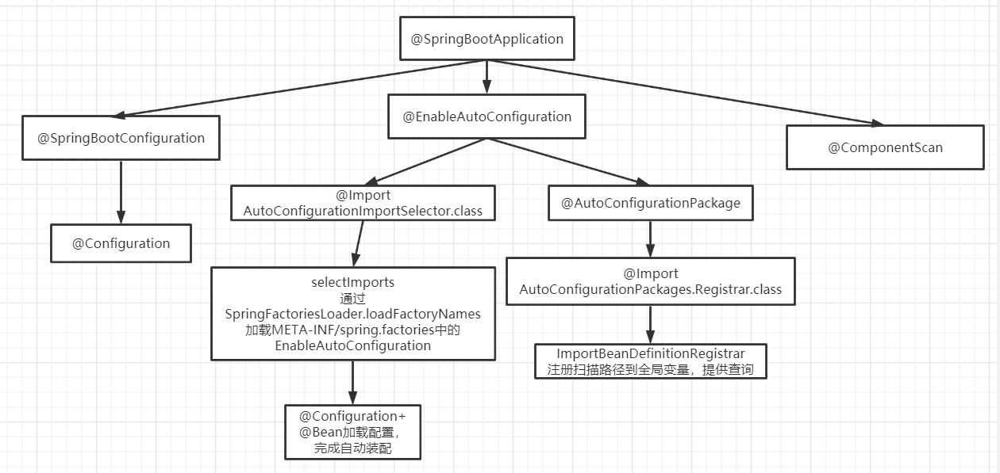

# Springboot

[[toc]]

## 1.SpringBoot自动装配原理解析


**实际上SpringBoot的自动装配原理，其实就是在项目启动的时候去加载META-INF下的 spring.factories 文件，好像也没有那么高大上。当然在启动的过程中还会有其他的配置项的加载，这里咱么直说了自动装配的加载过程。**

**@Import + @Configuration + Spring spi**

1. 自动配置类由`各个starter提供`，使用`@Configuration + @Bean`定义配置类，放到`META-INF/spring.factories`下
2. 使用Spring spi扫描META-INF/spring.factories下的配置类
3. 使用@Import导入自动配置类




首先对于一个SpringBoot工程来说，最明显的标志的就是 `@SpringBootApplication`它标记了这是一个SpringBoot工程，所以今天的 SpringBoot自动装配原理也就是从它开始说起。


- 首先我们来看下@SpringBootApplication 这个注解的背后又有什么玄机呢，我们按下 ctrl + 鼠标左键，轻轻的点一下，此时见证奇迹的时刻..

> 我们看到如下代码：
```java
@Target({ElementType.TYPE})
@Retention(RetentionPolicy.RUNTIME)
@Documented
@Inherited
@SpringBootConfiguration
@EnableAutoConfiguration
@ComponentScan(
    excludeFilters = {@Filter(
    type = FilterType.CUSTOM,
    classes = {TypeExcludeFilter.class}
), @Filter(
    type = FilterType.CUSTOM,
    classes = {AutoConfigurationExcludeFilter.class}
)}
)
public @interface SpringBootApplication {
    @AliasFor(
        annotation = EnableAutoConfiguration.class
    )
    Class<?>[] exclude() default {};
```

其中有两个比较容易引起我们注意的地方，一个是`@SpringBootConfiguration`注解，另一个是`@EnableAutoConfiguration`注解;之所以说这个两个注解比较吸引我们的眼球， 不是因为它们长大的好看，而是因为其他的注解太难看了（主要是因为其他的注解我们都是比较熟悉，即使不知道他们是干什么的，可以肯定更自动装配是没有关系的）。 然后我们又伸出了邪恶的小手，开启了熟悉的操作，按下了Ctrt + 鼠标左键

```java
//它可能使用来标记这是一个SpringBoot工程的配置
@Target({ElementType.TYPE})
@Retention(RetentionPolicy.RUNTIME)
@Documented
@Configuration
@Indexed
public @interface SpringBootConfiguration {
    @AliasFor(
        annotation = Configuration.class
    )
    boolean proxyBeanMethods() default true;
}
```

`@EnableAutoConfiguration`按下了 Ctrl + Table 键，回到了最初的的地方。

```java
@Target({ElementType.TYPE})
@Retention(RetentionPolicy.RUNTIME)
@Documented
@Inherited
@AutoConfigurationPackage
@Import({AutoConfigurationImportSelector.class})
public @interface EnableAutoConfiguration {
    String ENABLED_OVERRIDE_PROPERTY = "spring.boot.enableautoconfiguration";

    Class<?>[] exclude() default {};

    String[] excludeName() default {};
}
```

> 进入了 `AutoConfigurationImportSelector.class` 类，因为谷歌翻译告诉我们，这个是**自动配置导入选择器**

```java
public class AutoConfigurationImportSelector implements DeferredImportSelector, BeanClassLoaderAware,
		ResourceLoaderAware, BeanFactoryAware, EnvironmentAware, Ordered {


	@Override
	public String[] selectImports(AnnotationMetadata annotationMetadata) {
		if (!isEnabled(annotationMetadata)) {
			return NO_IMPORTS;
		}
        //todo 获取自动配置的实体
		AutoConfigurationEntry autoConfigurationEntry = getAutoConfigurationEntry(annotationMetadata);
		return StringUtils.toStringArray(autoConfigurationEntry.getConfigurations());
	}

        //todo 具体用来加载自动配置类得方法
	protected AutoConfigurationEntry getAutoConfigurationEntry(AnnotationMetadata annotationMetadata) {
		if (!isEnabled(annotationMetadata)) {
			return EMPTY_ENTRY;
		}
		AnnotationAttributes attributes = getAttributes(annotationMetadata);
        //todo 获取候选的配置类，要筛选的
		List<String> configurations = getCandidateConfigurations(annotationMetadata, attributes);
        //todo  根据情况，自动配置需要的配置类和不需要的配置了
		configurations = removeDuplicates(configurations);
		Set<String> exclusions = getExclusions(annotationMetadata, attributes);
		checkExcludedClasses(configurations, );
		configurations.removeAll(exclusions);
		configurations = getConfigurationClassFilter().filter(configurations);
		fireAutoConfigurationImportEvents(configurations, exclusions);
        //todo 返回最终需要的配置
		return new AutoConfigurationEntry(configurations, exclusions);
	}
}

```
在后面可以看到 `getAutoConfigurationEntry（）`方法返回了一个对象 `return new AutoConfigurationEntry(configurations, exclusions)`;这里也就是把我们需要的配置都拿到了。


- 而这个自动配置的实体 `AutoConfigurationEntry`里面有两个属性，`configurations`和 `exclusions`

```java
	protected static class AutoConfigurationEntry {
                // 用来存储需要的配置项
		private final List<String> configurations;
                // 用来存储排除的配置项
		private final Set<String> exclusions;

		private AutoConfigurationEntry() {
			this.configurations = Collections.emptyList();
			this.exclusions = Collections.emptySet();
		}
    }
```
- 那他是怎么拿到的候选的配置类呢? 我们接着看这个获取候选配置类的方法
`List<String> configurations = getCandidateConfigurations(annotationMetadata, attributes);`

进到方法后我们看到下面这个方法具体获取候选配置类的方法内容

```java
    protected List<String> getCandidateConfigurations(AnnotationMetadata metadata, AnnotationAttributes attributes) {
        List<String> configurations = SpringFactoriesLoader.loadFactoryNames(this.getSpringFactoriesLoaderFactoryClass(), this.getBeanClassLoader());
        Assert.notEmpty(configurations, "No auto configuration classes found in META-INF/spring.factories. If you are using a custom packaging, make sure that file is correct.");
        return configurations;
    }
```

这里我们跟着断点去走，首先进入`getSpringFactoriesLoaderFactoryClass()`方法

```java
	protected Class<?> getSpringFactoriesLoaderFactoryClass() {
                // 返回的是EnableAutoConfiguration字节码对象
		return EnableAutoConfiguration.class;
	}
```

接着我们在进入`getBeanClassLoader()`方法，这里就是一个类加载器

```java
protected ClassLoader getBeanClassLoader() {
	return this.beanClassLoader;
}
```

- 最后我们在进入`loadFactoryNames()`方法，这个方法就是根据刚才的字节码文件和类加载器来找到候选的配置类。传递过来的字节码
```java
	public static List<String> loadFactoryNames(Class<?> factoryType, @Nullable ClassLoader classLoader) {
		ClassLoader classLoaderToUse = classLoader;
		if (classLoaderToUse == null) {
			classLoaderToUse = SpringFactoriesLoader.class.getClassLoader();
		}
        // 获取的EnableAutoConfiguration.class的权限定名
        //org.springframework.boot.autoconfigure.EnableAutoConfiguration
		String factoryTypeName = factoryType.getName();
		return loadSpringFactories(classLoaderToUse).getOrDefault(factoryTypeName, Collections.emptyList());
	}
```

```java
private static Map<String, List<String>> loadSpringFactories(ClassLoader classLoader) {
        Map<String, List<String>> result = (Map)cache.get(classLoader);
        if (result != null) {
            return result;
        } else {
            HashMap result = new HashMap();

            try {
                Enumeration urls = classLoader.getResources("META-INF/spring.factories");

                while(urls.hasMoreElements()) {
                    URL url = (URL)urls.nextElement();
                    UrlResource resource = new UrlResource(url);
                    Properties properties = PropertiesLoaderUtils.loadProperties(resource);
                    Iterator var6 = properties.entrySet().iterator();

                    while(var6.hasNext()) {
                        Entry<?, ?> entry = (Entry)var6.next();
                        String factoryTypeName = ((String)entry.getKey()).trim();
                        String[] factoryImplementationNames = StringUtils.commaDelimitedListToStringArray((String)entry.getValue());
                        String[] var10 = factoryImplementationNames;
                        int var11 = factoryImplementationNames.length;

                        for(int var12 = 0; var12 < var11; ++var12) {
                            String factoryImplementationName = var10[var12];
                            ((List)result.computeIfAbsent(factoryTypeName, (key) -> {
                                return new ArrayList();
                            })).add(factoryImplementationName.trim());
                        }
                    }
                }

                result.replaceAll((factoryType, implementations) -> {
                    return (List)implementations.stream().distinct().collect(Collectors.collectingAndThen(Collectors.toList(), Collections::unmodifiableList));
                });
                cache.put(classLoader, result);
                return result;
            } catch (IOException var14) {
                throw new IllegalArgumentException("Unable to load factories from location [META-INF/spring.factories]", var14);
            }
        }
    }
```

也就是项目启动的时候会去加载所有 META-INF 下的所有的 spring.factories 文件，我们搜一下这个这个文件，我搭建的是一个很简单的 SpringBoot 工程，它会去这几个 jar 里面找相关的配置类


## 1.2 Springboot如何自动启动Tomcat


