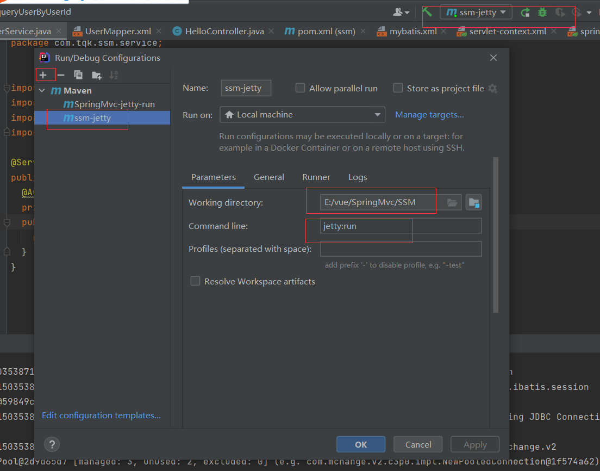

# 5 SSM框架集成与测试

## 5.1 环境配置

### 建表语句

```sql
CREATE TABLE `t_user` (
  `id` int(10) NOT NULL AUTO_INCREMENT,
  `user_name` varchar(255) CHARACTER SET utf8 COLLATE utf8_german2_ci DEFAULT NULL,
  `user_pwd` varchar(255) CHARACTER SET utf8 COLLATE utf8_german2_ci DEFAULT NULL,
  `true_name` varchar(255) CHARACTER SET utf8 COLLATE utf8_german2_ci DEFAULT NULL,
  `email` varchar(255) CHARACTER SET utf8 COLLATE utf8_german2_ci DEFAULT NULL,
  `phone` varchar(255) CHARACTER SET utf8 COLLATE utf8_german2_ci DEFAULT NULL,
  `is_valid` int(10) unsigned zerofill DEFAULT NULL,
  `create_date` datetime DEFAULT NULL,
  `update_date` datetime DEFAULT NULL,
  PRIMARY KEY (`id`)
) ENGINE=InnoDB AUTO_INCREMENT=2 DEFAULT CHARSET=utf8mb4;
```

### 5.1.1  pom.xml 添加

```xml
<?xml version="1.0" encoding="UTF-8"?>
<project xmlns="http://maven.apache.org/POM/4.0.0"
         xmlns:xsi="http://www.w3.org/2001/XMLSchema-instance"
         xsi:schemaLocation="http://maven.apache.org/POM/4.0.0 http://maven.apache.org/xsd/maven-4.0.0.xsd">
    <parent>
        <artifactId>SpringMvc</artifactId>
        <groupId>org.example</groupId>
        <version>1.0-SNAPSHOT</version>
    </parent>
    <modelVersion>4.0.0</modelVersion>
    <groupId>com.xxxx</groupId>
    <artifactId>ssm</artifactId>
    <version>1.0-SNAPSHOT</version>
    <packaging>war</packaging>

    <name>ssm Maven Webapp</name>

    <properties>
        <project.build.sourceEncoding>UTF-8</project.build.sourceEncoding>
        <maven.compiler.source>1.8</maven.compiler.source>
        <maven.compiler.target>1.8</maven.compiler.target>
    </properties>

    <dependencies>
        <!-- junit 测试 -->
        <dependency>
            <groupId>junit</groupId>
            <artifactId>junit</artifactId>
            <version>4.12</version>
            <scope>test</scope>
        </dependency>

        <!-- spring 核心jar -->
        <dependency>
            <groupId>org.springframework</groupId>
            <artifactId>spring-context</artifactId>
            <version>4.3.2.RELEASE</version>
        </dependency>

        <!-- spring 测试jar -->
        <dependency>
            <groupId>org.springframework</groupId>
            <artifactId>spring-test</artifactId>
            <version>4.3.2.RELEASE</version>
        </dependency>

        <!-- spring jdbc -->
        <dependency>
            <groupId>org.springframework</groupId>
            <artifactId>spring-jdbc</artifactId>
            <version>4.3.2.RELEASE</version>
        </dependency>

        <!-- spring事物 -->
        <dependency>
            <groupId>org.springframework</groupId>
            <artifactId>spring-tx</artifactId>
            <version>4.3.2.RELEASE</version>
        </dependency>

        <!-- aspectj切面编程的jar -->
        <dependency>
            <groupId>org.aspectj</groupId>
            <artifactId>aspectjweaver</artifactId>
            <version>1.8.9</version>
        </dependency>


        <!-- c3p0 连接池 -->
        <dependency>
            <groupId>c3p0</groupId>
            <artifactId>c3p0</artifactId>
            <version>0.9.1.2</version>
        </dependency>

        <!-- mybatis -->
        <dependency>
            <groupId>org.mybatis</groupId>
            <artifactId>mybatis</artifactId>
            <version>3.4.1</version>
        </dependency>

        <!-- 添加mybatis与Spring整合的核心包 -->
        <dependency>
            <groupId>org.mybatis</groupId>
            <artifactId>mybatis-spring</artifactId>
            <version>1.3.0</version>
        </dependency>
        <!-- mysql 驱动包 -->
        <dependency>
            <groupId>mysql</groupId>
            <artifactId>mysql-connector-java</artifactId>
            <version>5.1.39</version>
        </dependency>

        <!-- 日志打印相关的jar -->
        <dependency>
            <groupId>org.slf4j</groupId>
            <artifactId>slf4j-log4j12</artifactId>
            <version>1.7.2</version>
        </dependency>
        <dependency>
            <groupId>org.slf4j</groupId>
            <artifactId>slf4j-api</artifactId>
            <version>1.7.2</version>
        </dependency>

        <!-- https://mvnrepository.com/artifact/com.github.pagehelper/pagehelper -->
        <dependency>
            <groupId>com.github.pagehelper</groupId>
            <artifactId>pagehelper</artifactId>
            <version>5.1.10</version>
        </dependency>

        <!-- spring web -->
        <dependency>
            <groupId>org.springframework</groupId>
            <artifactId>spring-web</artifactId>
            <version>4.3.2.RELEASE</version>
        </dependency>

        <!-- spring mvc -->
        <dependency>
            <groupId>org.springframework</groupId>
            <artifactId>spring-webmvc</artifactId>
            <version>4.3.2.RELEASE</version>
        </dependency>

        <!-- web servlet -->
        <dependency>
            <groupId>javax.servlet</groupId>
            <artifactId>javax.servlet-api</artifactId>
            <version>3.0.1</version>
        </dependency>

        <!-- 添加json 依赖jar包 -->
        <dependency>
            <groupId>com.fasterxml.jackson.core</groupId>
            <artifactId>jackson-core</artifactId>
            <version>2.7.0</version>
        </dependency>
        <dependency>
            <groupId>com.fasterxml.jackson.core</groupId>
            <artifactId>jackson-databind</artifactId>
            <version>2.7.0</version>
        </dependency>
        <dependency>
            <groupId>com.fasterxml.jackson.core</groupId>
            <artifactId>jackson-annotations</artifactId>
            <version>2.7.0</version>
        </dependency>


        <dependency>
            <groupId>commons-fileupload</groupId>
            <artifactId>commons-fileupload</artifactId>
            <version>1.3.2</version>
        </dependency>

    </dependencies>

    <build>
        <finalName>ssm</finalName>
        <!--
                Maven 项目:如果源代码(src/main/java)存在xml、properties、tld 等文件
                Maven 默认不会自动编译该文件到输出目录,如果要编译源代码中xml properties tld 等文件
                需要显式配置resources 标签
             -->
        <resources>
            <resource>
                <directory>src/main/resources</directory>
            </resource>
            <resource>
                <directory>src/main/java</directory>
                <includes>
                    <include>**/*.xml</include>
                    <include>**/*.properties</include>
                    <include>**/*.tld</include>
                </includes>
                <filtering>false</filtering>
            </resource>
        </resources>

        <plugins>
            <plugin>
                <groupId>org.apache.maven.plugins</groupId>
                <artifactId>maven-compiler-plugin</artifactId>
                <version>2.3.2</version>
                <configuration>
                    <source>1.8</source>
                    <target>1.8</target>
                    <encoding>UTF-8</encoding>
                </configuration>
            </plugin>

            <plugin>
                <groupId>org.mortbay.jetty</groupId>
                <artifactId>maven-jetty-plugin</artifactId>
                <version>6.1.25</version>
                <configuration>
                    <scanIntervalSeconds>10</scanIntervalSeconds>
                    <contextPath>/ssm</contextPath>
                </configuration>
            </plugin>
        </plugins>
    </build>

</project>
```

### 5.1.2  web.xml 文件

```xml
<?xml version="1.0" encoding="UTF-8"?>
<web-app xmlns:xsi="http://www.w3.org/2001/XMLSchema-instance"
         xmlns="http://java.sun.com/xml/ns/javaee"
         xsi:schemaLocation="http://java.sun.com/xml/ns/javaee http://java.sun.com/xml/ns/javaee/web-app_3_0.xsd"
         id="WebApp_ID" version="3.0">
  <context-param>
    <param-name>contextConfigLocation</param-name>
    <param-value>classpath:spring.xml</param-value>
  </context-param>
  <listener>
    <listener-class>
      org.springframework.web.context.ContextLoaderListener
    </listener-class>
  </listener>
  <filter>
    <description>char encoding filter</description>
    <filter-name>encodingFilter</filter-name>
    <filter-class>
      org.springframework.web.filter.CharacterEncodingFilter</filter-class>
    <init-param>
      <param-name>encoding</param-name>
      <param-value>UTF-8</param-value>
    </init-param>
  </filter>
  <filter-mapping>
    <filter-name>encodingFilter</filter-name>
    <url-pattern>/*</url-pattern>
  </filter-mapping>
  <servlet>
    <servlet-name>ssm</servlet-name>
    <servlet-class>org.springframework.web.servlet.DispatcherServlet</servlet-class>
    <init-param>
      <param-name>contextConfigLocation</param-name>
      <param-value>classpath:servlet-context.xml</param-value>
    </init-param>
    <load-on-startup>1</load-on-startup>
  </servlet>
  <servlet-mapping>
    <servlet-name>ssm</servlet-name>
    <url-pattern>*.do</url-pattern>
  </servlet-mapping>
</web-app>
```

### 5.1.3  servlet-context.xml添加

```xml
<?xml version="1.0" encoding="UTF-8"?>
<beans xmlns="http://www.springframework.org/schema/beans"
       xmlns:xsi="http://www.w3.org/2001/XMLSchema-instance"
       xmlns:mvc="http://www.springframework.org/schema/mvc"
       xmlns:context="http://www.springframework.org/schema/context"
       xsi:schemaLocation="
        http://www.springframework.org/schema/mvc
        http://www.springframework.org/schema/mvc/spring-mvc.xsd
        http://www.springframework.org/schema/beans
        http://www.springframework.org/schema/beans/spring-beans.xsd
        http://www.springframework.org/schema/context
        http://www.springframework.org/schema/context/spring-context.xsd">
    <!-- 扫描com.springmvc.crm 下包 -->
    <context:component-scan base-package="com.tqk.ssm.controller" />

    <!-- mvc 注解驱动 并添加json 支持 -->
    <mvc:annotation-driven>
        <mvc:message-converters>
            <!-- 返回信息为字符串时 处理 -->
            <bean class="org.springframework.http.converter.StringHttpMessageConverter"/>
            <!-- 将对象转换为json 对象 -->
            <bean class="org.springframework.http.converter.json.MappingJackson2HttpMessageConverter"/>
        </mvc:message-converters>
    </mvc:annotation-driven>

    <!-- 静态资源文件的处理放行 -->
   <!-- <mvc:default-servlet-handler />-->


    <!--配置视图解析器  默认的视图解析器- -->
    <bean id="defaultViewResolver"
          class="org.springframework.web.servlet.view.InternalResourceViewResolver">
        <property name="viewClass" value="org.springframework.web.servlet.view.JstlView" />
        <property name="contentType" value="text/html" />
        <property name="prefix" value="/WEB-INF/jsp/" />
        <property name="suffix" value=".jsp" />
    </bean>

    <!-- 文件上传配置 -->
    <bean id="multipartResolver"
          class="org.springframework.web.multipart.commons.CommonsMultipartResolver">
        <property name="maxUploadSize">
            <value>104857600</value>
        </property>
        <property name="maxInMemorySize">
            <value>4096</value>
        </property>
    </bean>


    <!--
       配置全局异常统一处理Bean  处理视图的异常
    -->
    <!--<bean class="org.springframework.web.servlet.handler.SimpleMappingExceptionResolver">
        &lt;!&ndash;
           页面在转发时出现异常  设置默认的错误页面
        &ndash;&gt;
        <property name="defaultErrorView" value="error"></property>
        &lt;!&ndash;
            错误发生时  设置错误变量名
        &ndash;&gt;
        <property name="exceptionAttribute" value="ex"></property>
        <property name="exceptionMappings">
            <props>
                <prop key="com.tqk.ssm.exceptions.ParamsException">params_error</prop>
                <prop key="com.tqk.ssm.exceptions.BusinessException">busi_error</prop>
            </props>
        </property>

    </bean>-->
</beans>
```
### 5.1.4  spring.xml配置

```xml
<?xml version="1.0" encoding="UTF-8"?>
<beans xmlns="http://www.springframework.org/schema/beans"
       xmlns:xsi="http://www.w3.org/2001/XMLSchema-instance" xmlns:context="http://www.springframework.org/schema/context"
       xmlns:aop="http://www.springframework.org/schema/aop" xmlns:tx="http://www.springframework.org/schema/tx"
       xsi:schemaLocation="http://www.springframework.org/schema/beans
        http://www.springframework.org/schema/beans/spring-beans.xsd
        http://www.springframework.org/schema/context
        http://www.springframework.org/schema/context/spring-context.xsd
        http://www.springframework.org/schema/aop
        http://www.springframework.org/schema/aop/spring-aop.xsd
        http://www.springframework.org/schema/tx
        http://www.springframework.org/schema/tx/spring-tx.xsd">

    <!-- 扫描基本包 过滤controller层 -->
    <context:component-scan base-package="com.tqk.ssm" >
        <context:exclude-filter type="annotation"
                                expression="org.springframework.stereotype.Controller" />
    </context:component-scan>
    <!-- 加载properties 配置文件 -->
    <context:property-placeholder location="classpath:db.properties" />

    <aop:aspectj-autoproxy /><!-- aop -->

    <!-- 配置c3p0 数据源 -->
    <bean id="dataSource" class="com.mchange.v2.c3p0.ComboPooledDataSource">
        <property name="driverClass" value="${jdbc.driver}"></property>
        <property name="jdbcUrl" value="${jdbc.url}"></property>
        <property name="user" value="${jdbc.username}"></property>
        <property name="password" value="${jdbc.password}"></property>
    </bean>

    <!-- 配置事务管理器 -->
    <bean id="txManager"
          class="org.springframework.jdbc.datasource.DataSourceTransactionManager">
        <property name="dataSource" ref="dataSource"></property>
    </bean>

    <!-- 设置事物增强 -->
    <tx:advice id="txAdvice" transaction-manager="txManager">
        <tx:attributes>
            <tx:method name="add*" propagation="REQUIRED" />
            <tx:method name="insert*" propagation="REQUIRED" />
            <tx:method name="update*" propagation="REQUIRED" />
            <tx:method name="delete*" propagation="REQUIRED" />
        </tx:attributes>
    </tx:advice>

    <!-- aop 切面配置 -->
    <aop:config>
        <aop:pointcut id="servicePointcut"
                      expression="execution(* com.tqk.ssm.service..*.*(..))" />
        <aop:advisor advice-ref="txAdvice" pointcut-ref="servicePointcut" />
    </aop:config>

    <!-- 配置 sqlSessionFactory -->
    <bean id="sqlSessionFactory" class="org.mybatis.spring.SqlSessionFactoryBean">
        <property name="dataSource" ref="dataSource"></property>
        <property name="configLocation" value="classpath:mybatis.xml" />
        <property name="mapperLocations" value="classpath:com/tqk/ssm/mapper/*.xml" />
    </bean>

    <!-- 配置扫描器 -->
    <bean id="mapperScanner" class="org.mybatis.spring.mapper.MapperScannerConfigurer">
        <!-- 扫描com.springmvc.dao这个包以及它的子包下的所有映射接口类 -->
        <property name="basePackage" value="com.tqk.ssm.dao" />
        <property name="sqlSessionFactoryBeanName" value="sqlSessionFactory" />
    </bean>
</beans>
```
### 5.1.5  mybatis.xml全局文件配置

```xml
<?xml version="1.0" encoding="UTF-8" ?>
<!DOCTYPE configuration
        PUBLIC "-//mybatis.org//DTD Config 3.0//EN"
        "http://mybatis.org/dtd/mybatis-3-config.dtd">
<configuration>
    <typeAliases>
        <package name="com.tqk.ssm.vo"/>
    </typeAliases>
    <plugins>
        <plugin interceptor="com.github.pagehelper.PageInterceptor"></plugin>
    </plugins>
</configuration>
```
### 5.1.6  准备db.properties 文件

```yaml
jdbc.driver=com.mysql.jdbc.Driver
jdbc.url=jdbc:mysql://49.233.34.168:6699/ssm?useUnicode=true&characterEncoding=utf8
jdbc.username=root
jdbc.password=12345@tqk
```

### 5.1.7  添加log4j.properties日志打印文件

```yaml
log4j.rootLogger=DEBUG, Console  
#Console
log4j.appender.Console=org.apache.log4j.ConsoleAppender  
log4j.appender.Console.layout=org.apache.log4j.PatternLayout  
log4j.appender.Console.layout.ConversionPattern=%d [%t] %-5p [%c] - %m%n  
log4j.logger.java.sql.ResultSet=INFO  
log4j.logger.org.apache=INFO  
log4j.logger.java.sql.Connection=DEBUG  
log4j.logger.java.sql.Statement=DEBUG  
log4j.logger.java.sql.PreparedStatement=DEBUG
```

## 5.2 添加源代码

src/main/java 下创建
com.tqk.ssm.controller、com.tqk.ssm.service、com.tqk.ssm.mapper、com.tqk.ssm.dao、
com.tqk.ssm.vo等包结构

### 5.2.1 添加HelloController.java
```java
package com.tqk.ssm.controller;

import com.tqk.ssm.service.UserService;
import com.tqk.ssm.vo.User;
import org.springframework.stereotype.Controller;
import org.springframework.ui.Model;
import org.springframework.web.bind.annotation.RequestMapping;

import javax.annotation.Resource;

@Controller
public class HelloController {

    @Resource
    private UserService userService;

    @RequestMapping("hello")
    public String hello(Integer userId, Model model){
       /*int a=1/0;*/
        System.out.println("userId:"+userId);
       User user = userService.queryUserByUserId(userId);
       model.addAttribute("user",user);
       return "hello";
    }
}

```
### 5.2.2 添加UserService.java,提供用户详情查询方法
- com.tqk.ssm.service 包下创建UserService.java 文件

```java
package com.tqk.ssm.service;


import com.tqk.ssm.dao.UserDao;
import com.tqk.ssm.vo.User;
import org.springframework.beans.factory.annotation.Autowired;
import org.springframework.stereotype.Service;

@Service
public class UserService{
  @Autowired
  private UserDao userMapper;
  public User queryUserByUserId(Integer userId){
    return userMapper.queryUserByUserId(userId);
  }
}

```
### 5.2.3 添加User.java 文件
- com.tqk.ssm.vo 包下创建JavaBean文件 User.java(数据库字段对应如下)
```java
package com.tqk.ssm.vo;

import java.util.Date;

public class User {
    private Integer id;

    private String userName;

    private String userPwd;

    private String trueName;

    private String email;

    private String phone;

    private Integer isValid;

    private Date createDate;

    private Date updateDate;

    public Integer getId() {
        return id;
    }

    public void setId(Integer id) {
        this.id = id;
    }

    public String getUserName() {
        return userName;
    }

    public void setUserName(String userName) {
        this.userName = userName;
    }

    public String getUserPwd() {
        return userPwd;
    }

    public void setUserPwd(String userPwd) {
        this.userPwd = userPwd;
    }

    public String getTrueName() {
        return trueName;
    }

    public void setTrueName(String trueName) {
        this.trueName = trueName;
    }

    public String getEmail() {
        return email;
    }

    public void setEmail(String email) {
        this.email = email;
    }

    public String getPhone() {
        return phone;
    }

    public void setPhone(String phone) {
        this.phone = phone;
    }

    public Integer getIsValid() {
        return isValid;
    }

    public void setIsValid(Integer isValid) {
        this.isValid = isValid;
    }

    public Date getCreateDate() {
        return createDate;
    }

    public void setCreateDate(Date createDate) {
        this.createDate = createDate;
    }

    public Date getUpdateDate() {
        return updateDate;
    }

    public void setUpdateDate(Date updateDate) {
        this.updateDate = updateDate;
    }
}

```
### 5.2.4 添加UserMapper.java 接口文件 ,提供用户详情查询方法
- com.tqk.ssm.dao 包下创建UserMapper.java 文件
```java
package com.tqk.ssm.dao;


import com.tqk.ssm.vo.User;
import org.apache.ibatis.annotations.Select;

public interface UserDao {

    public User queryUserByUserId(Integer userId);

    @Select("select id,user_name as userName,user_pwd as userPwd from t_user where id=#{userId}")
    public User queryUserByUserId2(Integer userId);
}
```
### 5.2.5 添加UserMapper.xml 映射文件，提供select 查询标签配置
- com.tqk.ssm.mapper 包下创建UserMapper.xml 文件
```java
<?xml version="1.0" encoding="UTF-8" ?>
<!DOCTYPE mapper
        PUBLIC "-//mybatis.org//DTD Mapper 3.0//EN"
        "http://mybatis.org/dtd/mybatis-3-mapper.dtd">
<mapper namespace="com.tqk.ssm.dao.UserDao">
      <select id="queryUserByUserId" parameterType="int" resultType="com.tqk.ssm.vo.User">
           select id,user_name as userName,user_pwd as userPwd
           from t_user
           where id=#{userId}
      </select>
</mapper>
```
### 5.2.6 添加视图文件hello.jsp,展示查询的用户信息
- 在src/main/webapp/WEB-INF 创建jsp 目录，并在该目下创建hello.jsp
```java
<%--
  Created by IntelliJ IDEA.
  User: lp
  Date: 2020/2/15
  Time: 16:10
  To change this template use File | Settings | File Templates.
--%>
<%@ page contentType="text/html;charset=UTF-8" language="java" %>
<html>
<head>
    <title>Title</title>
</head>
<body>
  ${user.userName}  || ${user.userPwd}
</body>
</html>

```

## 5.3 执行测试

### 5.3.1 Idea下配置jetty启动命令



### 5.3.2 启动jetty 浏览器访问

`http://localhost:8080/ssm/hello.do?userId=1` 
- 查看结果