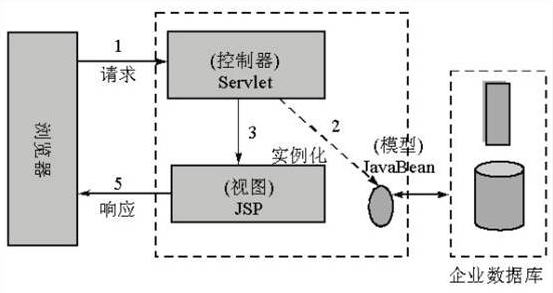
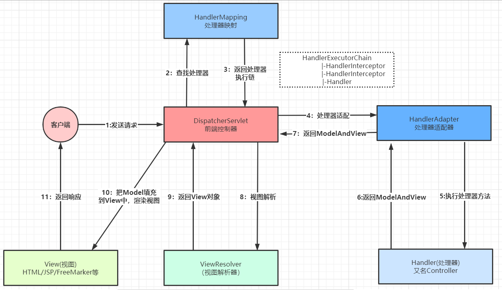
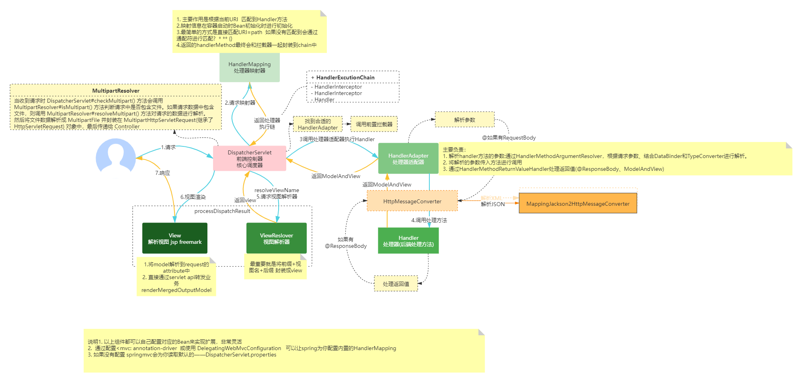

# 1. SpringMVC请求流程

:::tip Spring MVC组成
- 前端控制器（DispatcherServlet）、
- 请求到处理器映射（HandlerMapping）、
- 处理器适配器（HandlerAdapter）、
- 视图解析器（ViewResolver）、
- 处理器或页面控制器（Controller）、
- 验证器（ Validator）、
- 命令对象（Command 请求参数绑定到的对象就叫命令对象）、
- 表单对象（Form Object 提供给表单展示和提交到的对象就叫表单对象）
:::

## 1.1 MVC模型-Model2

Model2 模型是在 Model1 的基础上进行改良，它是 MVC 模型的一个经典应用。它把处理请求 和展示数据进行分离，让每个部分各司其职。 此时的 JSP 已经就是纯粹的展示数据了，而处理请求的事情交由控制器来完成，使 每个组件充分独立，提高了代码可重用性和易维护性。下图展示的就是 Model2 模型：

**Model 2是基于MVC架构的设计模式** 
-------------------------------------

1. 在Model 2架构中，Servlet作为前端控制器，负责接收客户端发送的请求 
2. 在Servlet中只包含控制逻辑和简单的前端处理； 
3. 后端JavaBean来完成实际的逻辑处理； 
4. 最后转发到相应的JSP页面处理显示逻辑。

`Model 2具有组件化的特点，更适用于大规模应用的开发`

## 1.2 SpringMVC 的执行过程分析

:::tip  
1. 前端控制器DispatcherServlet 由框架提供
    - 作用：接收请求，处理响应结果 

2. 处理器映射器HandlerMapping由框架提供 
    - 作用：根据请求URL，找到对应的Handler 

3. 处理器适配器HandlerAdapter由框架提供 
    - 作用：调用处理器（Handler|Controller）的方法 

4. 处理器Handler又名Controller,后端处理器 
    - 作用：接收用户请求数据，调用业务方法处理请求

5. 视图解析器ViewResolver由框架提供 
    - 作用：视图解析，把逻辑视图名称解析成真正的物理视图 支持多种视图技术：JSTLView,FreeMarker... 

6. 视图View,程序员开发 
    - 作用：将数据展现给用户
:::

1. 首先用户发送请求,请求被SpringMvc前端控制器（DispatherServlet）捕获；

2. 前端控制器(DispatherServlet)对请求URL解析获取请求URI,根据URI, 调用HandlerMapping；

3. 前端控制器(DispatherServlet)获得返回的HandlerExecutionChain（包括Handler对象以及Handler对象对应的拦截器）；

4. DispatcherServlet 根据获得的HandlerExecutionChain，选择一个合适的HandlerAdapter。（附
    - 注：如果成功获得HandlerAdapter后，此时将开始执行拦截器的preHandler(...)方法）；

5. HandlerAdapter根据请求的Handler适配并执行对应的Handler；HandlerAdapter(提取Request中的模型数据，填充Handler入参，开始执行Handler（Controller)。 
    :::tip 在填充Handler的入参过程中，根据配置，Spring将做一些额外的工作：
        - `HttpMessageConveter`： 将请求消息（如Json、xml等数据）转换成一个对象，将对象转换为指定的响应信息。
        - `数据转换`：对请求消息进行数据转换。如String转换成Integer、Double等数据格式化：
        - `数据格式化`: 如将字符串转换成格式化数字或格式化日期等
        - `数据验证`： 验证数据的有效性（长度、格式等），验证结果存储到BindingResult或Error中）
    :::
6. Handler执行完毕，返回一个ModelAndView(即模型和视图)给HandlerAdaptor
7. HandlerAdaptor适配器将执行结果ModelAndView返回给前端控制器。
8. 前端控制器接收到ModelAndView后，请求对应的视图解析器。
9. 视图解析器解析ModelAndView后返回对应View;
10. 渲染视图并返回渲染后的视图给前端控制器。
11. 最终前端控制器将渲染后的页面响应给用户或客户端
