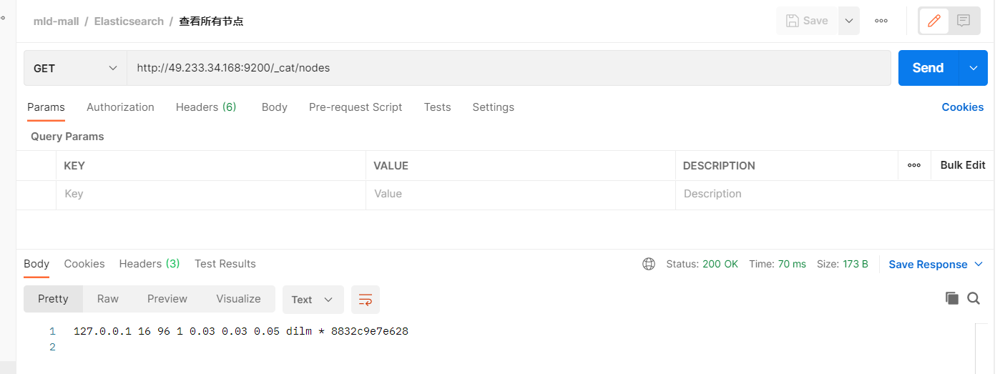
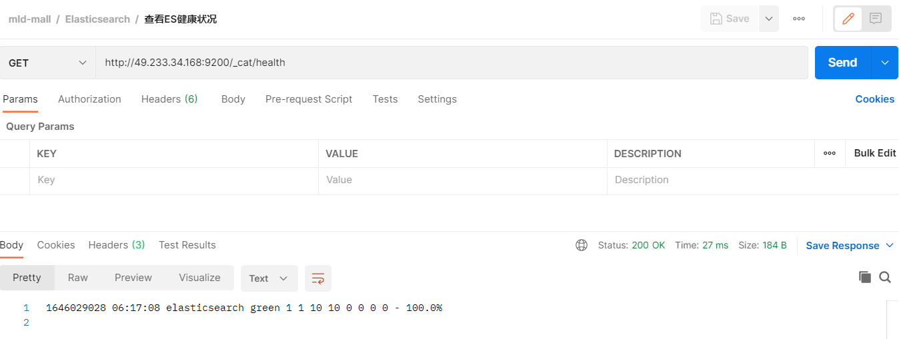
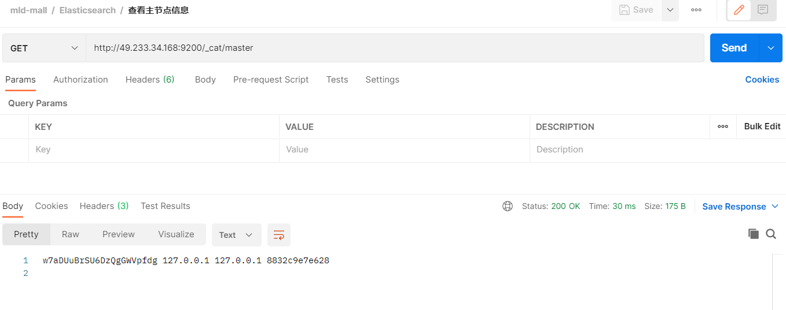
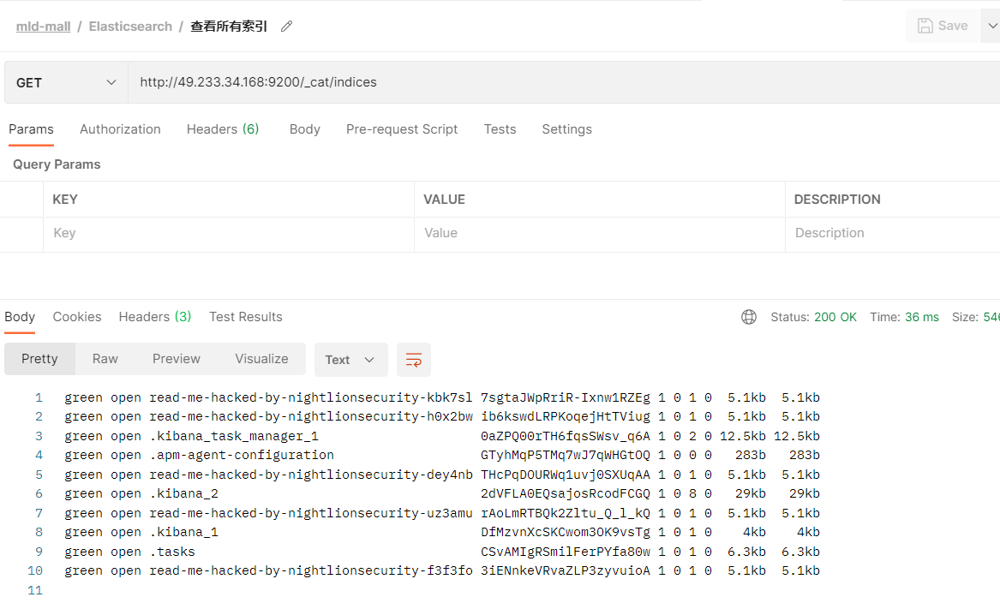
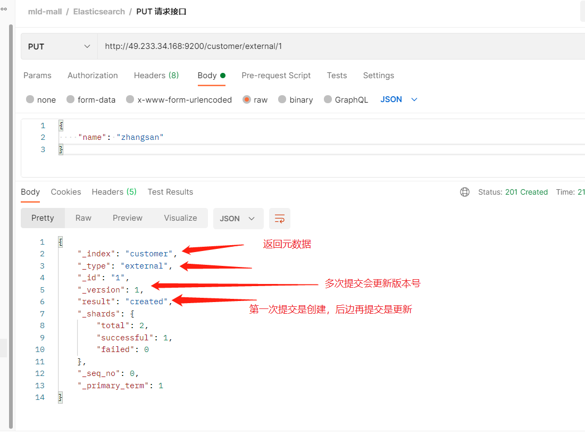
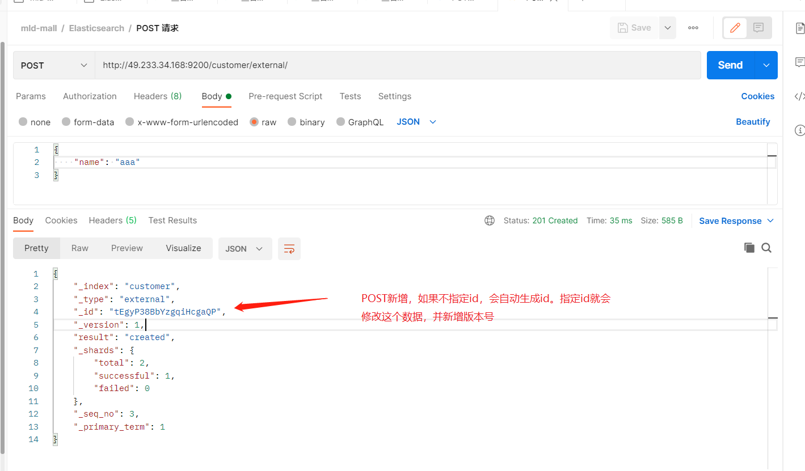
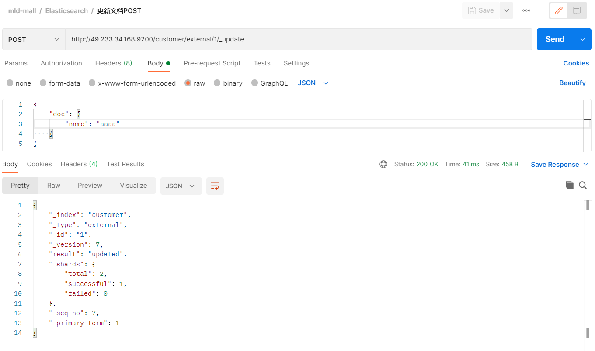
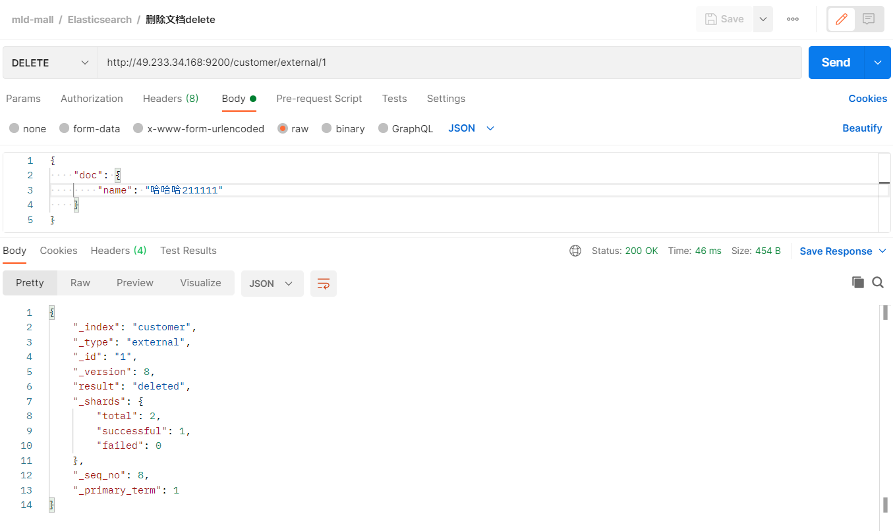
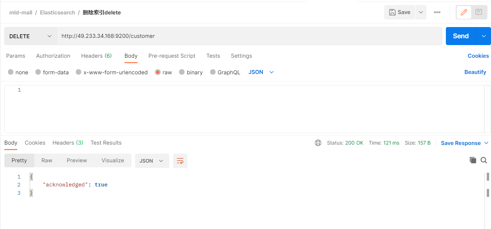
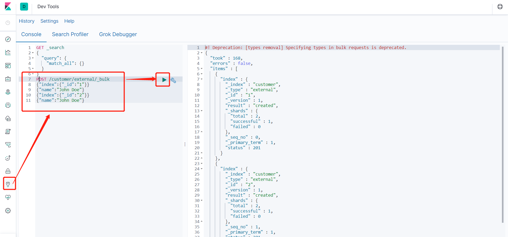

# 3. Elasticsearch-使用入门

Elasticsearch-使用入门前面介绍说，Elasticsearch 都是通过 REST API 接口来操作数据的，那么下面接通过几个接口的请求来演示它的使用。（当前虚拟机IP为49.233.34.168）
_cat

## 3.1. /_cat/nodes：查看所有节点

接口：`GET http://49.233.34.168:9200/_cat/nodes`

<a data-fancybox title="查看所有节点" href="./images/es6.png"></a>

## 3.2. /_cat/health：查看ES健康状况

接口：`GET http://49.233.34.168:9200/_cat/health`

<a data-fancybox title="查看ES健康状况" href="./images/es1.png"></a>

:::tip ES集群状态说明：
- `green`：最健康得状态，说明所有的分片包括备份都可用
- `yellow`：基本的分片可用，但是备份不可用（或者是没有备份）
- `red`：部分的分片可用，表明分片有一部分损坏。此时执行查询部分数据仍然可以查到，但是要尽快解决
:::
#### 3.2.1 单节点Elasticsearch健康状态为 yellow

[https://blog.csdn.net/weixin_45367149/article/details/109675180]

## 3.3. /_cat/master：查看主节点信息

接口：`GET http://49.233.34.168:9200/_cat/master`

<a data-fancybox title="查看主节点信息" href="./images/es2.png"></a>

## 3.4. /_cat/indicies：查看所有索引

等价于 mysql 数据库的 show databases;

接口：`GET http://49.233.34.168:9200/_cat/indices`

<a data-fancybox title="查看所有索引" href="./images/es3.png"></a>

## 3.5. 索引一个文档

即保存一条数据，保存在哪个索引的哪个类型下，指定用哪个唯一标识。

### 3.5.1. PUT 请求

接口：`PUT http://49.233.34.168:9200/customer/external/1`

<a data-fancybox title="索引一个文档" href="./images/es4.png"></a>

### 3.5.2. POST 请求

接口：`POST http://49.233.34.168:9200/customer/external/`

<a data-fancybox title="索引一个文档" href="./images/es5.png"></a>

PUT和POST都可以POST新增，如果不指定id，会自动生成id。

指定id就会修改这个数据，并新增版本号；PUT可以新增也可以修改。PUT必须指定id；由于PUT需要指定id，我们一般用来做修改操作，不指定id会报错。

## 3.6 查看文档

格式：`/index/type/id`

接口：`GET http://49.233.34.168:9200/customer/external/1`

```json
{
    "_index": "customer",  # 在哪个索引(库)
    "_type": "external",   # 在哪个类型(表)
    "_id": "1",						 # 文档id(记录)
    "_version": 5,				 # 版本号
    "_seq_no": 4,					 # 并发控制字段，每次更新都会+1，用来做乐观锁
    "_primary_term": 1,		 # 同上，主分片重新分配，如重启，就会变化
    "found": true,
    "_source": {					 # 数据
        "name": "zhangsan"
    }
}

# 乐观锁更新时携带 ?_seq_no=0&_primary_term=1  当携带数据与实际值不匹配时更新失败
```

## 3.7 更新文档

`/index/type/id/_update`

接口：`POST http://49.233.34.168:9200/customer/external/1/_update`

几种更新文档的区别在上面索引文档即保存文档的时候介绍，

还有两种更新文档的方式：
- 当PUT请求带id，且有该id数据存在时，会更新文档；
- 当POST请求带id，与PUT相同，该id数据已经存在时，会更新文档；


<a data-fancybox title="更新文档" href="./images/es7.png"></a>

这两种请求类似，即带id，且数据存在，就会执行更新操作。

类比：请求体的报文格式不同，`_update方式`要修改的数据要**包裹在 doc 键下**

`_update方式`不会重复更新，数据已存在不会更新，版本号不会改变，

另两种方式会重复更新（覆盖原来数据），版本号会改变
这几种方式在更新时都可以增加属性，PUT请求带id更新和POST请求带id更新，会直接覆盖原来的数据，不会在原来的属性里面新增属性

## 3.7 删除文档&索引

### 3.7.1 删除文档

接口：`DELETE http://49.233.34.168:9200/customer/external/1`

<a data-fancybox title="删除文档" href="./images/es8.png"></a>

### 3.7.2 删除索引

接口：`DELETE http://49.233.34.168:9200/customer`


<a data-fancybox title="删除文档" href="./images/es9.png"></a>

## 3.8 bulk-批量操作数据


语法格式：
```json
{action:{metadata}}\n   // 例如index保存记录，update更新
{request body  }\n
{action:{metadata}}\n
{request body  }\n
```

### 3.8.1. 指定索引和类型的批量操作

接口：`POST /customer/external/_bulk`

参数：
```json
{"index":{"_id":"1"}}
{"name":"John Doe"}
{"index":{"_id":"2"}}
{"name":"John Doe"}
```

在Kibana中使用dev-tools测试批量：
<a data-fancybox title="指定索引和类型的批量操作" href="./images/es10.png"></a>
----------------------------------

### 3.8.2. 对所有索引执行批量操作

接口：`POST /_bulk`

**参数：**

```json
{"delete":{"_index":"website","_type":"blog","_id":"123"}}
{"create":{"_index":"website","_type":"blog","_id":"123"}}
{"title":"my first blog post"}
{"index":{"_index":"website","_type":"blog"}}
{"title":"my second blog post"}
{"update":{"_index":"website","_type":"blog","_id":"123"}}
{"doc":{"title":"my updated blog post"}}
```

- 这里的批量操作，当发生某一条执行发生失败时，其他的数据仍然能够接着执行，也就是说彼此之间是独立的。

- bulk api以此按顺序执行所有的action（动作）。如果一个单个的动作因任何原因失败，它将继续处理它后面剩余的动作。

- 当bulk api返回时，它将提供每个动作的状态（与发送的顺序相同），所以您可以检查是否一个指定的动作是否失败了。