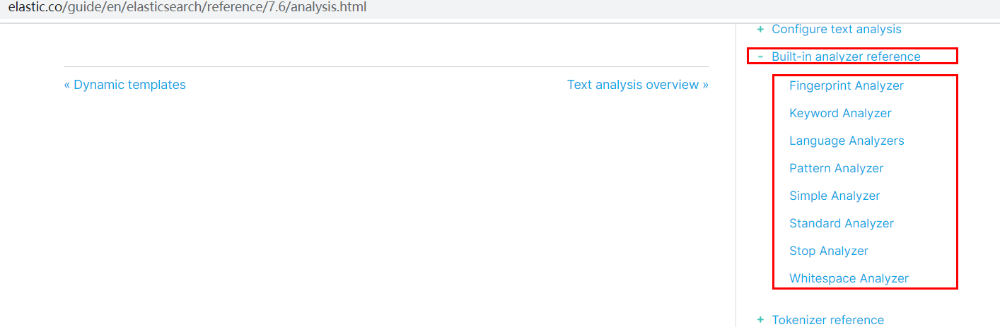

# 6. 分词


## 6.1 tokenizer（分词器）
一个tokenizer（分词器）接收一个字符流，将之分割为独立的tokens（词元，通常是独立的单词），然后输出tokens流。

例如：whitespace tokenizer遇到空白字符时分割文本。它会将文本“Quick brown fox!”分割为[Quick,brown,fox!]。

该tokenizer（分词器）还负责记录各个terms(词条)的顺序或position位置（用于phrase短语和word proximity词近邻查询），以及term（词条）所代表的原始word（单词）的start（起始）和end（结束）的character offsets（字符串偏移量）（用于高亮显示搜索的内容）。

elasticsearch提供了很多内置的分词器，可以用来构建custom analyzers（自定义分词器）。

关于分词器： https://www.elastic.co/guide/en/elasticsearch/reference/7.6/analysis.html 


#### 发送报文
```json
POST _analyze
{
  "analyzer": "standard",
  "text": "The 2 QUICK Brown-Foxes jumped over the lazy dog's bone."
}

POST _analyze
{
  "analyzer": "standard",
  "text": "柠檬是个大哈哈哈"
}
```

#### 执行结果：

```json
{
  "tokens" : [
    {
      "token" : "柠",
      "start_offset" : 0,
      "end_offset" : 1,
      "type" : "<IDEOGRAPHIC>",
      "position" : 0
    },
    {
      "token" : "檬",
      "start_offset" : 1,
      "end_offset" : 2,
      "type" : "<IDEOGRAPHIC>",
      "position" : 1
    },
    {
      "token" : "是",
      "start_offset" : 2,
      "end_offset" : 3,
      "type" : "<IDEOGRAPHIC>",
      "position" : 2
    },
    {
      "token" : "个",
      "start_offset" : 3,
      "end_offset" : 4,
      "type" : "<IDEOGRAPHIC>",
      "position" : 3
    },
    {
      "token" : "大",
      "start_offset" : 4,
      "end_offset" : 5,
      "type" : "<IDEOGRAPHIC>",
      "position" : 4
    },
    {
      "token" : "哈",
      "start_offset" : 5,
      "end_offset" : 6,
      "type" : "<IDEOGRAPHIC>",
      "position" : 5
    },
    {
      "token" : "哈",
      "start_offset" : 6,
      "end_offset" : 7,
      "type" : "<IDEOGRAPHIC>",
      "position" : 6
    },
    {
      "token" : "哈",
      "start_offset" : 7,
      "end_offset" : 8,
      "type" : "<IDEOGRAPHIC>",
      "position" : 7
    }
  ]
}
```

```json
{
  "tokens" : [
    {
      "token" : "the",
      "start_offset" : 0,
      "end_offset" : 3,
      "type" : "<ALPHANUM>",
      "position" : 0
    },
    {
      "token" : "2",
      "start_offset" : 4,
      "end_offset" : 5,
      "type" : "<NUM>",
      "position" : 1
    },
    {
      "token" : "quick",
      "start_offset" : 6,
      "end_offset" : 11,
      "type" : "<ALPHANUM>",
      "position" : 2
    },
    {
      "token" : "brown",
      "start_offset" : 12,
      "end_offset" : 17,
      "type" : "<ALPHANUM>",
      "position" : 3
    },
    {
      "token" : "foxes",
      "start_offset" : 18,
      "end_offset" : 23,
      "type" : "<ALPHANUM>",
      "position" : 4
    },
    {
      "token" : "jumped",
      "start_offset" : 24,
      "end_offset" : 30,
      "type" : "<ALPHANUM>",
      "position" : 5
    },
    {
      "token" : "over",
      "start_offset" : 31,
      "end_offset" : 35,
      "type" : "<ALPHANUM>",
      "position" : 6
    },
    {
      "token" : "the",
      "start_offset" : 36,
      "end_offset" : 39,
      "type" : "<ALPHANUM>",
      "position" : 7
    },
    {
      "token" : "lazy",
      "start_offset" : 40,
      "end_offset" : 44,
      "type" : "<ALPHANUM>",
      "position" : 8
    },
    {
      "token" : "dog's",
      "start_offset" : 45,
      "end_offset" : 50,
      "type" : "<ALPHANUM>",
      "position" : 9
    },
    {
      "token" : "bone",
      "start_offset" : 51,
      "end_offset" : 55,
      "type" : "<ALPHANUM>",
      "position" : 10
    }
  ]
}

```


## 6.2 安装ik分词器



所有的语言分词，默认使用的都是“Standard Analyzer”，但是这些分词器针对于中文的分词，并不友好。为此需要安装中文的分词器。


注意：不能用默认`elasticsearch-plugin install xxx.zip `进行自动安装

<a herf='https://github.com/medcl/elasticsearch-analysis-ik/releases/download'>https://github.com/medcl/elasticsearch-analysis-ik/releases/download对应es版本安装</a>


在前面安装的elasticsearch时，我们已经将elasticsearch容器的“/usr/share/elasticsearch/plugins”目录，映射到宿主机的“ /mydata/elasticsearch/plugins”目录下，所以比较方便的做法就是下载“/elasticsearch-analysis-ik-7.4.2.zip”文件，然后解压到该文件夹下即可。安装完毕后，需要重启elasticsearch容器。

如果不嫌麻烦，还可以采用如下的方式。

### 6.2.1 查看elasticsearch版本号：

```shell
[root@VM-16-5-centos ~]# curl http://localhost:9200
{
  "name" : "8832c9e7e628",
  "cluster_name" : "elasticsearch",
  "cluster_uuid" : "CQqJ9LjuRTWDy3k9ARqa6Q",
  "version" : {
    "number" : "7.4.2",
    "build_flavor" : "default",
    "build_type" : "docker",
    "build_hash" : "2f90bbf7b93631e52bafb59b3b049cb44ec25e96",
    "build_date" : "2019-10-28T20:40:44.881551Z",
    "build_snapshot" : false,
    "lucene_version" : "8.2.0",
    "minimum_wire_compatibility_version" : "6.8.0",
    "minimum_index_compatibility_version" : "6.0.0-beta1"
  },
  "tagline" : "You Know, for Search"
}

```


### 6.2.2 进入es容器内部plugin目录

#### * docker exec -it 容器id /bin/bash

```shell
[root@VM-16-5-centos ~]#  docker exec -it elasticsearch /bin/bash
[root@8832c9e7e628 elasticsearch]# 
```

#### * wget  https://github.com/medcl/elasticsearch-analysis-ik/releases/download/v7.4.2/elasticsearch-analysis-ik-7.4.2.zip

```shell
[root@0adeb7852e00 elasticsearch]# pwd
/usr/share/elasticsearch
#下载ik7.4.2
[root@0adeb7852e00 elasticsearch]# wget  https://github.com/medcl/elasticsearch-analysis-ik/releases/download/v7.4.2/elasticsearch-analysis-ik-7.4.2.zip
```

#### * unzip 下载的文件

```shell
[root@VM-16-5-centos plugins]# ls
elasticsearch-analysis-ik-7.4.2.zip
[root@VM-16-5-centos plugins]# unzip elasticsearch-analysis-ik-7.4.2.zip -d ink
Archive:  elasticsearch-analysis-ik-7.4.2.zip
  inflating: ink/elasticsearch-analysis-ik-7.4.2.jar  
  inflating: ink/httpclient-4.5.2.jar  
  inflating: ink/httpcore-4.4.4.jar  
  inflating: ink/commons-logging-1.2.jar  
  inflating: ink/commons-codec-1.9.jar  
  inflating: ink/plugin-descriptor.properties  
  inflating: ink/plugin-security.policy  
   creating: ink/config/
  inflating: ink/config/surname.dic  
  inflating: ink/config/quantifier.dic  
  inflating: ink/config/extra_stopword.dic  
  inflating: ink/config/suffix.dic   
  inflating: ink/config/extra_single_word_full.dic  
  inflating: ink/config/extra_single_word.dic  
  inflating: ink/config/preposition.dic  
  inflating: ink/config/IKAnalyzer.cfg.xml  
  inflating: ink/config/main.dic     
  inflating: ink/config/stopword.dic  
  inflating: ink/config/extra_main.dic  
  inflating: ink/config/extra_single_word_low_freq.dic 

  [root@VM-16-5-centos plugins]# ls
elasticsearch-analysis-ik-7.4.2.zip  ink

# 必须删除，不然重启失败
rm -rf elasticsearch-analysis-ik-7.4.2.zip

```

#### * rm -rf *.zip

```
[root@0adeb7852e00 elasticsearch]# rm -rf elasticsearch-analysis-ik-7.4.2.zip 
```


确认是否安装好了分词器

### 6.2.3 测试分词器

#### 使用默认

```json
GET my_index/_analyze
{
   "text":"我是中国人"
}
```

####  请观察执行结果：

```json
{
  "tokens" : [
    {
      "token" : "我",
      "start_offset" : 0,
      "end_offset" : 1,
      "type" : "<IDEOGRAPHIC>",
      "position" : 0
    },
    {
      "token" : "是",
      "start_offset" : 1,
      "end_offset" : 2,
      "type" : "<IDEOGRAPHIC>",
      "position" : 1
    },
    {
      "token" : "中",
      "start_offset" : 2,
      "end_offset" : 3,
      "type" : "<IDEOGRAPHIC>",
      "position" : 2
    },
    {
      "token" : "国",
      "start_offset" : 3,
      "end_offset" : 4,
      "type" : "<IDEOGRAPHIC>",
      "position" : 3
    },
    {
      "token" : "人",
      "start_offset" : 4,
      "end_offset" : 5,
      "type" : "<IDEOGRAPHIC>",
      "position" : 4
    }
  ]
}
```


#### _analyze

```json
GET my_index/_analyze
{
   "analyzer": "ik_smart", 
   "text":"我是中国人"
}
```

输出结果：

```json
{
  "tokens" : [
    {
      "token" : "我",
      "start_offset" : 0,
      "end_offset" : 1,
      "type" : "CN_CHAR",
      "position" : 0
    },
    {
      "token" : "是",
      "start_offset" : 1,
      "end_offset" : 2,
      "type" : "CN_CHAR",
      "position" : 1
    },
    {
      "token" : "中国人",
      "start_offset" : 2,
      "end_offset" : 5,
      "type" : "CN_WORD",
      "position" : 2
    }
  ]
}

```


#### ik_max_word

```json
GET my_index/_analyze
{
   "analyzer": "ik_max_word", 
   "text":"我是中国人"
}
```


输出结果：

```json
{
  "tokens" : [
    {
      "token" : "我",
      "start_offset" : 0,
      "end_offset" : 1,
      "type" : "CN_CHAR",
      "position" : 0
    },
    {
      "token" : "是",
      "start_offset" : 1,
      "end_offset" : 2,
      "type" : "CN_CHAR",
      "position" : 1
    },
    {
      "token" : "中国人",
      "start_offset" : 2,
      "end_offset" : 5,
      "type" : "CN_WORD",
      "position" : 2
    },
    {
      "token" : "中国",
      "start_offset" : 2,
      "end_offset" : 4,
      "type" : "CN_WORD",
      "position" : 3
    },
    {
      "token" : "国人",
      "start_offset" : 3,
      "end_offset" : 5,
      "type" : "CN_WORD",
      "position" : 4
    }
  ]
}

```

 

## 6.3 自定义词库


### 6.3.1 修改IKAnalyzer.cfg.xml
* 修改/usr/share/elasticsearch/plugins/ik/config中的IKAnalyzer.cfg.xml
  /usr/share/elasticsearch/plugins/ik/config

```xml
<?xml version="1.0" encoding="UTF-8"?>
<!DOCTYPE properties SYSTEM "http://java.sun.com/dtd/properties.dtd">
<properties>
	<comment>IK Analyzer 扩展配置</comment>
	<!--用户可以在这里配置自己的扩展字典 -->
	<entry key="ext_dict"></entry>
	 <!--用户可以在这里配置自己的扩展停止词字典-->
	<entry key="ext_stopwords"></entry>
	<!--用户可以在这里配置远程扩展字典 -->
	<entry key="remote_ext_dict">http://49.233.34.168:8900/es/fenci.html</entry> 
	<!--用户可以在这里配置远程扩展停止词字典-->
	<!-- <entry key="remote_ext_stopwords">words_location</entry> -->
</properties>
```

#### 原来的xml

```xml
<?xml version="1.0" encoding="UTF-8"?>
<!DOCTYPE properties SYSTEM "http://java.sun.com/dtd/properties.dtd">
<properties>
	<comment>IK Analyzer 扩展配置</comment>
	<!--用户可以在这里配置自己的扩展字典 -->
	<entry key="ext_dict"></entry>
	 <!--用户可以在这里配置自己的扩展停止词字典-->
	<entry key="ext_stopwords"></entry>
	<!--用户可以在这里配置远程扩展字典 -->
	<!-- <entry key="remote_ext_dict">words_location</entry> -->
	<!--用户可以在这里配置远程扩展停止词字典-->
	<!-- <entry key="remote_ext_stopwords">words_location</entry> -->
</properties>

```


### 6.3.2 需要重启elasticsearch容器，否则修改不生效。


```sh
docker restart elasticsearch
```

更新完成后，es只会对于新增的数据用更新分词。历史数据是不会重新分词的。如果想要历史数据重新分词，需要执行：

```shell
POST my_index/_update_by_query?conflicts=proceed
```


### 6.3.4 安装Nginx

* 随便启动一个nginx实例，只是为了复制出配置

  ```shell
  docker run -p80:80 --name nginx -d nginx:1.10   
  ```

* 将容器内的配置文件拷贝到/mydata/nginx/conf/ 下

```shell
# 将nginx容器中的nginx目录复制到本机的/mydata/nginx/conf目录
docker container cp nginx:/etc/nginx /mydata/nginx/conf

# 复制的是nginx目录，将该目录的所有文件移动到 conf 目录
mv /mydata/nginx/conf/nginx/* /mydata/nginx/conf/

# 删除多余的 /mydata/nginx/conf/nginx目录
rm -rf /mydata/nginx/conf/nginx
```

* 终止原容器：

  ```shell
  docker stop nginx
  ```

* 执行命令删除原容器：

  ```shell
  docker rm nginx
  ```

* 创建新的Nginx，执行以下命令

  ```shell
  docker run -p 8900:80 --name nginx-es \
   -v /mydata/nginx/html:/usr/share/nginx/html \
   -v /mydata/nginx/logs:/var/log/nginx \
   -v /mydata/nginx/conf/:/etc/nginx \
   -d nginx
  ```

* 设置开机启动nginx

  ```
  docker update nginx --restart=always
  ```

  

* 创建“/mydata/nginx/html/index.html”文件，测试是否能够正常访问

  ```
  echo '<h2>hello nginx!</h2>' >index.html
  ```

  访问：http://49.233.34.168:8900/index.html


### 6.3.5 测试

http://49.233.34.168:8900/es/fenci.html，这个是nginx上资源的访问路径

在运行下面实例之前，需要安装nginx（安装方法见安装nginx），然后创建“fenci.html”文件，内容如下：

```shell
vi /mydata/nginx/html/es/fenci.html 
## 注意每个分词都要换行
<meta charset="utf-8">
小倩倩，
带你 i
甜蜜
入夏
java
蔡徐坤

qwer
asdfg
zxcv

```

#### s测试效果：

```json
GET my_index/_analyze
{
   "analyzer": "ik_max_word", 
   "text":"蔡徐坤"
}
```

输出结果：

```json
```


