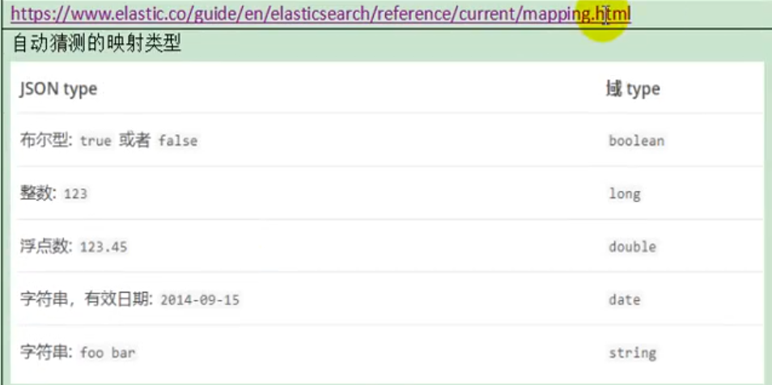
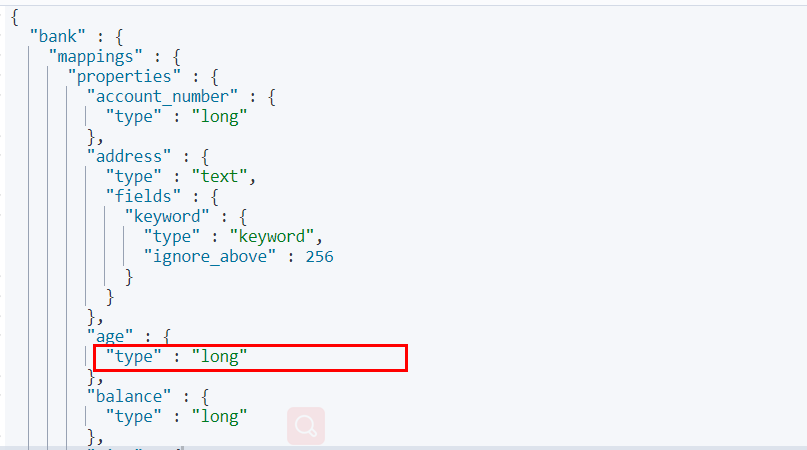
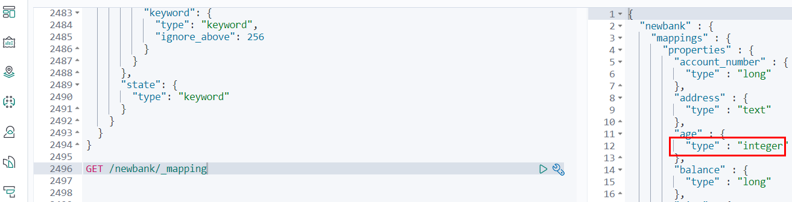

# 5. Mapping(映射)

## 5.1 字段类型


## 5.2 映射

Mapping(映射)
Maping是用来定义一个文档（document），以及它所包含的属性（field）是如何存储和索引的。比如：使用maping来定义：

* 哪些字符串属性应该被看做全文本属性（full text fields）；

* 哪些属性包含数字，日期或地理位置；

* 文档中的所有属性是否都嫩被索引（all 配置）；

* 日期的格式；

* 自定义映射规则来执行动态添加属性；

* 查看mapping信息


### GET bank/_mapping

```json
  {
    "bank" : {
      "mappings" : {
        "properties" : {
          "account_number" : {
            "type" : "long"
          },
          "address" : {
            "type" : "text",
            "fields" : {
              "keyword" : {
                "type" : "keyword",
                "ignore_above" : 256
              }
            }
          },
          "age" : {
            "type" : "long"
          },
          "balance" : {
            "type" : "long"
          },
          "city" : {
            "type" : "text",
            "fields" : {
              "keyword" : {
                "type" : "keyword",
                "ignore_above" : 256
              }
            }
          },
          "email" : {
            "type" : "text",
            "fields" : {
              "keyword" : {
                "type" : "keyword",
                "ignore_above" : 256
              }
            }
          },
          "employer" : {
            "type" : "text",
            "fields" : {
              "keyword" : {
                "type" : "keyword",
                "ignore_above" : 256
              }
            }
          },
          "firstname" : {
            "type" : "text",
            "fields" : {
              "keyword" : {
                "type" : "keyword",
                "ignore_above" : 256
              }
            }
          },
          "gender" : {
            "type" : "text",
            "fields" : {
              "keyword" : {
                "type" : "keyword",
                "ignore_above" : 256
              }
            }
          },
          "lastname" : {
            "type" : "text",
            "fields" : {
              "keyword" : {
                "type" : "keyword",
                "ignore_above" : 256
              }
            }
          },
          "state" : {
            "type" : "text",
            "fields" : {
              "keyword" : {
                "type" : "keyword",
                "ignore_above" : 256
              }
            }
          }
        }
      }
    }
  }

```

* 修改mapping信息



## 5.3 新版本改变

ElasticSearch7-去掉type概念

1. 关系型数据库中两个数据表示是独立的，即使他们里面有相同名称的列也不影响使用，但ES中不是这样的。elasticsearch是基于Lucene开发的搜索引擎，而ES中不同type下名称相同的filed最终在Lucene中的处理方式是一样的。

   - 两个不同type下的两个user_name，在ES同一个索引下其实被认为是同一个filed，你必须在两个不同的type中定义相同的filed映射。否则，不同type中的相同字段名称就会在处理中出现冲突的情况，导致Lucene处理效率下降。
   - 去掉type就是为了提高ES处理数据的效率。

2. Elasticsearch 7.x URL中的type参数为可选。比如，索引一个文档不再要求提供文档类型。

3. Elasticsearch 8.x 不再支持URL中的type参数。

4. 解决：
   将索引从多类型迁移到单类型，每种类型文档一个独立索引

   将已存在的索引下的类型数据，全部迁移到指定位置即可。详见数据迁移


>
>
>**Elasticsearch 7.x**
>
>- Specifying types in requests is deprecated. For instance, indexing a document no longer requires a document `type`. The new index APIs are `PUT {index}/_doc/{id}` in case of explicit ids and `POST {index}/_doc` for auto-generated ids. Note that in 7.0, `_doc` is a permanent part of the path, and represents the endpoint name rather than the document type.
>- The `include_type_name` parameter in the index creation, index template, and mapping APIs will default to `false`. Setting the parameter at all will result in a deprecation warning.
>- The `_default_` mapping type is removed.
>
>**Elasticsearch 8.x**
>
>- Specifying types in requests is no longer supported.
>- The `include_type_name` parameter is removed.


## 5.4 创建映射

### 5.4.1 创建索引并指定映射

```json
PUT /my_index
{
  "mappings": {
    "properties": {
      "age": {
        "type": "integer"
      },
      "email": {
        "type": "keyword"
      },
      "name": {
        "type": "text"
      }
    }
  }
}
```

 输出：

```json
{
  "acknowledged" : true,
  "shards_acknowledged" : true,
  "index" : "my_index"
}

```


### 5.4.2 查看映射

```sh
GET /my_index

# 查看某一个字段的映射
GET /my_index/_mapping/field/employee-id

```

#### 输出结果：

```json
{
  "my_index" : {
    "aliases" : { },
    "mappings" : {
      "properties" : {
        "age" : {
          "type" : "integer"
        },
        "email" : {
          "type" : "keyword"
        },
        "employee-id" : {
          "type" : "keyword",
          "index" : false
        },
        "name" : {
          "type" : "text"
        }
      }
    },
    "settings" : {
      "index" : {
        "creation_date" : "1588410780774",
        "number_of_shards" : "1",
        "number_of_replicas" : "1",
        "uuid" : "ua0lXhtkQCOmn7Kh3iUu0w",
        "version" : {
          "created" : "7060299"
        },
        "provided_name" : "my_index"
      }
    }
  }
}
```


### 5.4.3 添加新的字段映射

```json
PUT /my_index/_mapping
{
  "properties": {
    "employee-id": {
      "type": "keyword",
      "index": false
    }
  }
}

# 这里的 "index": false，表明新增的字段不能被检索。默认是true
# https://www.elastic.co/guide/en/elasticsearch/reference/7.x/mapping-index.html
```

这里的 "index": false，表明新增的字段不能被检索，只是一个冗余字段。


## 5.5 更新映射

对于已经存在的字段映射，我们不能更新。更新必须创建新的索引，进行数据迁移。

## 5.6 数据迁移

先创建new_twitter的正确映射。然后使用如下方式进行数据迁移。


### 无type数据迁移
```json
POST reindex [固定写法]
{
  "source":{
      "index":"twitter"
   },
  "dest":{
      "index":"new_twitters"
   }
}
```


### 有type数据迁移

将旧索引的type下的数据进行迁移

```json
POST reindex [固定写法]
{
  "source":{
      "index":"twitter",
      "twitter":"twitter"
   },
  "dest":{
      "index":"new_twitters"
   }
}
```

更多详情见： https://www.elastic.co/guide/en/elasticsearch/reference/7.6/docs-reindex.html 


## 5.7 数据迁移实例
对于我们的测试数据,是包含 type 的索引 bank。

现在我们创建新的索引 **newbank** 并修改一些字段的类型来演示当需要更新映射时的数据迁移操作。


### 5.7.1 查看索引 bank 当前字段映射类型

#### GET /bank/_mapping

```json
{
  "bank" : {
    "mappings" : {
      "properties" : {
        "account_number" : {
          "type" : "long"
        },
        "address" : {
          "type" : "text",
          "fields" : {
            "keyword" : {
              "type" : "keyword",
              "ignore_above" : 256
            }
          }
        },
        "age" : {
          "type" : "long"
        },
        "balance" : {
          "type" : "long"
        },
        "city" : {
          "type" : "text",
          "fields" : {
            "keyword" : {
              "type" : "keyword",
              "ignore_above" : 256
            }
          }
        },
        "email" : {
          "type" : "text",
          "fields" : {
            "keyword" : {
              "type" : "keyword",
              "ignore_above" : 256
            }
          }
        },
        "employer" : {
          "type" : "text",
          "fields" : {
            "keyword" : {
              "type" : "keyword",
              "ignore_above" : 256
            }
          }
        },
        "firstname" : {
          "type" : "text",
          "fields" : {
            "keyword" : {
              "type" : "keyword",
              "ignore_above" : 256
            }
          }
        },
        "gender" : {
          "type" : "text",
          "fields" : {
            "keyword" : {
              "type" : "keyword",
              "ignore_above" : 256
            }
          }
        },
        "lastname" : {
          "type" : "text",
          "fields" : {
            "keyword" : {
              "type" : "keyword",
              "ignore_above" : 256
            }
          }
        },
        "state" : {
          "type" : "text",
          "fields" : {
            "keyword" : {
              "type" : "keyword",
              "ignore_above" : 256
            }
          }
        }
      }
    }
  }
}

```


```
GET /bank/_search
```



### 5.7.2 将年龄修改为integer

```json
PUT /newbank
{
  "mappings": {
    "properties": {
      "account_number": {
        "type": "long"
      },
      "address": {
        "type": "text"
      },
      "age": {
        "type": "integer"
      },
      "balance": {
        "type": "long"
      },
      "city": {
        "type": "keyword"
      },
      "email": {
        "type": "keyword"
      },
      "employer": {
        "type": "keyword"
      },
      "firstname": {
        "type": "text"
      },
      "gender": {
        "type": "keyword"
      },
      "lastname": {
        "type": "text",
        "fields": {
          "keyword": {
            "type": "keyword",
            "ignore_above": 256
          }
        }
      },
      "state": {
        "type": "keyword"
      }
    }
  }
}
```

### 5.7.3 查看“newbank”的映射：

GET /newbank/_mapping



能够看到age的映射类型被修改为了integer.


将bank中的数据迁移到newbank中

```json
POST _reindex
{
  "source": {
    "index": "bank",
    "type": "account"
  },
  "dest": {
    "index": "newbank"
  }
}
```

运行输出：

```json
#! Deprecation: [types removal] Specifying types in reindex requests is deprecated.
{
  "took" : 768,
  "timed_out" : false,
  "total" : 1000,
  "updated" : 0,
  "created" : 1000,
  "deleted" : 0,
  "batches" : 1,
  "version_conflicts" : 0,
  "noops" : 0,
  "retries" : {
    "bulk" : 0,
    "search" : 0
  },
  "throttled_millis" : 0,
  "requests_per_second" : -1.0,
  "throttled_until_millis" : 0,
  "failures" : [ ]
}
```


### 5.7.4 查看newbank中的数据


