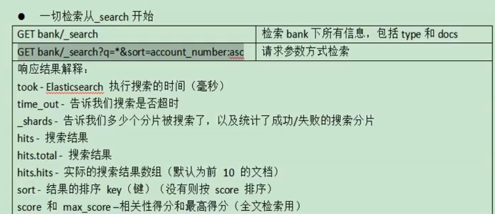
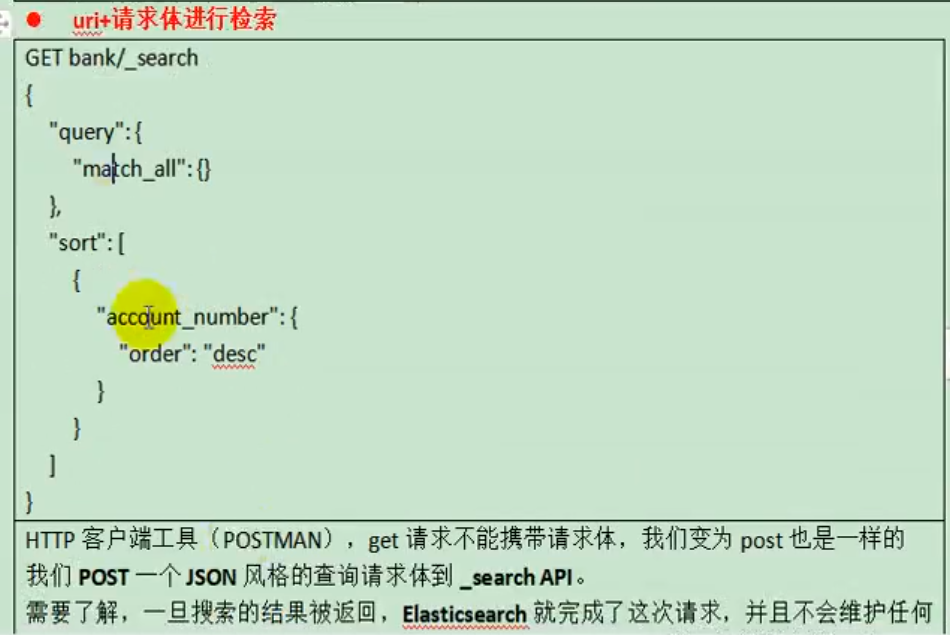
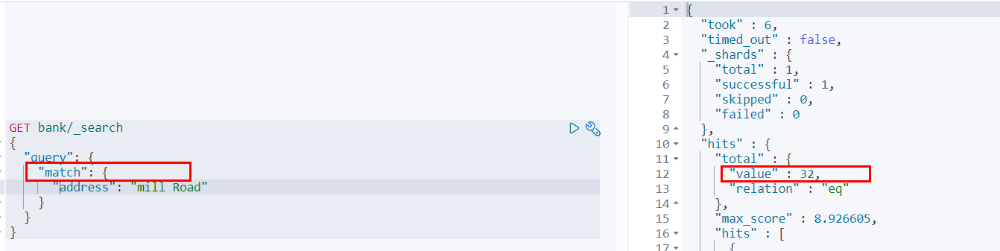
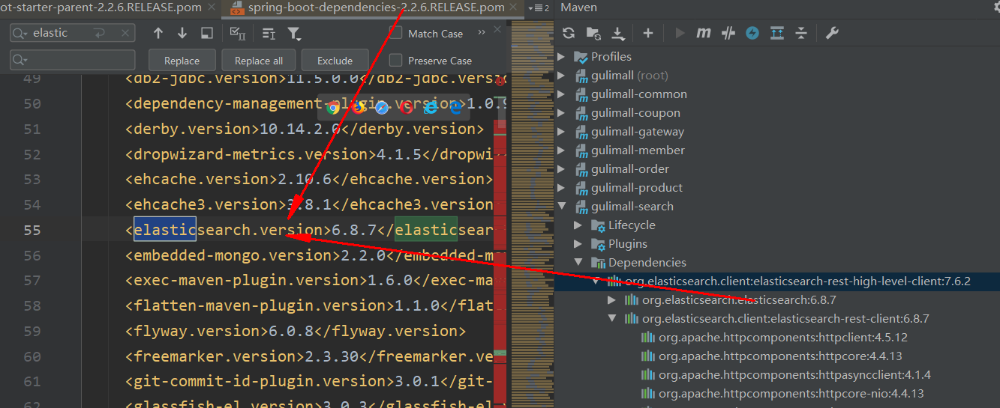
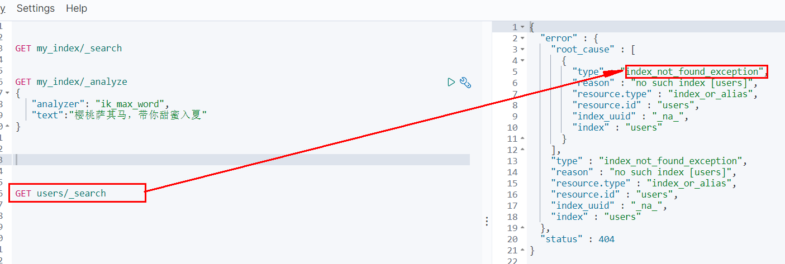
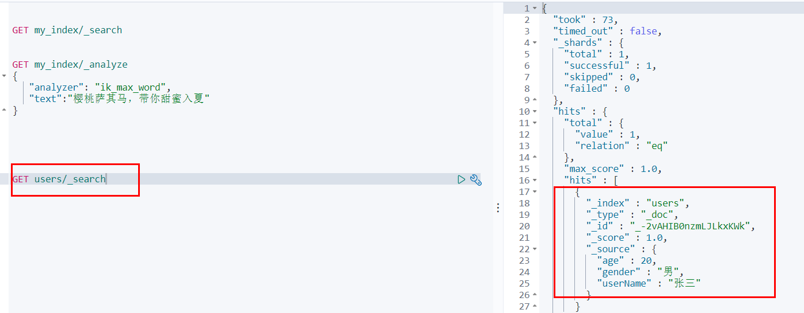

# 4. Elasticsearch-检索进阶

本节参考官方文档 检索示例：导入样本测试数据准备一份顾客银行账户信息的虚构的JSON文档样本。每个文档都有下列的 schema（模式）。

```json
{
    "account_number": 1,
    "balance": 39225,
    "firstname": "Amber",
    "lastname": "Duke",
    "age": 32,
    "gender": "M",
    "address": "880 Holmes Lane",
    "employer": "Pyrami",
    "email": "amberduke@pyrami.com",
    "city": "Brogan",
    "state": "IL"
}
```

[https://raw.githubusercontent.com/elastic/elasticsearch/master/docs/src/test/resources/accounts.json]

访问失败可请求：<a herf='./account-f.md'> account-f.md</a>

导入测试数据。

`POST bank/account/_bulk`

## 4.1 search Api

下面的请求都是在Kibana dev-tools 操作

### 4.1.1 请求接口GET/bank/_search

#### 通过REST request body 来发送它们（uri+请求体）
```json
GET /bank/_search
{
  "query": {
    "match_all": {}
  },
  "sort": [
    {
      "account_number": "asc"
    }
  ]
}

// query 查询条件
// sort 排序条件结果
```

#### 返回结果：
```json
{
  "took" : 7,
  "timed_out" : false,
  "_shards" : {
    "total" : 1,
    "successful" : 1,
    "skipped" : 0,
    "failed" : 0
  },
  "hits" : {
    "total" : {
      "value" : 1000,
      "relation" : "eq"
    },
    "max_score" : null,
    "hits" : [
      {
        "_index" : "bank",
        "_type" : "account",
        "_id" : "0",
        "_score" : null,
        "_source" : {
          "account_number" : 0,
          "balance" : 16623,
          "firstname" : "Bradshaw",
          "lastname" : "Mckenzie",
          "age" : 29,
          "gender" : "F",
          "address" : "244 Columbus Place",
          "employer" : "Euron",
          "email" : "bradshawmckenzie@euron.com",
          "city" : "Hobucken",
          "state" : "CO"
        },
        "sort" : [
          0
        ]
      },
      ...
    ]
  }
}
```

### 4.1.2 响应字段解释

`took` – how long it took Elasticsearch to run the query, in milliseconds

`timed_out` – whether or not the search request timed out

`_shards` – how many shards were searched and a breakdown of how many shards succeeded, failed, or were skipped.

`max_score` – the score of the most relevant document found

`hits.total.value` - how many matching documents were found

`hits.sort` - the document’s sort position (when not sorting by relevance score)

`hits._score` - the document’s relevance score (not applicable when using match_all)

### 4.1.3 响应结果说明

Elasticsearch 默认会分页返回10条数据，不会一下返回所有数据。


### 4.1.4 请求方式说明  

:::tip ES支持两种基本方式检索:   
- 通过REST request uri 发送搜索参数 （uri +检索参数）；
- 通过REST request body 来发送它们（uri+请求体）；
:::

也就是说除了上面示例的请求接口，根据请求体进行检索外；

还可以用GET请求参数的方式检索：


#### 通过REST request uri 发送搜索参数 （uri +检索参数）；
```json
GET bank/_search?q=*&sort=account_number:asc
// q=* 查询所有
// sort=account_number:asc 按照account_number进行升序排列
```







## 4.2 Query DSL

### 4.2.1 基本语法格式

Elasticsearch提供了一个可以执行查询的Json风格的DSL。这个被称为Query DSL，该查询语言非常全面。

<a herf='https://www.elastic.co/guide/en/elasticsearch/reference/current/query-dsl.html'>Query DSL</a>

#### 一个查询语句的典型结构

```json
QUERY_NAME:{
   ARGUMENT:VALUE,
   ARGUMENT:VALUE,...
}
```


#### 如果针对于某个字段，那么它的结构如下：

```json
{
  QUERY_NAME:{
     FIELD_NAME:{
       ARGUMENT:VALUE,
       ARGUMENT:VALUE,...
      }   
   }
}
```

```json
GET /bank/_search
{
  "query": {
    "match_all": {}
  },
  "sort": [
    {
      "account_number": "asc"
    }
  ]
}
```


#### 示例
```json
GET bank/_search
{
  "query": {
    "match_all": {}
  },
  "from": 0,
  "size": 5,
  "sort": [
    {
      "account_number": {
        "order": "desc"
      }
    }
  ]
}
```


query定义如何查询；

- match_all查询类型【代表查询所有的所有】，es中可以在query中组合非常多的查询类型完成复杂查询；
- 除了query参数之外，我们可也传递其他的参数以改变查询结果，如sort，size；
- from+size限定，完成分页功能；
- sort排序，多字段排序，会在前序字段相等时后续字段内部排序，否则以前序为准；


### 4.2.2 返回部分字段

```json
GET bank/_search
{
  "query": {
    "match_all": {}
  },
  "from": 0,
  "size": 5,
  "sort": [
    {
      "account_number": {
        "order": "desc"
      }
    }
  ],
  "_source": ["balance","firstname"]
}

```

#### 查询结果：

```json
{
  "took" : 18,
  "timed_out" : false,
  "_shards" : {
    "total" : 1,
    "successful" : 1,
    "skipped" : 0,
    "failed" : 0
  },
  "hits" : {
    "total" : {
      "value" : 1000,
      "relation" : "eq"
    },
    "max_score" : null,
    "hits" : [
      {
        "_index" : "bank",
        "_type" : "account",
        "_id" : "999",
        "_score" : null,
        "_source" : {
          "firstname" : "Dorothy",
          "balance" : 6087
        },
        "sort" : [
          999
        ]
      },
      {
        "_index" : "bank",
        "_type" : "account",
        "_id" : "998",
        "_score" : null,
        "_source" : {
          "firstname" : "Letha",
          "balance" : 16869
        },
        "sort" : [
          998
        ]
      },
      {
        "_index" : "bank",
        "_type" : "account",
        "_id" : "997",
        "_score" : null,
        "_source" : {
          "firstname" : "Combs",
          "balance" : 25311
        },
        "sort" : [
          997
        ]
      },
      {
        "_index" : "bank",
        "_type" : "account",
        "_id" : "996",
        "_score" : null,
        "_source" : {
          "firstname" : "Andrews",
          "balance" : 17541
        },
        "sort" : [
          996
        ]
      },
      {
        "_index" : "bank",
        "_type" : "account",
        "_id" : "995",
        "_score" : null,
        "_source" : {
          "firstname" : "Phelps",
          "balance" : 21153
        },
        "sort" : [
          995
        ]
      }
    ]
  }
}

```


### 4.2.3 match匹配查询

#### * 基本类型（非字符串），精确控制

```json
GET bank/_search
{
  "query": {
    "match": {
      "account_number": "20"
    }
  }
}

```

match返回account_number=20的数据。

#### 查询结果：

```json
{
  "took" : 1,
  "timed_out" : false,
  "_shards" : {
    "total" : 1,
    "successful" : 1,
    "skipped" : 0,
    "failed" : 0
  },
  "hits" : {
    "total" : {
      "value" : 1,
      "relation" : "eq"
    },
    "max_score" : 1.0,
    "hits" : [
      {
        "_index" : "bank",
        "_type" : "account",
        "_id" : "20",
        "_score" : 1.0,
        "_source" : {
          "account_number" : 20,
          "balance" : 16418,
          "firstname" : "Elinor",
          "lastname" : "Ratliff",
          "age" : 36,
          "gender" : "M",
          "address" : "282 Kings Place",
          "employer" : "Scentric",
          "email" : "elinorratliff@scentric.com",
          "city" : "Ribera",
          "state" : "WA"
        }
      }
    ]
  }
}

```

#### * 字符串，全文检索

```json
GET bank/_search
{
  "query": {
    "match": {
      "address": "kings"
    }
  }
}
```

全文检索，最终会按照评分进行排序，会对检索条件进行分词匹配。

查询结果：

```json
{
  "took" : 30,
  "timed_out" : false,
  "_shards" : {
    "total" : 1,
    "successful" : 1,
    "skipped" : 0,
    "failed" : 0
  },
  "hits" : {
    "total" : {
      "value" : 2,
      "relation" : "eq"
    },
    "max_score" : 5.990829,
    "hits" : [
      {
        "_index" : "bank",
        "_type" : "account",
        "_id" : "20",
        "_score" : 5.990829,
        "_source" : {
          "account_number" : 20,
          "balance" : 16418,
          "firstname" : "Elinor",
          "lastname" : "Ratliff",
          "age" : 36,
          "gender" : "M",
          "address" : "282 Kings Place",
          "employer" : "Scentric",
          "email" : "elinorratliff@scentric.com",
          "city" : "Ribera",
          "state" : "WA"
        }
      },
      {
        "_index" : "bank",
        "_type" : "account",
        "_id" : "722",
        "_score" : 5.990829,
        "_source" : {
          "account_number" : 722,
          "balance" : 27256,
          "firstname" : "Roberts",
          "lastname" : "Beasley",
          "age" : 34,
          "gender" : "F",
          "address" : "305 Kings Hwy",
          "employer" : "Quintity",
          "email" : "robertsbeasley@quintity.com",
          "city" : "Hayden",
          "state" : "PA"
        }
      }
    ]
  }
}

```


### 4.2.4  match_phrase [短句匹配] 

将需要匹配的值当成一整个单词（不分词）进行检索

```json
GET bank/_search
{
  "query": {
    "match_phrase": {
      "address": "mill road"
    }
  }
}
```

查处address中包含mill_road的所有记录，并给出相关性得分

查看结果：

```json
{
  "took" : 32,
  "timed_out" : false,
  "_shards" : {
    "total" : 1,
    "successful" : 1,
    "skipped" : 0,
    "failed" : 0
  },
  "hits" : {
    "total" : {
      "value" : 1,
      "relation" : "eq"
    },
    "max_score" : 8.926605,
    "hits" : [
      {
        "_index" : "bank",
        "_type" : "account",
        "_id" : "970",
        "_score" : 8.926605,
        "_source" : {
          "account_number" : 970,
          "balance" : 19648,
          "firstname" : "Forbes",
          "lastname" : "Wallace",
          "age" : 28,
          "gender" : "M",
          "address" : "990 Mill Road",
          "employer" : "Pheast",
          "email" : "forbeswallace@pheast.com",
          "city" : "Lopezo",
          "state" : "AK"
        }
      }
    ]
  }
}

```


#### match_phrase和Match的区别，观察如下实例：

```json
GET bank/_search
{
  "query": {
    "match_phrase": {
      "address": "990 Mill"
    }
  }
}
```

查询结果：

```json
{
  "took" : 0,
  "timed_out" : false,
  "_shards" : {
    "total" : 1,
    "successful" : 1,
    "skipped" : 0,
    "failed" : 0
  },
  "hits" : {
    "total" : {
      "value" : 1,
      "relation" : "eq"
    },
    "max_score" : 10.806405,
    "hits" : [
      {
        "_index" : "bank",
        "_type" : "account",
        "_id" : "970",
        "_score" : 10.806405,
        "_source" : {
          "account_number" : 970,
          "balance" : 19648,
          "firstname" : "Forbes",
          "lastname" : "Wallace",
          "age" : 28,
          "gender" : "M",
          "address" : "990 Mill Road",
          "employer" : "Pheast",
          "email" : "forbeswallace@pheast.com",
          "city" : "Lopezo",
          "state" : "AK"
        }
      }
    ]
  }
}

```


#### 使用match的keyword

```json
GET bank/_search
{
  "query": {
    "match": {
      "address.keyword": "990 Mill"
    }
  }
}
```

查询结果，一条也未匹配到

```json
{
  "took" : 0,
  "timed_out" : false,
  "_shards" : {
    "total" : 1,
    "successful" : 1,
    "skipped" : 0,
    "failed" : 0
  },
  "hits" : {
    "total" : {
      "value" : 0,
      "relation" : "eq"
    },
    "max_score" : null,
    "hits" : [ ]
  }
}

```


修改匹配条件为“990 Mill Road”

```json
GET bank/_search
{
  "query": {
    "match": {
      "address.keyword": "990 Mill Road"
    }
  }
}
```

查询出一条数据

```json
{
  "took" : 1,
  "timed_out" : false,
  "_shards" : {
    "total" : 1,
    "successful" : 1,
    "skipped" : 0,
    "failed" : 0
  },
  "hits" : {
    "total" : {
      "value" : 1,
      "relation" : "eq"
    },
    "max_score" : 6.5032897,
    "hits" : [
      {
        "_index" : "bank",
        "_type" : "account",
        "_id" : "970",
        "_score" : 6.5032897,
        "_source" : {
          "account_number" : 970,
          "balance" : 19648,
          "firstname" : "Forbes",
          "lastname" : "Wallace",
          "age" : 28,
          "gender" : "M",
          "address" : "990 Mill Road",
          "employer" : "Pheast",
          "email" : "forbeswallace@pheast.com",
          "city" : "Lopezo",
          "state" : "AK"
        }
      }
    ]
  }
}

```


文本字段的匹配，使用**keyword**，匹配的条件就是要显示字段的全部值，要进行**精确匹配的**。

**match_phrase是做短语匹配，只要文本中包含匹配条件，就能匹配到**。


### 4.2.5 multi_math【多字段匹配】

```json
GET bank/_search
{
  "query": {
    "multi_match": {
      "query": "mill",
      "fields": [
        "state",
        "address"
      ]
    }
  }
}
```

**state或者address中包含mill，并且在查询过程中，会对于查询条件进行分词**。

#### 查询结果：

```json
{
  "took" : 28,
  "timed_out" : false,
  "_shards" : {
    "total" : 1,
    "successful" : 1,
    "skipped" : 0,
    "failed" : 0
  },
  "hits" : {
    "total" : {
      "value" : 4,
      "relation" : "eq"
    },
    "max_score" : 5.4032025,
    "hits" : [
      {
        "_index" : "bank",
        "_type" : "account",
        "_id" : "970",
        "_score" : 5.4032025,
        "_source" : {
          "account_number" : 970,
          "balance" : 19648,
          "firstname" : "Forbes",
          "lastname" : "Wallace",
          "age" : 28,
          "gender" : "M",
          "address" : "990 Mill Road",
          "employer" : "Pheast",
          "email" : "forbeswallace@pheast.com",
          "city" : "Lopezo",
          "state" : "AK"
        }
      },
      {
        "_index" : "bank",
        "_type" : "account",
        "_id" : "136",
        "_score" : 5.4032025,
        "_source" : {
          "account_number" : 136,
          "balance" : 45801,
          "firstname" : "Winnie",
          "lastname" : "Holland",
          "age" : 38,
          "gender" : "M",
          "address" : "198 Mill Lane",
          "employer" : "Neteria",
          "email" : "winnieholland@neteria.com",
          "city" : "Urie",
          "state" : "IL"
        }
      },
      {
        "_index" : "bank",
        "_type" : "account",
        "_id" : "345",
        "_score" : 5.4032025,
        "_source" : {
          "account_number" : 345,
          "balance" : 9812,
          "firstname" : "Parker",
          "lastname" : "Hines",
          "age" : 38,
          "gender" : "M",
          "address" : "715 Mill Avenue",
          "employer" : "Baluba",
          "email" : "parkerhines@baluba.com",
          "city" : "Blackgum",
          "state" : "KY"
        }
      },
      {
        "_index" : "bank",
        "_type" : "account",
        "_id" : "472",
        "_score" : 5.4032025,
        "_source" : {
          "account_number" : 472,
          "balance" : 25571,
          "firstname" : "Lee",
          "lastname" : "Long",
          "age" : 32,
          "gender" : "F",
          "address" : "288 Mill Street",
          "employer" : "Comverges",
          "email" : "leelong@comverges.com",
          "city" : "Movico",
          "state" : "MT"
        }
      }
    ]
  }
}

```


### 4.2.6 bool用来做复合查询

复合语句可以合并，任何其他查询语句，包括符合语句。这也就意味着，复合语句之间可以互相嵌套，可以表达非常复杂的逻辑。

**must**：必须达到must所列举的所有条件

```json
GET bank/_search
{
   "query":{
        "bool":{
             "must":[
              {"match":{"address":"mill"}},
              {"match":{"gender":"M"}}
             ]
         }
    }
}
```

**must_not**，必须不匹配must_not所列举的所有条件。

**should**，应该满足should所列举的条件。


#### 实例：查询gender=m，并且address=mill的数据

```json
GET bank/_search
{
  "query": {
    "bool": {
      "must": [
        {
          "match": {
            "gender": "M"
          }
        },
        {
          "match": {
            "address": "mill"
          }
        }
      ]
    }
  }
}
```

查询结果：

```json
{
  "took" : 1,
  "timed_out" : false,
  "_shards" : {
    "total" : 1,
    "successful" : 1,
    "skipped" : 0,
    "failed" : 0
  },
  "hits" : {
    "total" : {
      "value" : 3,
      "relation" : "eq"
    },
    "max_score" : 6.0824604,
    "hits" : [
      {
        "_index" : "bank",
        "_type" : "account",
        "_id" : "970",
        "_score" : 6.0824604,
        "_source" : {
          "account_number" : 970,
          "balance" : 19648,
          "firstname" : "Forbes",
          "lastname" : "Wallace",
          "age" : 28,
          "gender" : "M",
          "address" : "990 Mill Road",
          "employer" : "Pheast",
          "email" : "forbeswallace@pheast.com",
          "city" : "Lopezo",
          "state" : "AK"
        }
      },
      {
        "_index" : "bank",
        "_type" : "account",
        "_id" : "136",
        "_score" : 6.0824604,
        "_source" : {
          "account_number" : 136,
          "balance" : 45801,
          "firstname" : "Winnie",
          "lastname" : "Holland",
          "age" : 38,
          "gender" : "M",
          "address" : "198 Mill Lane",
          "employer" : "Neteria",
          "email" : "winnieholland@neteria.com",
          "city" : "Urie",
          "state" : "IL"
        }
      },
      {
        "_index" : "bank",
        "_type" : "account",
        "_id" : "345",
        "_score" : 6.0824604,
        "_source" : {
          "account_number" : 345,
          "balance" : 9812,
          "firstname" : "Parker",
          "lastname" : "Hines",
          "age" : 38,
          "gender" : "M",
          "address" : "715 Mill Avenue",
          "employer" : "Baluba",
          "email" : "parkerhines@baluba.com",
          "city" : "Blackgum",
          "state" : "KY"
        }
      }
    ]
  }
}

```


**must_not：必须不是指定的情况**

实例：查询gender=m，并且address=mill的数据，但是age不等于38的

```json
GET bank/_search
{
  "query": {
    "bool": {
      "must": [
        {
          "match": {
            "gender": "M"
          }
        },
        {
          "match": {
            "address": "mill"
          }
        }
      ],
      "must_not": [
        {
          "match": {
            "age": "38"
          }
        }
      ]
    }
  }

```

#### 查询结果：

```json
{
  "took" : 4,
  "timed_out" : false,
  "_shards" : {
    "total" : 1,
    "successful" : 1,
    "skipped" : 0,
    "failed" : 0
  },
  "hits" : {
    "total" : {
      "value" : 1,
      "relation" : "eq"
    },
    "max_score" : 6.0824604,
    "hits" : [
      {
        "_index" : "bank",
        "_type" : "account",
        "_id" : "970",
        "_score" : 6.0824604,
        "_source" : {
          "account_number" : 970,
          "balance" : 19648,
          "firstname" : "Forbes",
          "lastname" : "Wallace",
          "age" : 28,
          "gender" : "M",
          "address" : "990 Mill Road",
          "employer" : "Pheast",
          "email" : "forbeswallace@pheast.com",
          "city" : "Lopezo",
          "state" : "AK"
        }
      }
    ]
  }
}

```


**should**：应该达到should列举的条件，如果到达会增加相关文档的评分，并不会改变查询的结果。

如果query中只有should且只有一种匹配规则，那么should的条件就会被作为默认匹配条件二区改变查询结果。

#### 实例：匹配lastName应该等于Wallace的数据

```json
GET bank/_search
{
  "query": {
    "bool": {
      "must": [
        {
          "match": {
            "gender": "M"
          }
        },
        {
          "match": {
            "address": "mill"
          }
        }
      ],
      "must_not": [
        {
          "match": {
            "age": "18"
          }
        }
      ],
      "should": [
        {
          "match": {
            "lastname": "Wallace"
          }
        }
      ]
    }
  }
}
```


#### 查询结果：

```json
{
  "took" : 5,
  "timed_out" : false,
  "_shards" : {
    "total" : 1,
    "successful" : 1,
    "skipped" : 0,
    "failed" : 0
  },
  "hits" : {
    "total" : {
      "value" : 3,
      "relation" : "eq"
    },
    "max_score" : 12.585751,
    "hits" : [
      {
        "_index" : "bank",
        "_type" : "account",
        "_id" : "970",
        "_score" : 12.585751,
        "_source" : {
          "account_number" : 970,
          "balance" : 19648,
          "firstname" : "Forbes",
          "lastname" : "Wallace",
          "age" : 28,
          "gender" : "M",
          "address" : "990 Mill Road",
          "employer" : "Pheast",
          "email" : "forbeswallace@pheast.com",
          "city" : "Lopezo",
          "state" : "AK"
        }
      },
      {
        "_index" : "bank",
        "_type" : "account",
        "_id" : "136",
        "_score" : 6.0824604,
        "_source" : {
          "account_number" : 136,
          "balance" : 45801,
          "firstname" : "Winnie",
          "lastname" : "Holland",
          "age" : 38,
          "gender" : "M",
          "address" : "198 Mill Lane",
          "employer" : "Neteria",
          "email" : "winnieholland@neteria.com",
          "city" : "Urie",
          "state" : "IL"
        }
      },
      {
        "_index" : "bank",
        "_type" : "account",
        "_id" : "345",
        "_score" : 6.0824604,
        "_source" : {
          "account_number" : 345,
          "balance" : 9812,
          "firstname" : "Parker",
          "lastname" : "Hines",
          "age" : 38,
          "gender" : "M",
          "address" : "715 Mill Avenue",
          "employer" : "Baluba",
          "email" : "parkerhines@baluba.com",
          "city" : "Blackgum",
          "state" : "KY"
        }
      }
    ]
  }
}

```

能够看到相关度越高，得分也越高。

### 4.2.7 Filter【结果过滤】

并不是所有的查询都需要产生分数，特别是哪些仅用于filtering过滤的文档。为了不计算分数，elasticsearch会自动检查场景并且优化查询的执行。

```json
GET bank/_search
{
  "query": {
    "bool": {
      "must": [
        {
          "match": {
            "address": "mill"
          }
        }
      ],
      "filter": {
        "range": {
          "balance": {
            "gte": "10000",
            "lte": "20000"
          }
        }
      }
    }
  }
}

```

这里先是查询所有匹配address=mill的文档，然后再根据10000<=balance<=20000进行过滤查询结果

#### 查询结果：

```json
{
  "took" : 2,
  "timed_out" : false,
  "_shards" : {
    "total" : 1,
    "successful" : 1,
    "skipped" : 0,
    "failed" : 0
  },
  "hits" : {
    "total" : {
      "value" : 1,
      "relation" : "eq"
    },
    "max_score" : 5.4032025,
    "hits" : [
      {
        "_index" : "bank",
        "_type" : "account",
        "_id" : "970",
        "_score" : 5.4032025,
        "_source" : {
          "account_number" : 970,
          "balance" : 19648,
          "firstname" : "Forbes",
          "lastname" : "Wallace",
          "age" : 28,
          "gender" : "M",
          "address" : "990 Mill Road",
          "employer" : "Pheast",
          "email" : "forbeswallace@pheast.com",
          "city" : "Lopezo",
          "state" : "AK"
        }
      }
    ]
  }
}

```


Each `must`, `should`, and `must_not` element in a Boolean query is referred to as a query clause. How well a document meets the criteria in each `must` or `should` clause contributes to the document’s *relevance score*. The higher the score, the better the document matches your search criteria. By default, Elasticsearch returns documents ranked by these relevance scores.

 在boolean查询中，`must`, `should` 和`must_not` 元素都被称为查询子句 。 文档是否符合每个“must”或“should”子句中的标准，决定了文档的“相关性得分”。  得分越高，文档越符合您的搜索条件。  默认情况下，Elasticsearch返回根据这些相关性得分排序的文档。 

The criteria in a `must_not` clause is treated as a *filter*. It affects whether or not the document is included in the results, but does not contribute to how documents are scored. You can also explicitly specify arbitrary filters to include or exclude documents based on structured data.

`“must_not”子句中的条件被视为“过滤器”。` 它影响文档是否包含在结果中，  但不影响文档的评分方式。  还可以显式地指定任意过滤器来包含或排除基于结构化数据的文档。 


#### filter在使用过程中，并不会计算相关性得分：

```json
GET bank/_search
{
  "query": {
    "bool": {
      "must": [
        {
          "match": {
            "address": "mill"
          }
        }
      ],
      "filter": {
        "range": {
          "balance": {
            "gte": "10000",
            "lte": "20000"
          }
        }
      }
    }
  }
}
```

#### 查询结果：

```json
{
  "took" : 1,
  "timed_out" : false,
  "_shards" : {
    "total" : 1,
    "successful" : 1,
    "skipped" : 0,
    "failed" : 0
  },
  "hits" : {
    "total" : {
      "value" : 213,
      "relation" : "eq"
    },
    "max_score" : 0.0,
    "hits" : [
      {
        "_index" : "bank",
        "_type" : "account",
        "_id" : "20",
        "_score" : 0.0,
        "_source" : {
          "account_number" : 20,
          "balance" : 16418,
          "firstname" : "Elinor",
          "lastname" : "Ratliff",
          "age" : 36,
          "gender" : "M",
          "address" : "282 Kings Place",
          "employer" : "Scentric",
          "email" : "elinorratliff@scentric.com",
          "city" : "Ribera",
          "state" : "WA"
        }
      },
      {
        "_index" : "bank",
        "_type" : "account",
        "_id" : "37",
        "_score" : 0.0,
        "_source" : {
          "account_number" : 37,
          "balance" : 18612,
          "firstname" : "Mcgee",
          "lastname" : "Mooney",
          "age" : 39,
          "gender" : "M",
          "address" : "826 Fillmore Place",
          "employer" : "Reversus",
          "email" : "mcgeemooney@reversus.com",
          "city" : "Tooleville",
          "state" : "OK"
        }
      },
      {
        "_index" : "bank",
        "_type" : "account",
        "_id" : "51",
        "_score" : 0.0,
        "_source" : {
          "account_number" : 51,
          "balance" : 14097,
          "firstname" : "Burton",
          "lastname" : "Meyers",
          "age" : 31,
          "gender" : "F",
          "address" : "334 River Street",
          "employer" : "Bezal",
          "email" : "burtonmeyers@bezal.com",
          "city" : "Jacksonburg",
          "state" : "MO"
        }
      },
      {
        "_index" : "bank",
        "_type" : "account",
        "_id" : "56",
        "_score" : 0.0,
        "_source" : {
          "account_number" : 56,
          "balance" : 14992,
          "firstname" : "Josie",
          "lastname" : "Nelson",
          "age" : 32,
          "gender" : "M",
          "address" : "857 Tabor Court",
          "employer" : "Emtrac",
          "email" : "josienelson@emtrac.com",
          "city" : "Sunnyside",
          "state" : "UT"
        }
      },
      {
        "_index" : "bank",
        "_type" : "account",
        "_id" : "121",
        "_score" : 0.0,
        "_source" : {
          "account_number" : 121,
          "balance" : 19594,
          "firstname" : "Acevedo",
          "lastname" : "Dorsey",
          "age" : 32,
          "gender" : "M",
          "address" : "479 Nova Court",
          "employer" : "Netropic",
          "email" : "acevedodorsey@netropic.com",
          "city" : "Islandia",
          "state" : "CT"
        }
      },
      {
        "_index" : "bank",
        "_type" : "account",
        "_id" : "176",
        "_score" : 0.0,
        "_source" : {
          "account_number" : 176,
          "balance" : 18607,
          "firstname" : "Kemp",
          "lastname" : "Walters",
          "age" : 28,
          "gender" : "F",
          "address" : "906 Howard Avenue",
          "employer" : "Eyewax",
          "email" : "kempwalters@eyewax.com",
          "city" : "Why",
          "state" : "KY"
        }
      },
      {
        "_index" : "bank",
        "_type" : "account",
        "_id" : "183",
        "_score" : 0.0,
        "_source" : {
          "account_number" : 183,
          "balance" : 14223,
          "firstname" : "Hudson",
          "lastname" : "English",
          "age" : 26,
          "gender" : "F",
          "address" : "823 Herkimer Place",
          "employer" : "Xinware",
          "email" : "hudsonenglish@xinware.com",
          "city" : "Robbins",
          "state" : "ND"
        }
      },
      {
        "_index" : "bank",
        "_type" : "account",
        "_id" : "222",
        "_score" : 0.0,
        "_source" : {
          "account_number" : 222,
          "balance" : 14764,
          "firstname" : "Rachelle",
          "lastname" : "Rice",
          "age" : 36,
          "gender" : "M",
          "address" : "333 Narrows Avenue",
          "employer" : "Enaut",
          "email" : "rachellerice@enaut.com",
          "city" : "Wright",
          "state" : "AZ"
        }
      },
      {
        "_index" : "bank",
        "_type" : "account",
        "_id" : "227",
        "_score" : 0.0,
        "_source" : {
          "account_number" : 227,
          "balance" : 19780,
          "firstname" : "Coleman",
          "lastname" : "Berg",
          "age" : 22,
          "gender" : "M",
          "address" : "776 Little Street",
          "employer" : "Exoteric",
          "email" : "colemanberg@exoteric.com",
          "city" : "Eagleville",
          "state" : "WV"
        }
      },
      {
        "_index" : "bank",
        "_type" : "account",
        "_id" : "272",
        "_score" : 0.0,
        "_source" : {
          "account_number" : 272,
          "balance" : 19253,
          "firstname" : "Lilly",
          "lastname" : "Morgan",
          "age" : 25,
          "gender" : "F",
          "address" : "689 Fleet Street",
          "employer" : "Biolive",
          "email" : "lillymorgan@biolive.com",
          "city" : "Sunbury",
          "state" : "OH"
        }
      }
    ]
  }
}

```

**能看到所有文档的 "_score" : 0.0。**

### 4.2.8 term

和match一样。匹配某个属性的值。全文检索字段用match，**其他非text字段匹配用term**。

>Avoid using the `term` query for [`text`](https://www.elastic.co/guide/en/elasticsearch/reference/7.6/text.html) fields.
>
>避免对文本字段使用“term”查询
>
>By default, Elasticsearch changes the values of `text` fields as part of [analysis](). This can make finding exact matches for `text` field values difficult.
>
>默认情况下，Elasticsearch作为[analysis]()的一部分更改' text '字段的值。这使得为“text”字段值寻找精确匹配变得困难。 
>
>To search `text` field values, use the match.
>
>要搜索“text”字段值，请使用匹配。
>
>https://www.elastic.co/guide/en/elasticsearch/reference/7.6/query-dsl-term-query.html 

#### 使用term匹配查询

```json
GET bank/_search
{
  "query": {
    "term": {
      "address": "mill Road"
    }
  }
}
```

#### 查询结果：

```json
{
  "took" : 0,
  "timed_out" : false,
  "_shards" : {
    "total" : 1,
    "successful" : 1,
    "skipped" : 0,
    "failed" : 0
  },
  "hits" : {
    "total" : {
      "value" : 0,
      "relation" : "eq"
    },
    "max_score" : null,
    "hits" : [ ]
  }
}

```

一条也没有匹配到


而更换为match匹配时，能够匹配到32个文档



也就是说，**全文检索字段用match，其他非text字段匹配用term**。


### 4.2.9 Aggregation（执行聚合）

聚合提供了从数据中分组和提取数据的能力。最简单的聚合方法大致等于SQL Group by和SQL聚合函数。在elasticsearch中，执行搜索返回this（命中结果），并且同时返回聚合结果，把以响应中的所有hits（命中结果）分隔开的能力。这是非常强大且有效的，你可以执行查询和多个聚合，并且在一次使用中得到各自的（任何一个的）返回结果，使用一次简洁和简化的API啦避免网络往返。

"size":0

size:0不显示搜索数据
aggs：执行聚合。

#### 聚合语法如下：

```json
"aggs":{
    "aggs_name这次聚合的名字，方便展示在结果集中":{
        "AGG_TYPE聚合的类型(avg,term,terms)":{}
     }
}，
```


#### 搜索address中包含mill的所有人的年龄分布以及平均年龄，但不显示这些人的详情


```json
GET bank/_search
{
  "query": {
    "match": {
      "address": "Mill"
    }
  },
  "aggs": {
    "ageAgg": {
      "terms": {
        "field": "age",
        "size": 10
      }
    },
    "ageAvg": {
      "avg": {
        "field": "age"
      }
    },
    "balanceAvg": {
      "avg": {
        "field": "balance"
      }
    }
  },
  "size": 0
}
//ageAvg 年龄平均值
//balanceAvg 余额平均值
```

#### 查询结果：

```json
{
  "took" : 2,
  "timed_out" : false,
  "_shards" : {
    "total" : 1,
    "successful" : 1,
    "skipped" : 0,
    "failed" : 0
  },
  "hits" : {
    "total" : {
      "value" : 4,
      "relation" : "eq"
    },
    "max_score" : null,
    "hits" : [ ]
  },
  "aggregations" : {
    "ageAgg" : {
      "doc_count_error_upper_bound" : 0,
      "sum_other_doc_count" : 0,
      "buckets" : [
        {
          "key" : 38,
          "doc_count" : 2
        },
        {
          "key" : 28,
          "doc_count" : 1
        },
        {
          "key" : 32,
          "doc_count" : 1
        }
      ]
    },
    "ageAvg" : {
      "value" : 34.0
    },
    "balanceAvg" : {
      "value" : 25208.0
    }
  }
}

```


#### 复杂：按照年龄聚合，并且求这些年龄段的这些人的平均薪资

```json
GET bank/_search
{
  "query": {
    "match_all": {}
  },
  "aggs": {
    "ageAgg": {
      "terms": {
        "field": "age",
        "size": 100
      },
      "aggs": {
        "ageAvg": {
          "avg": {
            "field": "balance"
          }
        }
      }
    }
  },
  "size": 0
}
```

输出结果：

```json
{
  "took" : 49,
  "timed_out" : false,
  "_shards" : {
    "total" : 1,
    "successful" : 1,
    "skipped" : 0,
    "failed" : 0
  },
  "hits" : {
    "total" : {
      "value" : 1000,
      "relation" : "eq"
    },
    "max_score" : null,
    "hits" : [ ]
  },
  "aggregations" : {
    "ageAgg" : {
      "doc_count_error_upper_bound" : 0,
      "sum_other_doc_count" : 0,
      "buckets" : [
        {
          "key" : 31,
          "doc_count" : 61,
          "ageAvg" : {
            "value" : 28312.918032786885
          }
        },
        {
          "key" : 39,
          "doc_count" : 60,
          "ageAvg" : {
            "value" : 25269.583333333332
          }
        },
        {
          "key" : 26,
          "doc_count" : 59,
          "ageAvg" : {
            "value" : 23194.813559322032
          }
        },
        {
          "key" : 32,
          "doc_count" : 52,
          "ageAvg" : {
            "value" : 23951.346153846152
          }
        },
        {
          "key" : 35,
          "doc_count" : 52,
          "ageAvg" : {
            "value" : 22136.69230769231
          }
        },
        {
          "key" : 36,
          "doc_count" : 52,
          "ageAvg" : {
            "value" : 22174.71153846154
          }
        },
        {
          "key" : 22,
          "doc_count" : 51,
          "ageAvg" : {
            "value" : 24731.07843137255
          }
        },
        {
          "key" : 28,
          "doc_count" : 51,
          "ageAvg" : {
            "value" : 28273.882352941175
          }
        },
        {
          "key" : 33,
          "doc_count" : 50,
          "ageAvg" : {
            "value" : 25093.94
          }
        },
        {
          "key" : 34,
          "doc_count" : 49,
          "ageAvg" : {
            "value" : 26809.95918367347
          }
        },
        {
          "key" : 30,
          "doc_count" : 47,
          "ageAvg" : {
            "value" : 22841.106382978724
          }
        },
        {
          "key" : 21,
          "doc_count" : 46,
          "ageAvg" : {
            "value" : 26981.434782608696
          }
        },
        {
          "key" : 40,
          "doc_count" : 45,
          "ageAvg" : {
            "value" : 27183.17777777778
          }
        },
        {
          "key" : 20,
          "doc_count" : 44,
          "ageAvg" : {
            "value" : 27741.227272727272
          }
        },
        {
          "key" : 23,
          "doc_count" : 42,
          "ageAvg" : {
            "value" : 27314.214285714286
          }
        },
        {
          "key" : 24,
          "doc_count" : 42,
          "ageAvg" : {
            "value" : 28519.04761904762
          }
        },
        {
          "key" : 25,
          "doc_count" : 42,
          "ageAvg" : {
            "value" : 27445.214285714286
          }
        },
        {
          "key" : 37,
          "doc_count" : 42,
          "ageAvg" : {
            "value" : 27022.261904761905
          }
        },
        {
          "key" : 27,
          "doc_count" : 39,
          "ageAvg" : {
            "value" : 21471.871794871793
          }
        },
        {
          "key" : 38,
          "doc_count" : 39,
          "ageAvg" : {
            "value" : 26187.17948717949
          }
        },
        {
          "key" : 29,
          "doc_count" : 35,
          "ageAvg" : {
            "value" : 29483.14285714286
          }
        }
      ]
    }
  }
}
```

#### 查出所有年龄分布，并且这些年龄段中M的平均薪资和F的平均薪资以及这个年龄段的总体平均薪资

```json
GET bank/_search
{
  "query": {
    "match_all": {}
  },
  "aggs": {
    "ageAgg": {
      "terms": {
        "field": "age",
        "size": 100
      },
      "aggs": {
        "genderAgg": {
          "terms": {
            "field": "gender.keyword"
          },
          "aggs": {
            "balanceAvg": {
              "avg": {
                "field": "balance"
              }
            }
          }
        },
        "ageBalanceAvg": {
          "avg": {
            "field": "balance"
          }
        }
      }
    }
  },
  "size": 0
}
```

#### 输出结果：

```json
{
  "took" : 119,
  "timed_out" : false,
  "_shards" : {
    "total" : 1,
    "successful" : 1,
    "skipped" : 0,
    "failed" : 0
  },
  "hits" : {
    "total" : {
      "value" : 1000,
      "relation" : "eq"
    },
    "max_score" : null,
    "hits" : [ ]
  },
  "aggregations" : {
    "ageAgg" : {
      "doc_count_error_upper_bound" : 0,
      "sum_other_doc_count" : 0,
      "buckets" : [
        {
          "key" : 31,
          "doc_count" : 61,
          "genderAgg" : {
            "doc_count_error_upper_bound" : 0,
            "sum_other_doc_count" : 0,
            "buckets" : [
              {
                "key" : "M",
                "doc_count" : 35,
                "balanceAvg" : {
                  "value" : 29565.628571428573
                }
              },
              {
                "key" : "F",
                "doc_count" : 26,
                "balanceAvg" : {
                  "value" : 26626.576923076922
                }
              }
            ]
          },
          "ageBalanceAvg" : {
            "value" : 28312.918032786885
          }
        }
      ]
        .......//省略其他
    }
  }
}

```


## SpringBoot整合ElasticSearch

### 1、导入依赖

这里的版本要和所按照的ELK版本匹配。

```xml
<dependency>
    <groupId>org.elasticsearch.client</groupId>
    <artifactId>elasticsearch-rest-high-level-client</artifactId>
    <version>7.6.2</version>
</dependency>
```


在spring-boot-dependencies中所依赖的ELK版本位6.8.7

```
    <elasticsearch.version>6.8.7</elasticsearch.version>
```




需要在项目中将它改为7.6.2

```xml
    <properties>
        ...
        <elasticsearch.version>7.6.2</elasticsearch.version>
    </properties>
```

 

### 2、编写测试类

#### 1）测试保存数据

 https://www.elastic.co/guide/en/elasticsearch/client/java-rest/current/java-rest-high-document-index.html 


```java
    @Test
    public void indexData() throws IOException {
        IndexRequest indexRequest = new IndexRequest ("users");

        User user = new User();
        user.setUserName("张三");
        user.setAge(20);
        user.setGender("男");
        String jsonString = JSON.toJSONString(user);
        //设置要保存的内容
        indexRequest.source(jsonString, XContentType.JSON);
        //执行创建索引和保存数据
        IndexResponse index = client.index(indexRequest, GulimallElasticSearchConfig.COMMON_OPTIONS);

        System.out.println(index);

    }
```


测试前：



测试后：




#### 2）测试获取数据

 https://www.elastic.co/guide/en/elasticsearch/client/java-rest/current/java-rest-high-search.html 

```
    @Test
    public void searchData() throws IOException {
        GetRequest getRequest = new GetRequest(
                "users",
                "_-2vAHIB0nzmLJLkxKWk");

        GetResponse getResponse = client.get(getRequest, RequestOptions.DEFAULT);
        System.out.println(getResponse);
        String index = getResponse.getIndex();
        System.out.println(index);
        String id = getResponse.getId();
        System.out.println(id);
        if (getResponse.isExists()) {
            long version = getResponse.getVersion();
            System.out.println(version);
            String sourceAsString = getResponse.getSourceAsString();
            System.out.println(sourceAsString);
            Map<String, Object> sourceAsMap = getResponse.getSourceAsMap();
            System.out.println(sourceAsMap);
            byte[] sourceAsBytes = getResponse.getSourceAsBytes();
        } else {

        }
    }
```


查询state="AK"的文档：

```

```


```json
{
	"took": 1,
	"timed_out": false,
	"_shards": {
		"total": 1,
		"successful": 1,
		"skipped": 0,
		"failed": 0
	},
	"hits": {
		"total": {
			"value": 22,   //匹配到了22条
			"relation": "eq"
		},
		"max_score": 3.7952394,
		"hits": [{
			"_index": "bank",
			"_type": "account",
			"_id": "210",
			"_score": 3.7952394,
			"_source": {
				"account_number": 210,
				"balance": 33946,
				"firstname": "Cherry",
				"lastname": "Carey",
				"age": 24,
				"gender": "M",
				"address": "539 Tiffany Place",
				"employer": "Martgo",
				"email": "cherrycarey@martgo.com",
				"city": "Fairacres",
				"state": "AK"
			}
		},
           ....//省略其他
          ]
	}
}
```


**搜索address中包含mill的所有人的年龄分布以及平均年龄，平均薪资**


```json
GET bank/_search
{
  "query": {
    "match": {
      "address": "Mill"
    }
  },
  "aggs": {
    "ageAgg": {
      "terms": {
        "field": "age",
        "size": 10
      }
    },
    "ageAvg": {
      "avg": {
        "field": "age"
      }
    },
    "balanceAvg": {
      "avg": {
        "field": "balance"
      }
    }
  }
}
```


java实现

```java
    /**
     * 复杂检索:在bank中搜索address中包含mill的所有人的年龄分布以及平均年龄，平均薪资
     * @throws IOException
     */
    @Test
    public void searchData() throws IOException {
        //1. 创建检索请求
        SearchRequest searchRequest = new SearchRequest();

        //1.1）指定索引
        searchRequest.indices("bank");
        //1.2）构造检索条件
        SearchSourceBuilder sourceBuilder = new SearchSourceBuilder();
        sourceBuilder.query(QueryBuilders.matchQuery("address","Mill"));

        //1.2.1)按照年龄分布进行聚合
        TermsAggregationBuilder ageAgg=AggregationBuilders.terms("ageAgg").field("age").size(10);
        sourceBuilder.aggregation(ageAgg);

        //1.2.2)计算平均年龄
        AvgAggregationBuilder ageAvg = AggregationBuilders.avg("ageAvg").field("age");
        sourceBuilder.aggregation(ageAvg);
        //1.2.3)计算平均薪资
        AvgAggregationBuilder balanceAvg = AggregationBuilders.avg("balanceAvg").field("balance");
        sourceBuilder.aggregation(balanceAvg);

        System.out.println("检索条件："+sourceBuilder);
        searchRequest.source(sourceBuilder);
        //2. 执行检索
        SearchResponse searchResponse = client.search(searchRequest, RequestOptions.DEFAULT);
        System.out.println("检索结果："+searchResponse);

        //3. 将检索结果封装为Bean
        SearchHits hits = searchResponse.getHits();
        SearchHit[] searchHits = hits.getHits();
        for (SearchHit searchHit : searchHits) {
            String sourceAsString = searchHit.getSourceAsString();
            Account account = JSON.parseObject(sourceAsString, Account.class);
            System.out.println(account);

        }

        //4. 获取聚合信息
        Aggregations aggregations = searchResponse.getAggregations();

        Terms ageAgg1 = aggregations.get("ageAgg");

        for (Terms.Bucket bucket : ageAgg1.getBuckets()) {
            String keyAsString = bucket.getKeyAsString();
            System.out.println("年龄："+keyAsString+" ==> "+bucket.getDocCount());
        }
        Avg ageAvg1 = aggregations.get("ageAvg");
        System.out.println("平均年龄："+ageAvg1.getValue());

        Avg balanceAvg1 = aggregations.get("balanceAvg");
        System.out.println("平均薪资："+balanceAvg1.getValue());


    }  
```

可以尝试对比打印的条件和执行结果，和前面的ElasticSearch的检索语句和检索结果进行比较；


## 其他

### 1. kibana控制台命令

ctrl+home：回到文档首部；

ctril+end：回到文档尾部。