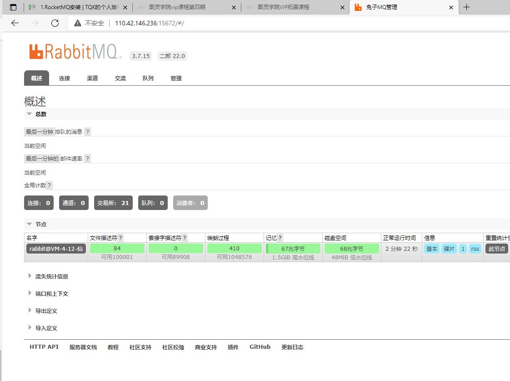
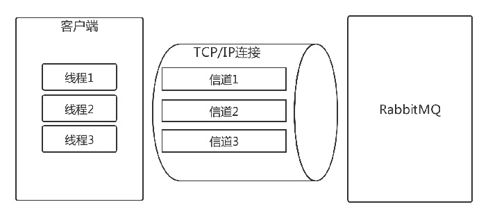
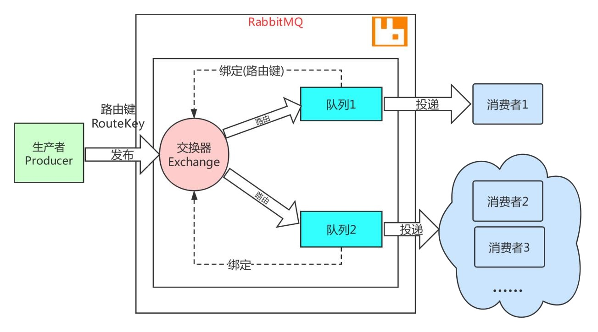
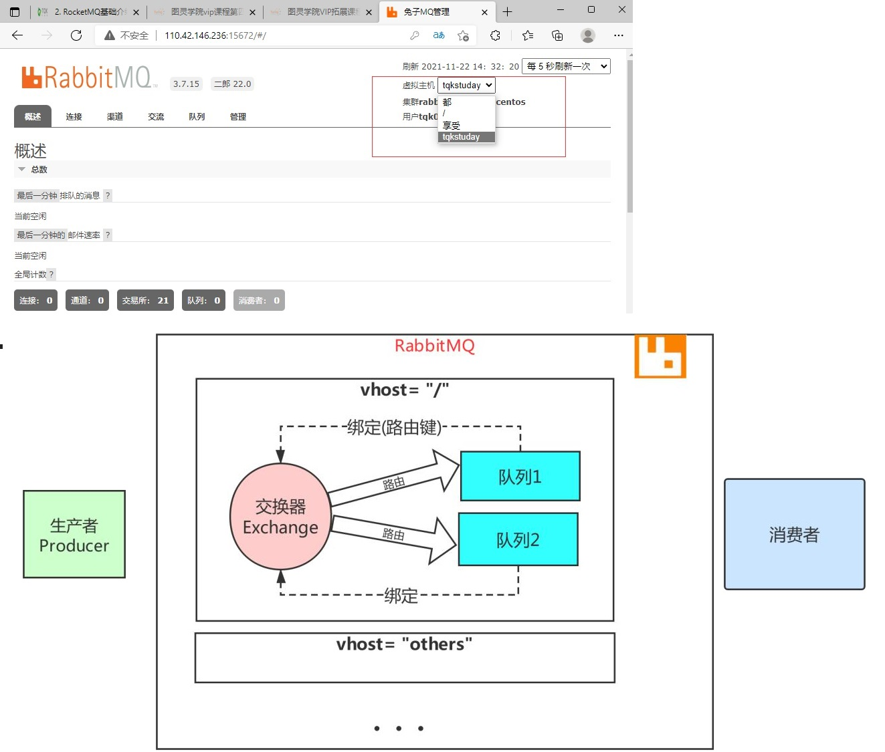
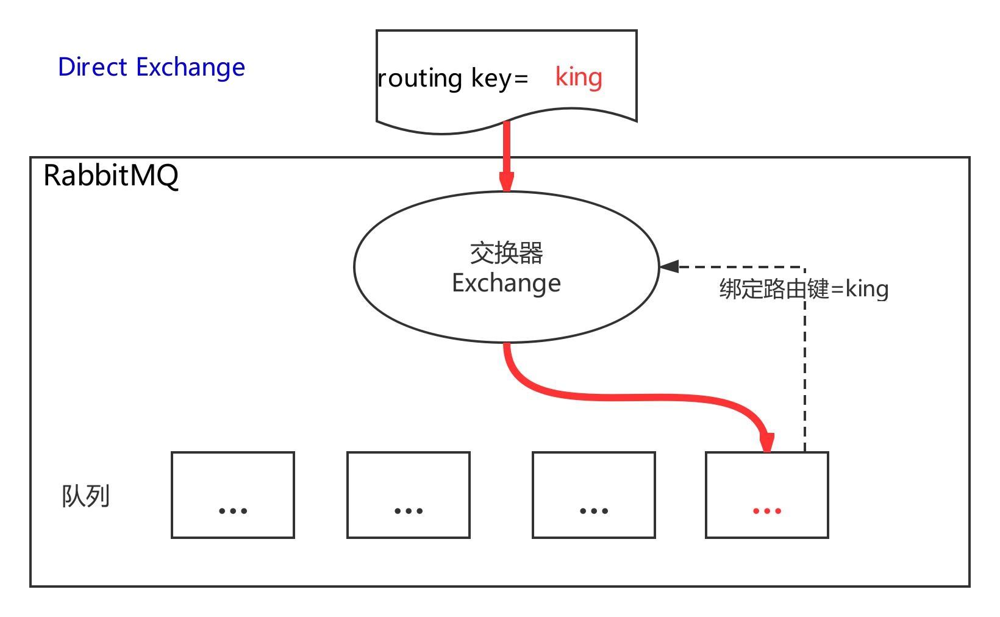
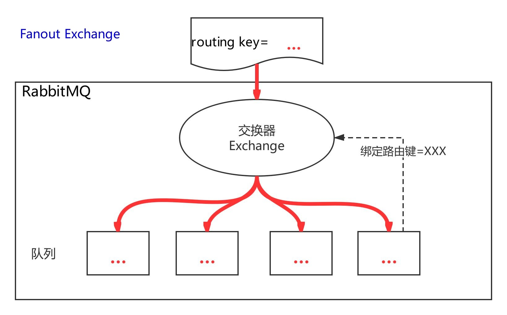
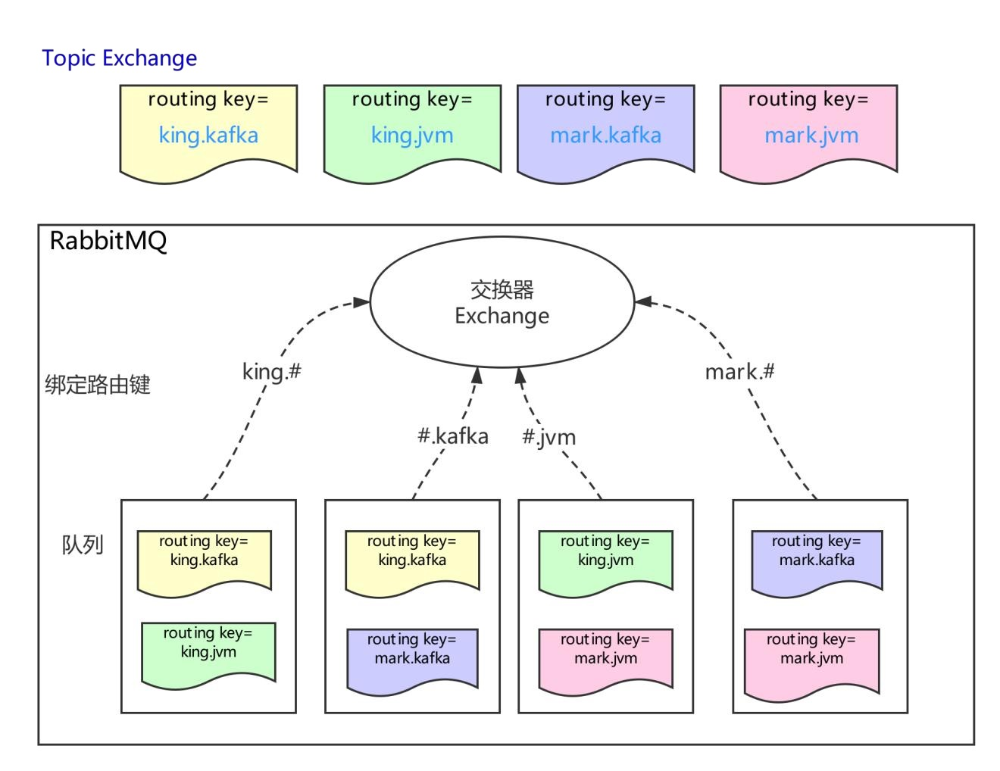

# 1. RabbitMQ安装以及概述
[[toc]]
## 1.1 RabbitMQ安装


### 1.1.1 安装erlang
由于rabbitmq是基于erlang语言开发的，所以必须先安装erlang。

:::tip 安装erlang
```bash
# 安装依赖
yum -y install gcc glibc-devel make ncurses-devel openssl-devel xmlto perl wget gtk2-devel binutils-devel

## 如果出现安装时error: db5 error(-30973) from dbenv->failchk: BDB0087 DB_RUNRECOVERY: Fatal error, run database reco
## 操作如下步骤
cd var/lib/rpm
ls -lrt
rm -rf __db.00*  #--删除掉__db.00开头的数据库文件
ls -lrt
rpm --rebuilddb   #--重建rpm数据库

# 下载安装包 erlang官网
wget http://erlang.org/download/otp_src_22.0.tar.gz

#解压
tar -zxvf otp_src_22.0.tar.gz
 
#移走
mv otp_src_22.0 /usr/local/
 
#切换目录
cd /usr/local/otp_src_22.0/
 
#创建即将安装的目录
mkdir ../erlang
 
#配置安装路径
./configure --prefix=/usr/local/erlang

#安装
make install

#查看一下是否安装成功
ll /usr/local/erlang/bin
 
#添加环境变量
echo 'export PATH=$PATH:/usr/local/erlang/bin' >> /etc/profile
 
#刷新环境变量
source /etc/profile
 
#甩一条命令
erl
在里面输入halt().命令退出来（那个点号别忘记）
```
:::

### 1.1.2 安装RabbitMQ

:::tip 安装步骤
```bash
##在Linux中安装RabbitMQ演示，以VirtualBox中的虚拟机为操作系统载体
##操作系统版本为CentOS7，纯净未安装RabbitMQ
wget https://github.com/rabbitmq/rabbitmq-server/releases/download/v3.7.15/rabbitmq-server-generic-unix-3.7.15.tar.xz

# 由于是tar.xz格式的所以需要用到xz，没有的话就先安装 ,存在则不需要执行了
yum install -y xz

#第一次解压
/bin/xz -d rabbitmq-server-generic-unix-3.7.15.tar.xz
 
#第二次解压
tar -xvf rabbitmq-server-generic-unix-3.7.15.tar
 
#移走
mv rabbitmq_server-3.7.15 /usr/local/
 

#改名
mv /usr/local/rabbitmq_server-3.7.15  rabbitmq
 
#配置环境变量
echo 'export PATH=$PATH:/usr/local/rabbitmq/sbin' >> /etc/profile
 
#刷新环境变量
source /etc/profile

#创建配置目录
mkdir /etc/rabbitmq
```
:::

### 1.1.3 启动命令

:::tip 启动命令
```bash
## 切换到启动命令目录
cd /usr/local/rabbitmq/sbin

#启动：
rabbitmq-server -detached
 
#停止：
rabbitmqctl stop
 

#状态：
rabbitmqctl status
#防火墙之类的请自行处理（5672和15672端口），反正我是从来不开防火墙

#开启相对应的端口
firewall-cmd --permanent --add-port=15672/tcp
firewall-cmd --permanent --add-port=5672/tcp

#查看已有虚拟主机并增加名为enjoyedu的虚拟主机
rabbitmqctl list_vhosts
rabbitmqctl add_vhost enjoyedu
rabbitmqctl list_vhosts

Listing vhosts ...
name
tqkstuday
enjoyedu
/

```
:::
<a data-fancybox title="rabbitmq" href="./image/rabbitmq01.jpg"></a>

### 1.1.4 WEB管理

:::tip WEB管理
```bash
#查看所有用户
rabbitmqctl list_users

#添加一个用户

rabbitmqctl add_user tqk001 12345@tqk

#增加名为tqk001的用户并配置administrator角色,增加相应的权限
#赋予其administrator角色
rabbitmqctl set_user_tags  tqk001  administrator

#配置权限 # 为用户赋权：
rabbitmqctl set_permissions -p "/" tqk001 ".*" ".*" ".*"
rabbitmqctl set_permissions -p "enjoyedu" tqk001 ".*" ".*" ".*"
rabbitmqctl set_permissions -p "tqkstuday" tqk001 ".*" ".*" ".*"

#查看用户权限
rabbitmqctl list_user_permissions tqk001
 
#删除用户（安全起见，删除默认用户）
rabbitmqctl delete_user guest
```
:::

### 1.1.5 登陆

配置好用户之后重启一下rabbit
然后就可以用新账号进行登陆
```bash
## 切换到启动命令目录
cd /usr/local/rabbitmq/sbin

#启动：
rabbitmq-server -detached
 
#停止：
rabbitmqctl stop
```
<a data-fancybox title="rabbitmq" href="./image/rabbitmq01.jpg"></a>


## 1.2 AMQP 概论

AMQP 是应用层协议的一个开放标准,为面向消息的中间件设计。基于此协议的客户端与消息中间件可传递消息，并不受客户端/中间件不同产品，不同的开发语言等条件的限制。目标是实现一种在全行业广泛使用的标准消息中间件技术，以便降低企业和系统集成的开销，并且向大众提供工业级的集成服务。 主要实现有 RabbitMQ。


### 1.2.1 客户端与RabbitMQ连接

#### 连接
首先作为客户端（无论是生产者还是消费者），你如果要与 RabbitMQ 通讯的话，你们之间必须创建一条 TCP 连接，当然同时建立连接后，客户端还必须发送一条“问候语”让彼此知道我们都是符合 AMQP 的语言的，比如你跟别人打招呼一般会说“你好！”，你跟国外的美女一般会说“hello!”一样。 你们确认好“语言”之后，就相当于客户端和 RabbitMQ 通过“认证”了。你们之间可以创建一条 AMQP 的信道。


#### 信道

概念：信道是生产者/消费者与 RabbitMQ 通信的渠道。信道是建立在 TCP 连接上的虚拟连接，什么意思呢？就是说 rabbitmq 在一条 TCP 上建立成百 上千个信道来达到多个线程处理，这个 TCP 被多个线程共享，每个线程对应一个信道，信道在 RabbitMQ 都有唯一的 ID ,保证了信道私有性，对应上唯一 的线程使用。 疑问：为什么不建立多个 TCP 连接呢？原因是 rabbit 保证性能，系统为每个线程开辟一个 TCP 是非常消耗性能，每秒成百上千的建立销毁 TCP 会严 重消耗系统。所以 rabbitmq 选择建立多个信道（建立在 tcp 的虚拟连接）连接到 rabbit 上。 从技术上讲，这被称之为“**多路复用**”，对于执行多个任务的多线程或者异步应用程序来说，它非常有用。

<a data-fancybox title="rabbitmq" href="./image/rabbitmq02.jpg"></a>

### 1.2.2 RabbitMQ 中使用 AMQP

RabbitMQ包括的要素 **生产者、消费者、消息** **交换器、队列、绑定、路由键**

:::tip RabbitMQ要素
**生产者:**消息的创建者，发送到 rabbitmq； 

**消费者：**连接到 rabbitmq，订阅到队列上，消费消息，**持续订阅(basicConsumer)和单条订阅(basicGet)**. 

**消息：**包含有效载荷和标签，有效载荷指要传输的数据，标签描述了有效载荷，并且 rabbitmq 用它来决定谁获得消息，消费者只能拿到有效载荷， 并不知道生产者是谁
:::

**交换器、队列、绑定、路由键**

**队列**通过**路由键**（routing key，某种确定的规则）绑定到**交换器**，生产者将消息发布到交换器，交换器根据绑定的路由键将消息路由到**特定队列**， 然后由订阅这个队列的消费者进行接收。 （routing_key 和 绑定键 binding_key 的最大长度是 255 个字节）

<a data-fancybox title="rabbitmq" href="./image/rabbitmq03.jpg"></a>

#### 消息的确认 
消费者收到的每一条消息都必须进行确认（自动确认和自行确认）。 

消费者在声明队列时，可以指定 autoAck 参数，当 autoAck=false 时，RabbitMQ 会等待消费者显式发回 **ack** 信号后才从内存(和磁盘，如果是持久化消 息的话)中移去消息。否则，RabbitMQ 会在队列中消息被消费后立即删除它。 

采用消息确认机制后，只要令 **autoAck=false**，消费者就有足够的时间处理消息(任务)，不用担心处理消息过程中消费者进程挂掉后消息丢失的问题， 因为 RabbitMQ 会一直持有消息直到消费者显式调用 basicAck 为止。

当 autoAck=false 时，对于 RabbitMQ 服务器端而言，队列中的消息分成了两部分：一部分是等待投递给消费者的消息；一部分是已经投递给消费者， 但是还没有收到消费者 ack 信号的消息。如果服务器端一直没有收到消费者的 ack 信号，并且消费此消息的消费者已经断开连接，则服务器端会安排该消息重新进入队列，等待投递给下一个消费者（也可能还是原来的那个消费者）。 

RabbitMQ 不会为未 ack 的消息设置超时时间，它判断此消息是否需要重新投递给消费者的唯一依据是消费该消息的消费者连接是否已经断开。这么设计的原因是 RabbitMQ 允许消费者消费一条消息的时间可以很久很久

####  常见问题 

**如果消息达到无人订阅的队列会怎么办？**  
消息会一直在队列中等待，RabbitMq 默认队列是无限长度的。 
**多个消费者订阅到同一队列怎么办？**

消息以循环的方式发送给消费者，每个消息只会发送给一个消费者。 

**消息路由到了不存在的队列怎么办？** 
一般情况下，RabbitMq 会忽略，当这个消息不存在，也就是这消息丢了。

### 1.2.3 虚拟主机

**虚拟消息服务器**，vhost，本质上就是一个 mini 版的 mq 服务器，有**自己的队列、交换器和绑定**，最重要的，自己的权限机制。Vhost 提供了逻辑上的分离，可以将众多客户端进行区分，
又可以避免队列和交换器的命名冲突。Vhost 必须在连接时指定，**rabbitmq 包含缺省 vhost：“/”，通过缺省用户和口令 guest 进行访问**。 

rabbitmq 里创建用户，必须要被指派给至少一个 vhost，并且只能访问被指派内的队列、交换器和绑定。Vhost 必须通过 rabbitmq 的管理控制工具创建。
<a data-fancybox title="rabbitmq" href="./image/rabbitmq04.jpg"></a>


### 1.2.4 交换器类型

共有四种**direct,fanout,topic,headers**，其种 headers(几乎和 direct 一样)不实用，可以忽略

#### Direct

路由键完全匹配，消息被投递到对应的队列， direct 交换器是默认交换器。声明一个队列时，会自动绑定到默认交换器，并且以队列名称作为路由 键：channel->basic_public($msg,’’,’queue-name’)
<a data-fancybox title="rabbitmq" href="./image/rabbitmq05.jpg"></a>

#### Fanout
消息广播到绑定的队列，不管队列绑定了什么路由键，消息经过交换器，每个队列都有一份。
<a data-fancybox title="rabbitmq" href="./image/rabbitmq06.jpg"></a>


#### Topic
**通过使用"*"和"#"通配符进行处理，使来自不同源头的消息到达同一个队列，"."将路由键分为了几个标识符，"*"匹配 1 个，"#"匹配一个 或多个**
<a data-fancybox title="rabbitmq" href="./image/rabbitmq07.jpg"></a>


## 1.3 延时插件安装

```shell
#下载延时插件:
https://github.com/rabbitmq/rabbitmq-delayed-message-exchange/releases/tag/v3.8.0

cd /usr/local/rabbitmq/plugins

#上传插件: 
rz rabbitmq_delayed_message_exchange-3.8.0.ez

#启动延时插件: 
rabbitmq-plugins enable rabbitmq_delayed_message_exchange
```