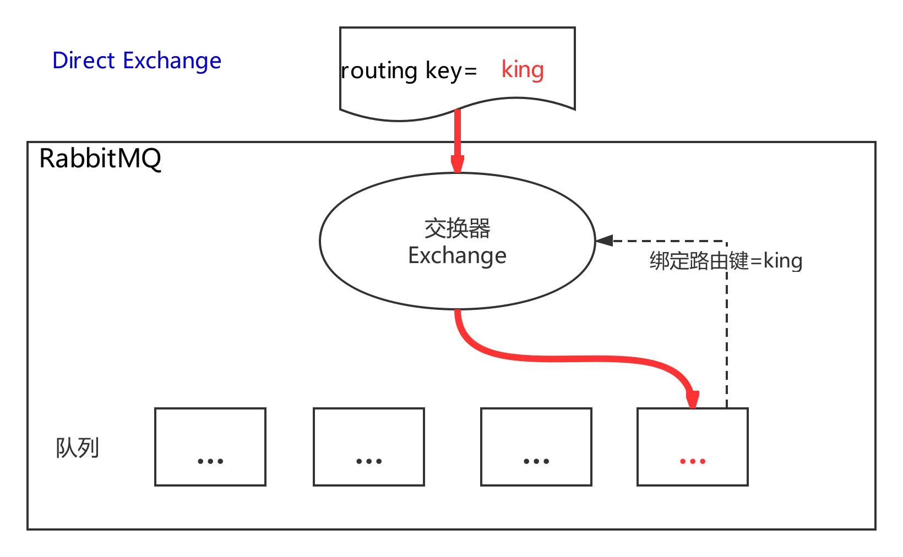
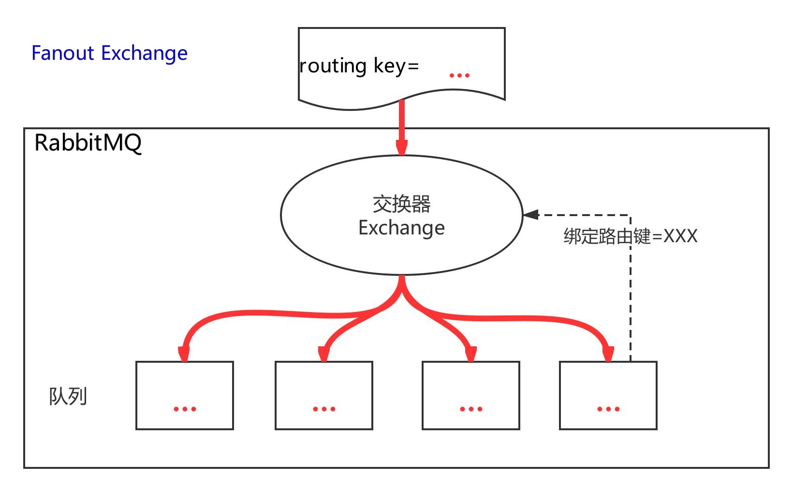

# 2. 原生 Java 客户端进行消息通信

## 2.1 Direct 交换器

<a data-fancybox title="rabbitmq" href="./image/rabbitmq05.jpg"></a>


:::tip 代码演示:
**DirectProducer**：direct 类型交换器的生产者 

**NormalConsumer**：普通的消费者 

**MulitBindConsumer**：队列绑定到交换器上时，是允许绑定多个路由键的，也就是多重绑定 

**MulitChannelConsumer**：一个连接下允许有多个信道 

**MulitConsumerOneQueue**：一个队列多个消费者，则会表现出消息在消费者之间的轮询发送。
:::

### 2.1.1 生产者和消费者一般用法

#### DirectProducer

```java
import com.rabbitmq.client.BuiltinExchangeType;
import com.rabbitmq.client.Channel;
import com.rabbitmq.client.Connection;
import com.rabbitmq.client.ConnectionFactory;

import java.io.IOException;
import java.util.concurrent.TimeoutException;

/**
 *类说明：direct类型交换器的生产者
 */
public class DirectProducer {
    public final static String EXCHANGE_NAME = "direct_logs";
    public static void main(String[] args) throws IOException, TimeoutException {
        //创建连接、连接到RabbitMQ
        ConnectionFactory connectionFactory = new ConnectionFactory();
        //设置下连接工厂的连接地址(使用默认端口5672)
        connectionFactory.setHost("110.42.146.236");
        connectionFactory.setPort(5672);
        connectionFactory.setUsername("tqk001");
        connectionFactory.setPassword("12345@tqk");
        //创建连接
        Connection connection = connectionFactory.newConnection();
        //创建信道
        Channel channel = connection.createChannel();
        //在信道中设置交换器
        channel.exchangeDeclare(EXCHANGE_NAME, BuiltinExchangeType.DIRECT);

        //申明队列（放在消费者中去做）
        //申明路由键\消息体
        String[] routeKeys ={"king","mark","james"};
        for (int i=0;i<6;i++){
            String routeKey = routeKeys[i%3];
            String msg = "Hello,RabbitMQ"+(i+1);
            //发布消息
            channel.basicPublish(EXCHANGE_NAME,routeKey,null,msg.getBytes());
            System.out.println("Sent:"+routeKey+":"+msg);
        }
        channel.close();
        connection.close();

    }
}

```

#### NormalConsumer
```java
import com.rabbitmq.client.*;

import java.io.IOException;
import java.util.concurrent.TimeoutException;

/**
 *类说明：普通的消费者
 */
public class NormalConsumer {

    public static void main(String[] argv)
            throws IOException, TimeoutException {
        //创建连接、连接到RabbitMQ
        ConnectionFactory connectionFactory= new ConnectionFactory();
        //设置下连接工厂的连接地址(使用默认端口5672)
        connectionFactory.setHost("110.42.146.236");
        connectionFactory.setPort(5672);
        connectionFactory.setUsername("tqk001");
        connectionFactory.setPassword("12345@tqk");
        //创建连接
        Connection connection =connectionFactory.newConnection();
        //创建信道
        Channel channel =connection.createChannel();

        //在信道中设置交换器
        channel.exchangeDeclare(DirectProducer.EXCHANGE_NAME,BuiltinExchangeType.DIRECT);

        //申明队列（放在消费者中去做）
        String queueName="queue-king";
        channel.queueDeclare(queueName,false,false,false,null);

        //绑定：将队列(queuq-king)与交换器通过 路由键 绑定(king)
        String routeKey ="king";
        channel.queueBind(queueName,DirectProducer.EXCHANGE_NAME,routeKey);
        System.out.println("waiting for message ......");

        //申明一个消费者
        final Consumer consumer  = new DefaultConsumer(channel){
            @Override
            public void handleDelivery(String s, Envelope envelope, AMQP.BasicProperties basicProperties, byte[] bytes) throws IOException {
                String message = new String(bytes,"UTF-8");
                System.out.println("Received["+envelope.getRoutingKey()+"]"+message);
            }
        };
        //消息者正是开始在指定队列上消费。(queue-king)
        //TODO 这里第二个参数是自动确认参数，如果是true则是自动确认
        channel.basicConsume(queueName,true,consumer);


    }

}
```

### 2.1.2 队列和交换器的多重绑定

对比：单个绑定的消费者只能收到指定的消息，多重绑定的的消费者可以收到所有的消息。

<a data-fancybox title="rabbitmq" href="./image/rabbitmq06.jpg"></a>

#### 队列绑定到交换器上时，是允许绑定多个路由键的，也就是多重绑定
```java
    //MultiBindConsumer
    //TODO
    /*队列绑定到交换器上时，是允许绑定多个路由键的，也就是多重绑定*/
    String[] routeKeys={"king","mark","james"};
    for (String routeKey:routeKeys){
        channel.queueBind(queueName,DirectProducer.EXCHANGE_NAME,routeKey);
    }
```

#### 一个连接，我们可以使用多线程的方式模拟多个信道进行通讯。这样可以做到多路复用

一个连接，我们可以使用多线程的方式模拟多个信道进行通讯。这样可以做到多路复用。

```java
package com.tqk.rabbitmq.direct;


import com.rabbitmq.client.*;

import java.io.IOException;
import java.util.concurrent.TimeoutException;

/**
 *类说明：一个连接多个信道
 * 
 */
public class MultiChannelConsumer {
    public static void main(String[] args) throws IOException, TimeoutException {
        //创建连接、连接到RabbitMQ
        ConnectionFactory connectionFactory= new ConnectionFactory();
        //设置下连接工厂的连接地址(使用默认端口5672)
        connectionFactory.setHost("110.42.146.236");
        connectionFactory.setPort(5672);
        connectionFactory.setUsername("tqk001");
        connectionFactory.setPassword("12345@tqk");
        //创建连接
        Connection connection =connectionFactory.newConnection();
        //一个连接多个信道
        for(int i=0;i<2;i++){
            /*将连接作为参数，传递给每个线程*/
            Thread worker =new Thread(new ConsumerWorker(connection));
            worker.start();
        }
    }

    private static class ConsumerWorker implements Runnable{
        final Connection connection;

        public ConsumerWorker(Connection connection) {
            this.connection = connection;
        }

        @Override
        public void run() {
            try {
                /*创建一个信道，意味着每个线程单独一个信道*/
                Channel channel = connection.createChannel();
                //信道设置交换器类型(direct)
                channel.exchangeDeclare(DirectProducer.EXCHANGE_NAME,BuiltinExchangeType.DIRECT);
                // 声明一个随机队列
                String queueName = channel.queueDeclare().getQueue();
                //String queueName = "queue-king";      // 同一个队列

                //消费者名字，打印输出用
                final String consumerName =  Thread.currentThread().getName()+"-all";

                /*队列绑定到交换器上时，是允许绑定多个路由键的，也就是多重绑定*/
                String[] routekeys={"king","mark","james"};
                for(String routekey:routekeys){
                    channel.queueBind(queueName,DirectProducer.EXCHANGE_NAME,
                            routekey);
                }
                System.out.println("["+consumerName+"] Waiting for messages:");

                // 创建队列消费者
                final Consumer consumerA = new DefaultConsumer(channel) {
                    @Override
                    public void handleDelivery(String consumerTag,
                                               Envelope envelope,
                                               AMQP.BasicProperties
                                                       properties,
                                               byte[] body)
                            throws IOException {
                        String message =
                                new String(body, "UTF-8");
                        System.out.println(consumerName
                                +" Received "  + envelope.getRoutingKey()
                                + ":'" + message + "'");
                    }
                };
                channel.basicConsume(queueName, true, consumerA);
            } catch (Exception e) {
                e.printStackTrace();
            }
        }
    }
}

```


#### 一个队列多个消费者，则会表现出消息在消费者之间的轮询发送

```java
package com.tqk.rabbitmq.direct;

import com.rabbitmq.client.*;

import java.io.IOException;
import java.util.concurrent.TimeoutException;

/**
 *类说明：一个队列多个消费者，则会表现出消息在消费者之间的轮询发送。
 */
public class MultiConsumerOneQueue {

    private static class ConsumerWorker implements Runnable{
        final Connection connection;
        final String queueName;

        public ConsumerWorker(Connection connection,String queueName) {
            this.connection = connection;
            this.queueName = queueName;
        }

        @Override
        public void run() {
            try {
                /*创建一个信道，意味着每个线程单独一个信道*/
                final Channel channel = connection.createChannel();
                //信道设置交换器类型(direct)
                channel.exchangeDeclare(DirectProducer.EXCHANGE_NAME,BuiltinExchangeType.DIRECT);
                /*声明一个队列,rabbitmq，如果队列已存在，不会重复创建*/
                channel.queueDeclare(queueName, false,false, false,null);
                //消费者名字，打印输出用
                final String consumerName =  Thread.currentThread().getName();

                /*队列绑定到交换器上时，是允许绑定多个路由键的，也就是多重绑定*/
                String[] routekeys={"king","mark","james"};
                for(String routekey:routekeys){
                    channel.queueBind(queueName,DirectProducer.EXCHANGE_NAME,
                            routekey);
                }
                System.out.println(" ["+consumerName+"] Waiting for messages:");

                // 创建队列消费者
                final Consumer consumerA = new DefaultConsumer(channel) {
                    @Override
                    public void handleDelivery(String consumerTag,
                                               Envelope envelope,
                                               AMQP.BasicProperties
                                                       properties,
                                               byte[] body)
                            throws IOException {
                        String message =
                                new String(body, "UTF-8");
                        System.out.println(consumerName
                                +" Received "  + envelope.getRoutingKey()
                                + ":'" + message + "'");
                    }
                };
                channel.basicConsume(queueName, true, consumerA);
            } catch (Exception e) {
                e.printStackTrace();
            }
        }
    }

    public static void main(String[] argv) throws IOException,
            InterruptedException, TimeoutException {
        //创建连接、连接到RabbitMQ
        ConnectionFactory connectionFactory= new ConnectionFactory();
        //设置下连接工厂的连接地址(使用默认端口5672)
        connectionFactory.setHost("110.42.146.236");
        connectionFactory.setPort(5672);
        connectionFactory.setUsername("tqk001");
        connectionFactory.setPassword("12345@tqk");

        // 打开连接和创建频道，与发送端一样
        Connection connection = connectionFactory.newConnection();
        //TODO
        //3个线程，线程之间共享队列,一个队列多个消费者
        String queueName = "focusAll";
        for(int i=0;i<3;i++){
            /*将队列名作为参数，传递给每个线程*/
            Thread worker =new Thread(new ConsumerWorker(connection,queueName+i));
            worker.start();
        }

    }
}

```

## 2.2 Fanout 交换器

消息广播到绑定的队列

### 2.2.1 服务端

**channel.exchangeDeclare(EXCHANGE_NAME, BuiltinExchangeType.FANOUT);**
```java
package com.tqk.fanout;

import com.rabbitmq.client.BuiltinExchangeType;
import com.rabbitmq.client.Channel;
import com.rabbitmq.client.Connection;
import com.rabbitmq.client.ConnectionFactory;

import java.io.IOException;
import java.util.concurrent.TimeoutException;

/**
 *类说明：fanout生产者
 */
public class FanoutProducer {

    public final static String EXCHANGE_NAME = "fanout_logs";

    public static void main(String[] args) throws IOException, TimeoutException {
        //创建连接、连接到RabbitMQ
        ConnectionFactory connectionFactory= new ConnectionFactory();
        //设置下连接工厂的连接地址(使用默认端口5672)
        connectionFactory.setHost("110.42.146.236");
        connectionFactory.setPort(5672);
        connectionFactory.setUsername("tqk001");
        connectionFactory.setPassword("12345@tqk");

        // 创建一个连接
        Connection connection = connectionFactory.newConnection();


        // 创建一个信道
        Channel channel = connection.createChannel();
        //TODO
        // 指定转发
        channel.exchangeDeclare(EXCHANGE_NAME, BuiltinExchangeType.FANOUT);

//        String queueName = "producer_create";
//        channel.queueDeclare(queueName,false,false,
//                false,null);
//        channel.queueBind(queueName,EXCHANGE_NAME,"test");

        /*日志消息级别，作为路由键使用*/
        String[] routekeys = {"king","mark","james"};
        for(int i=0;i<3;i++){
            String routekey = routekeys[i%3];//每一次发送一条消息
            // 发送的消息
            String message = "Hello World_"+(i+1);
            //参数1：exchange name
            //参数2：routing key
            channel.basicPublish(EXCHANGE_NAME, routekey,
                    null, message.getBytes());
            System.out.println(" [x] Sent '" + routekey +"':'"
                    + message + "'");
        }
        // 关闭频道和连接
        channel.close();
        connection.close();
    }

}

```
### 2.2.2 客户端
```java
       /*队列绑定到交换器上时，是允许绑定多个路由键的，也就是多重绑定*/
        String[] routekeys={"king","mark","james"};
        for(String routekey:routekeys){
            channel.queueBind(queueName, FanoutProducer.EXCHANGE_NAME,
                    routekey);
        }
```
```java
        //设置一个不存在的路由键
        String routekey="xxx";
        channel.queueBind(queueName, FanoutProducer.EXCHANGE_NAME, routekey);
```
**通过测试表明，不管我们如何调整生产者和消费者的路由键，都对消息的接受没有影响**


## 2.3 Topic 交换器

<a data-fancybox title="rabbitmq" href="./image/rabbitmq10.jpg"></a>

通过使用“*”和“#”，使来自不同源头的消息到达同一个队列，”.”将路由键分为了几个标识符，**“*”匹配 1 个，“#”匹配一个或多个**。

例子如下：

假设有交换器 topic_course， 
讲课老师有 king,mark,james， 
技术专题有 kafka,jvm,redis， 
课程章节有 A、B、C， 

路由键的规则为**讲课老师+“.”+技术专题+“.”+课程章节**，如：king.kafka.A。 
:::tip *与#的区别： 
如果我们发送的路由键变成 king.kafka.A 
那么队列中如果绑定了 king.* 不能匹配 
队列中如果绑定了 king.# 能够匹配
:::

### 2.3.1 服务端

```java
package com.tqk.topic;

import com.rabbitmq.client.BuiltinExchangeType;
import com.rabbitmq.client.Channel;
import com.rabbitmq.client.Connection;
import com.rabbitmq.client.ConnectionFactory;

import java.io.IOException;
import java.util.concurrent.TimeoutException;

/**
 *类说明：Topic类型的生产者
 * 假设有交换器 topic_course，
 * 讲课老师有king,mark,james，
 * 技术专题有kafka,jvm,redis，
 * 课程章节有 A、B、C，
 * 路由键的规则为 讲课老师+“.”+技术专题+“.”+课程章节，如：king.kafka.A。
 * 生产者--生产全部的消息3*3*3=27条消息
 */
public class TopicProducer {

    public final static String EXCHANGE_NAME = "topic_course";

    public static void main(String[] args)
            throws IOException, TimeoutException {
        /**
         * 创建连接连接到RabbitMQ
         */
        //创建连接、连接到RabbitMQ
        ConnectionFactory connectionFactory= new ConnectionFactory();
        //设置下连接工厂的连接地址(使用默认端口5672)
        connectionFactory.setHost("110.42.146.236");
        connectionFactory.setPort(5672);
        connectionFactory.setUsername("tqk001");
        connectionFactory.setPassword("12345@tqk");

        // 打开连接和创建频道，与发送端一样
        Connection connection = connectionFactory.newConnection();

        // 创建一个信道
        Channel channel = connection.createChannel();
        //TODO
        // 指定转发
        channel.exchangeDeclare(EXCHANGE_NAME, BuiltinExchangeType.TOPIC);

        /*我们的课程，路由键最终格式类似于：king.kafka.A  king.kafka.B*/
        String[] techers={"king","mark","james"};
        for(int i=0;i<3;i++){
            String[]  modules={"kafka","jvm","redis"};
            for(int j=0;j<3;j++){
                String[]  servers={"A","B","C"};
                for(int k=0;k<3;k++){
                    // 发送的消息
                    String message = "Hello Topic_["+i+","+j+","+k+"]";
                    String routeKey = techers[i%3]+"."+modules[j%3]
                            +"."+servers[k%3];
                    channel.basicPublish(EXCHANGE_NAME,routeKey,
                            null, message.getBytes());
                    System.out.println(" [x] Sent '" + routeKey +":'"
                            + message + "'");
                }
            }

        }
        // 关闭频道和连接
        channel.close();
        connection.close();
    }

}

```

### 2.3.2 客户端

```java

//TODO king老师所有的A课程
channel.queueBind(queueName,TopicProducer.EXCHANGE_NAME, "king.*.A");
//TODO king老师所有的课程
channel.queueBind(queueName,TopicProducer.EXCHANGE_NAME, "king.#");

.....
```
