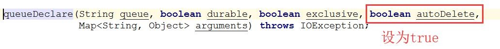
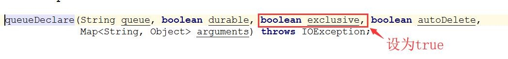
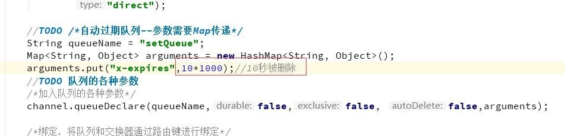
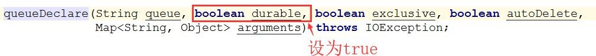
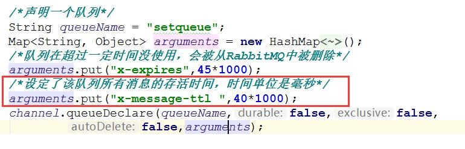

# 6. 控制队列 

前面讲了比较多的消费者，RabbitMQ 中消费行为主要跟队列有直接关系，那么我们接下来深入的分析队列。 

## 6.1 临时队列 

临时队列对应的是没有持久化的队列，也就是如果 RabbitMQ 服务器重启，那么这些队列就不会存在，所以我们称之为临时队列。 

```java
package com.tqk.setqueue;

import com.rabbitmq.client.*;

import java.io.IOException;
import java.util.HashMap;
import java.util.Map;
import java.util.concurrent.TimeoutException;

/**

 *类说明：控制队列的参数
 */
public class SetQueueConsumer {
    public final static String EXCHANGE_NAME = "set_queue";

    public static void main(String[] argv)
            throws IOException, TimeoutException {
        //创建连接、连接到RabbitMQ
        ConnectionFactory connectionFactory= new ConnectionFactory();
        //设置下连接工厂的连接地址(使用默认端口5672)
        connectionFactory.setHost("110.42.146.236");
        connectionFactory.setPort(5672);
        connectionFactory.setUsername("tqk001");
        connectionFactory.setPassword("12345@tqk");

        // 打开连接和创建频道，与发送端一样
        Connection connection = connectionFactory.newConnection();

        final Channel channel = connection.createChannel();
        channel.exchangeDeclare(EXCHANGE_NAME,
                BuiltinExchangeType.DIRECT);

        //TODO /*自动过期队列--参数需要Map传递*/
        String queueName = "setQueue";
        Map<String, Object> arguments = new HashMap<String, Object>();
        arguments.put("x-expires",10*1000);//10秒被删除
        //TODO 队列的各种参数
        /*加入队列的各种参数*/
        channel.queueDeclare(queueName,false,false, false,arguments);

        /*绑定，将队列和交换器通过路由键进行绑定*/
        String routekey = "error";/*表示只关注error级别的日志消息*/
        channel.queueBind(queueName,EXCHANGE_NAME,routekey);

        System.out.println("waiting for message........");

        /*声明了一个消费者*/
        final Consumer consumer = new DefaultConsumer(channel){
            @Override
            public void handleDelivery(String consumerTag,
                                       Envelope envelope,
                                       AMQP.BasicProperties properties,
                                       byte[] body) throws IOException {
                String message = new String(body, "UTF-8");
                System.out.println("Received["+envelope.getRoutingKey()
                        +"]"+message);
            }
        };
        /*消费者正式开始在指定队列上消费消息*/
        channel.basicConsume(queueName,true,consumer);


    }

}
```

### 6.1.1 自动删除队列 
自动删除队列和普通队列在使用上没有什么区别，唯一的区别是，当消费者断开连接时，队列将会被删除。

自动删除队列允许的消费者没有限制， 也就是说当这个队列上最后一个消费者断开连接才会执行删除。

自动删除队列只需要在声明队列时，设置属性 auto-delete 标识为 true 即可。**系统声明的随机队列，缺省就是自动删除的**。 
<a data-fancybox title="rabbitmq" href="./image/rabbitmq61.jpg"></a>


### 6.1.2 单消费者队列 

普通队列允许的消费者没有限制，多个消费者绑定到多个队列时，RabbitMQ 会采用轮询进行投递。如果需要消费者独占队列，在队列创建的时候， 设定属性 exclusive 为 true。
<a data-fancybox title="rabbitmq" href="./image/rabbitmq62.jpg"></a>


### 6.1.3 自动过期队列 

指队列在超过一定时间没使用，会被从 RabbitMQ 中被删除。 什么是没使用？
<a data-fancybox title="rabbitmq" href="./image/rabbitmq63.jpg"></a>

1. 一定时间内没有 Get 操作发生。
2. 没有 Consumer 连接在队列上。 

**特别的**：就算一直有消息进入队列，也不算队列在被使用。 通过声明队列时，设定 x-expires 参数即可，单位毫秒。 比如这个队列会在当消费者断开连接时 10 秒后过期。


## 6.2 永久队列 

## 6.2.1 队列的持久性 

持久化队列和非持久化队列的区别是，持久化队列会被保存在磁盘中，固定并持久的存储，当 Rabbit 服务重启后，该队列会保持原来的状态在 RabbitMQ 中被管理，而非持久化队列不会被保存在磁盘中，Rabbit 服务重启后队列就会消失。

**非持久化比持久化的优势就是，由于非持久化不需要保存在磁盘中，所以使用速度就比持久化队列快。即是非持久化的性能要高于持久化。而持久化的优点就是会一直存在，不会随服务的重启或服务器的宕机而消失**

**在声明队列时，将属性 durable 设置为“false”，则该队列为非持久化队列，设置成“true”时，该队列就为持久化队列**
<a data-fancybox title="rabbitmq" href="./image/rabbitmq64.jpg"></a>


## 6.3 队列级别消息过期

就是为每个队列设置消息的超时时间。只要给队列设置 x-message-ttl 参数，就设定了该队列所有消息的存活时间，时间单位是毫秒。如果声明队列 时指定了死信交换器，则过期消息会成为死信消息。
<a data-fancybox title="rabbitmq" href="./image/rabbitmq65.jpg"></a>

## 6.4 队列保留参数列表

1. x-dead-letter-exchange 死信交换器
2. x-dead-letter-routing-key 死信消息的可选路由键 
3. x-expires 队列在指定毫秒数后被删除 
4. x-ha-policy 创建 HA 队列 
5. x-ha-nodes HA 队列的分布节点 
6. x-max-length 队列的最大消息数 
7. x-message-ttl 毫秒为单位的消息过期时间，队列级别 
8. x-max-priority 最大优先值为 255 的队列优先排序功能

**对队列中消息的条数进行限制 x-max-length**  
**对队列中消息的总量进行限制 x-max-length-bytes**  