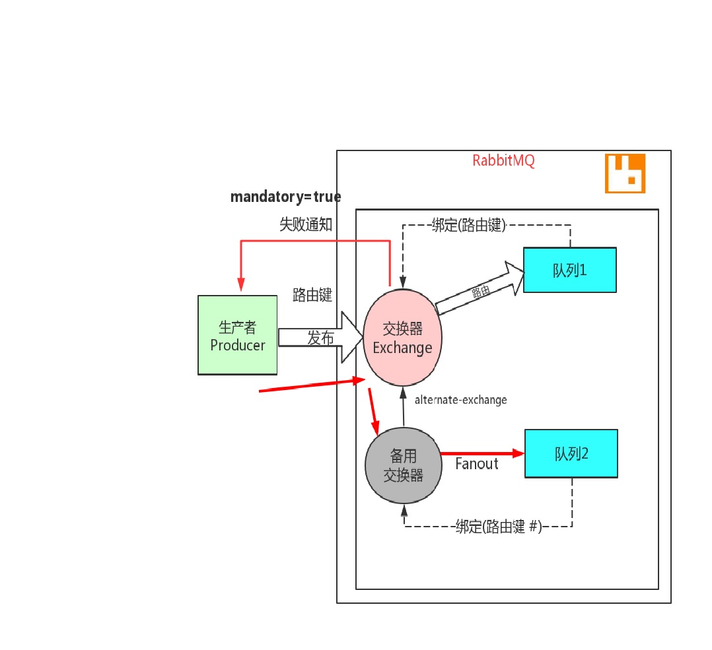

# 3. 消息发布时的权衡

不做任何配置的情况下，生产者是不知道消息是否真正到达RabbitMQ，也就是说消息发布操作不返回任何消息给生产者。怎么保证我们消息发布的可靠性？有以下几种常用机制。

<a data-fancybox title="rabbitmq" href="./image/rabbitmq31.jpg"></a>


<font color='red'>在 RabbitMQ 中实际项目中，生产者和消费者都是客户端，它们都可以完成申明交换器、申明队列和绑定关系，但是在我们的实战过程中，我们在生产者代码中申明交换器，在消费者代码中申明队列和绑定关系。</font> 

<font color='red'>另外还要申明的就是，生产者发布消息时不一定非得需要消费者，对于 RabbitMQ 来说，如果是单纯的生产者你只需要生产者客户端、申明交换器、 申明队列、确定绑定关系，数据就能从生产者发送至 RabbitMQ。只是为了演示的方便，我们在例子中使用消费者消费队列中的数据来方便展示结果</font> 

## 3.1 无保障

在演示各种交换器中使用的就是无保障的方式，通过 basicPublish 发布你的消息并使用正确的交换器和路由信息，你的消息会被接收并发送到合适的 队列中。但是如果有网络问题，或者消息不可路由，或者 RabbitMQ 自身有问题的话，这种方式就有风险。所以**无保证的消息发送一般情况下不推荐。**

## 3.2 失败确认 

在发送消息时设置 mandatory 标志，告诉 RabbitMQ，如果消息不可路由，应该将消息返回给发送者，并通知失败。可以这样认为，开启 mandatory 是开启故障检测模式。 

注意：它只会让 RabbitMQ 向你通知失败，而不会通知成功。如果消息正确路由到队列，则发布者不会受到任何通知。带来的问题是无法确保发布消 息一定是成功的，因为通知失败的消息可能会丢失

<a data-fancybox title="rabbitmq" href="./image/rabbitmq32.jpg"></a>

**失败通知回调代码**
```java
    //TODO
    //失败通知 回调
    channel.addReturnListener(new ReturnListener() {
        @Override
        public void handleReturn(int replycode, String replyText, String exchange, String routeKey, AMQP.BasicProperties basicProperties, byte[] bytes) throws IOException {
            String message = new String(bytes);
            System.out.println("返回的replycode:"+replycode);
            //消息无法路由
            System.out.println("返回的replyText:"+replyText);
            System.out.println("返回的exchange:"+exchange);
            System.out.println("返回的routeKey:"+routeKey);
        }
    });
```

### 服务端
```java
package com.tqk.balance;

import com.rabbitmq.client.*;

import java.io.IOException;
import java.util.concurrent.TimeoutException;

/**
 *类说明：生产者——失败确认模式
 */
public class ProducerMandatory {

    public final static String EXCHANGE_NAME = "mandatory_test1";

    public static void main(String[] args)
            throws IOException, TimeoutException, InterruptedException {
        /**
         * 创建连接连接到RabbitMQ
         */
        //创建连接、连接到RabbitMQ
        ConnectionFactory connectionFactory= new ConnectionFactory();
        //设置下连接工厂的连接地址(使用默认端口5672)
        connectionFactory.setHost("110.42.146.236");
        connectionFactory.setPort(5672);
        connectionFactory.setUsername("tqk001");
        connectionFactory.setPassword("12345@tqk");

        // 打开连接和创建频道，与发送端一样
        Connection connection = connectionFactory.newConnection();
        // 创建一个信道
        Channel channel = connection.createChannel();
        // 指定Direct交换器
        channel.exchangeDeclare(EXCHANGE_NAME, BuiltinExchangeType.TOPIC);
        //TODO  回调
        //连接关闭时执行
        connection.addShutdownListener(new ShutdownListener() {
            @Override
            public void shutdownCompleted(ShutdownSignalException e) {
                System.out.println(e.getMessage());
                System.out.println("连接关闭时执行!");
            }
        });

        //TODO 回调
        //信道关闭时执行
        channel.addShutdownListener(new ShutdownListener() {
            @Override
            public void shutdownCompleted(ShutdownSignalException e) {
                System.out.println(e.getMessage());
                System.out.println("信道关闭时执行!");
            }
        });

        //TODO
        //失败通知 回调
        channel.addReturnListener(new ReturnListener() {
            @Override
            public void handleReturn(int replycode, String replyText, String exchange, String routeKey, AMQP.BasicProperties basicProperties, byte[] bytes) throws IOException {
                String message = new String(bytes);
                System.out.println("返回的replycode:"+replycode);
                //消息无法路由
                System.out.println("返回的replyText:"+replyText);
                System.out.println("返回的exchange:"+exchange);
                System.out.println("返回的routeKey:"+routeKey);
            }
        });


        String[] routekeys={"king","mark","james"};
        for(int i=0;i<3;i++){
            String routekey = routekeys[i%3];
            // 发送的消息
            String message = "Hello World_"+(i+1)
                    +("_"+System.currentTimeMillis());
            //TODO
            channel.basicPublish(EXCHANGE_NAME,routekey,true,null,message.getBytes());
            System.out.println("----------------------------------");
            System.out.println(" Sent Message: [" + routekey +"]:'"
                    + message + "'");
            Thread.sleep(200);
        }

        // 关闭频道和连接
        channel.close();
        connection.close();
    }


}
```
### 客户端
```java
package com.tqk.balance;

import com.rabbitmq.client.*;

import java.io.IOException;
import java.util.concurrent.TimeoutException;

/**
 *类说明：消费者——失败确认模式(消费者只绑定了king)
 */
public class ConsumerProducerMandatory {

    public static void main(String[] argv)
            throws IOException, TimeoutException {
        //创建连接、连接到RabbitMQ
        ConnectionFactory connectionFactory= new ConnectionFactory();
        //设置下连接工厂的连接地址(使用默认端口5672)
        connectionFactory.setHost("110.42.146.236");
        connectionFactory.setPort(5672);
        connectionFactory.setUsername("tqk001");
        connectionFactory.setPassword("12345@tqk");

        // 打开连接和创建频道，与发送端一样
        Connection connection = connectionFactory.newConnection();
        final Channel channel = connection.createChannel();

        channel.exchangeDeclare(ProducerMandatory.EXCHANGE_NAME,
                BuiltinExchangeType.TOPIC);

        String queueName = channel.queueDeclare().getQueue();

        //只关注king的
        String routekey="king";
//        String routekey="#";
        //TODO  #

        channel.queueBind(queueName, ProducerMandatory.EXCHANGE_NAME,
                routekey);

        System.out.println(" [*] Waiting for messages......");

        // 创建队列消费者
        final Consumer consumerB = new DefaultConsumer(channel) {
            @Override
            public void handleDelivery(String consumerTag,
                                       Envelope envelope,
                                       AMQP.BasicProperties properties,
                                       byte[] body) throws IOException {
                String message = new String(body, "UTF-8");
                //记录日志到文件：
                System.out.println( "Received ["+ envelope.getRoutingKey()
                        + "] "+message);
            }
        };
        channel.basicConsume(queueName, true, consumerB);
    }

}

```

## 3.3 事务

**事务的实现主要是对信道（Channel）的设置**

:::tip 主要的方法有三个： 
1. channel.txSelect()声明启动事务模式； 
2. channel.txComment()提交事务； 
3. channel.txRollback()回滚事务； 
:::

在发送消息之前，需要声明 channel 为事务模式，提交或者回滚事务即可。 

:::tip 开启事务后，客户端和 RabbitMQ 之间的通讯交互流程： 
1. 客户端发送给服务器 Tx.Select(开启事务模式) 
2. 服务器端返回 Tx.Select-Ok（开启事务模式 ok） 
3. 推送消息 
4. 客户端发送给事务提交 Tx.Commit
5. 服务器端返回 Tx.Commit-Ok 以上就完成了事务的交互流程

如果其中任意一个环节出现问题，就会抛出 **IoException**，这样用户就可以拦截异常进行事务回滚，或决定要不要重复消息。
:::

**那么，既然已经有事务了，为何还要使用发送方确认模式呢，原因是因为事务的性能是非常差的。根据相关资料，事务会降低 2~10 倍的性能**

```java
    //TODO
    //加入事务
    channel.txSelect();
    try {
        for(int i=0;i<3;i++){
            String routekey = routekeys[i%3];
            // 发送的消息
            String message = "Hello World_"+(i+1)
                    +("_"+System.currentTimeMillis());
            channel.basicPublish(EXCHANGE_NAME, routekey, true,
                    null, message.getBytes());
            System.out.println("----------------------------------");
            System.out.println(" Sent Message: [" + routekey +"]:'"
                    + message + "'");
            Thread.sleep(200);
        }
        //TODO
        //事务提交
        channel.txCommit();
    } catch (IOException e) {
        e.printStackTrace();
        //TODO
        //事务回滚
        channel.txRollback();
    } catch (InterruptedException e) {
        e.printStackTrace();
    }
```

## 3.4 发送方确认模式

基于事务的性能问题，RabbitMQ 团队为我们拿出了更好的方案，即采用发送方确认模式，该模式比事务更轻量，性能影响几乎可以忽略不计。 

原理：生产者将信道设置成 confirm 模式，一旦信道进入 confirm 模式，所有在该信道上面发布的消息都将会被指派一个唯一的 ID(从 1 开始)，由这 个 id 在生产者和 RabbitMQ 之间进行消息的确认。 

不可路由的消息，当交换器发现，消息不能路由到任何队列，会进行确认操作，表示收到了消息。如果发送方设置了 mandatory 模式,则会先调用 addReturnListener 监听器。 

可路由的消息，要等到消息被投递到所有匹配的队列之后，broker 会发送一个确认给生产者(包含消息的唯一 ID)，这就使得生产者知道消息已经正确到达目的队列了，如果消息和队列是可持久化的，那么确认消息会在将消息写入磁盘之后发出，broker 回传给生产者的确认消息中 delivery-tag 域包含了确认消息的序列号。

<a data-fancybox title="rabbitmq" href="./image/rabbitmq33.jpg"></a>

**Confirm 的三种实现方式:** 

**方式一：channel.waitForConfirms()** <font color='red'>普通发送方确认模式；</font>消息到达交换器，就会返回 true。

```java
    //TODO
    // 启用发送者确认模式
    channel.confirmSelect();

    //所有日志严重性级别
    for(int i=0;i<2;i++){
        // 发送的消息
        String message = "Hello World_"+(i+1);
        //参数1：exchange name
        //参数2：routing key
        channel.basicPublish(EXCHANGE_NAME, ROUTE_KEY, true,null, message.getBytes());
        System.out.println(" Sent Message: [" + ROUTE_KEY +"]:'"+ message + "'");
        //TODO
        //确认是否成功(true成功)
        if(channel.waitForConfirms()){
            System.out.println("send success");
        }else{
            System.out.println("send failure");
        }
    }
  
```

**方式二：channel.waitForConfirmsOrDie()** <font color='red'>批量确认模式；</font>使用同步方式等所有的消息发送之后才会执行后面代码，只要有一个消息未到达交换器就会抛出 IOException 异常。 

```java
    //TODO
    // 启用发送者确认模式
    channel.confirmSelect();

    //所有日志严重性级别
    for(int i=0;i<10;i++){
        // 发送的消息
        String message = "Hello World_"+(i+1);
        //参数1：exchange name
        //参数2：routing key
        channel.basicPublish(EXCHANGE_NAME, ROUTE_KEY, true,null, message.getBytes());
        System.out.println(" Sent Message: [" + ROUTE_KEY +"]:'"+ message + "'");
    }
    //TODO
    // 启用发送者确认模式（批量确认）
    channel.waitForConfirmsOrDie();
```

**方式三：channel.addConfirmListener()** <font color='red'>异步监听发送方确认模式；</font>

```java
package com.tqk.balance.producerconfirm;

import com.rabbitmq.client.*;

import java.io.IOException;
import java.util.concurrent.TimeoutException;

/**
 *类说明：生产者——发送方确认模式--异步监听确认
 */
public class ProducerConfirmAsync {

    public final static String EXCHANGE_NAME = "producer_async_confirm";

    public static void main(String[] args) throws IOException, TimeoutException, InterruptedException {
        /**
         * 创建连接连接到RabbitMQ
         */
        //创建连接、连接到RabbitMQ
        ConnectionFactory connectionFactory= new ConnectionFactory();
        //设置下连接工厂的连接地址(使用默认端口5672)
        connectionFactory.setHost("110.42.146.236");
        connectionFactory.setPort(5672);
        connectionFactory.setUsername("tqk001");
        connectionFactory.setPassword("12345@tqk");

        // 打开连接和创建频道，与发送端一样
        Connection connection = connectionFactory.newConnection();
        // 创建一个信道
        Channel channel = connection.createChannel();
        // 指定转发
        channel.exchangeDeclare(EXCHANGE_NAME, BuiltinExchangeType.DIRECT);
        //TODO
        // 启用发送者确认模式
        channel.confirmSelect();
        //TODO
        // 添加发送者确认监听器
        channel.addConfirmListener(new ConfirmListener() {
            //TODO 成功
            @Override
            public void handleAck(long deliveryTag, boolean multiple)
                    throws IOException {
                System.out.println("send_ACK:"+deliveryTag+",multiple:"+multiple);
            }
            //TODO 失败
            @Override
            public void handleNack(long deliveryTag, boolean multiple)
                    throws IOException {
                System.out.println("Erro----send_NACK:"+deliveryTag+",multiple:"+multiple);
            }
        });

        //TODO
        // 添加失败者通知
        channel.addReturnListener(new ReturnListener() {
            @Override
            public void handleReturn(int replyCode, String replyText,
                                     String exchange, String routingKey,
                                     AMQP.BasicProperties properties,
                                     byte[] body)
                    throws IOException {
                String message = new String(body);
                System.out.println("RabbitMq路由失败:  "+routingKey+"."+message);
            }
        });


        String[] routekeys={"king","mark"};
        //TODO 6条
        for(int i=0;i<20;i++){
//            String routekey = routekeys[i%2];
            String routekey = "king";
            // 发送的消息
            String message = "Hello World_"+(i+1)+("_"+System.currentTimeMillis());
            channel.basicPublish(EXCHANGE_NAME, routekey, true,
                    MessageProperties.PERSISTENT_BASIC, message.getBytes());
        }
        // 关闭频道和连接
//        channel.close();
//        connection.close();
    }
}

```

## 3.5 备用交换器

在第一次声明交换器时被指定，用来提供一种预先存在的交换器，如果主交换器无法路由消息，那么消息将被路由到这个新的备用交换器。 

如果发布消息时同时设置了 mandatory 会发生什么？如果主交换器无法路由消息，RabbitMQ 并不会通知发布者，因为向备用交换器发送消息，表 示消息已经被路由了。注意，新的备用交换器就是普通的交换器，没有任何特殊的地方。 

使用备用交换器，向往常一样，声明 Queue 和备用交换器，把 Queue 绑定到备用交换器上。然后在声明主交换器时，通过交换器的参数， alternate-exchange，将备用交换器设置给主交换器。 

建议备用交换器设置为 faout 类型，Queue 绑定时的路由键设置为“#”

<a data-fancybox title="rabbitmq" href="./image/rabbitmq34.jpg"></a>

## 3.5 消息发布时的权衡——总结

<a data-fancybox title="rabbitmq" href="./image/rabbitmq35.jpg"></a>

