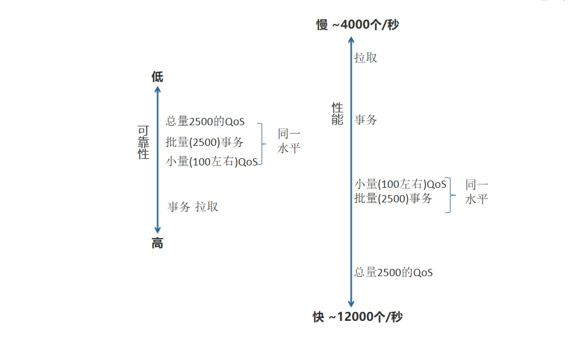
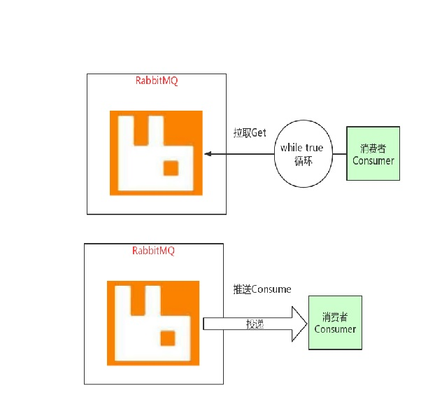

# 4. 消息消费时的权衡

## 4.1 可靠性和性能的权衡

<a data-fancybox title="rabbitmq" href="./image/rabbitmq36.jpg"></a>


## 4.2 消息的获得方式

<a data-fancybox title="rabbitmq" href="./image/rabbitmq41.jpg"></a>

### 4.2.1 拉取Get(不提倡)
属于一种轮询模型，发送一次 get 请求，获得一个消息。如果此时 RabbitMQ 中没有消息，会获得一个表示空的回复。总的来说，这种方式性能比较差，很明显每获得一条消息，都要和 RabbitMQ 进行网络通信发出请求。而且对 RabbitMQ 来说，RabbitMQ 无法进行任何优化，因为它永远不知道应用 程序何时会发出请求。具体使用，参见代码 native 模块包 cn.enjoyedu.consumer_balance.GetMessage 中。对我们实现者来说，要在一个循环里，不断去服务器 get 消息。

```java
package com.tqk.consumer_balance.getmessage;

import com.rabbitmq.client.Channel;
import com.rabbitmq.client.Connection;
import com.rabbitmq.client.ConnectionFactory;
import com.rabbitmq.client.GetResponse;

import java.io.IOException;
import java.util.concurrent.TimeoutException;

/**
 *类说明：消费者——拉取模式
 */
public class GetMessageConsumer {


    public static void main(String[] argv)
            throws IOException, TimeoutException, InterruptedException {
        /**
         * 创建连接连接到RabbitMQ
         */
        //创建连接、连接到RabbitMQ
        ConnectionFactory connectionFactory= new ConnectionFactory();
        //设置下连接工厂的连接地址(使用默认端口5672)
        connectionFactory.setHost("110.42.146.236");
        connectionFactory.setPort(5672);
        connectionFactory.setUsername("tqk001");
        connectionFactory.setPassword("12345@tqk");

        // 打开连接和创建频道，与发送端一样
        Connection connection = connectionFactory.newConnection();
        final Channel channel = connection.createChannel();

        channel.exchangeDeclare(GetMessageProducer.EXCHANGE_NAME,
                "direct");
        // 声明一个队列
        String queueName = "focuserror";
        channel.queueDeclare(queueName,
                false,false,
                false,null);

        String routekey="error";//只关注error级别的日志，然后记录到文件中去。
        channel.queueBind(queueName,
                GetMessageProducer.EXCHANGE_NAME, routekey);

        System.out.println(" [*] Waiting for messages......");
        //TODO 无限循环拉取
        while(true){
            //拉一条，自动确认的(rabbit 认为这条消息消费 -- 从队列中删除)
            GetResponse getResponse = channel.basicGet(queueName, false);
            if(null!=getResponse){
                System.out.println("received["
                        +getResponse.getEnvelope().getRoutingKey()+"]"
                        +new String(getResponse.getBody()));
            }
            //确认(自动、手动)
            channel.basicAck(0,true);
            Thread.sleep(1000);
        }
    }
}
```

### 4.2.2 推送 Consume 

属于一种推送模型。注册一个消费者后，RabbitMQ 会在消息可用时，自动将消息进行推送给消费者。这种模式我们已经使用过很多次了，具体使用， 参见代码 native 模块包 cn.enjoyedu.exchange.direct 中。

前边用的案例全是推送模式

## 4.3 消息的应答

前面说过，消费者收到的每一条消息都必须进行确认。消息确认后，RabbitMQ 才会从队列删除这条消息，RabbitMQ 不会为未确认的消息设置超时时间，它判断此消息是否需要重新投递给消费者的唯一依据是消费该消息的消费者连接是否已经断开。这么设计的原因是 RabbitMQ 允许消费者消费一条消息的时间可以很久很久。

### 4.3.1 自动确认 

消费者在声明队列时，可以指定 autoAck 参数，当 autoAck=true 时，一旦消费者接收到了消息，就视为自动确认了消息。如果消费者在处理消息的过程中，出了错，就没有什么办法重新处理这条消息，**所以我们很多时候，需要在消息处理成功后，再确认消息，这就需要手动确认**。

### 4.3.2 手动确认 

当 **autoAck=false**时，RabbitMQ 会等待消费者显式发回 ack 信号后才从内存(和磁盘，如果是持久化消息的话)中移去消息。否则，RabbitMQ 会在队列 中消息被消费后立即删除它。 

采用消息确认机制后，只要令 autoAck=false，消费者就有足够的时间处理消息(任务)，不用担心处理消息过程中消费者进程挂掉后消息丢失的问题， 因为 RabbitMQ 会一直持有消息直到消费者显式调用 basicAck 为止。 

当 autoAck=false 时，对于 RabbitMQ 服务器端而言，队列中的消息分成了两部分：一部分是等待投递给消费者的消息；一部分是已经投递给消费者， 但是还没有收到消费者 ack 信号的消息。如果服务器端一直没有收到消费者的 ack 信号，并且消费此消息的消费者已经断开连接，则服务器端会安排该消 息重新进入队列，等待投递给下一个消费者（也可能还是原来的那个消费者）。 

如何使用，参见代码 native 模块包 com.tqk.consumer_balance.ackfalse 中。 

```java
package com.tqk.consumer_balance.ackfalse;

import com.rabbitmq.client.*;

import java.io.IOException;
import java.util.concurrent.TimeoutException;

/**
 *类说明：消息者对消息进行确认（手动确认）
 */
public class AckFalseConsumerB {

    public static void main(String[] argv)
            throws IOException, TimeoutException {
        /**
         * 创建连接连接到RabbitMQ
         */
        //创建连接、连接到RabbitMQ
        ConnectionFactory connectionFactory= new ConnectionFactory();
        //设置下连接工厂的连接地址(使用默认端口5672)
        connectionFactory.setHost("110.42.146.236");
        connectionFactory.setPort(5672);
        connectionFactory.setUsername("tqk001");
        connectionFactory.setPassword("12345@tqk");

        // 打开连接和创建频道，与发送端一样
        Connection connection = connectionFactory.newConnection();
        final Channel channel = connection.createChannel();
        channel.exchangeDeclare(AckFalseProducer.EXCHANGE_NAME,
                "direct");

        /*声明一个队列*/
        String queueName = "focuserror";
        channel.queueDeclare(queueName,false,false,
                false,null);

        /*绑定，将队列和交换器通过路由键进行绑定*/
        String routekey = "error";/*表示只关注error级别的日志消息*/
        channel.queueBind(queueName,AckFalseProducer.EXCHANGE_NAME,routekey);

        System.out.println("waiting for message........");

        /*声明了一个消费者*/
        final Consumer consumer = new DefaultConsumer(channel){
            @Override
            public void handleDelivery(String consumerTag,
                                       Envelope envelope,
                                       AMQP.BasicProperties properties,
                                       byte[] body) throws IOException {
                String message = new String(body, "UTF-8");
                System.out.println("Received["+envelope.getRoutingKey()
                        +"]"+message);
                //TODO 这里进行确认
                System.out.println("手动确认的tag:"+envelope.getDeliveryTag());
                channel.basicAck(envelope.getDeliveryTag(),false);
            }
        };
        /*消费者正式开始在指定队列上消费消息*/
        //TODO 这里第二个参数是自动确认参数，如果是false则是手动确认
        channel.basicConsume(queueName,false,consumer);


    }

}

```

通过运行程序，启动两个消费者 A、B，都可以收到消息，但是其中有一个消费者 A 不会对消息进行确认，当把这个消费者 A 关闭后，消费者 B 又会 收到本来发送给消费者 A 的消息。所以我们一般使用手动确认的方法是，将消息的处理放在 try/catch 语句块中，成功处理了，就给 RabbitMQ 一个确认应 答，如果处理异常了，就在 catch 中，进行消息的拒绝，如何拒绝，参考消息的拒绝章节。

## 4.4 QoS 预取模式

在确认消息被接收之前，消费者可以预先要求接收一定数量的消息，在处理完一定数量的消息后，批量进行确认。如果消费者应用程序在确认消息之前崩溃，则所有未确认的消息将被重新发送给其他消费者。所以这里存在着一定程度上的可靠性风险。 

这种机制一方面可以实现限速（将消息暂存到 RabbitMQ 内存中）的作用，一方面可以保证消息确认质量（比如确认了但是处理有异常的情况）。 

注意：**消费确认模式必须是非自动 ACK 机制（这个是使用 baseQos 的前提条件，否则会 Qos 不生效），然后设置 basicQos 的值；**另外，还可以基于 consume 和 channel 的粒度进行设置（global）。 具体使用，参见代码 native 模块包 com.tqk.consumer_balance.qos 中。我们可以进行批量确认，也可以进行单条确认

```java
package com.tqk.consumer_balance.qos;

import com.rabbitmq.client.*;
import com.tqk.consumer_balance.ackfalse.BatchAckConsumer;

import java.io.IOException;
import java.util.concurrent.TimeoutException;

/**

 *类说明：普通的消费者
 */
public class QosConsumerMain {

    public static void main(String[] argv)
            throws IOException, TimeoutException {
        /**
         * 创建连接连接到RabbitMQ
         */
        //创建连接、连接到RabbitMQ
        ConnectionFactory connectionFactory= new ConnectionFactory();
        //设置下连接工厂的连接地址(使用默认端口5672)
        connectionFactory.setHost("110.42.146.236");
        connectionFactory.setPort(5672);
        connectionFactory.setUsername("tqk001");
        connectionFactory.setPassword("12345@tqk");

        // 打开连接和创建频道，与发送端一样
        Connection connection = connectionFactory.newConnection();
        final Channel channel = connection.createChannel();
        channel.exchangeDeclare(QosProducer.EXCHANGE_NAME,
                "direct");

        /*声明一个队列*/
        String queueName = "focuserror";
        channel.queueDeclare(queueName,false,false,
                false,null);

        /*绑定，将队列和交换器通过路由键进行绑定*/
        String routekey = "error";/*表示只关注error级别的日志消息*/
        channel.queueBind(queueName,QosProducer.EXCHANGE_NAME,routekey);

        System.out.println("waiting for message........");

        /*声明了一个消费者*/
        final Consumer consumer = new DefaultConsumer(channel){
            @Override
            public void handleDelivery(String consumerTag,
                                       Envelope envelope,
                                       AMQP.BasicProperties properties,
                                       byte[] body) throws IOException {
                String message = new String(body, "UTF-8");
                System.out.println("Received["+envelope.getRoutingKey()
                        +"]"+message);
                //TODO 单条确认
//                channel.basicAck(envelope.getDeliveryTag(),true);
            }
        };

        //TODO 如果是两个消费者(QOS ,批量)则轮询获取数据

        //TODO 150条预取(150都取出来 150， 210-150  60  )
        channel.basicQos(150,true);
        /*消费者正式开始在指定队列上消费消息*/
        channel.basicConsume(queueName,false,consumer);
//        //TODO 自定义消费者批量确认
//        BatchAckConsumer batchAckConsumer = new BatchAckConsumer(channel);
//        channel.basicConsume(queueName,false,batchAckConsumer);


    }

}

```
## 4.5 消费者中的事务

使用方法和生产者一致 假设消费者模式中使用了事务，并且在消息确认之后进行了事务回滚，会是什么样的结果？ 

结果分为两种情况：
1. autoAck=false 手动应对的时候是支持事务的，也就是说即使你已经手动确认了消息已经收到了，但 RabbitMQ 对消息的确认会等事务的返回结果，再做最终决定是确认消息还是重新放回队列，如果你手动确认之后，又回滚了事务，那么以事务回滚为准，此条消息会重新放回队列；

2. autoAck=true 如果自动确认为 true 的情况是不支持事务的，也就是说你即使在收到消息之后在回滚事务也是于事无补的，队列已经把消息移除了