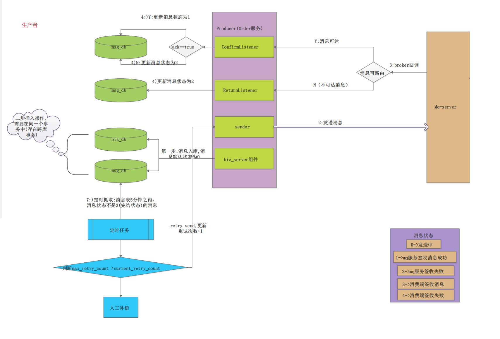
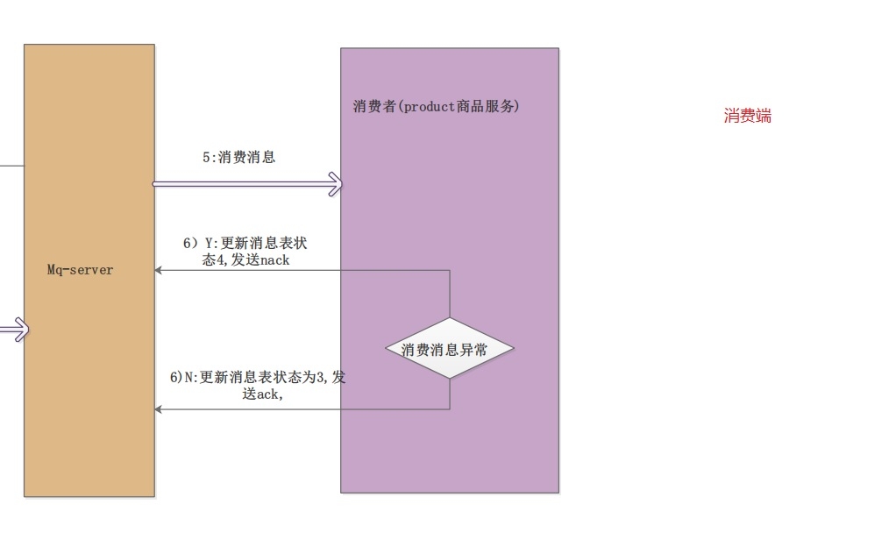
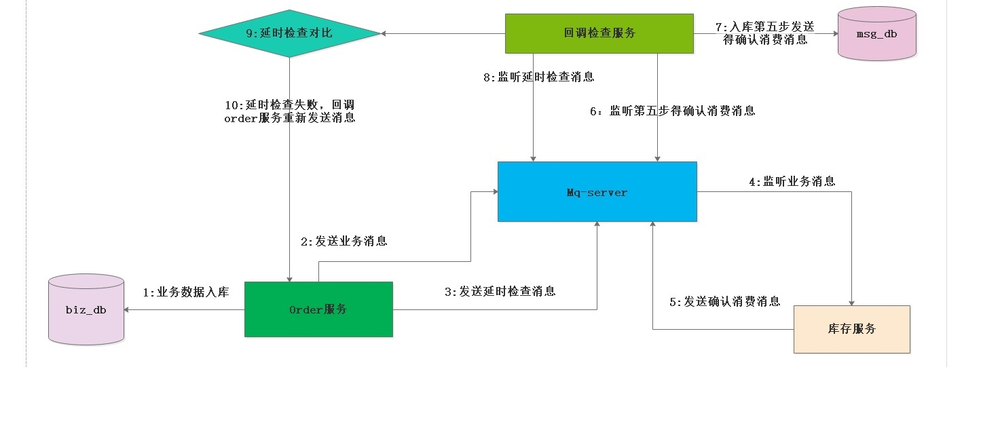

# 9. 消息的可靠性投递解决方案

## 9.1 什么是生产端的可靠性投递

1. 保障消息成功发送出去--发送方确认
2. 保障mq节点成功接收消息
3. 消息发送端需要收到mq服务的确认应答--失败回调
4. 完善的消息补偿机制（百分百成功成功 需要该步骤）

## 9.2 分布式事务解决方案

<a href="http://101.43.21.33:8888/group1/M00/00/00/CgAQBWGfJ9uAFLjIAACTeTGw5n0138.pdf" text="分布式事务解决方案">分布式事务解决方案</a>


**生产者**

<a data-fancybox title="rabbitmq" href="./image/shengchanzhe.jpg"></a>

**消费者**

<a data-fancybox title="rabbitmq" href="./image/xiaofeizhe.jpg"></a>

### 9.2.1 消息入库打标解决思路

**(Order_Serve调用物流服务举列子)在消息生产者端(也就是订单服务)**

:::tip 正常链路流程
第一步(该环节调用了操作了二次数据库):在创建订单的操作的时候，把数据插入到订单相关的表中,并且构造调用物流模块的数据消息，把消息插入到消息表中,初始状态为0

第二步: 把物流消息投递到消息队列中,

第三步: 消息队列访问一个确认消息,并且由订单服务来监控mqserver的确认消息

第四步: 根据收到的确认消息来更新数据库中的消息记录的状态
:::

------------------

:::tip 异常链路流程
第一步(该环节调用了操作了二次数据库): 在创建订单的操作的时候，把数据插入到订单相关的表中,并且构造调用物流模块的数据消息，把消息插入到消息表中,初始状态为0

第二步: 把物流消息投递到消息队列中

第三步: 由于网络闪断，导致消费端监控mq服务访问的确认消息没有收到，那么在msg_db中的那条消息的状态永远就是0状态。这个时候，我们需要对这种情况下做出补偿

:::

---------------

:::tip 补偿机制:
1. 启动一个分布式的定时任务,不定时的去扫描msg_db的这个表，状态为0的消息记录，在这里我们可以根据业务来设置扫描重发规则
2. 规则1:插入msg_db表中5Min后状态还是为0的记录，进行消息重试
3. 规则2:若重试的次数超过五次状态还是为0的话，我们就把消息状态改为2,此时我们需要**人工的去确认**状态为2的消息是什么原因导致没有成功的
:::


:::tip 消息入库打标的缺点:

在第一步的过程中，既插入了业务数据表，也同时插入了消息记录表，进行了二次db操作，在高并发的环境下，这个环境就会造成性能瓶颈
:::

**主要步骤如下**

### 9.2.2 消息入库，发送消息到MQ

```java
package com.tqk.order.service.impl;

import com.fasterxml.jackson.core.JsonProcessingException;
import com.tqk.order.bo.MsgTxtBo;
import com.tqk.order.compent.MsgSender;
import com.tqk.order.constants.MqConst;
import com.tqk.order.entity.MessageContent;
import com.tqk.order.entity.OrderInfo;
import com.tqk.order.enumuration.MsgStatusEnum;
import com.tqk.order.mapper.MsgContentMapper;
import com.tqk.order.mapper.OrderInfoMapper;
import com.tqk.order.service.IOrderInfoService;
import lombok.extern.slf4j.Slf4j;
import org.springframework.amqp.rabbit.core.RabbitTemplate;
import org.springframework.beans.factory.annotation.Autowired;
import org.springframework.stereotype.Service;
import org.springframework.transaction.annotation.Transactional;

import java.util.Date;
import java.util.UUID;

/**
* @vlog: 高于生活，源于生活
* @desc: 类的描述
* @author: smlz
* @createDate: 2019/10/11 15:29
* @version: 1.0
*/
@Slf4j
@Service
public class OrderInfoServiceImpl implements IOrderInfoService {

    @Autowired
    private OrderInfoMapper orderInfoMapper;

    @Autowired
    private MsgContentMapper msgContentMapper;

    @Autowired
    private MsgSender msgSender;

    @Transactional(rollbackFor =Exception.class )
    @Override
    public void saveOrderInfo(OrderInfo orderInfo, MessageContent messageContent) {

        try {
            /**
             *
             */
            //插入订单表
            orderInfoMapper.saveOrderInfo(orderInfo);

            //插入消息表
            msgContentMapper.saveMsgContent(messageContent);

        }catch (Exception e) {
            log.error("操作数据库失败:{}",e);
            throw new RuntimeException("操作数据库失败");
        }
    }

    /**
     * 保存数据库并发送消息
     * @param orderInfo
     * @throws JsonProcessingException
     */
    @Override
    public void saveOrderInfoWithMessage(OrderInfo orderInfo) throws JsonProcessingException {

        //构建消息对象
        MessageContent messageContent = builderMessageContent(orderInfo.getOrderNo(),orderInfo.getProductNo());

        //保存数据库
        //todo 如果保存数据库失败，事务回滚，并且不会发送消息
        saveOrderInfo(orderInfo,messageContent);

        //构建消息发送对象
        MsgTxtBo msgTxtBo = new MsgTxtBo();
        msgTxtBo.setMsgId(messageContent.getMsgId());
        msgTxtBo.setOrderNo(orderInfo.getOrderNo());
        msgTxtBo.setProductNo(orderInfo.getProductNo());

        //发送消息
        msgSender.senderMsg(msgTxtBo);
    }


    /**
     * 方法实现说明:构建消息对象
     * @author:smlz
     * @return:MessageContent 消息实体
     * @exception:
     * @date:2019/10/11 17:24
     */
    private MessageContent builderMessageContent(long orderNo,Integer productNo) {
        MessageContent messageContent = new MessageContent();
        String msgId = UUID.randomUUID().toString();
        messageContent.setMsgId(msgId);
        messageContent.setCreateTime(new Date());
        messageContent.setUpdateTime(new Date());
        messageContent.setExchange(MqConst.ORDER_TO_PRODUCT_EXCHANGE_NAME);
        messageContent.setRoutingKey(MqConst.ORDER_TO_PRODUCT_QUEUE_NAME);
        messageContent.setMsgStatus(MsgStatusEnum.SENDING.getCode());
        messageContent.setOrderNo(orderNo);
        messageContent.setProductNo(productNo);
        messageContent.setMaxRetry(MqConst.MSG_RETRY_COUNT);
        return messageContent;
    }
}
```
### 9.2.3 消费者消费消息


```java
package com.tqk.product.compent;

import com.fasterxml.jackson.databind.ObjectMapper;
import com.rabbitmq.client.Channel;
import com.tqk.product.bo.MsgTxtBo;
import com.tqk.product.entity.MessageContent;
import com.tqk.product.enumration.MsgStatusEnum;
import com.tqk.product.execption.BizExp;
import com.tqk.product.mapper.MsgContentMapper;
import com.tqk.product.service.ProductService;
import lombok.extern.slf4j.Slf4j;
import org.springframework.amqp.core.Message;
import org.springframework.amqp.rabbit.annotation.RabbitHandler;
import org.springframework.amqp.rabbit.annotation.RabbitListener;
import org.springframework.beans.factory.annotation.Autowired;
import org.springframework.data.redis.core.RedisTemplate;
import org.springframework.stereotype.Component;

import java.io.IOException;
import java.util.Date;

/**
 * 消息消费处理类
 */
@Component
@Slf4j
public class MqConsumer {

    /**队列名称*/
    public static final String ORDER_TO_PRODUCT_QUEUE_NAME = "order-to-product.queue";

    public static final String LOCK_KEY="LOCK_KEY";

    @Autowired
    private ProductService productService;

    @Autowired
    private MsgContentMapper msgContentMapper;

    @Autowired
    private RedisTemplate redisTemplate;

    /**
     * 没有加分布式锁的版本,可能存在重复消费问题
     * @param message
     * @param channel
     * @throws IOException
     */
/*    @RabbitListener(queues = {ORDER_TO_PRODUCT_QUEUE_NAME})
    @RabbitHandler
    public void consumerMsg(Message message, Channel channel) throws IOException {

        ObjectMapper objectMapper = new ObjectMapper();
        MsgTxtBo msgTxtBo = objectMapper.readValue(message.getBody(),MsgTxtBo.class);

        log.info("消费消息:{}",msgTxtBo);
        Long deliveryTag = (Long) message.getMessageProperties().getDeliveryTag();

        try {
            //更新消息表也业务表
            productService.updateProductStore(msgTxtBo);

            //消息签收
            channel.basicAck(deliveryTag,false);
        }catch (Exception e) {
            //更新msg表为消费失败
            //更新消息表状态
            MessageContent messageContent = new MessageContent();
            messageContent.setMsgId(msgTxtBo.getMsgId());
            messageContent.setUpdateTime(new Date());
            messageContent.setMsgStatus(MsgStatusEnum.CONSUMER_FAIL.getCode());
            msgContentMapper.updateMsgStatus(messageContent);

            channel.basicReject(deliveryTag,false);
        }
    }*/


    @RabbitListener(queues = {ORDER_TO_PRODUCT_QUEUE_NAME})
    @RabbitHandler
    public void consumerMsgWithLock(Message message, Channel channel) throws IOException {

        ObjectMapper objectMapper = new ObjectMapper();
        MsgTxtBo msgTxtBo = objectMapper.readValue(message.getBody(), MsgTxtBo.class);
        Long deliveryTag = (Long) message.getMessageProperties().getDeliveryTag();

        if (redisTemplate.opsForValue().setIfAbsent(LOCK_KEY + msgTxtBo.getMsgId(), msgTxtBo.getMsgId())) {
            log.info("start==============消费消息:{}", msgTxtBo);
            try {
                //更新消息表也业务表
                productService.updateProductStore(msgTxtBo);
                System.out.println("更新库存业务表成功!!");
                //消息签收
                //todo 模拟网络抖动，导致发送ack确认消息失败
//                System.out.println(1/0);
                System.out.println("模拟网络抖动，导致发送消息失败!!");
                channel.basicAck(deliveryTag, false);
            } catch (Exception e) {
                /**
                 * 更新数据库异常说明业务没有操作成功需要删除分布式锁
                 */
                if (e instanceof BizExp) {
                    BizExp bizExp = (BizExp) e;
                    log.info("数据业务异常:{},即将删除分布式锁", bizExp.getErrMsg());
                    log.info("为什么要删除这个锁呢?因为这个订单实际库存处理失败,还是可以重复发消息处理的,所以删除分布式锁!");
                    //删除分布式锁
                    redisTemplate.delete(LOCK_KEY);
                }else{
                    log.info("模拟网络抖动，导致发送消息失败!!!!!这种业务处理已成功,消息状态存在问题,需要人工干预!!!");
                }
                //更新消息表状态
                MessageContent messageContent = new MessageContent();
                messageContent.setMsgStatus(MsgStatusEnum.CONSUMER_FAIL.getCode());
                messageContent.setUpdateTime(new Date());
                messageContent.setErrCause(e.getMessage());
                messageContent.setMsgId(msgTxtBo.getMsgId());
                msgContentMapper.updateMsgStatus(messageContent);
                channel.basicReject(deliveryTag,false);
            }

        } else {
            log.warn("请不要重复消费消息{}", msgTxtBo);
            channel.basicReject(deliveryTag,false);
        }

    }
}

```

### 9.2.4 生产者更新消费表
```java
package com.tqk.order.compent;

import com.tqk.order.entity.MessageContent;
import com.tqk.order.enumuration.MsgStatusEnum;
import com.tqk.order.mapper.MsgContentMapper;
import lombok.extern.slf4j.Slf4j;
import org.springframework.amqp.rabbit.connection.CorrelationData;
import org.springframework.amqp.rabbit.core.RabbitTemplate;
import org.springframework.beans.factory.annotation.Autowired;
import org.springframework.stereotype.Component;

import java.util.Date;

/**
 * @desc: 类的描述:消息确认组件 发送方确认
 * @author: tqk
 */
@Component
@Slf4j
public class MsgComfirm implements RabbitTemplate.ConfirmCallback {

    @Autowired
    private MsgContentMapper msgContentMapper;

    /**
     * 发送方确认机制
     * @param correlationData
     * @param ack
     * @param cause
     */
    @Override
    public void confirm(CorrelationData correlationData, boolean ack, String cause) {
        String msgId = correlationData.getId();

        if(ack) {
            log.info("消息Id:{}对应的消息被broker签收成功",msgId);
            //todo 消息投递成功,更新消息表数据
            updateMsgStatusWithAck(msgId);
            System.out.println("消息投递成功,更新消息表数据成功!");
        }else{
            log.warn("消息Id:{}对应的消息被broker签收失败:{}",msgId,cause);
            //todo 消息投递失败,更新消息表数据
            updateMsgStatusWithNack(msgId,cause);
            System.out.println("消息投递失败,更新消息表数据!");
        }
    }

    /**
     * 方法实现说明:更新消息表状态为发送成功
     * @author:tqk
     * @param msgId:消息ID
     */
    private void updateMsgStatusWithAck(String msgId) {
        MessageContent messageContent = builderUpdateContent(msgId);
        messageContent.setMsgStatus(MsgStatusEnum.SENDING_SUCCESS.getCode());
        msgContentMapper.updateMsgStatus(messageContent);
    }
    /**
     * 方法实现说明:更新消息表状态为发送失败
     * @author:tqk
     * @param msgId:消息ID
     */
    private void updateMsgStatusWithNack(String msgId,String cause){

        MessageContent messageContent = builderUpdateContent(msgId);

        messageContent.setMsgStatus(MsgStatusEnum.SENDING_FAIL.getCode());
        messageContent.setErrCause(cause);
        msgContentMapper.updateMsgStatus(messageContent);
    }

    private MessageContent builderUpdateContent(String msgId) {
        MessageContent messageContent = new MessageContent();
        messageContent.setMsgId(msgId);
        messageContent.setUpdateTime(new Date());
        return messageContent;
    }
}

```
```java
package com.tqk.order.compent;

import com.fasterxml.jackson.databind.ObjectMapper;
import com.tqk.order.bo.MsgTxtBo;
import com.tqk.order.entity.MessageContent;
import com.tqk.order.enumuration.MsgStatusEnum;
import com.tqk.order.mapper.MsgContentMapper;
import lombok.extern.slf4j.Slf4j;
import org.springframework.amqp.core.ReturnedMessage;
import org.springframework.amqp.rabbit.core.RabbitTemplate;
import org.springframework.beans.factory.annotation.Autowired;
import org.springframework.stereotype.Component;

import java.util.Date;

/**
 * @desc: 类的描述:消息不可达监听 失败返回确认
 * @author: tqk
 */
@Component
@Slf4j
public class MsgRetrunListener implements RabbitTemplate.ReturnsCallback {
    @Autowired
    private MsgContentMapper msgContentMapper;

    @Override
    public void returnedMessage(ReturnedMessage returnedMessage) {
        try{
            ObjectMapper objectMapper = new ObjectMapper();
            MsgTxtBo msgTxtBo = objectMapper.readValue(returnedMessage.getMessage().getBody(),MsgTxtBo.class);
            log.info("无法路由消息内容:{},cause:{}",msgTxtBo,returnedMessage.getReplyText());
            //构建消息对象
            MessageContent messageContent = new MessageContent();
            messageContent.setErrCause(returnedMessage.getReplyText());
            messageContent.setUpdateTime(new Date());
            messageContent.setMsgStatus(MsgStatusEnum.SENDING_FAIL.getCode());
            messageContent.setMsgId(msgTxtBo.getMsgId());
            //更新消息表
            msgContentMapper.updateMsgStatus(messageContent);
        }catch (Exception e) {
            log.error("更新消息表异常:{}",e);
            //new 一个自定义异常继续往外抛
        }
    }
}

```

### 9.2.4 定时任务处理

```java
package com.tqk.order.task;

import com.tqk.order.bo.MsgTxtBo;
import com.tqk.order.compent.MsgSender;
import com.tqk.order.constants.MqConst;
import com.tqk.order.entity.MessageContent;
import com.tqk.order.enumuration.MsgStatusEnum;
import com.tqk.order.mapper.MsgContentMapper;
import lombok.extern.slf4j.Slf4j;
import org.springframework.beans.factory.annotation.Autowired;
import org.springframework.scheduling.annotation.Scheduled;
import org.springframework.stereotype.Component;

import java.util.List;

/**
 * tqk
 */
@Component
@Slf4j
public class RetryMsgTask {

    @Autowired
    private MsgSender msgSender;

    @Autowired
    private MsgContentMapper msgContentMapper;

    /**
     * 延时5s启动
     * 周期10S一次
     */
    @Scheduled(initialDelay = 10000,fixedDelay = 10000)
    public void retrySend() {
        System.out.println("-----------------------------");
        //查询五分钟消息状态还没有完结的消息
        List<MessageContent> messageContentList = msgContentMapper.qryNeedRetryMsg(MsgStatusEnum.CONSUMER_SUCCESS.getCode(), MqConst.TIME_DIFF);

        for(MessageContent messageContent:messageContentList) {

            if(messageContent.getMaxRetry()>messageContent.getCurrentRetry()) {
                MsgTxtBo msgTxtBo = new MsgTxtBo();
                msgTxtBo.setMsgId(messageContent.getMsgId());
                msgTxtBo.setProductNo(messageContent.getProductNo());
                msgTxtBo.setOrderNo(messageContent.getOrderNo());
                //更新消息重试次数
                msgContentMapper.updateMsgRetryCount(msgTxtBo.getMsgId());
                msgSender.senderMsg(msgTxtBo);
            }else {
                log.warn("消息:{}以及达到最大重试次数",messageContent);
            }

        }
    }
}
```
## 9.3 延时投递，做二次确认检测，回调检测

<a data-fancybox title="rabbitmq" href="./image/yanshijiancha.jpg"></a>

**具体代码见项目**
Mq-DeleyCheck-Callback  
Mq-DeleyCheck-Order  
Mq-DeleyCheck-Product  

