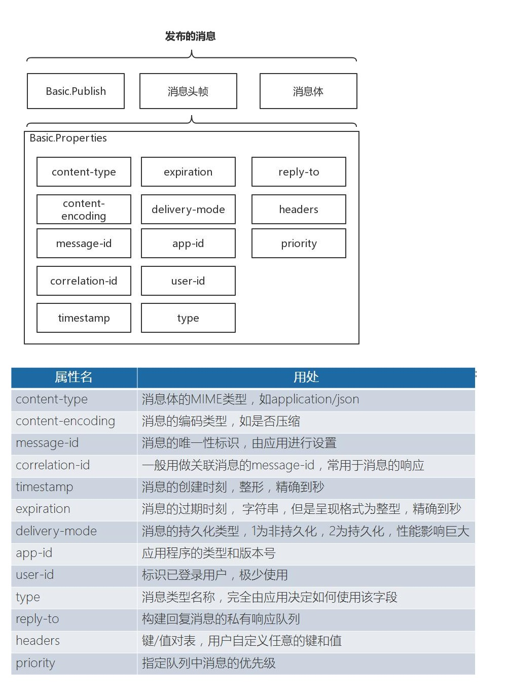
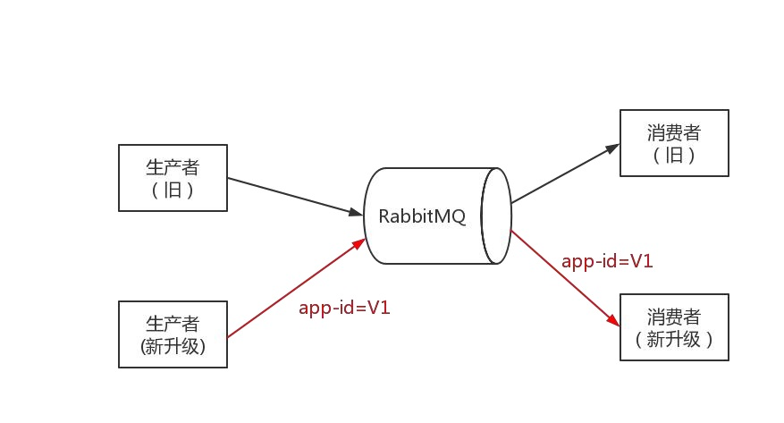
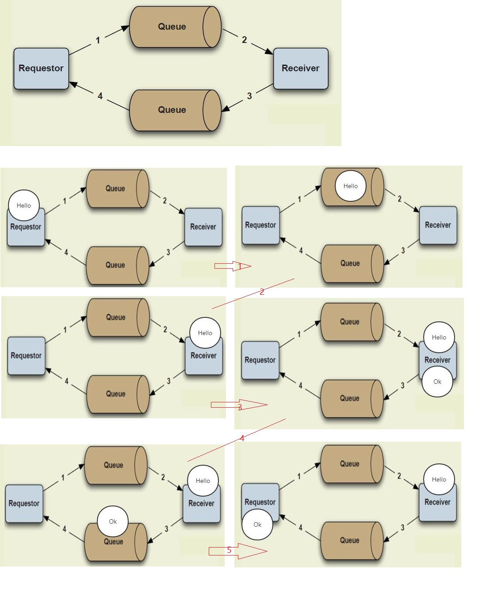

# 7. 消息属性

消息标准化可以减少开发人员重复使用的痛苦，所以 RabbitMQ 对消息进行了如下标准化： 按照 AMQP 的协议单个最大的消息大小为 16EB（2 的 64 次方），但是 RabbitMQ 将消息大小限定为 2GB（2 的 31 次方）。
<a data-fancybox title="rabbitmq" href="./image/rabbitmq71.jpg"></a>


## 7.1 消息存活时间 

当队列消息的 TTL 和消息 TTL 都被设置，时间短的 TTL 设置生效。 如果将一个过期消息发送给 RabbitMQ，该消息不会路由到任何队列，而是直接丢弃。为消息设置 TTL 有一个问题：RabbitMQ 只对处于队头的消息判断是否过期（即不会扫描队列），所以很可能队列中已存在死消息，但是队列并不知情。这会影响队列统计数据的正确性，妨碍队列及时释放资源。

## 7.2 消息的持久化 

默认情况下，队列和交换器在服务器重启后都会消失，消息当然也是。将队列和交换器的 durable 属性设为 true，缺省为 false，但是消息要持久化还 不够，还需要将消息在发布前，将投递模式设置为 2。消息要持久化，必须要有持久化的队列、交换器和投递模式都为 2。 消息属性的设置方法，包括如何将消息的持久化，参见代码

```java
package com.tqk.msg.durable;

import com.rabbitmq.client.*;

import java.io.IOException;
import java.util.concurrent.TimeoutException;

/**

 *类说明：消息持久化的消费者
 */
public class MsgAttrConsumer {

    public static void main(String[] argv)
            throws IOException, TimeoutException {
        /**
         * 创建连接连接到RabbitMQ
         */
        //创建连接、连接到RabbitMQ
        ConnectionFactory connectionFactory= new ConnectionFactory();
        //设置下连接工厂的连接地址(使用默认端口5672)
        connectionFactory.setHost("110.42.146.236");
        connectionFactory.setPort(5672);
        connectionFactory.setUsername("tqk001");
        connectionFactory.setPassword("12345@tqk");

        // 打开连接和创建频道，与发送端一样
        Connection connection = connectionFactory.newConnection();

        final Channel channel = connection.createChannel();
        /*创建持久化交换器*/
        channel.exchangeDeclare(MsgAttrProducer.EXCHANGE_NAME,
                "direct",true);

        /*声明一个持久化队列*/
        String queueName = "msgdurable";
        channel.queueDeclare(queueName,true,false,
                false,null);

        /*绑定，将队列和交换器通过路由键进行绑定*/
        String routekey = "error";/*表示只关注error级别的日志消息*/
        channel.queueBind(queueName, MsgAttrProducer.EXCHANGE_NAME,routekey);

        System.out.println("waiting for message........");

        /*声明了一个消费者*/
        final Consumer consumer = new DefaultConsumer(channel){
            @Override
            public void handleDelivery(String consumerTag,
                                       Envelope envelope,
                                       AMQP.BasicProperties properties,
                                       byte[] body) throws IOException {
                String message = new String(body, "UTF-8");
                System.out.println("Received["+envelope.getRoutingKey()
                        +"]"+message);
            }
        };
        /*消费者正式开始在指定队列上消费消息*/
        channel.basicConsume(queueName,true,consumer);


    }

}
```

## 7.3 应用程序的类型和版本号 

<a data-fancybox title="rabbitmq" href="./image/rabbitmq73.jpg"></a>

## 7.4 Request-Response 模式 

我们前面的学习模式中都是一方负责发送消息而另外一方负责处理。而我们实际中的很多应用相当于一种一应一答的过程，需要双方都能给对方发送消息。于是请求-应答的这种通信方式也很重要。它也应用的很普遍。
<a data-fancybox title="rabbitmq" href="./image/rabbitmq74.jpg"></a>

```java
package com.tqk.msg.set;

import com.rabbitmq.client.*;

import java.io.IOException;
import java.util.concurrent.TimeoutException;

/**

 *类说明：消息的属性的控制
 */
public class ReplyToConsumer {

    public static void main(String[] argv)
            throws IOException, TimeoutException {
        /**
         * 创建连接连接到RabbitMQ
         */
        //创建连接、连接到RabbitMQ
        ConnectionFactory connectionFactory= new ConnectionFactory();
        //设置下连接工厂的连接地址(使用默认端口5672)
        connectionFactory.setHost("110.42.146.236");
        connectionFactory.setPort(5672);
        connectionFactory.setUsername("tqk001");
        connectionFactory.setPassword("12345@tqk");

        // 打开连接和创建频道，与发送端一样
        Connection connection = connectionFactory.newConnection();
        final Channel channel = connection.createChannel();
        /*创建交换器*/
        channel.exchangeDeclare(ReplyToProducer.EXCHANGE_NAME,
                "direct",false);

        /*声明一个队列*/
        String queueName = "replyto";
        channel.queueDeclare(queueName,false,false,
                false,null);

        /*绑定，将队列和交换器通过路由键进行绑定*/
        String routekey = "error";/*表示只关注error级别的日志消息*/
        channel.queueBind(queueName,ReplyToProducer.EXCHANGE_NAME,routekey);

        System.out.println("waiting for message........");

        /*声明了一个消费者*/
        final Consumer consumer = new DefaultConsumer(channel){
            @Override
            public void handleDelivery(String consumerTag,
                                       Envelope envelope,
                                       AMQP.BasicProperties properties,
                                       byte[] body) throws IOException {
                String message = new String(body, "UTF-8");
                System.out.println("Received["+envelope.getRoutingKey()
                        +"]"+message);
                AMQP.BasicProperties respProp
                        = new AMQP.BasicProperties.Builder()
                        .replyTo(properties.getReplyTo())
                        .correlationId(properties.getMessageId())
                        .build();

                channel.basicPublish("", respProp.getReplyTo() ,
                        respProp ,
                        ("  OK,"+message).getBytes("UTF-8"));
           }
        };
        /*消费者正式开始在指定队列上消费消息*/
        channel.basicConsume(queueName,true,consumer);
    }

}
```

-----------------

```java
package com.tqk.msg.set;

import com.rabbitmq.client.*;

import java.io.IOException;
import java.util.UUID;
import java.util.concurrent.TimeoutException;

/**

 *类说明：消息的属性的控制
 */
public class ReplyToProducer {

    public final static String EXCHANGE_NAME = "replyto";

    public static void main(String[] args)
            throws IOException, TimeoutException {
        /**
         * 创建连接连接到RabbitMQ
         */
        //创建连接、连接到RabbitMQ
        ConnectionFactory connectionFactory= new ConnectionFactory();
        //设置下连接工厂的连接地址(使用默认端口5672)
        connectionFactory.setHost("110.42.146.236");
        connectionFactory.setPort(5672);
        connectionFactory.setUsername("tqk001");
        connectionFactory.setPassword("12345@tqk");

        // 打开连接和创建频道，与发送端一样
        Connection connection = connectionFactory.newConnection();

        /*创建信道*/
        Channel channel = connection.createChannel();
        /*创建持久化交换器*/
        channel.exchangeDeclare(EXCHANGE_NAME,"direct",false);

        //响应QueueName ，消费者将会把要返回的信息发送到该Queue
        String responseQueue = channel.queueDeclare().getQueue();
        //消息的唯一id
        String msgId = UUID.randomUUID().toString();
        AMQP.BasicProperties properties = new AMQP.BasicProperties.Builder()
                .replyTo(responseQueue)
                .messageId(msgId)
                .build();

        /*声明了一个消费者*/
        final Consumer consumer = new DefaultConsumer(channel){
            @Override
            public void handleDelivery(String consumerTag,
                                       Envelope envelope,
                                       AMQP.BasicProperties properties,
                                       byte[] body) throws IOException {
                String message = new String(body, "UTF-8");
                System.out.println("Received["+envelope.getRoutingKey()
                        +"]"+message);
            }
        };
        /*消费者正式开始在指定队列上消费消息*/
        channel.basicConsume(responseQueue,true,consumer);

        String msg = "Hellol,RabbitMq";
        channel.basicPublish(EXCHANGE_NAME,"error",
                properties,
                msg.getBytes());
        System.out.println("Sent error:"+msg);
    }

}

```
