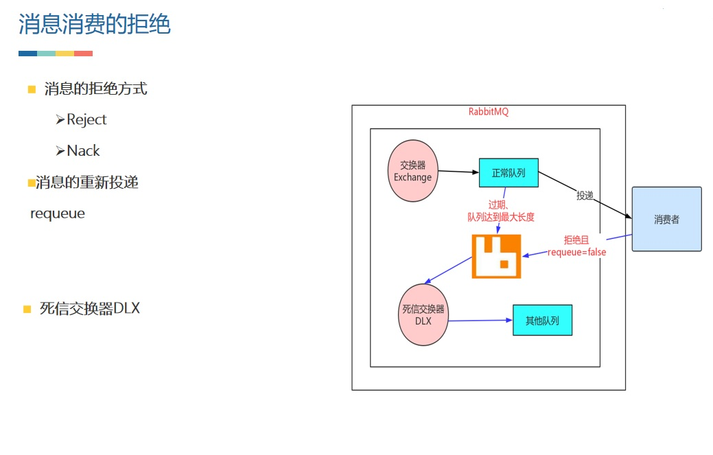
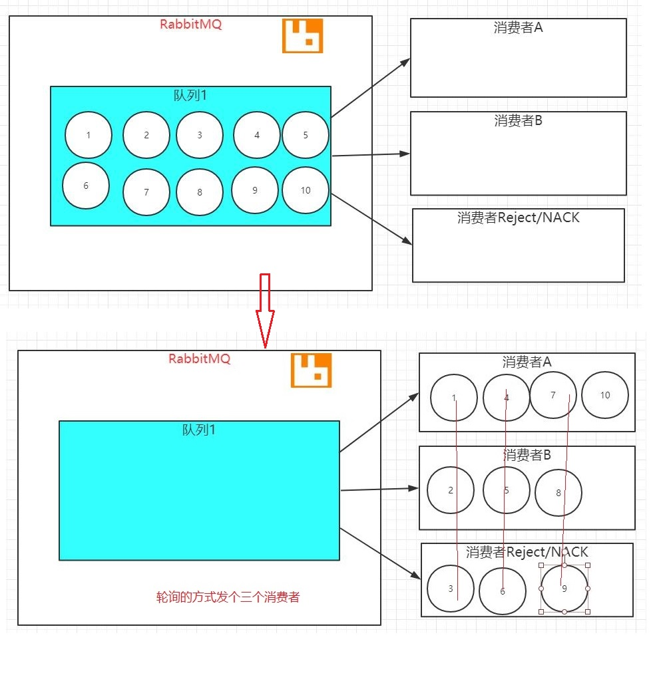
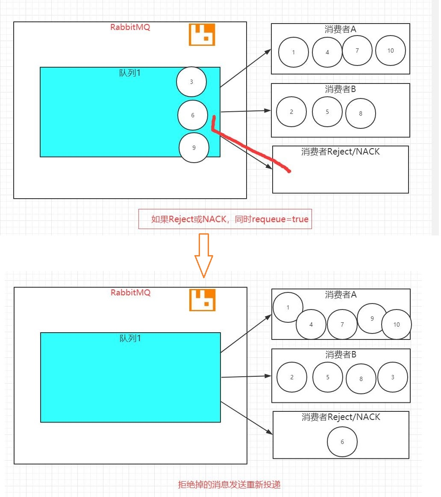
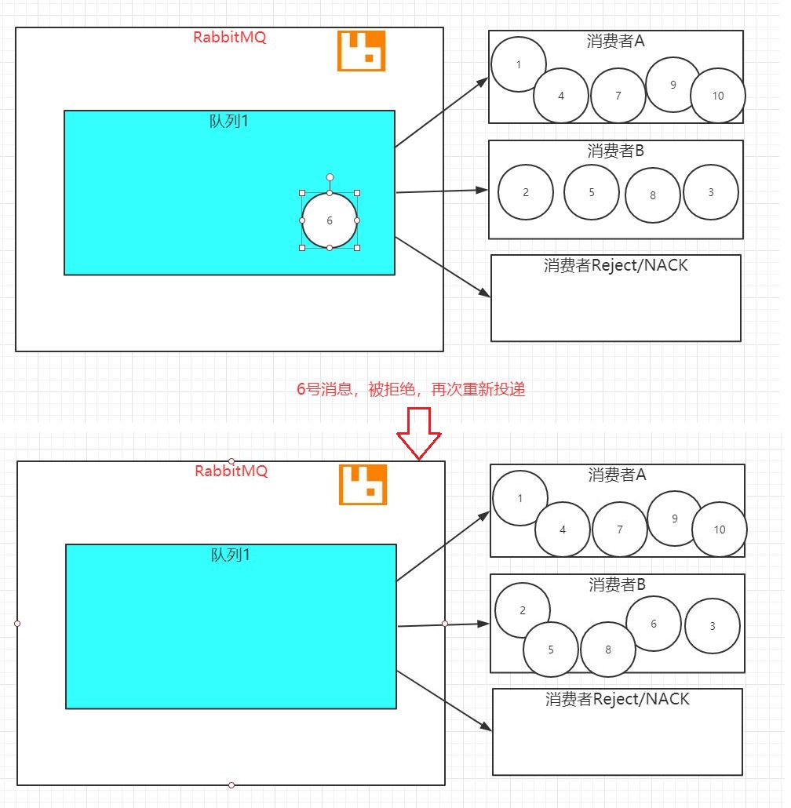
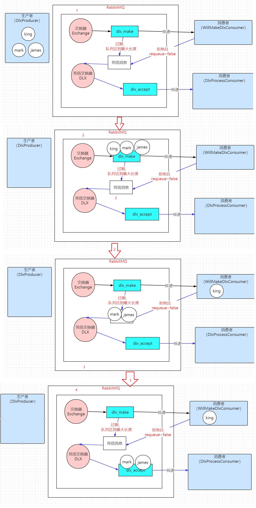

# 5. 消息的拒绝

<a data-fancybox title="rabbitmq" href="./image/rabbitmq51.jpg"></a>

## 5.1 Reject 和 Nack 
消息确认可以让 RabbitMQ 知道消费者已经接受并处理完消息。但是如果消息本身或者消息的处理过程出现问题怎么办？需要一种机制，通知 RabbitMQ，这个消息，我无法处理，请让别的消费者处理。这里就有两种机制，Reject 和 Nack。

Reject 在拒绝消息时，可以使用 requeue 标识，告诉 RabbitMQ 是否需要重新发送给别的消费者。如果是 false 则不重新发送，一般这个消息就会被 RabbitMQ 丢弃。Reject 一次只能拒绝一条消息。如果是 true 则消息发生了重新投递。 

Nack 跟 Reject 类似，只是它可以一次性拒绝多个消息。也可以使用 requeue 标识，这是 RabbitMQ 对 AMQP 规范的一个扩展。 
 
具体使用，参见代码 native 模块包 com.tqk.rejectmsg 中。通过 RejectRequeuConsumer 可以看到无论是使用 Reject 方式还是 Nack 方式，
----
**当 requeue 参数设置为 true 时，消息发生了重新投递。**
**当 requeue 参数设置为 false 时，消息丢失了。**

### 5.1.1 requeue=true

消息队列中有 10 条消息，有三个消费者，有两个消费可以正常消费消息，有一个消费进行消息的拒绝，同时设置 requeue 参数设置为 true，我们来 看下具体的过程。

1. 三个消费者订阅一个队列，消息使用轮询的方式进行发送
<a data-fancybox title="rabbitmq" href="./image/rabbitmq52.jpg"></a>

2. 有一个消费者拒绝消息，同时 requeue 参数设置为 true，消息准备进行重新投递 
<a data-fancybox title="rabbitmq" href="./image/rabbitmq53.jpg"></a>

3. 再使用消息轮询的方式，把三条消息方便发送至三个消费者，其中又会发生一次消息拒绝和消息的重新投递。
<a data-fancybox title="rabbitmq" href="./image/rabbitmq54.jpg"></a>


```java
package com.tqk.msg.rejected;

import com.rabbitmq.client.*;

import java.io.IOException;
import java.util.concurrent.TimeoutException;

/**

 *类说明：普通的消费者
 */
public class RejectRequeuConsumer {

    public static void main(String[] argv)
            throws IOException, TimeoutException {
        /**
         * 创建连接连接到RabbitMQ
         */
        //创建连接、连接到RabbitMQ
        ConnectionFactory connectionFactory= new ConnectionFactory();
        //设置下连接工厂的连接地址(使用默认端口5672)
        connectionFactory.setHost("110.42.146.236");
        connectionFactory.setPort(5672);
        connectionFactory.setUsername("tqk001");
        connectionFactory.setPassword("12345@tqk");

        // 打开连接和创建频道，与发送端一样
        Connection connection = connectionFactory.newConnection();
        final Channel channel = connection.createChannel();
        channel.exchangeDeclare(RejectProducer.EXCHANGE_NAME,
                BuiltinExchangeType.DIRECT);

        /*声明一个队列*/
        String queueName = "rejectrequeue";
        channel.queueDeclare(queueName,false,false,
                false,null);

        /*绑定，将队列和交换器通过路由键进行绑定*/
        String routekey = "error";/*表示只关注error级别的日志消息*/
        channel.queueBind(queueName,RejectProducer.EXCHANGE_NAME,routekey);

        System.out.println("waiting for message........");

        /*声明了一个消费者*/
        final Consumer consumer = new DefaultConsumer(channel){
            @Override
            public void handleDelivery(String consumerTag,
                                       Envelope envelope,
                                       AMQP.BasicProperties properties,
                                       byte[] body) throws IOException {
                try{
                    String message = new String(body, "UTF-8");
                    System.out.println("Received["
                            +envelope.getRoutingKey()
                            +"]"+message);
                    throw new RuntimeException("处理异常"+message);
                }catch (Exception e){
                    e.printStackTrace();
                    //TODO Reject方式拒绝(这里第2个参数决定是否重新投递)
                    channel.basicReject(envelope.getDeliveryTag(),false);

                    //TODO Nack方式的拒绝（第2个参数决定是否批量）
//                    channel.basicNack(envelope.getDeliveryTag(), false, false);
                }

            }
        };
        /*消费者正式开始在指定队列上消费消息*/
        channel.basicConsume(queueName,false,consumer);


    }

}
```

## 5.2 死信交换器 DLX

### 5.2.1 死信交换器 DLX概念与使用 
前面我们看到，如果使用消息拒绝机制，同时 requeue 参数设置为 false 时，消息丢失了，这点作为程序员我们不能忍。所以 RabbitMQ 作为一个高级消息中间件，提出了**死信交换器**的概念，死信，意思就是死了的信息。这种交换器专门处理死了的信息（被拒绝可以重新投递的信息不能算死的）。 

死信交换器是 RabbitMQ 对 AMQP 规范的一个扩展，往往用在对问题消息的诊断上（主要针对消费者），还有延时队列的功能。 

消息变成死信一般是以下三种情况： 
1. 消息被拒绝，并且设置 requeue 参数为 false 
2. 消息过期（默认情况下 Rabbit 中的消息不过期，但是可以设置队列的过期时间和消息的过期时间以达到消息过期的效果） 
3. 队列达到最大长度（一般当设置了最大队列长度或大小并达到最大值时） 死信交换器仍然只是一个普通的交换器，创建时并没有特别要求和操作。在创建队列的时候，声明该交换器将用作保存被拒绝的消息即可，相关的参数是 x-dead-letter-exchange。

```java
package com.tqk.msg.dix;

import com.rabbitmq.client.*;

import java.io.IOException;
import java.util.HashMap;
import java.util.Map;
import java.util.concurrent.TimeoutException;

/**

 *类说明：普通的消费者,但是自己无法消费的消息，将投入死信队列
 */
public class WillMakeDlxConsumer {

    public static void main(String[] argv)
            throws IOException, TimeoutException {
        /**
         * 创建连接连接到RabbitMQ
         */
        //创建连接、连接到RabbitMQ
        ConnectionFactory connectionFactory= new ConnectionFactory();
        //设置下连接工厂的连接地址(使用默认端口5672)
        connectionFactory.setHost("110.42.146.236");
        connectionFactory.setPort(5672);
        connectionFactory.setUsername("tqk001");
        connectionFactory.setPassword("12345@tqk");

        // 打开连接和创建频道，与发送端一样
        Connection connection = connectionFactory.newConnection();

        final Channel channel = connection.createChannel();
        channel.exchangeDeclare(DlxProducer.EXCHANGE_NAME,
                BuiltinExchangeType.TOPIC);
        //TODO 绑定死信交换器
        /*声明一个队列，并绑定死信交换器*/
        String queueName = "dlx_make";
        Map<String,Object> args = new HashMap<String,Object>();
        args.put("x-dead-letter-exchange", DlxProcessConsumer.DLX_EXCHANGE_NAME);
        //TODO 死信路由键，会替换消息原来的路由键
        //args.put("x-dead-letter-routing-key", "deal");
        channel.queueDeclare(queueName,false,true,
                false,
                args);

        /*绑定，将队列和交换器通过路由键进行绑定*/
        channel.queueBind(queueName,
                DlxProducer.EXCHANGE_NAME,"#");

        System.out.println("waiting for message........");

        /*声明了一个消费者*/
        final Consumer consumer = new DefaultConsumer(channel){
            @Override
            public void handleDelivery(String consumerTag,
                                       Envelope envelope,
                                       AMQP.BasicProperties properties,
                                       byte[] body) throws IOException {
                String message = new String(body, "UTF-8");
                //TODO
                //TODO 如果是king的消息确认
                if(envelope.getRoutingKey().equals("king")){
                    System.out.println("Received["
                            +envelope.getRoutingKey()
                            +"]"+message);
                    channel.basicAck(envelope.getDeliveryTag(),
                            false);
                }else{
                    //TODO 如果是其他的消息拒绝（queue=false），成为死信消息
                    System.out.println("Will reject["
                            +envelope.getRoutingKey()
                            +"]"+message);
                    channel.basicReject(envelope.getDeliveryTag(),
                            false);
                }

            }
        };
        /*消费者正式开始在指定队列上消费消息*/
        channel.basicConsume(queueName,false,consumer);


    }

}
```
<a data-fancybox title="rabbitmq" href="./image/rabbitmq55.jpg"></a>

通过运行程序可以看到，生产者 DlxProducer 产生了 3 条消息，分别是 king,mark,james，消费者 WillMakeDlxConsumer 都拒绝了两条消息（mark 和 james）
同时设置 requeue 参数为 false，这样这两条消息会被作为死信消息，同时在主交换器中，绑定对应的死信交换器，这样死信消息会通过死信交换器投递到对应绑定的死信队列上（dlx_accept）， 这样 DlxProcessConsumer 消费者就能看到消息的消费，同时这样死信消息还是保持原有的路由键。 如果是我们还想做点其他事情，我们可以在死信交换的时候改变死信消息的路由键，具体的相关的参数是 x-dead-letter-routing-key

### 5.2.2 和备用交换器的区别 

1. 备用交换器是主交换器无法路由消息，那么消息将被路由到这个新的备用交换器，而死信交换器则是接收过期或者被拒绝的消息。 

2. 备用交换器是在声明主交换器时发生联系，而死信交换器则声明队列时发生联系。 

**场景分析：**
备用交换器一般是用于生产者生产消息时，确保消息可以尽量进入 RabbitMQ,

而死信交换器主要是用于消费者消费消息的万不一失性的场 景（比如消息过期，队列满了，消息拒绝且不重新投递