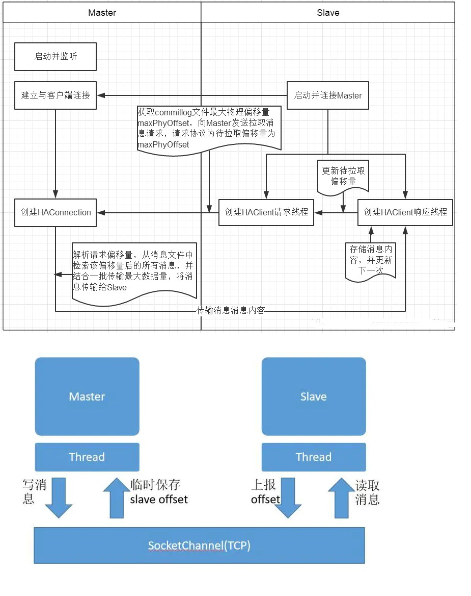
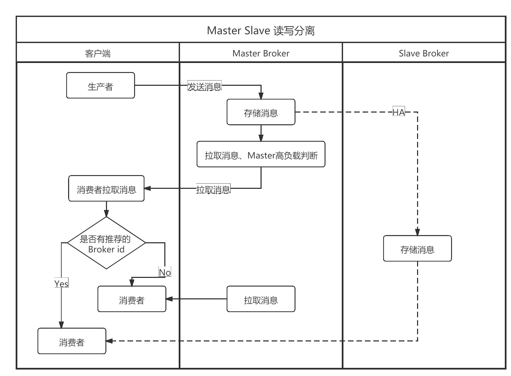
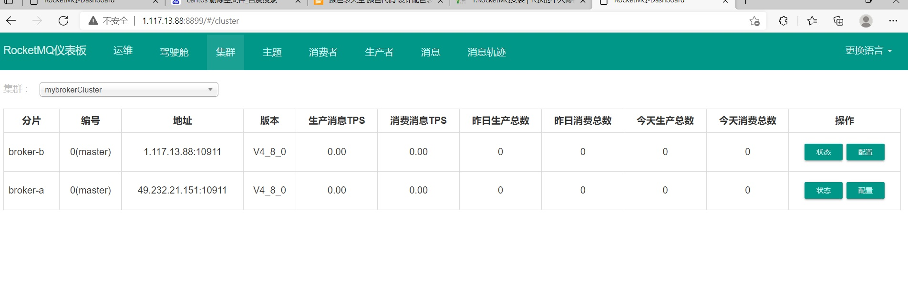

# 5. RocketMQ主从架构

## 5.1 RocketMQ集群部署模式

### 5.1.1 单 master 模式 

也就是只有一个 master 节点，称不上是集群，一旦这个 master 节点宕机，那么整个服务就不可用。 

### 5.1.2 多 master 模式 

多个 master 节点组成集群，单个 master 节点宕机或者重启对应用没有影响。 

**优点**：所有模式中性能最高 

**缺点**：单个 master 节点宕机期间，未被消费的消息在节点恢复之前不可用，消息的实时性就受到影响。 

注意：**使用同步刷盘可以保证消息不丢失**，同时 Topic 相对应的 queue 应该分布在集群中各个节点，而不是只在某各节点上，否则，该节点宕机会对订阅该 topic 的应用造成影响。 

### 5.1.3 多 master 多 slave 异步复制模式 

在多 master 模式的基础上，每个 master 节点都有至少一个对应的 slave。master 节点可读可写，但是 slave 只能读不能写，类似于 mysql 的主备 模式。

**优点**： 一般情况下都是 master 消费，在 master 宕机或超过负载时，消费者可以从 slave 读取消息，消息的实时性不会受影响，性能几乎和多 master 一样。

**缺点**：使用异步复制的同步方式有可能会有消息丢失的问题。

### 5.1.4 多 master 多 slave 同步双写模式 

同多 master 多 slave 异步复制模式类似，区别在于 master 和 slave 之间的数据同步方式。 

**优点**：同步双写的同步模式能保证数据不丢失。 

**缺点**：发送单个消息响应时间会略长，性能相比异步复制低 10%左右。 

**同步方式**：同步双写和异步复制（指的一组 master 和 slave 之间数据的同步） 
**刷盘策略**：同步刷盘和异步刷盘（指的是节点自身数据是同步还是异步存储进入磁盘） 

**注意**：对数据要求较高的场景，建议的持久化策略是**主 broker 和从 broker 采用同步复制方式，主从 broker 都采用异步刷盘方式**。

通过同步复制方式， 保存数据热备份，通过异步刷盘方式，保证 rocketMQ 高吞吐量。

## 5.2 主从复制原理

:::tip RocketMQ 主从同步（HA）实现过程如下： 

1. 主服务器启动，并在特定端口上监听从服务器的连接。 

2. 从服务器主动连接主服务器，主服务器接受客户端的连接，并建立相关 TCP 连接。 

3. 从服务器主动向服务器发送待拉取消息偏移 ，主服务器解析请求并返回消息给从服务器。

4. 从服务器保存消息并继续发送新的消息同步请求。 
:::
<a data-fancybox title="RocketMQ" href="./image/zhucongfuzhi.jpg"></a>


***核心实现***

**从服务器**在启动的时候**主动向主服务器建立 TCP 长连接**，然后获取服务器的 commitlog 最大偏移，以此偏移向主服务器主动拉取消息，主服务器根据偏移量，与自身 commitlog 文件的最大偏移进行比较，如果大于从服务器 commitlog 偏移 ，主服务器将向从服务器返回一定数量的消息， 该过程循环进行 ，达到主从服务器数据同步。


## 5.3 读写分离机制 

RocketMQ 读写分离与他中间件的实现方式完全不同， RocketMQ 是消费者首先服务器发起拉取消息请求，然后主服务器返回一批消息，然后会<font color='#f15a22'>根据主服务器负载压力与主从同步情况</font>，向从服务器建议下次消息拉取是从主服务器还是从从服务器拉取。 

那消息服务端是根据何种规则来建议哪个消息消费队列该从哪台 Broker 服务器上拉取消息呢？ 

一般都是<font color='#f15a22'>从主服务器拉取</font>，如果主阶段拉取的消息已经超出了常驻内存的大小，表示主服务器繁忙，此时从从服务器拉取。

如果主服务器繁忙则建议下次从从服务器拉取消息，设置 suggestWhichBrokerld 配置文件中 whichBrokerWhenConsumeSlowly 属性，默认为 1。如果一个 Master 拥有多台 Slave 服务器，参与消息拉取负载的从服务器只会是其中一个。

<a data-fancybox title="RocketMQ" href="./image/duxiefenli.jpg"></a>


## 5.4 双主模式搭建

### 5.4.1 下载解压安装包

```sh
unzip  rocketmq-all-4.8.0-bin-release.zip
```
### 5.4.2 修改配置文件以及脚本

#### 配置文件修改

```sh
## 服务器-A：49.232.21.151
cd /root/MQ/rocketmq-all-4.8.0-bin-release/conf/2m-noslave
vi broker-a.properties
# 所属集群名字
brokerClusterName=mybrokerCluster
# broker名字
brokerName=broker-a
# 0 表示 Master，>0 表示 Slave
brokerId=0
deleteWhen=04
fileReservedTime=48
# broker角色  ASYNC_MASTER 异步复制Master  ASYNC_MASTER 异步复制Master
brokerRole=ASYNC_MASTER
# 刷盘方式 ASYNC_FLUSH --异步刷盘； SYNC_FLUSH --同步刷盘
flushDiskType=ASYNC_FLUSH

# nameServer地址，分号分割
namesrvAddr=49.232.21.151:9876;127.0.0.2:9876

## 当前broker监听的IP--外网访问使用
## brokerIP1 当前broker监听的IP brokerIP2 存在broker主从时，在broker主节点上配置了brokerIP2的话,broker从节点会连接主节点配置的brokerIP2来同步
brokerIP1=49.232.21.151

# Broker 对外服务的监听端口
#listenPort=10911

#--------------------------------------
## 服务器-B：1.117.13.88
cd /root/MQ/rocketmq-all-4.8.0-bin-release/conf/2m-noslave
vi broker-b.properties


# 所属集群名字
brokerClusterName=mybrokerCluster
# broker名字
brokerName=broker-b
# 0 表示 Master，>0 表示 Slave
brokerId=0
deleteWhen=04
fileReservedTime=48
# broker角色  ASYNC_MASTER 异步复制Master  ASYNC_MASTER 异步复制Master
brokerRole=ASYNC_MASTER
# 刷盘方式 ASYNC_FLUSH --异步刷盘； SYNC_FLUSH --同步刷盘
flushDiskType=ASYNC_FLUSH

# nameServer地址，分号分割
namesrvAddr=49.232.21.151:9876;1.117.13.88:9876

## 当前broker监听的IP--外网访问使用
## brokerIP1 当前broker监听的IP brokerIP2 存在broker主从时，在broker主节点上配置了brokerIP2的话,broker从节点会连接主节点配置的brokerIP2来同步
brokerIP1=1.117.13.88
```
#### 修改脚本参数

```sh
vi runbroker.sh           --broker的配置
JAVA_OPT="${JAVA_OPT} -server  -Xms128m -Xmx256m -Xmn256m -XX:MetaspaceSize=128m -XX:MaxMetaspaceSize=128m"
vi runserver.sh            --nameServer的配置
JAVA_OPT="${JAVA_OPT} -server  -Xms128m -Xmx256m -Xmn256m"

```
### 5.4.3 启动服务

**启动步骤：(记得关闭防火墙或者要开通9876端口)**

```sh

cd /root/mq/rocketmq-all-4.8.0-bin-release/bin

# 1.启动NameServer集群
    nohup sh mqnamesrv &
    nohup sh mqnamesrv & 

#2.启动双主集群，顺序是先启动主，然后启动从。

    #启动主A:  autoCreateTopicEnable=true 测试环境开启，生产环境建议关闭）：

    nohup sh mqbroker -c ../conf/2m-noslave/broker-a.properties  autoCreateTopicEnable=true & tail -f ~/logs/rocketmqlogs/broker.log

    #启动主B:  
    nohup sh mqbroker -c ../conf/2m-noslave/broker-b.properties  autoCreateTopicEnable=true & tail -f ~/logs/rocketmqlogs/broker.log
	
# 每台服务器查看日志：tail -f ~/logs/rocketmqlogs/broker.log
	
```
### 5.4.3 控制台打包启动

:::tip maven打包服务
1. F:\安装包\MQ\ROCKET\rocketmq-dashboard-master\src\main\resources打开‘application.properties’进行配置。（多个NameServer使用;分隔）

```
rocketmq.config.namesrvAddr=49.232.21.151:9876;1.117.13.88:9876
```

2. 在F:\安装包\MQ\ROCKET\rocketmq-dashboard-master目录， 执行‘
```
mvn clean package -Dmaven.test.skip=true
```
编译生成。

3. 在把编译后的jar包丢上服务器：
```
nohup java -jar rocketmq-dashboard-2.0.0.jar &
```
:::
<a data-fancybox title="RocketMQ" href="./image/jiqun2.jpg"></a>

## 5.5 双主双从同步搭建

```
服务器相关配置信息：

-----------------	
注意，默认RocketMQ会吃8G，所以需要修改默认加载内存设置。
修改broker启动脚本runbroker.sh里面的jvm参数
JAVA_OPT="${JAVA_OPT} -server -Xms8g -Xmx8g -Xmn4g"改为
JAVA_OPT="${JAVA_OPT} -server -Xms128m -Xmx256m -Xmn256m"

NameServer集群
192.168.56.102        
192.168.56.103

Broker服务器：
192.168.56.102             ------主A
192.168.56.103             ------主B
192.168.56.104             ------从A
192.168.56.105             ------从B

注意，因为RocketMQ使用外网地址，所以配置文件(MQ文件夹/conf/2m-2s-sync/)需要修改(同时修改nameserver地址为集群地址)：
192.168.56.102             ------主A     
broker-a.properties      增加： brokerIP1=192.168.56.102
		               namesrvAddr=192.168.56.102:9876;192.168.56.103:9876

192.168.56.103             ------主B
broker-b.properties      增加： brokerIP1=192.168.56.103
			namesrvAddr=192.168.56.102:9876;192.168.56.103:9876
								
192.168.56.104             ------从A
broker-a-s.properties      增加：brokerIP1=192.168.56.104
			namesrvAddr=192.168.56.102:9876;192.168.56.103:9876
								
192.168.56.105             ------从B
broker-b-s.properties      增加：brokerIP1=192.168.56.105
			 namesrvAddr=192.168.56.102:9876;192.168.56.103:9876


启动步骤：(记得关闭防火墙或者要开通9876端口)
1.启动NameServer集群，这里使用102和103两台作为集群即可。
    1） 在机器A，启动第1台NameServer:  102服务器进入至‘MQ文件夹/bin’下：然后执行‘nohup sh mqnamesrv &’ 
    2） 在机器B，启动第2台NameServer:  103服务器进入至‘MQ文件夹/bin’下：然后执行‘nohup sh mqnamesrv &’   

2.启动双主双从同步集群，顺序是先启动主，然后启动从。
    3）启动主A:     102服务器进入至‘MQ文件夹/bin’下：执行以下命令（autoCreateTopicEnable=true 测试环境开启，生产环境建议关闭）：
	
	nohup sh mqbroker -c ../conf/2m-2s-sync/broker-a.properties  autoCreateTopicEnable=true &
	
	4）启动主B:     103服务器进入至‘MQ文件夹\bin’下：执行以下命令：
	nohup sh mqbroker -c ../conf/2m-2s-sync/broker-b.properties  autoCreateTopicEnable=true &
	
	5）启动从A:     104服务器进入至‘MQ文件夹\bin’下：执行以下命令：
	nohup sh mqbroker -c ../conf/2m-2s-sync/broker-a-s.properties  autoCreateTopicEnable=true &
	
	6）启动从B:     105服务器进入至‘MQ文件夹\bin’下：执行以下命令：
	nohup sh mqbroker -c ../conf/2m-2s-sync/broker-b-s.properties  autoCreateTopicEnable=true &
	
	每台服务器查看日志：tail -f ~/logs/rocketmqlogs/broker.log
	


如果是要启动控制台，则需要重新打包：

进入‘\rocketmq-console\src\main\resources’文件夹，打开‘application.properties’进行配置。（多个NameServer使用;分隔）
rocketmq.config.namesrvAddr=192.168.56.102:9876;192.168.56.103:9876

进入‘\rocketmq-externals\rocketmq-console’文件夹，执行‘mvn clean package -Dmaven.test.skip=true’，编译生成。

在把编译后的jar包丢上服务器：
nohup java -jar rocketmq-console-ng-1.0.1.jar &

```


## 5.6 双主双从异步搭建

```
服务器相关配置信息：

-----------------	
注意，默认RocketMQ会吃8G，所以需要修改默认加载内存设置。
修改broker启动脚本runbroker.sh里面的jvm参数
JAVA_OPT="${JAVA_OPT} -server -Xms8g -Xmx8g -Xmn4g"改为
JAVA_OPT="${JAVA_OPT} -server -Xms128m -Xmx256m -Xmn256m"

NameServer集群
192.168.56.102        
192.168.56.103

Broker服务器：
192.168.56.102             ------主A
192.168.56.103             ------主B
192.168.56.104             ------从A
192.168.56.105             ------从B

注意，因为RocketMQ使用外网地址，所以配置文件(MQ文件夹/conf/2m-2s-async/)需要修改(同时修改nameserver地址为集群地址)：
192.168.56.102             ------主A     
broker-a.properties      增加： brokerIP1=192.168.56.102
		               namesrvAddr=192.168.56.102:9876;192.168.56.103:9876

192.168.56.103             ------主B
broker-b.properties      增加： brokerIP1=192.168.56.103
			namesrvAddr=192.168.56.102:9876;192.168.56.103:9876
								
192.168.56.104             ------从A
broker-a-s.properties      增加：brokerIP1=192.168.56.104
			namesrvAddr=192.168.56.102:9876;192.168.56.103:9876
								
192.168.56.105             ------从B
broker-b-s.properties      增加：brokerIP1=192.168.56.105
			 namesrvAddr=192.168.56.102:9876;192.168.56.103:9876


启动步骤：(记得关闭防火墙或者要开通9876端口)
1.启动NameServer集群，这里使用102和103两台作为集群即可。
    1） 在机器A，启动第1台NameServer:  102服务器进入至‘MQ文件夹/bin’下：然后执行‘nohup sh mqnamesrv &’ 
    2） 在机器B，启动第2台NameServer:  103服务器进入至‘MQ文件夹/bin’下：然后执行‘nohup sh mqnamesrv &’   

2.启动双主双从同步集群，顺序是先启动主，然后启动从。
    3）启动主A:     102服务器进入至‘MQ文件夹/bin’下：执行以下命令（autoCreateTopicEnable=true 测试环境开启，生产环境建议关闭）：
	
	nohup sh mqbroker -c ../conf/2m-2s-async/broker-a.properties  autoCreateTopicEnable=true &
	
	4）启动主B:     103服务器进入至‘MQ文件夹\bin’下：执行以下命令：
	nohup sh mqbroker -c ../conf/2m-2s-async/broker-b.properties  autoCreateTopicEnable=true &
	
	5）启动从A:     104服务器进入至‘MQ文件夹\bin’下：执行以下命令：
	nohup sh mqbroker -c ../conf/2m-2s-async/broker-a-s.properties  autoCreateTopicEnable=true &
	
	6）启动从B:     105服务器进入至‘MQ文件夹\bin’下：执行以下命令：
	nohup sh mqbroker -c ../conf/2m-2s-async/broker-b-s.properties  autoCreateTopicEnable=true &
	
	每台服务器查看日志：tail -f ~/logs/rocketmqlogs/broker.log
	


如果是要启动控制台，则需要重新打包：

进入‘\rocketmq-console\src\main\resources’文件夹，打开‘application.properties’进行配置。（多个NameServer使用;分隔）
rocketmq.config.namesrvAddr=192.168.56.102:9876;192.168.56.103:9876

进入‘\rocketmq-externals\rocketmq-console’文件夹，执行‘mvn clean package -Dmaven.test.skip=true’，编译生成。

在把编译后的jar包丢上服务器：
nohup java -jar rocketmq-console-ng-1.0.1.jar &
```