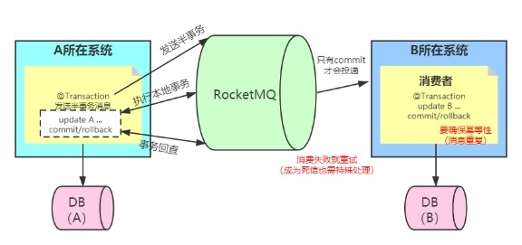

# 4. 分布式事务

业务场景：用户A转账100元给用户B，这个业务比较简单，具体的步骤：
1. 用户A的账户先扣除100元 
2. 再把用户B的账户加100元
如果在同一个数据库中进行，事务可以保证这两步操作，要么同时成功，要么同时不成功。这样就保证了转账的数据一致性。  
但是在微服务架构中，因为各个服务都是独立的模块，都是远程调用，都没法在同一个事务中，都会遇到事务问题。  
因为各个服务都是独立的模块，都是远程调用，都没法在同一个事务中，都会遇到事务问题。  

------------

消息中间件的方式，把扣款业务和加钱业务异步化，扣款成功后，发送“扣款成功消息”到消息中间件；加钱业务订阅“扣款成功消息”，再对用户B加钱（系统怎么知道给用户B加钱呢？是消息体里面包含了源账户和目标账户ID，以及钱数）

----------

**场景一：先扣款后向MQ发消息**  
先扣款再发送消息，万一发送消息失败了，那用户B就没法加钱

---------------

**场景二：先向MQ发像消息，后扣款**  
扣款成功消息发送成功，但用户A扣款失败，可加钱业务订阅到了消息，用户B加了钱
问题所在，也就是没法保证扣款和发送消息，同时成功，或同时失败；导致数据不一致。

----------------

RocketMq消息中间件把消息分为两个阶段：半事务阶段和确认阶段阶段

**半事务阶段：**  
该阶段主要发一个消息到rocketmq，但该消息只储存在commitlog中，但consumeQueue中不可见，也就是消费端（订阅端）无法看到此消息

**commit/rollback阶段（确认阶段）：**  
该阶段主要是把prepared消息保存到consumeQueue中，即让消费端可以看到此消息，也就是可以消费此消息。如果是rollback就不保存。

**整个流程：**  
1. A在扣款之前，先发送半事务消息
2. 发送预备消息成功后，执行本地扣款事务
3. 扣款成功后，再发送确认消息
4. B消息端（加钱业务）可以看到确认消息，消费此消息，进行加钱
注意：上面的确认消息可以为commit消息，可以被订阅者消费；也可以是Rollback消息，即执行本地扣款事务失败后，提交rollback消息，即删除那个预备消息，订阅者无法消费

-----------------

异常1：如果发送半事务消息失败，下面的流程不会走下去；这个是正常的  
异常2：如果发送半事务消息成功，但执行本地事务失败；这个也没有问题，因为此预备消息不会被消费端订阅到，消费端不会执行业务。  
异常3：如果发送半事务消息成功，执行本地事务成功，但发送确认消息失败；这个就有问题了，因为用户A扣款成功了，但加钱业务没有订阅到确认消息，无法加钱。这里出现了数据不一致。  

--------------

RocketMq如何解决上面的问题，核心思路就是【事务回查】，也就是RocketMq会定时遍历commitlog中的半事务消息。
异常3，发送半事务消息成功，本地扣款事务成功，但发送确认消息失败；因为RocketMq会进行回查半事务消息，在回查后发现业务已经扣款成功了，就补发“发送commit确认消息”；这样加钱业务就可以订阅此消息了。
这个思路其实把异常2也解决了，如果本地事务没有执行成功，RocketMQ回查业务，发现没有执行成功，就会发送RollBack确认消息，把消息进行删除。

同时还要注意的点是，**RocketMQ不能保障消息的重复，所以在消费端一定要做幂等性处理。**  
除此之外，如果消费端发生消费失败，同时也需要做重试，如果重试多次，消息会进入死信队列，这个时候也需要进行特殊的处理。（一般就是把A已经处理完的业务进行回退）

如果本地事务执行了很多张表，那是不是我们要把那些表都要进行判断是否执行成功呢？这样是不是太麻烦了，而且和业务很耦合。
好的方案是设计一张Transaction表，将业务表和Transaction绑定在同一个本地事务中，如果扣款本地事务成功时，Transaction中应当已经记录该TransactionId的状态为「已完成」。当RocketMq事务回查时，只需要检查对应的TransactionId的状态是否是「已完成」就好，而不用关心具体的业务数据。
如果是银行业务，对数据要求性极高，一般A与B需要进行手动对账，手动补偿。