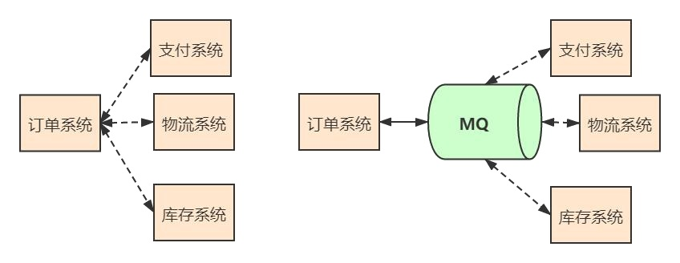
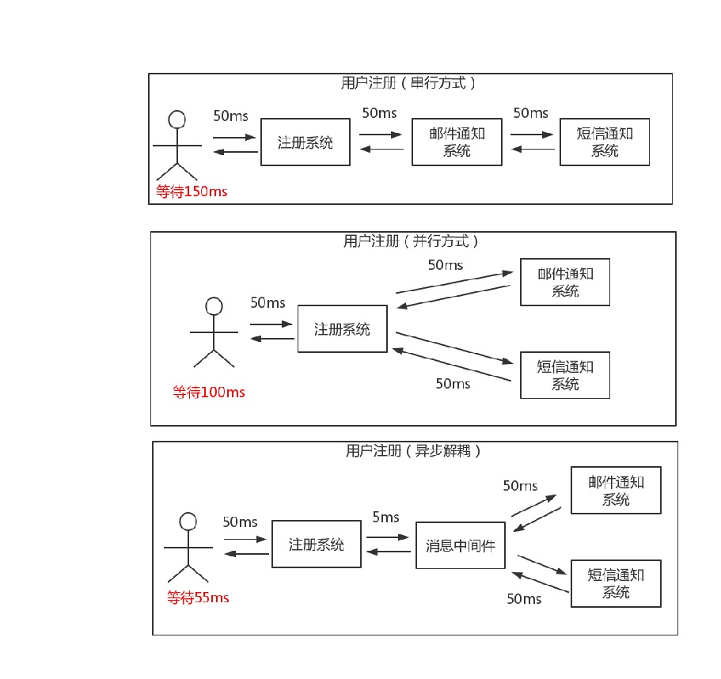
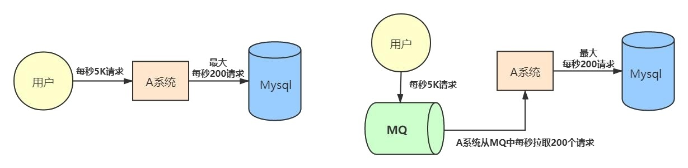
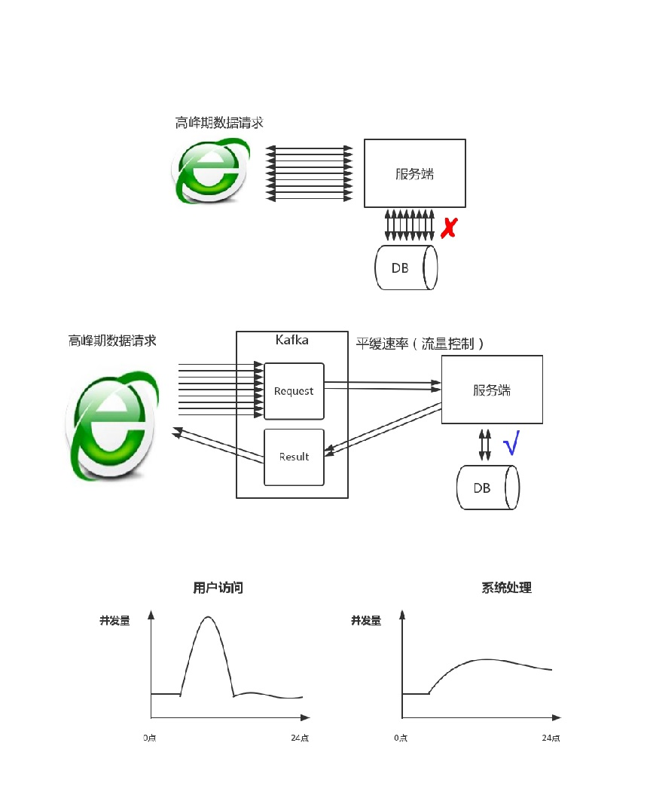
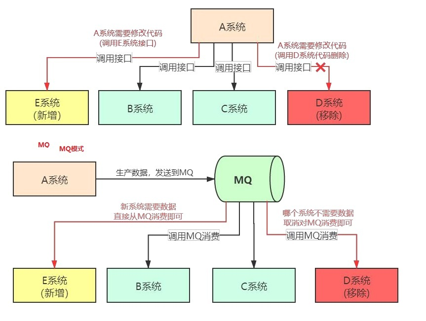
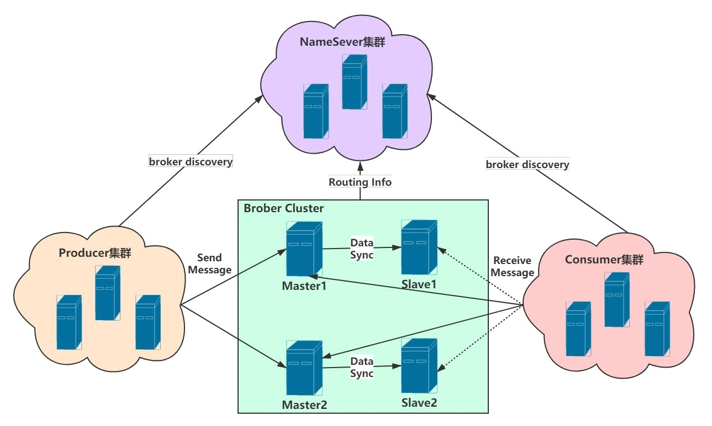

# 2. RocketMQ基础介绍
[[toc]]

**消息中间件(MQ)的定义**
一般认为，消息中间件属于分布式系统中一个子系统，关注于数据的发送和接收，利用高效可靠的异步消息传递机制对分布式系统中的其余各个子系统进行集成。 

<strong>高效</strong>：对于消息的处理处理速度快。   
<strong>可靠</strong>：一般消息中间件都会有消息持久化机制和其他的机制确保消息不丢失。   
<strong>异步</strong>：指发送完一个请求，不需要等待返回，随时可以再发送下一个请求，既不需要等待。   

**一句话总结，我们消息中间件不生产消息，只是消息的搬运工**

##  2.1 消息中间件作用

###  2.1.1 应用解耦 
系统的耦合性越高，容错性就越低。以电商应用为例，用户创建订单后，如果耦合调用库存系统、物流系统、支付系统，任何一个子系统出了故障或者 因为升级等原因暂时不可用，都会造成下单操作异常，影响用户使用体验 使用消息中间件，系统的耦合性就会提高了。比如物流系统发生故障，需要几分钟才能来修复，在这段时间内，物流系统要处理的数据被缓存到消息队列中，用户的下单操作正常完成。当物流系统恢复后，继续处理存放在消息队列中的订单消息即可，终端系统感知不到物流系统发生过几分钟故障。

###  2.1.2 异步处理能力
异步通信能力，使得子系统之间得以充分执行自己的逻辑而无需等待。

用户注册后，需要发送注册邮件和短信通知，以告知用户注册成功

###  2.1.3 流量削峰 
应用系统如果遇到系统请求流量的瞬间猛增，有可能会将系统压垮。有了消息队列可以将大量请求缓存起来，分散到很长一段时间处理，这样可以大大 提到系统的稳定性和用户体验。 互联网公司的大促场景（双十一、店庆活动、秒杀活动）都会使用到 MQ。

###  2.1.4 数据分发 

通过消息队列可以让数据在多个系统更加之间进行流通。数据的产生方不需要关心谁来使用数据，只需要将数据发送到消息队列，数据使用方直接在消息队列中直接获取数据即可。 接口调用的弊端，无论是新增系统，还是移除系统，代码改造工作量都很大。 使用 MQ 做数据分发好处，无论是新增系统，还是移除系统，代码改造工作量较小。 所以使用 MQ 做数据的分发，可以提高团队开发的效率。

##  2.2 RocketMQ 的物理架构

消息队列 RocketMQ 是阿里巴巴集团基于高可用分布式集群技术，自主研发的云正式商用的专业消息中间件，既可为分布式应用系统提供异步解耦 和削峰填谷的能力，同时也具备互联网应用所需的海量消息堆积、高吞吐、可靠重试等特性，是阿里巴巴双 11 使用的核心产品。 RocketMQ 的设计<strong>基于主题的发布与订阅模式</strong>，其核心功能包括<strong>消息发送、消息存储(Broker)、消息消费</strong>，整体设计追求简单与性能第一。

###  2.2.1 NameServer 

NameServer 是整个 RocketMQ 的“大脑”，它是 RocketMQ 的服务注册中心,所以 RocketMQ 需要先启动 NameServer 再启动 Rocket 中的 Broker。

Broker 在启动时向所有 NameServer 注册（主要是服务器地址等），生产者在发送消息之前先从 NameServer 获取 Broker 服务器地址列表（消费者一 样），然后根据负载均衡算法从列表中选择一台服务器进行消息发送。 

NameServer 与每台 Broker 服务保持长连接，并间隔 30S 检查 Broker 是否存活，如果检测到 Broker 宕机，则从路由注册表中将其移除。
这样就可以实现 RocketMQ 的高可用。

###  2.2.2 生产者(Producer) 
生产者：也称为消息发布者，负责生产并发送消息至 RocketMQ。 

###  2.2.3 消费者(Consumer) 
消费者：也称为消息订阅者，负责从 RocketMQ 接收并消费消息。 

###  2.2.4 消息(Message) 
消息：生产或消费的数据，对于 RocketMQ 来说，消息就是字节数组。 

###  2.2.5 主机(Broker) 
RocketMQ 的核心，用于暂存和传输消息。

### 2.2.2 物理架构中的整体运转 

:::tip 物理架构中的整体运转
1. NameServer 先启动 

2. Broker 启动时向 NameServer 注册 

3. 生产者在发送某个主题的消息之前先从 NamerServer 获取 Broker 服务器地址列表（有可能是集群），然后根据负载均衡算法从列表中选择一台 Broker 进行消息发送。 

4. NameServer 与每台 Broker 服务器保持长连接，并间隔 30S 检测 Broker 是否存活，如果检测到 Broker 宕机（使用心跳机制，如果检测超过120S），则从路由注册表中将其移除。 

5. 消费者在订阅某个主题的消息之前从 NamerServer 获取 Broker 服务器地址列表（有可能是集群），但是消费者选择从 Broker 中订阅消息，订阅规则由 Broker 配置决定。
:::

