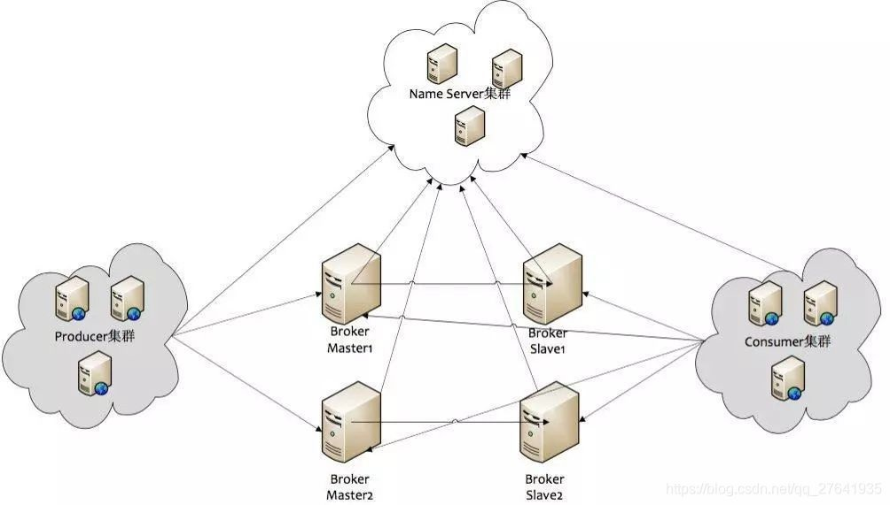
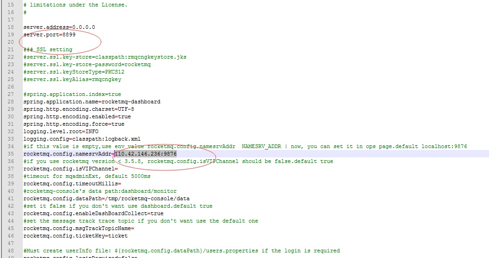

# 1.RocketMQ安装
[[toc]]

<a data-fancybox title="RocketMQ" href="./image/rocketmq66.jpg"></a>


## 1.1 RocketMQ在linux下安装


<a href='http://rocketmq.apache.org/dowloading/releases/'>官方下载地址 http://rocketmq.apache.org/dowloading/releases/</a>

### 1.1.1 调整启动参数

:::tip 注意事项
RocketMQ默认的虚拟机内存较大，启动Broker如果因为内存不足失败，需要编辑如下两个配置文件，修改JVM内存大小。
但是这个也仅仅是在测试环境中，RocketMQ在生产上最低要求至少8G内存（官方推荐）才能确保RocketMQ的效果
:::

------------
```sh
vi runbroker.sh           --broker的配置
vi runserver.sh            --nameServer的配置
JAVA_OPT="${JAVA_OPT} -server -Xms1024m -Xmx1024m -Xmn512m -XX:MetaspaceSize=128m -XX:MaxMetaspaceSize=320m"
```

### 1.1.2 启动namesrv和启动broker 

```sh
cd /root/rocketmq-all-4.8.0-bin-release/bin
#启动NAMESERVER
nohup sh mqnamesrv &

#查看日志的命令：
tail -f ~/logs/rocketmqlogs/namesrv.log
```


```sh
#修改配置文件增加外网地址(你启动加载哪个配置文件就修改哪个，这里修改broker.conf)
cd /root/rocketmq-all-4.8.0-bin-release/conf
vi broker.conf
brokerIP1=110.42.146.236

# 启动broker
cd /root/rocketmq-all-4.8.0-bin-release/bin

nohup sh mqbroker -c ../conf/broker.conf  -n 110.42.146.236:9876 autoCreateTopicEnable=true &  
#这样启动的服务器可以自动创建主题（客户端）,不过生产一般不推荐。
##推荐使用如下
nohup ./mqbroker -n 110.42.146.236:9876 &
#查看日志的命令
tail -f ~/logs/rocketmqlogs/broker.log
```

:::tip 启动遇见的问题
**Error when measuring disk space usage, file doesn't exist on this path: /root/store/commitlog**   

```sh
mkdir  /root/store/commitlog
```
**Error when measuring disk space usage, file doesn't exist on this path: /root/store/consumequeue**   

```sh
mkdir  /root/store/consumequeue
```
:::

### 1.1.3 安装控制台插件

**新版本RocketMQ配置Web管理界面：解决找不到rocketmq-console目录问题**
想配置一下RocketMQ的web管理页面，发现网上的资料都是之前版本的说明，导致无法成功配置。
所以想自己查看一下,我们发现<a href='https://github.com/apache/rocketmq-externals'>https://github.com/apache/rocketmq-externals</a>
这个git项目上并没有找到rocketmq-console这个目录.

**已经创建了一个独立的仓库并命名为RocketMQ Dashboard**

<a href='https://github.com/apache/rocketmq-dashboard'>https://github.com/apache/rocketmq-dashboard</a>

:::tip  编译安装启动

1. 下载完成之后，进入‘\rocketmq-dashboard-master\src\main\resources’文件夹，打开‘application.properties’进行配置

<a data-fancybox title="RocketMQ" href="./image/rocketmq11.jpg"></a>

2. 进入 H:\安装包\MQ\rocketmq-dashboard-master，

```sh
# 编译生成
mvn clean package -Dmaven.test.skip=true
```

3. 上传启动
```sh
nohup java -jar rocketmq-dashboard-2.0.0.jar &
```
4. 登录验证
<a href='http://110.42.146.236:8899'>http://110.42.146.236:8899</a>

:::

### 1.1.4 验证

**查看是否启动成功**

```sh
[root@VM-4-12-centos bin]# jps -l
31922 sun.tools.jps.Jps
23182 rocketmq-dashboard-2.0.0.jar
13822 org.apache.rocketmq.broker.BrokerStartup
11054 org.apache.rocketmq.namesrv.NamesrvStartup
```
**验证是否启动成功**


:::tip 遇见的问题
**java.lang.IllegalStateException: org.apache.rocketmq.remoting.exception.RemotingConnectException: connect to null failed**
**解决办法：**
```sh
vi tools.sh
export JAVA_HOME
export JAVA="$JAVA_HOME/bin/java"
export BASE_DIR=$(dirname $0)/..
export CLASSPATH=.:${BASE_DIR}/conf:${CLASSPATH}
## 添加如下：export NAMESRV_ADDR=110.42.146.236:9876
export NAMESRV_ADDR=110.42.146.236:9876
#===========================================================================================
# JVM Configuration
#===========================================================================================
JAVA_OPT="${JAVA_OPT} -server -Xms1g -Xmx1g -Xmn256m -XX:MetaspaceSize=128m -XX:MaxMetaspaceSize=128m"
JAVA_OPT="${JAVA_OPT} -Djava.ext.dirs=${BASE_DIR}/lib:${JAVA_HOME}/jre/lib/ext:${JAVA_HOME}/lib/ext"
JAVA_OPT="${JAVA_OPT} -cp ${CLASSPATH}"

$JAVA ${JAVA_OPT} "$@"

```
:::

```sh
sh tools.sh org.apache.rocketmq.example.quickstart.Producer
##可以正常发送消息
ocketMQLog:WARN No appenders could be found for logger (io.netty.util.internal.PlatformDependent0).
RocketMQLog:WARN Please initialize the logger system properly.
SendResult [sendStatus=SEND_OK, msgId=7F00000112C936BAF30C3D7C4FB20000, offsetMsgId=6E2A92EC00002A9F0000000000000000, messageQueue=MessageQueue [topic=TopicTest, brokerName=broker-a, queueId=2], queueOffset=0]
SendResult [sendStatus=SEND_OK, msgId=7F00000112C936BAF30C3D7C4FD90001, offsetMsgId=6E2A92EC00002A9F00000000000000C9, messageQueue=MessageQueue [topic=TopicTest, brokerName=broker-a, queueId=3], queueOffset=0]
22:32:38.995 [NettyClientSelector_1] INFO  RocketmqRemoting - closeChannel: close the connection to remote address[110.42.146.236:9876] result: true
22:32:39.002 [NettyClientSelector_1] INFO  RocketmqRemoting - closeChannel: close the connection to remote address[110.42.146.236:10911] result: true

```
**验证能否正常消费**

```sh
sh tools.sh org.apache.rocketmq.example.quickstart.Consumer
##正常消费 
_START_TIME=1631457281108, UNIQ_KEY=7F00000112C936BAF30C3D7C573703D0, CLUSTER=DefaultCluster, WAIT=true, TAGS=TagA}, body=[72, 101, 108, 108, 111, 32, 82, 111, 99, 107, 101, 116, 77, 81, 32, 57, 55, 54], transactionId='null'}]] 
ConsumeMessageThread_2 Receive New Messages: [MessageExt [brokerName=broker-a, queueId=2, storeSize=203, queueOffset=243, sysFlag=0, bornTimestamp=1631457158957, bornHost=/110.42.146.236:33792, storeTimestamp=1631457158958, storeHost=/110.42.146.236:10911, msgId=6E2A92EC00002A9F0000000000030256, commitLogOffset=197206, bodyCRC=794315549, reconsumeTimes=0, preparedTransactionOffset=0, toString()=Message{topic='TopicTest', flag=0, properties={MIN_OFFSET=0, MAX_OFFSET=250, CONSUME_START_TIME=1631457281108, UNIQ_KEY=7F00000112C936BAF30C3D7C572D03CC, CLUSTER=DefaultCluster, WAIT=true, TAGS=TagA}, body=[72, 101, 108, 108, 111, 32, 82, 111, 99, 107, 101, 116, 77, 81, 32, 57, 55, 50], transactionId='null'}]] 

```

