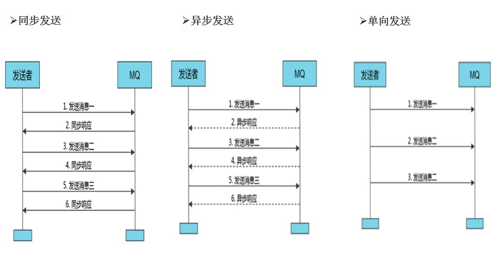
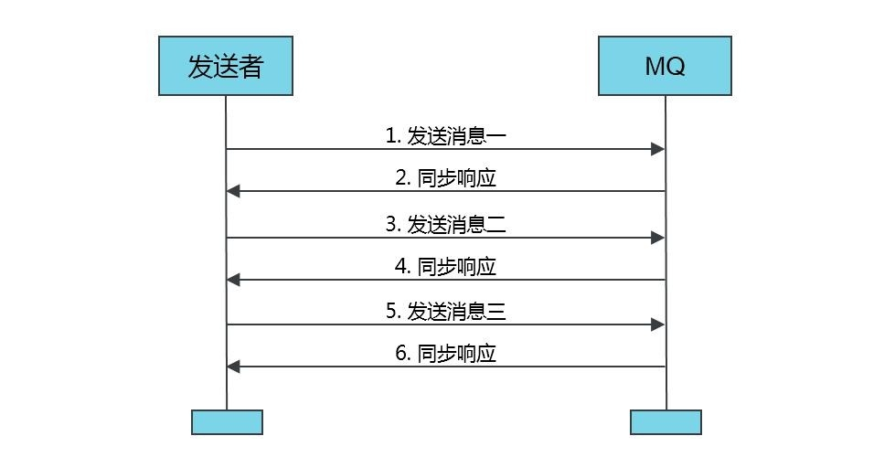
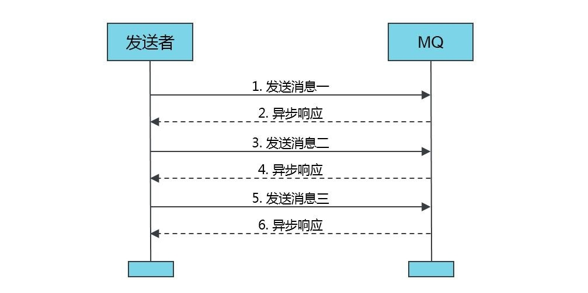
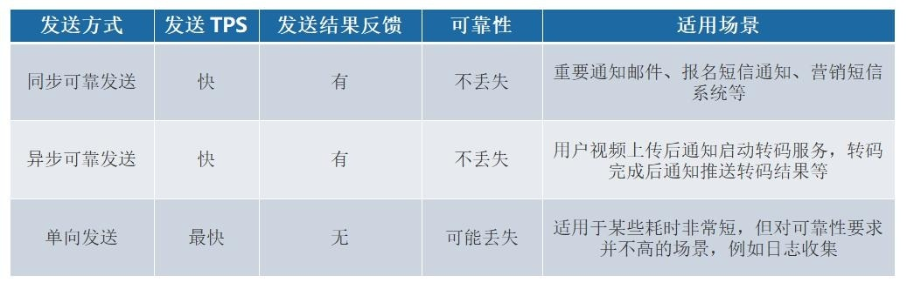
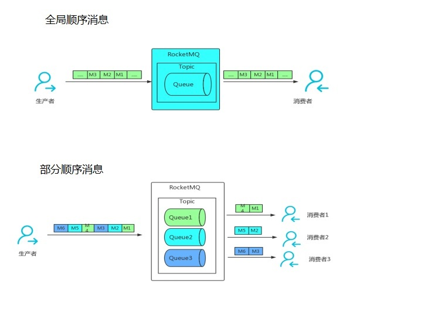
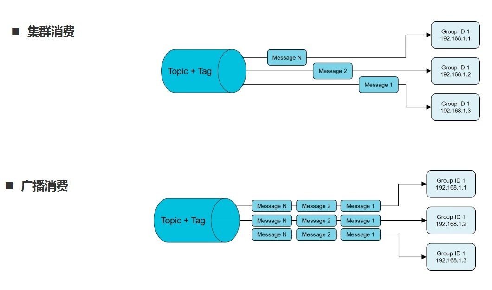
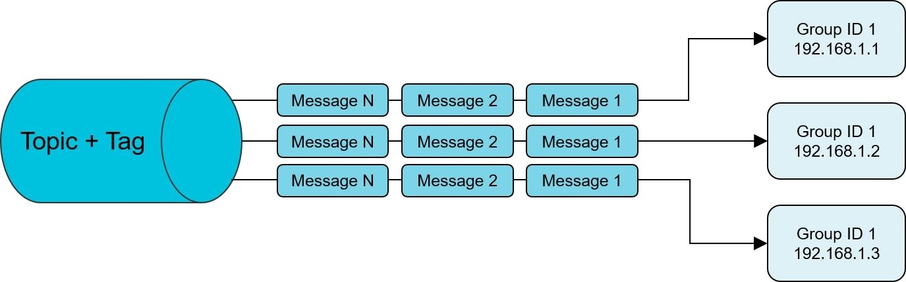

#  3 RocketMQ消息基础用法

##  3.1 普通消息

###  3.1.1 普通消息的整个流程

:::tip 普通消息的整个流程
**导入 MQ 客户端依赖**  
```xml
 <dependency> 
 <groupId>org.apache.rocketmq</groupId> 
 <artifactId>rocketmq-client</artifactId> 
 <version>4.8.0</version> 
 </dependency> 
```
-----------------

**消息发送者步骤**     
 1. 创建消息生产者 producer，并指定生产者组名 
 2. 指定 Nameserver 地址 
 3. 启动 producer 
 4. 创建消息对象，指定 Topic、Tag 和消息体 
 5. 发送消息 
 6. 关闭生产者 producer   

 -------------

**消息消费者步骤**   
 1. 创建消费者 Consumer，指定消费者组名 
 2. 指定 Nameserver 地址 
 3. 订阅主题 Topic 和 Tag 
 4. 设置回调函数，处理消息 
 5. 启动消费者 consumer
:::

### 3.1.2普通消息的发送方式

<a data-fancybox title="RocketMQ" href="./image/rocketmq25.jpg"></a>

### 3.1.3 发送同步消息

这种可靠性同步地发送方式使用的比较广泛，比如：**重要的消息通知，短信通知**。  
同步发送是指消息发送方发出数据后，同步等待，直到收到接收方发回响应之后才发下一个请求。 

<a data-fancybox title="RocketMQ" href="./image/rocketmq27.jpg"></a>

```java
/**
 * * 同步发送
 */
public class SyncProducer {
    public static void main(String[] args) throws Exception {
        DefaultMQProducer producer=new DefaultMQProducer("sync");
        producer.setNamesrvAddr("110.42.146.236:9876");
        producer.start();
        for (int i = 0; i < 10; i++) {
            Message msg = new Message("TopicTest" ,
                    "TagB" ,
                    ("Hello RocketMQ " + i).getBytes(RemotingHelper.DEFAULT_CHARSET)
            );
            SendResult sendResult = producer.send(msg);
            System.out.println("SendStatus:"+sendResult.getSendStatus()+"  (MsgId):"
                    +sendResult.getMsgId()+"  (queueId):"
                    +sendResult.getMessageQueue().getQueueId()
                    +"  (value):"+ new String(msg.getBody()));
        }
        producer.shutdown();
    }
}
```
:::tip  返回结果

```sh
SendStatus:SEND_OK  (MsgId):7F000001373418B4AAC24CC514600000  (queueId):3  (value):Hello RocketMQ 0
SendStatus:SEND_OK  (MsgId):7F000001373418B4AAC24CC514AA0001  (queueId):0  (value):Hello RocketMQ 1
SendStatus:SEND_OK  (MsgId):7F000001373418B4AAC24CC514DA0002  (queueId):1  (value):Hello RocketMQ 2
SendStatus:SEND_OK  (MsgId):7F000001373418B4AAC24CC514FC0003  (queueId):2  (value):Hello RocketMQ 3
SendStatus:SEND_OK  (MsgId):7F000001373418B4AAC24CC5151F0004  (queueId):3  (value):Hello RocketMQ 4
SendStatus:SEND_OK  (MsgId):7F000001373418B4AAC24CC515440005  (queueId):0  (value):Hello RocketMQ 5
SendStatus:SEND_OK  (MsgId):7F000001373418B4AAC24CC5156C0006  (queueId):1  (value):Hello RocketMQ 6
SendStatus:SEND_OK  (MsgId):7F000001373418B4AAC24CC515940007  (queueId):2  (value):Hello RocketMQ 7
SendStatus:SEND_OK  (MsgId):7F000001373418B4AAC24CC515B70008  (queueId):3  (value):Hello RocketMQ 8
SendStatus:SEND_OK  (MsgId):7F000001373418B4AAC24CC515DE0009  (queueId):0  (value):Hello RocketMQ 9
```
▶ Message ID 消息的全局唯一标识（内部机制的 ID 生成是使用机器 IP 和消息偏移量的组成，所以有可能重复，如果是幂等性还是最好考虑 Key），由消息队列 MQ 系统自动生成，唯一标识某条消息。   

▶ SendStatus 发送的标识, 成功，失败等  

▶ Queue 相当于是 Topic 的分区；用于并行发送和接收消息  
:::

### 3.1.4 发送异步消息

异步消息通常用在对响应时间敏感的业务场景，即发送端不能容忍长时间地等待 Broker 的响应。  

**代码演示**
```java
/**
 * 异步消息
 */
public class AsyncProducer {
    static  final  int messageCount = 10;
    public static void main(String[] args) throws Exception {
        DefaultMQProducer producer=new DefaultMQProducer("Async");
        producer.setNamesrvAddr("110.42.146.236:9876");
        producer.start();
        final CountDownLatch countDownLatch = new CountDownLatch(messageCount);
        //发送异步失败时的重试次数(这里不重试)
        producer.setRetryTimesWhenSendAsyncFailed(0);
        for (int i=0; i<messageCount;i++){
            final  int index=0;
            final Message message=new Message("TopicTest","TagC","OrderID"+index,("异步消息"+index).getBytes(RemotingHelper.DEFAULT_CHARSET));
            //生产者异步发送
            producer.send(message, new SendCallback() {
                @Override
                public void onSuccess(SendResult sendResult) {
                    countDownLatch.countDown();
                    System.out.printf("%-10d OK %s %n", index, new String(message.getBody()));
                }

                @Override
                public void onException(Throwable throwable) {
                    countDownLatch.countDown();
                    System.out.printf("%-10d Exception %s %n", index, throwable);
                    throwable.printStackTrace();
                }
            });

        }
        countDownLatch.await(2, TimeUnit.SECONDS);
        producer.shutdown();
    }
}
```

消息发送方在发送了一条消息后，不等接收方发回响应，接着进行第二条消息发送。发送方通过回调接口的方式接收服务器响应，并对响应结果进行处理  

<a data-fancybox title="RocketMQ" href="./image/rocketmq28.jpg"></a>


### 3.1.5 单向发送

这种方式主要用在不特别关心发送结果的场景，例如日志发送。

**代码演示**
```java
/**
 *单向发送
 */
public class OnewayProducer {
    public static void main(String[] args) throws Exception{
        //生产者实例化
        DefaultMQProducer producer = new DefaultMQProducer("oneway");
        //指定rocket服务器地址
        producer.setNamesrvAddr("110.42.146.236:9876");

        //启动实例
        producer.start();
        for (int i = 0; i < 10; i++) {
            //创建一个消息实例，指定topic、tag和消息体
            Message msg = new Message("TopicTest" /* Topic */,
                    "TagA" /* Tag */,
                    ("Hello RocketMQ " + i).getBytes(RemotingHelper.DEFAULT_CHARSET) /* Message body */
            );
            //发送消息
            producer.sendOneway(msg);
            System.out.printf("%s%n",  new String(msg.getBody()));
        }
        //生产者实例不再使用时关闭.
        producer.shutdown();
    }
}
```

单向（Oneway）发送特点为发送方只负责发送消息，不等待服务器回应且没有回调函数触发，即只发送请求不等待应答。此方式发送消息的过程耗 时非常短，一般在微秒级别。cn.enjoyedu.normal.OnewayProducer

### 3.1.6 消息发送的权衡

<a data-fancybox title="RocketMQ" href="./image/rocketmq30.jpg"></a>

### 3.1.7 普通消息的消费方式

### 3.1.8 集群消费 

<a data-fancybox title="RocketMQ" href="./image/rocketmq32.jpg"></a>


消费者的一种消费模式。一个 Consumer Group 中的各个 Consumer 实例分摊去消费消息，即一条消息只会投递到一个 Consumer Group 下面的一个实例。

实际上，每个 Consumer 是平均分摊 Message Queue 的去做拉取消费。例如某个 Topic 有 3 条 Q，其中一个 Consumer Group 有 3 个实例（可能是 3 个进程，或者 3 台机器），那么每个实例只消费其中的 1 条 Q。 

而由 Producer 发送消息的时候是轮询所有的 Q,所以消息会平均散落在不同的 Q 上，可以认为 Q 上的消息是平均的。那么实例也就平均地消费消息了。 

这种模式下，消费进度(Consumer Offset)的存储会持久化到 Broker。

**代码演示**

```java
/**
 * 集群消费
 */
public class BalanceComuser {
    public static void main(String[] args) throws Exception {
        // 实例化消息生产者,指定组名
        DefaultMQPushConsumer consumer = new DefaultMQPushConsumer("tianqikai");
        // 指定Namesrv地址信息.
        consumer.setNamesrvAddr("110.42.146.236:9876");
        // 订阅Topic
        consumer.setMaxReconsumeTimes(1);
        consumer.subscribe("TopicTest", "*"); //tag  tagA|TagB|TagC
        //负载均衡模式消费
        consumer.setMessageModel(MessageModel.CLUSTERING);
        // 注册回调函数，处理消息
        consumer.registerMessageListener(new MessageListenerConcurrently() {
            @Override
            public ConsumeConcurrentlyStatus consumeMessage(List<MessageExt> msgs, ConsumeConcurrentlyContext context) {
                try {
                    for(MessageExt msg : msgs) {
                        String topic = msg.getTopic();
                        String msgBody = new String(msg.getBody(), "utf-8");
                        String tags = msg.getTags();
                        System.out.println("收到消息：" + " topic :" + topic + " ,tags : " + tags + " ,msg : " + msgBody);
                    }
                } catch (Exception e) {
                    e.printStackTrace();
                    return ConsumeConcurrentlyStatus.RECONSUME_LATER;

                }
                return ConsumeConcurrentlyStatus.CONSUME_SUCCESS;
            }
        });
        //启动消息者
        consumer.start();
        System.out.printf("Consumer Started.%n");
    }
}

```


### 3.1.9 广播消费 

<a data-fancybox title="RocketMQ" href="./image/rocketmq26.jpg"></a>


消费者的一种消费模式。消息将对一个 Consumer Group 下的各个 Consumer 实例都投递一遍。即使这些 Consumer 属于同一个 Consumer Group， 消息也会被 Consumer Group 中的每个 Consumer 都消费一次。 
<a data-fancybox title="RocketMQ" href="./image/rocketmq33.jpg"></a>

实际上，是一个消费组下的每个消费者实例都获取到了 topic 下面的每个 Message Queue 去拉取消费。所以消息会投递到每个消费者实例。 

这种模式下，消费进度(Consumer Offset)会存储持久化到实例本地。 

**代码演示**

```java
/**
 * 广播模式消费
 */
public class BroadcastComuser {
    public static void main(String[] args) throws Exception {
        // 实例化消息生产者,指定组名
        DefaultMQPushConsumer consumer = new DefaultMQPushConsumer("B-test");
        // 指定Namesrv地址信息.
        consumer.setNamesrvAddr(TqkEnum.IPPORT.getMsg());//
        // 订阅Topic
        consumer.subscribe("TopicTest", "*");
        //广播模式消费
        consumer.setMessageModel(MessageModel.BROADCASTING);
        // 如果非第一次启动，那么按照上次消费的位置继续消费
        consumer.setConsumeFromWhere(ConsumeFromWhere.CONSUME_FROM_FIRST_OFFSET);
        // 注册回调函数，处理消息
        consumer.registerMessageListener(new MessageListenerConcurrently() {
            @Override
            public ConsumeConcurrentlyStatus consumeMessage(List<MessageExt> msgs,
                                             ConsumeConcurrentlyContext context) {
                try {
                    for(MessageExt msg : msgs) {
                        String topic = msg.getTopic();
                        String msgBody = new String(msg.getBody(), "utf-8");
                        String tags = msg.getTags();
                        System.out.println("收到消息：" + " topic :" + topic + " ,tags : " + tags + " ,msg : " + msgBody);
                    }
                } catch (Exception e) {
                    e.printStackTrace();
                    return ConsumeConcurrentlyStatus.RECONSUME_LATER;

                }
                return ConsumeConcurrentlyStatus.CONSUME_SUCCESS;
            }
        });
        //启动消息者
        consumer.start();
        System.out.printf("Consumer Started.%n");
    }
}
```
### 3.1.10 消息消费时的权衡 

#### 3.1.10.1 集群模式：

适用场景&注意事项 

消费端集群化部署，每条消息只需要被处理一次。 

由于消费进度在服务端维护，可靠性更高。 集群消费模式下，每一条消息都只会被分发到一台机器上处理。
如果需要被集群下的每一台机器都处理，请使用广播模式。 

**集群消费模式下，不保证每一次失败重投的消息路由到同一台机器上，因此处理消息时不应该做任何确定性假设。** 

#### 3.1.10.2 广播模式：

适用场景&注意事项 

广播消费模式下不支持顺序消息。 

广播消费模式下不支持重置消费位点。  
每条消息都需要被相同逻辑的多台机器处理。   
消费进度在客户端维护，出现重复的概率稍大于集群模式。   

广播模式下，消息队列 RocketMQ 保证每条消息至少被每台客户端消费一次，但是并**不会对消费失败的消息进行失败重投，因此业务方需要关注消费失败的情况**。 

广播模式下，**客户端每一次重启都会从最新消息消费**。

**客户端在被停止期间发送至服务端的消息将会被自动跳过，请谨慎选择。**

 广播模式下，每条消息都会被大量的客户端重复处理，因此推荐尽可能使用集群模式。 
 
 目前仅 Java 客户端支持广播模式。 广播模式下服务端不维护消费进度，所以消息队列 RocketMQ 控制台不支持消息堆积查询、消息堆积报警和订阅关系查询功能。
##  3.2 顺序消息