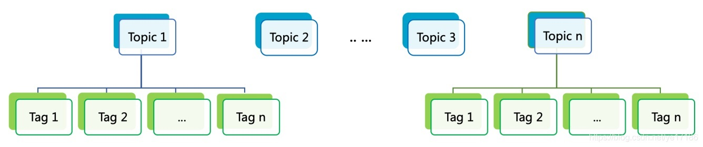
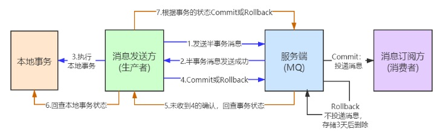
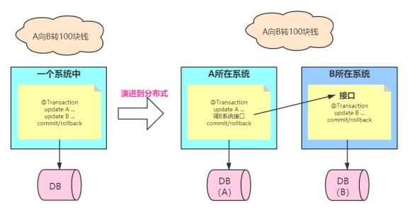
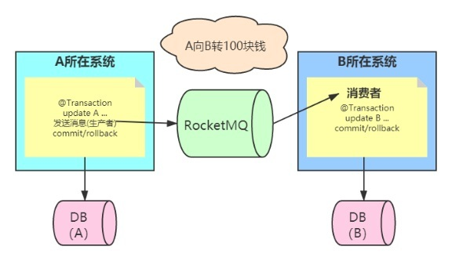
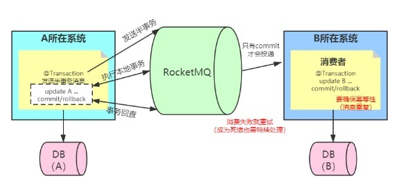
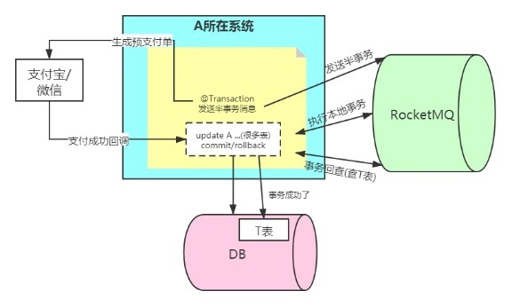

#  3 RocketMQ消息基础用法
[[toc]]


## 前言

:::tip Topic与Tag
1. Topic：消息主题，通过 Topic 对不同的业务消息进行分类。

2. Tag：消息标签，用来进一步区分某个 Topic 下的消息分类，消息队列 RocketMQ 允许消费者按照 Tag 对消息进行过滤，确保消费者最终只消费到他关注的消息类型。

Topic 与 Tag 都是业务上用来归类的标识，区分在于 Topic 是一级分类，而 Tag 可以说是二级分类，关系如图所示。

<a data-fancybox title="RocketMQ" href="./image/rocketmq02.jpg"></a>
:::

##  3.1 普通消息

###  3.1.1 普通消息的整个流程

:::tip 导入 MQ 客户端依赖 
```xml
 <dependency> 
 <groupId>org.apache.rocketmq</groupId> 
 <artifactId>rocketmq-client</artifactId> 
 <version>4.8.0</version> 
 </dependency> 
```
:::

-----------------

:::tip 消息发送者步骤   
 1. 创建消息生产者 producer，并指定生产者组名 
 2. 指定 Nameserver 地址 
 3. 启动 producer 
 4. 创建消息对象，指定 Topic、Tag 和消息体 
 5. 发送消息 
 6. 关闭生产者 producer   
:::

-------------

:::tip 消息消费者步骤
 1. 创建消费者 Consumer，指定消费者组名 
 2. 指定 Nameserver 地址 
 3. 订阅主题 Topic 和 Tag 
 4. 设置回调函数，处理消息 
 5. 启动消费者 consumer
:::


### 3.1.2普通消息的发送方式

<a data-fancybox title="RocketMQ" href="./image/rocketmq25.jpg"></a>

### 3.1.3 发送同步消息

这种可靠性同步地发送方式使用的比较广泛，比如：**重要的消息通知，短信通知**。  
同步发送是指消息发送方发出数据后，同步等待，直到收到接收方发回响应之后才发下一个请求。 

<a data-fancybox title="RocketMQ" href="./image/rocketmq27.jpg"></a>

```java
/**
 * * 同步发送
 */
public class SyncProducer {
    public static void main(String[] args) throws Exception {
        DefaultMQProducer producer=new DefaultMQProducer("sync");
        producer.setNamesrvAddr("110.42.146.236:9876");
        producer.start();
        for (int i = 0; i < 10; i++) {
            Message msg = new Message("TopicTest" ,
                    "TagB" ,
                    ("Hello RocketMQ " + i).getBytes(RemotingHelper.DEFAULT_CHARSET)
            );
            SendResult sendResult = producer.send(msg);
            System.out.println("SendStatus:"+sendResult.getSendStatus()+"  (MsgId):"
                    +sendResult.getMsgId()+"  (queueId):"
                    +sendResult.getMessageQueue().getQueueId()
                    +"  (value):"+ new String(msg.getBody()));
        }
        producer.shutdown();
    }
}
```
:::tip  返回结果

```sh
SendStatus:SEND_OK  (MsgId):7F000001373418B4AAC24CC514600000  (queueId):3  (value):Hello RocketMQ 0
SendStatus:SEND_OK  (MsgId):7F000001373418B4AAC24CC514AA0001  (queueId):0  (value):Hello RocketMQ 1
SendStatus:SEND_OK  (MsgId):7F000001373418B4AAC24CC514DA0002  (queueId):1  (value):Hello RocketMQ 2
SendStatus:SEND_OK  (MsgId):7F000001373418B4AAC24CC514FC0003  (queueId):2  (value):Hello RocketMQ 3
SendStatus:SEND_OK  (MsgId):7F000001373418B4AAC24CC5151F0004  (queueId):3  (value):Hello RocketMQ 4
SendStatus:SEND_OK  (MsgId):7F000001373418B4AAC24CC515440005  (queueId):0  (value):Hello RocketMQ 5
SendStatus:SEND_OK  (MsgId):7F000001373418B4AAC24CC5156C0006  (queueId):1  (value):Hello RocketMQ 6
SendStatus:SEND_OK  (MsgId):7F000001373418B4AAC24CC515940007  (queueId):2  (value):Hello RocketMQ 7
SendStatus:SEND_OK  (MsgId):7F000001373418B4AAC24CC515B70008  (queueId):3  (value):Hello RocketMQ 8
SendStatus:SEND_OK  (MsgId):7F000001373418B4AAC24CC515DE0009  (queueId):0  (value):Hello RocketMQ 9
```

▶ <font color='red'>Message ID</font> 消息的全局唯一标识（内部机制的 ID 生成是使用机器 IP 和消息偏移量的组成，所以有可能重复，如果是幂等性还是最好考虑 Key），由消息队列 MQ 系统自动生成，唯一标识某条消息。   

▶ <font color='red'>SendStatus</font> 发送的标识, 成功，失败等  

▶ <font color='red'>Queue</font> 相当于是 Topic 的分区；用于并行发送和接收消息  
:::

### 3.1.4 发送异步消息

异步消息通常用在对响应时间敏感的业务场景，即发送端不能容忍长时间地等待 Broker 的响应。  

**代码演示**
```java
/**
 * 异步消息
 */
public class AsyncProducer {
    static  final  int messageCount = 10;
    public static void main(String[] args) throws Exception {
        DefaultMQProducer producer=new DefaultMQProducer("Async");
        producer.setNamesrvAddr("110.42.146.236:9876");
        producer.start();
        final CountDownLatch countDownLatch = new CountDownLatch(messageCount);
        //发送异步失败时的重试次数(这里不重试)
        producer.setRetryTimesWhenSendAsyncFailed(0);
        for (int i=0; i<messageCount;i++){
            final  int index=0;
            final Message message=new Message("TopicTest","TagC","OrderID"+index,("异步消息"+index).getBytes(RemotingHelper.DEFAULT_CHARSET));
            //生产者异步发送
            producer.send(message, new SendCallback() {
                @Override
                public void onSuccess(SendResult sendResult) {
                    countDownLatch.countDown();
                    System.out.printf("%-10d OK %s %n", index, new String(message.getBody()));
                }

                @Override
                public void onException(Throwable throwable) {
                    countDownLatch.countDown();
                    System.out.printf("%-10d Exception %s %n", index, throwable);
                    throwable.printStackTrace();
                }
            });

        }
        countDownLatch.await(2, TimeUnit.SECONDS);
        producer.shutdown();
    }
}
```

消息发送方在发送了一条消息后，不等接收方发回响应，接着进行第二条消息发送。发送方通过回调接口的方式接收服务器响应，并对响应结果进行处理  

<a data-fancybox title="RocketMQ" href="./image/rocketmq28.jpg"></a>

### 3.1.5 单向发送

这种方式主要用在不特别关心发送结果的场景，例如日志发送。

**代码演示**
```java
/**
 *单向发送
 */
public class OnewayProducer {
    public static void main(String[] args) throws Exception{
        //生产者实例化
        DefaultMQProducer producer = new DefaultMQProducer("oneway");
        //指定rocket服务器地址
        producer.setNamesrvAddr("110.42.146.236:9876");

        //启动实例
        producer.start();
        for (int i = 0; i < 10; i++) {
            //创建一个消息实例，指定topic、tag和消息体
            Message msg = new Message("TopicTest" /* Topic */,
                    "TagA" /* Tag */,
                    ("Hello RocketMQ " + i).getBytes(RemotingHelper.DEFAULT_CHARSET) /* Message body */
            );
            //发送消息
            producer.sendOneway(msg);
            System.out.printf("%s%n",  new String(msg.getBody()));
        }
        //生产者实例不再使用时关闭.
        producer.shutdown();
    }
}
```

单向（Oneway）发送特点为发送方只负责发送消息，不等待服务器回应且没有回调函数触发，即只发送请求不等待应答。此方式发送消息的过程耗 时非常短，一般在微秒级别。cn.enjoyedu.normal.OnewayProducer

### 3.1.6 消息发送的权衡

<a data-fancybox title="RocketMQ" href="./image/rocketmq30.jpg"></a>

### 3.1.7 普通消息的消费方式

<a data-fancybox title="RocketMQ" href="./image/rocketmq26.jpg"></a>

### 3.1.8 集群消费 

<a data-fancybox title="RocketMQ" href="./image/rocketmq32.jpg"></a>


消费者的一种消费模式。一个 Consumer Group 中的各个 Consumer 实例分摊去消费消息，即一条消息只会投递到一个 Consumer Group 下面的一个实例。

实际上，每个 Consumer 是平均分摊 Message Queue 的去做拉取消费。例如某个 Topic 有 3 条 Q，其中一个 Consumer Group 有 3 个实例（可能是 3 个进程，或者 3 台机器），那么每个实例只消费其中的 1 条 Q。 

而由 Producer 发送消息的时候是轮询所有的 Q,所以消息会平均散落在不同的 Q 上，可以认为 Q 上的消息是平均的。那么实例也就平均地消费消息了。 

这种模式下，消费进度(Consumer Offset)的存储会持久化到 Broker。

**代码演示**

```java
/**
 * 集群消费
 */
public class BalanceComuser {
    public static void main(String[] args) throws Exception {
        // 实例化消息生产者,指定组名
        DefaultMQPushConsumer consumer = new DefaultMQPushConsumer("tianqikai");
        // 指定Namesrv地址信息.
        consumer.setNamesrvAddr("110.42.146.236:9876");
        // 订阅Topic
        consumer.setMaxReconsumeTimes(1);
        consumer.subscribe("TopicTest", "*"); //tag  tagA|TagB|TagC
        //负载均衡模式消费
        consumer.setMessageModel(MessageModel.CLUSTERING);
        // 注册回调函数，处理消息
        consumer.registerMessageListener(new MessageListenerConcurrently() {
            @Override
            public ConsumeConcurrentlyStatus consumeMessage(List<MessageExt> msgs, ConsumeConcurrentlyContext context) {
                try {
                    for(MessageExt msg : msgs) {
                        String topic = msg.getTopic();
                        String msgBody = new String(msg.getBody(), "utf-8");
                        String tags = msg.getTags();
                        System.out.println("收到消息：" + " topic :" + topic + " ,tags : " + tags + " ,msg : " + msgBody);
                    }
                } catch (Exception e) {
                    e.printStackTrace();
                    return ConsumeConcurrentlyStatus.RECONSUME_LATER;

                }
                return ConsumeConcurrentlyStatus.CONSUME_SUCCESS;
            }
        });
        //启动消息者
        consumer.start();
        System.out.printf("Consumer Started.%n");
    }
}

```


### 3.1.9 广播消费 


消费者的一种消费模式。消息将对一个 Consumer Group 下的各个 Consumer 实例都投递一遍。即使这些 Consumer 属于同一个 Consumer Group， 消息也会被 Consumer Group 中的每个 Consumer 都消费一次。 
<a data-fancybox title="RocketMQ" href="./image/rocketmq33.jpg"></a>

实际上，是一个消费组下的每个消费者实例都获取到了 topic 下面的每个 Message Queue 去拉取消费。所以消息会投递到每个消费者实例。 

这种模式下，消费进度(Consumer Offset)会存储持久化到实例本地。 

**代码演示**

```java
/**
 * 广播模式消费
 */
public class BroadcastComuser {
    public static void main(String[] args) throws Exception {
        // 实例化消息生产者,指定组名
        DefaultMQPushConsumer consumer = new DefaultMQPushConsumer("B-test");
        // 指定Namesrv地址信息.
        consumer.setNamesrvAddr(TqkEnum.IPPORT.getMsg());//
        // 订阅Topic
        consumer.subscribe("TopicTest", "*");
        //广播模式消费
        consumer.setMessageModel(MessageModel.BROADCASTING);
        // 如果非第一次启动，那么按照上次消费的位置继续消费
        consumer.setConsumeFromWhere(ConsumeFromWhere.CONSUME_FROM_FIRST_OFFSET);
        // 注册回调函数，处理消息
        consumer.registerMessageListener(new MessageListenerConcurrently() {
            @Override
            public ConsumeConcurrentlyStatus consumeMessage(List<MessageExt> msgs,
                                             ConsumeConcurrentlyContext context) {
                try {
                    for(MessageExt msg : msgs) {
                        String topic = msg.getTopic();
                        String msgBody = new String(msg.getBody(), "utf-8");
                        String tags = msg.getTags();
                        System.out.println("收到消息：" + " topic :" + topic + " ,tags : " + tags + " ,msg : " + msgBody);
                    }
                } catch (Exception e) {
                    e.printStackTrace();
                    return ConsumeConcurrentlyStatus.RECONSUME_LATER;

                }
                return ConsumeConcurrentlyStatus.CONSUME_SUCCESS;
            }
        });
        //启动消息者
        consumer.start();
        System.out.printf("Consumer Started.%n");
    }
}
```
### 3.1.10 消息消费时的权衡 

#### 3.1.10.1 集群模式：

适用场景&注意事项 

消费端集群化部署，每条消息只需要被处理一次。 

由于消费进度在服务端维护，可靠性更高。 集群消费模式下，每一条消息都只会被分发到一台机器上处理。
如果需要被集群下的每一台机器都处理，请使用广播模式。 

**集群消费模式下，不保证每一次失败重投的消息路由到同一台机器上，因此处理消息时不应该做任何确定性假设。** 

#### 3.1.10.2 广播模式：

适用场景&注意事项 

广播消费模式下不支持顺序消息。 

广播消费模式下不支持重置消费位点。  
每条消息都需要被相同逻辑的多台机器处理。   
消费进度在客户端维护，出现重复的概率稍大于集群模式。   

广播模式下，消息队列 RocketMQ 保证每条消息至少被每台客户端消费一次，但是并**不会对消费失败的消息进行失败重投，因此业务方需要关注消费失败的情况**。 

广播模式下，**客户端每一次重启都会从最新消息消费**。

**客户端在被停止期间发送至服务端的消息将会被自动跳过，请谨慎选择。**

## 3.2 消息发送时的重要方法/属性

### 3.2.1 属性

**org.apache.rocketmq.example.details. ProducerDetails类中**
```java
    //todo producerGroup：生产者所属组(针对 事务消息 高可用)
    DefaultMQProducer producer=new DefaultMQProducer("produce_details");
    //todo 默认主题在每一个Broker队列数量(对于新创建主题有效)
    producer.setDefaultTopicQueueNums(8);
    //todo 发送消息默认超时时间，默认3s (3000ms)
    producer.setSendMsgTimeout(3000);
    //todo 消息体超过该值则启用压缩，默认4k
    producer.setCompressMsgBodyOverHowmuch(4*1024);
    //todo 异步方式发送消息重试次数，默认为2，总共执行3次
    producer.setRetryTimesWhenSendAsyncFailed(2);
    //todo 同步方式发送消息重试次数，默认为2，总共执行3次
    producer.setRetryTimesWhenSendFailed(2);
    //todo 消息重试时选择另外一个Broker时（消息没有存储成功是否发送到另外一个broker），默认为false
    producer.setRetryAnotherBrokerWhenNotStoreOK(false);
    //todo 允许发送的最大消息长度，默认为4M
    producer.setMaxMessageSize(1024 * 1024 * 4);
    //todo 设置NameServer的地址
    producer.setNamesrvAddr(TqkEnum.IPPORT.getMsg());
```

### 3.2.2 方法

**org.apache.rocketmq.example.details. ProducerDetails类中**

```java
    //todo 设置NameServer的地址
    producer.setNamesrvAddr(TqkEnum.IPPORT.getMsg());
    // todo 启动Producer实例
    producer.start();
    //todo 0 查找该主题下所有消息队列
    List<MessageQueue> MessageQueue = producer.fetchPublishMessageQueues("TopicTest");
    for (int i = 0; i < MessageQueue.size(); i++) {
        System.out.println(MessageQueue.get(i).getQueueId());
    }

    //todo  如果不再发送消息，关闭Producer实例。
    producer.shutdown();
```

#### 3.2.2.1 单向发送

```java
    // 创建消息，并指定Topic，Tag和消息体
    Message msg = new Message("DetailsOneway", "TagA", "OrderID888",
            "Hello world".getBytes(RemotingHelper.DEFAULT_CHARSET));

    //todo 单向发送
    //todo 1.1发送单向消息
    producer.sendOneway(msg);
    //todo 1.2指定队列单向发送消息(使用select方法)
    producer.sendOneway(msg, new MessageQueueSelector() {
        @Override
        public MessageQueue select(List<MessageQueue> mqs, Message msg, Object arg) {
            return mqs.get(0);
        }
    },null);
    //todo 1.3指定队列单向发送消息(根据之前查找出来的主题)
    producer.sendOneway(msg,messageQueue.get(1));
```
#### 3.2.2.2 同步发送
```java
    //todo 同步发送
    // 创建消息，并指定Topic，Tag和消息体
    Message nowMsg = new Message("DetailsNow", "TagA", "OrderID888",
            "Hello world".getBytes(RemotingHelper.DEFAULT_CHARSET));
    //todo 2.1同步发送消息
    SendResult sendResult0 = producer.send(nowMsg);
    //todo 2.1同步超时发送消息(属性设置：sendMsgTimeout 发送消息默认超时时间，默认3s (3000ms) )
    SendResult sendResult1 = producer.send(nowMsg,1000*3);
    //todo 2.2指定队列同步发送消息(使用select方法)
    SendResult sendResult2 = producer.send(nowMsg, new MessageQueueSelector() {
        @Override
        public MessageQueue select(List<MessageQueue> list, Message message, Object o) {
            return messageQueueNow.get(0);
        }
    },null);
    producer.send(nowMsg,messageQueueNow.get(3));
```
#### 3.2.2.3 异步发送
```java
    //todo 异步发送
    // 创建消息，并指定Topic，Tag和消息体
    Message asynMsg = new Message("DetailsAsyn", "TagA", "OrderID888",
            "Hello world".getBytes(RemotingHelper.DEFAULT_CHARSET));
    List<MessageQueue> messageQueueAsyn = producer.fetchPublishMessageQueues("DetailsAsyn");

    //todo 3.1异步发送消息
    producer.send(asynMsg, new SendCallback() {
        @Override
        public void onSuccess(SendResult sendResult) {
            System.out.printf("%-10d OK %s %n", index, sendResult.getMsgId());
        }
        @Override
        public void onException(Throwable e) {
            System.out.printf("%-10d Exception %s %n", index, e);e.printStackTrace();
        }
    });
    //todo 3.1异步超时发送消息
    producer.send(asynMsg, new SendCallback() {
        @Override
        public void onSuccess(SendResult sendResult) {
            System.out.printf("%-10d OK %s %n", index, sendResult.getMsgId());
        }
        @Override
        public void onException(Throwable e) {
            System.out.printf("%-10d Exception %s %n", index, e);e.printStackTrace();
        }
    },1000*3);
    //todo 3.2选择指定队列异步发送消息(根据之前查找出来的主题队列信息)
    producer.send(asynMsg,messageQueueAsyn.get(0),
            new SendCallback() {
                @Override
                public void onSuccess(SendResult sendResult) {
                    System.out.printf("%-10d OK %s %n", index, sendResult.getMsgId());
                }
                @Override
                public void onException(Throwable e) {
                    System.out.printf("%-10d Exception %s %n", index, e);e.printStackTrace();
                }
            });
    //todo 3.3选择指定队列异步发送消息(使用select方法)
    producer.send(asynMsg,new MessageQueueSelector() {
                @Override
                public MessageQueue select(List<MessageQueue> mqs, Message msg, Object arg) {
                    return messageQueueAsyn.get(5);
                }
            },
            new SendCallback() {
                @Override
                public void onSuccess(SendResult sendResult) {
                    System.out.printf("%-10d OK %s %n", index, sendResult.getMsgId());
                }
                @Override
                public void onException(Throwable e) {
                    System.out.printf("%-10d Exception %s %n", index, e);e.printStackTrace();
                }
            });
```


## 3.3 消息消费时的重要方法/属性

### 3.3.1 消息消费时属性
:::tip 消息发送的属性
1. 消费者组
<font color='red'><strong>private String consumerGroup;</strong></font>	 

2. 消息消费模式
<font color='red'><strong>private MessageModel messageModel = MessageModel.CLUSTERING;</strong></font>	

3. 指定消费开始偏移量（最大偏移量、最小偏移量、启动时间戳）开始消费
<font color='red'><strong>private ConsumeFromWhere consumeFromWhere = ConsumeFromWhere.CONSUME_FROM_LAST_OFFSET;</strong></font>

ConsumeFromTimestamp模式下只会在订阅组（消费者群组）第一次启动的时候，过滤掉小于当前系统时间戳的消息，后续如果进程停掉或者崩溃，但是又生产了新消息。下次启动消费者时，会继续消费停掉期间新生产的消息。后续行为和ConsumeFromLastOffset类似

4. 消费者最小线程数量
<font color='red'><strong>private int consumeThreadMin = 20;</strong></font>

5. 消费者最大线程数量
<font color='red'><strong>private int consumeThreadMax = 20;</strong></font>

6. <font color='#fdb933'><strong>推模式下任务间隔时间</strong></font>
<font color='red'><strong>private long pullInterval = 0;</strong></font>

7. <font color='#fdb933'><strong>推模式下任务拉取的条数,默认32条</strong></font>
<font color='red'><strong>private int pullBatchSize = 32;</strong></font>

8. <font color='blue'><strong>消息重试次数,-1代表16次</strong></font>
<font color='red'><strong>private int maxReconsumeTimes = -1;</strong></font>

9. 消息消费超时时间
<font color='red'><strong>private long consumeTimeout = 15;</strong></font>

:::
```java
    //todo 属性
    //todo consumerGroup：消费者组
    DefaultMQPushConsumer consumer = new DefaultMQPushConsumer("king");
    //todo 指定Namesrv地址信息.
    consumer.setNamesrvAddr(TqkEnum.IPPORT.getMsg());
    //todo 消息消费模式（默认集群消费）
    consumer.setMessageModel(MessageModel.CLUSTERING);
    //todo 指定消费开始偏移量（上次消费偏移量、最大偏移量、最小偏移量、启动时间戳）开始消费
    consumer.setConsumeFromWhere(ConsumeFromWhere.CONSUME_FROM_LAST_OFFSET);

    //todo 消费者最小线程数量(默认20)
    consumer.setConsumeThreadMin(20);
    //todo 消费者最大线程数量(默认20)
    consumer.setConsumeThreadMax(20);
    //todo 推模式下任务间隔时间(推模式也是基于不断的轮训拉取的封装)
    consumer.setPullInterval(0);
    //todo 推模式下任务拉取的条数,默认32条(一批批拉)
    consumer.setPullBatchSize(32);
    //todo 消息重试次数,-1代表16次 （超过 次数成为死信消息）
    consumer.setMaxReconsumeTimes(-1);
    //todo 消息消费超时时间(消息可能阻塞正在使用的线程的最大时间：以分钟为单位)
    consumer.setConsumeTimeout(15);

    //todo 获取消费者对主题分配了那些消息队列
    Set<MessageQueue> MessageQueueSet  = consumer.fetchSubscribeMessageQueues("DetailsAsyn");
```

### 3.3.2 消息消费时方法
```java
// todo  订阅消息，并指定队列选择器
void subscribe(final String topic, final MessageSelector selector)

// todo 取消消息订阅
void unsubscribe(final String topic)

// todo 获取消费者对主题分配了那些消息队列
Set<MessageQueue> fetchSubscribeMessageQueues(final String topic)

// todo 注册并发事件监听器
void registerMessageListener(final MessageListenerConcurrently messageListener)

// todo 注册顺序消息事件监听器
void registerMessageListener(final MessageListenerOrderly messageListener)
```
**示例**
```java
//todo 方法-订阅
//todo 基于主题订阅消息，消息过滤使用表达式
consumer.subscribe("TopicTest", "*"); //tag  tagA|TagB|TagC
//todo 基于主题订阅消息，消息过滤使用表达式
consumer.subscribe("TopicTest",MessageSelector.bySql("a between 0 and 3"));
//todo 基于主题订阅消息，消息过滤使用表达式
consumer.subscribe("TopicTest",MessageSelector.byTag("tagA|TagB"));
//todo 取消消息订阅
consumer.unsubscribe("TopicTest");
```

```java
package com.tqk.rocketmqdemo.details;

import com.tqk.rocketmqdemo.myenum.TqkEnum;
import org.apache.rocketmq.client.consumer.DefaultMQPushConsumer;
import org.apache.rocketmq.client.consumer.MessageSelector;
import org.apache.rocketmq.client.consumer.listener.*;
import org.apache.rocketmq.common.consumer.ConsumeFromWhere;
import org.apache.rocketmq.common.message.Message;
import org.apache.rocketmq.common.message.MessageExt;
import org.apache.rocketmq.common.message.MessageQueue;
import org.apache.rocketmq.common.protocol.heartbeat.MessageModel;

import java.util.Iterator;
import java.util.List;
import java.util.Random;
import java.util.Set;
import java.util.concurrent.TimeUnit;

/**
 * 消息消费时的细节
 */
public class ComuserDetails {
    public static void main(String[] args) throws Exception {
        //todo 属性
        //todo consumerGroup：消费者组
        DefaultMQPushConsumer consumer = new DefaultMQPushConsumer("tqk001");
        //todo 指定Namesrv地址信息.
        consumer.setNamesrvAddr(TqkEnum.IPPORT.getMsg());
        //todo 消息消费模式（默认集群消费）
        consumer.setMessageModel(MessageModel.CLUSTERING);
        //todo 指定消费开始偏移量（上次消费偏移量、最大偏移量、最小偏移量、启动时间戳）开始消费
        consumer.setConsumeFromWhere(ConsumeFromWhere.CONSUME_FROM_LAST_OFFSET);

        //todo 消费者最小线程数量(默认20)
        consumer.setConsumeThreadMin(20);
        //todo 消费者最大线程数量(默认20)
        consumer.setConsumeThreadMax(20);
        //todo 推模式下任务间隔时间(推模式也是基于不断的轮训拉取的封装)
        consumer.setPullInterval(0);
        //todo 推模式下任务拉取的条数,默认32条(一批批拉)
        consumer.setPullBatchSize(32);
        //todo 消息重试次数,-1代表16次 （超过 次数成为死信消息）
        consumer.setMaxReconsumeTimes(-1);
        //todo 消息消费超时时间(消息可能阻塞正在使用的线程的最大时间：以分钟为单位)
        consumer.setConsumeTimeout(15);

        //todo 获取消费者对主题分配了那些消息队列
//        Set<MessageQueue> MessageQueueSet  = consumer.fetchSubscribeMessageQueues("DetailsAsyn");
//        Iterator iterator = MessageQueueSet.iterator();
//        while(iterator.hasNext()){
//            MessageQueue MessageQueue =(MessageQueue)iterator.next();
//            System.out.println(MessageQueue.getQueueId());
//        }
        //todo 方法-订阅
        //todo 基于主题订阅消息，消息过滤使用表达式
        consumer.subscribe("DetailsAsyn", "*"); //tag  tagA|TagB|TagC
        //todo 基于主题订阅消息，消息过滤使用表达式
//        consumer.subscribe("TopicTest",MessageSelector.bySql("a between 0 and 3"));
        //todo 基于主题订阅消息，消息过滤使用表达式
//        consumer.subscribe("TopicTest",MessageSelector.byTag("tagA|TagB"));
        //todo 取消消息订阅
//        consumer.unsubscribe("TopicTest");

        //todo 注册监听器
        //todo 注册并发事件监听器
        consumer.registerMessageListener(new MessageListenerConcurrently() {
            @Override
            public ConsumeConcurrentlyStatus consumeMessage(List<MessageExt> msgs,
                                                            ConsumeConcurrentlyContext context) {
                try {
                    for(MessageExt msg : msgs) {
                        String topic = msg.getTopic();
                        String msgBody = new String(msg.getBody(), "utf-8");
                        String tags = msg.getTags();
                        System.out.println("收到消息：" + " topic :" + topic + " ,tags : " + tags + " ,msg : " + msgBody);
                    }
                } catch (Exception e) {
                    e.printStackTrace();
                    //没有成功  -- 到重试队列中来
                    System.out.println("没有成功  -- 到重试队列中来");
                    return ConsumeConcurrentlyStatus.RECONSUME_LATER;

                }
                return ConsumeConcurrentlyStatus.CONSUME_SUCCESS;
                //todo
            }
        });

        //todo 注册顺序消息事件监听器
        consumer.registerMessageListener(new MessageListenerOrderly() {
            Random random = new Random();
            @Override
            public ConsumeOrderlyStatus consumeMessage(List<MessageExt> msgs, ConsumeOrderlyContext context) {
                context.setAutoCommit(true);
                for (MessageExt msg : msgs) {
                    // 可以看到每个queue有唯一的consume线程来消费, 订单对每个queue(分区)有序
                    System.out.println("consumeThread=" + Thread.currentThread().getName() + " queueId=" + msg.getQueueId() + ", content:" + new String(msg.getBody()));
                }
                try {
                    //模拟业务逻辑处理中...
                    TimeUnit.MILLISECONDS.sleep(random.nextInt(300));
                } catch (Exception e) {
                    e.printStackTrace();
                    //todo 这个点要注意：意思是先等一会，一会儿再处理这批消息，而不是放到重试队列里
                    return ConsumeOrderlyStatus.SUSPEND_CURRENT_QUEUE_A_MOMENT;
                }
                return ConsumeOrderlyStatus.SUCCESS;
            }
        });
        //启动消息者
        consumer.start();
        System.out.printf("Consumer Started.%n");
    }
}

```

### 3.3.3 消费确认(ACK)

**业务实现消费回调的时候**

当且仅当此回调函数返回<font color='red'><strong>ConsumeConcurrentlyStatus.CONSUME_SUCCESS</strong></font>，RocketMQ才会认为这批消息（默认是1条）是消费完成

中途断电，抛出异常等都不会认为成功——即都会重新投递,返回<font color='red'><strong>ConsumeConcurrentlyStatus.RECONSUME_LATER</strong></font>，RocketMQ就会认为这批消息消费失败了。


-----------------

如果业务的回调没有处理好而抛出异常，会认为是消费失败<font color='red'><strong>ConsumeConcurrentlyStatus.RECONSUME_LATER</strong></font>处理。

为了保证消息是肯定被至少消费成功一次，RocketMQ会把这批消息重发回Broker（topic不是原topic而是这个消费组的RETRY topic），在延迟的某个时间点（默认是10秒，业务可设置）后，再次投递到这个ConsumerGroup。

而如果一直这样重复消费都持续失败到一定次数**默认16次**，就会投递到<font color='red'><strong>DLQ死信队列</strong></font>。应用可以监控死信队列来做人工干预。

另外如果使用<font color='red'><strong>顺序消费的回调MessageListenerOrderly</strong></font>时，由于顺序消费是要前者消费成功才能继续消费，所以没有RECONSUME_LATER的这个状态，只有<font color='red'><strong>SUSPEND_CURRENT_QUEUE_A_MOMENT</strong></font>来暂停队列的其余消费，直到原消息不断重试成功为止才能继续消费

### 3.3.4 拉模式
**代码上使用 DefaultMQPullConsumer**

1. 获取 MessageQueues 并遍历（一个 Topic 包括多个 MessageQueue），如果是特殊情况，也可以选择指定的 MessageQueue 来读取消息 

2. 维护 Offsetstore,从一个 MessageQueue 里拉取消息时，要传入 Offset 参数，随着不断的读取消息，Offset 会不断增长。这个时候就需要用户把 Offset 存储起来，根据实际的情况存入内存、写入磁盘或者数据库中。 

3. 根据不同的消息状态做不同的处理。 拉取消息的请求后，会返回：FOUND（获取到消息），NO_MATCHED_MSG（没有匹配的消息），NO_NEW_MSG（没有新消息），OFFSET_ILLEGAL（非 法偏移量）四种状态，其中必要重要的是 FOUND（获取到消息）和 NO_NEW_MSG（没有新消息）。 

**总结**：这种模式下用户需要自己处理 Queue,并且自己保存偏移量，所以这种方式太过灵活，往往我们业务的关注重点不在内部消息的处理上，所以 一般情况下我们会使用推模式
```java
package com.tqk.pullandpush;

import org.apache.rocketmq.client.consumer.DefaultMQPullConsumer;
import org.apache.rocketmq.client.consumer.PullResult;
import org.apache.rocketmq.client.exception.MQClientException;
import org.apache.rocketmq.common.message.MessageQueue;

import java.util.HashMap;
import java.util.Map;
import java.util.Set;

/**
 * 消费者-拉模式
 */

public class PullConsumer {
    private static final Map<MessageQueue, Long> OFFSE_TABLE = new HashMap<MessageQueue, Long>();

    public static void main(String[] args) throws MQClientException {
        //拉模式
        DefaultMQPullConsumer consumer = new DefaultMQPullConsumer("pullconsumer");
        consumer.setNamesrvAddr("110.42.146.236:9876");
        //consumer.setBrokerSuspendMaxTimeMillis(1000);

        System.out.println("ms:"+consumer.getBrokerSuspendMaxTimeMillis());
        consumer.start();

        //1.获取MessageQueues并遍历（一个Topic包括多个MessageQueue  默认4个）
        Set<MessageQueue> mqs = consumer.fetchSubscribeMessageQueues("Topictqk001");
        for (MessageQueue mq : mqs) {
            System.out.println("queueID:"+ mq.getQueueId());
            //获取偏移量
            long Offset = consumer.fetchConsumeOffset(mq,true);

            System.out.printf("Consume from the queue: %s%n", mq);
            SINGLE_MQ:
            while (true) { //拉模式，必须无限循环
                try {
                    PullResult pullResult =
                        consumer.pullBlockIfNotFound(mq, null, getMessageQueueOffset(mq), 32);
                    System.out.printf("%s%n",pullResult);
                    //2.维护Offsetstore（这里存入一个Map）
                    putMessageQueueOffset(mq, pullResult.getNextBeginOffset());

                    //3.根据不同的消息状态做不同的处理
                    switch (pullResult.getPullStatus()) {
                        case FOUND: //获取到消息
                            for (int i=0;i<pullResult.getMsgFoundList().size();i++) {
                                System.out.printf("%s%n", new String(pullResult.getMsgFoundList().get(i).getBody()));
                            }
                            break;
                        case NO_MATCHED_MSG: //没有匹配的消息
                            break;
                        case NO_NEW_MSG:  //没有新消息
                            break SINGLE_MQ;
                        case OFFSET_ILLEGAL: //非法偏移量
                            break;
                        default:
                            break;
                    }
                } catch (Exception e) {
                    e.printStackTrace();
                }
            }
        }

        consumer.shutdown();
    }

    private static long getMessageQueueOffset(MessageQueue mq) {
        Long offset = OFFSE_TABLE.get(mq);
        if (offset != null)
            return offset;

        return 0;
    }

    private static void putMessageQueueOffset(MessageQueue mq, long offset) {
        OFFSE_TABLE.put(mq, offset);
    }

}

```

### 3.3.4 推模式
**代码上使用 DefaultMQPushConsumer**

Push 方式是 Server 端接收到消息后，主动把消息推给 Client 端，实时性高，但是使用 Push 方式主动推送也存在一些问题：比如加大 Server 端的工作 量，其次 Client 端的处理能力各不相同，如果 Client 不能及时处理 Server 推过来的消息，会造成各种潜在的问题。

```java
package com.tqk.pullandpush;

import org.apache.rocketmq.client.consumer.DefaultMQPushConsumer;
import org.apache.rocketmq.client.consumer.listener.ConsumeConcurrentlyContext;
import org.apache.rocketmq.client.consumer.listener.ConsumeConcurrentlyStatus;
import org.apache.rocketmq.client.consumer.listener.MessageListenerConcurrently;
import org.apache.rocketmq.client.exception.MQClientException;
import org.apache.rocketmq.common.consumer.ConsumeFromWhere;
import org.apache.rocketmq.common.message.MessageExt;

import java.util.List;

/**
 * 消费者-推模式
 */

public class PushConsumerA {

    public static void main(String[] args) throws InterruptedException, MQClientException {
        DefaultMQPushConsumer consumer = new DefaultMQPushConsumer("group1");
        consumer.subscribe("TopicTest", "*");
        consumer.setNamesrvAddr("110.42.146.236:9876");
        consumer.setConsumeFromWhere(ConsumeFromWhere.CONSUME_FROM_LAST_OFFSET);//每次从最后一次消费的地址
        consumer.registerMessageListener(new MessageListenerConcurrently() {
            @Override
            public ConsumeConcurrentlyStatus consumeMessage(List<MessageExt> msgs, ConsumeConcurrentlyContext context) {
                System.out.printf("queueID:%d:%s:Messages:%s %n",  msgs.get(0).getQueueId(),Thread.currentThread().getName(), new String(msgs.get(0).getBody()));
                //业务处理
                return ConsumeConcurrentlyStatus.CONSUME_SUCCESS; //提交成功
                //return ConsumeConcurrentlyStatus.RECONSUME_LATER; //稍后再试（次数过多。就会变成死信  对应到消费组。）
            }
        });
        consumer.start();
        System.out.printf("ConsumerPartOrder Started.%n");
    }
}

```

### 3.3.5 流量控制

**Push 模式基于拉取**，消费者会判断获取但还**未处理的消息个数、消息总大小、Offset 的跨度** 3 个维度来控制，如果任一值超过设定的大小就隔一段时间再拉取消息，从而达到流量控制的目的。 

两种情况会限流，限流的做法是放弃本次拉取消息的动作，并且这个队列的下一次拉取任务将在 50 毫秒后才加入到拉取任务队列。 

1. 当前的 ProcessQueue（一个主题有多个队列，每一个队列会对应有一个 ProcessQueue 来处理消息）正在处理的消息数量>1000 

2. 队列中最大最小偏移量差距>2000，这个是为了避免一条消息堵塞，消息进度无法向前推进，可能造成大量消息重复消费


##  3.4 顺序消息

消息有序指的是可以按照消息的发送顺序来消费(FIFO)。RocketMQ可以严格的保证消息有序，可以分为**分区有序**或者**全局有序**。  

顺序消费的原理解析，在默认的情况下消息发送会采取**Round Robin轮询方式**把消息发送到**不同的queue(分区队列)**；而消费消息的时候从多个queue上拉取消息，这种情况发送和消费是不能保证顺序。但是如果控制发送的顺序消息只依次发送到同一个queue中，消费的时候只从这个queue上依次拉取，则就保证了顺序。

当发送和消费参与的queue只有一个，则是**全局有序**；如果多个queue参与，则为**分区有序**，即相对每个queue，消息都是有序的。

<a data-fancybox title="RocketMQ" href="./image/rocketmq32.jpg"></a>

###  3.4.1 顺序消息生产
一个订单的顺序流程是：创建、付款、推送、完成。订单号相同的消息会被先后发送到同一个队列中，下面是订单进行分区有序的示例代码

```java
/*
 * Licensed to the Apache Software Foundation (ASF) under one or more
 * contributor license agreements.  See the NOTICE file distributed with
 * this work for additional information regarding copyright ownership.
 * The ASF licenses this file to You under the Apache License, Version 2.0
 * (the "License"); you may not use this file except in compliance with
 * the License.  You may obtain a copy of the License at
 *
 *     http://www.apache.org/licenses/LICENSE-2.0
 *
 * Unless required by applicable law or agreed to in writing, software
 * distributed under the License is distributed on an "AS IS" BASIS,
 * WITHOUT WARRANTIES OR CONDITIONS OF ANY KIND, either express or implied.
 * See the License for the specific language governing permissions and
 * limitations under the License.
 */
package com.tqk.rocketmqdemo.ordermsg;

import java.text.SimpleDateFormat;
import java.util.ArrayList;
import java.util.Date;
import java.util.List;

import com.tqk.rocketmqdemo.myenum.TqkEnum;
import org.apache.rocketmq.client.producer.DefaultMQProducer;
import org.apache.rocketmq.client.producer.MessageQueueSelector;
import org.apache.rocketmq.client.producer.SendResult;
import org.apache.rocketmq.common.message.Message;
import org.apache.rocketmq.common.message.MessageQueue;
/**
 * 部分顺序消息生产
 */
public class ProducerInOrder {
    public static void main(String[] args) throws Exception {
        DefaultMQProducer producer = new DefaultMQProducer("OrderProducer");
        producer.setNamesrvAddr(TqkEnum.IPPORT.getMsg());//106.55.246.66
        producer.start();

        String[] tags = new String[]{"TagA", "TagC", "TagD"};
        // 订单列表
        List<Order> orderList = new ProducerInOrder().buildOrders();

        Date date = new Date();
        SimpleDateFormat sdf = new SimpleDateFormat("yyyy-MM-dd HH:mm:ss");
        String dateStr = sdf.format(date);
        for (int i = 0; i < orderList.size(); i++) {
            // 加个时间前缀
            String body = dateStr + " Order:" + orderList.get(i);
            Message msg = new Message("PartOrder", tags[i % tags.length], "KEY" + i, body.getBytes());

            SendResult sendResult = producer.send(msg, new MessageQueueSelector() {
                @Override
                public MessageQueue select(List<MessageQueue> mqs, Message msg, Object arg) {
                    //这里的arg就是orderId传进来的
                    Long id = (Long) arg;  //根据订单id选择发送queue
                    //根据订单id取模决定放在哪个消息队列
                    //根据订单id取模决定放在哪个消息队列
                    /*20210406001L
                      20210406002L
                      20210406003L
                     */
                    long index = id % mqs.size();
                    return mqs.get((int) index);
                }
            }, orderList.get(i).getOrderId());//订单id

            System.out.println(String.format("SendResult status:%s, queueId:%d, body:%s",
                    sendResult.getSendStatus(),
                    sendResult.getMessageQueue().getQueueId(),
                    body));
        }

        producer.shutdown();
    }

    /**
     * 订单
     */
    private static class Order {
        private long orderId;
        private String desc;

        public long getOrderId() {
            return orderId;
        }

        public void setOrderId(long orderId) {
            this.orderId = orderId;
        }

        public String getDesc() {
            return desc;
        }

        public void setDesc(String desc) {
            this.desc = desc;
        }

        @Override
        public String toString() {
            return "Order{" +
                    "orderId=" + orderId +
                    ", desc='" + desc + '\'' +
                    '}';
        }
    }

    /**
     * 生成模拟订单数据  3个订单   每个订单4个状态
     */
    private List<Order> buildOrders() {
        List<Order> orderList = new ArrayList<Order>();

        Order orderDemo = new Order();
        orderDemo.setOrderId(20210406001L);
        orderDemo.setDesc("创建");
        orderList.add(orderDemo);

        orderDemo = new Order();
        orderDemo.setOrderId(20210406002L);
        orderDemo.setDesc("创建");
        orderList.add(orderDemo);

        orderDemo = new Order();
        orderDemo.setOrderId(20210406001L);
        orderDemo.setDesc("付款");
        orderList.add(orderDemo);

        orderDemo = new Order();
        orderDemo.setOrderId(20210406003L);
        orderDemo.setDesc("创建");
        orderList.add(orderDemo);

        orderDemo = new Order();
        orderDemo.setOrderId(20210406002L);
        orderDemo.setDesc("付款");
        orderList.add(orderDemo);

        orderDemo = new Order();
        orderDemo.setOrderId(20210406003L);
        orderDemo.setDesc("付款");
        orderList.add(orderDemo);

        orderDemo = new Order();
        orderDemo.setOrderId(20210406002L);
        orderDemo.setDesc("推送");
        orderList.add(orderDemo);

        orderDemo = new Order();
        orderDemo.setOrderId(20210406003L);
        orderDemo.setDesc("推送");
        orderList.add(orderDemo);

        orderDemo = new Order();
        orderDemo.setOrderId(20210406002L);
        orderDemo.setDesc("完成");
        orderList.add(orderDemo);

        orderDemo = new Order();
        orderDemo.setOrderId(20210406001L);
        orderDemo.setDesc("推送");
        orderList.add(orderDemo);

        orderDemo = new Order();
        orderDemo.setOrderId(20210406003L);
        orderDemo.setDesc("完成");
        orderList.add(orderDemo);

        orderDemo = new Order();
        orderDemo.setOrderId(20210406001L);
        orderDemo.setDesc("完成");
        orderList.add(orderDemo);

        return orderList;
    }
}

```
-------------

使用顺序消息：首先要保证消息是有序进入MQ的，消息放入MQ之前，对id等关键字进行取模，放入指定messageQueue，consume消费消息失败时，不能返回reconsume——later，这样会导致乱序
应该返回suspend_current_queue_a_moment,意思是先等一会，一会儿再处理这批消息，而不是放到重试队列里。
（具体实现的话，需要后续的源码分析中--集群消费时保证消费的有序性章节）

###  3.4.2 顺序消息消费
消费时，同一个OrderId获取到的肯定是同一个队列。从而确保一个订单中处理的顺序。

```java
package com.tqk.rocketmqdemo.ordermsg;

import com.tqk.rocketmqdemo.myenum.TqkEnum;
import org.apache.rocketmq.client.consumer.DefaultMQPushConsumer;
import org.apache.rocketmq.client.consumer.listener.ConsumeOrderlyContext;
import org.apache.rocketmq.client.consumer.listener.ConsumeOrderlyStatus;
import org.apache.rocketmq.client.consumer.listener.MessageListenerOrderly;
import org.apache.rocketmq.common.consumer.ConsumeFromWhere;
import org.apache.rocketmq.common.message.MessageExt;

import java.util.List;
import java.util.Random;
import java.util.concurrent.TimeUnit;
/**
 * 部分顺序消息消费
 */
public class ConsumerInOrder {
    public static void main(String[] args) throws Exception {
        DefaultMQPushConsumer consumer = new DefaultMQPushConsumer("OrderConsumer");
        consumer.setNamesrvAddr(TqkEnum.IPPORT.getMsg());//106.55.246.66
        /**
         * 设置Consumer第一次启动是从队列头部开始消费还是队列尾部开始消费<br>
         * 如果非第一次启动，那么按照上次消费的位置继续消费
         */
        consumer.setConsumeFromWhere(ConsumeFromWhere.CONSUME_FROM_FIRST_OFFSET);
        /**
         * 订阅指定topic下tags分别等于TagA或TagC或TagD, 这里没有订阅TagB的消息,所以不会消费标签为TagB的消息，*代表不过滤 接受一切
         */
        consumer.subscribe("PartOrder", "TagA || TagC || TagD");
//        consumer.subscribe("PartOrder", "TagA");
//        consumer.subscribe("PartOrder", "TagC");
//        consumer.subscribe("PartOrder", "TagD");
        consumer.registerMessageListener(new MessageListenerOrderly() {
            Random random = new Random();
            @Override
            public ConsumeOrderlyStatus consumeMessage(List<MessageExt> msgs, ConsumeOrderlyContext context) {
                //设置自动提交,如果不设置自动提交就算返回SUCCESS,消费者关闭重启 还是会重复消费的
                context.setAutoCommit(true);
                for (MessageExt msg : msgs) {
                    // 可以看到每个queue有唯一的consume线程来消费, 订单对每个queue(分区)有序
                    System.out.println("consumeThread=" + Thread.currentThread().getName() + "queueId=" + msg.getQueueId() + ", content:" + new String(msg.getBody()));
                }
                try {
                    //模拟业务逻辑处理中...
                    TimeUnit.MILLISECONDS.sleep(random.nextInt(300));
                } catch (Exception e) {
                    e.printStackTrace();
                    //这个点要注意：意思是先等一会，一会儿再处理这批消息，而不是放到重试队列里
                    return ConsumeOrderlyStatus.SUSPEND_CURRENT_QUEUE_A_MOMENT;
                }
                return ConsumeOrderlyStatus.SUCCESS;
            }
        });
        consumer.start();
        System.out.println("Consumer Started.");
    }
}

```

## 3.5 延时消息

### 3.5.1 概念介绍
延时消息：Producer 将消息发送到消息队列 RocketMQ 服务端，但并不期望这条消息立马投递，而是延迟一定时间后才投递到 Consumer 进行消费，该消息即延时消息。

### 3.5.2 适用场景
消息生产和消费有时间窗口要求：比如在电商交易中超时未支付关闭订单的场景，在订单创建时会发送一条延时消息。这条消息将会在 30 分钟以后投递给消费者，消费者收到此消息后需要判断对应的订单是否已完成支付。 如支付未完成，则关闭订单。如已完成支付则忽略。

### 3.5.3 使用方式
Apache RocketMQ目前只支持固定精度的定时消息，因为如果要支持任意的时间精度，在 Broker 层面，必须要做消息排序，如果再涉及到持久化，那么消息排序要不可避免的产生巨大性能开销。（阿里云RocketMQ提供了任意时刻的定时消息功能，Apache的RocketMQ并没有,阿里并没有开源）
发送延时消息时需要设定一个延时时间长度，消息将从当前发送时间点开始延迟固定时间之后才开始投递。
延迟消息是根据延迟队列的level来的，延迟队列默认是
msg.setDelayTimeLevel(3)代表延迟10秒
"1s 5s 10s 30s 1m 2m 3m 4m 5m 6m 7m 8m 9m 10m 20m 30m 1h 2h"
**源码中：org/apache/rocketmq/store/config/MessageStoreConfig.java**

是这18个等级（秒（s）、分（m）、小时（h）），level为1，表示延迟1秒后消费，level为5表示延迟1分钟后消费，level为18表示延迟2个小时消费。生产消息跟普通的生产消息类似，只需要在消息上设置延迟队列的level即可。消费消息跟普通的消费消息一致。
### 3.5.4 代码演示
**com.tqk.rocketmqdemo.scheduled包中**

#### 3.5.4.1 生产者

```java
/**
 * @author Administrator
 * 延时消息
 */
public class ScheduledMessageProducer {
    public static void main(String[] args) throws InterruptedException {
        DefaultMQProducer producer=new DefaultMQProducer("ScheduledMessageTqk");
        producer.setNamesrvAddr(TqkEnum.IPPORT.getMsg());
        try {
            producer.start();
            int totalSendMsg=10;
            for (int i = 0; i < totalSendMsg; i++) {
                Message message=new Message("Scheduled001","tag01",("helloScheduledMessageTqk "+i).getBytes(RemotingHelper.DEFAULT_CHARSET));
                // 设置延时等级3,这个消息将在10s之后投递给消费者(详看delayTimeLevel)
                // delayTimeLevel：(1~18个等级)"1s 5s 10s 30s 1m 2m 3m 4m 5m 6m 7m 8m 9m 10m 20m 30m 1h 2h"
                message.setDelayTimeLevel(4);
                producer.send(message);
            }
        } catch (Exception e) {
            e.printStackTrace();
        }
        Thread.sleep(1000);
        producer.shutdown();
    }
}
```

#### 3.5.4.2 消费者

```java
public class ScheduledMessageConsumer {
    public static void main(String[] args) throws MQClientException {
        DefaultMQPushConsumer consumer=new DefaultMQPushConsumer("ScheduledMessageConsumer");
        consumer.setNamesrvAddr(TqkEnum.IPPORT.getMsg());
        //todo 消息消费模式（默认集群消费）
        consumer.setMessageModel(MessageModel.CLUSTERING);
        //todo 指定消费开始偏移量（上次消费偏移量、最大偏移量、最小偏移量、启动时间戳）开始消费
        consumer.setConsumeFromWhere(ConsumeFromWhere.CONSUME_FROM_LAST_OFFSET);
        /**
         * 订阅指定topic下tags分别等于TagA或TagC或TagD, 这里没有订阅TagB的消息,所以不会消费标签为TagB的消息，*代表不过滤 接受一切
         */
        consumer.subscribe("Scheduled001", "*");
        consumer.registerMessageListener(new MessageListenerConcurrently() {
            @Override
            public ConsumeConcurrentlyStatus consumeMessage(List<MessageExt> messages, ConsumeConcurrentlyContext consumeConcurrentlyContext) {
                try {
                    for (MessageExt message : messages) {
                        // Print approximate delay time period
                        System.out.println("Receive message[msgId=" + message.getMsgId() + "] "
                                + (message.getStoreTimestamp() - message.getBornTimestamp()) + "ms later");
                    }
                }catch (Exception e) {
                    e.printStackTrace();
                    //没有成功  -- 到重试队列中来
                    System.out.println("没有成功  -- 到重试队列中来");
                    return ConsumeConcurrentlyStatus.RECONSUME_LATER;

            }
                return ConsumeConcurrentlyStatus.CONSUME_SUCCESS;

            }
        });
        consumer.start();
    }
}
```

## 3.6 批量消息

批量发送消息能显著提高传递小消息的性能。限制是这些批量消息应该有相同的topic，相同的waitStoreMsgOK（集群时会细讲），而且不能是延时消息。此外，这一批消息的总大小不应超过4MB。


## 3.6.1 批量消息生产者

```java
/**
 * @author tqk
 * 批量消息-生产者  list不要超过4m
 */
public class BatchProducer {

    public static void main(String[] args) throws Exception {
        // 实例化消息生产者Producer
        DefaultMQProducer producer = new DefaultMQProducer("BatchProducer");
        // 设置NameServer的地址
        producer.setNamesrvAddr(TqkEnum.IPPORT.getMsg());
        // 启动Producer实例
        producer.start();

        String topic = "BatchTest";
        List<Message> messages = new ArrayList<>();
        messages.add(new Message(topic, "Tag", "OrderID001", "Hello world 0".getBytes()));
        messages.add(new Message(topic, "Tag", "OrderID002", "Hello world 1".getBytes()));
        messages.add(new Message(topic, "Tag", "OrderID003", "Hello world 2".getBytes()));
        try {
            producer.send(messages);
        } catch (Exception e) {
            producer.shutdown();
            e.printStackTrace();
        }
        // 如果不再发送消息，关闭Producer实例。
        producer.shutdown();
    }
}
```
## 3.5.2 批量消息消费

```java
/**
 * @author tqk
 * 批量消息-消费者
 */
public class BatchComuser {
    public static void main(String[] args) throws Exception {
        // 实例化消息生产者,指定组名
        DefaultMQPushConsumer consumer = new DefaultMQPushConsumer("BatchComsuer");
        // 指定Namesrv地址信息.
        consumer.setNamesrvAddr(TqkEnum.IPPORT.getMsg());
        // 订阅Topic
        consumer.subscribe("BatchTest", "*");
        //负载均衡模式消费
        consumer.setMessageModel(MessageModel.CLUSTERING);
        // 注册回调函数，处理消息
        consumer.registerMessageListener(new MessageListenerConcurrently() {
            @Override
            public ConsumeConcurrentlyStatus consumeMessage(List<MessageExt> msgs,
                                                            ConsumeConcurrentlyContext context) {
                System.out.printf("%s Receive New Messages: %s %n",
                        Thread.currentThread().getName(), msgs);
                return ConsumeConcurrentlyStatus.CONSUME_SUCCESS;
            }
        });
        //启动消息者
        consumer.start();
        System.out.printf("Consumer Started.%n");
    }
}
```
## 3.6.2 批量切分

如果消息的总长度可能大于4MB时，这时候最好把消息进行分割，我们需要发送10万元素的数组，这个量很大，怎么快速发送完。同时每一次批量发送的消息大小不能超过4M
具体见代码

```java

package com.tqk.rocketmqdemo.batch;

import java.util.ArrayList;
import java.util.Iterator;
import java.util.List;
import java.util.Map;

import com.tqk.rocketmqdemo.myenum.TqkEnum;
import org.apache.rocketmq.client.producer.DefaultMQProducer;
import org.apache.rocketmq.common.message.Message;
/**
 * 批量消息-超过1m-生产者
 */
public class SplitBatchProducer {

    public static void main(String[] args) throws Exception {
        // 实例化消息生产者Producer
        DefaultMQProducer producer = new DefaultMQProducer("BatchProducer");
        // 设置NameServer的地址
        producer.setNamesrvAddr(TqkEnum.IPPORT.getMsg());
        // 启动Producer实例
        producer.start();

        //large batch
        String topic = "BatchTest";
        List<Message> messages = new ArrayList<>(100 * 1000);
        //10万元素的数组
        for (int i = 0; i < 100 * 1000; i++) {
            messages.add(new Message(topic, "Tag", "OrderID" + i, ("Hello world " + i).getBytes()));
        }

        //把大的消息分裂成若干个小的消息（1M左右）
        ListSplitter splitter = new ListSplitter(messages);
        while (splitter.hasNext()) {
            List<Message> listItem = splitter.next();
            producer.send(listItem);
            Thread.sleep(100);
        }
        // 如果不再发送消息，关闭Producer实例。
        producer.shutdown();
        System.out.printf("Consumer Started.%n");
    }

}

/**
 * 切割消息
 */
class ListSplitter implements Iterator<List<Message>> {
    private int sizeLimit = 1000 * 1000;//1M
    private final List<Message> messages;
    private int currIndex;

    public ListSplitter(List<Message> messages) {
        this.messages = messages;
    }

    @Override
    public boolean hasNext() {
        return currIndex < messages.size();
    }

    @Override
    public List<Message> next() {
        int nextIndex = currIndex;
        int totalSize = 0;
        for (; nextIndex < messages.size(); nextIndex++) {
            Message message = messages.get(nextIndex);
            int tmpSize = message.getTopic().length() + message.getBody().length;
            Map<String, String> properties = message.getProperties();
            for (Map.Entry<String, String> entry : properties.entrySet()) {
                tmpSize += entry.getKey().length() + entry.getValue().length();
            }
            tmpSize = tmpSize + 20; // 增加日志的开销20字节
            if (tmpSize > sizeLimit) {
                //单个消息超过了最大的限制（1M）
                //忽略,否则会阻塞分裂的进程
                if (nextIndex - currIndex == 0) {
                    //假如下一个子列表没有元素,则添加这个子列表然后退出循环,否则只是退出循环
                    nextIndex++;
                }
                break;
            }
            if (tmpSize + totalSize > sizeLimit) {
                break;
            } else {
                totalSize += tmpSize;
            }

        }
        List<Message> subList = messages.subList(currIndex, nextIndex);
        currIndex = nextIndex;
        return subList;
    }

    @Override
    public void remove() {
        throw new UnsupportedOperationException("Not allowed to remove");
    }
}


```

## 3.7 过滤消息

### 3.7.1 Tag过滤

在大多数情况下，TAG是一个简单而有用的设计，其可以来选择您想要的消息。
```java
    consumer.subscribe("TagFilterTest", "TagA || TAGB || TAGC");
    consumer.subscribe("TagFilterTest", "TagA");
    consumer.subscribe("TagFilterTest", "*");
```

消费者将接收包含TAGA或TAGB或TAGC的消息。但是限制是一个消息只能有一个标签，这对于复杂的场景可能不起作用。在这种情况下，可以使用SQL表达式筛选消息。SQL特性可以通过发送消息时的属性来进行计算。

### 3.7.2 Sql过滤

**SQL基本语法**
RocketMQ定义了一些基本语法来支持这个特性。你也可以很容易地扩展它。  
只有使用push模式的消费者才能用使用SQL92标准的sql语句，常用的语句如下：  
**数值比较**：比如：>，>=，<，<=，BETWEEN，=； 
**字符比较**：比如：=，<>，IN；  
IS NULL 或者 IS NOT NULL；  
**逻辑符号**：AND，OR，NOT；  
**常量支持类型为**：  
数值，比如：123，3.1415；  
字符，比如：'abc'，必须用单引号包裹起来；  
NULL，特殊的常量  
布尔值，TRUE 或 FALSE  

#### 3.6.2.1 消息生产者（加入消息属性）  

发送消息时，你能通过**putUserProperty**来设置消息的属性  

```java
/**
 * @author tqk
 * sql过滤 -消息生产者（加入消息属性)
 */
public class SqlFilterProducer {

    public static void main(String[] args) throws Exception {

        DefaultMQProducer producer = new DefaultMQProducer("SqlFilterProducer");
        //todo 指定Namesrv地址信息.
        producer.setNamesrvAddr(TqkEnum.IPPORT.getMsg());
        producer.start();

        String[] tags = new String[] {"TagA", "TagB", "TagC"};

        for (int i = 0; i < 10; i++) {
            Message msg = new Message("SqlFilterTest",
                tags[i % tags.length],
                ("Hello RocketMQ " + i).getBytes(RemotingHelper.DEFAULT_CHARSET)
            );
            // 设置一些属性
            msg.putUserProperty("sequence", String.valueOf(i));
            SendResult sendResult = producer.send(msg);
            System.out.printf("%s%n", sendResult);
        }
        producer.shutdown();
    }
}
```
#### 3.7.2.2 消息消费者（使用SQL筛选）  

**用MessageSelector.bySql来使用sql筛选消息**  

```java
/**
 * sql过滤-消费者
 */
public class SqlFilterConsumer {

    public static void main(String[] args) throws Exception {

        DefaultMQPushConsumer consumer = new DefaultMQPushConsumer("SqlFilterConsumer");
        //todo 指定Namesrv地址信息.
        consumer.setNamesrvAddr(TqkEnum.IPPORT.getMsg());
        // Don't forget to set enablePropertyFilter=true in broker
        consumer.subscribe("SqlFilterTest",
            MessageSelector.bySql("(TAGS is not null and TAGS in ('TagA', 'TagB'))" +
                "and (sequence is not null and sequence between 0 and 3)"));

        consumer.registerMessageListener(new MessageListenerConcurrently() {

            @Override
            public ConsumeConcurrentlyStatus consumeMessage(List<MessageExt> msgs,
                ConsumeConcurrentlyContext context) {
                try {
                    for(MessageExt msg : msgs) {
                        String topic = msg.getTopic();
                        String msgBody = new String(msg.getBody(), "utf-8");
                        String msgPro = msg.getProperty("sequence");

                        String tags = msg.getTags();
                        System.out.println("收到消息：" + " topic :" + topic + " ,tags : " + tags +  " ,sequence : " + msgPro +" ,msg : " + msgBody);
                    }
                } catch (Exception e) {
                    e.printStackTrace();
                    return ConsumeConcurrentlyStatus.RECONSUME_LATER;

                }
                return ConsumeConcurrentlyStatus.CONSUME_SUCCESS;
            }
        });
        consumer.start();
        System.out.printf("Consumer Started.%n");
    }
}
```

**如果这个地方抛出错误：说明Sql92功能没有开启**
```java
Exception in thread "main" org.apache.rocketmq.client.exception.MQClientException: CODE: 1  DESC: The broker does not support consumer to filter message by SQL92
For more information, please visit the url, http://rocketmq.apache.org/docs/faq/
	at org.apache.rocketmq.client.impl.MQClientAPIImpl.checkClientInBroker(MQClientAPIImpl.java:2242)
	at org.apache.rocketmq.client.impl.factory.MQClientInstance.checkClientInBroker(MQClientInstance.java:449)
	at org.apache.rocketmq.client.impl.consumer.DefaultMQPushConsumerImpl.start(DefaultMQPushConsumerImpl.java:648)
	at org.apache.rocketmq.client.consumer.DefaultMQPushConsumer.start(DefaultMQPushConsumer.java:698)
	at com.tqk.rocketmqdemo.filter.SqlFilterConsumer.main(SqlFilterConsumer.java:68)
```
```sh
##需要修改Broker.conf配置文件。

enablePropertyFilter=true 
##然后重启Broker服务
```


## 3.8 事务消息

<a data-fancybox title="RocketMQ" href="./image/rocketmq34.jpg"></a>

其中分为两个流程：**正常事务消息的发送及提交、事务消息的补偿流程**

### 3.8.1 正常事务流程
(1) 发送消息（half消息）：图中步骤1。  
(2) 服务端响应消息写入结果：图中步骤2。  
(3) 根据发送结果执行本地事务（如果写入失败，此时half消息对业务不可见，本地逻辑不执行）：图中步骤3。  
(4) 根据本地事务状态执行Commit或者Rollback（Commit操作生成消息索引，消息对消费者可见）：图中步骤4  

### 3.8.2 事务补偿流程
(1) 对没有Commit/Rollback的事务消息（pending状态的消息），从服务端发起一次“回查”：图中步骤5。  
(2) Producer收到回查消息，检查回查消息对应的本地事务的状态：图中步骤6。  
(3) 根据本地事务状态，重新Commit或者Rollback：：图中步骤6。  
其中，补偿阶段用于解决消息Commit或者Rollback发生超时或者失败的情况。  

### 3.8.3 事务消息状态

:::tip 事务消息共有三种状态  
<font color='red'>※ TransactionStatus.CommitTransaction: 提交状态</font>，它允许消费者消费此消息（完成图中了1，2,3,4步，第4步是Commit）。    
<font color='red'>※ TransactionStatus.RollbackTransaction: 回滚状态</font>，它代表该消息将被删除，不允许被消费（完成图中了1，2,3,4步, 第4步是Rollback）。  
<font color='red'>※ TransactionStatus.Unknown: 中间状态</font>，它代表需要检查消息队列来确定状态（完成图中了1，2,3步, 但是没有4或者没有7，无法Commit或Rollback）。    
:::

### 3.8.4 创建事务性生产者

使用 TransactionMQProducer类创建生产者，并指定唯一的 ProducerGroup，就可以设置自定义线程池来处理这些检查请求。执行本地事务后、需要根据执行结果对消息队列进行回复。

```java
/**
 * 事务消息-生产者 A
 */
public class TransactionProducer {
    public static void main(String[] args) throws MQClientException, InterruptedException {
        //创建事务监听器
        TransactionListener transactionListener = new TransactionListenerImpl();
        //创建消息生产者
        TransactionMQProducer producer = new TransactionMQProducer("TransactionProducer");
        // 设置NameServer的地址
        producer.setNamesrvAddr(TqkEnum.IPPORT.getMsg());
        //创建线程池
        ExecutorService executorService = new ThreadPoolExecutor(2, 5, 100, TimeUnit.SECONDS, new ArrayBlockingQueue<Runnable>(2000), new ThreadFactory() {
            @Override
            public Thread newThread(Runnable r) {
                Thread thread = new Thread(r);
                thread.setName("client-transaction-msg-check-thread");
                return thread;
            }
        });
        //设置生产者回查线程池
        producer.setExecutorService(executorService);
        //生产者设置监听器
        producer.setTransactionListener(transactionListener);
        //启动消息生产者

        producer.start();
        //todo  1、开启事务
        //todo @Transaction
        System.out.println("开启事务@Transaction");
//        try {
//            Message msg =
//                new Message("TransactionTopic", null, ("A向B系统转100块钱 ").getBytes(RemotingHelper.DEFAULT_CHARSET));
//            //todo 半事务的发送
//            SendResult sendResult = producer.sendMessageInTransaction(msg, null);
//            sendResult.getMsgId();//MQ生成的
//        } catch (MQClientException | UnsupportedEncodingException e) {
//            //todo 回滚rollback
//            e.printStackTrace();
//        }
        String[] tags = new String[] {"TagA", "TagB", "TagC"};
        for (int i = 0; i < 3; i++) {
            try {
                Message msg =
                        new Message("TransactionTopic", tags[i % tags.length], "KEY" + i,
                                ("Hello RocketMQ " + i).getBytes(RemotingHelper.DEFAULT_CHARSET));
                //1,2步  半事务的发送，确认。
                SendResult sendResult = producer.sendMessageInTransaction(msg, null);
                System.out.printf("%s%n", sendResult);
                Thread.sleep(1000);
            } catch (MQClientException | UnsupportedEncodingException e) {
                e.printStackTrace();
            }
        }

        //等待，因为要等输入密码，确认等操作，因为要事务回查，
        for (int i = 0; i < 1000; i++) {
            Thread.sleep(1000);
        }
        producer.shutdown();
    }
}
```

### 3.8.5 实现事务的监听接口

当发送半消息成功时，我们使用 executeLocalTransaction 方法来执行本地事务（步骤3）。它返回前一节中提到的三个事务状态之一。checkLocalTranscation 方法用于检查本地事务状态（步骤5），并回应消息队列的检查请求。它也是返回前一节中提到的三个事务状态之一。  

```java
/**
 * 事务监听器
 *
 */
public class TransactionListenerImpl implements TransactionListener {
    // 事务状态记录
    private AtomicInteger transactionIndex = new AtomicInteger(0);
    private ConcurrentHashMap<String, Integer> localTrans = new ConcurrentHashMap<>();
    // 执行本地事务 3
    @Override
    public LocalTransactionState executeLocalTransaction(Message msg, Object arg) {
        System.out.println("执行本地事务");
        int value = transactionIndex.getAndIncrement();
        //0,1,2
        int status = value % 3;
        localTrans.put(msg.getTransactionId(), status);
        //这里模拟的不进行步骤4  A系统不知道的--UNKNOW
//      return LocalTransactionState.UNKNOW;
        switch (status) {
            case 0:
                System.out.println("MQ返回消息【"+msg.getTransactionId()+"】事务状态【中间状态】");
                return LocalTransactionState.UNKNOW;
            case 1:
                System.out.println("MQ返回消息【"+msg.getTransactionId()+"】事务状态【提交状态】");
                return LocalTransactionState.COMMIT_MESSAGE;
            case 2:
                System.out.println("MQ返回消息【"+msg.getTransactionId()+"】事务状态【回滚状态】");
                return LocalTransactionState.ROLLBACK_MESSAGE;
            default:
                System.out.println("MQ返回消息【"+msg.getTransactionId()+"】事务状态【状态未知】");
                return LocalTransactionState.UNKNOW;
        }
    }

    /**
     * 检查本地事务状态  默认是60s，一分钟检查一次
     */
    @Override
    public LocalTransactionState checkLocalTransaction(MessageExt msg) {
        //打印每次回查的时间
        //设置日期格式
        SimpleDateFormat df = new SimpleDateFormat("yyyy-MM-dd HH:mm:ss");
        // new Date()为获取当前系统时间
        System.out.println("checkLocalTransaction:"+df.format(new Date()));
        Integer status = localTrans.get(msg.getTransactionId());
        if (null != status) {
            switch (status) {
                case 0:
                    System.out.println("MQ检查消息【"+msg.getTransactionId()+"】事务状态【中间状态】");
                    return LocalTransactionState.UNKNOW;
                case 1:
                    System.out.println("MQ检查消息【"+msg.getTransactionId()+"】事务状态【提交状态】");
                    return LocalTransactionState.COMMIT_MESSAGE;
                case 2:
                    System.out.println("MQ检查消息【"+msg.getTransactionId()+"】事务状态【回滚状态】");
                    return LocalTransactionState.ROLLBACK_MESSAGE;
                default:
                    System.out.println("MQ检查消息【"+msg.getTransactionId()+"】事务状态【状态未知】");
                    return LocalTransactionState.UNKNOW;
            }
        }
      //  System.out.println("MQ检查消息【"+msg.getTransactionId()+"】事务状态【提交状态】");
        return LocalTransactionState.COMMIT_MESSAGE;
    }
}

```


### 3.8.6 使用场景
用户提交订单后，扣减库存成功、扣减优惠券成功、使用余额成功，但是在确认订单操作失败，需要对库存、库存、余额进行回退。如何保证数据的完整性？
可以使用RocketMQ的分布式事务保证在下单失败后系统数据的完整性

### 3.8.7 使用限制

1. 事务消息不支持延时消息和批量消息。
2. 事务回查的间隔时间：BrokerConfig. transactionCheckInterval  通过Broker的配置文件设置好。
3. 为了避免单个消息被检查太多次而导致半队列消息累积，我们默认将单个消息的检查次数限制为 15 次，但是用户可以通过 Broker 配置文件的 transactionCheckMax参数来修改此限制。如果已经检查某条消息超过 N 次的话（ N = transactionCheckMax ） 则 Broker 将丢弃此消息，并在默认情况下同时打印错误日志。用户可以通过重写 AbstractTransactionCheckListener 类来修改这个行为。、
4. 事务消息将在 Broker 配置文件中的参数 transactionMsgTimeout 这样的特定时间长度之后被检查。当发送事务消息时，用户还可以通过设置用户属性 CHECK_IMMUNITY_TIME_IN_SECONDS 来改变这个限制，该参数优先于 transactionMsgTimeout 参数。
5. 事务性消息可能不止一次被检查或消费。
6. 事务性消息中用到了生产者群组，这种就是一种高可用机制，用来确保事务消息的可靠性。
7. 提交给用户的目标主题消息可能会失败，目前这依日志的记录而定。它的高可用性通过 RocketMQ 本身的高可用性机制来保证，如果希望确保事务消息不丢失、并且事务完整性得到保证，建议使用同步的双重写入机制。
8. 事务消息的生产者 ID 不能与其他类型消息的生产者 ID 共享。与其他类型的消息不同，事务消息允许反向查询、MQ服务器能通过它们的生产者 ID 查询到消费者。


## 3.9 分布式事务

<a data-fancybox title="RocketMQ" href="./image/rocketmq35.jpg"></a>

业务场景：用户A转账100元给用户B，这个业务比较简单，具体的步骤：
1. 用户A的账户先扣除100元 
2. 再把用户B的账户加100元
如果在同一个数据库中进行，事务可以保证这两步操作，要么同时成功，要么同时不成功。这样就保证了转账的数据一致性。  
但是在微服务架构中，因为各个服务都是独立的模块，都是远程调用，都没法在同一个事务中，都会遇到事务问题。  
因为各个服务都是独立的模块，都是远程调用，都没法在同一个事务中，都会遇到事务问题。  

------------

<a data-fancybox title="RocketMQ" href="./image/rocketmq36.jpg"></a>

消息中间件的方式，把扣款业务和加钱业务异步化，扣款成功后，发送“扣款成功消息”到消息中间件；加钱业务订阅“扣款成功消息”，再对用户B加钱（系统怎么知道给用户B加钱呢？是消息体里面包含了源账户和目标账户ID，以及钱数）

----------

**场景一：先扣款后向MQ发消息**  
先扣款再发送消息，万一发送消息失败了，那用户B就没法加钱

---------------

**场景二：先向MQ发像消息，后扣款**  
扣款成功消息发送成功，但用户A扣款失败，可加钱业务订阅到了消息，用户B加了钱
问题所在，也就是没法保证扣款和发送消息，同时成功，或同时失败；导致数据不一致。

----------------

<a data-fancybox title="RocketMQ" href="./image/rocketmq37.jpg"></a>


RocketMq消息中间件把消息分为两个阶段：半事务阶段和确认阶段阶段

**半事务阶段：**  
该阶段主要发一个消息到rocketmq，但该消息只储存在commitlog中，但consumeQueue中不可见，也就是消费端（订阅端）无法看到此消息

**commit/rollback阶段（确认阶段）：**  
该阶段主要是把prepared消息保存到consumeQueue中，即让消费端可以看到此消息，也就是可以消费此消息。如果是rollback就不保存。

**整个流程：**  
1. A在扣款之前，先发送半事务消息
2. 发送预备消息成功后，执行本地扣款事务
3. 扣款成功后，再发送确认消息
4. B消息端（加钱业务）可以看到确认消息，消费此消息，进行加钱
注意：上面的确认消息可以为commit消息，可以被订阅者消费；也可以是Rollback消息，即执行本地扣款事务失败后，提交rollback消息，即删除那个预备消息，订阅者无法消费

-----------------

异常1：如果发送半事务消息失败，下面的流程不会走下去；这个是正常的  
异常2：如果发送半事务消息成功，但执行本地事务失败；这个也没有问题，因为此预备消息不会被消费端订阅到，消费端不会执行业务。  
异常3：如果发送半事务消息成功，执行本地事务成功，但发送确认消息失败；这个就有问题了，因为用户A扣款成功了，但加钱业务没有订阅到确认消息，无法加钱。这里出现了数据不一致。  

--------------

RocketMq如何解决上面的问题，核心思路就是【事务回查】，也就是RocketMq会定时遍历commitlog中的半事务消息。
异常3，发送半事务消息成功，本地扣款事务成功，但发送确认消息失败；因为RocketMq会进行回查半事务消息，在回查后发现业务已经扣款成功了，就补发“发送commit确认消息”；这样加钱业务就可以订阅此消息了。
这个思路其实把异常2也解决了，如果本地事务没有执行成功，RocketMQ回查业务，发现没有执行成功，就会发送RollBack确认消息，把消息进行删除。


同时还要注意的点是，<font color='red'>**RocketMQ不能保障消息的重复，所以在消费端一定要做幂等性处理。**</font>  
除此之外，如果消费端发生消费失败，同时也需要做重试，如果重试多次，消息会进入死信队列，这个时候也需要进行特殊的处理。（一般就是把A已经处理完的业务进行回退）

<a data-fancybox title="RocketMQ" href="./image/rocketmq38.jpg"></a>


如果本地事务执行了很多张表，那是不是我们要把那些表都要进行判断是否执行成功呢？这样是不是太麻烦了，而且和业务很耦合。
好的方案是设计一张Transaction表，将业务表和Transaction绑定在同一个本地事务中，如果扣款本地事务成功时，Transaction中应当已经记录该TransactionId的状态为「已完成」。当RocketMq事务回查时，只需要检查对应的TransactionId的状态是否是「已完成」就好，而不用关心具体的业务数据。
如果是银行业务，对数据要求性极高，一般A与B需要进行手动对账，手动补偿。