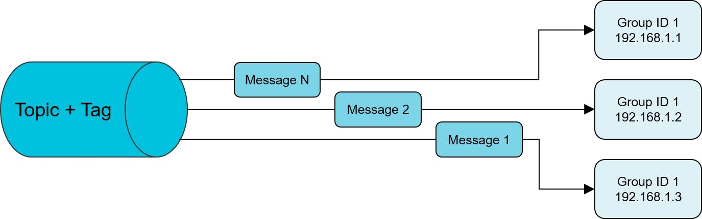

#  3 RocketMQ消息基础用法

##  3.1 普通消息

###  3.1.1 普通消息的整个流程

:::tip 普通消息的整个流程
**导入 MQ 客户端依赖**  
```xml
 <dependency> 
 <groupId>org.apache.rocketmq</groupId> 
 <artifactId>rocketmq-client</artifactId> 
 <version>4.8.0</version> 
 </dependency> 
```
-----------------

**消息发送者步骤**     
 1. 创建消息生产者 producer，并指定生产者组名 
 2. 指定 Nameserver 地址 
 3. 启动 producer 
 4. 创建消息对象，指定 Topic、Tag 和消息体 
 5. 发送消息 
 6. 关闭生产者 producer   

 -------------

**消息消费者步骤**   
 1. 创建消费者 Consumer，指定消费者组名 
 2. 指定 Nameserver 地址 
 3. 订阅主题 Topic 和 Tag 
 4. 设置回调函数，处理消息 
 5. 启动消费者 consumer
:::

### 3.1.2普通消息的发送方式

<a data-fancybox title="RocketMQ" href="./image/rocketmq25.jpg"></a>

#### 3.1.2.1 发送同步消息

这种可靠性同步地发送方式使用的比较广泛，比如：**重要的消息通知，短信通知**。  
同步发送是指消息发送方发出数据后，同步等待，直到收到接收方发回响应之后才发下一个请求。 

<a data-fancybox title="RocketMQ" href="./image/rocketmq27.jpg"></a>

```java
/**
 * * 同步发送
 */
public class SyncProducer {
    public static void main(String[] args) throws Exception {
        DefaultMQProducer producer=new DefaultMQProducer("sync");
        producer.setNamesrvAddr("110.42.146.236:9876");
        producer.start();
        for (int i = 0; i < 10; i++) {
            Message msg = new Message("TopicTest" ,
                    "TagB" ,
                    ("Hello RocketMQ " + i).getBytes(RemotingHelper.DEFAULT_CHARSET)
            );
            SendResult sendResult = producer.send(msg);
            System.out.println("SendStatus:"+sendResult.getSendStatus()+"  (MsgId):"
                    +sendResult.getMsgId()+"  (queueId):"
                    +sendResult.getMessageQueue().getQueueId()
                    +"  (value):"+ new String(msg.getBody()));
        }
        producer.shutdown();
    }
}
```
:::tip  返回结果

```sh
SendStatus:SEND_OK  (MsgId):7F000001373418B4AAC24CC514600000  (queueId):3  (value):Hello RocketMQ 0
SendStatus:SEND_OK  (MsgId):7F000001373418B4AAC24CC514AA0001  (queueId):0  (value):Hello RocketMQ 1
SendStatus:SEND_OK  (MsgId):7F000001373418B4AAC24CC514DA0002  (queueId):1  (value):Hello RocketMQ 2
SendStatus:SEND_OK  (MsgId):7F000001373418B4AAC24CC514FC0003  (queueId):2  (value):Hello RocketMQ 3
SendStatus:SEND_OK  (MsgId):7F000001373418B4AAC24CC5151F0004  (queueId):3  (value):Hello RocketMQ 4
SendStatus:SEND_OK  (MsgId):7F000001373418B4AAC24CC515440005  (queueId):0  (value):Hello RocketMQ 5
SendStatus:SEND_OK  (MsgId):7F000001373418B4AAC24CC5156C0006  (queueId):1  (value):Hello RocketMQ 6
SendStatus:SEND_OK  (MsgId):7F000001373418B4AAC24CC515940007  (queueId):2  (value):Hello RocketMQ 7
SendStatus:SEND_OK  (MsgId):7F000001373418B4AAC24CC515B70008  (queueId):3  (value):Hello RocketMQ 8
SendStatus:SEND_OK  (MsgId):7F000001373418B4AAC24CC515DE0009  (queueId):0  (value):Hello RocketMQ 9
```
▶ Message ID 消息的全局唯一标识（内部机制的 ID 生成是使用机器 IP 和消息偏移量的组成，所以有可能重复，如果是幂等性还是最好考虑 Key），由消息队列 MQ 系统自动生成，唯一标识某条消息。   

▶ SendStatus 发送的标识, 成功，失败等  

▶ Queue 相当于是 Topic 的分区；用于并行发送和接收消息  
:::

#### 3.1.2.2 发送异步消息

异步消息通常用在对响应时间敏感的业务场景，即发送端不能容忍长时间地等待 Broker 的响应。  

**代码演示**
```java
/**
 * 异步消息
 */
public class AsyncProducer {
    static  final  int messageCount = 10;
    public static void main(String[] args) throws Exception {
        DefaultMQProducer producer=new DefaultMQProducer("Async");
        producer.setNamesrvAddr("110.42.146.236:9876");
        producer.start();
        final CountDownLatch countDownLatch = new CountDownLatch(messageCount);
        //发送异步失败时的重试次数(这里不重试)
        producer.setRetryTimesWhenSendAsyncFailed(0);
        for (int i=0; i<messageCount;i++){
            final  int index=0;
            final Message message=new Message("TopicTest","TagC","OrderID"+index,("异步消息"+index).getBytes(RemotingHelper.DEFAULT_CHARSET));
            //生产者异步发送
            producer.send(message, new SendCallback() {
                @Override
                public void onSuccess(SendResult sendResult) {
                    countDownLatch.countDown();
                    System.out.printf("%-10d OK %s %n", index, new String(message.getBody()));
                }

                @Override
                public void onException(Throwable throwable) {
                    countDownLatch.countDown();
                    System.out.printf("%-10d Exception %s %n", index, throwable);
                    throwable.printStackTrace();
                }
            });

        }
        countDownLatch.await(2, TimeUnit.SECONDS);
        producer.shutdown();
    }
}
```

消息发送方在发送了一条消息后，不等接收方发回响应，接着进行第二条消息发送。发送方通过回调接口的方式接收服务器响应，并对响应结果进行处理  

<a data-fancybox title="RocketMQ" href="./image/rocketmq28.jpg"></a>


#### 3.1.2.3 单向发送

这种方式主要用在不特别关心发送结果的场景，例如日志发送。

**代码演示**
```java
/**
 *单向发送
 */
public class OnewayProducer {
    public static void main(String[] args) throws Exception{
        //生产者实例化
        DefaultMQProducer producer = new DefaultMQProducer("oneway");
        //指定rocket服务器地址
        producer.setNamesrvAddr("110.42.146.236:9876");

        //启动实例
        producer.start();
        for (int i = 0; i < 10; i++) {
            //创建一个消息实例，指定topic、tag和消息体
            Message msg = new Message("TopicTest" /* Topic */,
                    "TagA" /* Tag */,
                    ("Hello RocketMQ " + i).getBytes(RemotingHelper.DEFAULT_CHARSET) /* Message body */
            );
            //发送消息
            producer.sendOneway(msg);
            System.out.printf("%s%n",  new String(msg.getBody()));
        }
        //生产者实例不再使用时关闭.
        producer.shutdown();
    }
}
```

单向（Oneway）发送特点为发送方只负责发送消息，不等待服务器回应且没有回调函数触发，即只发送请求不等待应答。此方式发送消息的过程耗 时非常短，一般在微秒级别。cn.enjoyedu.normal.OnewayProducer

#### 3.1.2.4 消息发送的权衡

<a data-fancybox title="RocketMQ" href="./image/rocketmq30.jpg"></a>

### 3.1.3 普通消息的消费方式

#### 3.1.3.1 集群消费 

消费者的一种消费模式。一个 Consumer Group 中的各个 Consumer 实例分摊去消费消息，即一条消息只会投递到一个 Consumer Group 下面的一个实例。

实际上，每个 Consumer 是平均分摊 Message Queue 的去做拉取消费。例如某个 Topic 有 3 条 Q，其中一个 Consumer Group 有 3 个实例（可能是 3 个进程，或者 3 台机器），那么每个实例只消费其中的 1 条 Q。 

而由 Producer 发送消息的时候是轮询所有的 Q,所以消息会平均散落在不同的 Q 上，可以认为 Q 上的消息是平均的。那么实例也就平均地消费消息了。 

这种模式下，消费进度(Consumer Offset)的存储会持久化到 Broker。

**代码演示**

```java
```


#### 3.1.3.2 广播消费 

消费者的一种消费模式。消息将对一个 Consumer Group 下的各个 Consumer 实例都投递一遍。即使这些 Consumer 属于同一个 Consumer Group， 消息也会被 Consumer Group 中的每个 Consumer 都消费一次。 

实际上，是一个消费组下的每个消费者实例都获取到了 topic 下面的每个 Message Queue 去拉取消费。所以消息会投递到每个消费者实例。 

这种模式下，消费进度(Consumer Offset)会存储持久化到实例本地。 

**代码演示**

```java
```

<a data-fancybox title="RocketMQ" href="./image/rocketmq26.jpg"></a>

##  3.2 顺序消息

消息有序指的是可以按照消息的发送顺序来消费(FIFO)。RocketMQ可以严格的保证消息有序，可以分为**分区有序**或者**全局有序**。  

顺序消费的原理解析，在默认的情况下消息发送会采取**Round Robin轮询方式**把消息发送到**不同的queue(分区队列)**；而消费消息的时候从多个queue上拉取消息，这种情况发送和消费是不能保证顺序。但是如果控制发送的顺序消息只依次发送到同一个queue中，消费的时候只从这个queue上依次拉取，则就保证了顺序。

当发送和消费参与的queue只有一个，则是**全局有序**；如果多个queue参与，则为**分区有序**，即相对每个queue，消息都是有序的。

<a data-fancybox title="RocketMQ" href="./image/rocketmq32.jpg"></a>

###  3.2.1 顺序消息生产
一个订单的顺序流程是：创建、付款、推送、完成。订单号相同的消息会被先后发送到同一个队列中，下面是订单进行分区有序的示例代码

使用顺序消息：首先要保证消息是有序进入MQ的，消息放入MQ之前，对id等关键字进行取模，放入指定messageQueue，consume消费消息失败时，不能返回reconsume——later，这样会导致乱序
应该返回suspend_current_queue_a_moment,意思是先等一会，一会儿再处理这批消息，而不是放到重试队列里。
（具体实现的话，需要后续的源码分析中--集群消费时保证消费的有序性章节）

###  3.2.2 顺序消息消费
消费时，同一个OrderId获取到的肯定是同一个队列。从而确保一个订单中处理的顺序。


##  3.3 消息发送时的重要方法/属性

### 3.3.1 属性

```java
```

:::tip 消息发送的属性
1. 消费者组
<font color='red'><strong>private String consumerGroup;</strong></font>	 

2. 消息消费模式
<font color='red'><strong>private MessageModel messageModel = MessageModel.CLUSTERING;</strong></font>	

3. 指定消费开始偏移量（最大偏移量、最小偏移量、启动时间戳）开始消费
<font color='red'><strong>private ConsumeFromWhere consumeFromWhere = ConsumeFromWhere.CONSUME_FROM_LAST_OFFSET;</strong></font>

ConsumeFromTimestamp模式下只会在订阅组（消费者群组）第一次启动的时候，过滤掉小于当前系统时间戳的消息，后续如果进程停掉或者崩溃，但是又生产了新消息。下次启动消费者时，会继续消费停掉期间新生产的消息。后续行为和ConsumeFromLastOffset类似

4. 消费者最小线程数量
<font color='red'><strong>private int consumeThreadMin = 20;</strong></font>

5. 消费者最大线程数量
<font color='red'><strong>private int consumeThreadMax = 20;</strong></font>

6. 推模式下任务间隔时间
<font color='red'><strong>private long pullInterval = 0;</strong></font>

7. 推模式下任务拉取的条数,默认32条
<font color='red'><strong>private int pullBatchSize = 32;</strong></font>

8. 消息重试次数,-1代表16次
<font color='red'><strong>private int maxReconsumeTimes = -1;</strong></font>

9. 消息消费超时时间
<font color='red'><strong>private long consumeTimeout = 15;</strong></font>

:::

### 3.3.2 方法

```java
void subscribe(final String topic, final MessageSelector selector) ：订阅消息，并指定队列选择器
void unsubscribe(final String topic)：取消消息订阅
Set<MessageQueue> fetchSubscribeMessageQueues(final String topic) :获取消费者对主题分配了那些消息队列
void registerMessageListener(final MessageListenerConcurrently messageListener)：注册并发事件监听器

void registerMessageListener(final MessageListenerOrderly messageListener)：注册顺序消息事件监听器
```

### 3.3.3 消费确认(ACK)

业务实现消费回调的时候，

当且仅当此回调函数返回<font color='red'><strong>ConsumeConcurrentlyStatus.CONSUME_SUCCESS</strong></font>，

RocketMQ才会认为这批消息（默认是1条）是消费完成的中途断电，抛出异常等都不会认为成功——即都会重新投递。

返回<font color='red'><strong>ConsumeConcurrentlyStatus.RECONSUME_LATER</strong></font>，RocketMQ就会认为这批消息消费失败了。

如果业务的回调没有处理好而抛出异常，会认为是消费失败<font color='red'><strong>ConsumeConcurrentlyStatus.RECONSUME_LATER</strong></font>处理。

为了保证消息是肯定被至少消费成功一次，RocketMQ会把这批消息重发回Broker（topic不是原topic而是这个消费组的RETRY topic），在延迟的某个时间点（默认是10秒，业务可设置）后，再次投递到这个ConsumerGroup。

而如果一直这样重复消费都持续失败到一定次数（默认16次），就会投递到<font color='red'><strong>DLQ死信队列</strong></font>。应用可以监控死信队列来做人工干预。

另外如果使用<font color='red'><strong>顺序消费的回调MessageListenerOrderly</strong></font>时，由于顺序消费是要前者消费成功才能继续消费，所以没有RECONSUME_LATER的这个状态，只有<font color='red'><strong>SUSPEND_CURRENT_QUEUE_A_MOMENT</strong></font>来暂停队列的其余消费，直到原消息不断重试成功为止才能继续消费

```java
```

## 3.4 延时消息
### 3.4.1 概念介绍
延时消息：Producer 将消息发送到消息队列 RocketMQ 服务端，但并不期望这条消息立马投递，而是延迟一定时间后才投递到 Consumer 进行消费，该消息即延时消息。
### 3.4.2 适用场景
消息生产和消费有时间窗口要求：比如在电商交易中超时未支付关闭订单的场景，在订单创建时会发送一条延时消息。这条消息将会在 30 分钟以后投递给消费者，消费者收到此消息后需要判断对应的订单是否已完成支付。 如支付未完成，则关闭订单。如已完成支付则忽略。
### 3.4.3 使用方式
Apache RocketMQ目前只支持固定精度的定时消息，因为如果要支持任意的时间精度，在 Broker 层面，必须要做消息排序，如果再涉及到持久化，那么消息排序要不可避免的产生巨大性能开销。（阿里云RocketMQ提供了任意时刻的定时消息功能，Apache的RocketMQ并没有,阿里并没有开源）
发送延时消息时需要设定一个延时时间长度，消息将从当前发送时间点开始延迟固定时间之后才开始投递。
延迟消息是根据延迟队列的level来的，延迟队列默认是
msg.setDelayTimeLevel(3)代表延迟10秒
"1s 5s 10s 30s 1m 2m 3m 4m 5m 6m 7m 8m 9m 10m 20m 30m 1h 2h"
源码中：org/apache/rocketmq/store/config/MessageStoreConfig.java

是这18个等级（秒（s）、分（m）、小时（h）），level为1，表示延迟1秒后消费，level为5表示延迟1分钟后消费，level为18表示延迟2个小时消费。生产消息跟普通的生产消息类似，只需要在消息上设置延迟队列的level即可。消费消息跟普通的消费消息一致。
### 3.4.4 代码演示
org.apache.rocketmq.example. scheduled包中
生产者

消费者

## 3.5 批量消息

## 3.6 过滤消息

## 3.7 事务消息