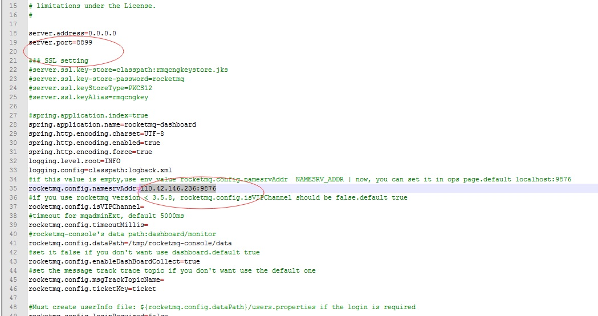
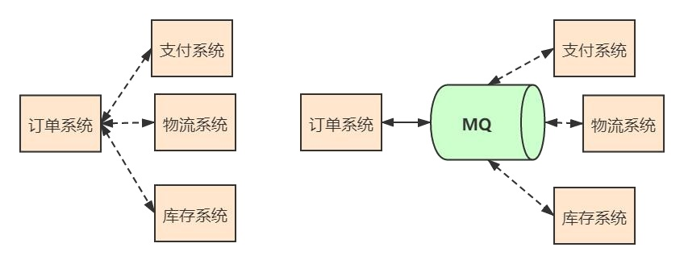
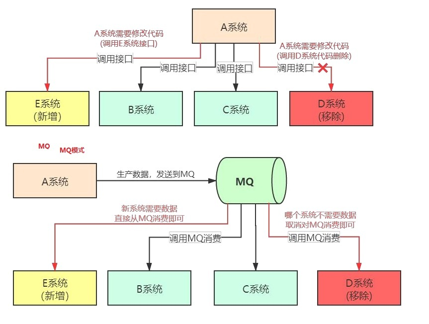
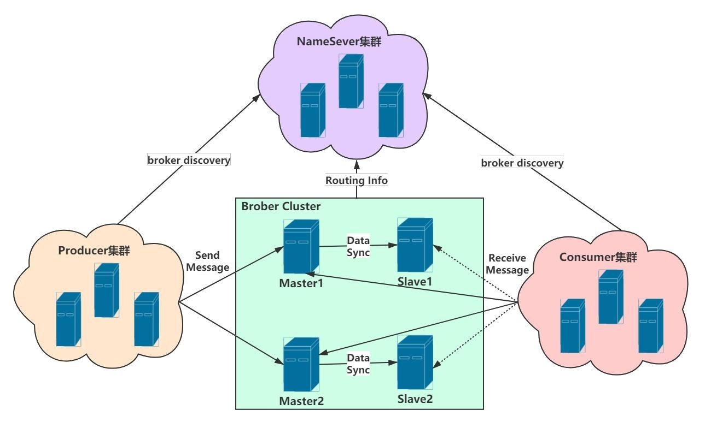

# 1.RocketMQ简介

## 1.1 RocketMQ在linux下安装


<a href='http://rocketmq.apache.org/dowloading/releases/'>官方下载地址 http://rocketmq.apache.org/dowloading/releases/</a>

### 1.1.1 调整启动参数

:::tip 注意事项
RocketMQ默认的虚拟机内存较大，启动Broker如果因为内存不足失败，需要编辑如下两个配置文件，修改JVM内存大小。
但是这个也仅仅是在测试环境中，RocketMQ在生产上最低要求至少8G内存（官方推荐）才能确保RocketMQ的效果
:::

------------
```sh
vi runbroker.sh           --broker的配置
vi runserver.sh            --nameServer的配置
JAVA_OPT="${JAVA_OPT} -server -Xms1024m -Xmx1024m -Xmn512m -XX:MetaspaceSize=128m -XX:MaxMetaspaceSize=320m"
```

### 1.1.2 启动namesrv和启动broker 

```sh
cd /root/rocketmq-all-4.8.0-bin-release/bin
#启动NAMESERVER
nohup sh mqnamesrv &

#查看日志的命令：
tail -f ~/logs/rocketmqlogs/namesrv.log
```


```sh
#修改配置文件增加外网地址(你启动加载哪个配置文件就修改哪个，这里修改broker.conf)
cd /root/rocketmq-all-4.8.0-bin-release/conf
vi broker.conf
brokerIP1=110.42.146.236

# 启动broker
cd /root/rocketmq-all-4.8.0-bin-release/bin

nohup sh mqbroker -c ../conf/broker.conf  -n 110.42.146.236:9876 autoCreateTopicEnable=true &  
#这样启动的服务器可以自动创建主题（客户端）,不过生产一般不推荐。
##推荐使用如下
nohup ./mqbroker -n 110.42.146.236:9876 &
#查看日志的命令
tail -f ~/logs/rocketmqlogs/broker.log
```

:::tip 启动遇见的问题
**Error when measuring disk space usage, file doesn't exist on this path: /root/store/commitlog**   

```sh
mkdir  /root/store/commitlog
```
**Error when measuring disk space usage, file doesn't exist on this path: /root/store/consumequeue**   

```sh
mkdir  /root/store/consumequeue
```
:::

### 1.1.3 安装控制台插件

**新版本RocketMQ配置Web管理界面：解决找不到rocketmq-console目录问题**
想配置一下RocketMQ的web管理页面，发现网上的资料都是之前版本的说明，导致无法成功配置。
所以想自己查看一下,我们发现<a href='https://github.com/apache/rocketmq-externals'>https://github.com/apache/rocketmq-externals</a>
这个git项目上并没有找到rocketmq-console这个目录.

**已经创建了一个独立的仓库并命名为RocketMQ Dashboard**

<a href='https://github.com/apache/rocketmq-dashboard'>https://github.com/apache/rocketmq-dashboard</a>

:::tip  编译安装启动

1. 下载完成之后，进入‘\rocketmq-dashboard-master\src\main\resources’文件夹，打开‘application.properties’进行配置

<a data-fancybox title="RocketMQ" href="./image/rocketmq11.jpg"></a>

2. 进入 H:\安装包\MQ\rocketmq-dashboard-master，

```sh
# 编译生成
mvn clean package -Dmaven.test.skip=true
```

3. 上传启动
```sh
nohup java -jar rocketmq-dashboard-2.0.0.jar &
```
4. 登录验证
<a href='http://110.42.146.236:8899'>http://110.42.146.236:8899</a>

:::

### 1.1.4 验证

**查看是否启动成功**

```sh
[root@VM-4-12-centos bin]# jps -l
31922 sun.tools.jps.Jps
23182 rocketmq-dashboard-2.0.0.jar
13822 org.apache.rocketmq.broker.BrokerStartup
11054 org.apache.rocketmq.namesrv.NamesrvStartup
```
**验证是否启动成功**


:::tip 遇见的问题
**java.lang.IllegalStateException: org.apache.rocketmq.remoting.exception.RemotingConnectException: connect to null failed**
**解决办法：**
```sh
vi tools.sh
export JAVA_HOME
export JAVA="$JAVA_HOME/bin/java"
export BASE_DIR=$(dirname $0)/..
export CLASSPATH=.:${BASE_DIR}/conf:${CLASSPATH}
## 添加如下：export NAMESRV_ADDR=110.42.146.236:9876
export NAMESRV_ADDR=110.42.146.236:9876
#===========================================================================================
# JVM Configuration
#===========================================================================================
JAVA_OPT="${JAVA_OPT} -server -Xms1g -Xmx1g -Xmn256m -XX:MetaspaceSize=128m -XX:MaxMetaspaceSize=128m"
JAVA_OPT="${JAVA_OPT} -Djava.ext.dirs=${BASE_DIR}/lib:${JAVA_HOME}/jre/lib/ext:${JAVA_HOME}/lib/ext"
JAVA_OPT="${JAVA_OPT} -cp ${CLASSPATH}"

$JAVA ${JAVA_OPT} "$@"

```
:::

```sh
sh tools.sh org.apache.rocketmq.example.quickstart.Producer
##可以正常发送消息
ocketMQLog:WARN No appenders could be found for logger (io.netty.util.internal.PlatformDependent0).
RocketMQLog:WARN Please initialize the logger system properly.
SendResult [sendStatus=SEND_OK, msgId=7F00000112C936BAF30C3D7C4FB20000, offsetMsgId=6E2A92EC00002A9F0000000000000000, messageQueue=MessageQueue [topic=TopicTest, brokerName=broker-a, queueId=2], queueOffset=0]
SendResult [sendStatus=SEND_OK, msgId=7F00000112C936BAF30C3D7C4FD90001, offsetMsgId=6E2A92EC00002A9F00000000000000C9, messageQueue=MessageQueue [topic=TopicTest, brokerName=broker-a, queueId=3], queueOffset=0]
22:32:38.995 [NettyClientSelector_1] INFO  RocketmqRemoting - closeChannel: close the connection to remote address[110.42.146.236:9876] result: true
22:32:39.002 [NettyClientSelector_1] INFO  RocketmqRemoting - closeChannel: close the connection to remote address[110.42.146.236:10911] result: true

```
**验证能否正常消费**

```sh
sh tools.sh org.apache.rocketmq.example.quickstart.Consumer
##正常消费 
_START_TIME=1631457281108, UNIQ_KEY=7F00000112C936BAF30C3D7C573703D0, CLUSTER=DefaultCluster, WAIT=true, TAGS=TagA}, body=[72, 101, 108, 108, 111, 32, 82, 111, 99, 107, 101, 116, 77, 81, 32, 57, 55, 54], transactionId='null'}]] 
ConsumeMessageThread_2 Receive New Messages: [MessageExt [brokerName=broker-a, queueId=2, storeSize=203, queueOffset=243, sysFlag=0, bornTimestamp=1631457158957, bornHost=/110.42.146.236:33792, storeTimestamp=1631457158958, storeHost=/110.42.146.236:10911, msgId=6E2A92EC00002A9F0000000000030256, commitLogOffset=197206, bodyCRC=794315549, reconsumeTimes=0, preparedTransactionOffset=0, toString()=Message{topic='TopicTest', flag=0, properties={MIN_OFFSET=0, MAX_OFFSET=250, CONSUME_START_TIME=1631457281108, UNIQ_KEY=7F00000112C936BAF30C3D7C572D03CC, CLUSTER=DefaultCluster, WAIT=true, TAGS=TagA}, body=[72, 101, 108, 108, 111, 32, 82, 111, 99, 107, 101, 116, 77, 81, 32, 57, 55, 50], transactionId='null'}]] 

```

# 2. RocketMQ基础介绍


**消息中间件(MQ)的定义**
一般认为，消息中间件属于分布式系统中一个子系统，关注于数据的发送和接收，利用高效可靠的异步消息传递机制对分布式系统中的其余各个子系统进行集成。 

<font color='red'><strong>高效</strong></font>：对于消息的处理处理速度快。   
<font color='red'><strong>可靠</strong></font>：一般消息中间件都会有消息持久化机制和其他的机制确保消息不丢失。   
<font color='red'><strong>异步</strong></font>：指发送完一个请求，不需要等待返回，随时可以再发送下一个请求，既不需要等待。   

**一句话总结，我们消息中间件不生产消息，只是消息的搬运工**

##  2.1 消息中间件作用

###  2.1.1 应用解耦 
系统的耦合性越高，容错性就越低。以电商应用为例，用户创建订单后，如果耦合调用库存系统、物流系统、支付系统，任何一个子系统出了故障或者 因为升级等原因暂时不可用，都会造成下单操作异常，影响用户使用体验 使用消息中间件，系统的耦合性就会提高了。比如物流系统发生故障，需要几分钟才能来修复，在这段时间内，物流系统要处理的数据被缓存到消息队列中，用户的下单操作正常完成。当物流系统恢复后，继续处理存放在消息队列中的订单消息即可，终端系统感知不到物流系统发生过几分钟故障。
<a data-fancybox title="RocketMQ" href="./image/rocketmq21.jpg"></a>

###  2.1.2 流量削峰 
应用系统如果遇到系统请求流量的瞬间猛增，有可能会将系统压垮。有了消息队列可以将大量请求缓存起来，分散到很长一段时间处理，这样可以大大 提到系统的稳定性和用户体验。 互联网公司的大促场景（双十一、店庆活动、秒杀活动）都会使用到 MQ。
<a data-fancybox title="RocketMQ" href="./image/rocketmq22.jpg"></a>

###  2.1.3 数据分发 

通过消息队列可以让数据在多个系统更加之间进行流通。数据的产生方不需要关心谁来使用数据，只需要将数据发送到消息队列，数据使用方直接在消 息队列中直接获取数据即可。 接口调用的弊端，无论是新增系统，还是移除系统，代码改造工作量都很大。 使用 MQ 做数据分发好处，无论是新增系统，还是移除系统，代码改造工作量较小。 所以使用 MQ 做数据的分发，可以提高团队开发的效率。
RocketMQ 产品发展 RocketMQ 版本发

<a data-fancybox title="RocketMQ" href="./image/rocketmq23.jpg"></a>

##  2.2 RocketMQ 的物理架构

消息队列 RocketMQ 是阿里巴巴集团基于高可用分布式集群技术，自主研发的云正式商用的专业消息中间件，既可为分布式应用系统提供异步解耦 和削峰填谷的能力，同时也具备互联网应用所需的海量消息堆积、高吞吐、可靠重试等特性，是阿里巴巴双 11 使用的核心产品。 RocketMQ 的设计<font color='red'><strong>基于主题的发布与订阅模式</strong></font>，其核心功能包括<font color='red'><strong>消息发送、消息存储(Broker)、消息消费</strong></font>，整体设计追求简单与性能第一。

<a data-fancybox title="RocketMQ" href="./image/rocketmq24.jpg"></a>

###  2.2.1 NameServer 

NameServer 是整个 RocketMQ 的“大脑”，它是 RocketMQ 的服务注册中心,所以 RocketMQ 需要先启动 NameServer 再启动 Rocket 中的 Broker。

Broker 在启动时向所有 NameServer 注册（主要是服务器地址等），生产者在发送消息之前先从 NameServer 获取 Broker 服务器地址列表（消费者一 样），然后根据负载均衡算法从列表中选择一台服务器进行消息发送。 

NameServer 与每台 Broker 服务保持长连接，并间隔 30S 检查 Broker 是否存活，如果检测到 Broker 宕机，则从路由注册表中将其移除。
这样就可以实现 RocketMQ 的高可用。

###  2.2.2 生产者(Producer) 
生产者：也称为消息发布者，负责生产并发送消息至 RocketMQ。 

###  2.2.3 消费者(Consumer) 
消费者：也称为消息订阅者，负责从 RocketMQ 接收并消费消息。 

###  2.2.4 消息(Message) 
消息：生产或消费的数据，对于 RocketMQ 来说，消息就是字节数组。 

###  2.2.5 主机(Broker) 
RocketMQ 的核心，用于暂存和传输消息。

### 2.2.2 物理架构中的整体运转 

:::tip 物理架构中的整体运转
1. NameServer 先启动 

2. Broker 启动时向 NameServer 注册 

3. 生产者在发送某个主题的消息之前先从 NamerServer 获取 Broker 服务器地址列表（有可能是集群），然后根据负载均衡算法从列表中选择一台 Broker 进行消息发送。 

4. NameServer 与每台 Broker 服务器保持长连接，并间隔 30S 检测 Broker 是否存活，如果检测到 Broker 宕机（使用心跳机制，如果检测超过120S），则从路由注册表中将其移除。 

5. 消费者在订阅某个主题的消息之前从 NamerServer 获取 Broker 服务器地址列表（有可能是集群），但是消费者选择从 Broker 中订阅消息，订阅规则由 Broker 配置决定。
:::

##  2.3 RocketMQ 的概念模型

###  2.3.1 分组(Group) 

<font color='red'><strong>生产者</strong></font>：标识发送同一类消息的 Producer，通常发送逻辑一致。发送普通消息的时候，仅标识使用，并无特别用处。
主要作用用于事务消息： （事务消息中如果某条发送某条消息的producer-A宕机，使得事务消息一直处于PREPARED状态并超时，则broker会回查同一个group的其它producer， 确认这条消息应该 commit 还是 rollback）

<font color='red'><strong>消费者</strong></font>：标识一类 Consumer 的集合名称，这类 Consumer 通常消费一类消息，且消费逻辑一致。同一个 Consumer Group 下的各个实例将共同消费 topic 的消息，起到负载均衡的作用。 消费进度以 Consumer Group 为粒度管理，不同 Consumer Group 之间消费进度彼此不受影响，即消息 A 被 Consumer Group1 消费过，也会再给 Consumer Group2 消费。 主题(Topic) 标识一类消息的逻辑名字，消息的逻辑管理单位。无论消息生产还是消费，都需要指定 Topic。 区分消息的种类；一个发送者可以发送消息给一个或者多个 Topic；一个消息的接收者可以订阅一个或者多个 Topic 消息

###  2.3.2 标签(Tag) 
RocketMQ 支持给在发送的时候给 topic 打 tag，同一个 topic 的消息虽然逻辑管理是一样的。但是消费 topic1 的时候，如果你消费订阅的时候指定的 是 tagA，那么 tagB 的消息将不会投递。 

###  2.3.3 消息队列(Message Queue) 

简称 Queue 或 Q。消息物理管理单位。一个 Topic 将有若干个 Q。若一个 Topic 创建在不同的 Broker，则不同的 broker 上都有若干 Q，消息将物理地存储落在不同 Broker 结点上，具有水平扩展的能力。 

无论生产者还是消费者，实际的生产和消费都是针对 Q 级别。例如 Producer 发送消息的时候，会预先选择（默认轮询）好该 Topic 下面的某一条 Q 发送；

Consumer 消费的时候也会负载均衡地分配若干个 Q，只拉取对应 Q 的消息。 每一条 message queue 均对应一个文件，这个文件存储了实际消息的索引信息。并且即使文件被删除，也能通过实际纯粹的消息文件（commit log） 恢复回来。 

###  2.3.4 偏移量(Offset) 

RocketMQ 中，有很多 offset 的概念。一般我们只关心暴露到客户端的 offset。不指定的话，就是指 Message Queue 下面的 offset。  

Message queue 是无限长的数组。一条消息进来下标就会涨 1,而这个数组的下标就是 offset，Message queue 中的 max offset 表示消息的最大 offset Consumer offset 可以理解为标记 Consumer Group 在一条逻辑 Message Queue 上，消息消费到哪里即消费进度。

但从源码上看，这个数值是消费过的 最新消费的消息 offset+1，即实际上表示的是下次拉取的 offset 位置。


##  2.3 RocketMQ消息基础用法

###  2.3.1 普通消息

###  2.3.2 顺序消息