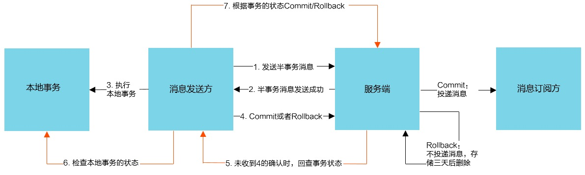

# 6. Springboot整合

## 6.1 maven依赖

```xml
    <dependency>
        <groupId>org.apache.rocketmq</groupId>
        <artifactId>rocketmq-spring-boot-starter</artifactId>
        <version>2.0.3</version>
    </dependency>
```

## 6.2 结合分布式事务演示

<a data-fancybox title="RocketMQ" href="./image/fenbushishiwu.jpg"></a>

### 6.2.1 事务消息发送步骤

:::tip 事务消息发送步骤
1. 发送方将半事务消息发送至消息队列 MQ 服务端。

2. 消息队列 MQ 服务端将消息持久化成功之后，向发送方返回 Ack 确认消息已经发送成功，此时消息为**半事务消息**。 

3. 发送方开始执行本地事务逻辑。 

4. 发送方根据本地事务执行结果向服务端提交二次确认（Commit 或是 Rollback），

    MQ服务端收到 Commit 状态则将半事务消息标记为可投递，订阅方最终将收到该消息；  
    MQ服务端收到Rollback 状态则删除半事务消息，订阅方将不会接受该消息。  
:::

:::tip 事务消息回查步骤
1. 在断网或者是应用重启的特殊情况下，上述**步骤4提交**的二次确认最终未到达MQ服务端，经过固定时间后服务端将对该消息发起消息回查（**第五步操作**）。 

2. 发送方收到消息回查后，需要检查对应消息的本地事务执行的最终结果(**第六步操作**)。 

3. 发送方根据检查得到的本地事务的最终状态再次提交二次确认，MQ服务端仍按照步骤 4对半事务消息进行操作
:::

:::tip 消息状态
org.apache.rocketmq.client.producer.LocalTransactionState 

-------------------

1. 提交事务，它允许消费者消费此消息。  
LocalTransactionState.CommitTransaction 

2. 回滚事务，它代表该消息将被删除，不允许被消费   
LocalTransactionState.RollbackTransaction 

3. 中间状态，它代表需要检查消息队列来确定状态   
LocalTransactionState.Unknown
:::

----------------

:::tip 事务消息限制
1. 事务消息不支持延时消息和批量消息。 

2. 为了避免单个消息被检查太多次而导致半队列消息累积，我们**默认将单个消息的检查次数限制为 15 次**，但是用户可以通过 Broker 配置文件的 transactionCheckMax参数来修改此限制。如果已经检查某条消息超过 N 次的话（ N = transactionCheckMax ） 则 Broker 将丢弃此消息，并在默认情况下同时打印错误日志。用户可以通过重写 AbstractTransactio nCheckListener类来修改这个行为。 

3. 事务消息将在 Broker 配置文件中的参数 transactionMsgTimeout 这样的特定时间长度之后被检查。当发送事务消息时，用户还可以通过设置用户属性 CHECK_IMMUNITY_TIME_I N_SECONDS来改变这个限制，该参数优先于 transactionMsgTimeout 参数。 

4. 事务性消息可能不止一次被检查或消费。 

5. 提交给用户的目标主题消息可能会失败，目前这依日志的记录而定。它的高可用性通过RocketMQ 本身的高可用性机制来保证，如果希望确保事务消息不丢失、并且事务完整性得到保证，建议使用同步的双重写入机制。 

6. 事务消息的3生产者 ID 不能与其他类型消息的生产者 ID 共享。与其他类型的消息不同，事务消息允许反向查询、MQ服务器能通过它们的生产者 ID 查询到消费者。
:::


## 6.3 消息生产者
```java
 /**
     * 发送事务消息
     * @throws MessagingException
     */
    @GetMapping("testTransaction")
    private void testTransaction() throws MessagingException {
        String[] tags = new String[]{"TagA", "TagB", "TagC", "TagD", "TagE"};
        for (int i = 0; i < 10; i++) {
            try {

                Message msg = MessageBuilder.withPayload("Hello RocketMQ " + i).
                        setHeader(RocketMQHeaders.KEYS, "KEY_" + i).build();
                /**
                 * TX_PGROUP_NAME 必须同 {@link TransactionListenerImpl} 类的注解 txProducerGroup
                 * @RocketMQTransactionListener(txProducerGroup = "myTxProducerGroup")
                 */
                SendResult sendResult = rocketMQTemplate.sendMessageInTransaction(TX_PGROUP_NAME,
                        springTransTopic + ":" + tags[i % tags.length], msg, null);
                System.out.printf(i+"------ send Transactional msg body = %s , sendResult=%s %n",
                        msg.getPayload(), sendResult.getSendStatus());

                Thread.sleep(10);
            } catch (Exception e) {
                e.printStackTrace();
            }
        }
    }
```

## 6.4 消息回查
```java
package com.tqk.product.trans;

import org.apache.rocketmq.spring.annotation.RocketMQTransactionListener;
import org.apache.rocketmq.spring.core.RocketMQLocalTransactionListener;
import org.apache.rocketmq.spring.core.RocketMQLocalTransactionState;
import org.apache.rocketmq.spring.support.RocketMQHeaders;
import org.springframework.messaging.Message;

import java.util.concurrent.ConcurrentHashMap;
import java.util.concurrent.atomic.AtomicInteger;

/**
 * @description :事务回查
 */
@RocketMQTransactionListener(txProducerGroup = "myTxProducerGroup")
public class TransactionListenerImpl implements RocketMQLocalTransactionListener {
    private AtomicInteger transactionIndex = new AtomicInteger(0);

    private ConcurrentHashMap<String, Integer> localTrans = new ConcurrentHashMap<String, Integer>();

    @Override
    public RocketMQLocalTransactionState executeLocalTransaction(Message msg, Object arg) {
        String transId = (String)msg.getHeaders().get(RocketMQHeaders.PREFIX + RocketMQHeaders.TRANSACTION_ID);
        System.out.printf("#### executeLocalTransaction is executed, msgTransactionId=%s %n", transId);
        //模拟本地事务各种事务状态
        int value = transactionIndex.getAndIncrement();
        int status = value % 3;
        localTrans.put(transId, status);
        if (status == 0) {
            // 事务提交
            System.out.printf("    本地事务提交成功 # COMMIT # Simulating msg %s related local transaction exec succeeded! ### %n", msg.getPayload());
            return RocketMQLocalTransactionState.COMMIT;
        }else if (status == 1) {
            // 本地事务回滚
            System.out.printf("    # 本地事务提交失败，回滚ROLLBACK # Simulating %s related local transaction exec failed! %n", msg.getPayload());
            return RocketMQLocalTransactionState.ROLLBACK;
        }else{
            // 事务状态不确定,待Broker发起 ASK 回查本地事务状态
            System.out.printf("  事务状态不确定,待Broker发起 ASK 回查本地事务状态  # UNKNOW # Simulating %s related local transaction exec UNKNOWN! \n");
            return RocketMQLocalTransactionState.UNKNOWN;
        }

    }

    /**
     * 在{@link TransactionListenerImpl#executeLocalTransaction(Message, Object)}
     * 中执行本地事务时可能失败，或者异步提交，导致事务状态暂时不能确定，broker在一定时间后
     * 将会发起重试，broker会向producer-group发起ask回查，
     * 这里producer->相当于server端，broker相当于client端，所以由此可以看出broker&producer-group是
     * 双向通信的。
     * Broker发起 ASK 回查本地事务状态
     * @param msg
     * @return
     */
    @Override
    public RocketMQLocalTransactionState checkLocalTransaction(Message msg) {
        String transId = (String)msg.getHeaders().get(RocketMQHeaders.PREFIX + RocketMQHeaders.TRANSACTION_ID);
        RocketMQLocalTransactionState retState = RocketMQLocalTransactionState.COMMIT;
        //模拟本地事务状态
        Integer status = localTrans.get(transId);
        if (null != status) {
            switch (status) {
                case 0:
                    retState = RocketMQLocalTransactionState.UNKNOWN;
                    break;
                case 1:
                    retState = RocketMQLocalTransactionState.COMMIT;
                    break;
                case 2:
                    retState = RocketMQLocalTransactionState.ROLLBACK;
                break;
            }
        }
        System.out.printf("------事务回查 !!! checkLocalTransaction is executed once," +
                        " msgTransactionId=%s, TransactionState=%s status=%s %n",
                transId, retState, status);
        return retState;
    }
}
```

## 6.5 消息消费者

```java
package com.tqk.consumer;

import lombok.extern.slf4j.Slf4j;
import org.apache.rocketmq.spring.annotation.RocketMQMessageListener;
import org.apache.rocketmq.spring.core.RocketMQListener;
import org.springframework.stereotype.Service;

/**
 * StringTransactionalConsumer
 */
@Slf4j
@Service
@RocketMQMessageListener(topic = "${tl.rocketmq.transTopic}", consumerGroup = "myTxProducerGrouptl")
public class StringTransactionalConsumer implements RocketMQListener<String> {

    @Override
    public void onMessage(String message) {
        System.out.printf("------- StringTransactionalConsumer received: %s \n", message);
    }
}

```
