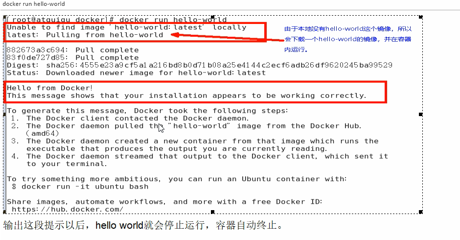

# 2. Centos7.0安装Docker


<a href="https://docs.docker.com/engine/install/centos/">https://docs.docker.com/engine/install/centos/</a>

## 2.1 移除以前docker相关包

```sh
sudo yum remove docker \
                  docker-client \
                  docker-client-latest \
                  docker-common \
                  docker-latest \
                  docker-latest-logrotate \
                  docker-logrotate \
                  docker-engine
```


## 2.2 配置yum源

```sh
sudo yum install -y yum-utils
sudo yum-config-manager \
--add-repo \
http://mirrors.aliyun.com/docker-ce/linux/centos/docker-ce.repo

```

## 2.3 安装docker

```sh
sudo yum install -y docker-ce docker-ce-cli containerd.io


#以下是在安装k8s的时候使用
yum install -y docker-ce-20.10.7 docker-ce-cli-20.10.7  containerd.io-1.4.6

```

## 2.4 启动

```sh
systemctl enable docker --now
```

## 2.5 配置加速

**这里额外添加了docker的生产环境核心配置cgroup**

### 2.5.1 阿里云镜像加速
​
<a href="https://promotion.aliyun.com/ntms/act/kubernetes.html">https://promotion.aliyun.com/ntms/act/kubernetes.html</a>

​	鉴于国内网络问题，后续拉取Docker镜像十分缓慢，我们可以需要配置加速器来解决，
我使用的是阿里云的本人自己账号的镜像地址(需要自己注册有一个属于你自己的): https://gmbtuhv4.mirror.aliyuncs.com

登录阿里云服务器

**控制台-》产品与服务-》容器镜像服务-》镜像加速器**

<a data-fancybox title="阿里云镜像加速" href="./image/docker01.jpg"></a>


-----------------------------

### 2.5.2 配置本机Docker运行镜像加速器

```sh

sudo mkdir -p /etc/docker
sudo tee /etc/docker/daemon.json <<-'EOF'
{
  "registry-mirrors": ["https://gmbtuhv4.mirror.aliyuncs.com"],
  "exec-opts": ["native.cgroupdriver=systemd"],
  "log-driver": "json-file",
  "log-opts": {
    "max-size": "100m"
  },
  "storage-driver": "overlay2"
}
EOF
```

### 2.5.3 重新启动 Docker 后台服务

```sh

sudo systemctl daemon-reload  

sudo systemctl restart docker
#或者
service docker restart

# Linux系统下配置完加速器需要检查是否生效
docker info
# registry-mirror参数说明配置成功，如下所示: https://gmbtuhv4.mirror.aliyuncs.com
```

## 2.6 启动Docker后台容器

```sh
docker run hello world
```

----------

<a data-fancybox title="hello world" href="./image/Snipaste_2020-10-03_10-54-57.png"></a>


**run干了什么**

<a data-fancybox title="hello world" href="./image/Snipaste_2020-10-03_10-55-24.png"></a>