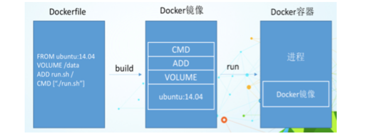

# 6. DockerFile
[[toc]]
## 6.1 DockerFile是什么
**Dockerfile是用来构建Docker镜像的构建文件，由一系列命令和参数构成的脚本**

#### Base 镜像(scratch) 
Docker Hub中 99%的镜像都是通过在base镜像中安装和配置需要的软件构建出来的

:::tip 构建三步骤

​1. 编写Dockerfile文件

2. docker build

​3. docker run
:::

## 6.2 Docker执行Dockerfile的大致流程

1. docker 从基础镜像运行一个容器
2. 执行一条指令并对容器作出修改
3. 执行类似docker commit的操作提交- -个新的镜像层
4. docker再基 于刚提交的镜像运行一一个新容器
5. 执行dockerfile中的 下一条指令直到所有指令都执行完成

-----------------

### 小总结

从应用软件的角度来看，Dockerfile、 Docker镜像与Docker容器分别代表软件的三个不同阶段，
Dockerfile是软件的原材料
Docker镜像是软件的交付品
Docker容器则可以认为是软件的运行态。
Dockerfile面向开发，Docker镜 像成为交付标准，Docker容 器则涉及部署与运维，三者缺- -不可，合力充当Docker体系的基石。

<a data-fancybox title="" href="./image/Snipaste_2020-10-03_17-35-08.png"></a>

## 6.3 DockerFile常用命令

:::tip 常用命令
<font color='red'><strong>FROM image_name:tag </strong></font>:  
定义了使用哪个基础镜像启动构建流程  

<font color='red'><strong>MAINTAINER user_name</strong></font>:  
声明镜像的创建者  

<font color='red'><strong>ENV key value </strong></font>:   
设置环境变量 (可以写多条)  

<font color='red'><strong>RUN command </strong></font>:  
是Dockerfile的核心部分(可以写多条)  
 
<font color='red'><strong>ADD source_dir/file dest_dir/file</strong></font>:  
将宿主机的文件复制到容器内，如果是一个压缩文件，将会在复制后自动解压

<font color='red'><strong>COPY source_dir/file dest_dir/file </strong></font>:  
和ADD相似，但是如果有压缩文件并不能解压

<font color='red'><strong>WORKDIR path_dir</strong></font>:  
设置工作目录
:::

## 6.4  自定义镜像

### 6.4.1 创建Dockerfile脚本文件

vi /mydata/Dockerfile

```shell
FROM centos:7
MAINTAINER tianqikai
#把宿主机当前上下文的tqk.txt拷贝到容器/usr/local/路径下
COPY tqk.txt /usr/local/cincontainer.txt
#把java与tomcat添加到容器中
ADD jdk-8u231-linux-x64.tar.gz /usr/local/
ADD apache-tomcat-8.5.72.tar.gz /usr/local/
#安装vim编辑器
RUN yum -y install vim
#设置工 作访问时候的WORKDIR路径， 登录落脚点
ENV MYPATH /usr/local
WORKDIR $MYPATH
#配:置java与tomcat环境变量
ENV JAVA_HOME /usr/local/jdk1.8.0_231
ENV CLASSPATH $JAVA_HOME/lib/dt.jar:$JAVA_HOME/lib/tools.jar
ENV CATALINA_HOME /usr/local/apache-tomcat-8.5.72
ENV CATALINA_BASE /usr/local/apache-tomcat-8.5.72
ENV PATH $PATH:$JAVA_HOME/bin:$CATALINA_HOME/ib:$CATALINA_HOME/bin
#容器运行时监听的端口
EXPOSE 8080
#启动时运行tomcat
# ENTRYPOINT ["/usrl/local/apache-tomcat-8.5.72/bin/startup.sh" ]
# CMD ["/usr/local/apache-tomcat-8.5.72/bin/catalina.sh","run"]
CMD /usr/local/apache-tomcat-8.5.72/bin/startup.sh && tail -F /usr/local/apache-tomcat-8.5.72/logs/catalina.out
```

### 6.4.2 执行命令构建镜像

```sh
# .表示所需要的资源在当前执行命令的路径下
docker build -t tomcat-tqk .

docker build -t tomcat-tqk /mydata

[root@TXYUN-NO2 mydata]# docker build -t tomcat-tqk .
```

### 6.4.3 运行自定义镜像

```sh
docker run  -p 9080:8080 --name tqk001 tomcat-tqk 
```