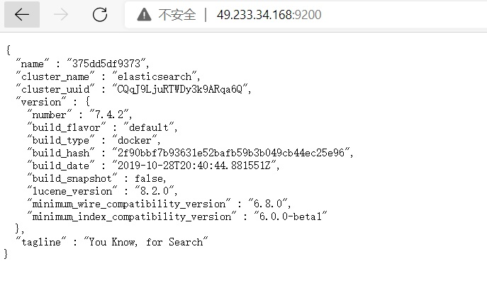

# 7 Docker安装Elasticsearch、Kibana
[[toc]]
## 7.1 下载Elasticsearch、Kibana镜像文件

```sh
# 存储和检索数据
docker pull elasticsearch:7.4.2

# 可视化检索数据
docker pull kibana:7.4.2
```

## 7.2 启动Elasticsearch

```sh
#配置挂载数据文件夹
# 创建配置文件目录
mkdir -p /mydata/elasticsearch/config

# 创建数据目录
mkdir -p /mydata/elasticsearch/data

# 将/mydata/elasticsearch/文件夹中文件都可读可写（必须是777）
chmod -R 777 /mydata/elasticsearch/

# 配置任意机器可以访问 elasticsearch
echo "http.host: 0.0.0.0" >/mydata/elasticsearch/config/elasticsearch.yml

#命令后面的 \是换行符，注意前面有空格

docker run --name elasticsearch -p 9200:9200 -p 9300:9300 \
-e  "discovery.type=single-node" \
-e ES_JAVA_OPTS="-Xms512m -Xmx512m" \
-v /mydata/elasticsearch/config/elasticsearch.yml:/usr/share/elasticsearch/config/elasticsearch.yml \
-v /mydata/elasticsearch/data:/usr/share/elasticsearch/data \
-v  /mydata/elasticsearch/plugins:/usr/share/elasticsearch/plugins \
-d elasticsearch:7.4.2 

```
:::tip 参数介绍
<font color='red'><strong>-p 9200:9200 -p 9300:9300</strong></font>：向外暴露两个端口，9200用于HTTP REST API请求，9300 ES 在分布式集群状态下 ES 之间的通信端口；  
<font color='red'><strong>-e  "discovery.type=single-node"</strong></font>：es 以单节点运行  
<font color='red'><strong>-e ES_JAVA_OPTS="-Xms64m -Xmx512m"</strong></font>：设置启动占用内存，不设置可能会占用当前系统所有内存  
<font color='red'><strong>-v</strong></font>：挂载容器中的配置文件、数据文件、插件数据到本机的文件夹；  
<font color='red'><strong>-d elasticsearch:7.6.2</strong></font>：指定要启动的镜像  
:::

**访问 http://49.233.34.168:9200 看到返回的 json 数据说明启动成功**

<a data-fancybox title="elasticsearch" href="./image/els.jpg"></a>

## 7.3 启动可视化Kibana

```sh
docker run --name kibana \
-e ELASTICSEARCH_HOSTS=http://49.233.34.168:9200 \
-p 5601:5601 \
-d kibana:7.4.2 

#-e ELASTICSEARCH_HOSTS=http://49.233.34.168:9200  这里的ip要设置成自己的虚拟机IP地址

```

**浏览器输入http://49.233.34.168:5601 测试**

<a data-fancybox title="启动可视化Kibana" href="./image/kibana.jpg"></a>


## 7.4 设置 Elasticsearch、Kibana 随Docker启动

```sh
# 当前 Docker 开机自启，所以 ES 现在也是开机自启
docker update elasticsearch --restart=always

# 当前 Docker 开机自启，所以 kibana 现在也是开机自启
docker update kibana --restart=always
```