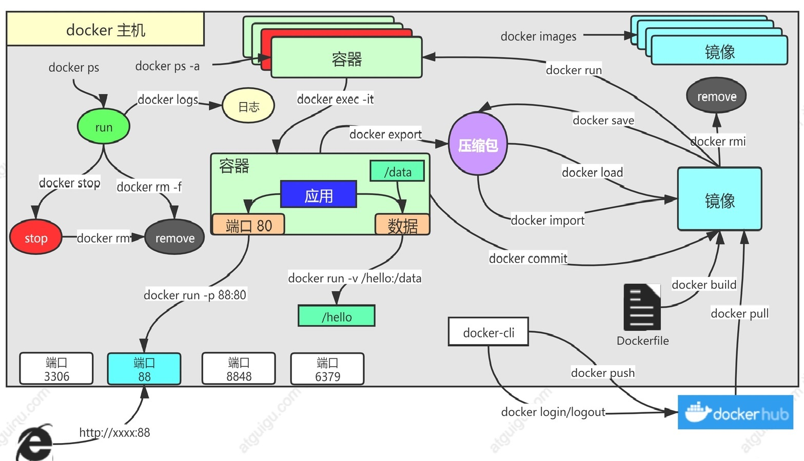
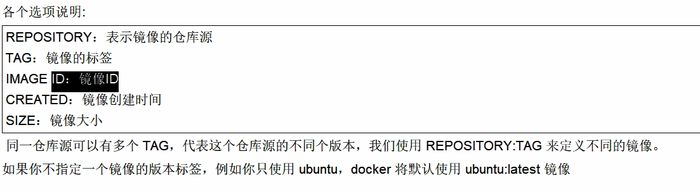

# 3. Docker常用命令
[[toc]]
<a data-fancybox title="Docker常用命令" href="./image/docker02.jpg"></a>

## 3.1 Docker的启动与停止


## 3.1.1 启动docker

```shell
#启动docker：
systemctl start docker
```

## 3.1.2 停止docker

```shell
#停止docker
systemctl stop docker
```
## 3.1.3 重启docker

```shell
#重启docker
systemctl restart docker
```
## 3.1.4 查看docker状态

```shell
#查看docker状态
systemctl status docker
```
## 3.1.5 开机启动

```shell
#开机启动
systemctl enable docker
```
## 3.1.6 查看docker概要信息

```shell
#查看docker概要信息
docker info
```
## 3.1.7 查看docker帮助文档

```shell
#查看docker帮助文档
docker --help
```

## 3.2 镜像命令

```sh
docker pull nginx  #下载最新版

# 镜像名:版本名（标签）

docker pull nginx:1.20.1


docker pull redis  #下载最新
docker pull redis:6.2.4

## 下载来的镜像都在本地
docker images  #查看所有镜像

redis = redis:latest

docker rmi 镜像名:版本号/镜像id
```


### 3.2.1 查看镜像

```sh
[root@TXYUN-NO2 ~]# docker images
REPOSITORY    TAG       IMAGE ID       CREATED      SIZE
hello-world   latest    feb5d9fea6a5   8 days ago   13.3kB

```

:::tip 参数说明
1. REPOSITORY ：镜像名称
2. TAG ：镜像标签
3. IMAGE ID ：镜像ID
4. CREATED ：镜像的创建日期（不是获取该镜像的日期）
5. SIZE ：镜像大小  
这些镜像都是存储在Docker宿主机的 /var/lib/docker 目录下
:::
---------------

<a data-fancybox title="镜像命令说明" href="./image/Snipaste_2020-10-03_11-09-33.png"></a>

#### OPTIONS 说明：

```dockerfile
-a 列出本地所有的镜像(含中间映射层)
-q 只显示镜像ID
--digests 显示镜像的摘要信息
--no-trunc 显示完整的镜像信息
```

### 3.2.2 搜索镜像

<a data-fancybox title="dockerhub" href="www.dockerhub.com">![dockerhub]​网站 www.dockerhub.com 可查看镜像版本</a>

```sh
	​docker search [OPTIONS] 镜像名字
```

#### OPTIONS 说明
```dockerfile
	--no-trun 显示完整的镜像描述
	-s 列出收藏数不小于指定值的镜像
	--automated 只列出 automated build类型的镜像
```

---------

```sh
	[root@TXYUN-NO2 ~]# docker search mysql
	NAME                              DESCRIPTION                                     STARS     OFFICIAL   AUTOMATED
	mysql                             MySQL is a widely used, open-source relation…   11490     [OK]
```

:::tip 参数说明
NAME ：仓库名称  
DESCRIPTION ：镜像描述  
STARS ：用户评价，反应一个镜像的受欢迎程度  
OFFICIAL ：是否官方  
AUTOMATED ：自动构建，表示该镜像由Docker Hub自动构建流程创建的  
:::


### 3.2.3 ​下载镜像

```sh
​	docker pull 镜像名字[:TAG]
```


### 3.2.4 删除镜像

```sh

​#删除单个 镜像名:版本号/镜像id
docker rmi 镜像名:版本号/镜像id

​#删除多个 
docker rmi 镜像名1:TAG 镜像名2:TAG

​#删除所有镜像
docker rmi ${docker images -qa}
docker rmi `docker images -q`
```

## 3.3 容器命令

### 3.3.1 查看容器

```sh
#查看正在运行的容器
docker ps

#查看所有容器
docker ps –a

#查看最后一次运行的容器
docker ps –l

#查看停止的容器
docker ps -f status=exited

#docker container  ls
#docker container -a
```

### 3.3.2 启动容器

```sh
docker start 容器id/名字

# -d：后台运行
# --restart=always: 开机自启
docker run --name=mynginx   -d  --restart=always -p  88:80   nginx

#应用开机自启
docker update 容器id/名字 --restart=always
```

---------

:::tip 参数说明

-i ：表示运行容器

-t ：表示容器启动后会进入其命令行。加入这两个参数后，容器创建就能登录进去。即分配一个伪终端。

--name :为创建的容器命名。

-v ：表示目录映射关系（前者是宿主机目录，后者是映射到宿主机上的目录），可以使用多个-v 做多个目录或文件
映射。注意：最好做目录映射，在宿主机上做修改，然后共享到容器上。

-d ：在run后面加上-d参数,则会创建一个守护式容器在后台运行（这样创建容器后不会自动登录容器，如果只加-i -t
两个参数，创建后就会自动进去容器）。

-p ：表示端口映射，前者是宿主机端口，后者是容器内的映射端口。可以使用多个-p做多个端口映射
:::

### 3.3.3 停止docker

```sh
docker stop 容器id/名字
```
### 3.3.4 进入docker容器

```sh
# 进入容器内部的系统，修改容器内容
docker exec -it 容器id  /bin/bash

docker exec -it mysql_mysql_1 /bin/bash
```
### 3.3.5 终止容器

```sh
使用docker stop $CONTAINER_ID来终止一个运行中的容器。并且可以使用
docker ps -a来看终止状态的容器
```

### 3.3.6 删除容器

```sh
docker rm 容器id/名字
```

### 3.3.7 文件拷贝

如果我们需要将文件拷贝到容器内可以使用cp命令  
**docker cp 需要拷贝的文件或目录 容器名称:容器目录**

也可以将文件从容器内拷贝出来  
**docker cp 容器名称:容器目录 需要拷贝的文件或目录**

### 3.3.8 目录挂载

我们可以在创建容器的时候，将宿主机的目录与容器内的目录进行映射，这样我们就可以通过修改宿主机某个目录的
文件从而去影响容器。
创建容器 添加 -v 参数后边为宿主机目录:容器目录，例如：

```sh
docker run -di -v /usr/local/myhtml:/usr/local/myhtml --name=mycentos3 centos:7

```

如果你共享的是多级的目录，可能会出现权限不足的提示。  
这是因为CentOS7中的安全模块selinux把权限禁掉了，我们需要添加参数 **--privileged=true** 来解决挂载的目录没
有权限的问题

### 3.3.9 查看容器IP地址

我们可以通过以下命令查看容器运行的各种数据

```sh
docker inspect 容器名称（容器ID）
```

也可以直接执行下面的命令直接输出IP地址

```sh
docker inspect --format='{{.NetworkSettings.IPAddress}}' 容器名称（容器ID）
```

### 3.3.9 容器中安装vim
```sh
apt-get update
apt-get install -y vim
```