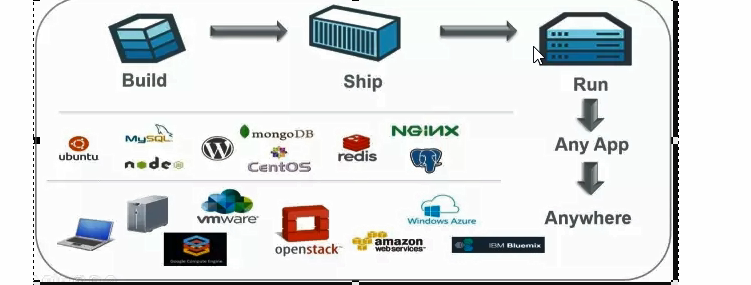
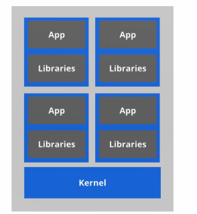
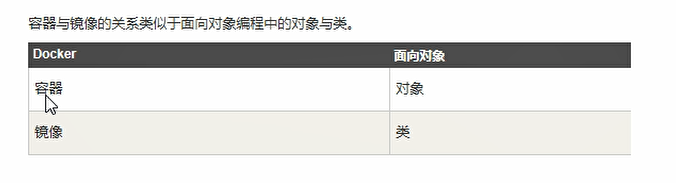

# 1.Docker简介

## 1.1 Docker理念

Docker是基于Go语言实现的云开源项目。
Docker的主要目标是“**Build, Ship[ and Run Any App,Anywhere**"，也就是通过对应用组件的封装、分发、部署、运行等生命期的管理，使用户的APP (可以是一个WEB应用或数据库应用等等)及其运行环境能够做到“**一次封装，到处运行**”。

 Linux容器技术的出现就解决了这样一 一个问题，而Docker就是在它的基础上发展过来的。将应用运行在Docker容器上面，而Docker容器在任何操作系统上都是一-致的，这就实现了跨平台、跨服务器。**只需要一次配置好环境，换到别的机子上就可以一键部署好，大大简化了操作**

 ## 1.2 之前的虚拟机技术

虚拟机**(virtual machine)**就是带环境安装的一种解决方案。

它可以在一种操作系统里面运行另一种作系统，比如在**Windows系统里面运行Linux系统**。应用程序对此毫无感知，因为虚拟机看上去跟真实系统- -模-样，而对于底层系统来说，虚拟机就是一个普通文件，不需要了就删掉，对其他部分毫无影响。这类虚拟机完美的运行了另一套系统，能够使应用程序，操作系统和硬件三者之间的逻辑不变。

:::tip 虚拟机的缺点

1. 资源占用多

2. 冗余步骤多

3. 启动慢
:::

## 1.3 容器虚拟化技术

由于前面虛拟机存在这些缺点，**Linux** 发展出了另一种虚拟化技术: **Linux 容器**(Linux Containers,缩为LXC)。

:::tip 容器化技术： 
1、基础镜像MB级别 

2、创建简单 

3、隔离性强 

4、启动速度秒级 

5、移植与分享方便
:::

**Linux容器不是模拟一个完整的操作系统**，而是对进程进行隔离。有了容器，就可以将软件运行所的所有资源打包到一个隔离的容器中。容器与虚拟机不同，不需要捆绑一整套操作系统，只需要软件工作所需的库资源和设置。系统因此而变得高效轻量并保证部署在任何环境中的软件都能始终如一地运行。.

:::tip Docker和传统虚拟化方式的不同之处:

1. 传统虚拟机技术是虚拟出一套硬件后，在其上运行一个完整操作系统，在该系统上再运行所需应用进程;

2. 而容器内的应用进程直接运行于宿主的内核，容器内没有自己的内核，**而且也没有进行硬件虚拟**。因此容器要比传统虚拟机为轻便。

3. 每个容器之间互相隔离，每个容器有自己的文件系统，容器之间进程不会相互影响，能区分计算资源。
:::

## 1.4 开发/运维(DevOps)

一次构建、随处运行，

### 1.4.1 更快速的应用交付和部署

​		传统的应用开发完成后，需要提供一堆安装程序和配置说明文档，安装部署后需根据配置文档进行繁杂的配置才能正常运行。Docker化
之后只需要交付少量容器镜像文件，在正式生产环境加载镜像并运行即可，应用安装配置在镜像里已经内置好，大大节省部署配置和测
试验证时间。

### 1.4.2 更便捷的升级和扩缩容

​		随着微服务架构和Docker的发展，大量的应用会通过微服务方式架构，应用的开发构建将变成搭乐高积木一样，每个Docker容器将变成-块“积木”，应用的升级将变得非常容易。当现有的容器不足以支撑业务处理时，可通过镜像运行新的容器进行快速扩容，使应用系统的扩容从原先的天级变成分钟级甚至秒级。

### 1.4.3 更简单的系统运维

​		应用容器化运行后，生产环境运行的应用可与开发、测试环境的应用高度--致，容器会将应用程序相关的环境和状态完全封装起来，不会因为底层基础架构和操作系统的不一致性给应用带来影响，产生新的BUG。当出现程序异常时，也可以通过测试环境的相同容器进行快速定位和修复。

### 1.4.4 更高效的计算资源利用

​	**Docker是内核级虚拟化**，其不像传统的虚拟化技术一样 需要额外的Hypervisor支持，所以在-台物理机上可以运行很多个容器实例，可大大提升物理服务器的CPU和内存的利用率。

## 1.5 资源隔离

:::tip 资源隔离
● cpu、memory资源隔离与限制  

● 访问设备隔离与限制

● 网络隔离与限制

● 用户、用户组隔离限制

● ......
:::

## 1.5  Docker 的基本组成

### 1.5.1 docker架构图

:::tip docker架构

<strong>● Docker_Host：</strong>  
  ○ 安装Docker的主机

<strong>● Docker Daemon：</strong>  
  ○ 运行在Docker主机上的Docker后台进程

<strong>● Client：</strong>  
  ○ 操作Docker主机的客户端（命令行、UI等）

<strong>● Registry：</strong>  
  ○ 镜像仓库
  ○ Docker Hub

<strong>● Images：</strong>  
  ○ 镜像，带环境打包好的程序，可以直接启动运行

<strong>● Containers：</strong>   
  ○ 容器，由镜像启动起来正在运行中的程序
:::

### 1.5.2 Docker三要素
#### 1.5.2.1 镜像( image )

Docker镜像(lmage)就是-一个只读的模板。镜像可以用来创建Docker容器，个镜像可以创建很多容器

#### 1.5.2.2 容器( container)

Docker利用容器(Container) 独立运行的一个或一组应用。**容器是用镜像创建的运行实例。**  
它可以被启动、开始、停止、删除。每个容器都是相互隔离的、保证安全的平台。  
**可以把容器看做是一个简 易版的Linux环境**(包括root用户权限、进程空间、用户空间和网络空间等)和运行在其中的应用程序。  
容器的定义和镜像几乎一模一样，也是一堆层的统一视角， 唯- -区别在于容器的最上面那-层是可读可写的。  

#### 1.5.2.3 仓库( repository)

仓库(**Repository**) 是**集中存放镜像**文件的场所。
仓库(**Repository**)和仓库注册服务器(**Registry**) 是有区别的。仓库注册服务器上往往存放着多个仓库，每个仓库中又包含了多镜像，
每个镜像有不同的标签(tag) 。

仓库分为公开仓库(**Public**) 和私有仓库(**Private**) 两种形式。
**最大的公开仓库是Docker Hub(ttps://hub. docker.com/)**
存放了数量庞大的镜像供用户下载。国内的公开仓库包括阿里云、网易云等

### 总结 

需要正确的理解仓储/镜像/容器这几个概念:

Docker本身是一个容器运行载体或称之为管理引擎。我们把应用程序和配置依赖打包好形成一-个可交付的运行环境，这个打好的运行环境就似乎image镜像文件。只有通过这个镜像文件才能生成Docker容器。image文件可以看作是容器的模板。Docker根据image文件生成容器的实例。同一个image文件，可以生成多个同时运行的容器实例。

image文件生成的容器实例，本身也是一个文件，称为**镜像文件**。

一个容器运行一种服务，当我们需要的时候，就可以通过docker客户端创建一-个对应的运行实例，也就是我们的容器至于仓储，就是放了一堆镜像的地方，我们可以把镜像发布到仓储中，需要的时候从仓储中拉下来就可以了。|

## 1.6 底层原理

### 1.6.1 Docker是怎样工作的

Docker是一个Client-Server结构的系统，Docker守 护进程运行在主机上，然后通过Socket连 接从客户端访问，守护进程从客户端接受命令并管理运行在主机上的容器。**容器，是一个运行时环境，就是我们前面说到的集装箱。**

### 1.6.2 为什么Docker比较比vm快

1. **docker**有着比虚拟机更少的抽象层。由亍docker不需要**Hypervisor(虚拟机)**实现硬件资源虚拟化,运行在docker容器上的程序直接使用的都是实际物理机的硬件资源。因此在CPU、内存利用率上docker将会在效率上有明显优势。

2. **docker**利用的是宿主机的内核,而不需要**Guest OS**。因此,当新建一个 容器时,docker不需要和虚拟机一样重新加载- - 个操作系统内核仍而避免引寻、加载操作系统内核返个比较费时费资源的过程,当新建--个虚拟机时,虚拟机软件需要加载GuestOS,返个新建过程是分钟级别的。而**docker由于直接利用宿主机的操作系统**,则省略了返个过程,因此新建一个docker容器只需要几秒钟。

