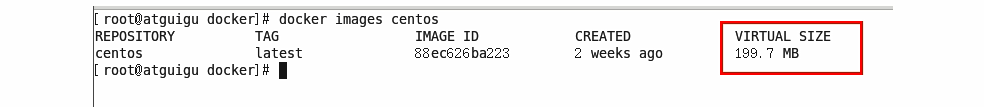

# 4. Docker镜像

## 4.1 Docker镜像是什么

镜像是一种轻量级、可执行的独立软件包，用来打包软件运行环境和基于运行环境开发的软件，它包含运行某个软件所需的有内容，包括代码、运行时、库、环境变量和配置文件。

## 4.2 UnionFS(联合文件系统)

**UnionFS (联合文件系统)：** Union文件系统(UnionFS)是一一种分层、轻量级并且高性能的文件系统，它支持对文件系统的修作为一 次提交来一层层的叠加，同时可以将不同目录挂载到同一个虚拟文件系统下(unite several directories into a singlevirtualfilesystem)。Union文件系统是Docker镜像的基础。镜像可以通过分层来进行继承，基于基础镜像(没有父镜像)可以制作各种具.体的应用镜像。

**特性:** 一次同时加载多个文件系统，但从外面看起来，只能看到一个文件系统，联合加载会把各层文件系统叠加起来，这样最终的文
件系统会包含所有底层的文件和目录

## 4.3 Docker镜像加载原理

**Docker镜像加载原理:**

**docker**的镜像实际上由一层一层的文件系统组成，这种层级的文件系统**UnionFS（联合文件系统）**

**botfs(boot file system)**主要包含**bootloader**和**kernel**, **bootloader**主要是引导加载**kernel（内核）**, **Linux**刚启动时会加载bootfs文件系统，在**Docker**镜像的最底层是**bootfs**。这一层与我们典型的**Linux/Unix**系统是一样的，包含<strong>boot加载器和内核</strong>。当boot加载完成之后整个内核就都在内存中了，此时内存的使用权己由bootfs转交给内核，此时系统也会卸载bootfs。

**rootfs (root file system)，**在**bootfs**之 上。 包含的就是典型Linux系统中的**/dev, /proc, /bin, /etc**等标准目录和文件。**rootfs**就 是各种不同的操作系统发行版，比如**Ubuntu**，**Centos**等等。

平时我们安装的虚拟机的Centos都是好几个G ，为什么docker这里才要200m

对于一个精简的**OS(操作系统), rootfs**可以很小，只需要包括最基本的命令、工具和程序库就可以了，因为底层直接用**Host（宿主机）**的**kernel（内核）**,只需要提供rootfs就行了。由此可见对于不同的**linux**发行版, **bootfs**基本是一致的, **rootfs**会有差别，因此不同的发行版可以公用**bootfs**。

### 分层的镜像

### 分层的镜像

### 为什么 Docker纪念馆想要采用这种分层结构

最大的一个好处就是-**共享资源**
比如:**有多个镜像都从相同的base镜像构建而来**，那么宿主机只需在磁盘上保存一份**base**镜像,
同时内存中也只需加载一份**base**镜像，就可以为所有容器服务了。而且镜像的每一层都可以被共享。

## 特点

Docker镜像都是只读的，当容器启动时，一个新的可写层被加载到**镜像的顶部**，这一层通常被称为**容器层**，容器层之下都叫**镜像层**

