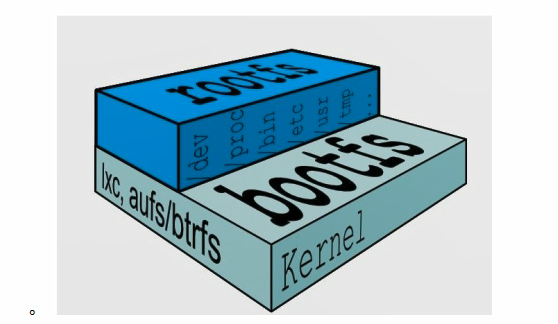
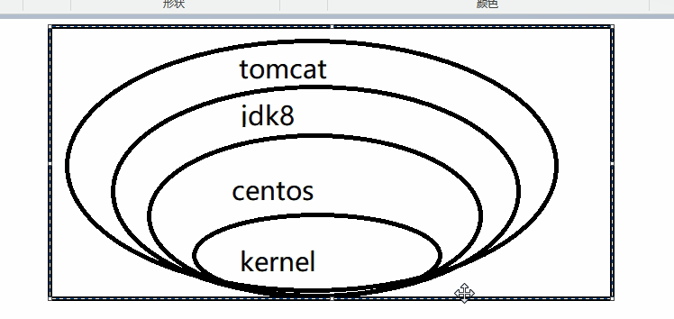

# 4. Docker镜像
[[toc]]
## 4.1 Docker镜像是什么

镜像是一种轻量级、可执行的独立软件包，用来打包软件运行环境和基于运行环境开发的软件，它包含运行某个软件所需的有内容，包括代码、运行时、库、环境变量和配置文件。

## 4.2 UnionFS(联合文件系统)

**UnionFS (联合文件系统)：** Union文件系统(UnionFS)是一一种分层、轻量级并且高性能的文件系统，它支持对文件系统的修作为一 次提交来一层层的叠加，同时可以将不同目录挂载到同一个虚拟文件系统下(unite several directories into a singlevirtualfilesystem)。Union文件系统是Docker镜像的基础。镜像可以通过分层来进行继承，基于基础镜像(没有父镜像)可以制作各种具.体的应用镜像。

**特性:** 一次同时加载多个文件系统，但从外面看起来，只能看到一个文件系统，联合加载会把各层文件系统叠加起来，这样最终的文
件系统会包含所有底层的文件和目录


## 4.3 Docker镜像加载原理

**Docker镜像加载原理:**

**docker**的镜像实际上由一层一层的文件系统组成，这种层级的文件系统**UnionFS（联合文件系统）**

**botfs(boot file system)**主要包含**bootloader**和**kernel**, **bootloader**主要是引导加载**kernel（内核）**, **Linux**刚启动时会加载bootfs文件系统，在**Docker**镜像的最底层是**bootfs**。这一层与我们典型的**Linux/Unix**系统是一样的，包含<font color='red'><strong>boot加载器和内核</strong></font>。当boot加载完成之后整个内核就都在内存中了，此时内存的使用权己由bootfs转交给内核，此时系统也会卸载bootfs。

**rootfs (root file system)，**在**bootfs**之 上。 包含的就是典型Linux系统中的**/dev, /proc, /bin, /etc**等标准目录和文件。**rootfs**就 是各种不同的操作系统发行版，比如**Ubuntu**，**Centos**等等。



平时我们安装的虚拟机的Centos都是好几个G ，为什么docker这里才要200m


对于一个精简的**OS(操作系统), rootfs**可以很小，只需要包括最基本的命令、工具和程序库就可以了，因为底层直接用**Host（宿主机）**的**kernel（内核）**,只需要提供rootfs就行了。由此可见对于不同的**linux**发行版, **bootfs**基本是一致的, **rootfs**会有差别，因此不同的发行版可以公用**bootfs**。

### 4.3.1 分层的镜像


### 分层的镜像




### 4.3.2 为什么Docker纪念馆想要采用这种分层结构

最大的一个好处就是-**共享资源**
比如:**有多个镜像都从相同的base镜像构建而来**，那么宿主机只需在磁盘上保存一份**base**镜像,
同时内存中也只需加载一份**base**镜像，就可以为所有容器服务了。而且镜像的每一层都可以被共享。


### 4.3.3 特点

Docker镜像都是只读的，当容器启动时，一个新的可写层被加载到**镜像的顶部**，这一层通常被称为**容器层**，容器层之下都叫**镜像层**

## 4.3 Docker迁移与备份

:::tip Commit命令模板

**docker commit 容器名称 镜像名称**

docker commit 提交**容器副本**使之称为一个新的镜像

docker commit -m="提交的描述信息" -a="作者" 容器ID 要创建的目标镜像名:[标签名]
:::

-----------

:::tip 镜像备份
我们可以通过以下命令将镜像保存为tar 文件

docker save -o tqk/tomcat02.tar tqk/tomcat02
:::

---------------

:::tip 镜像恢复与迁移

首先我们先删除掉tqk/tomcat02镜像 然后执行此命令进行恢复 

docker load -i tqk/tomcat02.tar -i 输入的文件

执行后再次查看镜像，可以看到镜像已经恢复
:::


### 4.3.1 案例演示


#### 4.3.1.1 从Hub上下载tomcat镜像到本地并成功运行

```sh
[root@TXYUN-NO2 ~]# docker run -id --name tomcat01 -p 8888:8080 tomcat:8.5.0

-p主机端口：docker容器端口
-P:随机分配端口
i:交互
t:终端
```
<a data-fancybox title="案例演示" href="./image/docker03.jpg">![案例演示]​(./image/docker03.jpg)</a>

#### 4.3.1.2 故意删除上一步镜像生产tomcat容器的文档

```sh
[root@TXYUN-NO2 ~]# docker exec -it  tomcat01 /bin/bash
root@3b6f52c4060c:/usr/local/tomcat# cd webapps/
root@3b6f52c4060c:/usr/local/tomcat/webapps# ls
ROOT  docs  examples  host-manager  manager
root@3b6f52c4060c:/usr/local/tomcat/webapps# rm -rf docs
root@3b6f52c4060c:/usr/local/tomcat/webapps# ls -lrt
total 16
drwxr-x--- 5 root root 4096 May  5  2016 manager
drwxr-x--- 5 root root 4096 May  5  2016 host-manager
drwxr-x--- 6 root root 4096 May  5  2016 examples
drwxr-x--- 3 root root 4096 May  5  2016 ROOT
```

#### 4.3.1.3 也即当前的tomcat运行实例是一个没有文档内容的容器，以他为模板commit一个没有doc的tomcat新镜像 tqk/tomcat02

```sh
docker commit -m="提交的描述信息" -a="作者" 容器ID 要创建的目标镜像名:[标签名]

docker commit -m="yyds" -a="tianqikai" tomcat01 tqk/tomcat02:1.0
```

#### 4.3.1.4 启动我们的新镜像并和原来的对比

```sh

docker run -d -p 7777:8080 tomcat:8.5.0
docker run -d -p 9999:8080 tqk/tomcat02:1.0
```

​启动atuigu/tomcat02 没有doc

​启动原来tomcat他有doc