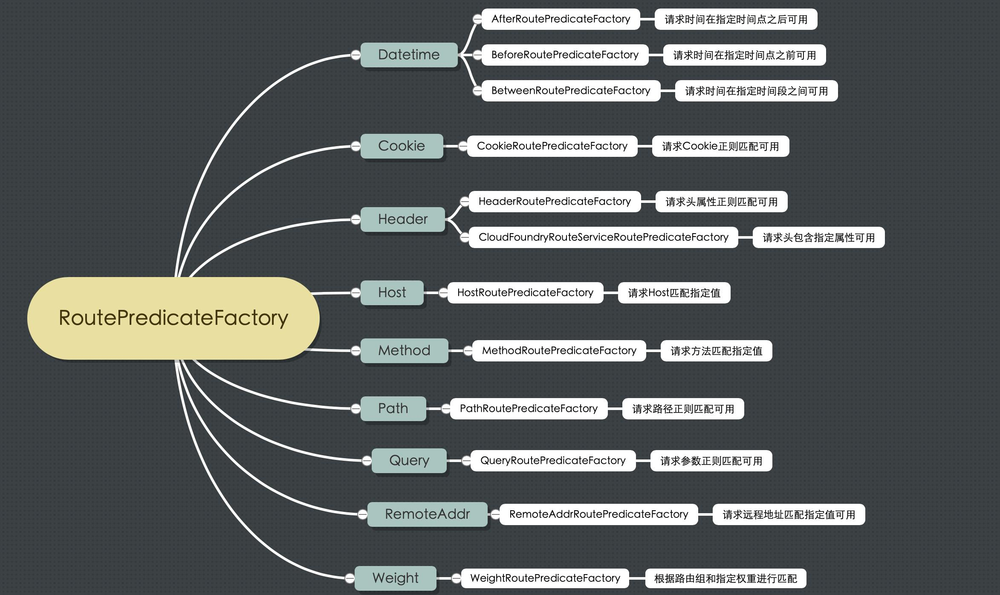
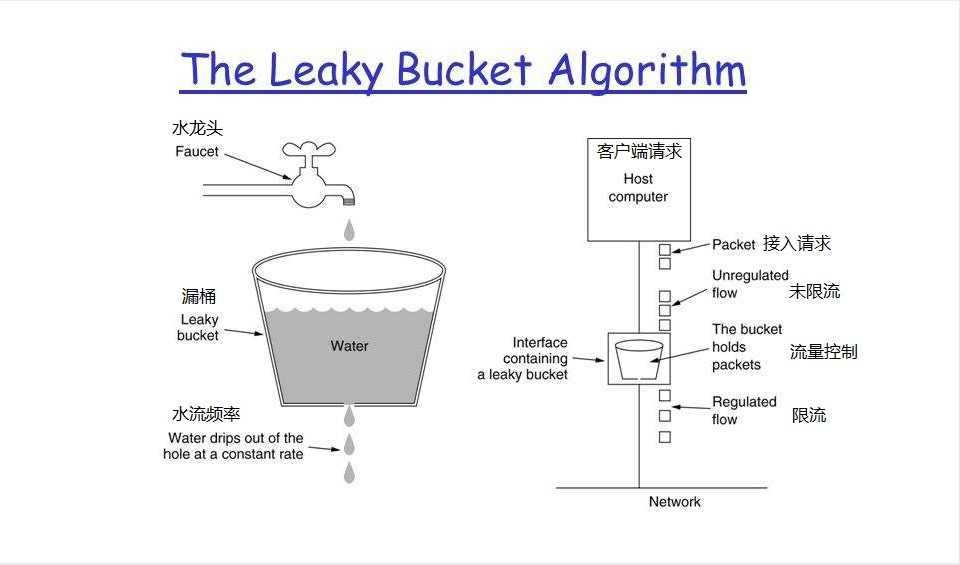
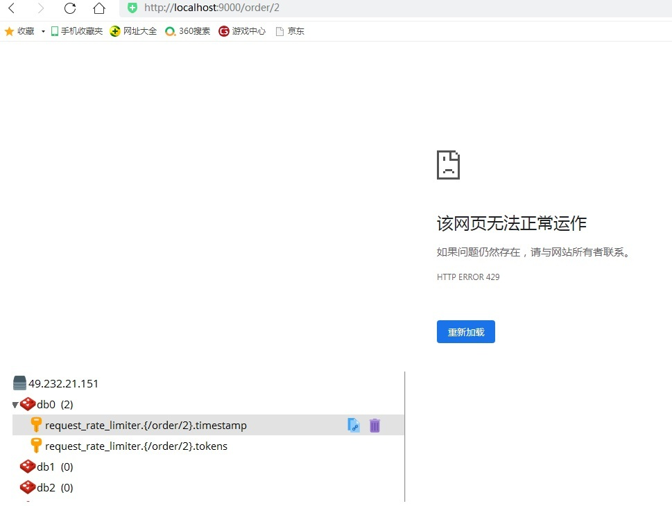
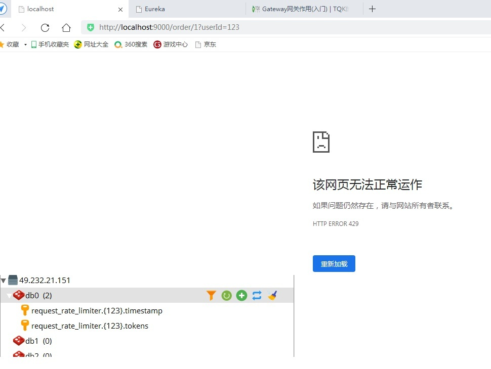
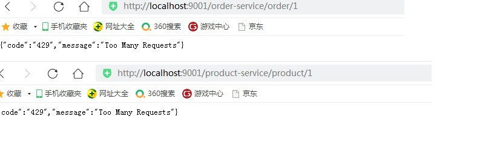

# Gateway网关作用(入门)


[官网文档](https://cloud.spring.io/spring-cloud-static/spring-cloud-gateway/2.2.1.RELEASE/reference/html/)
 
## Gateway网关核心概念
 
<font color='red'><strong>路由（Route）</strong></font>：路由是网关最基础的部分，路由信息由 ID、目标 URI、一组断言和一组过滤器组成。如果断言路由为真，则说明请求的 URI 和配置匹配。  

<font color='red'><strong>断言（Predicate）</strong></font>：Java8 中的断言函数。Spring Cloud Gateway 中的断言函数输入类型是 Spring 5.0 框架中的 ServerWebExchange。Spring Cloud Gateway 中的断言函数允许开发者去定义匹配来自于 Http Request 中的任何信息，比如请求头和参数等。 

<font color='red'><strong>过滤器（Filter）</strong></font>：一个标准的 Spring Web Filter。Spring Cloud Gateway 中的 Filter 分为两种类型，分别是**Gateway Filter** 和 **Global Filter**。过滤器将会对请求和响应进行处理。  


## Gateway网关工作原理

客户端向 Spring Cloud Gateway 发出请求。再由网关处理程序 Gateway Handler Mapping映射确定与请求相匹配的路由，将其发送到网关 Web 处理程序 Gateway Web Handler 。该处理程序通过指定的过滤器链将请求发送到我们实际的服务执行业务逻辑，然后返回。过滤器由虚线分隔的原因是，过滤器可以在发送代理请求之前和之后运行逻辑。所有 pre 过滤器逻辑均被执行。然后发出代理请求。发出代理请求后，将运行 post 过滤器逻辑。

<a data-fancybox title="gateway原理架构图" href="../image/gateway2.jpg"></a>


## 搭建网关服务示例


### 创建 gateway-server 项目

#### <font color='red'>IDEA父项目下创建gateway-server模块</font>

<a data-fancybox title="gateway-server1" href="../image/gateway-server1.jpg"></a>
<a data-fancybox title="gateway-server2" href="../image/gateway-server2.jpg"></a>
<a data-fancybox title="gateway-server3" href="../image/gateway-server3.jpg"></a>
<a data-fancybox title="gateway-server4" href="../image/gateway-server4.jpg"></a>

#### <font color='red'>添加 spring cloud gateway 依赖</font>

```xml
<?xml version="1.0" encoding="UTF-8"?>
<project xmlns="http://maven.apache.org/POM/4.0.0"
         xmlns:xsi="http://www.w3.org/2001/XMLSchema-instance"
         xsi:schemaLocation="http://maven.apache.org/POM/4.0.0 http://maven.apache.org/xsd/maven-4.0.0.xsd">
    <modelVersion>4.0.0</modelVersion>

    <groupId>com.example</groupId>
    <artifactId>gateway-server</artifactId>
    <version>1.0-SNAPSHOT</version>
    <!-- 继承父依赖 -->
    <parent>
       <groupId>com.example</groupId>
       <artifactId>gateway-demo</artifactId>
       <version>1.0-SNAPSHOT</version>
     </parent>
    <!-- 项目依赖 -->
    <dependencies>
        <!-- spring cloud gateway 依赖 -->
        <dependency>
            <groupId>org.springframework.cloud</groupId>
            <artifactId>spring-cloud-starter-gateway</artifactId>
        </dependency>
    </dependencies>
</project>
```

#### <font color='red'>配置文件 application.yml</font>

```yml
spring:
  application:
    name: gateway-server # 应用名称
  cloud:
    gateway:
       # 路由规则
      routes:
        - id: product-service           # 路由 ID，唯一
          uri: http://localhost:7070/   # 目标 URI，路由到微服务的地址
          predicates:                   # 断言（判断条件）
            - Path=/product/**          # 匹配对应 URL 的请求，将匹配到的请求追加在目标 URI 之后
        - id: order-service           # 路由 ID，唯一
          uri: http://localhost:9090/   # 目标 URI，路由到微服务的地址
          predicates:                   # 断言（判断条件）
            - Path=/order/**          # 匹配对应 URL 的请求，将匹配到的请求追加在目标 URI 之后
# 端口
server:
  port: 9000
```

#### <font color='red'>启动类</font>

```java
package com.example;

import org.springframework.boot.SpringApplication;
import org.springframework.boot.autoconfigure.SpringBootApplication;

/**
 * @author tianqikai
 */ // 开启 EurekaClient 注解，目前版本如果配置了 Eureka 注册中心，默认会开启该注解
//@EnableEurekaClient
@SpringBootApplication
public class GatewayServerApplication {

    public static void main(String[] args) {
        SpringApplication.run(GatewayServerApplication.class, args);
    }

}
```
#### <font color='red'>访问测试</font>

请求 <a  href="">http://localhost:9000/product/1</a> 将会路由至 <a  href="">http://localhost:7070/product/1</a>

请求 <a  href="">http://localhost:9000/order/1</a> 将会路由至 <a  href="">http://localhost:7070/order/1</a>


<a data-fancybox title="gateway-server5" href="../image/gateway-server5.jpg"></a>

## 路由规则概述

**Spring Cloud Gateway 创建 Route 对象时， 使用 RoutePredicateFactory 创建 Predicate 对象，Predicate 对象可以赋值给 Route**

◆ Spring Cloud Gateway 包含许多内置的 Route Predicate Factories  
◆ 所有这些断言都匹配 HTTP 请求的不同属性  
◆ 多个 Route Predicate Factories 可以通过<font color='red'><strong>逻辑与（and）</strong></font>结合起来一起使用  
 
路由断言工厂 RoutePredicateFactory 包含的主要实现类如图所示，包括 <font color='red'><strong>Datetime、 请求的远端地址、 路由权重、 请求头、 Host 地址、 请求方法、 请求路径和请求参数</strong></font>等类型的路由断言

<a data-fancybox title="RoutePredicateFactory" href="../image/RoutePredicateFactory.jpg"></a>

## 路由规则-Path 

**匹配对应 URL 的请求，将匹配到的请求追加在目标 URI 之后**

```yml
spring:
  application:
    name: gateway-server # 应用名称
  cloud:
    gateway:
       # 路由规则
      routes:
        - id: product-service           # 路由 ID，唯一
          uri: http://localhost:7070/   # 目标 URI，路由到微服务的地址
          predicates:                   # 断言（判断条件）
            - Path=/product/**          # 匹配对应 URL 的请求，将匹配到的请求追加在目标 URI 之后
```
请求 http://localhost:9000/product/1 将会路由至 http://localhost:7070/product/1


## 路由规则-Query  

**匹配请求参数中包含 token 的请求**

```yml
spring:
  application:
    name: gateway-server # 应用名称
  cloud:
    gateway:
       # 路由规则
      routes:
        - id: product-service           # 路由 ID，唯一
          uri: http://localhost:7070/   # 目标 URI，路由到微服务的地址
          predicates:                   # 断言（判断条件）
             - Query=token               # 匹配请求参数中包含 token 的请求
        #- Query=token, abc.         # 匹配请求参数中包含 token 并且其参数值满足正则表达式 abc. 的请求
```
Query=token ：比如，<a>http://localhost:9000/product/1?token=123</a>  
Query=token, abc. ：比如，<a>http://localhost:9000/product/1?token=abc1</a>  


## 路由规则-Method   

**按请求方式匹配请求**

```yml
spring:
  application:
    name: gateway-server # 应用名称
  cloud:
    gateway:
       # 路由规则
      routes:
        - id: product-service           # 路由 ID，唯一
          uri: http://localhost:7070/   # 目标 URI，路由到微服务的地址
          predicates:                   # 断言（判断条件）
             - Method=GET                # 匹配任意 GET 请求
```
## 路由规则-DateTime  

**匹配中国上海时间之后之前的请求**

```yml
spring:
  application:
    name: gateway-server # 应用名称
  cloud:
    gateway:
       # 路由规则
      routes:
        - id: product-service           # 路由 ID，唯一
          uri: http://localhost:7070/   # 目标 URI，路由到微服务的地址
          predicates:                   # 断言（判断条件）
            # 匹配中国上海时间 2021-6-6 18:34:57 之后的请求
#             - After=2021-06-06T20:20:20.000+08:00[Asia/Shanghai]
             - Before=2021-06-06T20:20:20.000+08:00[Asia/Shanghai]
```

## 路由规则-Header 

**匹配请求头包含 XXX参数**

```yml
spring:
  application:
    name: gateway-server # 应用名称
  cloud:
    gateway:
       # 路由规则
      routes:
        - id: product-service           # 路由 ID，唯一
          uri: http://localhost:7070/   # 目标 URI，路由到微服务的地址
          predicates:                   # 断言（判断条件）
               # 匹配请求头包含 X-Request-Id 并且其值匹配正则表达式 \d+ 的请求
             - Header=X-Request-Id, \d+
```
http://192.168.1.6:9000/product/1?token=123

<a data-fancybox title="header" href="../image/header.jpg"></a>


## 路由规则-RemoteAddr  

**匹配远程地址请求是 RemoteAddr 的请求**

```yml
spring:
  application:
    name: gateway-server # 应用名称
  cloud:
    gateway:
       # 路由规则
      routes:
        - id: product-service           # 路由 ID，唯一
          uri: http://localhost:7070/   # 目标 URI，路由到微服务的地址
          predicates:                   # 断言（判断条件）
            # 匹配远程地址请求是 RemoteAddr 的请求，0表示子网掩码
             - RemoteAddr=192.168.1.6/0
```

<a href="">http://192.168.1.6:9000/product/1?token=123</a>

## 路由规则-动态路由(服务发现)

**动态路由其实就是面向服务的路由**，Spring Cloud Gateway 支持与 **Eureka** 整合开发，<font color='red'><strong>根据 serviceId 自动从注册中心获取服务地址并转发请求</strong></font>，这样做的好处不仅可以通过单个端点来访问应用的所有服务，而且<font color='red'><strong>在添加或移除服务实例时不用修改 Gateway 的路由配置</strong></font>


```yml
spring:
  application:
    name: gateway-server # 应用名称
  cloud:
    gateway:
       # 路由规则
      routes:
        - id: order-service           # 路由 ID，唯一
          uri: lb://order-service       # lb:// 根据服务名称从注册中心获取服务请求地址
          predicates:                   # 断言（判断条件）
            - Path=/order/**          # 匹配对应 URL 的请求，将匹配到的请求追加在目标 URI 之后
# 端口
server:
  port: 9000

# 配置 Eureka Server 注册中心
eureka:
  instance:
    prefer-ip-address: true       # 是否使用 ip 地址注册
    instance-id: ${spring.cloud.client.ip-address}:${server.port} # ip:port
  client:
    service-url:                  # 设置服务注册中心地址
      defaultZone: http://localhost:8761/eureka/,http://localhost:8762/eureka/
```

<a href="">http://localhost:9000/order/1</a>


## 路由规则-服务名称转发

 
 即使配置了动态获取 URI 的方式，项目中微服务一旦过多几十上百个时，配置中任然要写很多配置，这时候就<font color='red'><strong>可以使用服务名称转发，与服务发现组件进行结合，通过 serviceId 转发到具体服务实例</strong></font>。 <font color='blue'><strong>默认匹配URL /微服务名称/** 路由到具体微服务</strong></font>。

 ```yml
 spring:
  application:
    name: gateway-server # 应用名称
  cloud:
    gateway:
      discovery:
        locator:
        # 是否与服务发现组件进行结合，通过 serviceId 转发到具体服务实例。
          enabled: true                           # 是否开启基于服务发现的路由规则
          lower-case-service-id: true      # 是否将服务名称转小写
# 端口
server:
  port: 9000

# 配置 Eureka Server 注册中心
eureka:
  instance:
    prefer-ip-address: true       # 是否使用 ip 地址注册
    instance-id: ${spring.cloud.client.ip-address}:${server.port} # ip:port
  client:
    service-url:                  # 设置服务注册中心地址
      defaultZone: http://localhost:8761/eureka/,http://localhost:8762/eureka/
 ```

配置文件中没有配置任何订单服务的信息，可以通过一下方式访问：
<a href="">http://localhost:9000/order-service/order/1 </a>
<a href="">http://localhost:9000/product-service/product/1</a>

## 过滤器概述

Spring Cloud Gateway 根据作用范围划分为 <font color='blue'><strong>GatewayFilter</strong></font> 和 <font color='blue'><strong>GlobalFilter</strong></font> ，二者区别如下：

<font color='blue'><strong>GatewayFilter ：网关过滤器</strong></font>，需要通过 spring.cloud.routes.filters 配置在具体路由下，只作用在当前路由上或通过 spring.cloud.default-filters 配置在全局，作用在所有路由上。
<font color='blue'><strong>GlobalFilter ：全局过滤器</strong></font>，不需要在配置文件中配置，作用在所有的路由上，最终通过GatewayFilterAdapter 包装成 GatewayFilterChain 可识别的过滤器，它为请求业务以及路由的 URI 转换为真实业务服务请求地址的核心过滤器，不需要配置系统初始化时加载，并作用在每个路由上。

## 网关过滤器 GatewayFilter
 
 网关过滤器用于拦截并链式处理 Web 请求，可以实现横切与应用无关的需求，比如：安全、访问超时的设置等。修改传入的 HTTP 请求或传出 HTTP 响应。Spring Cloud Gateway 包含许多内置的网关过滤器工厂一共有 22个，包括头部过滤器、 路径类过滤器、Hystrix 过滤器和重写请求 URL 的过滤器， 还有参数和状态码等其他类型的过滤器。根据过滤器工厂的用途来划分，可以分为以下几种：<font color='red'><strong>Header、Parameter、Path、Body、Status、Session、Redirect、Retry、RateLimiter 和 Hystrix</strong></font>。

 <a data-fancybox title="网关过滤器" href="../image/GatewayFilterFactory.jpg"></a>


## Path路径过滤器
 
Path 路径过滤器可以实现 URL 重写，通过重写 URL 可以实现隐藏实际路径提高安全性，易于用户记忆和键入，易于被搜索引擎收录等优点。实现方式如下：
 
### RewritePathGatewayFilterFactory
 
**RewritePath 网关过滤器工厂采用路径正则表达式参数和替换参数，使用 Java 正则表达式来灵活地重写请求路径**

```yml
spring:
  application:
    name: gateway-server # 应用名称
  cloud:
    gateway:
      discovery:
        locator:
        # 是否与服务发现组件进行结合，通过 serviceId 转发到具体服务实例。
          enabled: true                           # 是否开启基于服务发现的路由规则
          lower-case-service-id: true      # 是否将服务名称转小写
      # 路由规则
      routes:
        - id: product-service                # 路由 ID，唯一
          uri: lb://product-service         # lb:// 根据服务名称从注册中心获取服务请求地址
          predicates:                            # 断言（判断条件）
              # 匹配对应 URI 的请求，将匹配到的请求追加在目标 URI 之后
             - Path=/product/**, /api-gateway/**
          filters:                                 # 网关过滤器
             # 将 /api-gateway/product/1 重写为 /product/1
             - RewritePath=/api-gateway(?<segment>/?.*), $\{segment}
        - id: order-service                # 路由 ID，唯一
          uri: lb://order-service        # lb:// 根据服务名称从注册中心获取服务请求地址
          predicates:                            # 断言（判断条件）
            # 匹配对应 URI 的请求，将匹配到的请求追加在目标 URI 之后
            - Path=/order/**, /api-gateway2/**
          filters:                                 # 网关过滤器
            # 将 /api-gateway/order/1 重写为 /order/1
            - RewritePath=/api-gateway2(?<segment>/?.*), $\{segment}
# 端口
server:
  port: 9000

# 配置 Eureka Server 注册中心
eureka:
  instance:
    prefer-ip-address: true       # 是否使用 ip 地址注册
    instance-id: ${spring.cloud.client.ip-address}:${server.port} # ip:port
  client:
    service-url:                  # 设置服务注册中心地址
      defaultZone: http://localhost:8761/eureka/,http://localhost:8762/eureka/
```

<a href="">http://localhost:9000/api-gateway/product/1</a>
<a href="">http://localhost:9000/api-gateway2/order/1</a>


### PrefixPathGatewayFilterFactory
 
**PrefixPath 网关过滤器工厂为匹配的 URI 添加指定前缀**


```yml
spring:
  application:
    name: gateway-server # 应用名称
  cloud:
    gateway:
      discovery:
        locator:
        # 是否与服务发现组件进行结合，通过 serviceId 转发到具体服务实例。
          enabled: true                           # 是否开启基于服务发现的路由规则
          lower-case-service-id: true      # 是否将服务名称转小写
      # 路由规则
      routes:
        - id: order-service                # 路由 ID，唯一
          uri: lb://order-service        # lb:// 根据服务名称从注册中心获取服务请求地址
          predicates:                            # 断言（判断条件）
               # 匹配对应 URI 的请求，将匹配到的请求追加在目标 URI 之后
             - Path=/**
          filters:                                  # 网关过滤器
               # 将 /1 重写为 /order/1
             - PrefixPath=/order
# 端口
server:
  port: 9000

# 配置 Eureka Server 注册中心
eureka:
  instance:
    prefer-ip-address: true       # 是否使用 ip 地址注册
    instance-id: ${spring.cloud.client.ip-address}:${server.port} # ip:port
  client:
    service-url:                  # 设置服务注册中心地址
      defaultZone: http://localhost:8761/eureka/,http://localhost:8762/eureka/
```

<a href="">http://localhost:9000/1</a>

### StripPrefixGatewayFilterFactory
 
**StripPrefix 网关过滤器工厂采用一个参数 StripPrefix，该参数表示在将请求发送到下游之前从请求中剥离的路径个数**

```yml
spring:
  application:
    name: gateway-server # 应用名称
  cloud:
    gateway:
      discovery:
        locator:
        # 是否与服务发现组件进行结合，通过 serviceId 转发到具体服务实例。
          enabled: true                           # 是否开启基于服务发现的路由规则
          lower-case-service-id: true      # 是否将服务名称转小写
      # 路由规则
      routes:
        - id: order-service                # 路由 ID，唯一
          uri: lb://order-service        # lb:// 根据服务名称从注册中心获取服务请求地址
          predicates:                            # 断言（判断条件）
               # 匹配对应 URI 的请求，将匹配到的请求追加在目标 URI 之后
             - Path=/**
          filters:                                  # 网关过滤器
               # 将 /api/tqk/order/1 重写为 /order/1
             - StripPrefix=2
# 端口
server:
  port: 9000

# 配置 Eureka Server 注册中心
eureka:
  instance:
    prefer-ip-address: true       # 是否使用 ip 地址注册
    instance-id: ${spring.cloud.client.ip-address}:${server.port} # ip:port
  client:
    service-url:                  # 设置服务注册中心地址
      defaultZone: http://localhost:8761/eureka/,http://localhost:8762/eureka/
```

<a href="">http://localhost:9000/api/tqk/order/1</a>


### SetPathGatewayFilterFactory
 
**SetPath 网关过滤器工厂采用路径模板参数。 它提供了一种通过允许模板化路径段来操作请求路径的简单方法，使用了 Spring Framework 中的 uri 模板，允许多个匹配段**


```yml
spring:
  application:
    name: gateway-server # 应用名称
  cloud:
    gateway:
      discovery:
        locator:
        # 是否与服务发现组件进行结合，通过 serviceId 转发到具体服务实例。
          enabled: true                           # 是否开启基于服务发现的路由规则
          lower-case-service-id: true      # 是否将服务名称转小写
      # 路由规则
      routes:
        - id: order-service                # 路由 ID，唯一
          uri: lb://order-service        # lb:// 根据服务名称从注册中心获取服务请求地址
          predicates:                            # 断言（判断条件）
               # 匹配对应 URI 的请求，将匹配到的请求追加在目标 URI 之后
             - Path=/api/order/{segment}
          filters:                                  # 网关过滤器
               # 将 /api/product/1 重写为 /product/1
             - SetPath=/order/{segment}
# 端口
server:
  port: 9000

# 配置 Eureka Server 注册中心
eureka:
  instance:
    prefer-ip-address: true       # 是否使用 ip 地址注册
    instance-id: ${spring.cloud.client.ip-address}:${server.port} # ip:port
  client:
    service-url:                  # 设置服务注册中心地址
      defaultZone: http://localhost:8761/eureka/,http://localhost:8762/eureka/
```

<a href="">http://localhost:9000/api/order/1</a>

### Parameter 参数过滤器
 
**AddRequestParameter 网关过滤器工厂会将指定参数添加至匹配到的下游请求中**


```yml
spring:
  application:
    name: gateway-server # 应用名称
  cloud:
    gateway:
      discovery:
        locator:
        # 是否与服务发现组件进行结合，通过 serviceId 转发到具体服务实例。
          enabled: true                           # 是否开启基于服务发现的路由规则
          lower-case-service-id: true      # 是否将服务名称转小写
      # 路由规则
      routes:
        - id: order-service                # 路由 ID，唯一
          uri: lb://order-service        # lb:// 根据服务名称从注册中心获取服务请求地址
          predicates:                            # 断言（判断条件）
            # 匹配对应 URI 的请求，将匹配到的请求追加在目标 URI 之后
            - Path=/api-gateway/**
        filters:                       # 网关过滤器
            # 将 /api-gateway/product/1 重写为 /product/1
            - RewritePath=/api-gateway(?<segment>/?.*), $\{segment}
            # 在下游请求中添加 flag=1
            - AddRequestParameter=flag, 1
# 端口
server:
  port: 9000

# 配置 Eureka Server 注册中心
eureka:
  instance:
    prefer-ip-address: true       # 是否使用 ip 地址注册
    instance-id: ${spring.cloud.client.ip-address}:${server.port} # ip:port
  client:
    service-url:                  # 设置服务注册中心地址
      defaultZone: http://localhost:8761/eureka/,http://localhost:8762/eureka/
```

```java
package com.example.controller;
import com.example.pojo.Product;
import com.example.service.ProductService;
import org.springframework.beans.factory.annotation.Autowired;
import org.springframework.web.bind.annotation.GetMapping;
import org.springframework.web.bind.annotation.PathVariable;
import org.springframework.web.bind.annotation.RequestMapping;
import org.springframework.web.bind.annotation.RestController;
@RestController
@RequestMapping("/product")
public class ProductController {
    @Autowired
    private ProductService productService;
    /**
     * 根据主键查询商品
     *
     * @param id
     * @return
     */
    @GetMapping("/{id}")
    public Product selectProductById(@PathVariable("id") Integer id, String flag) {
        System.out.println("flag = " + flag);
        return productService.selectProductById(id);
   }
}
```
<a href="">http://localhost:9000/api-gateway/order/1</a>

### Status 状态过滤器
 
**SetStatus 网关过滤器工厂采用单个状态参数，它必须是有效的 Spring HttpStatus。它可以是整数 404 或枚举NOT_FOUND 的字符串表示**


```yml
spring:
  application:
    name: gateway-server # 应用名称
  cloud:
    gateway:
      discovery:
        locator:
        # 是否与服务发现组件进行结合，通过 serviceId 转发到具体服务实例。
          enabled: true                           # 是否开启基于服务发现的路由规则
          lower-case-service-id: true      # 是否将服务名称转小写
      # 路由规则
      routes:
        - id: order-service                # 路由 ID，唯一
          uri: lb://order-service        # lb:// 根据服务名称从注册中心获取服务请求地址
          predicates:                   # 断言（判断条件）
          # 匹配对应 URI 的请求，将匹配到的请求追加在目标 URI 之后
             - Path=/api-gateway/**
          filters:                       # 网关过滤器
              # 将 /api-gateway/product/1 重写为 /product/1
             - RewritePath=/api-gateway(?<segment>/?.*), $\{segment}
              # 任何情况下，响应的 HTTP 状态都将设置为 404
            - SetStatus=404 # 404 或者对应的枚举 NOT_FOUND
# 端口
server:
  port: 9000

# 配置 Eureka Server 注册中心
eureka:
  instance:
    prefer-ip-address: true       # 是否使用 ip 地址注册
    instance-id: ${spring.cloud.client.ip-address}:${server.port} # ip:port
  client:
    service-url:                  # 设置服务注册中心地址
      defaultZone: http://localhost:8761/eureka/,http://localhost:8762/eureka/
```

<a href="">http://localhost:9000/api-gateway/order/1</a>

## 全局过滤器 GlobalFilter
 
全局过滤器不需要在配置文件中配置，作用在所有的路由上，最终通过 GatewayFilterAdapter 包装成GatewayFilterChain 可识别的过滤器，它是请求业务以及路由的 URI 转换为真实业务服务请求地址的核心过滤器，不需要配置系统初始化时加载，并作用在每个路由上


## 自定义过滤器概述
 
即使 Spring Cloud Gateway 自带许多实用的 GatewayFilter Factory、Gateway Filter、GlobalFilter ，但是在很多情景下我们仍然希望可以自定义自己的过滤器，实现一些骚操作。

## 自定义网关过滤器

**自定义网关过滤器需要实现以下两个接口 ： GatewayFilter ， Ordered**

**创建过滤器  CustomGatewayFilter.java**
```java
package com.example.filter;
import org.springframework.cloud.gateway.filter.GatewayFilter;
import org.springframework.cloud.gateway.filter.GatewayFilterChain;
import org.springframework.core.Ordered;
import org.springframework.web.server.ServerWebExchange;
import reactor.core.publisher.Mono;
/**
* 自定义网关过滤器
*/
public class CustomGatewayFilter implements GatewayFilter, Ordered {
    /**
     * 过滤器业务逻辑
     *
     * @param exchange
     * @param chain
     * @return
     */
    @Override
    public Mono<Void> filter(ServerWebExchange exchange, GatewayFilterChain chain) {
        System.out.println("自定义网关过滤器被执行");
        return chain.filter(exchange); // 继续向下执行
   }
    /**
     * 过滤器执行顺序，数值越小，优先级越高
     * @return
     */
    @Override
    public int getOrder() {
        return 0;
   }
}
 ```

**注册过滤器**

```java
package com.example.config;
import com.example.filter.CustomGatewayFilter;
import org.springframework.cloud.gateway.route.RouteLocator;
import org.springframework.cloud.gateway.route.builder.RouteLocatorBuilder;
import org.springframework.context.annotation.Bean;
import org.springframework.context.annotation.Configuration;
/**
* 网关路由配置类
*/
@Configuration
public class GatewayRoutesConfiguration {
    @Bean
    public RouteLocator routeLocator(RouteLocatorBuilder builder) {
        return builder.routes().route(r -> r
                // 断言（判断条件）
               .path("/product/**")
                // 目标 URI，路由到微服务的地址
               .uri("lb://product-service")
                // 注册自定义网关过滤器
               .filters(new CustomGatewayFilter())
                // 路由 ID，唯一
               .id("product-service"))
               .build();
   }
}
```
## 自定义全局过滤器

**自定义全局过滤器需要实现以下两个接口 ： GlobalFilter ， Ordered 。通过全局过滤器可以实现权限校验，安全性验证等功能**

 
**创建过滤器**
 
 
实现指定接口，添加 @Component 注解即可 CustomGlobalFilter.java

```java
package com.example.filter;
import org.springframework.cloud.gateway.filter.GatewayFilterChain;
import org.springframework.cloud.gateway.filter.GlobalFilter;
import org.springframework.core.Ordered;
import org.springframework.stereotype.Component;
import org.springframework.web.server.ServerWebExchange;
import reactor.core.publisher.Mono;
/**
* 自定义全局过滤器
*/
@Component
public class CustomGlobalFilter implements GlobalFilter, Ordered {
    /**
     * 过滤器业务逻辑
     *
     * @param exchange
     * @param chain
     * @return
     */
    @Override
    public Mono<Void> filter(ServerWebExchange exchange, GatewayFilterChain chain) {
        System.out.println("自定义全局过滤器被执行");
        return chain.filter(exchange); // 继续向下执行
   }
    /**
     * 过滤器执行顺序，数值越小，优先级越高
     *
     * @return
     */
    @Override
    public int getOrder() {
             return 0;
   }
}
```

统一鉴权过滤器

我们在网关过滤器中通过token判断用户是否登录，完成一个统一鉴权案例

```java
package com.example.config;

import lombok.extern.slf4j.Slf4j;
import org.springframework.cloud.gateway.filter.GatewayFilterChain;
import org.springframework.cloud.gateway.filter.GlobalFilter;
import org.springframework.core.Ordered;
import org.springframework.core.io.buffer.DataBuffer;
import org.springframework.http.HttpStatus;
import org.springframework.http.server.reactive.ServerHttpResponse;
import org.springframework.stereotype.Component;
import org.springframework.web.server.ServerWebExchange;
import reactor.core.publisher.Mono;

/**
 * @ClassName：AccessFilter
 * @description: 权限过滤器
 * @author: tianqikai
 * @date : 23:36 2021/6/10
 */
@Slf4j
@Component
public class AccessFilter implements GlobalFilter, Ordered {


    @Override
    public Mono<Void> filter(ServerWebExchange exchange, GatewayFilterChain chain) {
        // 获取请求参数
        String token = exchange.getRequest().getQueryParams().getFirst("token");
        // 业务逻辑处理
        if (null == token) {
            log.info("token is null...");
            ServerHttpResponse response = exchange.getResponse();
            // 响应类型
            response.getHeaders().add("Content-Type", "application/json; charset=utf-8");
            // 响应状态码，HTTP 401 错误代表用户没有访问权限
            response.setStatusCode(HttpStatus.UNAUTHORIZED);
            // 响应内容
            String message = "{\"message\":\"" + HttpStatus.UNAUTHORIZED.getReasonPhrase() + "\"}";
            DataBuffer buffer = response.bufferFactory().wrap(message.getBytes());
            // 请求结束，不在继续向下请求
            return response.writeWith(Mono.just(buffer));
        }
        // 使用 token 进行身份验证
        log.info("token is OK!");
        return chain.filter(exchange);
    }

    @Override
    public int getOrder() {
        return 1;
    }
}

```

http://localhost:9001/order/1

http://localhost:9001/order/1?token=123

<a data-fancybox title="统一鉴权过滤器" href="../image/tongyijianquan.jpg"></a>

## 网关限流简介及算法

 
顾名思义，限流就是限制流量，就像你宽带包有 1 个 G 的流量，用完了就没了。通过限流，我们可以很好地控制系统的<font color='red'>**QPS**</font>，从而达到保护系统的目的 
 
:::tip 为什么需要限流?
比如 Web 服务、对外 API，这种类型的服务有以下几种可能导致机器被拖垮：  
1. 用户增长过快（好事）  
2. 因为某个热点事件（微博热搜）  
3. 竞争对象爬虫  
4. 恶意的请求  
这些情况都是无法预知的，不知道什么时候会有 10 倍甚至 20 倍的流量打进来，如果真碰上这种情况，扩容是根本来不及的。
:::

:::tip 限流算法
<font color='red'>**计数器算法**</font>   
<font color='red'>**漏桶（Leaky Bucket）算法**</font>  
<font color='red'>**令牌桶（Token Bucket）算法**</font>   
:::

### 计数器算法
 
计数器算法是限流算法里最简单也是最容易实现的一种算法。比如我们规定，对于 A 接口来说，我们 1 分钟的
访问次数不能超过 100 个。那么我们可以这么做：在一开始的时候，我们可以设置一个计数器 counter，每当一个请
求过来的时候，counter 就加 1，如果 counter 的值大于 100 并且该请求与第一个请求的间隔时间还在 1 分钟之
内，触发限流；如果该请求与第一个请求的间隔时间大于 1 分钟，重置 counter 重新计数，具体算法的示意图如
下：
<a data-fancybox title="计数器算法" href="../image/zuul2.jpg"></a>
这个算法虽然简单，但是有一个十分致命的问题，那就是临界问题，我们看下图：

<a data-fancybox title="计数器算法" href="../image/zuul2.jpg"></a>
从上图中我们可以看到，假设有一个恶意用户，他在 0:59 时，瞬间发送了 100 个请求，并且 1:00 又瞬间发送
了 100 个请求，那么其实这个用户在 1 秒里面，瞬间发送了 200 个请求。我们刚才规定的是 1 分钟最多 100 个请
求，也就是每秒钟最多 1.7 个请求，用户通过在时间窗口的重置节点处突发请求， 可以瞬间超过我们的速率限制。
用户有可能通过算法的这个漏洞，瞬间压垮我们的应用。


还有资料浪费的问题存在，我们的预期想法是希望 100 个请求可以均匀分散在这一分钟内，假设 30s 以内我们
就请求上限了，那么剩余的半分钟服务器就会处于闲置状态，比如下图：
<a data-fancybox title="计数器算法" href="../image/zuul2.jpg"></a>


### 漏桶算法
 
 漏桶算法其实也很简单，可以粗略的认为就是注水漏水的过程，往桶中以任意速率流入水，以一定速率流出水，当水超过桶流量则丢弃，因为桶容量是不变的，保证了整体的速率。

 <a data-fancybox title="漏桶算法" href="../image/loutong.jpg"></a>

#### 漏桶算法是使用队列机制实现的
<a data-fancybox title="漏桶算法" href="../image/loutong2.jpg"></a>

**漏桶算法主要用途在于保护它人（服务），假设入水量很大，而出水量较慢，则会造成网关的资源堆积可能导致网关瘫痪。而目标服务可能是可以处理大量请求的，但是漏桶算法出水量缓慢反而造成服务那边的资源浪费**

### 令牌桶算法
 
令牌桶算法是对漏桶算法的一种改进，漏桶算法能够限制请求调用的速率，而令牌桶算法能够在限制调用的平均
速率的同时还允许一定程度的突发调用。在令牌桶算法中，存在一个桶，用来存放固定数量的令牌。算法中存在一种
机制，以一定的速率往桶中放令牌。每次请求调用需要先获取令牌，只有拿到令牌，才有机会继续执行，否则选择选
择等待可用的令牌、或者直接拒绝。放令牌这个动作是持续不断的进行，如果桶中令牌数达到上限，就丢弃令牌。


场景大概是这样的：桶中一直有大量的可用令牌，这时进来的请求可以直接拿到令牌执行，比如设置 QPS 为
100/s，那么限流器初始化完成一秒后，桶中就已经有 100 个令牌了，等服务启动完成对外提供服务时，该限
流器可以抵挡瞬时的 100 个请求。当桶中没有令牌时，请求会进行等待，最后相当于以一定的速率执行。
 
:::tip Spring Cloud Gateway 内部使用的就是该算法：
1. 所有的请求在处理之前都需要拿到一个可用的令牌才会被处理；
2. 根据限流大小，设置按照一定的速率往桶里添加令牌；
3. 桶设置最大的放置令牌限制，当桶满时、新添加的令牌就被丢弃或者拒绝；
4. 请求到达后首先要获取令牌桶中的令牌，拿着令牌才可以进行其他的业务逻辑，处理完业务逻辑之后，将令牌直接删除；
5. 令牌桶有最低限额，当桶中的令牌达到最低限额的时候，请求处理完之后将不会删除令牌，以此保证足够的限流。
:::

**漏桶算法主要用途在于保护它人，而令牌桶算法主要目的在于保护自己，将请求压力交由目标服务处理。假设突然进来很多请求，只要拿到令牌这些请求会瞬时被处理调用目标服务。**

## Gateway 常用限流方式
 
 Spring Cloud Gateway 官方提供了 RequestRateLimiterGatewayFilterFactory 过滤器工厂，使用 Redis和 Lua 脚本实现了令牌桶的方式。


 官网文档：https://cloud.spring.io/spring-cloud-static/spring-cloud-gateway/2.2.1.RELEASE/reference/html/#the-redis-ratelimiter 具体实现逻辑在 RequestRateLimiterGatewayFilterFactory 类中， Lua 脚本在如下图所示的源码文件夹中：


### 添加依赖

```xml
<!-- spring data redis reactive 依赖 -->
<dependency>
    <groupId>org.springframework.boot</groupId>
    <artifactId>spring-boot-starter-data-redis-reactive</artifactId>
</dependency>
<!-- commons-pool2 对象池依赖 -->
<dependency>
    <groupId>org.apache.commons</groupId>
    <artifactId>commons-pool2</artifactId>
</dependency>
```
### URI 限流
 
**配置限流过滤器和限流过滤器引用的 bean 对象**
```yml
spring:
  application:
    name: gateway-server # 应用名称
  cloud:
    gateway:
      discovery:
        locator:
        # 是否与服务发现组件进行结合，通过 serviceId 转发到具体服务实例。
          enabled: true                           # 是否开启基于服务发现的路由规则
          lower-case-service-id: true      # 是否将服务名称转小写
      # 路由规则
      routes:
        - id: order-service                # 路由 ID，唯一
          uri: lb://order-service        # lb:// 根据服务名称从注册中心获取服务请求地址
          predicates:                   # 断言（判断条件）
            # 匹配对应 URL 的请求，将匹配到的请求追加在目标 URI 之后
            - Path=/order/**
          filters:                       # 网关过滤器
            - name: RequestRateLimiter
              args:
                redis-rate-limiter.replenishRate: 1 # 令牌桶每秒填充速率
                redis-rate-limiter.burstCapacity: 2 # 令牌桶总容量
                key-resolver: "#{@pathKeyResolver}" # 使用 SpEL 表达式按名称引用 bean
  # redis 缓存
  redis:
    timeout: 10000            # 连接超时时间
    host: 49.232.21.151   # Redis服务器地址
    port: 6379                  # Redis服务器端口
#    password: root            # Redis服务器密码
    database: 0                # 选择哪个库，默认0库
    lettuce:
      pool:
        max-active: 1024   # 最大连接数，默认 8
        max-wait: 10000    # 最大连接阻塞等待时间，单位毫秒，默认 -1
        max-idle: 200       # 最大空闲连接，默认 8
        min-idle: 5          # 最小空闲连接，默认 0
server:
  port: 9000

# 配置 Eureka Server 注册中心
eureka:
  instance:
    prefer-ip-address: true       # 是否使用 ip 地址注册
    instance-id: ${spring.cloud.client.ip-address}:${server.port} # ip:port
  client:
    service-url:                  # 设置服务注册中心地址
      defaultZone: http://localhost:8761/eureka/,http://localhost:8762/eureka/
```

**编写限流规则配置类**

```java
import org.springframework.cloud.gateway.filter.ratelimit.KeyResolver;
import org.springframework.context.annotation.Bean;
import org.springframework.context.annotation.Configuration;
import reactor.core.publisher.Mono;

/**
 * 限流规则配置类
 * @author Administrator
 */
@Configuration
public class KeyResolverConfiguration {
   /**
    * 限流规则
    *
    * @return
    */
         @Bean
    public KeyResolver pathKeyResolver() {
        /*
        return new KeyResolver() {
            @Override
            public Mono<String> resolve(ServerWebExchange exchange) {
                return Mono.just(exchange.getRequest().getPath().toString());
            }
        };
         */
        // JDK 1.8
        return exchange -> Mono.just(exchange.getRequest().getURI().getPath());
   }
}
```

<a>http://localhost:9000/order/2</a>


<a data-fancybox title="url限流" href="../image/urlfilters.jpg"></a>

### IP 限流
 
**配置限流过滤器和限流过滤器引用的 bean 对象**
```yml
spring:
  application:
    name: gateway-server # 应用名称
  cloud:
    gateway:
      discovery:
        locator:
        # 是否与服务发现组件进行结合，通过 serviceId 转发到具体服务实例。
          enabled: true                           # 是否开启基于服务发现的路由规则
          lower-case-service-id: true      # 是否将服务名称转小写
      # 路由规则
      routes:
        - id: product-service                # 路由 ID，唯一
          uri: lb://product-service         # lb:// 根据服务名称从注册中心获取服务请求地址
          predicates:                            # 断言（判断条件）
              # 匹配对应 URI 的请求，将匹配到的请求追加在目标 URI 之后
             - Path=/product/**, /api-gateway/**
          filters:                                 # 网关过滤器
             # 将 /api-gateway/product/1 重写为 /product/1
             - RewritePath=/api-gateway(?<segment>/?.*), $\{segment}
        - id: order-service                # 路由 ID，唯一
          uri: lb://order-service        # lb:// 根据服务名称从注册中心获取服务请求地址
          predicates:                   # 断言（判断条件）
            # 匹配对应 URL 的请求，将匹配到的请求追加在目标 URI 之后
            - Path=/order/**
          filters:                       # 网关过滤器
            - name: RequestRateLimiter
              args:
                redis-rate-limiter.replenishRate: 1 # 令牌桶每秒填充速率
                redis-rate-limiter.burstCapacity: 2 # 令牌桶总容量
                key-resolver: "#{@ipKeyResolver}" # 使用 SpEL 表达式按名称引用 bean
  # redis 缓存
  redis:
    timeout: 10000            # 连接超时时间
    host: 49.232.21.151   # Redis服务器地址
    port: 6379                  # Redis服务器端口
#    password: root            # Redis服务器密码
    database: 0                # 选择哪个库，默认0库
    lettuce:
      pool:
        max-active: 1024   # 最大连接数，默认 8
        max-wait: 10000    # 最大连接阻塞等待时间，单位毫秒，默认 -1
        max-idle: 200       # 最大空闲连接，默认 8
        min-idle: 5          # 最小空闲连接，默认 0
server:
  port: 9000

# 配置 Eureka Server 注册中心
eureka:
  instance:
    prefer-ip-address: true       # 是否使用 ip 地址注册
    instance-id: ${spring.cloud.client.ip-address}:${server.port} # ip:port
  client:
    service-url:                  # 设置服务注册中心地址
      defaultZone: http://localhost:8761/eureka/,http://localhost:8762/eureka/
```

**编写限流规则配置类**

```java

    /**
     * 根据 IP 限流
     *
     * @return
     */
    @Bean
    public KeyResolver ipKeyResolver() {
        return exchange -> Mono.just(exchange.getRequest().getRemoteAddress().getHostName());
    }
```
<a>http://localhost:9000/order/1</a>

<a data-fancybox title="IP限流" href="../image/IPfilter.jpg"></a>


### 参数 限流
 
**配置限流过滤器和限流过滤器引用的 bean 对象**
```yml
spring:
  application:
    name: gateway-server # 应用名称
  cloud:
    gateway:
      discovery:
        locator:
        # 是否与服务发现组件进行结合，通过 serviceId 转发到具体服务实例。
          enabled: true                           # 是否开启基于服务发现的路由规则
          lower-case-service-id: true      # 是否将服务名称转小写
      # 路由规则
      routes:
        - id: product-service                # 路由 ID，唯一
          uri: lb://product-service         # lb:// 根据服务名称从注册中心获取服务请求地址
          predicates:                            # 断言（判断条件）
              # 匹配对应 URI 的请求，将匹配到的请求追加在目标 URI 之后
             - Path=/product/**, /api-gateway/**
          filters:                                 # 网关过滤器
             # 将 /api-gateway/product/1 重写为 /product/1
             - RewritePath=/api-gateway(?<segment>/?.*), $\{segment}
        - id: order-service                # 路由 ID，唯一
          uri: lb://order-service        # lb:// 根据服务名称从注册中心获取服务请求地址
          predicates:                   # 断言（判断条件）
            # 匹配对应 URL 的请求，将匹配到的请求追加在目标 URI 之后
            - Path=/order/**
          filters:                       # 网关过滤器
            - name: RequestRateLimiter
              args:
                redis-rate-limiter.replenishRate: 1 # 令牌桶每秒填充速率
                redis-rate-limiter.burstCapacity: 2 # 令牌桶总容量
                key-resolver: "#{@parameterKeyResolver}" # 使用 SpEL 表达式按名称引用 bean

  # redis 缓存
  redis:
    timeout: 10000            # 连接超时时间
    host: 49.232.21.151   # Redis服务器地址
    port: 6379                  # Redis服务器端口
#    password: root            # Redis服务器密码
    database: 0                # 选择哪个库，默认0库
    lettuce:
      pool:
        max-active: 1024   # 最大连接数，默认 8
        max-wait: 10000    # 最大连接阻塞等待时间，单位毫秒，默认 -1
        max-idle: 200       # 最大空闲连接，默认 8
        min-idle: 5          # 最小空闲连接，默认 0
server:
  port: 9000

# 配置 Eureka Server 注册中心
eureka:
  instance:
    prefer-ip-address: true       # 是否使用 ip 地址注册
    instance-id: ${spring.cloud.client.ip-address}:${server.port} # ip:port
  client:
    service-url:                  # 设置服务注册中心地址
      defaultZone: http://localhost:8761/eureka/,http://localhost:8762/eureka/
```

**编写限流规则配置类**

```java
    /**
     * 根据参数限流
     *
     * @return
     */
    @Bean
    public KeyResolver parameterKeyResolver() {
        return exchange -> Mono.just(exchange.getRequest().getQueryParams().getFirst("userId"));
    }
```

<a>http://localhost:9000/order/1?userId=123 </a>
<a data-fancybox title="IP限流" href="../image/parameter.jpg"></a>

## Gateway整合Sentinel限流
 
 Sentinel 支持对 Spring Cloud Gateway、Netflix Zuul 等主流的 API Gateway 进行限流。

 官网文档：
https://github.com/alibaba/spring-cloud-alibaba/wiki/Sentinel
https://github.com/alibaba/Sentinel/wiki/%E7%BD%91%E5%85%B3%E9%99%90%E6%B5%81#springcloud-gateway


### 创建项目
 
创建 gateway-server-sentinel 项目。
 
### 添加依赖
```xml
<?xml version="1.0" encoding="UTF-8"?>

<project xmlns="http://maven.apache.org/POM/4.0.0" xmlns:xsi="http://www.w3.org/2001/XMLSchema-instance"
         xsi:schemaLocation="http://maven.apache.org/POM/4.0.0 http://maven.apache.org/xsd/maven-4.0.0.xsd">
    <modelVersion>4.0.0</modelVersion>

    <groupId>com.example</groupId>
    <artifactId>gateway-server-sentinel</artifactId>
    <version>1.0-SNAPSHOT</version>

    <!-- 继承父依赖 -->
    <parent>
        <groupId>com.example</groupId>
        <artifactId>gateway-demo</artifactId>
        <version>1.0-SNAPSHOT</version>
    </parent>

    <!-- 项目依赖 -->
    <dependencies>
        <!-- spring cloud gateway 依赖 -->
        <dependency>
            <groupId>org.springframework.cloud</groupId>
            <artifactId>spring-cloud-starter-gateway</artifactId>
        </dependency>
        <!-- netflix eureka client 依赖 -->
        <dependency>
            <groupId>org.springframework.cloud</groupId>
            <artifactId>spring-cloud-starter-netflix-eureka-client</artifactId>
        </dependency>
        <!-- 单独使用 -->
        <!-- sentinel gateway adapter 依赖 -->
        <dependency>
            <groupId>com.alibaba.csp</groupId>
            <artifactId>sentinel-spring-cloud-gateway-adapter</artifactId>
        </dependency>
        <!-- 和 Sentinel Starter 配合使用 -->
        <!--
        <dependency>
            <groupId>com.alibaba.cloud</groupId>
            <artifactId>spring-cloud-starter-alibaba-sentinel</artifactId>
        </dependency>
        <dependency>
            <groupId>com.alibaba.cloud</groupId>
            <artifactId>spring-cloud-alibaba-sentinel-gateway</artifactId>
        </dependency>
        -->
    </dependencies>

</project>

```
 
 单独使用添加 sentinel gateway adapter 依赖即可

  若想跟 Sentinel Starter 配合使用，需要加上 spring-cloud-alibaba-sentinel-gateway 依赖来让 springcloud-alibaba-sentinel-gateway 模块里的 Spring Cloud Gateway 自动化配置类生效。
 同时请将 spring.cloud.sentinel.filter.enabled 配置项置为 false（若在网关流控控制台上看到了 URL
资源，就是此配置项没有置为 false）。


### 配置文件

```yml
spring:
  application:
    name: gateway-server-sentinel # 应用名称
  cloud:
    sentinel:
      filter:
        enabled: false
    gateway:
      discovery:
        locator:
          # 是否与服务发现组件进行结合，通过 serviceId 转发到具体服务实例。
          enabled: true                  # 是否开启基于服务发现的路由规则
          lower-case-service-id: true    # 是否将服务名称转小写
      # 路由规则
      routes:
        - id: order-service           # 路由 ID，唯一
          uri: lb://order-service     # 目标 URI，lb:// 根据服务名称从注册中心获取服务请求地址
          predicates:                   # 断言（判断条件）
            # 匹配对应 URL 的请求，将匹配到的请求追加在目标 URI 之后
            - Path=/order/**

# 端口
server:
  port: 9001

# 配置 Eureka Server 注册中心
eureka:
  instance:
    prefer-ip-address: true       # 是否使用 ip 地址注册
    instance-id: ${spring.cloud.client.ip-address}:${server.port} # ip:port
  client:
    service-url:                  # 设置服务注册中心地址
      defaultZone: http://localhost:8761/eureka/,http://localhost:8762/eureka/

```


### 限流规则配置类
使用时只需注入对应的 SentinelGatewayFilter 实例以及 SentinelGatewayBlockExceptionHandler 实例
即可
```java
package com.example.config;

import com.alibaba.csp.sentinel.adapter.gateway.common.SentinelGatewayConstants;
import com.alibaba.csp.sentinel.adapter.gateway.common.api.ApiDefinition;
import com.alibaba.csp.sentinel.adapter.gateway.common.api.ApiPathPredicateItem;
import com.alibaba.csp.sentinel.adapter.gateway.common.api.ApiPredicateItem;
import com.alibaba.csp.sentinel.adapter.gateway.common.api.GatewayApiDefinitionManager;
import com.alibaba.csp.sentinel.adapter.gateway.common.rule.GatewayFlowRule;
import com.alibaba.csp.sentinel.adapter.gateway.common.rule.GatewayRuleManager;
import com.alibaba.csp.sentinel.adapter.gateway.sc.SentinelGatewayFilter;
import com.alibaba.csp.sentinel.adapter.gateway.sc.callback.BlockRequestHandler;
import com.alibaba.csp.sentinel.adapter.gateway.sc.callback.GatewayCallbackManager;
import com.alibaba.csp.sentinel.adapter.gateway.sc.exception.SentinelGatewayBlockExceptionHandler;
import org.springframework.beans.factory.ObjectProvider;
import org.springframework.cloud.gateway.filter.GlobalFilter;
import org.springframework.context.annotation.Bean;
import org.springframework.context.annotation.Configuration;
import org.springframework.core.Ordered;
import org.springframework.core.annotation.Order;
import org.springframework.http.HttpStatus;
import org.springframework.http.MediaType;
import org.springframework.http.codec.ServerCodecConfigurer;
import org.springframework.web.reactive.function.BodyInserters;
import org.springframework.web.reactive.function.server.ServerResponse;
import org.springframework.web.reactive.result.view.ViewResolver;
import org.springframework.web.server.ServerWebExchange;
import reactor.core.publisher.Mono;

import javax.annotation.PostConstruct;
import java.util.*;

/**
 * 限流规则配置类
 */
@Configuration
public class GatewayConfiguration {

    private final List<ViewResolver> viewResolvers;
    private final ServerCodecConfigurer serverCodecConfigurer;

    /**
     * 构造器
     *
     * @param viewResolversProvider
     * @param serverCodecConfigurer
     */
    public GatewayConfiguration(ObjectProvider<List<ViewResolver>> viewResolversProvider,
                                ServerCodecConfigurer serverCodecConfigurer) {
        this.viewResolvers = viewResolversProvider.getIfAvailable(Collections::emptyList);
        this.serverCodecConfigurer = serverCodecConfigurer;
    }

    /**
     * 限流异常处理器
     *
     * @return
     */
    @Bean
    @Order(Ordered.HIGHEST_PRECEDENCE)
    public SentinelGatewayBlockExceptionHandler sentinelGatewayBlockExceptionHandler() {
        // Register the block exception handler for Spring Cloud Gateway.
        return new SentinelGatewayBlockExceptionHandler(viewResolvers, serverCodecConfigurer);
    }

    /**
     * 限流过滤器
     *
     * @return
     */
    @Bean
    @Order(Ordered.HIGHEST_PRECEDENCE)
    public GlobalFilter sentinelGatewayFilter() {
        return new SentinelGatewayFilter();
    }

    /**
     * Spring 容器初始化的时候执行该方法
     */
    @PostConstruct
    public void doInit() {
        // 加载网关限流规则
        initGatewayRules();
    }

    /**
     * 网关限流规则
     */
    private void initGatewayRules() {
        Set<GatewayFlowRule> rules = new HashSet<>();
        /*
            resource：资源名称，可以是网关中的 route 名称或者用户自定义的 API 分组名称
            count：限流阈值
            intervalSec：统计时间窗口，单位是秒，默认是 1 秒
         */
         rules.add(new GatewayFlowRule("order-service")
                 .setCount(3) // 限流阈值
                 .setIntervalSec(60)); // 统计时间窗口，单位是秒，默认是 1 秒
        // 加载网关限流规则
        GatewayRuleManager.loadRules(rules);

    }
}

```

### 启动类

```java
package com.example;

import org.springframework.boot.SpringApplication;
import org.springframework.boot.autoconfigure.SpringBootApplication;

/**
 * @author tianqikai
 */ // 开启 EurekaClient 注解，目前版本如果配置了 Eureka 注册中心，默认会开启该注解
//@EnableEurekaClient
@SpringBootApplication
public class GatewayServerSentinelApplication {

    public static void main(String[] args) {
        SpringApplication.run(GatewayServerSentinelApplication.class, args);
    }

}
```

### 访问

<a>http://localhost:9001/order/1</a>

<a data-fancybox title="sentinel" href="../image/sentinel1.jpg"></a>


接口 BlockRequestHandler 的默认实现为 DefaultBlockRequestHandler ，当触发限流时会返回默认的错误
信息： Blocked by Sentinel: FlowException 。我们可以通过 GatewayCallbackManager 定制异常提示信息


## Sentinel限流自定义异常提示

**GatewayCallbackManager.setBlockHandler(blockRequestHandler)**用于实现自定义的逻辑，处理被限流的请求

```java
package com.example.config;

import com.alibaba.csp.sentinel.adapter.gateway.common.rule.GatewayFlowRule;
import com.alibaba.csp.sentinel.adapter.gateway.common.rule.GatewayRuleManager;
import com.alibaba.csp.sentinel.adapter.gateway.sc.SentinelGatewayFilter;
import com.alibaba.csp.sentinel.adapter.gateway.sc.callback.BlockRequestHandler;
import com.alibaba.csp.sentinel.adapter.gateway.sc.callback.GatewayCallbackManager;
import com.alibaba.csp.sentinel.adapter.gateway.sc.exception.SentinelGatewayBlockExceptionHandler;
import org.springframework.beans.factory.ObjectProvider;
import org.springframework.cloud.gateway.filter.GlobalFilter;
import org.springframework.context.annotation.Bean;
import org.springframework.context.annotation.Configuration;
import org.springframework.core.Ordered;
import org.springframework.core.annotation.Order;
import org.springframework.http.HttpStatus;
import org.springframework.http.MediaType;
import org.springframework.http.codec.ServerCodecConfigurer;
import org.springframework.web.reactive.function.BodyInserters;
import org.springframework.web.reactive.function.server.ServerResponse;
import org.springframework.web.reactive.result.view.ViewResolver;
import org.springframework.web.server.ServerWebExchange;

import javax.annotation.PostConstruct;
import java.util.*;

/**
 * 限流规则配置类
 */
@Configuration
public class GatewayConfiguration {

    private final List<ViewResolver> viewResolvers;
    private final ServerCodecConfigurer serverCodecConfigurer;

    /**
     * 构造器
     *
     * @param viewResolversProvider
     * @param serverCodecConfigurer
     */
    public GatewayConfiguration(ObjectProvider<List<ViewResolver>> viewResolversProvider,
                                ServerCodecConfigurer serverCodecConfigurer) {
        this.viewResolvers = viewResolversProvider.getIfAvailable(Collections::emptyList);
        this.serverCodecConfigurer = serverCodecConfigurer;
    }

    /**
     * 限流异常处理器
     *
     * @return
     */
    @Bean
    @Order(Ordered.HIGHEST_PRECEDENCE)
    public SentinelGatewayBlockExceptionHandler sentinelGatewayBlockExceptionHandler() {
        // Register the block exception handler for Spring Cloud Gateway.
        return new SentinelGatewayBlockExceptionHandler(viewResolvers, serverCodecConfigurer);
    }

    /**
     * 限流过滤器
     *
     * @return
     */
    @Bean
    @Order(Ordered.HIGHEST_PRECEDENCE)
    public GlobalFilter sentinelGatewayFilter() {
        return new SentinelGatewayFilter();
    }

    /**
     * Spring 容器初始化的时候执行该方法
     */
    @PostConstruct
    public void doInit() {
        // 加载网关限流规则
        initGatewayRules();
        // 加载自定义限流异常处理器
        initBlockHandler();
    }

    /**
     * 网关限流规则
     */
    private void initGatewayRules() {
        Set<GatewayFlowRule> rules = new HashSet<>();
        /*
            resource：资源名称，可以是网关中的 route 名称或者用户自定义的 API 分组名称
            count：限流阈值
            intervalSec：统计时间窗口，单位是秒，默认是 1 秒
         */
         rules.add(new GatewayFlowRule("order-service")
                 .setCount(3) // 限流阈值
                 .setIntervalSec(60)); // 统计时间窗口，单位是秒，默认是 1 秒
        // 加载网关限流规则
        GatewayRuleManager.loadRules(rules);
    }

    /**
     * 自定义限流异常处理器
     */
    private void initBlockHandler() {
//        BlockRequestHandler blockRequestHandler = new BlockRequestHandler() {
//            @Override
//            public Mono<ServerResponse> handleRequest(ServerWebExchange serverWebExchange, Throwable throwable) {
//                Map<String, String> result = new HashMap<>();
//                result.put("code", String.valueOf(HttpStatus.TOO_MANY_REQUESTS.value()));
//                result.put("message", HttpStatus.TOO_MANY_REQUESTS.getReasonPhrase());
//                result.put("route", "order-service");
//                return ServerResponse.status(HttpStatus.TOO_MANY_REQUESTS)
//                        .contentType(MediaType.APPLICATION_JSON)
//                        .body(BodyInserters.fromValue(result));
//            }
//        };
        BlockRequestHandler blockRequestHandler=(ServerWebExchange serverWebExchange, Throwable throwable)->{
            Map<String, String> result = new HashMap<>();
            result.put("code", String.valueOf(HttpStatus.TOO_MANY_REQUESTS.value()));
            result.put("message", HttpStatus.TOO_MANY_REQUESTS.getReasonPhrase());
            return ServerResponse.status(HttpStatus.TOO_MANY_REQUESTS)
                    .contentType(MediaType.APPLICATION_JSON)
                    .body(BodyInserters.fromValue(result));
        };
        // 加载自定义限流异常处理器
        GatewayCallbackManager.setBlockHandler(blockRequestHandler);
    }

}

```

<a data-fancybox title="自定义限流异常" href="../image/gatewayexecption.jpg"></a>


## Sentinel分组限流

```java
package com.example.config;

import com.alibaba.csp.sentinel.adapter.gateway.common.SentinelGatewayConstants;
import com.alibaba.csp.sentinel.adapter.gateway.common.api.ApiDefinition;
import com.alibaba.csp.sentinel.adapter.gateway.common.api.ApiPathPredicateItem;
import com.alibaba.csp.sentinel.adapter.gateway.common.api.ApiPredicateItem;
import com.alibaba.csp.sentinel.adapter.gateway.common.api.GatewayApiDefinitionManager;
import com.alibaba.csp.sentinel.adapter.gateway.common.rule.GatewayFlowRule;
import com.alibaba.csp.sentinel.adapter.gateway.common.rule.GatewayRuleManager;
import com.alibaba.csp.sentinel.adapter.gateway.sc.SentinelGatewayFilter;
import com.alibaba.csp.sentinel.adapter.gateway.sc.callback.BlockRequestHandler;
import com.alibaba.csp.sentinel.adapter.gateway.sc.callback.GatewayCallbackManager;
import com.alibaba.csp.sentinel.adapter.gateway.sc.exception.SentinelGatewayBlockExceptionHandler;
import org.springframework.beans.factory.ObjectProvider;
import org.springframework.cloud.gateway.filter.GlobalFilter;
import org.springframework.context.annotation.Bean;
import org.springframework.context.annotation.Configuration;
import org.springframework.core.Ordered;
import org.springframework.core.annotation.Order;
import org.springframework.http.HttpStatus;
import org.springframework.http.MediaType;
import org.springframework.http.codec.ServerCodecConfigurer;
import org.springframework.web.reactive.function.BodyInserters;
import org.springframework.web.reactive.function.server.ServerResponse;
import org.springframework.web.reactive.result.view.ViewResolver;
import org.springframework.web.server.ServerWebExchange;

import javax.annotation.PostConstruct;
import java.util.*;

/**
 * 限流规则配置类
 */
@Configuration
public class GatewayConfiguration {

    private final List<ViewResolver> viewResolvers;
    private final ServerCodecConfigurer serverCodecConfigurer;

    /**
     * 构造器
     *
     * @param viewResolversProvider
     * @param serverCodecConfigurer
     */
    public GatewayConfiguration(ObjectProvider<List<ViewResolver>> viewResolversProvider,
                                ServerCodecConfigurer serverCodecConfigurer) {
        this.viewResolvers = viewResolversProvider.getIfAvailable(Collections::emptyList);
        this.serverCodecConfigurer = serverCodecConfigurer;
    }

    /**
     * 限流异常处理器
     *
     * @return
     */
    @Bean
    @Order(Ordered.HIGHEST_PRECEDENCE)
    public SentinelGatewayBlockExceptionHandler sentinelGatewayBlockExceptionHandler() {
        // Register the block exception handler for Spring Cloud Gateway.
        return new SentinelGatewayBlockExceptionHandler(viewResolvers, serverCodecConfigurer);
    }

    /**
     * 限流过滤器
     *
     * @return
     */
    @Bean
    @Order(Ordered.HIGHEST_PRECEDENCE)
    public GlobalFilter sentinelGatewayFilter() {
        return new SentinelGatewayFilter();
    }

    /**
     * Spring 容器初始化的时候执行该方法
     */
    @PostConstruct
    public void doInit() {
        // 加载网关限流规则
        initGatewayRules();
        // 加载自定义限流异常处理器
        initBlockHandler();
    }

    /**
     * 网关限流规则
     */
    private void initGatewayRules() {
        Set<GatewayFlowRule> rules = new HashSet<>();
        /*
            resource：资源名称，可以是网关中的 route 名称或者用户自定义的 API 分组名称
            count：限流阈值
            intervalSec：统计时间窗口，单位是秒，默认是 1 秒
         */
        // --------------------限流分组----------start----------
        rules.add(new GatewayFlowRule("product-api")
                .setCount(3) // 限流阈值
                .setIntervalSec(60)); // 统计时间窗口，单位是秒，默认是 1 秒
        rules.add(new GatewayFlowRule("order-api")
                .setCount(3) // 限流阈值
                .setIntervalSec(60)); // 统计时间窗口，单位是秒，默认是 1 秒
        // --------------------限流分组-----------end-----------
        // 加载网关限流规则
        GatewayRuleManager.loadRules(rules);
        // 加载限流分组
        initCustomizedApis();
    }

    /**
     * 自定义限流异常处理器
     */
    private void initBlockHandler() {
        BlockRequestHandler blockRequestHandler=(ServerWebExchange serverWebExchange, Throwable throwable)->{
            Map<String, String> result = new HashMap<>();
            result.put("code", String.valueOf(HttpStatus.TOO_MANY_REQUESTS.value()));
            result.put("message", HttpStatus.TOO_MANY_REQUESTS.getReasonPhrase());
            return ServerResponse.status(HttpStatus.TOO_MANY_REQUESTS)
                    .contentType(MediaType.APPLICATION_JSON)
                    .body(BodyInserters.fromValue(result));
        };
        // 加载自定义限流异常处理器
        GatewayCallbackManager.setBlockHandler(blockRequestHandler);
    }

    /**
     * 限流分组
     */
    private void initCustomizedApis() {
        Set<ApiDefinition> definitions = new HashSet<>();
        // product-api 组
        ApiDefinition api1 = new ApiDefinition("product-api")
                .setPredicateItems(new HashSet<ApiPredicateItem>() {{
                    // 匹配 /product-service/product 以及其子路径的所有请求
                    add(new ApiPathPredicateItem().setPattern("/product-service/product/**")
                            .setMatchStrategy(SentinelGatewayConstants.URL_MATCH_STRATEGY_PREFIX));
                }});

        // order-api 组
        ApiDefinition api2 = new ApiDefinition("order-api")
                .setPredicateItems(new HashSet<ApiPredicateItem>() {{
                    // 只匹配 /order-service/order/index
                    add(new ApiPathPredicateItem().setPattern("/order-service/order/**")
                        .setMatchStrategy(SentinelGatewayConstants.URL_MATCH_STRATEGY_PREFIX));
                }});
        definitions.add(api1);
        definitions.add(api2);
        // 加载限流分组
        GatewayApiDefinitionManager.loadApiDefinitions(definitions);
    }

}

```
访问：http://localhost:9001/product-service/product/1 触发限流
访问：http://localhost:9001/order-service/order/1 触发限流
<a data-fancybox title="限流分组" href="../image/gatewayfenzuxianliu.jpg"></a>


## 高可用网关环境搭建

业内通常用多少个9标识网站的高可用性，例如QQ的可用性是4个9，就是说QQ能够保证在一年里，服务在99.99%的时间是可用的，只有0.01%的时间不可用，大约最多53分钟。
对于大多数网站，2个9是基本可用;3个9是高可用；4个9是拥有自动恢复能力的高可用。

:::tip
实现高可用的主要手段是**数据的冗余备份和服务的失效转移**，这两种手段具体可以怎么做呢，在网关里如何体现？
主要有以下几个方向：  
1. 集群部署
2. 负载均衡
3. 健康检查
4. 节点自动重启
5. 熔断
6. 服务降级
7. 接口重试
:::

**Nginx+Gateway网关集群实现高可用网关**

<a data-fancybox title="Nginx+Gateway网关集群实现高可用网关" href="../image/nginx+gateway.jpg"></a>
进入Nginx的conf目录打开nginx.conf配置文件，修改如下：

```cpp
http {
 ...
   # 网关集群
 upstream gateway {
 server 127.0.0.1:9000;
 server 127.0.0.1:9001;
 }
 
   server {
       listen       80;
       server_name localhost;
       ...
       # 代理网关集群，负载均衡调用
 location / {
           proxy_pass http://gateway;
       }
       ...
   }
    
   ...
    
}
```