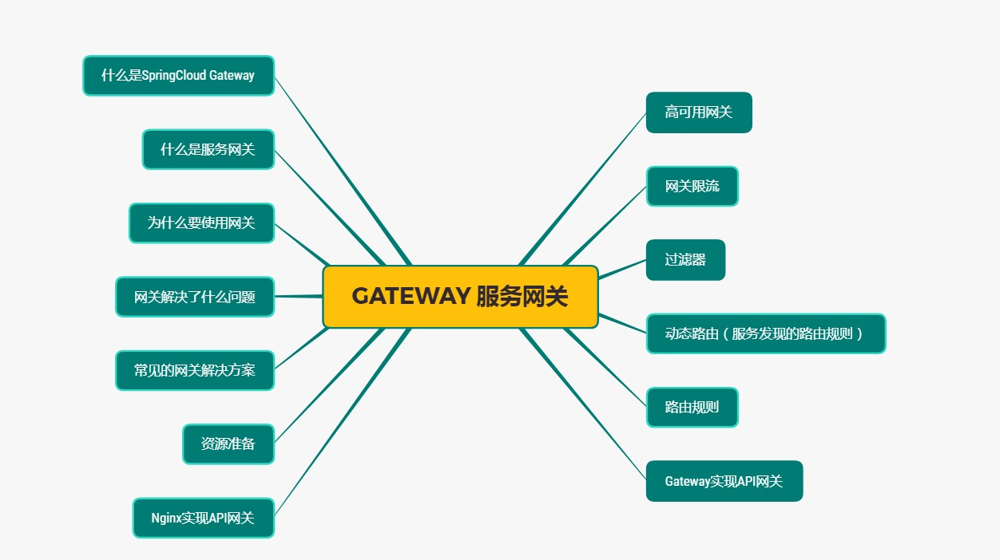
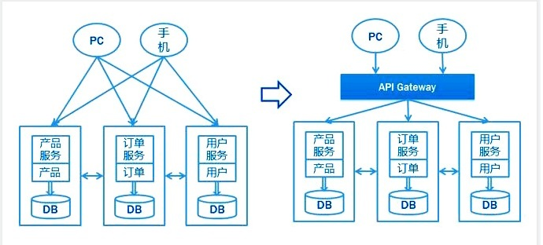
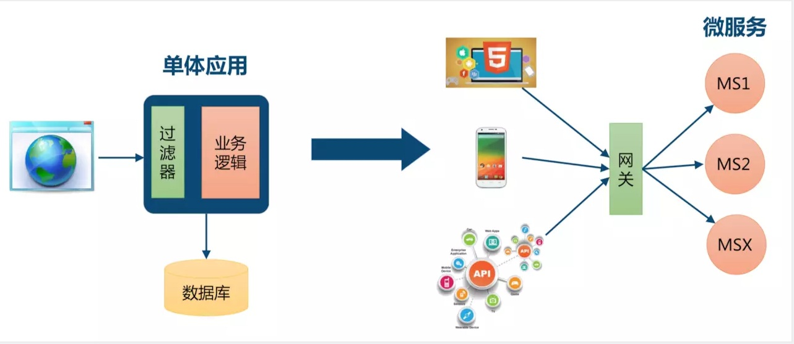
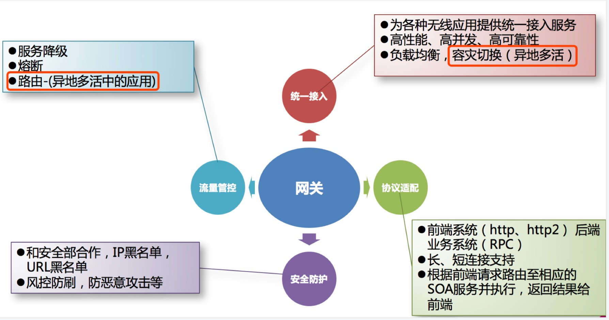
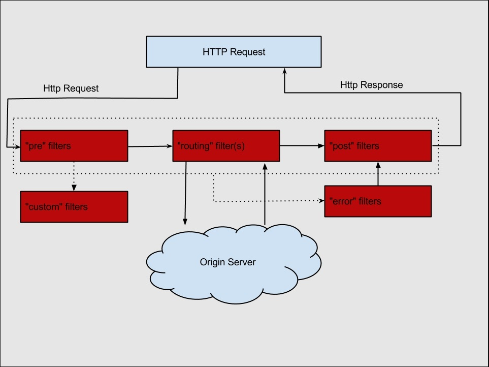

# Gateway网关简介（入门）

<a data-fancybox title="API Gateway简介" href="../image/Gateway.jpg"></a>

## 什么是 Spring Cloud Gateway
 Spring Cloud Gateway 作为 Spring Cloud 生态系统中的网关，目标是替代 Netflix Zuul，其不仅提供统一的路由方式，并且还基于 Filter 链的方式提供了网关基本的功能。目前最新版 Spring Cloud 中引用的还是 <font color='blue'>**Zuul 1.x 版本**</font>，而这个版本是<font color='blue'>**基于过滤器的，是阻塞 IO，不支持长连接**</font>。


 Zuul 2.x 版本一直跳票，2019 年 5 月，Netflix 终于开源了支持异步调用模式的 Zuul 2.0 版本，真可谓千呼万唤始出来。但是 Spring Cloud 已经不再集成 Zuul 2.x 了，那么是时候了解一下 Spring Cloud Gateway 了。

 **Spring Cloud Gateway 是基于 Spring 生态系统之上构建的 API 网关**，包括：Spring 5，Spring Boot 2 和Project Reactor。Spring Cloud Gateway 旨在提供一种简单而有效的方法来路由到 API，并为它们提供跨领域的关注点，例如：<font color='red'>**安全性，监视/指标，限流等**</font>。由于 Spring 5.0 支持 Netty，Http2，而 Spring Boot 2.0 支持 Spring5.0，因此 Spring Cloud Gateway 支持 <font color='red'>**Netty 和 Http2**</font> 顺理成章。

 ## 什么是服务网关


  <font color='red'>**API Gateway（APIGW / API 网关）**</font>，顾名思义，是出现在系统边界上的一个面向 API 的、串行集中式的强管控服务，这里的边界是企业 IT 系统的边界，可以理解为 企业级应用防火墙 ，主要起到 隔离外部访问与内部系统的作用 。在微服务概念的流行之前，API 网关就已经诞生了，例如银行、证券等领域常见的**前置机系统**，它也是<font color='red'>**解决访问认证、报文转换、访问统计**</font>等问题的。

 API 网关的流行，源于近几年来移动应用与企业间互联需求的兴起。移动应用、企业互联，使得后台服务支持的对象，从以前单一的Web应用，扩展到多种使用场景，且每种使用场景对后台服务的要求都不尽相同。这不仅增加了后台服务的响应量，还增加了后台服务的复杂性。 随着微服务架构概念的提出，API网关成为了微服务架构的一个标配组件 。

 API 网关是一个服务器，是系统对外的唯一入口。API 网关封装了系统内部架构，为每个客户端提供定制的API。所有的客户端和消费端都通过统一的网关接入微服务，在网关层处理所有非业务功能。API 网关并不是微服务场景中必须的组件，如下图，不管有没有 API 网关，后端微服务都可以通过 API 很好地支持客户端的访问。
<a data-fancybox title="API Gateway" href="../image/APIGateway.jpg"></a>
:::tip 网关的应用场景 
1. <font color='red'>**黑白名单**</font>：实现通过IP地址控制禁止访问网关功能，此功能是应用层面控制实现，再往前也可以通过网络传输方面进行控制访问。

2. <font color='red'>**日志**</font>：实现访问日志的记录，可用于分析访问、处理性能指标，同时将分析结果支持其他模块功能应用。

3. <font color='red'>**协议适配**</font>：实现通信协议校验、适配转换的功能。

4. <font color='red'>**身份认证**</font>：负责网关访问身份认证验证，此模块与“访问认证中心”通信，实际认证业务逻辑交移“访问认证中心”处理。

5. <font color='red'>**计流限流**</font>：实现微服务访问流量计算，基于流量计算分析进行限流，可以定义多种限流规则。

路由：<font color='red'>**路由是API网关很核心的模块功能，此模块实现根据请求，锁定目标微服务并将请求进行转发**</font>。此模块需要与“服务发布管理中心”通信。“服务发布管理中心”实现微服务发布注册管理功能，与其通信获得目标微服务信息。
:::

:::warning 对于服务数量众多、复杂度比较高、规模比较大的业务来说，引入 API 网关也有一系列的好处：
1. <font color='red'>**聚合接口使得服务对调用者透明，客户端与后端的耦合度降低**</font>
2. <font color='red'>**聚合后台服务，节省流量，提高性能，提升用户体验**</font>
3. <font color='red'>**提供安全、流控、过滤、缓存、计费、监控等 API 管理功能**</font>
:::

## 为什么要使用网关

<font color='red'>**单体应用**</font>：浏览器发起请求到单体应用所在的机器，应用从数据库查询数据原路返回给浏览器，**对于单体应用来说是不需要网关的**

<font color='red'>**微服务**</font>：微服务的应用可能部署在不同机房，不同地区，不同域名下。此时客户端（浏览器/手机/软件工具）想要请求对应的服务，都需要知道机器的具体 IP 或者域名 URL，当微服务实例众多时，这是非常难以记忆的，对于客户端来说也太复杂难以维护。**此时就有了网关，客户端相关的请求直接发送到网关，由网关根据请求标识**

<a data-fancybox title="网关" href="../image/wangguan.jpg"></a>

::: danger 如果让客户端直接与各个微服务交互
1. 客户端会多次请求不同的微服务，增加了客户端的复杂性
2. 存在跨域请求，在一定场景下处理相对复杂
3. 身份认证问题，每个微服务需要独立身份认证
4. 难以重构，随着项目的迭代，可能需要重新划分微服务
5. 某些微服务可能使用了防火墙/浏览器不友好的协议，直接访问会有一定的困难
:::

<font color='red'>**网关具有身份认证与安全、审查与监控、动态路由、负载均衡、缓存、请求分片与管理、静态响应处理等功能。当然最主要的职责还是与“外界联系”**</font>

<a data-fancybox title="网关功能" href="../image/wangguan2.jpg"></a>

:::warning 网关应当具备以下功能：
1. <font color='red'>**性能**</font>：API 高可用，负载均衡，容错机制。
2. <font color='red'>**安全**</font>：权限身份认证、脱敏，流量清洗，后端签名（保证全链路可信调用），黑名单（非法调用的限制）。
3. <font color='red'>**日志**</font>：日志记录，一旦涉及分布式，全链路跟踪必不可少。
4. <font color='red'>**缓存**</font>：数据缓存。
5. <font color='red'>**监控**</font>：记录请求响应数据，API 耗时分析，性能监控。
6. <font color='red'>**限流**</font>：流量控制，错峰流控，可以定义多种限流规则。
7. <font color='red'>**灰度**</font>：线上灰度部署，可以减小风险。
8. <font color='red'>**路由**</font>：动态路由规则。
:::

## 常用网关解决方案


:::tip 环境准备
eureka-server ：注册中心  
eureka-server02 ：注册中心  
product-service ：商品服务，提供了根据主键查询商品接口 http://localhost:7070/product/{id}  
order-service ：订单服务，提供了根据主键查询订单接口 http://localhost:9090/order/{id} 且订单服务调用商品服务   
:::

### Nginx + Lua
 
 Nginx 是由 IgorSysoev 为俄罗斯访问量第二的 Rambler.ru 站点开发的，一个高性能的 HTTP 和反向代理服务器。<font color='red'>**Ngnix 一方面可以做反向代理**</font>，另外一方面可以<font color='red'>**做静态资源服务器**</font>  
<font color='red'>**Nginx 适合做门户网关，是作为整个全局的网关，对外的处于最外层的那种**</font> ；而 <font color='blue'>**Gateway 属于业务网关，主要用来对应不同的客户端提供服务，用于聚合业务**</font> 。各个微服务独立部署，职责单一，对外提供服务的时候需要有一个东西把业务聚合起来  
<font color='red'>**Gateway 可以实现熔断、重试等功能，这是 Nginx 不具备的**</font>  

```sh
    server {
        listen 8081;
        server_name  tianqikai.top;
        # 路由到商品服务
        location /api-product {
                proxy_pass http://tianqikai.top:7070;
        }
        # 路由到订单服务
        location /api-order {
                proxy_pass http://tianqikai.top:9090;
        }
    }

```


### Kong
 
Kong 是 Mashape 提供的一款 API 管理软件，它本身是**基于 Ngnix + Lua 的，但比 Nginx 提供了更简单的配置方式**，数据采用了 ApacheCassandra/PostgreSQL 存储，并且提供了一些优秀的插件，比如验证，日志，调用频次限制等。Kong 非常诱人的地方就是提供了大量的插件来扩展应用，通过设置不同的插件可以为服务提供各种增强的功能。
优点：基于 Nginx 所以在性能和稳定性上都没有问题。Kong 作为一款商业软件，在 Nginx 上做了很扩展工作，而且还有很多付费的商业插件。Kong 本身也有付费的企业版，其中包括技术支持、使用培训服务以及 API分析插件。
缺点：如果你使用 Spring Cloud，Kong 如何结合目前已有的服务治理体系？


### Traefik
 
 Traefik 是一个开源的 GO 语言开发的为了让部署微服务更加便捷而诞生的现代HTTP反向代理、负载均衡工具。它支持多种后台 (Docker, Swarm, Kubernetes, Marathon, Mesos, Consul, Etcd, Zookeeper, BoltDB, Rest API,file…) 来自动化、动态的应用它的配置文件设置。Traefik 拥有一个基于 AngularJS 编写的简单网站界面，支持 RestAPI，配置文件热更新，无需重启进程。高可用集群模式等。
相对 Spring Cloud 和 Kubernetes 而言，<font color='red'>**目前比较适合 Kubernetes**</font>


### Spring Cloud Netflix Zuul
 
Zuul 是 Netflix 公司开源的一个 API 网关组件，Spring Cloud 对其进行二次基于 Spring Boot 的注解式封装做到开箱即用。目前来说，结合 Sring Cloud 提供的服务治理体系，可以做到请求转发，根据配置或者默认的路由规则进行路由和 Load Balance，**无缝集成 Hystrix** 
虽然可以通过自定义 Filter 实现我们想要的功能，但是由于 Zuul 本身的设计是基于 单线程的接收请求和转发处理 ，是阻塞 IO，不支持长连接。目前来看 Zuul 就显得很鸡肋，随着 Zuul 2.x 一直跳票（2019 年 5 月发布了Zuul 2.0 版本），Spring Cloud 推出自己的 Spring Cloud Gateway。大意就是：**Zuul 已死，Spring Cloud Gateway 永生**

**Zuul 1.0 服务架构**
<a data-fancybox title="Zuul 1.0" href="../image/zuul1.jpg"></a>

**Zuul 2.0 服务架构**
<a data-fancybox title="Zuul 2.0" href="../image/zuul2.jpg"></a>
### Spring Cloud Gateway